.. include:: ../../../_static/global.rst

Device Discovery Management & Maintenance
=========================================

Cisco Discovery Protocol (CDP) and Link Layer Discover Protocol (LLDP) are both capable of discovering information about directly connected devices. 

Network Time Protocol (NTP) can be effectively used to synchronize the time across all your networking devices, which is especially important when trying to compare log files from different devices. Those log files are generated by the syslog protocol. Syslog messages can be captured and sent to a syslog server to aid in device management tasks.

Cisco Discovery Protocol Operation
----------------------------------

Cisco Discovery Protocol (CDP) is a Cisco proprietary Layer 2 protocol that is used to gather information about Cisco devices which share the same data link. CDP is media and protocol independent and runs on all Cisco devices, such as routers, switches, and access servers.

The device sends periodic CDP advertisements to connected devices. These advertisements share information about the type of device that is discovered, the name of the devices, and the number and type of the interfaces.

CDP can assist in network design decisions, troubleshooting, and making changes to equipment. CDP can also be used as a network discovery tool to determine the information about the neighboring devices. This information gathered from CDP can help build a logical topology of a network when documentation is missing or lacking in detail.

Router# show cdp
 Verify the status of CDP & display information about CDP
Router(config)# cdp run
 enable CDP globally for all the supported interfaces
Router(config)# no cdp run
 disabe cdp for all the interfaces on the device
Router(config-if)# no cdp enable
 disable cdp for specific interface (eg ISP link)
Router# show cdp neighbors [detail]
 verify status of CDP & display list of neighbors. use to display the IFs that are CDP enabled, status of IF is also shown

.. note:: ``show cdp neighbors`` reveals the remote hostname - local IF - remote platform - remote IF - capabilities Router S(witch) I(GMP)

cdp exercise 10.1.1.4
---------------------

+-----------------+-----------+----------------+-----------------+-------------------------+
| Device          | Interface | IP Address     | Subnet Mask     | Local IF & Connected NB |
+=================+===========+================+=================+=========================+
| Edge1           | G0/0      | 192.168.1.1    | 255.255.255.0   | G0/0 - S1               |
+-----------------+-----------+----------------+-----------------+-------------------------+
|                 | S0/0/0    | 209.165.200.5  | 255.255.255.252 | S0/0/0 - ISP            |
+-----------------+-----------+----------------+-----------------+-------------------------+
| Branch-Edge     | S0/0/1    | 209.165.200.10 | 255.255.255.252 | S0/0/1  - ISP           |
+-----------------+-----------+----------------+-----------------+-------------------------+
|                 | G0/0      | 192.168.3.249  | 255.255.255.248 | G0/0 - Branch-Firewall  |
+-----------------+-----------+----------------+-----------------+-------------------------+
| Branch-Firewall | G0/0      | 192.168.3.253  | 255.255.255.248 | G0/0 - Branch-Edge      |
+-----------------+-----------+----------------+-----------------+-------------------------+
|                 | G0/1      | 192.168.4.129  | 255.255.255.128 | G0/1 - sw-br-floor2     |
+-----------------+-----------+----------------+-----------------+-------------------------+
| sw-br-floor1    | G0/2      | no mgmt ip     |                 | G0/2 - sw-br-floor2     |
+-----------------+-----------+----------------+-----------------+-------------------------+
|                 | G0/1      | no mgmt ip     |                 | G0/1 - Branch-Firewall  |
+-----------------+-----------+----------------+-----------------+-------------------------+
| sw-br-floor2    | vlan 1    | 192.168.4.132  | 255.255.255.128 | mgmt interface          |
+-----------------+-----------+----------------+-----------------+-------------------------+
|                 | G0/2      | 192.168.4.132  | 255.255.255.128 | G0/2 - sw-br-floor1     |
+-----------------+-----------+----------------+-----------------+-------------------------+
|                 | G0/1      | 192.168.4.132  | 255.255.255.128 | G0/1 - Branch-Firewall  |
+-----------------+-----------+----------------+-----------------+-------------------------+
|                 | Fa0/24    | 192.168.4.132  | 255.255.255.128 | Fa0/24 - sw-br-floor3   |
+-----------------+-----------+----------------+-----------------+-------------------------+
| sw-br-floor3    | vlan 1    | 192.168.4.133  | 255.255.255.128 | mgmt interface          |
+-----------------+-----------+----------------+-----------------+-------------------------+
|                 | G0/1      |                |                 | G0/1 - sw-br-floor1     |
+-----------------+-----------+----------------+-----------------+-------------------------+
|                 | Fa0/24    |                |                 | Fa0/24 - sw-br-floor2   |
+-----------------+-----------+----------------+-----------------+-------------------------+

Map a network using CDP and SSH remote access

Local Network
Username: admin01
Password: S3cre7P@55

Branch Office Network
Username: branchadmin
Password: S3cre7P@55

#. On Admin-PC open CMD and SSH into the gateway router at 192.168.1.1 using the username admin01 and the password S3cre7P@55

   .. code::
   
      PC> ssh –l admin01 192.168.1.1
   
   .. note:: Notice that you are placed directly into privileged EXEC mode. This is because the admin01 user account is set to privilege level 15.

#. Use the show ip interface brief and show interfaces commands to document the Edge1 router’s physical interfaces, IP addresses , and subnet masks in the Addressing Table.

   .. code::

      Edge1# show ip interface brief
      Interface              IP-Address      OK? Method Status                Protocol 
      GigabitEthernet0/0     192.168.1.1     YES manual up                    up 
      GigabitEthernet0/1     unassigned      YES unset  administratively down down 
      Serial0/0/0            209.165.200.5   YES manual up                    up 
      Serial0/0/1            unassigned      YES unset  administratively down down 
      Vlan1                  unassigned      YES unset  administratively down down
      
      Edge1#show interfaces
      GigabitEthernet0/0 is up, line protocol is up (connected)
        Hardware is CN Gigabit Ethernet, address is 00e0.a3dd.7001 (bia 00e0.a3dd.7001)
        Internet address is 192.168.1.1/24
        MTU 1500 bytes, BW 1000000 Kbit, DLY 10 usec,
           reliability 255/255, txload 1/255, rxload 1/255
        Encapsulation ARPA, loopback not set
        Keepalive set (10 sec)
        Full-duplex, 100Mb/s, media type is RJ45
        output flow-control is unsupported, input flow-control is unsupported
        ARP type: ARPA, ARP Timeout 04:00:00, 
        Last input 00:00:08, output 00:00:05, output hang never
        Last clearing of "show interface" counters never
        Input queue: 0/75/0 (size/max/drops); Total output drops: 0
        Queueing strategy: fifo
        Output queue :0/40 (size/max)
        5 minute input rate 40 bits/sec, 0 packets/sec
        5 minute output rate 31 bits/sec, 0 packets/sec
           115 packets input, 4666 bytes, 0 no buffer
           Received 0 broadcasts, 0 runts, 0 giants, 0 throttles
           0 input errors, 0 CRC, 0 frame, 0 overrun, 0 ignored, 0 abort
           0 watchdog, 1017 multicast, 0 pause input
           0 input packets with dribble condition detected
           64 packets output, 2616 bytes, 0 underruns
           0 output errors, 0 collisions, 1 interface resets
           0 unknown protocol drops
           0 babbles, 0 late collision, 0 deferred
           0 lost carrier, 0 no carrier
           0 output buffer failures, 0 output buffers swapped out
      GigabitEthernet0/1 is administratively down, line protocol is down (disabled)
        Hardware is CN Gigabit Ethernet, address is 00e0.a3dd.7002 (bia 00e0.a3dd.7002)
        MTU 1500 bytes, BW 1000000 Kbit, DLY 10 usec,
           reliability 255/255, txload 1/255, rxload 1/255
        Encapsulation ARPA, loopback not set
        Keepalive set (10 sec)
        Full-duplex, 100Mb/s, media type is RJ45
        output flow-control is unsupported, input flow-control is unsupported
        ARP type: ARPA, ARP Timeout 04:00:00, 
        Last input 00:00:08, output 00:00:05, output hang never
        Last clearing of "show interface" counters never
        Input queue: 0/75/0 (size/max/drops); Total output drops: 0
        Queueing strategy: fifo
        Output queue :0/40 (size/max)
        5 minute input rate 0 bits/sec, 0 packets/sec
        5 minute output rate 0 bits/sec, 0 packets/sec
           0 packets input, 0 bytes, 0 no buffer
           Received 0 broadcasts, 0 runts, 0 giants, 0 throttles
           0 input errors, 0 CRC, 0 frame, 0 overrun, 0 ignored, 0 abort
           0 watchdog, 1017 multicast, 0 pause input
           0 input packets with dribble condition detected
           0 packets output, 0 bytes, 0 underruns
           0 output errors, 0 collisions, 2 interface resets
           0 unknown protocol drops
           0 babbles, 0 late collision, 0 deferred
           0 lost carrier, 0 no carrier
           0 output buffer failures, 0 output buffers swapped out
      Serial0/0/0 is up, line protocol is up (connected)
        Hardware is HD64570
        Internet address is 209.165.200.5/30
        MTU 1500 bytes, BW 1544 Kbit, DLY 20000 usec,
           reliability 255/255, txload 1/255, rxload 1/255
        Encapsulation HDLC, loopback not set, keepalive set (10 sec)
        Last input never, output never, output hang never
        Last clearing of "show interface" counters never
        Input queue: 0/75/0 (size/max/drops); Total output drops: 0
        Queueing strategy: weighted fair
        Output queue: 0/1000/64/0 (size/max total/threshold/drops)
           Conversations  0/0/256 (active/max active/max total)
           Reserved Conversations 0/0 (allocated/max allocated)
           Available Bandwidth 1158 kilobits/sec
        5 minute input rate 0 bits/sec, 0 packets/sec
        5 minute output rate 0 bits/sec, 0 packets/sec
           0 packets input, 0 bytes, 0 no buffer
           Received 0 broadcasts, 0 runts, 0 giants, 0 throttles
           0 input errors, 0 CRC, 0 frame, 0 overrun, 0 ignored, 0 abort
           0 packets output, 0 bytes, 0 underruns
           0 output errors, 0 collisions, 1 interface resets
           0 output buffer failures, 0 output buffers swapped out
           0 carrier transitions
           DCD=up  DSR=up  DTR=up  RTS=up  CTS=up
      Serial0/0/1 is administratively down, line protocol is down (disabled)
        Hardware is HD64570
        MTU 1500 bytes, BW 1544 Kbit, DLY 20000 usec,
           reliability 255/255, txload 1/255, rxload 1/255
        Encapsulation HDLC, loopback not set, keepalive set (10 sec)
        Last input never, output never, output hang never
        Last clearing of "show interface" counters never
        Input queue: 0/75/0 (size/max/drops); Total output drops: 0
        Queueing strategy: weighted fair
        Output queue: 0/1000/64/0 (size/max total/threshold/drops)
           Conversations  0/0/256 (active/max active/max total)
           Reserved Conversations 0/0 (allocated/max allocated)
           Available Bandwidth 1158 kilobits/sec
        5 minute input rate 0 bits/sec, 0 packets/sec
        5 minute output rate 0 bits/sec, 0 packets/sec
           0 packets input, 0 bytes, 0 no buffer
           Received 0 broadcasts, 0 runts, 0 giants, 0 throttles
           0 input errors, 0 CRC, 0 frame, 0 overrun, 0 ignored, 0 abort
           0 packets output, 0 bytes, 0 underruns
           0 output errors, 0 collisions, 2 interface resets
           0 output buffer failures, 0 output buffers swapped out
           0 carrier transitions
           DCD=down  DSR=down  DTR=down  RTS=down  CTS=down
      Vlan1 is administratively down, line protocol is down
        Hardware is CPU Interface, address is 0060.70bd.dd13 (bia 0060.70bd.dd13)
        MTU 1500 bytes, BW 100000 Kbit, DLY 1000000 usec,
           reliability 255/255, txload 1/255, rxload 1/255
        Encapsulation ARPA, loopback not set
        ARP type: ARPA, ARP Timeout 04:00:00
        Last input 21:40:21, output never, output hang never
        Last clearing of "show interface" counters never
        Input queue: 0/75/0/0 (size/max/drops/flushes); Total output drops: 0
        Queueing strategy: fifo
        Output queue: 0/40 (size/max)
        5 minute input rate 0 bits/sec, 0 packets/sec
        5 minute output rate 0 bits/sec, 0 packets/sec
           1682 packets input, 530955 bytes, 0 no buffer
           Received 0 broadcasts (0 IP multicast)
           0 runts, 0 giants, 0 throttles
           0 input errors, 0 CRC, 0 frame, 0 overrun, 0 ignored
           563859 packets output, 0 bytes, 0 underruns
           0 output errors, 23 interface resets
           0 output buffer failures, 0 output buffers swapped out

#. Using the Edge1 router’s CLI, you will SSH into the Remote Branch Office at 209.165.200.10 with the username branchadmin and the same password
    Password: 
    
   .. code:: 

      Edge1# ssh –l branchadmin 209.165.200.10 
      Branch-Edge#

    After connecting to the Remote Branch Office at 209.165.200.10 what piece of previously missing information can now be added to the Addressing Table above?
    
    hostname Branche-Edge, Branch-Firewall hostnames and their ip address + subnet mask 
    
    .. code::

       Branch-Edge#show cdp neighbors detail
       
       Device ID: Branch-Firewall
       Entry address(es): 
         IP address : 192.168.3.253
       Platform: cisco C1900, Capabilities: Router
       Interface: GigabitEthernet0/0, Port ID (outgoing port): GigabitEthernet0/0
       Holdtime: 154       

#. disable cdp on link to ISP

   .. code::

      Branch-Edge(config)#interface S0/0/1
      Branch-Edge(config-if)#no cdp enable
      Branch-Edge(config-if)#exit
      Branch-Edge(config)#cdp run
      Branch-Edge(config)#

#. check NBs on Branch-Edge

   .. code::

      Branch-Edge(config)#do show cdp neighbors detail
      
      Device ID: Branch-Firewall
      Entry address(es): 
        IP address : 192.168.3.253
      ...

#. ssh into the firewall
   
   .. code::
      
      Branch-Edge#ssh -l branchadmin 192.168.3.253
      Open
      Password: 
      
      Branch-Firewall# 

#. check NBs on Branch-Firewall

   .. code::

      Branch-Firewall#show cdp neighbors
      Capability Codes: R - Router, T - Trans Bridge, B - Source Route Bridge
                        S - Switch, H - Host, I - IGMP, r - Repeater, P - Phone
      Device ID    Local Intrfce   Holdtme    Capability   Platform    Port ID
      sw-br-floor2 
                   Gig 0/1          137            S       2960        Gig 0/1
      Branch-Edge  Gig 0/0          171            R       C1900       Gig 0/0

      Branch-Firewall#show cdp neighbors detail
      
      Device ID: sw-br-floor2
      Entry address(es): 
        IP address : 192.168.4.132
      Platform: cisco 2960, Capabilities: Switch
      Interface: GigabitEthernet0/1, Port ID (outgoing port): GigabitEthernet0/1
      Holdtime: 130
      
      Version :
      Cisco IOS Software, C2960 Software (C2960-LANBASE-M), Version 12.2(25)FX, RELEASE SOFTWARE (fc1)
      Copyright (c) 1986-2005 by Cisco Systems, Inc.
      Compiled Wed 12-Oct-05 22:05 by pt_team
      
      advertisement version: 2
      Duplex: full
      ---------------------------
      
      Device ID: Branch-Edge
      Entry address(es): 
        IP address : 192.168.3.249
      Platform: cisco C1900, Capabilities: Router
      Interface: GigabitEthernet0/0, Port ID (outgoing port): GigabitEthernet0/0
      Holdtime: 165
      
      Version :
      Cisco IOS Software, C1900 Software (C1900-UNIVERSALK9-M), Version 15.1(4)M4, RELEASE SOFTWARE (fc2)
      Technical Support: http://www.cisco.com/techsupport
      Copyright (c) 1986-2012 by Cisco Systems, Inc.
      Compiled Thurs 5-Jan-12 15:41 by pt_team
      
      advertisement version: 2
      Duplex: full
      
      Branch-Firewall#

#. explore the discovered switch via ssh

   .. code::

	  Branch-Firewall#ssh -l branchadmin 192.168.4.132
	  Open
	  Password: 
	  
	  sw-br-floor2>
	  sw-br-floor2>show ip int brief
	  Interface              IP-Address      OK? Method Status                Protocol 
	  ...
	  FastEthernet0/24       unassigned      YES manual up                    up 
	  GigabitEthernet0/1     unassigned      YES manual up                    up 
	  GigabitEthernet0/2     unassigned      YES manual up                    up 
	  Vlan1                  192.168.4.132   YES manual up                    up
	  ------------------
	  sw-br-floor2>
	  sw-br-floor2>show cdp neighbors detail
	  Device ID: sw-br-floor3
	  Entry address(es): 
	    IP address : 192.168.4.133
	  Platform: cisco 2960, Capabilities: Switch
	  Interface: FastEthernet0/24, Port ID (outgoing port): FastEthernet0/24
	  Holdtime: 139
	  
	  Version :
	  Cisco IOS Software, C2960 Software (C2960-LANBASE-M), Version 12.2(25)FX, RELEASE SOFTWARE (fc1)
	  Copyright (c) 1986-2005 by Cisco Systems, Inc.
	  Compiled Wed 12-Oct-05 22:05 by pt_team
	  
	  advertisement version: 2
	  Duplex: full
	  ---------------------------
	  
	  Device ID: Branch-Firewall
	  Entry address(es): 
	    IP address : 192.168.4.129
	  Platform: cisco C1900, Capabilities: Router
	  Interface: GigabitEthernet0/1, Port ID (outgoing port): GigabitEthernet0/1
	  Holdtime: 139
	  
	  Version :
	  Cisco IOS Software, C1900 Software (C1900-UNIVERSALK9-M), Version 15.1(4)M4, RELEASE SOFTWARE (fc2)
	  Technical Support: http://www.cisco.com/techsupport
	  Copyright (c) 1986-2012 by Cisco Systems, Inc.
	  Compiled Thurs 5-Jan-12 15:41 by pt_team
	  
	  advertisement version: 2
	  Duplex: full
	  ---------------------------
	  
	  Device ID: sw-br-floor1
	  Entry address(es): 
	  Platform: cisco 2960, Capabilities: Switch
	  Interface: GigabitEthernet0/2, Port ID (outgoing port): GigabitEthernet0/2
	  Holdtime: 139
	  
	  Version :
	  Cisco IOS Software, C2960 Software (C2960-LANBASE-M), Version 12.2(25)FX, RELEASE SOFTWARE (fc1)
	  Copyright (c) 1986-2005 by Cisco Systems, Inc.
	  Compiled Wed 12-Oct-05 22:05 by pt_team
	  
	  advertisement version: 2
	  Duplex: full
	  ----------------------------------------------
	  sw-br-floor2>

   Add the vlan ip and the newly discovered switch to the addressing table

#. Verify there are no ip addresses left by using traceroute and even ``show arp``

   .. code::

      sw-br-floor3>traceroute 209.165.200.5
      Type escape sequence to abort.
      Tracing the route to 209.165.200.5
      
        1   192.168.4.129   0 msec    0 msec    0 msec    
        2   192.168.3.249   0 msec    0 msec    0 msec    
        3   209.165.200.9   2 msec    1 msec    0 msec    
        4   209.165.200.5   1 msec    2 msec    1 msec

      Branch-Firewall#show arp
      Protocol  Address          Age (min)  Hardware Addr   Type   Interface
      Internet  192.168.3.249           67  0001.9660.0053  ARPA   GigabitEthernet0/0
      Internet  192.168.3.253           -   00D0.D351.0601  ARPA   GigabitEthernet0/0
      Internet  192.168.4.129           -   00D0.D351.0602  ARPA   GigabitEthernet0/1
      Internet  192.168.4.132           53  0060.70C4.E374  ARPA   GigabitEthernet0/1
      Internet  192.168.4.133           12  0090.2173.AC1D  ARPA   GigabitEthernet0/1
     
enable password is unkown and switch 1 doesn't have a mgmt ip address so we can't explore further

 .. code::
 
    sw-br-floor2>show cdp neighbors detail
    Device ID: sw-br-floor3
    Entry address(es): 
      IP address : 192.168.4.133
    Platform: cisco 2960, Capabilities: Switch
    Interface: FastEthernet0/24, Port ID (outgoing port): FastEthernet0/24
    Holdtime: 139
    
    Version :
    Cisco IOS Software, C2960 Software (C2960-LANBASE-M), Version 12.2(25)FX, RELEASE SOFTWARE (fc1)
    Copyright (c) 1986-2005 by Cisco Systems, Inc.
    Compiled Wed 12-Oct-05 22:05 by pt_team
    
    advertisement version: 2
    Duplex: full
    ---------------------------
    
    Device ID: Branch-Firewall
    Entry address(es): 
      IP address : 192.168.4.129
    Platform: cisco C1900, Capabilities: Router
    Interface: GigabitEthernet0/1, Port ID (outgoing port): GigabitEthernet0/1
    Holdtime: 139
    
    Version :
    Cisco IOS Software, C1900 Software (C1900-UNIVERSALK9-M), Version 15.1(4)M4, RELEASE SOFTWARE (fc2)
    Technical Support: http://www.cisco.com/techsupport
    Copyright (c) 1986-2012 by Cisco Systems, Inc.
    Compiled Thurs 5-Jan-12 15:41 by pt_team
    
    advertisement version: 2
    Duplex: full
    ---------------------------
    
    Device ID: sw-br-floor1
    Entry address(es): 
    Platform: cisco 2960, Capabilities: Switch
    Interface: GigabitEthernet0/2, Port ID (outgoing port): GigabitEthernet0/2
    Holdtime: 139
    
    Version :
    Cisco IOS Software, C2960 Software (C2960-LANBASE-M), Version 12.2(25)FX, RELEASE SOFTWARE (fc1)
    Copyright (c) 1986-2005 by Cisco Systems, Inc.
    Compiled Wed 12-Oct-05 22:05 by pt_team
    
    advertisement version: 2
    Duplex: full
    
    sw-br-floor2>
        !
        interface FastEthernet0/10
         switchport access vlan 30
         switchport mode access
         shutdown
        !
        interface FastEthernet0/11
         description link2FileServerVLAN15
         switchport access vlan 15
         switchport mode access
        !
        interface FastEthernet0/12
         switchport access vlan 15
         switchport mode access
         shutdown
        !
        interface FastEthernet0/13
         switchport access vlan 15
         switchport mode access
         shutdown
        !
        interface FastEthernet0/14
         switchport access vlan 15
         switchport mode access
         shutdown
        !
        interface FastEthernet0/15
         switchport access vlan 15
         switchport mode access
         shutdown
        !
        interface FastEthernet0/16
         switchport access vlan 15
         switchport mode access
         shutdown
        !
        interface FastEthernet0/17
         switchport access vlan 15
         switchport mode access
         shutdown
        !
        interface FastEthernet0/18
         switchport access vlan 15
         switchport mode access
         shutdown
        !
        interface FastEthernet0/19
         switchport access vlan 15
         switchport mode access
         shutdown
        !
        interface FastEthernet0/20
         switchport access vlan 15
         switchport mode access
         shutdown
        !
        interface FastEthernet0/21
         switchport mode access
         switchport port-security violation restrict 
         shutdown
        !
        interface FastEthernet0/22
         switchport port-security violation restrict 
        !
        interface FastEthernet0/23
         switchport port-security violation restrict 
        !
        interface FastEthernet0/24
         switchport port-security violation restrict 
        !
        interface GigabitEthernet0/1
         description link_Trunk2Central
         switchport trunk native vlan 45
         switchport trunk allowed vlan 15,30,45,60
         switchport mode trunk
        !
        interface GigabitEthernet0/2
         switchport trunk native vlan 45
         switchport trunk allowed vlan 15,30,45,60
         switchport mode trunk
         shutdown
        !
        interface Vlan1
         no ip address
         shutdown
        !
        interface Vlan60
         mac-address 0001.c9aa.4801
         ip address 172.16.15.10 255.255.255.248
        !
        ip default-gateway 172.16.15.9
        !
        !
        !
        !
        line con 0
        !
        line vty 0 4
         login local
         transport input ssh
         transport output none
        line vty 5 15
         login local
         transport input ssh
         transport output none
        !
        !
        !
        end

Link Layer Discovery Protocol
-----------------------------

LLDP
 A vendor-neutral neighbor discovery protocol similar to CDP. Works with Routers,Switches,WLAN APs. Advertises its identity and capabilities over L2

Configuration
^^^^^^^^^^^^^

.. code::
   
   Switch# conf t
   Switch(config)# lldp run
   Switch(config)# interface gigabitethernet 0/1
   Switch(config-if)# lldp transmit
   Switch(config-if)# lldp receive
   Switch# show lldp

   Global LLDP Information:
       Status: ACTIVE
       LLDP advertisements are sent every 30 seconds
       LLDP hold time advertised is 120 seconds
       LLDP interface reinitialisation delay is 2 seconds

   Switch# show lldp neighbors
   Switch# show lldp neighbors detail

comparison neighbors information
^^^^^^^^^^^^^^^^^^^^^^^^^^^^^^^^
cdp
 
 .. code::

    S3# show cdp neighbors
    Capability Codes: R - Router, T - Trans Bridge, B - Source Route Bridge 
                      S - Switch, H - Host, I - IGMP, r - Repeater, P - Phone, 
                      D - Remote, C - CVTA, M - Two- port Mac Relay 
    Device ID        Local Intrfce     Holdtme    Capability  Platform  Port ID 
    Gateway          Fas 0/5           143            R B S I CISCO1941 Gig 0/1 
    S2               Fas 0/2           173              S I   WS-C2960- Fas 0/4 
    S1               Fas 0/4           171              S I   WS-C2960- Fas 0/4 

lldp

 .. code::

    Capability codes:(R) Router, (B) Bridge, (T) Telephone, (C) DOCSIS Cable Device 
                     (W) WLAN Access Point, (P) Repeater, (S) Station, (O) Other 
    Device ID           Local Intf     Hold-time  Capability    Port ID 
    S3                  Gi0/1          120        B               Fa0/5 
    Total entries displayed: 1 

+--------------------------------+--------------------------------------------------+
| cdp                            | lldp                                             |
+================================+==================================================+
| R# show cdp                    | R# show lldp [traffic]                           |
+--------------------------------+--------------------------------------------------+
| R(config)# cdp run             | R(config)# lldp run                              |
+--------------------------------+--------------------------------------------------+
| R(config)# no cdp run          | R(config)# no lldp run                           |
+--------------------------------+--------------------------------------------------+
| R# show cdp interface [if-id]  | R# show lldp interface [if-id]                   |
+--------------------------------+--------------------------------------------------+
| R# show cdp neighbors [detail] | R# show lldp neighbors [detail]                  |
+--------------------------------+--------------------------------------------------+
| R(config-if)# cdp enable       | R(config-if)# lldp transmit  & lldp receive      |
+--------------------------------+--------------------------------------------------+
| R(config-if)# no cdp enable    | R(config-if)# no lldp transmit & no lldp receive |
+--------------------------------+--------------------------------------------------+

.. note:: The show cdp neighbors command can be used to prove that Layer 1 and Layer 2 connectivity exists between two Cisco devices. For example, if two devices have duplicate IP addresses, a ping between the devices will fail, but the output of show cdp neighbors will be successful. The show cdp neighbors detail could be used to verify the IP address of the directly connected device in case the same IP address is assigned to the two routers.

.. note:: The show cdp neighbors detail command reveals the IP address of a neighboring device regardless of whether you can ping the neighbor

.. note:: The show cdp neighbors command provides information on directly connected Cisco devices including Device ID, local interface, capability, platform, and port ID of the remote device.

.. note:: Cisco developed NetFlow for the purpose of gathering statistics on packets flowing through Cisco routers and multilayer switches. SNMP can be used to collect and store information about a device. Syslog is used to access and store system messages. NTP is used to allow network devices to synchronize time settings.

NTP
---

set clock manually (you'd be an idiot but hey learn the command)

.. code::

   R1# clock set 20:36:00 dec 11 2015
   R1# clock timezone PST -8 
   R1# clock summer-time PDT recurring

Configure the Network Time Protocol (NTP)

When NTP is implemented in the network, it can be set up to synchronize to a private master clock or it can synchronize to a publicly available NTP server on the Internet.

.. note:: NTP uses UDP port 123 and is documented in RFC 1305.

NTP Stratum Labels
------------------

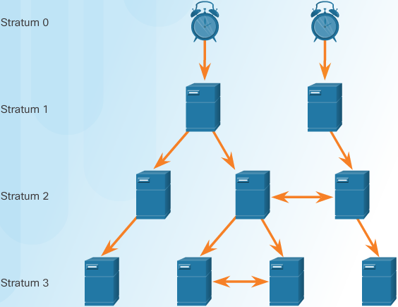

.. note:: The stratum level is defined as the number of hop counts from the authoritative source.

Stratum 0
 An NTP network gets the time from authoritative time sources. These authoritative time sources, also referred to as stratum 0 devices, are high-precision timekeeping devices assumed to be accurate and with little or no delay associated with them. Stratum 0 devices are represented by the clock in the figure.

Stratum 1
 The stratum 1 devices are directly connected to the authoritative time sources. They act as the primary network time standard.

Stratum 2 and Lower
 The stratum 2 servers are connected to stratum 1 devices through network connections. Stratum 2 devices, such as NTP clients, synchronize their time using the NTP packets from stratum 1 servers. They could also act as servers for stratum 3 devices.

Smaller stratum numbers
 indicate that the server is closer to the authorized time source than larger stratum numbers. The larger the stratum number, the lower the stratum level. The **max hop count is 15. Stratum 16, the lowest stratum level, indicates that a device is unsynchronized**. Time servers on the **same stratum level** can be configured to act as a peer with other time servers on the same stratum level **for backup or verification of time**.

Verify NTP Server Config
------------------------

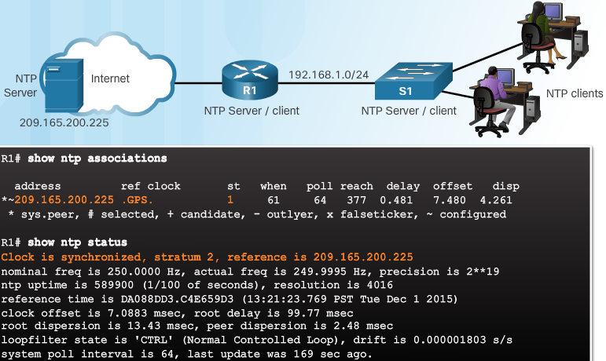

+------------------------------------+----------------------------------------------------+
| command                            | description                                        |
+====================================+====================================================+
| show clock detail                  | check the Time Source                              |
+------------------------------------+----------------------------------------------------+
| show ntp associations              | verify that R1 is synchronized with the NTP server |
+------------------------------------+----------------------------------------------------+
| show ntp status                    | verify synchronization + view stratum              |
+------------------------------------+----------------------------------------------------+
| S1(config)# ntp server 192.168.1.1 | configure ntp source/server                        |
+------------------------------------+----------------------------------------------------+

.. code::

   R2>en
   R2#ping 209.165.200.225
   
   Type escape sequence to abort.
   Sending 5, 100-byte ICMP Echos to 209.165.200.225, timeout is 2 seconds:
   .!!!!
   Success rate is 80 percent (4/5), round-trip min/avg/max = 0/0/0 ms
   
   R2#conf t
   Enter configuration commands, one per line.  End with CNTL/Z.
   R2(config)#ntp server 209.165.200.225
   R2(config)#do show clock
   15:13:8.338 UTC Wed Oct 4 2017
   R2(config)#do show clock detail
   15:13:12.329 UTC Wed Oct 4 2017
   Time source is NTP
   R2(config)#do show clock detail
   15:13:32.787 UTC Wed Oct 4 2017
   Time source is NTP
   R2(config)#exit
   R2#
   %SYS-5-CONFIG_I: Configured from console by console
   
   R2#show ntp
   R2#show ntp associations
   % This command is not supported by Packet Tracer.
   R2#show ntp ?
     associations  NTP associations
     status        NTP status
   R2#show ntp status 
   Clock is synchronized, stratum 2, reference is 209.165.200.225
   nominal freq is 250.0000 Hz, actual freq is 249.9990 Hz, precision is 2**19
   reference time is FFFFFFFFDD5548E2.00000060 (15:12:34.096 UTC Wed Oct 4 2017)
   clock offset is 0.00 msec, root delay is 0.00  msec
   root dispersion is 0.02 msec, peer dispersion is 0.02 msec.
   R2#

Syslog
------

Syslog
 uses UDP port 514 to send event notification messages across IP networks to event message collectors. The protocol allows networking devices to send their system messages across the network to syslog servers

The syslog logging service provides three primary functions:

 #. The ability to gather logging information for monitoring and troubleshooting

 #. The ability to select the type of logging information that is captured

 #. The ability to specify the destinations of captured syslog messages

Syslog intro
------------

On Cisco network devices, the syslog protocol starts by **sending system messages and debug output to a local logging process internal to the device**.
**How the logging process manages these messages and outputs is based on device configurations**. For example, syslog messages may be sent across the network to an external syslog server. These messages can be retrieved without the need of accessing the actual device. Log messages and outputs stored on the external server can be pulled into various reports for easier reading. 

Alternatively, syslog messages may be sent to an internal buffer. Messages sent to the **internal buffer** are only viewable through the CLI of the device. 

Finally, the network administrator may specify that only certain types of system messages are sent to various destinations. For example, the device may be configured to forward all system messages to an external syslog server. However, debug-level messages are forwarded to the internal buffer and are only accessible by the administrator from the CLI.

popular destinations for syslog messages include
 + Logging buffer (RAM inside a router or switch)
 + Console line
 + Terminal line
 + Syslog server

It is possible to remotely monitor system messages by viewing the logs on a syslog server, or by accessing the device through Telnet, SSH, or through the console port.

Syslog RFCs
-----------

+-----------------------------------------------------------------------+-------------+
| syslog relation                                                       | RFC         |
+=======================================================================+=============+
| The BSD syslog Protocol (obsoleted by RFC 5424)                       | `rfc 3164`_ |
+-----------------------------------------------------------------------+-------------+
| Reliable Delivery for syslog                                          | `rfc 3195`_ |
+-----------------------------------------------------------------------+-------------+
| The Syslog Protocol                                                   | `rfc 5424`_ |
+-----------------------------------------------------------------------+-------------+
| TLS Transport Mapping for Syslog                                      | `rfc 5425`_ |
+-----------------------------------------------------------------------+-------------+
| Transmission of Syslog Messages over UDP                              | `rfc 5426`_ |
+-----------------------------------------------------------------------+-------------+
| Textual Conventions for Syslog Management                             | `rfc 5427`_ |
+-----------------------------------------------------------------------+-------------+
| Signed Syslog Messages                                                | `rfc 5848`_ |
+-----------------------------------------------------------------------+-------------+
| Datagram Transport Layer Security (DTLS) Transport Mapping for Syslog | `rfc 6012`_ |
+-----------------------------------------------------------------------+-------------+
| Transmission of Syslog Messages over TCP                              | `rfc 6587`_ |
+-----------------------------------------------------------------------+-------------+

Severity level
--------------
The list of severities is also defined by `rfc 5424`_

+-------+---------------+---------+---------------+--------------------------------------------------------------------------+
| value | severity      | keyword | depr. keyword | description                                                              |
+=======+===============+=========+===============+==========================================================================+
| 0     | Emergency     | emerg   | panic         | System is unusable                                                       |
|       |               |         |               | A panic condition                                                        |
+-------+---------------+---------+---------------+--------------------------------------------------------------------------+
| 1     | Alert         | alert   |               | Action must be taken immediately                                         |
|       |               |         |               | A condition that should be corrected immediately, such as a corrupted DB |
+-------+---------------+---------+---------------+--------------------------------------------------------------------------+
| 2     | Critical      | crit    |               | Critical conditions, such as hard device errors                          |
+-------+---------------+---------+---------------+--------------------------------------------------------------------------+
| 3     | Error         | err     | error         | Error conditions                                                         |
+-------+---------------+---------+---------------+--------------------------------------------------------------------------+
| 4     | Warning       | warning | warn          | Warning conditions                                                       |
+-------+---------------+---------+---------------+--------------------------------------------------------------------------+
| 5     | Notice        | notice  |               | Normal but significant conditions                                        |
|       |               |         |               | Conditions that aren't error conditions but require special handling     |
+-------+---------------+---------+---------------+--------------------------------------------------------------------------+
| 6     | Informational | info    |               | Informational messages                                                   |
+-------+---------------+---------+---------------+--------------------------------------------------------------------------+
| 7     | Debug         | debug   |               | Debug-level messages                                                     |
|       |               |         |               | Messages that contain information of use only when debugging a program   |
+-------+---------------+---------+---------------+--------------------------------------------------------------------------+

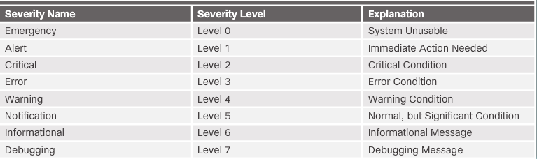

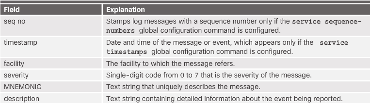

The meaning of severity levels other than Emergency and Debug are relative to the application. For example, if the purpose of the system is to process transactions to update customer account balance information, an error in the final step should be assigned Alert level. However, an error occurring in an attempt to display the ZIP code of the customer may be assigned Error or even Warning level.

The server process which handles the message (syslogd) usually includes all lower (more severe) levels. That is, if messages are separated by individual severity, a Warning level entry will also be included in Notice, Info and Debug processing.

In addition to specifying the severity, syslog messages also contain information on the facility. Syslog facilities are service identifiers that identify and categorize system state data for error and event message reporting. The logging facility options that are available are specific to the networking device. For example, Cisco 2960 Series switches running Cisco IOS Release 15.0(2) and Cisco 1941 routers running Cisco IOS Release 15.2(4) support 24 facility options that are categorized into 12 facility types.

Some common syslog message facilities reported on Cisco IOS routers include

+ IP
+ OSPF protocol
+ SYS operating system
+ IP security (IPsec)
+ Interface IP (IF)

By default, the format of syslog messages on the Cisco IOS Software is as follows:

``seq no: timestamp: %facility-severity-MNEMONIC: description``

For example, sample output on a Cisco switch for an EtherChannel link changing state to up is:

``00:00:46: %LINK-3-UPDOWN: Interface Port-channel1, changed state to up``

**Facility-SecurityLvl-Mnemonic:**
Here the facility is **LINK** and the severity level is **3**, with a MNEMONIC of **UPDOWN**.

The most common messages are link up and down messages, and messages that a device produces when it exits from configuration mode. If ACL logging is configured, the device generates syslog messages when packets match a parameter condition. 

Adding a timestamp to Syslog Messages
-------------------------------------

.. code::

   R1# conf t
   R1(config)# interface g0/0
   R1(config-if)# shutdown
   %LINK-5-CHANGED: Interface GigabitEthernet0/0, changed state to administratively down
   %LINEPROTO-5-UPDOWN: Line protocol on Interface GigabitEthernet0/0, changed state to down
   R1(config-if)# exit
   R1(config)# service timestamps log datetime
   R1(config)# interface g0/0
   R1(config-if)# no shutdown
   *Mar  1 11:52:42: %LINK-3-UPDOWN: Interface GigabitEthernet0/0, changed state to down
   *Mar  1 11:52:45: %LINK-3-UPDOWN: Interface GigabitEthernet0/0, changed state to up
   *Mar  1 11:52:46: %LINEPROTO-5-UPDOWN: Line protocol on Interface GigabitEthernet0/0,
   changed state to up
   R1(config-if)#

Use the command ``service timestamps log datetime`` to **force logged events to display the date and time**
Above, when the R1 GigabitEthernet 0/0 interface is reactivated, the log messages now contain the date and time.

.. note:: when using the **datetime** keyword, the clock on the networking device must be set, manually or through NTP
.. note:: the timestamp can include the date like **Jun 12 22:09:44.643**

To view syslog messages, a syslog server must be installed on a workstation in the network.

Default Logging Service Settings
--------------------------------

by default routers and switches send log messages for all security levels to the console
``logging console``
On some IOS version the device also **buffers** log messages
``logging buffered``

The ``show logging`` command displays the default logging service settings on a cisco router.

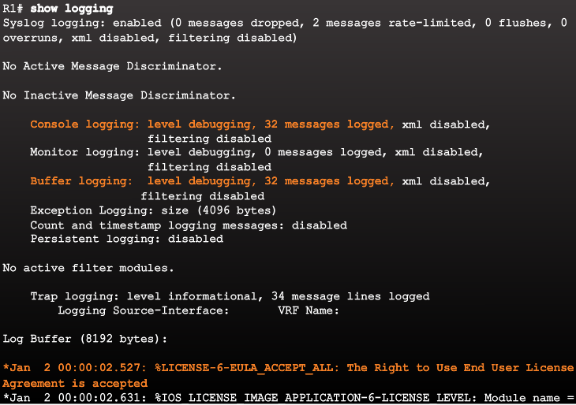

The first highlighted line states that this router logs to the console and includes debug messages. This actually means that **all debug level messages, as well as any lower level messages (such as notification level messages), are logged to the console**. On most Cisco IOS routers, the **default severity level is 7, debugging**. The output also notes that 32 such messages have been logged.

The second highlighted line states that this router logs to an internal buffer. Because this router has **enabled logging to an internal buffer**, the show logging command also lists the messages in that buffer. You can view some of the system messages that have been logged at the end of the output.

Syslog configuration
--------------------

#. configure destination hostname/IPv4 of the syslog server

   .. code::
   
      R1(config)# logging 192.168.1.3

#. control messages to be sent to the syslog server with the ``logging trap`` command. E.g. 4 and lower(more severe) the msgs with a higher,less severe level are sent to console.

   .. code::
   
      R1(config)# logging trap 4

#. Optionally configure the source IF with ``logging source-interface if-type if-number``. This specifies that **syslog packets shall contain the IP of this interface** regardless of what IF the packet uses to exit the router

   .. code::
   
      R1(config)# logging source-interface GigabitEthernet 0/0

Verifying Syslog
----------------

.. code::
   
   R1# show logging | include changed state to up
   R1# show logging | begin June 12 22:35

filter logging with specific date
^^^^^^^^^^^^^^^^^^^^^^^^^^^^^^^^^

.. code::

   Oct 30 20:44:42.941 UTC: %LINK-3-UPDOWN: Interface Serial3/1/0.6/3:0, changed state to down
   show logging | include (Oct 30 20:44)..*(3/1/0.6/3:0)

capturing traffic & EPC
^^^^^^^^^^^^^^^^^^^^^^^

To capture what's happening
 To capture what's happening on each router you can use debug ip icmp detail and debug ip packet detail, increase the buffers and record it or send it to the console and view it in real time , if your coming over the vty log to the monitor or use term mon  which replicates like logging to the console either , logging to monitor is on by default in ios so you will see debug if you enable for a specific  feature even if buffer is not set, other than that you could setup span session and capture the traffic on either side in wireshark 

 Again syslog is on by default in ios it can't be disabled but if you don't have logging host set it won't actually do anything 

Embedded Packet Capture (EPC)
 Embedded Packet Capture (EPC) is an onboard packet capture facility that allows network administrators to capture packets flowing to, through, and from the device and to analyze them locally or save and export them for offline analysis by using a tool such as Wireshark. This feature simplifies network operations by allowing devices to become active participants in the management and operation of the network. This feature facilitates troubleshooting by gathering information about the packet format. This feature also facilitates application analysis and security. 

PT Configure Syslog & NTP
-------------------------

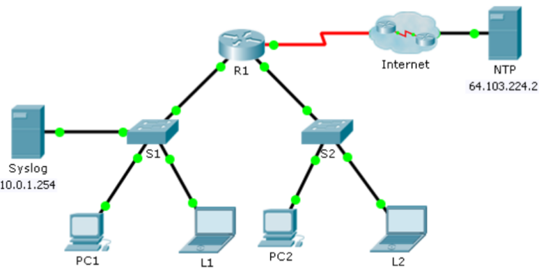

#. enable the syslog service on the syslog server via services tab
   Turn it on and move the window so you can monitor actively
  
#. Configure intermediary devices to use the syslog server

   + Configure R1 to send log events
     
     .. code::

        R1(config)#logging ?
        A.B.C.D   IP address of the logging host
        buffered  Set buffered logging parameters
        console   Set console logging parameters
        host      Set syslog server IP address and parameters
        on        Enable logging to all enabled destinations
        trap      Set syslog server logging level
        userinfo  Enable logging of user info on privileged mode enabling 

        R1(config)# logging 10.0.1.254
        R1(config)#exit
        R1#
        %SYS-5-CONFIG_I: Configured from console by console
        %SYS-6-LOGGINGHOST_STARTSTOP: Logging to host 10.0.1.254 port 514 started - CLI initiated

   + Configure S1 and S2 to send event to syslog server

#. Change the status of interfaces to create event logs

   + configure a loopback 0 interface on R1 then disable it
   + turn off PC1 and PC2 and then turn them on again

#. examine the syslog events.
   
   + The timestamps are incorrect!
   + Clear the log before proceeding

#. manually set the clocks on the switches to the current date and time

   .. code::

      S2#clock set 14:57:33 September 5 2017
      S1#clock set 15:00:00 September 5 2017

#. Enable the logging timestamp **service** on the switches

   + Configure S1 and S2 to send its timestamp with logs it sends to the syslog server

     .. code::

        S1(config)# service timestamps log datetime msec
        S2(config)# service timestamps log datetime msec

#. Configure NTP Service (public ntp server). If server was private, authentication could also be used

   + Open the services tab of the NTP server
   + Turn the NTP service on and not the date and time
   + Automatically set the clock on R1 w date & time according to NTP server

     .. code:: 

        R1(config)# ntp server 64.103.224.2

   + Configure R1 to send its timestamp with the logs that it sends to the Syslog server
     
     .. code:: 
  
        R1(config)#service timestamps log datetime msec

#. Verify timestamped logs

   + re-enable and then disable the Loopback 0 interface on R1
   + turn off laptops L1 and L2. Turn them on again.
   + Look at the syslog events

   .. note:: R1 uses the clock settings from the NTP server, S1 and S2 the clock settings configured by you

   .. image:: ../../../_static/img/Ch10_Syslog_Service_Entries.png

   That is one badly configured NTP server :p

LAB Configuring syslog & NTP
----------------------------

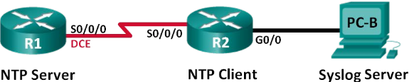

Addressing Table

+--------+--------------+------------+-----------------+------------+
| Device | Interface    | IP Address | Subnet Mask     | Default GW |
+========+==============+============+=================+============+
| R1     | S0/0/0 (DCE) | 10.1.1.1   | 255.255.255.252 | N/A        |
+--------+--------------+------------+-----------------+------------+
| R2     | S0/0/0       | 10.1.1.2   | 255.255.255.252 | N/A        |
+--------+--------------+------------+-----------------+------------+
|        | G0/0         | 172.16.2.1 | 255.255.255.0   | N/A        |
+--------+--------------+------------+-----------------+------------+
| PC-B   | NIC          | 172.16.2.3 | 255.255.255.0   | 172.16.2.1 |
+--------+--------------+------------+-----------------+------------+

In this lab, you will configure R1 as the NTP server and R2 as a Syslog and NTP client. The syslog server application, such as Tftp32d or other similar program, will be running on PC-B. Furthermore, you will control the severity level of log messages that are collected and archived on the syslog server.
Note: The routers used with CCNA hands-on labs are Cisco 1941 Integrated Services Routers (ISRs) with Cisco IOS Release 15.2(4)M3 (universal k9 image). Other routers and Cisco IOS versions can be used. 

#. Console into the router and enter global configuration mode.
   
   + Copy the following basic configuration and paste it to the running-configuration on the router.

     .. code::

        no ip domain-lookup 
        service password-encryption 
        enable secret class 
        banner motd # 
        Unauthorized access is strictly prohibited. # 
        line con 0 
        password cisco 
        login 
        logging synchronous 
        line vty 0 4 
        password cisco 
        login 

   + Configure the hostname as shown
   + Apply the IP addresses to Serial and Gig interfaces according to table and activate them
   + set the clock rate to 128000 for the DCE serial interface

#. Configure routing

   + Enable RIPv2 on the routers. Add all the networks into the RIPv2 process

#. Configure IP and Default GW for PC-B
#. Verify end-to-end connectivity
#. Save running-config to startup-config
#. Configure NTP

   + Configure R1 as the NTP Server and R2 as the NTP client of R1. Synchronized time is important for Syslog and debug functions
   + Display the current time

     .. code::

        R1#show clock

   + Set the time. Use the clock set command

     .. code::

        R1# clock set 15:45:00 5 october 2017

     .. note:: The time can also be set using the clock timezone command in the global configuration mode. For more information regarding this command, research the clock timezone command at `cisco timezone`_ to determine the zone for your region. UTC+1 ``clock timezone WEST +1`` configure summertime ``Router(config)# clock summer-time WEST recurring``

   + Configure the NTP master
     Use the ``ntp master stratum--hopcountnumber``. NTP hops away from an authoritative time source.

     .. code::

        R1(config)# ntp master 5

   + Configure the NTP client

     .. code::

        R2(config)# ntp server 10.1.1.1
        R2(config)# ntp update-calendar

     the ``ntp update-calendar`` command periodically updates the calendar with NTP time

   + Verify NTP configuration

     .. code::

        R2# show ntp associations

   + Issue show clock on R1 and R2 to compare the timestamp

     .. code::
      
        R1# show clock
        R2# show clock

#. Configure Syslog

   + install a syslog server on the pc
   + start the syslog server on PC-B
   + Verify that the timestamp service is enabled on R2

     .. code::

        R2(config)# show run | include timestamp
        service timestamps debug datetime msec
        service timestamps log datetime msec

        if not enabled:
        R2(config)# service timestamps log datetime msec

   + Configure R2 to send syslog messages to syslog server, PC-B

     .. code::

        R2(config)# logging host 172.16.2.3

   + Display the default logging settings

     .. code::

        R2# show logging

     - What is the IP address of the syslog server? 
     - What protocol and port is syslog using? 
     - At what level is trap logging enabled? 

   + Configure and observe the effect of logging severity levels on R2

     .. code::

        R2(config)# logging trap ?
        <0-7>          Logging severity level 
        alerts         Immediate action needed           (severity=1) 
        critical       Critical conditions               (severity=2) 
        debugging      Debugging messages                (severity=7) 
        emergencies    System is unusable                (severity=0) 
        errors         Error conditions                  (severity=3) 
        informational  Informational messages            (severity=6) 
        notifications  Normal but significant conditions (severity=5) 
        warnings       Warning conditions                (severity=4) 
        <cr> 

     - if the ``logging trap warnings`` command was issued, what severity levels of msgs are logged?
     - Change the logging severity level to 4

       .. code::

          R2(config)# logging trap warnings
          or
          R2(config)# logging trap 4
          
   + Create interface loopback 0 IF on R2 and observe the log messages on PC-B

     .. code:: 

        R2(config)# interface lo 0
        R2(config-if)#

   + Remove the loopback 0 IF on R2 and observe logs

     .. code:: 

        R2(config)# no interface lo 0

     - At severity level 4, are there any log messages on the syslog server? If any log messages appeared, explain what appeared and why

   + Change the logging severity to 6

     .. code::

        R2(config)# logging trap informational
        or
        R2(config)# logging trap 6

   + Clear the syslog entries on PC-B
   + Create the loopback 1 IF on R2

     .. code::

        R2(config)# interface loopback 1
        R2(config-if)# no interface loopback 1

   + Observe the syslog server output. Compare the results with that at trapping lvl 4

Reflection
 What is the problem when setting the level of severity too high or too low for syslog?

Router File Systems
-------------------

Cisco IOS File System (IFS)

Although there are several file systems listed, of interest to us will be the tftp, flash, and nvram file systems.

.. note:: Note that the flash file system also has an asterisk preceding it. This indicates that flash is the current default file system. The bootable IOS is located in flash; therefore, the pound symbol (#) is appended to the flash listing, indicating that it is a bootable disk.

.. code::
   
   Router# show file systems
   Router# dir
   Router# pwd
   nvram:/
   Router# dir
   Directory of nvram:/
   ....

   Switch# show file systems
   File Systems:
   ....

Backing up and restoring
------------------------

Backup w text capture (eg Tera Term)
^^^^^^^^^^^^^^^^^^^^^^^^^^^^^^^^^^^^

#. On the File menu, click Log.

#. Choose the location to save the file. Tera Term will begin capturing text.

#. After capture has been started, execute the show running-config or show startup-config command at the privileged EXEC prompt. Text displayed in the terminal window will be directed to the chosen file.

#. When the capture is complete, select Close in the Tera Term: Log window.

#. View the file to verify that it was not corrupted.

Restoring Text Configurations

A configuration can be copied from a file to a device. When copied from a text file and pasted into a terminal window, the IOS executes each line of the configuration text as a command. This means that the file will require editing to ensure that encrypted passwords are in plain text and that non-command text such as "--More--" and IOS messages are removed. This process is discussed in the lab.

Further, at the CLI, the device must be set at the global configuration mode to receive the commands from the text file being pasted into the terminal window.

When using Tera Term, the steps are:

#. On the File menu, click Send file.

#. Locate the file to be copied into the device and click Open.

#. Tera Term will paste the file into the device.

The text in the file will be applied as commands in the CLI and become the running configuration on the device. This is a convenient method for manually configuring a router.

Backup configs w TFTP
^^^^^^^^^^^^^^^^^^^^^

#. use the ``copy running-config tftp`` or ``copy startup-config tftp`` commands to backup the configs
#. use the ``copy tftp running-config`` or ``copy tftp startup-config`` commands to restore the configs     
     
Using USB ports
---------------

.. code::
  
   R1# dir usbflash0:
   Directory of usbflash0:/
   1 -rw- 30125020 Dec 22 2032 05:22:32 +00:00 c3825-entservicesk9-mz.123-14.T
   63158272 bytes total (33033216 bytes free)

you can use the ``more`` command to view the the contents

.. code::

   R1# more usbflash0:/R1-Config

Backing up to USB
^^^^^^^^^^^^^^^^^

.. code::

   R1# copy running-config usbflash0:
   Destination filename [running-config]? R1-Config
   5024 bytes copied in 0.736 secs (6826 bytes/sec)

Restoring from USB
^^^^^^^^^^^^^^^^^^

.. code::

   R1# copy usbflash0:/R1-Config running-config

Password Recovery
-----------------

#. Enter rommon mode

   .. note:: With console access, a user can access the ROMMON mode by using a break sequence during the boot up process or removing the external flash memory when the device is powered off.

#. Change the configuration register to ``0x2142`` to ignore the startup-config file
   
   .. code::
  
      monitor: command "boot" aborted due to user interrupt
      rommon 1 > confreg 0x2142
      rommon 2 > reset

#. make necessary changes to original startup config file
#. save those changes
#. apply the changes and reset config-register to ``0x2102`` and ``reload``

   .. code::

      Router# copy startup-config running-config
      Destination filename [running-config]?

      1450 bytes copied in 0.156 secs
      Router# conf t
      Router(config)# enable secret cisco
      Router(config)# config-register 0x2102
      Router(config)# end
      Router# copy running-config startup-config
      Destination filename [startup-config]?
      Building configuration...
      [OK]
      Router# reload

.. note:: Note that in rommon it's ``confreg 0x2142`` and in IOS it's ``config-register 0x2102``

Lab - Managing Device Configuration Files
-----------------------------------------

#. Build the Network and Configure Basic Device Settings

#. (Optional) Download TFTP Server Software

#. Use TFTP to Back Up and Restore the Switch Running Configuration

#. Use TFTP to Back Up and Restore the Router Running Configuration

#. Back Up and Restore Running Configurations Using Router Flash Memory

#. (Optional) Use a USB Drive to Back Up and Restore the Running Configuration

Addressing Table

+--------+-----------+--------------+---------------+-----------------+
| Device | Interface | IP Address   | Subnet Mask   | Default Gateway |
+========+===========+==============+===============+=================+
| R1     | G0/1      | 192.168.1.1  | 255.255.255.0 | N/A             |
+--------+-----------+--------------+---------------+-----------------+
| S1     | VLAN 1    | 192.168.1.11 | 255.255.255.0 | 192.168.1.1     |
+--------+-----------+--------------+---------------+-----------------+
| PC-A   | NIC       | 192.168.1.3  | 255.255.255.0 | 192.168.1.1     |
+--------+-----------+--------------+---------------+-----------------+

.. code-block:: html

     g0/1    F0/5
   R1 <--------> S1 <---------> PC-A
   tftp            F0/6         tftp
   client    tftp client        client

Configure basic device parameters as shown in the Addressing Table
To prevent the router and switch from attempting to translate incorrectly entered commands as though they were host names, disable DNS lookup
Assign class as the privileged EXEC encrypted password
Configure the passwords and allow login for console and vty lines using cisco as the password 
Configure the default GW for S1
Encrypt clear txt passwords
Configure the IP - SM - GW for PC-A
Ping from PC-A to S1
Ping from PC-A to R1
Install and configure a TFTP server

The TFTP application uses the UDP Layer 4 transport protocol, which is encapsulated in an IP packet. For TFTP file transfers to function, there must be Layer 1 and 2 (Ethernet, in this case) and Layer 3 (IP) connectivity be tween the TFTP client and the TFTP server.

.. note:: A common misconception is that you can TFTP a file over the console connection. This is not the case because the console connection does not use IP. The TFTP transfer can be initiated from the client device (router or switch) using the console connection, but there must be IP connectivity between the client and server for the file transfer to take place.

.. code::

   S1# copy ?
   /erase          Erase destination file system.
   /error          Allow to copy error file.
   /noverify       Don't verify image signature before reload.
   /verify         Verify image signature before reload.
   archive:        Copy from archive: file system
   cns:            Copy from cns: file system
   flash0:         Copy from flash0: file system
   flash1:         Copy from flash1: file system
   flash:          Copy from flash: file system
   ftp:            Copy from ftp: file system
   http:           Copy from http: file system
   https:          Copy from https: file system
   null:           Copy from null: file system
   nvram:          Copy from nvram: file system
   rcp:            Copy from rcp: file system
   running-config  Copy from current system configuration
   scp:            Copy from scp: file system
   startup-config  Copy from startup configuration
   system:         Copy from system: file system
   tar:            Copy from tar: file system
   tftp:           Copy from tftp: file system
   tmpsys:         Copy from tmpsys: file system
   xmodem:         Copy from xmodem: file system
   ymodem:         Copy from ymodem: file syste

   Router# copy usbflash1: R1-running-config-backup.txt running-config

The flash: file system for S1 is the source file system in this example.

.. code::

   S1# copy flash: ?
   archive:        Copy to archive: file system
   flash0:         Copy to flash0: file system
   flash1:         Copy to flash1: file system
   flash:          Copy to flash: file system
   ftp:            Copy to ftp: file system
   http:           Copy to http: file system
   https:          Copy to https: file system
   idconf          Load an IDConf configuration file
   null:           Copy to null: file system
   nvram:          Copy to nvram: file system
   rcp:            Copy to rcp: file system
   running-config  Update (merge with) current system configuration
   scp:            Copy to scp: file system
   startup-config  Copy to startup configuration
   syslog:		    Copy to syslog: file system
   system:         Copy to system: file system
   tftp:           Copy to tftp: file system
   tmpsys:         Copy to tmpsys: file system
   xmodem:         Copy to xmodem: file system
   ymodem:         Copy to ymodem: file system

Enter the copy running-config tftp: command. Provide the remote host address of the TFTP server (PC-A), 192.168.1.3. Press Enter to accept default destination filename (s1-config) or provide your own filename. The exclamation marks (!!) indicate the transfer process is in progress and is successful.

.. code::

   S1# copy running-config tftp:
   Address or name of remote host []?  192.168.1.3
   Destination filename [s1-config]?
   !!
   1465 bytes copied in 0.663 secs (2210 bytes/sec)
   S1#

The TFTP server also displays the progress during the transfer.
If you don't have the required permissions you'll get this error
%Error opening tftp://192.168.1.3/s1-config (Permission denied)

explore flash/usbflash as well

.. code::

   R1# copy running-config flash:
   R1# dir flash:
   R1# more flash:R1-running-config-backup

   R1# show file systems
   R1# copy running-config usbflash0:
   R1# dir usbflash0:
   Router# copy usbflash1: R1-running-config-backup.txt running-config

IOS 15 System Image Packaging
-----------------------------

.. image:: ../../../_static/img/Ch10_Packaging_Model_4_ISR_G2_Routers.png

Cisco Integrated Services Routers Generation Two (ISR G2) 1900, 2900, and 3900 Series support services on demand through the use of software licensing. The Services on Demand process enables customers to realize operational savings through ease of software ordering and management. When an order is placed for a new ISR G2 platform, the router is shipped with a single universal Cisco IOS Software image and **a license is used to enable the specific feature set packages**, as shown in image above.

There are 2 types of universal images supported in ISR G2:

 + Universal images with the “universalk9" designation in the image name - This universal image offers all of the Cisco IOS Software features, including strong payload cryptography features, such as IPsec VPN, SSL VPN, and Secure Unified Communications.

 + Universal images with the “universalk9_npe" designation in the image name - The strong enforcement of encryption capabilities provided by Cisco Software Activation satisfies requirements for the export of encryption capabilities. However, some countries have import requirements that require that the platform does not support any strong cryptography functionality, such as payload cryptography. To satisfy the import requirements of those countries, the npe universal image does not support any strong payload encryption.

With the ISR G2 devices, IOS image selection has been made easier because all features are included within the universal image. Features are activated through licensing. Each device ships with Universal image. The technology packages IP Base, Data, UC (Unified Communications), and SEC (Security), are enabled in the universal image using Cisco Software Activation licensing keys. Each licensing key is unique to a particular device and is obtained from Cisco by providing the product ID and serial number of the router and a Product Activation Key (PAK). The PAK is provided by Cisco at the time of software purchase. The IP Base is installed by default. 

IOS Image Filenames
-------------------

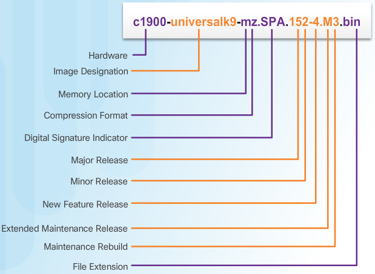

+ Image Name (c1900) - Identifies the platform on which the image runs. In this example, the platform is a Cisco 1900 router.

+ universalk9 - Specifies the image designation. The two designations for an ISR G2 are universalk9 and universalk9_npe. Universalk9_npe does not contain strong encryption and is meant for countries with encryption restrictions. Features are controlled by licensing and can be divided into four technology packages. These are IP Base, Security, Unified Communications, and Data.

+ mz - Indicates where the image runs and if the file is compressed. In this example, mz indicates that the file runs from RAM and is compressed.

+ SPA - Designates that file is digitally signed by Cisco.

+ 152-4.M3 - Specifies the filename format for the image 15.2(4)M3. This is the version of IOS, which includes the major release, minor release, maintenance release, and maintenance rebuild numbers. The M indicates this is an extended maintenance release.

+ bin - The file extension. This extension indicates that this file is a binary executable file.

The most common designation for memory location and compression format is mz. The first letter indicates the location where the image is executed on the router. The locations can include:

 + f - flash
 
 + m - RAM
 
 + r - ROM
 
 + l - relocatable

The compression format can be either z for zip or x for mzip. Zipping is a method Cisco uses to compress some run-from-RAM images that is effective in reducing the size of the image. It is self-unzipping, so when the image is loaded into RAM for execution, the first action is to unzip.

Note: The Cisco IOS Software naming conventions, field meaning, image content, and other details are subject to change.

Memory Requirements

On most Cisco routers including the integrated services routers, the IOS is stored in compact flash as a compressed image and loaded into DRAM during boot-up. The Cisco IOS Software Release 15.0 images available for the Cisco 1900 and 2900 ISR require 256MB of flash and 512MB of RAM. The 3900 ISR requires 256MB of flash and 1GB of RAM. This does not include additional management tools such as Cisco Configuration Professional (Cisco CP). For complete details, refer to the product data sheet for the specific router. 

to backup ios image ``R1# copy flash0: tftp:``
to restore ios image ``R1# copy tftp: flash0:``

boot system command
-------------------

To upgrade to the copied IOS image after that image is saved on the router's flash memory, configure the router to load the new image during bootup using the ``boot system`` command
Verify with ``show version``

.. code::

   R1# configure terminal
   R1(config)# boot system flash0://c1900-universalk9-mz.SPA.152-4.M3.bin
   R1(config)# exit
   R1# copy running-config startup-config
   R1# reload

Copy the IPBase with strong encryption IOS image (ipbasek9) for the 1841 router from the TFTP Server to R1

.. code::

   R1# copy tftp: flash:
   Address or name of remote host []? 192.168.2.254
   Source filename []?  c1841-ipbasek9-mz.124-12.bin
   Destination filename [c1841-ipbasek9-mz.124-12.bin]? 
   
   Accessing tftp://192.168.2.254/c1841-ipbasek9-mz.124-12.bin....
   Loading c1841-ipbasek9-mz.124-12.bin from 192.168.2.254: 
   !!!!!!!!!!!!!!!!!!!!!!!!!!!!!!!!!!!!!!!!!!!!!!!!!!!!!!!!!!!!!!!!!!!!!!!!!!!!!!!!!!!!!!
   !!!!!!!!!!!!!!!!!!!!!!!!!!!!!!!!!!!!!!!!!!!!!!!!!!!!!!!!!!!!!!!!
   !!!!!!!!!!!!!!!!!!!!!!
   !!!!!!!!!!!!!!!!!!!!!!!!!!!!!!!!!!!!!!!!!!!!!!!!!!!!!!!!!!!!!!!!!!!!!!!!!!!!!!!!!!!!!!
   !!!!!!!!!!!!!!!!!!!!!!!!!!!!!!!!!!!!!!!!!!!!!!!!!!!!!!!!!!!!!!!!!!!
   [OK - 16599160 bytes]
   
   16599160 bytes copied in 3.44 secs (1079726 bytes/sec)

Verify that the IOS image has been copied to flash
How many IOS images are located in the flash:? 

Use the ``boot system`` command to load the IPBase image on the next reload

.. code::

   R1(config)# boot system flash:c1841-ipbasek9-mz.124-12.bin
   Save the configuration and reload R1
   
   Verify the upgraded IOS image is loaded after R1 reboots

Technology Packages Licenses
----------------------------

What are the ISO v15 Feature sets (technology package) types we have now days with ISR G2:

+ IP Base (ipbaseK9)come and running with any new ISR G2 routers (1900,2900,3900 Series), its entry level for Cisco IOS functionality
  Offers features found in IP Base IOS image on ISR 1900, 2900, and 3900 + Flexible Netflow + IPv6 parity for IPv4 features present in IP Base. Some of the key features are AAA, BGP, OSPF, EIGRP, IS-IS, RIP, PBR, IGMP, Multicast, DHCP, HSRP, GLBP, NHRP, HTTP, HQF, QoS, ACL, NBAR, GRE, CDP, ARP, NTP, PPP, PPPoA, PPPoE, RADIUS, TACACS, SCTP, SMDS, SNMP, STP, VLAN, DTP, IGMP, Snooping, SPAN, WCCP, ISDN, ADSL over ISDN, NAT-Basic X.25, RSVP, NTP, Flexible Netflow, etc.
+ DATA (dataK9)support MPLS.ATM. Multiprotocol support
  Data features found in SP Services and Enterprise Services IOS image on ISR 1900, 2900, and 3900 e.g. MPLS, BFD, RSVP, L2VPN, L2TPv3, Layer 2 Local Switching, Mobile IP, Multicast Authentication, FHRP-GLBP, IP SLAs, PfR, DECnet, ALPS, RSRB, BIP, DLSw+, FRAS, Token Ring, ISL, IPX, STUN, SNTP, SDLC, QLLC, etc.
+ Unified Commuincations (ucK9) support VOIP & IP Telephony
  Offers the UC Features found in IPVoice IOS image on ISR 1900, 2900, and 3900 e.g. TDM/PSTN Gateway, Video Gateway [H320/324], Voice Conferencing, Codec Transcoding, RSVP Agent (voice), FAX T.37/38, CAC/QOS, Hoot-n-Holler, etc.
+ Security (securityK9) support Cisco IOS Firewall , IPS , IPsec , 3DES, VPN
  Offers the security features found in Advanced Security IOS image on ISR 1900, 2900, and 3900 e.g. IKE v1 / IPsec / PKI, IPsec/GRE, Easy VPN w/ DVTI, DMVPN, Static VTI, Firewall, Network Foundation Protection, GETVPN, etc.

.. note:: The IP Base license is a prerequisite for installing the Data, Security, and Unified Communications licenses. For earlier router platforms that can support Cisco IOS Software release 15.0, a universal image is not available. It is necessary to download a separate image that contains the desired features.

Technology Package Licenses

Technology package licenses are supported on Cisco ISR G2 platforms (Cisco 1900, 2900, and 3900 Series routers). The Cisco IOS universal image contains all packages and features in one image. Each package is a grouping of technology-specific features. Multiple technology package licenses can be activated on the Cisco 1900, 2900, and 3900 series ISR platforms.

.. image:: ../../../_static/img/Ch10_Technology_Packages.png

Licensing Proces
----------------

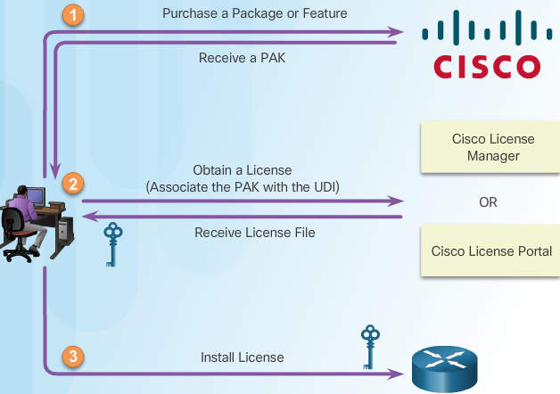

When a new router is shipped, it comes preinstalled with the software image and the corresponding permanent licenses for the customer-specified packages and features.

The router also comes with the evaluation license, known as a temporary license, for most packages and features supported on the specified router. This allows customers to try a new software package or feature by activating a specific evaluation license. If customers want to permanently activate a software package or feature on the router, they must get a new software license.

The figure shows the three steps to permanently activate a new software package or feature on the router.

for more info click here: `cisco licensing`_

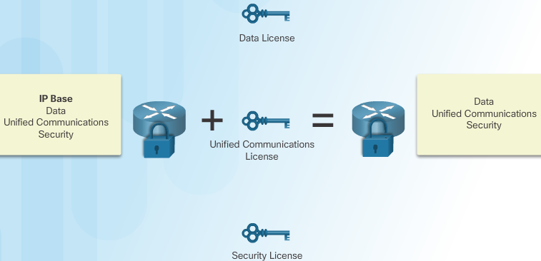

#. purchase the software package or feature needed. This may be adding a package to IP Base, such as Security.

   + Software Claim Certificates are used for licenses that require software activation. The claim certificate provides the Product Activation Key (PAK) for the license and important information regarding the Cisco End User License Agreement (EULA). In most instances, Cisco or the Cisco channel partner will have already activated the licenses ordered at the time of purchase and no Software Claim Certificate is provided.

   + In either instance, customers receive a PAK with their purchase. The PAK serves as a receipt and is used to obtain a license. A PAK is an 11 digit alpha numeric key created by Cisco manufacturing. It defines the Feature Set associated with the PAK. A PAK is not tied to a specific device until the license is created. A PAK can be purchased that generates any specified number of licenses. As shown in the figure, a separate license is required for each package, IP Base, Data, UC, and SEC.

#. obtain the license, which is actually a license file. A license file, also known as a Software Activation License, is obtained using one of the following options:

   + Cisco License Manager (CLM) - This is a free software application available at http://www.cisco.com/go/clm. Cisco License Manager is a standalone application from Cisco that helps network administrators rapidly deploy multiple Cisco software licenses across their networks. Cisco License Manager can discover network devices, view their license information, and acquire and deploy licenses from Cisco. The application provides a GUI that simplifies installation and helps automate license acquisition, as well as perform multiple licensing tasks from a central location. CLM is free of charge and can be downloaded from CCO.

   + Cisco License Registration Portal - This is the web-based portal for getting and registering individual software licenses, available at http://www.cisco.com/go/license.

Both of these processes require a PAK number and a Unique Device Identifier (UDI).

The PAK is received during purchase.

The UDI is a combination of the Product ID (PID), the Serial Number (SN), and the hardware version. The SN is an 11 digit number which uniquely identifies a device. The PID identifies the type of device. Only the PID and SN are used for license creation. This UDI can be displayed using the show license udi command shown in Figure 1. This information is also available on a pull-out label tray found on the device. Figure 2 shows an example of the pull-out label on a Cisco 1941 router.

After entering the appropriate information, the customer receives an email containing the license information to install the license file. The license file is an XML text file with a .lic extension. 

``R2# show license udi``

#. Install the license
   
   .. code::

      R1# license install flash0:security-CISCO1941-FHH12250057.xml
      ...
      R1# reload

#. Verify with ``show version`` and ``show license``
#. Activate an evaluation right-to-use license

   .. code:: 

      R1(config)# license accept end user agreement
      R1(config)# license boot module c1900 technology-package datak9
      R1(config)# show license

Use the ``show license feature`` command to view the technology package licenses and feature licenses supported on the router.

#. Backup the license

   .. code::

      R1# license save file-sys://lic-location 
      R1# license save flash0://all_licenses.lic
      R1# show flash0: 
      to restore
      ----------
      R1# license install

To clear an active permanent license from the Cisco 1900 series, 2900 series, and 3900 series routers, perform the following steps:

 #. Disable the technology package.

    Disable the active license with the command:

    ``Router(config)# license boot module module-name technology-package package-name disable``

    Reload the router using the reload command. A reload is required to make the software package inactive.

 #. Clear the license.

    Clear the technology package license from license storage.

    ``Router# license clear feature-name``

    Clear the license boot module command used for disabling the active license:

    ``Router(config)# no license boot module module-name technology-package package-name disable``

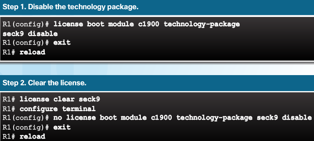

.. note:: Some licenses, such as built-in licenses, cannot be cleared. Only licenses that have been added by using the license install command are removed. Evaluation licenses are not removed.

A lesson on ios licensing here: `cisco licensing_lesson`_

Ch10 Skills Integration Challenge
---------------------------------

Addressing Table

+--------+-----------+---------------+-----------------+-----------------+
| Device | Interface | IP Address    | Subnet Mask     | Default Gateway |
+========+===========+===============+=================+=================+
|        | G0/0.15   |               |                 | N/A             |
+--------+-----------+---------------+-----------------+-----------------+
|        | G0/0.30   |               |                 | N/A             |
+--------+-----------+---------------+-----------------+-----------------+
|        | G0/0.45   |               |                 | N/A             |
+--------+-----------+---------------+-----------------+-----------------+
|        | G0/0.60   |               |                 | N/A             |
+--------+-----------+---------------+-----------------+-----------------+
|        | S0/0/0    |               | 255.255.255.252 | N/A             |
+--------+-----------+---------------+-----------------+-----------------+
|        | S0/0/1    |               | 255.255.255.252 | N/A             |
+--------+-----------+---------------+-----------------+-----------------+
|        | S0/1/0    |               | 255.255.255.252 | N/A             |
+--------+-----------+---------------+-----------------+-----------------+
|        | G0/0      |               |                 | N/A             |
+--------+-----------+---------------+-----------------+-----------------+
|        | S0/0/0    |               | 255.255.255.252 | N/A             |
+--------+-----------+---------------+-----------------+-----------------+
|        | S0/0/1    |               | 255.255.255.252 | N/A             |
+--------+-----------+---------------+-----------------+-----------------+
|        | G0/0      |               |                 | N/A             |
+--------+-----------+---------------+-----------------+-----------------+
|        | S0/0/0    |               | 255.255.255.252 | N/A             |
+--------+-----------+---------------+-----------------+-----------------+
|        | S0/0/1    |               | 255.255.255.252 | N/A             |
+--------+-----------+---------------+-----------------+-----------------+
|        | VLAN 60   |               |                 |                 |
+--------+-----------+---------------+-----------------+-----------------+
|        | NIC       | DHCP Assigned | DHCP Assigned   | DHCP Assigned   |
+--------+-----------+---------------+-----------------+-----------------+

VLANs and Port Assignments Table

+--------------------+-----------------+---------+
| VLAN Number - Name | Port assignment | Network |
+====================+=================+=========+
| 15 - Servers       | F0/11 - F0/20   |         |
+--------------------+-----------------+---------+
| 30 - PCs           | F0/1 - F0/10    |         |
+--------------------+-----------------+---------+
| 45 - Native        | G0/1            |         |
+--------------------+-----------------+---------+
| 60 - Management    | VLAN 60         |         |
+--------------------+-----------------+---------+

Ch10 practice exam
------------------

#. A ping fails when performed from router R1 to directly connected router R2. The network administrator then proceeds to issue the show cdp neighbors command. Why would the network administrator issue this command if the ping failed between the two routers?

   + The network administrator suspects a virus because the ping command did not work.
   + The network administrator wants to verify Layer 2 connectivity.
   + The network administrator wants to verify the IP address configured on router R2.
   + The network administrator wants to determine if connectivity can be established from a non-directly connected network.
   + Answer -> :transparent:`The network administrator wants to verify Layer 2 connectivity`

#. Which statement is true about CDP on a Cisco device?

   + The show cdp neighbor detail command will reveal the IP address of a neighbor only if there is Layer 3 connectivity​.
   + To disable CDP globally, the no cdp enable command in interface configuration mode must be used.
   + CDP can be disabled globally or on a specific interface
   + Because it runs at the data link layer, the CDP protocol can only be implemented in switches.
   + Answer -> :transparent:`CDP can be disabled globally or on a specific interface`

#. Why would a network administrator issue the show cdp neigbors command on a router?

   + to display device ID and other information about directly connected Cisco devices
   + to display router ID and other information about OSPF neighbors
   + to display line status and other information about directly connected Cisco devices
   + to display routing table and other information about directly connected Cisco devices
   + Answer -> :transparent:`to display device ID and other information about directly connected Cisco devices`

#. Refer to the exhibit. Routers R1 and R2 are connected via a serial link. One router is configured as the NTP master, and the other is an NTP client. Which two pieces of information can be obtained from the partial output of the show ntp associations detail command on R2? (Choose two.)
   
   .. code::

      R2# show ntp associations detail
      192.168.1.2 configured, authenticated, our_master, sane, valid, stratum 3

   + Both routers are configured to use NTPv2
   + Router R1 is the master, and R2 is the client
   + Router R2 is the master, and R1 is the client
   + The IP address of R1 is 192.168.1.2
   + The IP address of R2 is 192.168.1.2
   + Answer -> :transparent:`Router R1 is the master, and R2 is the client && The IP address of R1 is 192.168.1.2`

#. Which two statements are true about NTP servers in an enterprise network? (Choose two)

   + There can only be one NTP server on an enterprise network
   + All NTP servers synchronize directly to a stratum 1 time source
   + NTP servers at stratum 1 are directly connected to an authoritative time source
   + NTP servers ensure an accurate time stamp on logging and debugging information
   + NTP servers control the mean time between failures (MTBF) for key network devices
   + Answer -> :transparent:`NTP servers at stratum 1 are directly connected to an authoritative time source && NTP servers ensure an accurate time stamp on logging and debugging information`

#. The command ntp server 10.1.1.1 is issued on a router. What impact does this command have?

   + determines which server to send system log files to
   + identifies the server on which to store backup configurations
   + ensures that all logging will have a time stamp associated with it
   + synchronizes the system clock with the time source with IP address 10.1.1.1
   + Answer -> :transparent:`synchronizes the system clock with the time source with IP address 10.1.1.1`

#. Refer to the exhibit. Which two conclusions can be drawn from the syslog message that was generated by the router? (Choose two.)
   
   .. code::

      Mar 31 07:23:03.2323: %LINEPROTO-5-UPDOWN: Line protocol on Interface Serial0/0, changed state to up

   + This message resulted from an unusual error requiring reconfiguration of the interface.
   + This message indicates that the interface should be replaced.
   + This message is a level 5 notification message.
   + This message indicates that service timestamps have been configured.
   + This message indicates that the interface changed state five times.
   + Answer -> :transparent:`This message is a level 5 notification message && This message indicates that service timestamps have been configured`

#. Which protocol or service allows network administrators to receive system messages that are provided by network devices?

   + syslog
   + NTP
   + SNMP
   + NetFlow
   + Answer -> :transparent:`syslog`

#. Which syslog message type is accessible only to an administrator and only via the Cisco CLI?

   + errors
   + debugging
   + emergency
   + alerts
   + Answer -> :transparent:`debugging`

#. Refer to the exhibit. From what location have the syslog messages been retrieved?

   + syslog server
   + syslog client
   + router RAM
   + router NVRAM
   + Answer -> :transparent:`router RAM`

#. Refer to the exhibit. What does the number 17:46:26.143 represent?

   + the time passed since the syslog server has been started
   + the time when the syslog message was issued
   + the time passed since the interfaces have been up
   + the time on the router when the show logging command was issued
   + Answer -> :transparent:`the time when the syslog message was issued`

#. What is used as the default event logging destination for Cisco routers and switches?

   + terminal line
   + syslog server
   + console line
   + workstation
   + Answer -> :transparent:`console line`

#. A network administrator has issued the logging trap 4 global configuration mode command. What is the result of this command?

   + After four events, the syslog client will send an event message to the syslog server
   + The syslog client will send to the syslog server any event message that has a severity level of 4 and higher
   + The syslog client will send to the syslog server any event message that has a severity level of 4 and lower
   + The syslog client will send to the syslog server event messages with an identification trap level of only 4
   + Answer -> :transparent:`The syslog client will send to the syslog server any event message that has a severity level of 4 and lower`

#. What is the major release number in the IOS image name c1900-universalk9-mz.SPA.152-3.T.bin?

   + 2
   + 3
   + 15
   + 52
   + 1900
   + Answer -> :transparent:`15`

#. What statement describes a Cisco IOS image with the “universalk9_npe” designation for Cisco ISR G2 routers?

   + It is an IOS version that can only be used in the United States of America
   + It is an IOS version that provides only the IPBase feature set
   + It is an IOS version that offers all of the Cisco IOS Software feature sets
   + It is an IOS version that, at the request of some countries, removes any strong cryptographic functionality
   + Answer -> :transparent:`It is an IOS version that, at the request of some countries, removes any strong cryptographic functionality`

#. What code in the Cisco IOS 15 image filename c1900-universalk9-mz.SPA.153-3.M.bin indicates that the file is digitally signed by Cisco?

   + SPA
   + universalk9
   + M
   + mz
   + Answer -> :transparent:`SPA`

#. Which two conditions should the network administrator verify before attempting to upgrade a Cisco IOS image using a TFTP server? (Choose two.)

   + Verify the name of the TFTP server using the show hosts command
   + Verify that the TFTP server is running using the tftpdnld command
   + Verify that the checksum for the image is valid using the show version command
   + Verify connectivity between the router and TFTP server using the ping command
   + Verify that there is enough flash memory for the new Cisco IOS image using the show flash command
   + Answer -> :transparent:`Verify connectivity between the router and TFTP server using the ping command && Verify that there is enough flash memory for the new Cisco IOS image using the show flash command`

#. A network administrator configures a router with the command sequence:

   .. code::
   
      R1(config)# boot system tftp://c1900-universalk9-mz.SPA.152-4.M3.bin
      R1(config)# boot system rom
   
   What is the effect of the command sequence?
   
   + On next reboot, the router will load the IOS image from ROM
   + The router will copy the IOS image from the TFTP server and then reboot the system
   + The router will load IOS from the TFTP server. If the image fails to load, it will load the IOS image from ROM
   + The router will search and load a valid IOS image in the sequence of flash, TFTP, and ROM
   + Answer -> :transparent:`The router will load IOS from the TFTP server. If the image fails to load, it will load the IOS image from ROM`

#. A network engineer is upgrading the Cisco IOS image on a 2900 series ISR. What command could the engineer use to verify the total amount of flash memory as well as how much flash memory is currently available?

   + show flash0:
   + show version
   + show interfaces
   + show startup-config
   + Answer -> :transparent:`show flash0:`

#. Beginning with the Cisco IOS Software Release 15.0, which license is a prerequisite for installing additional technology pack licenses?

   + IPBase
   + DATA
   + UC
   + SEC
   + Answer -> :transparent:`IPBase`

#. Which three software packages are available for Cisco IOS Release 15.0?

   + DATA
   + IPVoice
   + Security
   + Enterprise Services
   + Unified Communications
   + Advanced IP Services
   + Answer -> :transparent:`DATA - Security - Unified Communications`

#. When a customer purchases a Cisco IOS 15.0 software package, what serves as the receipt for that customer and is used to obtain the license as well?

   + Software Claim Certificate
   + End User License Agreement
   + Unique Device Identifier
   + Product Activation Key
   + Answer -> :transparent:`Product Activation Key`

#. In addition to IPBase, what are the three technology packs that are shipped within the universal Cisco IOS Software Release 15 image? (Choose three.)

   + Advanced IP Services
   + Advanced Enterprise Services
   + DATA
   + Security
   + SP Services
   + Unified Communications
   + Answer -> :transparent:`DATA - Security - Unified Communications`

#. Which command would a network engineer use to find the unique device identifier of a Cisco router?

   + show version
   + show license udi
   + show running-configuration
   + license install stored-location-url
   + Answer -> :transparent:`show license udi`

#. Which command is used to configure a one-time acceptance of the EULA for all Cisco IOS software packages and features?

   + license save
   + show license
   + license boot module module-name
   + license accept end user agreement
   + Answer -> :transparent:`license accept end user agreement`

#. Refer to the exhibit. Match the components of the IOS image name to their description. (Not all options are used)

   +-------------+----------------------------------------------------+
   | part        | description choice                                 |
   +=============+====================================================+
   | mz          | specifying the feature set                         |
   +-------------+----------------------------------------------------+
   | 15          | minor release number                               |
   +-------------+----------------------------------------------------+
   | bin         | where the image runs and if the file is compressed |
   +-------------+----------------------------------------------------+
   | universalk9 | platform on which the image runs                   |
   +-------------+----------------------------------------------------+
   | 1           | authentication type                                |
   +-------------+----------------------------------------------------+
   | 4           | maintenance release and rebuild number             |
   +-------------+----------------------------------------------------+
   | M4          | new feature release number                         |
   +-------------+----------------------------------------------------+
   |             | file extension                                     |
   +-------------+----------------------------------------------------+
   |             | major release number                               |
   +-------------+----------------------------------------------------+

    Answer

   +-------------+----------------------------------------------------+
   | part        | correct description                                |
   +=============+====================================================+
   | universalk9 | specifying the feature set                         |
   +-------------+----------------------------------------------------+
   | 1           | minor release number                               |
   +-------------+----------------------------------------------------+
   | mz          | where the image runs and if the file is compressed |
   +-------------+----------------------------------------------------+
   | c1900       | platform on which the image runs                   |
   +-------------+----------------------------------------------------+
   |             | authentication type                                |
   +-------------+----------------------------------------------------+
   | M4          | maintenance release and rebuild number             |
   +-------------+----------------------------------------------------+
   | 4           | new feature release number                         |
   +-------------+----------------------------------------------------+
   | bin         | file extension                                     |
   +-------------+----------------------------------------------------+
   | 15          | major release number                               |
   +-------------+----------------------------------------------------+

#. A ping fails when performed from router R1 to directly connected router R2. The network administrator then proceeds to issue the show cdp neighbors command. Why would the network administrator issue this command if the ping failed between the two routers?

   + The network administrator wants to venfy the IP address configured on router R2 
   + The network administrator suspects a virus because the ping command did not work
   + The network administrator wants to verify Layer 2 connectivity
   + The network administrator wants to determine if connectivity can be established from a non-directly connected network
   + Answer :transparent:`The network administrator wants to verify Layer 2 connectivity`

Ch10 Quiz
---------

#. A network engineer purchases, installs, and activates a license key on a Cisco 2911 ISR G2 router. What is the next step in the installation process?
  
   + Reload the router
   + Register the license with Cisco 
   + Backup the IOS to a TFTP server
   + Backup the license key stored in flash memory
   + Answer: :transparent:`Reload the router`

#. How long is the evaluation license period for Cisco IOS Release 15.0 software packages?
   
   + 15  days
   + 30  days
   + 60  days
   + 180 days
   + Answer: :transparent:`Evaluation licenses are good for a 60 day period. After 60 days the evaluation license will automatically change to a Right-To-Use license.`

#. A network administrator is asked to provide the UDI in order to obtain a license for the DATA technology package for the IOS 15.0 on a Cisco 1900 router. What is a UDI? 

   + a combination of the product ID and the PAK number
   + a combination of the product ID, the serial number, and the hardware version
   + a combination of the PAK number and the serial number
   + a combination of the serial number and the MAC address of Gi0/0
   + Answer: :transparent:`In order to obtain a license for a technology package, the Unique Device Identifier is required along with the Product Activation Key (PAK). The UDI is a combination of the product ID (PID), the serial number (SN), and the hardware version (VID)`

#. Which statement describes a syslog server characteristic?    
 
   + In order for syslog messages to be viewed, a syslog server must be installed on a router in the network
   + There are no freeware versions of syslog, only enterprise versions for purchase
   + One advantage of viewing syslog messages on a syslog server is the ability to perform detailed searches through the data
   + The only disadvantage of syslog is the inability to store the messages in a database
   + Answer: :transparent:`In order for syslog messages to be viewed, a syslog server must be installed on a computer in the network. There are several freeware and shareware versions of syslog, as well as enterprise versions for purchase. Network administrators can easily navigate the large amount of data that is compiled on a syslog server. One advantage of viewing syslog messages on a syslog server is the ability to perform granular searches through the data. A syslog server is a database of informational messages that are received from network devices.`

#. Which technology allows syslog messages to be filtered to different devices based on event importance?

   + syslog service timestamps
   + syslog severity levels
   + syslog facilities
   + syslog service identifiers
   + Answer: :transparent:`Syslog severity levels provide the ability for an administrator to filter out log messages. Syslog service timestamps provide the capability for log messages to be time-stamped. Syslog facilities and service identifiers provide administrators with an event identification and categorization system.`

#. An administrator issued the following commands on router R1:

   .. code::
   
      R1(config)# logging 192.168.10.2
      R1(config)# logging trap 5

   What conclusion can be drawn from this configuration? 
 
   + The only messages that appear on the syslog server are those with severity level of 4 or lower
   + Messages with severity level of 6 or higher appear only on the router console output
   + The only messages that appear on the syslog server are those with severity level of 5
   + Messages with severity level of 5 or higher appear on the router console output and are sent to the syslog server
   + Answer: :transparent:`When these commands are issued, the only messages that appear on the syslog server are those with severity level of 5 or lower. The messages with severity level of 6 or higher appear on the router console output, but do not appear on the syslog server output because the logging trap command limits by severity level the syslog messages that are sent to the syslog server`

#. Fill in the blank. Use a number
 
   + The syslog protocol uses UDP port :transparent:`514` to send event notification messages across IP networks to event message collectors

#. network administrator wants to configure a router so that only a specific interface will send and receive CDP information. Which two configuration steps will accomplish this? (Choose two.)
 
   + Router(config-if)# cdp run
   + Router(config)# no cdp run
   + Router(config-if)# cdp transmit
     Router(config-if)# cdp receive
   + Router(config)# no cdp enable
   + Router(config-if)# cdp enable
   + Answer: :transparent: `R(config)#no cdp run && R(config-if)#cdp enable`

     info: :transparent: `CDP should be used carefully. It is frequently necessary to control which interfaces are running CDP. A good way to do this is to disable CDP in global configuration mode with the no cdp run command, and then to configure specific interfaces with the cdp enable command. CDP is configured on an interface with a single command for both sending and receiving advertisements. LLDP allows configuration of either the send or receive functions with separate transmit and receive commands`

#. Which Cisco IOS 15 technology package would be needed to implement voice over IP? 
 
   + data9
   + ipbasek9
   + securityk9
   + uck9
   + Answer: :transparent:`uck9 - The uck9 package is for Cisco Unified Communications, which includes support for voice over IP and video`

#. Refer to the exhibit. What two statements describe the NTP status of the router? (Choose two.)

   .. code::

      Router# show ntp status
      Clock is synchronized, stratum 3, reference is 192.168.1.1
      nominal freq is 250.0000 Hz, actual freq is 250.0000 Hz, precision is 2**24
      reference time is DA278091.83EB7490 (12:09:53.515 UTC Fri Dec 25 2015)
      clock offset is -1.5326 msec, root delay is 13.90 msec
      root dispersion is 7941.16 msec, peer dispersion is 0.76 msec
      loopfilter state is 'CTRL' (Normal Controlled Loop), drift is -0.000000130 s/s
      system poll interval is 64, last update was 117 sec ago.
 
   + The router is serving as an authoritative time source
   + The router is serving as a time source for the device at 192.168.1.1
   + The router is attached to a stratum 2 device
   + The IP address of the time source for the router is 192.168.1.1
   + The software clock for the router must be configured with the set clock command so that NTP will function properly
   + Answer: :transparent:`The router is attached to a stratum 2 device`
   + Answer: :transparent:`The IP address of the time source for the router is 192.168.1.1`
   + info: :transparent:`The show ntp status command displays information about how NTP is operating on the device. The output shows that the router clock is synchronized with the NTP server with the address of 192.168.1.1. NTP is hierarchical. The router is a stratum 3 device, therefore it's time source is a stratum 2 device. Authoritative time sources in the NTP system are located at stratum 0`

#. Which technology via the syslog protocol enhances real-time debugging by displaying the date and time associated with each monitored event?    
 
   + syslog facilities
   + syslog severity levels
   + syslog service timestamps
   + syslog service identifiers
   + Answer: :transparent:`syslog service timestamps`
   + info: :transparent:`Syslog service timestamps provide the ability for log messages to be time-stamped. Syslog severity levels provide the ability for an administrator to filter out log messages. Syslog facilities and service identifiers provide administrators with an event identification and categorization system`

#. An administrator wants to send log messages for all severity levels from a router to its console. Which procedure should the administrator follow to accomplish this?     
 
   + The administrator must issue the ``logging console`` command on the router
   + The messages cannot be viewed on a router console. A syslog server must be installed on a workstation in order to view these messages
   + The administrator must issue the ``logging trap 7`` command on the router
   + The administrator needs to do nothing, because Cisco routers send log messages for all severity levels to the console by default
   + Answer: :transparent:`The administrator needs to do nothing, because Cisco routers send log messages for all severity levels to the console by default`

#. What information can be gathered about a neighbor device from the ``show cdp neighbors detail`` command that cannot be found with the ``show cdp neighbors`` command? 
 
   + the platform that is used by the neighbor
   + the IP address of the neighbor
   + the capabilities of the neighbor
   + the hostname of the neighbor
   + Answer: :transparent:`the IP address of the neighbor`
   + info: :transparent:`The show cdp neighbors detail command will display the IP address of the neighbor. The show cdp neighbors command displays the platform, capabilities, and name of neighbors, but does not specify IP addresses`

#. What is the factory default setting for the configuration register on Cisco routers?
 
   + 0x2142
   + 0x2102
   + 0x4102
   + 0x4124
   + Answer: :transparent:`0x2102`
   + Info: This can be seen by executing ``R# show version``

