.. include:: ../../../_static/global.rst

NAT
===

NAT Border
----------

.. image:: ../../../_static/img/Ch9_NAT_border.png

NAT has many uses, but its primary use is to conserve public IPv4 addresses. It does this by allowing networks to use private IPv4 addresses internally and providing translation to a public address only when needed. NAT has an added benefit of adding a degree of privacy and security to a network, because it hides internal IPv4 addresses from outside networks.

NAT-enabled routers can be configured with **one or more valid public IPv4 addresses**. These public addresses are known as the **NAT pool**. When an internal device sends traffic out of the network, the **NAT-enabled router translates the internal IPv4 address of the device to a public address from the NAT pool**. To outside devices, all traffic entering and exiting the network appears to have a public IPv4 address from the provided pool of addresses.

A NAT router typically operates at the border of a stub network. A stub network is a network that has a single connection to its neighboring network, one way in and one way out of the network. In the example in the figure, R2 is a border router. As seen from the ISP, R2 forms a stub network.

When a device inside the stub network wants to communicate with a device outside of its network, the packet is forwarded to the border router. The border router performs the NAT process, translating the internal private address of the device to a public, outside, routable address.

Types of NAT Addresses
----------------------

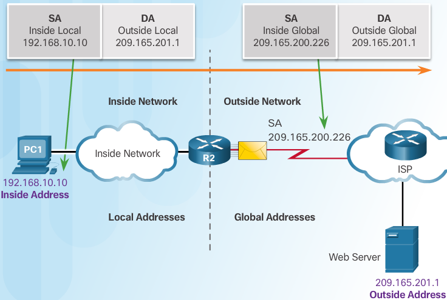

It is important to remember that NAT terminology is always applied from the perspective of the device with the translated address:

Inside address
 The address of the device which is being translated by NAT.

Outside address
 The address of the destination device.

NAT also uses the concept of local or global with respect to addresses:

Local address
 A local address is any address that appears on the inside portion of the network.

Global address
 A global address is any address that appears on the outside portion of the network.

PC1 has an inside local address of 192.168.10.10. From the perspective of PC1, the web server has an outside address of 209.165.201.1. When packets are sent from PC1 to the global address of the web server, the inside local address of PC1 is translated to 209.165.200.226 (inside global address). The address of the outside device is not typically translated, because that address is usually a public IPv4 address.

.. note:: PC1 has different local and global addresses, whereas the web server has the same public IPv4 address for both. From the perspective of the web server, traffic originating from PC1 appears to have come from 209.165.200.226, the inside global address.

The NAT router, R2, is the **demarcation point** between the inside and outside networks and as between local and global addresses.

NAT Address Terminology
-----------------------

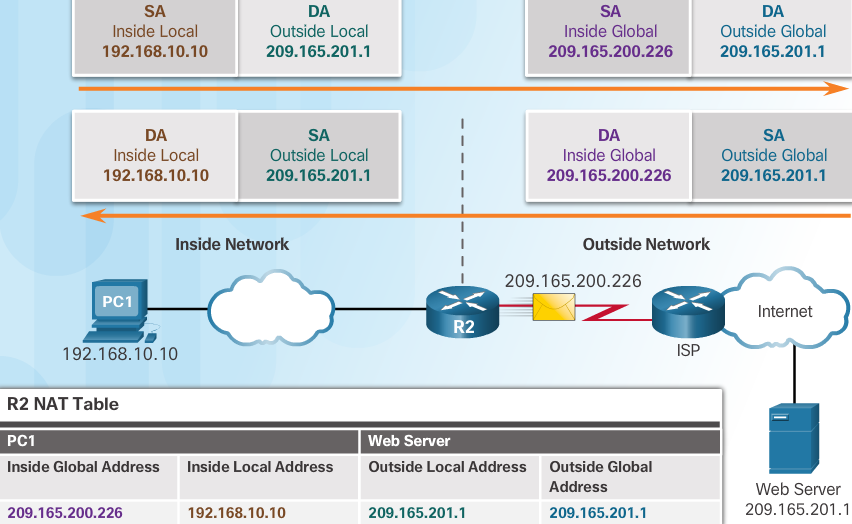

The terms, inside and outside, are combined with the terms local and global to refer to specific addresses. In the figure, router R2 has been configured to provide NAT. It has a pool of public addresses to assign to inside hosts.

Inside local address
 The address of the source as seen from inside the network. In the figure, the IPv4 address 192.168.10.10 is assigned to PC1. This is the inside local address of PC1.

Inside global address
 **The address of source as seen from the outside network**. In the figure, when traffic from PC1 is sent to the web server at 209.165.201.1,**R2 translates the inside local address to an inside global address**. In this case, R2 changes the IPv4 source address **from 192.168.10.10 to 209.165.200.226**. In NAT terminology, the **inside local address of 192.168.10.10 is translated to the inside global address of 209.165.200.226**.

Outside global address
 **The address of the destination as seen from the outside network**. It is a **globally routable IPv4 address assigned to a host on the Internet**. For example, the web server is reachable at IPv4 address 209.165.201.1. Most often the outside local and outside global addresses are the same.

Outside local address
 **The address of the destination as seen from the inside network**. In this example, PC1 sends traffic to the web server at the IPv4 address 209.165.201.1. While uncommon, this address could be different than the globally routable address of the destination.

The figure shows how traffic is addressed that is sent from an internal PC to an external web server, across the NAT-enabled router. It also shows how return traffic is initially addressed and translated.

Note: The use of the outside local address is outside the scope of this course.

.. note:: inside = Source  outside = Destination 

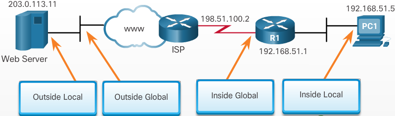

Static NAT
----------

.. image:: ../../../_static/img/Ch9_Static_NAT.png

There are three types of NAT translation:

Static address translation (static NAT)
 One-to-one address mapping between local and global addresses.

Dynamic address translation (dynamic NAT)
 Many-to-many address mapping between local and global addresses. Translations are made on an as-available basis; for example, if there are 100 inside local addresses and 10 inside global addresses, then at any given time only 10 of the 100 inside local addresses can be translated. This limitation of dynamic NAT makes it much less useful for production networks than port address translation.

Port Address Translation (PAT)
 Many-to-one address mapping between local and global addresses. This method is also known as overloading (NAT overloading). For example, if there are 100 inside local addresses and 10 inside global addresses, PAT uses ports as an additional parameter to provide a multiplier effect, making it possible to reuse any one of the 10 inside global addresses up to 65,536 times (depending on whether the flow is based on UDP, TCP, or ICMP).

**Static NAT uses a one-to-one mapping of local and global addresses**. These mappings are configured by the network administrator and remain constant.

R2 is configured with static mappings for the inside local addresses of Svr1, PC2, and PC3. When these devices send traffic to the Internet, **their inside local addresses are translated to the configured inside global addresses**. **To outside networks, these devices have public IPv4 addresses.**

Static NAT is particularly **useful for web servers or devices that must have a consistent address that is accessible from the Internet**, such as a company web server. It is *also useful for devices that must be accessible by authorized personnel when offsite*, but not by the general public on the Internet. For example, a network administrator from PC4 can SSH to Svr1’s inside global address (209.165.200.226). R2 translates this inside global address to the inside local address and connects the administrator’s session to Svr1.

.. note:: Static NAT requires that enough public addresses are available to satisfy the total number of simultaneous user sessions.

Dynamic NAT
-----------

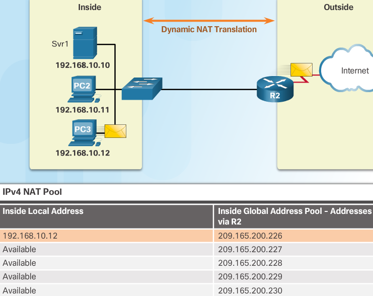

Dynamic NAT
 uses a pool of public addresses and assigns them on a **first-come, first-served basis**. When an inside device requests access to an outside network, dynamic NAT assigns an available public IPv4 address from the pool.

PC3 has accessed the Internet using the first available address in the dynamic NAT pool. The other addresses are still available for use.

.. note:: Similar to static NAT, dynamic NAT requires that enough public addresses are available to satisfy the total number of simultaneous user sessions.

PAT aka NAT Overload
--------------------

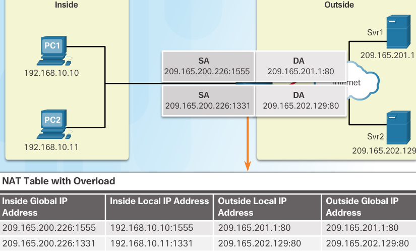

Port Address Translation (PAT), also known as NAT overload, maps multiple private IPv4 addresses to a single public IPv4 address or a few addresses. This is what most home routers do. The ISP assigns one address to the router, yet several members of the household can simultaneously access the Internet. This is the most common form of NAT.

With PAT, multiple addresses can be mapped to one or to a few addresses, because each private address is also tracked by a port number. When a device initiates a TCP/IP session, it generates a TCP or UDP source port value or a specially assigned query ID for ICMP, to uniquely identify the session. When the NAT router receives a packet from the client, it uses its source port number to uniquely identify the specific NAT translation.

**PAT ensures that devices use a different TCP port number for each session with a server on the Internet. When a response comes back from the server, the source port number, which becomes the destination port number on the return trip, determines to which device the router forwards the packets. The PAT process also validates that the incoming packets were requested, thus adding a degree of security to the session.**

The source address (SA) is the inside local address with the TCP/IP assigned port number added. The destination address (DA) is the outside local address with the service port number added. In this example, the service port is 80, which is HTTP.

For the source address, R2 translates the inside local address to an inside global address with the port number added. The destination address is not changed, but is now referred to as the outside global IPv4 address. When the web server replies, the path is reversed.

.. note:: PAT attempts to preserve the original source port. However, if the original source port is already used, PAT assigns the first available port number starting from the beginning of the appropriate port group 0–511, 512–1,023, or 1,024–65,535. When there are no more ports available and there is more than one external address in the address pool, PAT moves to the next address to try to allocate the original source port. This process continues until there are no more available ports or external IPv4 addresses

NAT vs PAT
----------

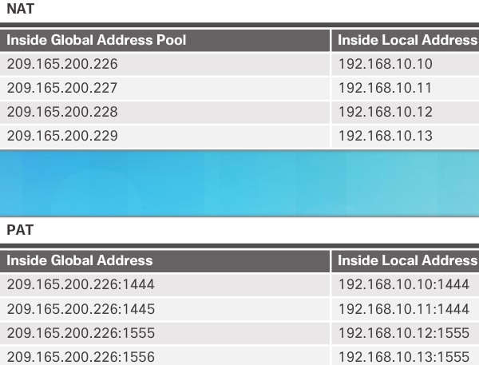

NAT translates IPv4 addresses on a 1:1 basis between private IPv4 addresses and public IPv4 addresses. However, PAT modifies both the address and the port number.

NAT forwards incoming packets to their inside destination by referring to the incoming source IPv4 address given by the host on the public network. With PAT, there is generally only one or a very few publicly exposed IPv4 addresses. Incoming packets from the public network are routed to their destinations on the private network by referring to a table in the NAT router. This table tracks public and private port pairs. **This is called connection tracking**

Packets without a Layer 4 Segment
^^^^^^^^^^^^^^^^^^^^^^^^^^^^^^^^^

What about IPv4 packets carrying data other than a TCP or UDP segment? These packets do not contain a Layer 4 port number. PAT translates most common protocols carried by IPv4 that do not use TCP or UDP as a transport layer protocol. The most common of these is ICMPv4. Each of these types of protocols is handled differently by PAT. For example, ICMPv4 query messages, echo requests, and echo replies include a Query ID. **ICMPv4 uses the Query ID to identify an echo request with its corresponding echo reply. The Query ID is incremented with each echo request sent. PAT uses the Query ID instead of a Layer 4 port number**.

Note: Other ICMPv4 messages do not use the Query ID. These messages and other protocols that do not use TCP or UDP port numbers vary and are beyond the scope of this curriculum.

.. code::

   R2#show ip nat translations
   Pro  Inside global     Inside local       Outside local      Outside global
   tcp 64.100.100.2:25    10.10.10.2:25      ---                ---
   tcp 64.100.100.2:443   10.10.10.2:443     ---                ---
   tcp 64.100.100.2:80    10.10.10.2:80      ---                ---
   
   R2#show ip nat translations
   Pro  Inside global     Inside local       Outside local      Outside global
   udp 64.100.100.2:1025  10.10.10.2:1025    64.100.8.8:53      64.100.8.8:53
   tcp 64.100.100.2:25    10.10.10.2:25      ---                ---
   tcp 64.100.100.2:443   10.10.10.2:443     ---                ---
   tcp 64.100.100.2:80    10.10.10.2:80      ---                ---
   tcp 64.100.100.3:1025  10.2.0.5:1025      64.100.200.1:80    64.100.200.1:80
   tcp 64.100.100.3:1026  10.2.0.5:1026      64.100.200.1:80    64.100.200.1:80
   tcp 64.100.100.3:1027  10.2.0.5:1027      64.100.200.1:80    64.100.200.1:80
   
   R2#show ip nat statistics
   Total translations: 7 (3 static, 4 dynamic, 7 extended)
   Outside Interfaces: Serial0/0/0 , Serial0/0/1.1
   Inside Interfaces: GigabitEthernet0/0 , GigabitEthernet0/1 , GigabitEthernet0/2
   Hits: 19  Misses: 4
   Expired translations: 0
   Dynamic mappings:
   -- Inside Source
   access-list 1 pool R2Pool refCount 4
    pool R2Pool: netmask 255.255.255.224
          start 64.100.100.3 end 64.100.100.31
          type generic, total addresses 29 , allocated 2 (6%), misses 0
   R2#
   
   R4#show ip nat translations
   Pro  Inside global     Inside local       Outside local      Outside global
   tcp 64.100.150.1:80    172.16.0.3:80      ---                ---
   tcp 64.100.200.1:25    172.16.0.3:25      ---                ---
   tcp 64.100.200.1:443   172.16.0.3:443     ---                ---
   tcp 64.100.200.1:80    172.16.0.3:80      ---                ---
   tcp 64.100.200.1:80    172.16.0.3:80      64.100.100.3:1025  64.100.100.3:1025
   tcp 64.100.200.1:80    172.16.0.3:80      64.100.100.3:1026  64.100.100.3:1026
   tcp 64.100.200.1:80    172.16.0.3:80      64.100.100.3:1027  64.100.100.3:1027
   
   R4#show ip nat sta
   R4#show ip nat statistics 
   Total translations: 7 (4 static, 3 dynamic, 6 extended)
   Outside Interfaces: Serial0/0/0 , Serial0/0/1 , Serial0/0/1.1
   Inside Interfaces: GigabitEthernet0/0
   Hits: 17  Misses: 5
   Expired translations: 0
   Dynamic mappings:
   R4#

NAT Advantages
--------------

+ Conserves the legally registered addressing scheme

  - by allowing privatization of intranets
  - NAT conserves addresses through app port-level multiplexing
  - with NAT overload very few external addresses are required to support many internal hosts

+ NAT increases flexibility of connections to public network

  - Multiple pools, backup pools, and load-balancing pools can be implemented to ensure reliable public network connections

+ Provides consistency for internal network addressing schemes

  - NAT allows the existing private IPv4 address scheme to remain while allowing for easy change to a new public addressing scheme. This means an organization could change ISPs and not need to change any of its inside clients.

+ Provides network security

  - NAT provides the side effect of hiding users and other devices’ IPv4 addresses. Some people consider this a security feature, however most experts agree that NAT does not provide security. A stateful firewall is what provides security on the edge of the network

NAT Disadvantages
-----------------

+ Performance is degraded

  - One disadvantage of using NAT is related to network performance, particularly for real time protocols such as VoIP. NAT increases forwarding delays because the translation of each IPv4 address within the packet headers takes time. The first packet is always process-switched going through the slower path. The router must look at every packet to decide whether it needs translation. The router must alter the IPv4 header, and possibly alter the TCP or UDP header. The IPv4 header checksum, along with the TCP or UDP checksum must be recalculated each time a translation is made. Remaining packets go through the fast-switched path if a cache entry exists; otherwise, they too are delayed.

+ End-to-end functionality is degraded

  - Many Internet protocols and applications depend on end-to-end addressing from the source to the destination. Some applications do not work with NAT. For example, some security applications, such as digital signatures, fail because the source IPv4 address changes before reaching the destination. Applications that use physical addresses, instead of a qualified domain name, do not reach destinations that are translated across the NAT router. **Sometimes, this problem can be avoided by implementing static NAT mappings.**

+ End-to-end IP traceability is lost

  - it becomes much more difficult to trace packets that undergo numerous packet address changes over multiple NAT hops, making troubleshooting challenging.

+ Tunneling becomes more complicated

  - Using NAT also complicates the use of tunneling protocols, such as IPsec, because NAT modifies values in the headers, causing integrity checks to fail.

+ Initiating TCP connections can be disrupted

  - Services that require the initiation of TCP connections from the outside network, or stateless protocols, such as those using UDP, can be disrupted. Unless the NAT router has been configured to support such protocols, incoming packets cannot reach their destination. Some protocols can accommodate one instance of NAT between participating hosts (passive mode FTP, for example), but fail when both systems are separated from the Internet by NAT.

Configuring Static NAT
----------------------

#. create a MAPPING between inside local address and the inside global addresses

   .. code::

      R(config)# ip nat inside source static local-ip global-ip

#. Specify the INSIDE interface
    In the example, the Serial 0/0/0 interface of R2 is an inside interface and Serial 0/1/0 is an outside interface.

   .. code::

      R(config)# interface type number

#. Mark the interface as connected to the inside

   .. code::

      R(config-if)# ip nat inside

#. Specify the OUTSIDE interface
    E.g. Serial 0/1/0
   
   .. code::
      
      R(config)# interface type number

#. Mark the interface as connected to the outside

   .. code::

      R(config-if)# ip nat outside

Image shows the commands needed on R2 to create a static NAT mapping to the web server in the example topology. With the configuration shown, R2 translates packets from the web server with address 192.168.10.254 to public IPv4 address 209.165.201.5. The Internet client directs web requests to the public IPv4 address 209.165.201.5. R2 forwards that traffic to the web server at 192.168.10.254.

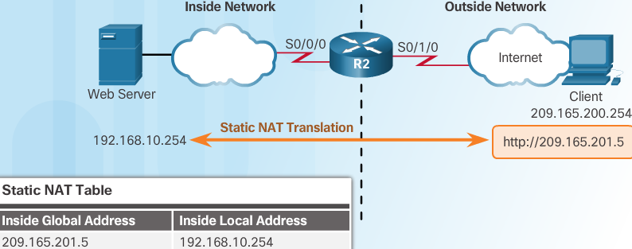

.. code::

   establishes static translation between an inside local address & an inside global address
   ---
   R2(config)# ip nat inside source static 192.168.10.254 209.165.201.5
   R2(config)# interface Serial0/0/0
   R2(config-if)# ip address 10.1.1.2 255.255.255.252
   
   identifies interface Serial 0/0/0 as an inside NAT interface
   ---
   R2(config-if)# ip nat inside
   R2(config-if)# exit 
   
   R2(config)# interface Serial 0/1/0
   R2(config-if)# ip address 209.165.200.1 255.255.255.252
   Identifies interface serial 0/1/0 as the outside NAT interface
   ---
   R2(config-if)# ip nat outside 

Static NAT Process
------------------

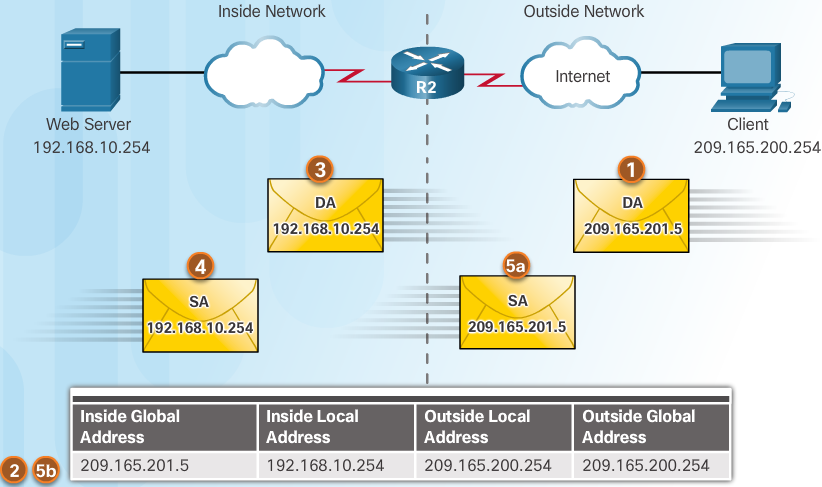

#. The client sends a packet to the web server using the public IPv4 destination address of 209.165.201.5. This is the **inside global address of the web server**

#. The first packet that R2 receives from the client on its NAT outside interface causes R2 to check its NAT table. The destination IPv4 address is located in the NAT table and is translated

#. R2 **replaces the inside global address of 209.165.201.5 with the inside local address of 192.168.10.254**. R2 then forwards the packet towards the web server.

#. The web server receives the packet and responds to the client using the **inside local address**, 192.168.10.254

#. Router 2

   a. receives the packet from the webserver on its **NAT inside interface with source address of the inside local address of the webserver**,192.168.10.254
   b. checks the **NAT table for a translation for the inside local address**. The address is found in the NAT table. R2 **translates the source address to the inside global address of 209.165.201.5** and forwards the packet toward the client

#. The client receives the packet and continues the conversation. The NAT router performs Steps 2 to 5b for each packet.

verify with
 ``show ip nat translations``
clear nat statistics
 ``clear ip nat statistics``
check if nat is working
 ``ip nat statistics``

In this example it would show **1 static** in **Total active translations**

Configure Static NAT exercise
-----------------------------

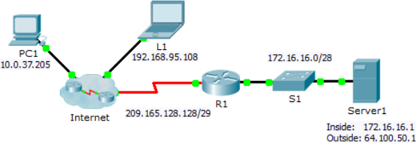

configure static NAT so that outside devices can access and inside server at its public address

.. code::

   R1>enable
   R1#show ip nat translations
   R1#map the server1 inside address to its outside address
   R1#conf t
   Enter configuration commands, one per line.  End with CNTL/Z.
   R1(config)#ip nat inside source static 172.16.16.1 64.100.50.1
   R1(config)#interface Gig0/0
   R1(config-if)#ip nat inside
   R1(config-if)#exit
   R1(config)#interface Serial0/0/0
   R1(config-if)#ip nat outside
   R1(config-if)#exit

Use the following commands to verify the static NAT configuration:

.. code:: 

   show running-config
   show ip nat translations
   show ip nat statistics

   R1#show running-config
   !
   !
   interface GigabitEthernet0/0
    ip address 172.16.16.14 255.255.255.240
    ip nat inside
    duplex auto
    speed auto
   !
   interface GigabitEthernet0/1
    no ip address
    duplex auto
    speed auto
    shutdown
   !
   interface GigabitEthernet0/2
    no ip address
    duplex auto
    speed auto
    shutdown
   !
   interface Serial0/0/0
    ip address 209.165.128.130 255.255.255.248
    ip nat outside
   !
   interface Serial0/0/1
    no ip address
    clock rate 2000000
    shutdown
   !
   interface Vlan1
    no ip address
    shutdown
   !
   ip nat inside source static 172.16.16.1 64.100.50.1 
   ip classless
   !
   ip flow-export version 9
   !
  
   R1#show ip nat translations
   Pro  Inside global     Inside local       Outside local      Outside global
   ---  64.100.50.1       172.16.16.1        ---                ---
   
   R1#show ip nat statistics
   Total translations: 1 (1 static, 0 dynamic, 0 extended)
   Outside Interfaces: Serial0/0/0
   Inside Interfaces: GigabitEthernet0/0
   Hits: 0  Misses: 0
   Expired translations: 0
   Dynamic mappings: 

Dynamic NAT operation
---------------------

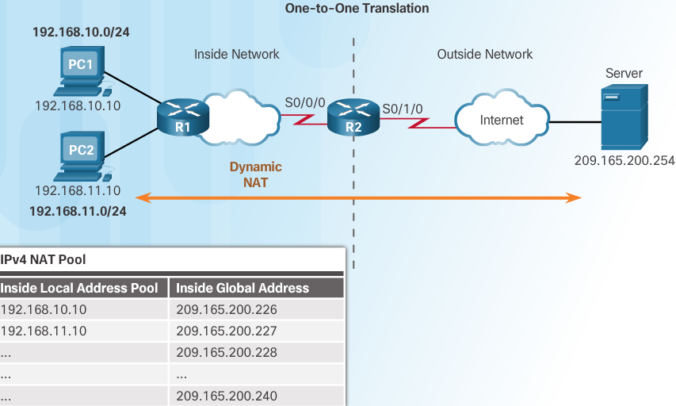

While static NAT provides a permanent mapping between an inside local address and an inside global address, **dynamic NAT allows the automatic mapping of inside local addresses to inside global addresses**. **These inside global addresses are typically public IPv4 addresses**. Dynamic NAT uses a group, or pool of public IPv4 addresses for translation.

Dynamic NAT, like static NAT, requires the configuration of the inside and outside interfaces participating in NAT. However, where static NAT creates a permanent mapping to a single address, dynamic NAT uses a pool of addresses.

                                                                                                        
Attached to router R1 are two LANs, 192.168.10.0/24 and 192.168.11.0/24. Router R2, the border router, is configured for dynamic NAT using a pool of public IPv4 addresses 209.165.200.226 through 209.165.200.240

The pool of public IPv4 addresses **(inside global address pool)** is available to any device on the inside network on a first-come first-served basis. 

.. note:: With dynamic NAT, a single inside address is translated to a single outside address. With this type of translation there must be enough addresses in the pool to accommodate all the inside devices needing access to the outside network at the same time. If all of the addresses in the pool have been used, a device must wait for an available address before it can access the outside network.                                                                                                        

Configuring Dynamic NAT
-----------------------

#. Define a **pool of global addresses** to be used for translation

   .. code::

      R(config)# ip nat pool name start-ip end-ip {netmask netmask | prefix-length prefix-length}

#. Configure a standard **access list permitting the addresses that should be translated**

   .. code::

      R(config)# access-list access-list-number permit source [source-wildcard]

#. Establish dynamic **source** translation, specifying the **access list and pool** defined in prior steps

   .. code::

      R(config-if)# ip nat inside source list access-list-number pool name

#. identify the INSIDE interface
   
   .. code::
      
      R(config)# interface type number
      R(config-if)# ip nat inside

#. identify the OUTSIDE interface

   .. code::
      
      R(config)# interface type number
      R(config-if)# ip nat outside

Dynamic NAT example
-------------------

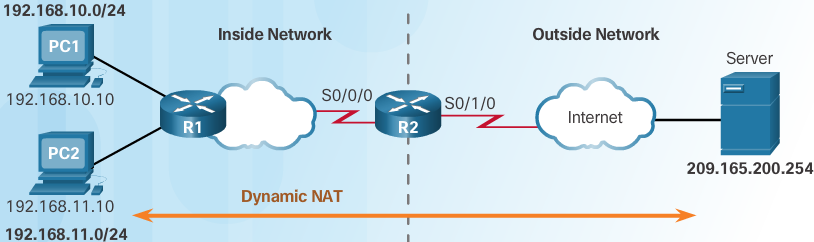

Defines a pool of public IPv4 addresses under the pool name NAT POOL1

.. code::

   R2(config)# ip nat pool NAT-POOL1 209.165.200.226 209.165.200.240 netmask 255.255.255.224

Defines what addresses are eligible to be translated

.. code::

   R2(config)# access-list 1 permit 192.168.0.0 0.0.255.255

Binds NAT-POOL1 with ACL 1

.. code::

   R2(config)# ip nat inside source list 1 pool NAT-POOL1

Identifies interface serial 0/0/0 as an inside NAT interface

.. code::

   R2(config)# interface Serial 0/0/0
   R2(config-if)# ip nat inside 

Dynamic NAT process
-------------------

.. image:: ../../../_static/img/Ch9_Dynamic_NAT_process_1.png

Using the previous configuration, the figures illustrate the dynamic NAT translation process between two clients and the web server:

In image 1, the traffic flow from inside to outside is shown:

#. The hosts with the source IPv4 addresses (192.168.10.10 (PC1) and 192.168.11.10 (PC2)) send packets requesting a connection to the server at the public IPv4 address (209.165.200.254).

#. R2 receives the first packet from host 192.168.10.10. Because this packet was received on an interface configured as an inside NAT interface, R2 checks the NAT configuration to determine if this packet should be translated. The ACL permits this packet, so R2 will translate the packet. R2 checks its NAT table. **Because there is no translation entry for this IPv4 address, R2 determines that the source address 192.168.10.10 must be translated dynamically**. R2 selects an available global address from the dynamic address pool and creates a translation entry, 209.165.200.226. The original source IPv4 address (192.168.10.10) is the inside local address and the translated address is the inside global address (209.165.200.226) in the NAT table.

   For the second host, 192.168.11.10, R2 repeats the procedure, selects the next available global address from the dynamic address pool, and creates a second translation entry, 209.165.200.227.

#. R2 replaces the inside local source address of PC1, 192.168.10.10, with the translated inside global address of 209.165.200.226 and forwards the packet. The same process occurs for the packet from PC2 using the translated address for PC2 (209.165.200.227).

   .. image:: ../../../_static/img/Ch9_Dynamic_NAT_process_2.png

   In image 2, the traffic flow from outside to inside is shown:

#. The server receives the packet from PC1 and responds using the IPv4 destination address of 209.165.200.226. When the server receives the second packet, it responds to PC2 using the IPv4 destination address of 209.165.200.227.

#. When R2 receives the packet with the destination IPv4 address of 209.165.200.226;
   
   a) **it performs a NAT table lookup**. Using the mapping from the table, R2 translates the address back to the inside local address (192.168.10.10) and forwards the packet toward PC1.

   b) When R2 receives the packet with the destination IPv4 address of 209.165.200.227; it performs a NAT table lookup. Using the mapping from the table, R2 translates the address back to the inside local address (192.168.11.10) and forwards the packet toward PC2.

#. PC1 at 192.168.10.10 and PC2 at 192.168.11.10 receive the packets and continue the conversation. The router performs Steps 2 to 5 for each packet.

Verify with ``R2# show ip nat translations verbose``

.. note:: By default, translation entries time out after 24 hours, unless the timers have been reconfigured with the ``ip nat translation timeout timeout-seconds`` command in global configuration mode.

Clearing NAT Translations
-------------------------

.. code::

   clears all dynamic address translation entries from the NAT translation table
   -----------------------------------------------------------------------------
   R2# clear ip nat translation *

   Clear a simple dynamic translation entry containing an inside translation
   or both inside & outside translation
   ------------------------------------
   R2# clear ip nat translation inside global-ip local-ip [outside local-ip global-ip]

   Clears an extended dynamic translation entry
   --------------------------------------------
   R2# clear ip nat translation protocol inside global-ip global-port local-ip local-port
    [outside local-ip local-port global-ip global-port]

.. note:: Only the dynamic translations are cleared from the table. Static translations cannot be cleared from the translation table

``R2# clear ip nat statistics``

Configure Dynamic NAT exercise
------------------------------

.. image:: ../../../_static/img/Ch9_9.2.2.5_Configuring_Dynamic_NAT.png

configure dynamic NAT
^^^^^^^^^^^^^^^^^^^^^
On R2:

+ configure one statement for ACL 1 to permit any address belonging to 172.16.0.0/16
  
  .. code::

     R2(config)#access-list 1 permit 172.16.0.0 0.0.255.255

+ Configure a NAT pool that uses all four addresses in the 209.165.76.196/30 address space

  .. code::

     R2(config)#ip nat pool NAT-POOL1 209.165.76.196 209.165.76.199 netmask 255.255.255.252

Notice in the topology there are 3 network ranges that would be translated based on the ACL created. What will happen if more than 2 devices attempt to access the Internet?

+ Associate ACL1 with the NAT pool
  
  .. code::

     R2(config)# ip nat inside source list 1 nat NAT-POOL1

+ Configure the NAT interfaces

  Configure R2 interfaces with the appropriate inside and outside NAT commands
  
  .. code::

     R2(config)#interface Serial 0/0/0
     R2(config-if)#ip nat outside
     R2(config-if)#interface Serial 0/0/1
     R2(config-if)#ip nat inside

.. warning:: 

   if you try to remove an active pool you will get an error msg that it is in use ``R2(config)#no ip nat pool 1 209.165.76.192 209.165.76.195 netmask 255.255.255.252``
   %Pool 1 in use, cannot destroy
   You need to remove the pool reference first from the inside nat
   ``R2(config)#no ip nat inside source list 1``

Verify NAT implementation
^^^^^^^^^^^^^^^^^^^^^^^^^

.. code::

   R2 running-config
   -----------------
   !
   interface Serial0/0/0
    ip address 209.165.76.193 255.255.255.224
    ip nat outside
    clock rate 2000000
   !
   interface Serial0/0/1
    ip address 172.16.1.1 255.255.255.252
    ip nat inside
    clock rate 2000000
   !
   interface Vlan1
    no ip address
    shutdown
   !
   ip nat pool NAT-POOL1 209.165.76.196 209.165.76.199 netmask 255.255.255.252
   ip nat inside source list 1 pool NAT-POOL1
   ip classless
   ip route 0.0.0.0 0.0.0.0 Serial0/0/0 
   ip route 172.16.0.0 255.255.0.0 Serial0/0/1 
   !
   ip flow-export version 9
   !
   !
   access-list 1 permit 172.16.0.0 0.0.255.255
   !
   

+ From the web browser of L1, PC1, or PC2, access the web page for Server1

  The first 2 devices have access and any additional devices are denied access until the other 2 are timed out.

+ View the NAT translations on R2

  .. code::

     R2#show ip nat statistics 
     Total translations: 0 (0 static, 0 dynamic, 0 extended)
     Outside Interfaces: Serial0/0/0
     Inside Interfaces: Serial0/0/1
     Hits: 0  Misses: 0
     Expired translations: 0
     Dynamic mappings:
     -- Inside Source
     access-list 1 pool NAT-POOL1 refCount 0
      pool NAT-POOL1: netmask 255.255.255.252
            start 209.165.76.196 end 209.165.76.199
            type generic, total addresses 4 , allocated 0 (0%), misses 0

     R2#show ip nat statistics 
     Total translations: 2 (0 static, 2 dynamic, 2 extended)
     Outside Interfaces: Serial0/0/0
     Inside Interfaces: Serial0/0/1
     Hits: 15  Misses: 2
     Expired translations: 0
     Dynamic mappings:
     -- Inside Source
     access-list 1 pool NAT-POOL1 refCount 2
      pool NAT-POOL1: netmask 255.255.255.252
            start 209.165.76.196 end 209.165.76.199
            type generic, total addresses 4 , allocated 1 (25%), misses 0

     R2#show ip nat statistics 
     Total translations: 3 (0 static, 3 dynamic, 3 extended)
     Outside Interfaces: Serial0/0/0
     Inside Interfaces: Serial0/0/1
     Hits: 22  Misses: 3
     Expired translations: 0
     Dynamic mappings:
     -- Inside Source
     access-list 1 pool NAT-POOL1 refCount 3
      pool NAT-POOL1: netmask 255.255.255.252
            start 209.165.76.196 end 209.165.76.199
            type generic, total addresses 4 , allocated 2 (50%), misses 0

     R2#show ip nat translations 
     Pro  Inside global     Inside local       Outside local      Outside global
     tcp 209.165.76.197:1025172.16.10.1:1025   209.165.201.5:80   209.165.201.5:80
     tcp 209.165.76.197:1026172.16.10.1:1026   209.165.201.5:80   209.165.201.5:80
     tcp 209.165.76.198:1025172.16.10.2:1025   209.165.201.5:80   209.165.201.5:80
     
     R2#show ip nat translations 
     Pro  Inside global     Inside local       Outside local      Outside global
     tcp 209.165.76.197:1025172.16.10.1:1025   209.165.201.5:80   209.165.201.5:80
     tcp 209.165.76.197:1026172.16.10.1:1026   209.165.201.5:80   209.165.201.5:80
     tcp 209.165.76.198:1025172.16.10.2:1025   209.165.201.5:80   209.165.201.5:80
     
     R2#show ip nat statistics 
     Total translations: 3 (0 static, 3 dynamic, 3 extended)
     Outside Interfaces: Serial0/0/0
     Inside Interfaces: Serial0/0/1
     Hits: 22  Misses: 27
     Expired translations: 0
     Dynamic mappings:
     -- Inside Source
     access-list 1 pool NAT-POOL1 refCount 3
      pool NAT-POOL1: netmask 255.255.255.252
            start 209.165.76.196 end 209.165.76.199
            type generic, total addresses 4 , allocated 2 (50%), misses 24

     R2#show ip nat statistics 
     Total translations: 3 (0 static, 3 dynamic, 3 extended)
     Outside Interfaces: Serial0/0/0
     Inside Interfaces: Serial0/0/1
     Hits: 22  Misses: 39
     Expired translations: 0
     Dynamic mappings:
     -- Inside Source
     access-list 1 pool NAT-POOL1 refCount 3
      pool NAT-POOL1: netmask 255.255.255.252
            start 209.165.76.196 end 209.165.76.199
            type generic, total addresses 4 , allocated 2 (50%), misses 36

     R2#show ip nat statistics 
     Total translations: 3 (0 static, 3 dynamic, 3 extended)
     Outside Interfaces: Serial0/0/0
     Inside Interfaces: Serial0/0/1
     Hits: 22  Misses: 51
     Expired translations: 0
     Dynamic mappings:
     -- Inside Source
     access-list 1 pool NAT-POOL1 refCount 3
      pool NAT-POOL1: netmask 255.255.255.252
            start 209.165.76.196 end 209.165.76.199
            type generic, total addresses 4 , allocated 2 (50%), misses 48

     R2#show ip nat statistics 
     Total translations: 3 (0 static, 3 dynamic, 3 extended)
     Outside Interfaces: Serial0/0/0
     Inside Interfaces: Serial0/0/1
     Hits: 22  Misses: 63
     Expired translations: 0
     Dynamic mappings:
     -- Inside Source
     access-list 1 pool NAT-POOL1 refCount 3
      pool NAT-POOL1: netmask 255.255.255.252
            start 209.165.76.196 end 209.165.76.199
            type generic, total addresses 4 , allocated 2 (50%), misses 60

     R2#clear ip nat translation 
     % Incomplete command.
     R2#clear ip nat translation ?
       *  Deletes all dynamic translations
     R2#clear ip nat translation *
     R2#show ip nat translations 
     Pro  Inside global     Inside local       Outside local      Outside global
     tcp 209.165.76.197:1027172.16.10.1:1027   209.165.201.5:80   209.165.201.5:80
     tcp 209.165.76.198:1030172.16.11.1:1030   209.165.201.5:80   209.165.201.5:80
     
     R2#show ip nat statistics 
     Total translations: 2 (0 static, 2 dynamic, 2 extended)
     Outside Interfaces: Serial0/0/0
     Inside Interfaces: Serial0/0/1
     Hits: 36  Misses: 65
     Expired translations: 0
     Dynamic mappings:
     -- Inside Source
     access-list 1 pool NAT-POOL1 refCount 2
      pool NAT-POOL1: netmask 255.255.255.252
            start 209.165.76.196 end 209.165.76.199
            type generic, total addresses 4 , allocated 2 (50%), misses 60

Configure Dynamic & Static NAT Lab
----------------------------------

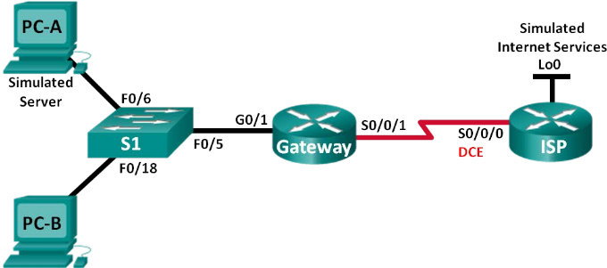

Addressing Table 9.2.2.6
^^^^^^^^^^^^^^^^^^^^^^^^

+-------------------------+--------------+----------------+-----------------+-----------------+
| Device                  | Interface    | IP Address     | Subnet Mask     | Default Gateway |
+=========================+==============+================+=================+=================+
| Gateway                 | G0/1         | 192.168.1.1    | 255.255.255.0   | N/A             |
+-------------------------+--------------+----------------+-----------------+-----------------+
|                         | S0/0/1       | 209.165.201.18 | 255.255.255.252 | N/A             |
+-------------------------+--------------+----------------+-----------------+-----------------+
| ISP                     | S0/0/0 (DCE) | 209.165.201.17 | 255.255.255.252 | N/A             |
+-------------------------+--------------+----------------+-----------------+-----------------+
|                         | Lo0          | 192.31.7.1     | 255.255.255.255 | N/A             |
+-------------------------+--------------+----------------+-----------------+-----------------+
| PC-A (Simulated Server) | NIC          | 192.168.1.20   | 255.255.255.0   | 192.168.1.1     |
+-------------------------+--------------+----------------+-----------------+-----------------+
| PC-B                    | NIC          | 192.168.1.21   | 255.255.255.0   | 192.168.1.1     |
+-------------------------+--------------+----------------+-----------------+-----------------+

Objectives 9.2.2.6
^^^^^^^^^^^^^^^^^^

Part 1: Build the Network and Verify Connectivity
Part 2: Configure and Verify Static NAT
Part 3: Configure and Verify Dynamic NAT

An ISP has allocated the public IP address space of 209.165.200.224/27 to a company. This provides the company with 30 public IP addresses. The addresses , 209.165.200.225 to 209.165.200.241, are for static allocation and 209.165.200.242 to 209.165.200.254 are for dynamic allocation.

A static route is used from the ISP to the gateway router, and a default route is used from the gateway to the ISP router. The ISP connection to the Internet is simulated by a loopback address on the ISP router.

Required Resources
^^^^^^^^^^^^^^^^^^

• 2 Routers (Cisco 1941 with Cisco IOS Release 15.2(4)M3 universal image or comparable)
• 1 Switch (Cisco 2960 with Cisco IOS Release 15.0(2) lanbasek9 image or comparable)
• 2 PCs (Windows 7, Vista, or XP with terminal emulation program, such as Tera Term)
• Console cables to configure the Cisco IOS devices via the console ports 
• Ethernet and serial cables as shown in the topology

Build network & verify connectivity
^^^^^^^^^^^^^^^^^^^^^^^^^^^^^^^^^^^

Basic settings for each router:

.. code::

   no ip domain-lookup 
   service password-encryption 
   enable secret class 
   banner motd # 
   Unauthorized access is strictly prohibited. # 
   line con 0 
   password cisco 
   login 
   logging synchronous 
   line vty 0 4 
   password cisco 
   login 

Configure the host name as shown in the topology.
Copy the running configuration to the startup configuration.

+ Create a simulated web server on ISP

  - Create a local user named webuser with an encrypted password of webpass
    
    .. code::

       ISP(config)# username webuser privilege 15 secret webpass

  - Create a default route from the Gateway router to the ISP router

    .. code::

       Gateway(config)# ip route 0.0.0.0 0.0.0.0 209.165.201.17

+ Save the running configuration to the startup configuration
+ Verify network connectivity

  - From the PC hosts, ping the G0/1 interface on the Gateway router. Troubleshoot if the pings are unsuccessful
  - Display the routing tables on both routers to verify that the static routes are in the routing table and configured correctly on both routers

Configure and Verify Static NAT
^^^^^^^^^^^^^^^^^^^^^^^^^^^^^^^

Static NAT uses a one-to-one mapping of local and global addresses, and these mappings remain constant. 
Static NAT is particularly useful for web servers or devices that must have static addresses that are accessible from the Internet

+ configure a static mapping

  A static map is configured to tell the router to translate between the private inside server address 192.168.1.20 and the public address 209.165.200.225. This allows a user from the Internet to access PC-A.
  PC-A is simulating a server or device with a constant address that can be accessed from the Internet.

  .. code::

     Gateway(config)# ip nat inside source static 192.168.1.20 209.165.200.225 
     
+ specify the interfaces

  - Issue the ``ip nat inside`` and ``ip nat outside`` commands to the interfaces

    .. code::

       Gateway(config)# interface g0/1 
       Gateway(config-if)# ip nat inside 
       Gateway(config-if)# interface s0/0/1 
       Gateway(config-if)# ip nat outside

  - Display the static NAT table by issuing the ``show ip nat translations`` command

    .. code::

       Gateway# show ip nat translations
       Pro Inside global      Inside local       Outside local      Outside global 
       --- 209.165.200.225    192.168.1.20       ---                --- 

    What is the translation of the Inside local host address?
    192.168.1.20 =  
    The Inside global address is assigned by?

    The Inside local address is assigned by?

  - From PC-A, ping the Lo0 interface ( 192.31.7.1) on ISP. If the ping was un successful, troubleshoot and correct the issues.  On the Gateway router, d isplay the NAT table.
    
    .. code:: 
    
       Gateway# show ip nat translations
       Pro Inside global      Inside local       Outside local      Outside global 
       icmp 209.165.200.225:1 192.168.1.20:1     192.31.7.1:1       192.31.7.1:1 
       --- 209.165.200.225    192.168.1.20       ---                --- 

    A NAT entry was added to the table with ICMP listed as the protocol when PC-A sent an ICMP request (ping) to 192.31.7.1 on ISP.
    What port number was used in this ICMP exchange? 
    Note: It may be necessary to disable the PC-A firewall for the ping to be successful.

  - From PC-A, telnet to the ISP Lo0 interface and display the NAT table

    .. code::

       Pro Inside global        Inside local       Outside local      Outside global 
       icmp 209.165.200.225:1   192.168.1.20:1     192.31.7.1:1       192.31.7.1:1 
       tcp 209.165.200.225:1034 192.168.1.20:1034  192.31.7.1:23      192.31.7.1:23 
       --- 209.165.200.225      192.168.1.20       ---                --- 

    Note: The NAT for the ICMP request may have timed out and been removed from the NAT table.
    What was the protocol used in this translation?
    What are the port numbers used?

    Inside global / local:
    Outside global / local:

  - Because static NAT was configured for PC-A, verify that pinging from ISP to PC-A at the static NAT public address (209.165.200.225) is successful.

  - On the Gateway router, display the NAT table to verify the translation.
    
    .. code::

       Gateway# show ip nat translations
       Pro Inside global       Inside local       Outside local      Outside global 
       icmp 209.165.200.225:12 192.168.1.20:12    209.165.201.17:12  209.165.201.17:12 
       --- 209.165.200.225     192.168.1.20       ---                --- 

    Notice that the Outside local and Outside global addresses are the same. This address is the ISP remote network source address. For the ping from the ISP to succeed, the Inside global static NAT address 209.165.200.225 was translated to the Inside local address of PC-A (192.168.1.20).

  - Verify NAT statistics by using the ``show ip nat statistics`` command on the Gateway router 
    
    .. code::

       Gateway# show ip nat statistics
       Total active translations: 2 (1 static, 1 dynamic; 1 extended) 
       Peak translations: 2, occurred 00:02:12 ago 
       Outside interfaces: 
         Serial0/0/1 
       Inside interfaces: 
         GigabitEthernet0/1 
       Hits: 39  Misses: 0 
       CEF Translated packets: 39, CEF Punted packets: 0 
       Expired translations: 3 
       Dynamic mappings: 
       Total doors: 0 
       Appl doors: 0 
       Normal doors: 0 
       Queued Packets: 0 

Configure and Verify Dynamic NAT
^^^^^^^^^^^^^^^^^^^^^^^^^^^^^^^^

Dynamic NAT
 uses a pool of public addresses and assigns them on a first-come, first-served basis. When an inside device requests access to an outside network, dynamic NAT assigns an available public IPv4 address from the pool. Dynamic NAT results in a many-to-many address mapping between local and global addresses.

- Clear NATs 
  Before proceeding to add dynamic NATs, clear the NATs and statistics from Part 2.

  .. code::
  
     Gateway# clear ip nat translation *
     Gateway# clear ip nat statistics

- Define an access control list (ACL) that matches the LAN private IP address range. 
  
  ACL 1 is used to allow 192.168.1.0/24 network to be translated.

  .. code::

     Gateway(config)# access-list 1 permit 192.168.1.0 0.0.0.255

- Verify that the NAT interface configurations are still valid
  
  Issue the ``show ip nat statistics`` command on the Gateway router to verify the NAT configurations.

- Define the pool of usable public IP addresses.

  .. code::
     
     Gateway(config)# ip nat pool public_access 209.165.200.242 209.165.200.254 netmask 255.255.255.224

- Define the NAT from the inside source list to the outside pool 

  Note: Remember that NAT pool names are case-sensitive and the pool name entered here must match that used in the previous step.

  .. code::

     Gateway(config)# ip nat inside source list 1 pool public_access 

- Test the configuration

  a. From PC-B, ping the Lo0 interface (192.31.7.1) on ISP. If the ping was unsuccessful, troubleshoot and correct the issues. On the Gateway router, display the NAT table.
     
     .. code::
        
        Gateway# show ip nat translations
        Pro Inside global      Inside local       Outside local      Outside global 
        --- 209.165.200.225    192.168.1.20       ---                --- 
        icmp 209.165.200.242:1 192.168.1.21:1     192.31.7.1:1       192.31.7.1:1 
        --- 209.165.200.242    192.168.1.21       ---                --- 

     What is the translation of the Inside local host address for PC-B? 
     
     192.168.1.21 =

     A dynamic NAT entry was added to the table with ICMP as the protocol when PC-B sent an ICMP message to 192.31.7.1 on ISP.

     What port number was used in this ICMP exchange? 

  b. From PC-B, open a browser and enter the IP address of the ISP-simulated web server (Lo0 interface)
     When prompted, log in as webuser with a password of webpass

  c. Display the NAT table.

     .. code::

        Gateway# show ip nat translations
        Pro Inside global        Inside local       Outside local      Outside global 
        --- 209.165.200.225      192.168.1.20       ---                --- 
        tcp 209.165.200.242:1038 192.168.1.21:1038 192.31.7.1:80     192.31.7.1:80 
        tcp 209.165.200.242:1039 192.168.1.21:1039 192.31.7.1:80     192.31.7.1:80 
        tcp 209.165.200.242:1040 192.168.1.21:1040 192.31.7.1:80     192.31.7.1:80 
        tcp 209.165.200.242:1041 192.168.1.21:1041 192.31.7.1:80     192.31.7.1:80 
        tcp 209.165.200.242:1042 192.168.1.21:1042 192.31.7.1:80     192.31.7.1:80 
        tcp 209.165.200.242:1043 192.168.1.21:1043 192.31.7.1:80     192.31.7.1:80 
        tcp 209.165.200.242:1044 192.168.1.21:1044 192.31.7.1:80     192.31.7.1:80 
        tcp 209.165.200.242:1045 192.168.1.21:1045 192.31.7.1:80     192.31.7.1:80 
        tcp 209.165.200.242:1046 192.168.1.21:1046 192.31.7.1:80     192.31.7.1:80 
        tcp 209.165.200.242:1047 192.168.1.21:1047 192.31.7.1:80     192.31.7.1:80 
        tcp 209.165.200.242:1048 192.168.1.21:1048 192.31.7.1:80     192.31.7.1:80 
        tcp 209.165.200.242:1049 192.168.1.21:1049 192.31.7.1:80     192.31.7.1:80 
        tcp 209.165.200.242:1050 192.168.1.21:1050 192.31.7.1:80     192.31.7.1:80 
        tcp 209.165.200.242:1051 192.168.1.21:1051 192.31.7.1:80     192.31.7.1:80 
        tcp 209.165.200.242:1052 192.168.1.21:1052 192.31.7.1:80     192.31.7.1:80 
        --- 209.165.200.242    192.168.1.22       ---                --- 

     What protocol was used in this translation? What port numbers were used?
     Inside: 
     Outside: 
     What well-known port number and service was used?

  d. Verify NAT statistics by using the ``show ip nat statistics`` command on the Gateway router
     
     .. code::

        Gateway# show ip nat statistics
        Total active translations: 3 (1 static, 2 dynamic; 1 extended) 
        Peak translations: 17, occurred 00:06:40 ago 
        Outside interfaces: 
          Serial0/0/1 
        Inside interfaces: 
          GigabitEthernet0/1 
        Hits: 345  Misses: 0 
        CEF Translated packets: 345, CEF Punted packets: 0 
        Expired translations: 20 
        Dynamic mappings: 
        -- Inside Source 
        [Id: 1] access-list 1 pool public_access refcount 2 
         pool public_access: netmask 255.255.255.224 
                start 209.165.200.242 end 209.165.200.254 
                type generic, total addresses 13, allocated 1 (7%), misses 0 
        Total doors: 0 
        Appl doors: 0 
        Normal doors: 0 
        Queued Packets: 0 

- Remove the static NAT entry

  a. Remove the static NAT from Part 2. Enter yes when prompted to delete child entries.

     .. code::
     
        Gateway(config)# no ip nat inside source static 192.168.1.20 209.165.200.225 
        Static entry in use, do you want to delete child entries? [no]: yes

  b. Clear the NATs and statistics.
  c. Ping the ISP (192.31.7.1) from both hosts.
  d. Display the NAT table and statistics.
     
     .. code::
        
        Gateway# show ip nat statistics 
        Total active translations: 4 (0 static, 4 dynamic; 2 extended) 
        Peak translations: 15, occurred 00:00:43 ago 
        Outside interfaces: 
          Serial0/0/1 
        Inside interfaces: 
          GigabitEthernet0/1 
        Hits: 16  Misses: 0 
        CEF Translated packets: 285, CEF Punted packets: 0 
        Expired translations: 11 
        Dynamic mappings: 
        -- Inside Source 
        [Id: 1] access-list 1 pool public_access refcount 4 
         pool public_access: netmask 255.255.255.224 
                start 209.165.200.242 end 209.165.200.254 
                type generic, total addresses 13, allocated 2 (15%), misses 0 
        Total doors: 0
        Appl doors: 0 
        Normal doors: 0 
        Queued Packets: 0 
        Gateway# show ip nat translation 
        Pro Inside global      Inside local       Outside local      Outside global 
        icmp 209.165.200.243:512 192.168.1.20:512 192.31.7.1:512     192.31.7.1:512 
        --- 209.165.200.243    192.168.1.20       ---                --- 
        icmp 209.165.200.242:512 192.168.1.21:512 192.31.7.1:512     192.31.7.1:512 
        --- 209.165.200.242    192.168.1.21       ---                --- 

Reflection
 #. Why would NAT be used in a network?
 #. What are the limitations of NAT?

Configuring PAT (NAT overload)
------------------------------

#. Define a pool of global addresses to be used for overload translation
   
   .. code::

      R(config)# ip nat pool NAT-POOL-OVERLOAD start-ip end-ip {netmask netmask prefix-length prefix-length}

#. Define a standard access list permitting the addresses that should be translated
   
   .. code::

      R(config)# access-list 1 permit source source-wildcard

#. Establish overload translation, specifying the acl and pool defined in prior steps
   
   .. code::

      R(config)# ip nat inside source list 1 pool NAT-POOL-OVERLOAD overload

#. Identify the inside interface
   
   .. code::

      R(config)# interface Serial 0/0/0
      R(config-if)# ip nat inside

#. Identify the outside interface

   .. code::

      R(config-if)# interface Serial 0/1/0
      R(config-if)# ip nat outside

When multiple inside local addresses map to one inside global address, the TCP or UDP port numbers of each inside host distinguish between the local addresses.

.. note:: The total number of internal addresses that can be translated to one external address could theoretically be as high as 65,536 per IPv4 address. However, the number of internal addresses that can be assigned a single IPv4 address is around 4,000.

There are two ways to configure PAT, depending on how the ISP allocates public IPv4 addresses:

 #. ISP allocates more than one public IPv4 address to the organization

 #. It allocates a single public IPv4 address that is required for the organization to connect to the ISP

.. note:: The primary difference between this configuration and the configuration for dynamic, one-to-one NAT is that the overload keyword is used. The **overload** keyword enables PAT.

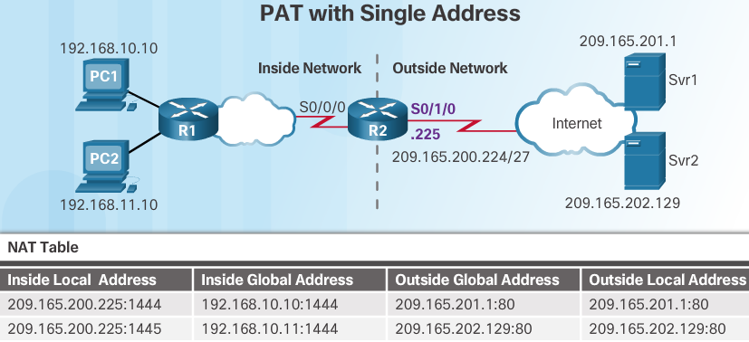

``R2(config)# ip nat inside source list 2 interface Serial 0/1/0 overload``

.. note:: PAT with single public ip = **interface** type number overload

PAT analysis
------------

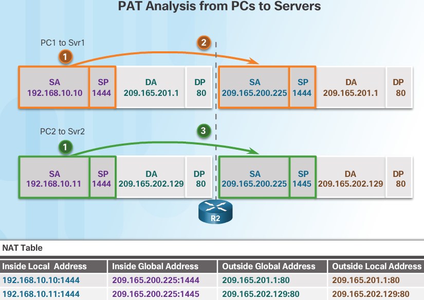

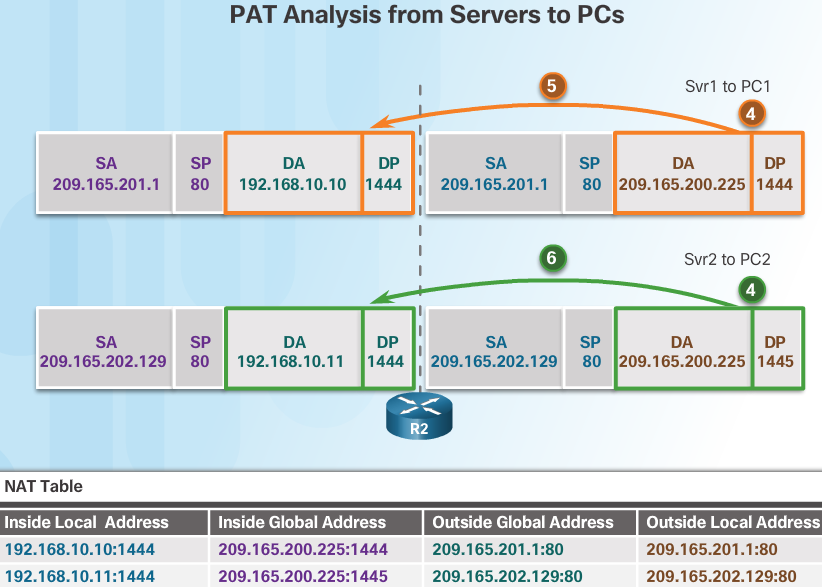

However, PC2 has the same source port number as a current PAT entry, the translation for PC1. **PAT increments the source port number until it is a unique value in its table**. In this instance, the source port entry in the NAT table and the packet for PC2 receives 1445.

Although PC1 and PC2 are using the same translated address, the inside global address of 209.165.200.225, and the same source port number of 1444; the modified port number for PC2 (1445) makes each entry in the NAT table unique. This will become evident with the packets sent from the servers back to the clients.

When the packet from Svr2 arrives R2 performs a similar translation. The destination IPv4 address of 209.165.200.225 is located, again with multiple entries. However, using the destination port of 1445, R2 is able to uniquely identify the translation entry. The destination IPv4 address is changed to 192.168.10.11. **In this case, the destination port must also be modified back to its original value of 1444, which is stored in the NAT table.** The packet is then forwarded toward PC2.

PT Implementing Static & Dynamic NAT
------------------------------------
PT 9.2.3.6
^^^^^^^^^^

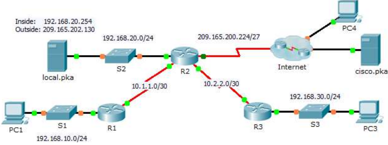

Configure dynamic NAT with PAT
^^^^^^^^^^^^^^^^^^^^^^^^^^^^^^

#. Configure traffic that will be permitted for NAT translations
   
   + On R2, configure a standard ACL named R2NAT that uses three statements to permit, in order, the following private address spaces:192.168.10.0/24, 192.168.20.0/24, and 192.168.30.0/24

     .. code::

        R2(config)#ip access-list standard R2NAT
        R2(config-std-nacl)#permit 192.168.10.0 0.0.0.255
        R2(config-std-nacl)#permit 192.168.20.0 0.0.0.255
        R2(config-std-nacl)#permit 192.168.30.0 0.0.0.255
        R2(config-std-nacl)#exit
        R2(config)#

#. Configure a pool of addresses for NAT

   + Configure R2 with a NAT pool named R2POOL that uses the first address in the 209.165.202.128/30 address space. The second address is used for static NAT later in Part 2.

     .. code::

        R2(config)#ip nat pool R2POOL 209.165.202.129 209.165.202.129 netmask 255.255.255.255

#. Associate the named ACL with the NAT pool and enable PAT

   .. code::

      R2(config)#ip nat inside source list R2NAT pool R2POOL overload

#. Configure the NAT interfaces

   + Configure R2 interfaces with the appropriate inside and outside NAT commands

     .. code::

        R2(config-if)#interface FastEthernet 0/1
        R2(config-if)#ip nat inside
        R2(config-if)#interface Serial 0/0/0
        R2(config-if)#ip nat inside
        R2(config-if)#interface Serial 0/0/1
        R2(config-if)#ip nat inside
        R2(config-if)#interface FastEthernet 0/0
        R2(config-if)#ip nat inside
        R2(config)#interface Serial 0/1/0
        R2(config-if)#ip nat outside
        R2(config-if)# exit

Configure Static NAT
^^^^^^^^^^^^^^^^^^^^

Create a static NAT translation to map the local.pka inside address to its outside address

.. code::

   R2(config)# ip nat inside source static 192.168.20.254 209.165.202.130

Verify NAT implementation 9.2.3.6
^^^^^^^^^^^^^^^^^^^^^^^^^^^^^^^^^

#. Access services across the Internet

   a. From the web browser of PC1, or PC3, access the web page for cisco.pka

   b. From the web browser for PC4, access the web page for local.pka

#. View NAT translations

   View the NAT translations on R2

   .. code::

      R2(config-if)#do show ip nat translations
      Pro  Inside global     Inside local       Outside local      Outside global
      ---  209.165.202.130   192.168.20.254     ---                ---
      tcp 209.165.202.129:1025192.168.10.10:1025 209.165.201.30:80  209.165.201.30:80
      tcp 209.165.202.129:1026192.168.10.10:1026 209.165.201.30:80  209.165.201.30:80
      tcp 209.165.202.129:1027192.168.10.10:1027 209.165.201.30:80  209.165.201.30:80
      tcp 209.165.202.130:80 192.168.20.254:80  209.165.201.14:1029209.165.201.14:1029
      
      R2(config-if)#do show ip access-list
      Standard IP access list R2NAT
          10 permit 192.168.10.0 0.0.0.255 (6 match(es))
          20 permit 192.168.20.0 0.0.0.255
          30 permit 192.168.30.0 0.0.0.255
      
      R2(config-if)#do show ip nat statistics
      Total translations: 5 (1 static, 4 dynamic, 4 extended)
      Outside Interfaces: Serial0/1/0
      Inside Interfaces: FastEthernet0/0 , FastEthernet0/1 , Serial0/0/0 , Serial0/0/1
      Hits: 68  Misses: 8
      Expired translations: 4
      Dynamic mappings:
      -- Inside Source
      access-list R2NAT pool R2POOL refCount 3
       pool R2POOL: netmask 255.255.255.255
             start 209.165.202.129 end 209.165.202.129
             type generic, total addresses 1 , allocated 1 (100%), misses 0

Router 2 running config

.. code::

   spanning-tree mode pvst
   !
   !
   !
   !
   !
   !
   interface FastEthernet0/0
    ip address 192.168.20.1 255.255.255.0
    ip nat inside
    duplex auto
    speed auto
   !
   interface FastEthernet0/1
    no ip address
    ip nat inside
    duplex auto
    speed auto
    shutdown
   !
   interface Serial0/0/0
    ip address 10.1.1.2 255.255.255.252
    ip nat inside
   !
   interface Serial0/0/1
    ip address 10.2.2.1 255.255.255.252
    ip nat inside
    clock rate 64000
   !
   interface Serial0/1/0
    ip address 209.165.200.225 255.255.255.224
    ip nat outside
   !
   interface Serial0/1/1
    no ip address
    clock rate 2000000
    shutdown
   !
   interface Vlan1
    no ip address
    shutdown
   !
   router rip
    version 2
    passive-interface Serial0/1/0
    network 10.0.0.0
    default-information originate
    no auto-summary
   !
   ip nat pool R2POOL 209.165.202.129 209.165.202.129 netmask 255.255.255.255
   ip nat inside source list R2NAT pool R2POOL overload
   ip nat inside source static 192.168.20.254 209.165.202.130 
   ip classless
   ip route 0.0.0.0 0.0.0.0 Serial0/1/0 
   !
   ip flow-export version 9
   !
   !
   ip access-list standard R2NAT
    permit 192.168.10.0 0.0.0.255
    permit 192.168.20.0 0.0.0.255
    permit 192.168.30.0 0.0.0.255
   !
   banner motd ^CAUTHORIZED ACCESS ONLY!^C

Configure PAT NAT Lab
---------------------

.. image:: ../../../_static/img/Ch9_9.2.3.7_Configuring_PAT_NAT_lab.png

Addressing Table 9.2.3.7
^^^^^^^^^^^^^^^^^^^^^^^^

+-------------------------+--------------+----------------+-----------------+-----------------+
| Device                  | Interface    | IP Address     | Subnet Mask     | Default Gateway |
+=========================+==============+================+=================+=================+
| Gateway                 | G0/1         | 192.168.1.1    | 255.255.255.0   | N/A             |
+-------------------------+--------------+----------------+-----------------+-----------------+
|                         | S0/0/1       | 209.165.201.18 | 255.255.255.252 | N/A             |
+-------------------------+--------------+----------------+-----------------+-----------------+
| ISP                     | S0/0/0 (DCE) | 209.165.201.17 | 255.255.255.252 | N/A             |
+-------------------------+--------------+----------------+-----------------+-----------------+
|                         | Lo0          | 192.31.7.1     | 255.255.255.255 | N/A             |
+-------------------------+--------------+----------------+-----------------+-----------------+
| PC-A (Simulated Server) | NIC          | 192.168.1.20   | 255.255.255.0   | 192.168.1.1     |
+-------------------------+--------------+----------------+-----------------+-----------------+
| PC-B                    | NIC          | 192.168.1.21   | 255.255.255.0   | 192.168.1.1     |
+-------------------------+--------------+----------------+-----------------+-----------------+
| PC-C                    | NIC          | 192.168.1.22   | 255.255.255.0   | 192.168.1.1     |
+-------------------------+--------------+----------------+-----------------+-----------------+

Objectives 9.2.3.7
^^^^^^^^^^^^^^^^^^

Part 1: Build the Network and Verify Connectivity
Part 2: Configure and Verify NAT Pool Overload
Part 3: Configure and Verify PAT

your company is allocated the public IP address range of 209.165.200.224/29 by the ISP . This provides the company with six public IP addresses

Dynamic NAT pool overload uses a pool of IP addresses in a many-to-many relationship. The router uses the first IP address in the pool and assigns connections using the IP address plus a unique port number. After the maximum number of translations for a single IP address have been reached on the router (platform and hardware specific), it uses the next IP address in the pool.

NAT pool overload is a form port address translation (PAT) that overloads a group of public IPv4 addresses.

In Part 2, the ISP has allocated a single IP address, 209.165.201.18, to your company for use on the Internet connection from the company G ateway router to the ISP.  You will use the PAT to convert multiple internal addresses into the one usable public address. You will test, view, and verify that the translations are taking place, and you will interpret the NAT/PAT statistics to monitor the process.

Required Resources 9.2.3.7
^^^^^^^^^^^^^^^^^^^^^^^^^^

• 2 Routers (Cisco 1941 with Cisco IOS Release 15.2(4)M3 universal image or comparable)
• 1 Switch (Cisco 2960 with Cisco IOS Release 15.0(2) lanbasek9 image or comparable)
• 3 PCs (Windows 7, Vista, or XP with terminal emulation program, such as Tera Term)
• Console cables to configure the Cisco IOS devices via the console ports 
• Ethernet and serial cables as shown in the topology

Build network & verify connectivity 9.2.3.7
^^^^^^^^^^^^^^^^^^^^^^^^^^^^^^^^^^^^^^^^^^^

Basic settings for each router:

.. code::

   no ip domain-lookup 
   service password-encryption 
   enable secret class 
   banner motd # 
   Unauthorized access is strictly prohibited. # 
   line con 0 
   password cisco 
   login 
   logging synchronous 
   line vty 0 4 
   password cisco 
   login 

Configure Static Routing

+ Create a static route from the ISP router to the Gateway router

  .. code::

     ISP(config)# ip route 209.165.200.224 255.255.255.248 209.165.201.18 

+ Create a default route from the Gateway router to the ISP router

  .. code::

     Gateway(config)# ip route 0.0.0.0 0.0.0.0 209.165.201.17 

+ Verify network connectivity

a. From the PC hosts, ping the G0/1 interface on the Gateway router. Troubleshoot if the pings are unsuccessful.
b. Verify that the static routes are configured correctly on both routers.

Configure and Verify NAT Pool Overload 9.2.3.7
^^^^^^^^^^^^^^^^^^^^^^^^^^^^^^^^^^^^^^^^^^^^^^

You will configure the Gateway router to translate the IP addresses from the 192.168.1.0/24 network to one of the six usable addresses in the 209.165.200.224/29 range.

#. Define an access control list that matches the LAN private IP addresses.
   ACL 1 is used to allow the 192.168.1.0/24 network to be translated.
   
   .. code::
   
      Gateway(config)# access-list 1 permit 192.168.1.0 0.0.0.255 

#. Define the pool of usable public IP addresses.
   
   .. code::

      Gateway(config)# ip nat pool public_access 209.165.200.225 209.165.200.230 netmask 255.255.255.248 

#. Define the NAT from the inside source list to the outside pool. 

   .. code::

      Gateway(config)# ip nat inside source list 1 pool public_access overload 

#. Specify the interfaces

   Issue the ip nat inside and ip nat outside commands to the interfaces.

   .. code::

      Gateway(config)# interface g0/1
      Gateway(config-if)# ip nat inside 
      Gateway(config- if)# interface s0/0/1 
      Gateway(config-if)# ip nat outside 

#. Verify the NAT pool overload configuration.

   a. From each PC host, ping the 192.31.7.1 address on the ISP router.
   b. Display NAT statistics on the Gateway router.

      .. code::
      
         Gateway# show ip nat statistics 
         Total active translations: 3 (0 static, 3 dynamic; 3 extended) 
         Peak translations: 3, occurred 00:00:25 ago 
         Outside interfaces: 
           Serial0/0/1 
         Inside interfaces: 
           GigabitEthernet0/1 
         Hits: 24  Misses: 0 
         CEF Translated packets: 24, CEF Punted packets: 0 
         Expired translations: 0 
         Dynamic mappings: 
         -- Inside Source 
         [Id: 1] access-list 1 pool public_access refcount 3 
          pool public_access: netmask 255.255.255.248 
                 start 209.165.200.225 end 209.165.200.230 
                 type generic, total addresses 6, allocated 1 (16%), misses 0 
         Total doors: 0 
         Appl doors: 0 
         Normal doors: 0 
         Queued Packets: 0

   c. Display NATs on the Gateway router.

      .. code::

         Gateway# show ip nat translations
         Pro Inside global      Inside local       Outside local      Outside global 
         icmp 209.165.200.225:0 192.168.1.20:1     192.31.7.1:1       192.31.7.1:0 
         icmp 209.165.200.225:1 192.168.1.21:1     192.31.7.1:1       192.31.7.1:1 
         icmp 209.165.200.225:2 192.168.1.22:1     192.31.7.1:1       192.31.7.1:2 

Configure and Verify PAT 9.2.3.7
^^^^^^^^^^^^^^^^^^^^^^^^^^^^^^^^

In Part 3, you will configure PAT by using an interface instead of a pool of addresses to define the outside address.  Not all of the commands in Part 2 will be reused in Part 3.

#. Clear NATs and statistics on the gateway router
#. Verify the configuration for NAT

   a. Verify that statistics have been cleared.
   b. Verify that the outside and inside interfaces are configured for NATs. 
   c. Verify that the ACL is still configured for NATs. 

#. Remove the pool of useable public IP addresses

   .. code::

      Gateway(config)# no ip nat pool public_access 209.165.200.225 209.165.200.230 netmask 255.255.255.248 

#. Remove the NAT translation from inside source list to outside pool. 

   .. code::
   
      Gateway(config)# no ip nat inside source list 1 pool public_access overload 

#. Associate the source list with the outside interface.

   .. code::

      Gateway(config)# ip nat inside source list 1 interface serial 0/0/1 overload 

#. Test the PAT configuration. 

   a. From each PC, ping the 192.31.7.1 address on the ISP router.
   b. Display NAT statistics on the Gateway router. 

      .. code::

         Gateway# show ip nat statistics 
         Total active translations: 3 (0 static, 3 dynamic; 3 extended) 
         Peak translations: 3, occurred 00:00:19 ago 
         Outside interfaces: 
           Serial0/0/1 
         Inside interfaces: 
           GigabitEthernet0/1 
         Hits: 24  Misses: 0 
         CEF Translated packets: 24, CEF Punted packets: 0 
         Expired translations: 0 
         Dynamic mappings: 
         -- Inside Source 
         [Id: 2] access-list 1 interface Serial0/0/1 refcount 3 
         Total doors: 0 
         Appl doors: 0 
         Normal doors: 0 
         Queued Packets: 0 
        
   c. Display NAT translations on Gateway.

      .. code::

         Gateway# show ip nat translations
         Pro Inside global      Inside local       Outside local      Outside global 
         icmp 209.165.201.18:3  192.168.1.20:1     192.31.7.1:1       192.31.7.1:3 
         icmp 209.165.201.18:1  192.168.1.21:1     192.31.7.1:1       192.31.7.1:1 
         icmp 209.165.201.18:4  192.168.1.22:1     192.31.7.1:1       192.31.7.1:4

Reflection
 
 What advantages does PAT provide?

Port Forwarding
---------------

``ip nat inside source {static {tcp | udp local-ip local-port global-ip global-port} [extendable]}``

- TCP or UDP port number

- local-ip = 192.168.10.254

- local-port = 80

- global-ip = 209.165.200.225

- global-port = 8080

- extendable
   The extendable option is applied automatically. The **extendable** keyword allows the user to configure several ambiguous static translations, **where ambiguous translations are translations with the same local or global address.** It allows the router to extend the translation to more than one port if necessary.

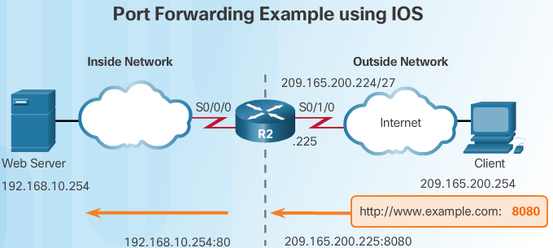

Establishes static translation between an inside local address and local port and an inside global address and global port

.. code::

   R2(config)# ip nat inside source static tcp 192.168.10.254 80 209.165.200.225 8080

Identifies interface Serial 0/0/0 as an inside NAT interface

.. code::

   R2(config)# interface Serial0/0/0
   R2(config-if)# ip nat inside 

Identifies interface Serial 0/1/0 as an outside NAT interface

.. code::

   R2(config)# interface Serial0/1/0
   R2(config-if)# ip nat outside 

.. code::

   Gateway# show ip nat translations
   Pro Inside global         Inside local       Outside local          Outside global 
   tcp 209.165.201.225:8080  192.168.10.254:80  209.165.200.254:46088  209.165.200.254:46088   
   tcp 209.165.201.225:8080  192.168.10.254:80  ---                    --- 

In the example, when the router receives the packet with the inside global IPv4 address of 209.165.200.225 and a TCP destination port 8080, the router performs a NAT table lookup using the destination IPv4 address and destination port as the key. The router then translates the address to the inside local address of host 192.168.10.254 and destination port 80. R2 then forwards the packet to the web server. For return packets from the web server back to the client, this process is reversed.

NAT for IPv6?
-------------

IPv6, with a 128-bit address, provides 340 undecillion addresses. Therefore, address space is not an issue. IPv6 was developed with the intention of making NAT for IPv4 with its translation between public and private IPv4 addresses unnecessary. However, IPv6 does implement a form of NAT. IPv6 includes both its own IPv6 private address space and NAT, which are implemented differently than they are for IPv4.

IPv6 Unique Local Address ULA
-----------------------------

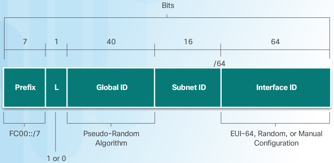

The intent of ULA is to provide IPv6 address space for communications within a local site; it is not meant to provide additional IPv6 address space, nor is it meant to provide a level of security.

As shown in the image, ULA have the **prefix FC00::/7**, which results in a first hextet **range of FC00 to FDFF**. The **next 1 bit is set to 1 if the prefix is locally assigned**. Set to 0 may be defined in the future. The next 40 bits is a global ID followed by a 16-bit Subnet ID. These first 64 bits combine to make the ULA prefix. This leaves the remaining 64 bits for the interface ID, or in IPv4 terms, the host portion of the address.

Unique local addresses are defined in RFC 4193. ULAs are also known as **local IPv6 addresses** (not to be confused with IPv6 link-local addresses) and have several characteristics including:

+ Allows sites to be combined or privately interconnected, without creating any address conflicts or requiring renumbering of interfaces that use these prefixes.

+ Independent of any ISP and can be used for communications within a site without having any Internet connectivity.

+ Not routable across the Internet, however, if accidentally leaked by routing or DNS, there is not conflict with other addresses.

ULA is not quite as straight-forward as RFC 1918 addresses. Unlike private IPv4 addresses, it has not been the intention of the IETF to use a form of NAT to translate between unique local addresses and IPv6 global unicast addresses.

The implementation and potential uses for IPv6 unique local addresses are still being examined by the Internet community. For example, the IETF is considering allowing the option of having the 40-bit global ID centrally assigned when using the FC00::/8 ULA prefix, and the 40-bit global ID randomly generated, or perhaps manually assigned, when using the ULA prefix FD00::/8. The rest of the address remains the same. We still use 16 bits for the subnet ID and 64 bits for the interface ID.

.. note:: The original IPv6 specification allocated address space for site-local addresses, defined in RFC 3513. Site-local addresses have been deprecated by the IETF in RFC 3879 because the term “site” was somewhat ambiguous. Site-local addresses had the prefix range of FEC0::/10 and may still be found in some older IPv6 documentation.T for IPv6

NAT for IPv6
------------

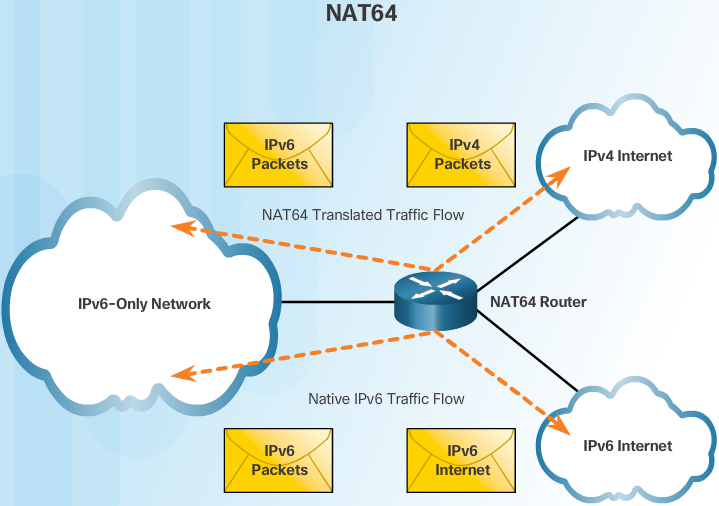

NAT for IPv6 is used in a much different context than NAT for IPv4. The varieties of NAT for IPv6 are used to transparently provide access between IPv6-only and IPv4-only networks. It is not used as a form of private IPv6 to global IPv6 translation.

Ideally, IPv6 should be run natively wherever possible. This means IPv6 devices communicating with each other over IPv6 networks. However, to aid in the move from IPv4 to IPv6, the IETF has developed several transition techniques to accommodate a variety of IPv4-to-IPv6 scenarios, including dual-stack, tunneling, and translation.

Dual-stack is when the devices are running protocols associated with both the IPv4 and IPv6. Tunneling for IPV6 is the process of encapsulating an IPv6 packet inside an IPv4 packet. This allows the IPv6 packet to be transmitted over an IPv4-only network.

NAT for IPv6 should not be used as a long term strategy, but as a temporary mechanism to assist in the migration from IPv4 to IPv6. Over the years, there have been several types of NAT for IPv6 including Network Address Translation-Protocol Translation (NAT-PT). NAT-PT has been deprecated by IETF in favor of its replacement, NAT64. NAT64 is beyond the scope of this curriculum.

The image shows three clouds. Two are labeled ipv6 and one is labeled ipv4. The packets traveling between the two ipv6 networks are native ipv6 packets. The packets traveling between the ipv4 and ipv6 are translated.

Troubleshooting NAT
-------------------

The show ip nat Commands

Figure 1 shows R2 enabled for PAT, using the range of addresses 209.165.200.226 to 209.165.200.240.

When there are IPv4 connectivity problems in a NAT environment, it is often difficult to determine the cause of the problem. The first step in solving the problem is to rule out NAT as the cause. Follow these steps to verify that NAT is operating as expected:

Step 1. Based on the configuration, clearly define what NAT is supposed to achieve. This may reveal a problem with the configuration.

Step 2. Verify that correct translations exist in the translation table using the show ip nat translations command.

Step 3. Use the clear and debug commands to verify that NAT is operating as expected. Check to see if dynamic entries are recreated after they are cleared.

Step 4. Review in detail what is happening to the packet, and verify that routers have the correct routing information to move the packet.

``show ip nat statistics`` and ``show ip nat translations`` commands. Prior to using the show commands, the NAT statistics and entries in the NAT table are cleared with the ``clear ip nat statistics`` and ``clear ip nat translation *`` commands. After the host at 192.168.10.10 telnets to the server at 209.165.201.1, the NAT statistics and NAT table are displayed to verify NAT is working as expected.

In a simple network environment, it is useful to monitor NAT statistics with the show ip nat statistics command. The show ip nat statistics command displays information about the total number of active translations, NAT configuration parameters, the number of addresses in the pool, and the number that have been allocated. However, in a more complex NAT environment, with several translations taking place, this command may not clearly identify the issue. It may be necessary to run ``debug`` commands on the router.

.. code::

   R2# debug ip nat
   R2# debug ip nat detailed

When decoding the debug output, note what the following symbols and values indicate:

    * (asterisk) - The asterisk next to NAT indicates that the translation is occurring in the fast-switched path. The first packet in a conversation is always process-switched, which is slower. The remaining packets go through the fast-switched path if a cache entry exists.

    s= - This symbol refers to the source IPv4 address.

    a.b.c.d--->w.x.y.z - This value indicates that source address a.b.c.d is translated to w.x.y.z.

    d= - This symbol refers to the destination IPv4 address.

    [xxxx] - The value in brackets is the IPv4 identification number. This information may be useful for debugging in that it enables correlation with other packet traces from protocol analyzers.

.. note:: Verify that the ACL referenced in the NAT command is permitting all of the necessary networks. E.g., only 192.168.0.0/16 addresses are eligible to be translated. Packets from the inside network destined for the Internet with source addresses that are not explicitly permitted by ACL 1 are not translated by R2.

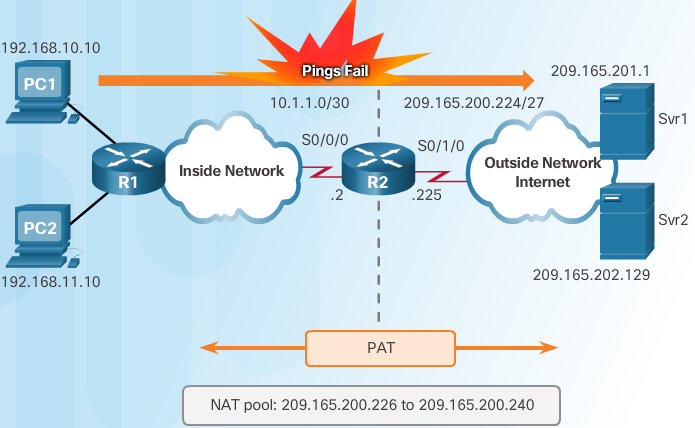

.. code::

   R2# show ip nat translations
   R2#
   R2# show ip nat statistics
   Total active translations: 0 (0 static, 0 dynamic; 0 extended)
   Peak translations: 0
   Outside interfaces:
     Serial0/0/0
   Inside interfaces:
     Serial0/1/0
   Hits: 0 Misses: 0

   R2#conf t
   R2(config)# interface serial 0/0/0
   R2(config-if)# no ip nat outside 
   R2(config-if)# exit 
   R2(config)# interface serial 0/0/1 
   R2(config-if)# no ip nat inside 
   R2(config-if)# ip nat outside

.. code::

   R2# show access-lists
   Standard IP access list 1
       10 permit 192.168.0.0, wildcard bits 0.0.0.255
   R2#

   R2#conf t
   R2(config)# no access-list 1
   R2(config)# access-list 1 permit 192.168.0.0 0.0.255.255 

.. code::

   R2# show ip nat statistics 
   Total active translations: 1 (0 static, 1 dynamic; 1 extended) 
   Peak translations: 1, occurred 00:00:19 ago 
   Outside interfaces: 
     Serial0/0/1 
   Inside interfaces: 
     GigabitEthernet0/1 
   Hits: 20  Misses: 0 
   CEF Translated packets: 20, CEF Punted packets: 0 
   Expired translations: 1 
   Dynamic mappings: 
   -- Inside Source 
   [Id: 5] access-list 1 pool NAT-POOL2 refcount r1
    pool NAT-POOL2: netmask 255.255.255.224
   start 209.165.200.226 end 209.165.200.240 
   type generic, total addresses 15, allocated 1 (6%), misses 0

   R2# show ip nat translations
   Pro Inside global         Inside local       Outside local      Outside global 
   icmp 209.165.200.226:38   192.168.10.10:38   209.165.201.1:38   209.165.201.1:38
   R2#

PT Troubleshooting NAT ex1
--------------------------

.. image:: ../../../_static/img/Ch9_pt_troubleshooting_NAT_ex1.png

Addressing Table ex1
^^^^^^^^^^^^^^^^^^^^

+---------+-----------+----------------+-----------------+-----------------+
| Device  | Interface | IP Address     | Subnet Mask     | Default Gateway |
+=========+===========+================+=================+=================+
| R1      | G0/0      | 10.4.10.254    | 255.255.255.0   | N/A             |
+---------+-----------+----------------+-----------------+-----------------+
|         | G0/1      | 10.4.11.254    | 255.255.255.0   | N/A             |
+---------+-----------+----------------+-----------------+-----------------+
|         | S0/0/1    | 10.4.1.2       | 255.255.255.252 | N/A             |
+---------+-----------+----------------+-----------------+-----------------+
| R2      | S0/0/0    | 209.165.76.194 | 255.255.255.224 | N/A             |
+---------+-----------+----------------+-----------------+-----------------+
|         | S0/0/1    | 10.4.1.1       | 255.255.255.252 | N/A             |
+---------+-----------+----------------+-----------------+-----------------+
| Server1 | NIC       | 64.100.201.5   | 255.255.255.0   | 64.100.201.1    |
+---------+-----------+----------------+-----------------+-----------------+
| PC1     | NIC       | 10.4.10.1      | 255.255.255.0   | 10.4.10.254     |
+---------+-----------+----------------+-----------------+-----------------+
| PC2     | NIC       | 10.4.10.2      | 255.255.255.0   | 10.4.10.254     |
+---------+-----------+----------------+-----------------+-----------------+
| L1      | NIC       | 10.4.11.1      | 255.255.255.0   | 10.4.11.254     |
+---------+-----------+----------------+-----------------+-----------------+
| L2      | NIC       | 10.4.11.2      | 255.255.255.0   | 10.4.11.254     |
+---------+-----------+----------------+-----------------+-----------------+

Objectives

Part 1: Isolate Problems

Part 2: Troubleshoot NAT Configuration

Part 3: Verify Connectivity

Scenario

A contractor restored an old configuration to a new router running NAT. But, the network has changed and a new subnet was added after the old configuration was backed up. It is your job to get the network working again.

Ping Server1 from PC1, PC2, L1, L2, and R2.
Record the success of each ping. Ping any other machines as needed. 

Pinging 64.100.201.5 with 32 bytes of data:
 from pc1
  Packets: Sent = 4, Received = 0, Lost = 4 (100% loss)
 from pc2
  Packets: Sent = 4, Received = 0, Lost = 4 (100% loss)
 from L1
  Packets: Sent = 4, Received = 0, Lost = 4 (100% loss)
 from L2
  Packets: Sent = 4, Received = 0, Lost = 4 (100% loss)
 from R2
  .. code::
  
     R2#ping 64.100.201.5
     Sending 5, 100-byte ICMP Echos to 64.100.201.5, timeout is 2 seconds
     !!!!!
     Success rate is 100 percent (5/5), round-trip min/avg/max = 1/2/5 ms

PT Troubleshoot NAT Configuration
^^^^^^^^^^^^^^^^^^^^^^^^^^^^^^^^^
#. View the NAT translations on R2. If NAT is working, there should be table entries.
   
   .. code::

      R2#show ip nat translation
      R2#show ip nat statistics
      Total translations: 0 (0 static, 0 dynamic, 0 extended)
      Outside Interfaces: Serial0/0/1
      Inside Interfaces: Serial0/0/0
      Hits: 0  Misses: 16
      Expired translations: 0
      Dynamic mappings:
      -- Inside Source
      access-list 101 pool R2POOL refCount 0
       pool R2POOL: netmask 255.255.255.224
             start 209.165.76.195 end 209.165.76.223
             type generic, total addresses 29 , allocated 0 (0%), misses 0      

      so the statistics tell us that there were 16 misses on the inside interface Serial 0/0/0 
      Indeed we deed pings from 4 locations in the network to this interface towards server1 this makes sense.
     
#. Show the running configuration of R2. The NAT inside port should align with the private address, while the NAT outside port should align with the public address.

   .. code::

      !
      interface Serial0/0/0
       ip address 209.165.76.194 255.255.255.224
       ip nat inside
       clock rate 2000000
      !
      interface Serial0/0/1
       ip address 10.4.1.1 255.255.255.252
       ip nat outside
       clock rate 2000000
      !
      ip nat pool R2POOL 209.165.76.195 209.165.76.223 netmask 255.255.255.224
      ip nat inside source list 101 pool R2POOL
      !
      ip route 10.0.0.0 255.0.0.0 10.4.1.2 
      ip route 0.0.0.0 0.0.0.0 209.165.76.193 
      !
      access-list 101 permit ip 10.4.10.0 0.0.0.255 any
      !
      
   Inside and outside are incorrectly configured, got it backwards here

#. Correct the Interfaces. Assign the ip nat inside and ip nat outside commands to the correct ports.

   .. code::

      nat debugging is on

      R2(config)#interface Serial 0/0/1
      R2(config-if)#no ip nat outside
      R2(config-if)#
      ip_ifnat_modified: old_if 1, new_if 2

      ip nat inside
      R2(config-if)#
      ip_ifnat_modified: old_if 2, new_if 0

      now configure serial 0/0/0 as outside nat if
      --------------------------------------------
      R2(config-if)#interface Serial 0/0/0
      R2(config-if)#no ip nat insid
      R2(config-if)#no ip nat inside 
      R2(config-if)#
      ip_ifnat_modified: old_if 0, new_if 2
      
      ip nat outside
      R2(config-if)#
      ip_ifnat_modified: old_if 2, new_if 1

#. Ping Server1 from PC1, PC2, L1, L2, and R2. Record the success of each ping. Ping any other machines as needed.
   
   from L1 and L2
    same as before, ping unsuccessful and increasing the miss counter in ip nat statistics
   from PC1 is successful
    see NAT translations working and later expiring via debug ip nat after the ping from PC1 (ip 10.4.10.1)

    .. code::
 
       R2(config-if)#
       NAT: s=10.4.10.1->209.165.76.195, d=64.100.201.5 [5]
       NAT*: s=64.100.201.5, d=209.165.76.195->10.4.10.1 [33]
 
       NAT: s=10.4.10.1->209.165.76.195, d=64.100.201.5 [6]
       NAT*: s=64.100.201.5, d=209.165.76.195->10.4.10.1 [34]
 
       NAT: s=10.4.10.1->209.165.76.195, d=64.100.201.5 [7]
       NAT*: s=64.100.201.5, d=209.165.76.195->10.4.10.1 [35]
 
       NAT: s=10.4.10.1->209.165.76.195, d=64.100.201.5 [8]
       NAT*: s=64.100.201.5, d=209.165.76.195->10.4.10.1 [36]
 
       NAT: expiring 209.165.76.195 (10.4.10.1) icmp 5 (5)
       NAT: expiring 209.165.76.195 (10.4.10.1) icmp 6 (6)
       NAT: expiring 209.165.76.195 (10.4.10.1) icmp 7 (7)
       NAT: expiring 209.165.76.195 (10.4.10.1) icmp 8 (8)

#. View the NAT translations on R2. If NAT is working, there should be table entries.
    Well NAT is not working properly yet as only nodes on the 10.4.10.0/24 network are being translated
    the 10.4.11.0/24 ain't getting any..
   
    .. code::

       R2#show ip nat translations 
       Pro  Inside global     Inside local       Outside local      Outside global
       icmp 209.165.76.195:10 10.4.10.1:10       64.100.201.5:10    64.100.201.5:10
       icmp 209.165.76.195:11 10.4.10.1:11       64.100.201.5:11    64.100.201.5:11
       icmp 209.165.76.195:12 10.4.10.1:12       64.100.201.5:12    64.100.201.5:12
       icmp 209.165.76.195:9  10.4.10.1:9        64.100.201.5:9     64.100.201.5:9
       R2#
       NAT: expiring 209.165.76.195 (10.4.10.1) icmp 9 (9)
       NAT: expiring 209.165.76.195 (10.4.10.1) icmp 10 (10)
       NAT: expiring 209.165.76.195 (10.4.10.1) icmp 11 (11)
       NAT: expiring 209.165.76.195 (10.4.10.1) icmp 12 (12)

#. Show Access-list 101 on R2. The wildcard mask should encompass both the 10.4.10.0 network and the 10.4.11.0 network.
   
   .. code::

      R2#show ip access-list
      Extended IP access list 101
          10 permit ip 10.4.10.0 0.0.0.255 any (16 match(es))

   obviously the 11 isn't included.. lets fix this

#. Correct the Access-list. Delete access-list 101 and replace it with a similar list that is also one statement in length. The only difference should be the wildcard.
   
   to include the 11 we will need to change the third octet of the wildcard..
   so to include 11 would be like changing the subnet from 24 to 23 which means 2^23 network bits and 2^9 host bits = 510 nodes
   so  255.255.255.255
   | - 255.255.254.0 (/23 instead of /24)
   | =   0.  0.  1.255

   .. code::

      R2(config)# no access-list 101 permit ip 10.4.10.0 0.0.0.255 any
      R2(config)#access-list 101 permit ip 10.4.10.0 0.0.1.255 any

PT Verify Connectivity
^^^^^^^^^^^^^^^^^^^^^^
.. note the NAT* is the Outside interface :)

#. Verify connectivity to Server1. Record the success of each ping. All hosts should be able to ping Server1, R1, and R2. Troubleshoot if the pings are not successful.
   sure enough pings are working now
#. View the NAT translations on R2. NAT should display many table entries.
   launch a ping from a node in each network and check nat translations with debugging on for bonus kudos

   .. code::

      R2>en
      R2#show ip nat translation
      R2#
      NAT: s=10.4.11.1->209.165.76.195, d=64.100.201.5 [29]
      NAT*: s=64.100.201.5, d=209.165.76.195->10.4.11.1 [49]

      NAT: s=10.4.11.1->209.165.76.195, d=64.100.201.5 [30]
      NAT*: s=64.100.201.5, d=209.165.76.195->10.4.11.1 [50]

      NAT: s=10.4.11.1->209.165.76.195, d=64.100.201.5 [31]
      NAT*: s=64.100.201.5, d=209.165.76.195->10.4.11.1 [51]

      NAT: s=10.4.11.1->209.165.76.195, d=64.100.201.5 [32]
      NAT*: s=64.100.201.5, d=209.165.76.195->10.4.11.1 [52]

      NAT: s=10.4.10.1->209.165.76.196, d=64.100.201.5 [13]
      NAT*: s=64.100.201.5, d=209.165.76.196->10.4.10.1 [53]

      NAT: s=10.4.10.1->209.165.76.196, d=64.100.201.5 [14]
      NAT*: s=64.100.201.5, d=209.165.76.196->10.4.10.1 [54]

      NAT: s=10.4.10.1->209.165.76.196, d=64.100.201.5 [15]
      NAT*: s=64.100.201.5, d=209.165.76.196->10.4.10.1 [55]

      NAT: s=10.4.10.1->209.165.76.196, d=64.100.201.5 [16]
      NAT*: s=64.100.201.5, d=209.165.76.196->10.4.10.1 [56]
      show ip nat translation
      Pro  Inside global     Inside local       Outside local      Outside global
      icmp 209.165.76.195:29 10.4.11.1:29       64.100.201.5:29    64.100.201.5:29
      icmp 209.165.76.195:30 10.4.11.1:30       64.100.201.5:30    64.100.201.5:30
      icmp 209.165.76.195:31 10.4.11.1:31       64.100.201.5:31    64.100.201.5:31
      icmp 209.165.76.195:32 10.4.11.1:32       64.100.201.5:32    64.100.201.5:32
      icmp 209.165.76.196:13 10.4.10.1:13       64.100.201.5:13    64.100.201.5:13
      icmp 209.165.76.196:14 10.4.10.1:14       64.100.201.5:14    64.100.201.5:14
      icmp 209.165.76.196:15 10.4.10.1:15       64.100.201.5:15    64.100.201.5:15
      icmp 209.165.76.196:16 10.4.10.1:16       64.100.201.5:16    64.100.201.5:16

      R2#
      NAT: expiring 209.165.76.195 (10.4.11.1) icmp 29 (29)
      NAT: expiring 209.165.76.195 (10.4.11.1) icmp 30 (30)
      NAT: expiring 209.165.76.195 (10.4.11.1) icmp 31 (31)
      NAT: expiring 209.165.76.195 (10.4.11.1) icmp 32 (32)
      NAT: expiring 209.165.76.196 (10.4.10.1) icmp 13 (13)
      NAT: expiring 209.165.76.196 (10.4.10.1) icmp 14 (14)
      NAT: expiring 209.165.76.196 (10.4.10.1) icmp 15 (15)
      NAT: expiring 209.165.76.196 (10.4.10.1) icmp 16 (16)

   
LAB Troubleshooting NAT
-----------------------

.. image:: ../../../_static/img/Ch9_lab_troubleshooting_NAT.png

PT Addressing Table
^^^^^^^^^^^^^^^^^^^

+---------+--------------+-----------------+-----------------+-----------------+
| Device  | Interface    | IP address      | Subnet Mask     | Default Gateway |
+=========+==============+=================+=================+=================+
| Gateway | G0/1         | 192.168.1.1     | 255.255.255.0   | N/A             |
+---------+--------------+-----------------+-----------------+-----------------+
|         | S0/0/1       | 209.165.200.225 | 255.255.255.252 | N/A             |
+---------+--------------+-----------------+-----------------+-----------------+
| ISP     | S0/0/0 (DCE) | 209.165.200.226 | 255.255.255.252 | N/A             |
+---------+--------------+-----------------+-----------------+-----------------+
|         | Lo0          | 198.133.219.1   | 255.255.255.255 | N/A             |
+---------+--------------+-----------------+-----------------+-----------------+
| PC-A    | NIC          | 192.168.1.3     | 255.255.255.0   | 192.168.1.1     |
+---------+--------------+-----------------+-----------------+-----------------+
| PC-B    | NIC          | 192.168.1.4     | 255.255.255.0   | 192.168.1.1     |
+---------+--------------+-----------------+-----------------+-----------------+

Objectives
Part 1: Build the Network and Configure Basic Device Settings
Part 2: Troubleshoot Static NAT
Part 3: Troubleshoot Dynamic NAT

Background / Scenario
In this lab, the Gateway router was configured by an inexperienced network administrator at your company.  Several errors in the configuration have resulted in NAT issues. Your boss has asked you to troubleshoot and correct the NAT errors and document your work. Ensure that the network supports the following: 

 • PC-A acts as a web server with a static NAT and will be reachable from the outside using the 209.165.200.254 address.
 • PC-B acts as a host computer and dynamically receives an IP address from the created pool of addresses called NAT_POOL, which uses the 209.165.200.240/29 range.

Copy the following basic configuration and paste it to the running-configuration on the router.

.. code::

   no ip domain-lookup 
   service password-encryption 
   enable secret class 
   banner motd # 
   Unauthorized access is strictly prohibited. # 
   line con 0 
   password cisco 
   login 
   logging synchronous 
   line vty 0 4 
   password cisco 
   login 

Configure Static Routing
^^^^^^^^^^^^^^^^^^^^^^^^

a. Create a static route from the ISP router to the Gateway router which was assigned public network address range 209.165.200.224/27.

   .. code::

      ISP(config)# ip route 209.165.200.224 255.255.255.224 s0/0/0 

b. Create a default route from the Gateway router to the ISP router.

   .. code::
 
      Gateway(config)# ip route 0.0.0.0 0.0.0.0 s0/0/1

provided faulty configurations:

Gateway Router Configuration

.. code::

   interface 
   g0/1 
    ip nat outside 
   no shutdown 
   interface 
   s0/0/0 
    ip nat outside 
   interface 
   s0/0/1 
   no shutdown 
   ip nat inside source static 192.168.2.3 
   209.165.200.254 
   ip nat pool NAT_POOL 
   209.165.200.241 209.165.200.246 
   netmask 255.255.255.248 
   ip nat inside source list NAT_ACL pool NATPOOL 
   ip access-
   list standard NAT_ACL 
    permit 192.168
   .10.0 0.0.0.255 
   banner motd $AUTHORIZED ACCESS ONLY$ 
   end 

Troubleshoot Static NAT
^^^^^^^^^^^^^^^^^^^^^^^
examine the static NAT for PC-A to determine if it is configured correctly. You will troubleshoot the scenario until the correct static NAT is verified.

a. To troubleshoot issues with NAT, use the ``debug ip nat`` command. Turn on NAT debugging to see translations in real-time across the Gateway router.

   .. code::
  
      Gateway# debug ip nat 

b. From PC-A, ping Lo0 on the ISP router. Do any NAT debug translations appear on the Gateway router?
c. On the Gateway router, enter the command that allows you to see all current NAT translations on the Gateway router. Write the command in the space below.
   Why are you seeing a NAT translation in the table, but none occurred when PC-A pinged the ISP loopback interface? What is needed to correct the issue?
d. Record any commands that are necessary to correct the static NAT configuration error
e. From PC-A, ping Lo0 on the ISP router. Do any NAT debug translations appear on the Gateway router?
f. On the Gateway router, enter the command that allows you to observe the total number of current NATs. 

   Write the command in the space below. Is the static NAT occurring successfully? Why?

g. On the Gateway router, enter the command that allows you to view the current configuration of the router. Write the command in the space below.

h. Are there any problems with the current configuration that prevent the static NAT from occurring?
i. Record any commands that are necessary to correct the static NAT configuration errors.
j. From PC-A, ping Lo0 on the ISP router. Do any NAT debug translations appear on the Gateway router?
k.    Use the ``show ip nat translations verbose`` command to verify static NAT functionality.

   .. note:: The timeout value for ICMP is very short. If you do not see all the translations in the output, redo the ping.

   Is the static NAT translation occurring successfully?
   If static NAT is not occurring, repeat the steps above to troubleshoot the configuration.

Troubleshoot Dynamic NAT
^^^^^^^^^^^^^^^^^^^^^^^^

a. From PC-B, ping Lo0 on the ISP router. Do any NAT debug translations appear on the Gateway router?
b. On the Gateway router, enter the command that allows you to view the current configuration of the router. Are there any problems with the current configuration that prevent dynamic NAT from occurring?
c. Record any commands that are necessary to correct the dynamic NAT configuration errors.
d. From PC-B, ping Lo0 on the ISP router. Do any NAT debug translations appear on the Gateway router?
e. Use the ``show ip nat statistics`` to view NAT usage.
   
   Is the NAT occurring successfully?
   What percentage of dynamic addresses has been allocated? 

f. Turn off all debugging using the ``undebug all`` command.

Reflection

1. What is the benefit of a static NAT?

2. What issues would arise if 10 host computers in this network were attempting simultaneous Internet communication? 

Ch9 Skills Integration Test - assignment
----------------------------------------
Topology Assigned

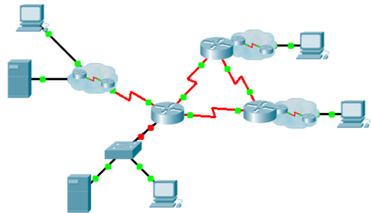

Addressing Table Assigned

+--------+-----------+---------------+-----------------+-----------------+
| Device | Interface | IP Address    | Subnet Mask     | Default Gateway |
+========+===========+===============+=================+=================+
|        | G0/0.15   |               |                 | N/A             |
+--------+-----------+---------------+-----------------+-----------------+
|        | G0/0.30   |               |                 | N/A             |
+--------+-----------+---------------+-----------------+-----------------+
|        | G0/0.45   |               |                 | N/A             |
+--------+-----------+---------------+-----------------+-----------------+
|        | G0/0.60   |               |                 | N/A             |
+--------+-----------+---------------+-----------------+-----------------+
|        | S0/0/0    |               | 255.255.255.252 | N/A             |
+--------+-----------+---------------+-----------------+-----------------+
|        | S0/0/1    |               | 255.255.255.252 | N/A             |
+--------+-----------+---------------+-----------------+-----------------+
|        | S0/1/0    |               | 255.255.255.252 | N/A             |
+--------+-----------+---------------+-----------------+-----------------+
|        | G0/0      |               |                 | N/A             |
+--------+-----------+---------------+-----------------+-----------------+
|        | S0/0/0    |               | 255.255.255.252 | N/A             |
+--------+-----------+---------------+-----------------+-----------------+
|        | S0/0/1    |               | 255.255.255.252 | N/A             |
+--------+-----------+---------------+-----------------+-----------------+
|        | G0/0      |               |                 | N/A             |
+--------+-----------+---------------+-----------------+-----------------+
|        | S0/0/0    |               | 255.255.255.252 | N/A             |
+--------+-----------+---------------+-----------------+-----------------+
|        | S0/0/1    |               | 255.255.255.252 | N/A             |
+--------+-----------+---------------+-----------------+-----------------+
|        | VLAN 60   |               |                 |                 |
+--------+-----------+---------------+-----------------+-----------------+
|        | NIC       | DHCP Assigned | DHCP Assigned   | DHCP Assigned   |
+--------+-----------+---------------+-----------------+-----------------+

VLANs and Port Assignments Table Given

+--------------------+-----------------+---------+
| VLAN Number - Name | Port assignment | Network |
+====================+=================+=========+
| 15- Servers        | F0/11 - F0/20   |         |
+--------------------+-----------------+---------+
| 30- PCs            | F0/1 - F0/10    |         |
+--------------------+-----------------+---------+
| 45- Native         | G0/1            |         |
+--------------------+-----------------+---------+
| 60 - Management    | VLAN 60         |         |
+--------------------+-----------------+---------+

+ complete the documentation for the network
+ configure VLANS, Trunking, port security and SSH remote access on a switch
+ implement inter-VLAN routing and NAT on a router
+ Use your documentation to verify implementation & test end2end connectivity

#. Label All the device names, network addresses and other important information
#. Complete the **Addressing Table** and **VLANS & Port assignment Table**
#. Fill in any blanks in the implementation and verification steps. The information is supplied when 
   you launch the Packet Tracer activity.

Implementation Given
^^^^^^^^^^^^^^^^^^^^

Note: All devices in the topology except , , and    are fully configured. You do not have access to the other routers. You can access all the servers and PCs for testing purposes.

Implement to following requirements using your documentation: 
• Configure remote management access including IP addressing and SSH:
  
  - Domain is cisco.com
  - User     with password
  - Crypto key length of 1024
  - SSH version 2, limited to 2 authentication attempts and a 60 second timeout
  - Clear text passwords should be encrypted.

• Configure, name and assign VLANs. Ports should be manually configured as access ports.
• Configure trunking.
• Implement port security:

  - On Fa0/1, allow 2 MAC addresses that are automatically added to the configuration file when detected. The port should not be disabled, but a syslog message should be captured if a violation occurs.
  - Disable all other unused ports.

• Configure inter-VLAN routing.
• Configure DHCP services for VLAN 30. Use **LAN** as the case-sensitive name for the pool.
• Implement routing:

- Use RIPv2 as the routing protocol.
- Configure one network statement for the entire address space. 
- Disable interfaces that should not send RIPv2 messages.
- Configure a default route to the Internet.

• Implement NAT:

  - Configure a standard, one statement ACL number 1. All IP addresses belonging to the addr ess space are allowed.
  - Refer to your documentation and configure static NAT for the File Server.
  - Configure dynamic NAT with PAT using a pool name of your choice, a /30 mask, and these two public addresses: 

Verify       has received full addressing information from       .

Verification Given
^^^^^^^^^^^^^^^^^^

All devices should now be able to ping all other devices. If not, troubleshoot your configurations to isolate and solve problems. A few tests include:
• Verify remote access to       by using SSH from a PC.
• Verify VLANs are assigned to appropriate ports and port security is in force.
• Verify OSPF neighbors and a complete routing table.
• Verify NAT translations and statics. 

  - **Outside Host** should be able to access **File Server** at the public address.
  - Inside PCs should be able to access **Web Server**.

• Document any problems you encountered and the solutions in the **Troubleshooting Documentation** table below.
       
Troubleshooting Documentation

+-------------------------+--------------------------+
| ________Problem________ | ________Solution________ |
+=========================+==========================+
|                         |                          |
+-------------------------+--------------------------+
|                         |                          |
+-------------------------+--------------------------+
|                         |                          |
+-------------------------+--------------------------+
|                         |                          |
+-------------------------+--------------------------+

Packet Tracer scores 70 points.  Documentation is worth 30 points.

Ch9 Skills Integration Test - when opened with PT 7.0 on windos 
---------------------------------------------------------------

Topology Solved 

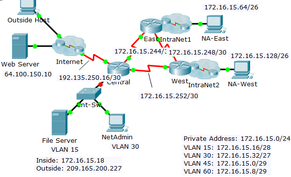

???????why are ips present here and not in PDF ????????

Addressing Table Solved

+---------+-----------+----------------+-----------------+-----------------+
| Device  | Interface | IP Address     | Subnet Mask     | Default Gateway |
+=========+===========+================+=================+=================+
| Central | G0/0.15   | 172.16.15.17   | 255.255.255.240 | N/A             |
+---------+-----------+----------------+-----------------+-----------------+
|         | G0/0.30   | 172.16.15.33   | 255.255.255.224 | N/A             |
+---------+-----------+----------------+-----------------+-----------------+
|         | G0/0.45   | 172.16.15.1    | 255.255.255.248 | N/A             |
+---------+-----------+----------------+-----------------+-----------------+
|         | G0/0.60   | 172.16.15.9    | 255.255.255.248 | N/A             |
+---------+-----------+----------------+-----------------+-----------------+
|         | S0/0/0    | 172.16.15.245  | 255.255.255.252 | N/A             |
+---------+-----------+----------------+-----------------+-----------------+
|         | S0/0/1    | 172.16.15.254  | 255.255.255.252 | N/A             |
+---------+-----------+----------------+-----------------+-----------------+
|         | S0/1/0    | 192.135.250.18 | 255.255.255.252 | N/A             |
+---------+-----------+----------------+-----------------+-----------------+
| East    | G0/0      | 172.16.15.65   | 255.255.255.192 | N/A             |
+---------+-----------+----------------+-----------------+-----------------+
|         | S0/0/0    | 172.16.15.249  | 255.255.255.252 | N/A             |
+---------+-----------+----------------+-----------------+-----------------+
|         | S0/0/1    | 172.16.15.246  | 255.255.255.252 | N/A             |
+---------+-----------+----------------+-----------------+-----------------+
| West    | G0/0      | 172.16.15.129  | 255.255.255.192 | N/A             |
+---------+-----------+----------------+-----------------+-----------------+
|         | S0/0/0    | 172.16.15.253  | 255.255.255.252 | N/A             |
+---------+-----------+----------------+-----------------+-----------------+
|         | S0/0/1    | 172.16.15.250  | 255.255.255.252 | N/A             |
+---------+-----------+----------------+-----------------+-----------------+
| Cnt-Sw  | VLAN 60   | 172.16.15.10   |                 |                 |
+---------+-----------+----------------+-----------------+-----------------+
|         | NIC       | DHCP Assigned  | DHCP Assigned   | DHCP Assigned   |
+---------+-----------+----------------+-----------------+-----------------+

VLANs and Port Assignments Table Solved 

+--------------------+-----------------+------------------+
| VLAN Number - Name | Port assignment | Network          |
+====================+=================+==================+
| 15 - Servers       | F0/11 - F0/20   | 172.16.15.16 /28 |
+--------------------+-----------------+------------------+
| 30 - PCs           | F0/1 - F0/10    | 172.16.15.32 /27 |
+--------------------+-----------------+------------------+
| 45 - Native        | G0/1            | 172.16.15.0  /29 |
+--------------------+-----------------+------------------+
| 60 - Management    | VLAN 60         | 172.16.15.8  /29 |
+--------------------+-----------------+------------------+

+ complete the documentation for the network
+ configure VLANS, Trunking, port security and SSH remote access on a switch
+ implement inter-VLAN routing and NAT on a router
+ Use your documentation to verify implementation & test end2end connectivity

#. Label All the device names, network addresses and other important information
#. Complete the **Addressing Table** and **VLANS & Port assignment Table**
#. Fill in any blanks in the implementation and verification steps. The information is supplied when 
   you launch the Packet Tracer activity.

Implementation completed 
^^^^^^^^^^^^^^^^^^^^^^^^

.. note:: All devices in the topology except Central, Cnt-Sw, and NetAdmin are fully configured. You do not have access to the other routers. You can access all the servers and PCs for testing purposes.

Implement to following requirements using your documentation: 

Cnt-Sw

• Configure remote management access including IP addressing and SSH:
  
  - Domain is cisco.com
  - User HQadmin with password ciscoclass
  - Crypto key length of 1024
  - SSH version 2, limited to 2 authentication attempts and a 60 second timeout
  - Clear text passwords should be encrypted.

• Configure, name and assign VLANs. Ports should be manually configured as access ports.
• Configure trunking.
• Implement port security:

  - On Fa0/1, allow 2 MAC addresses that are automatically added to the configuration file when detected. The port should not be disabled, but a syslog message should be captured if a violation occurs.
  - Disable all other unused ports.

Central

• Configure inter-VLAN routing.
• Configure DHCP services for VLAN 30. Use **LAN** as the case-sensitive name for the pool.
• Implement routing:
  
  - Use OSPF Process ID 1 and router ID 1.1.1.1 ?????? why was RIPv2 asked in PDF??????
  - Configure one network statement for the entire 172.16.15.0/24 address space. 
  - Disable interfaces that should not send RIPv2 messages.
  - Configure a default route to the Internet.

  • Implement NAT:

    - Configure a standard, one statement ACL number 1. All IP addresses belonging to thei 172.16.15.0/24 address space are allowed.
    - Refer to your documentation and configure static NAT for the File Server.
    - Configure dynamic NAT with PAT using a pool name of your choice, a /30 mask, and these two public addresses: 
      209.165.200.225 and 209.165.200.226

NetAdmin

• Verify NetAdmin has received full addressing information from Central.

.. note:: the default vlan needs to be configured on the router subinterface ``Central(config-subif)#encapsulation dot1Q 45 native``

.. note:: ospf uses area 0 by default ``Central(config-router)#network 172.16.15.0 0.0.0.255 area 0``

.. note:: don't forget to apply the ACL. PT does not score this atm. ``Central(config)#ip nat inside source list 1 pool NAT-OVERLOAD``

running configs:

 .. code::

    Central(config-router)#do show run
    Building configuration...
    
    Current configuration : 2110 bytes
    !
    version 15.1
    no service timestamps log datetime msec
    no service timestamps debug datetime msec
    no service password-encryption
    !
    hostname Central
    !
    no logging console
    !
    !
    !
    ip dhcp excluded-address 172.16.15.33
    !
    ip dhcp pool LAN
     network 172.16.15.32 255.255.255.224
     default-router 172.16.15.33
    !
    !
    !
    ip cef
    no ipv6 cef
    !
    !
    !
    !
    license udi pid CISCO1941/K9 sn FTX1524OT6M
    !
    !
    !
    !
    !
    !
    !
    !
    !
    !
    !
    spanning-tree mode pvst
    !
    !
    !
    !
    interface GigabitEthernet0/0
     no ip address
     ip nat inside
     duplex auto
     speed auto
    !
    interface GigabitEthernet0/0.15
     description ros-vlan15
     encapsulation dot1Q 15
     ip address 172.16.15.17 255.255.255.240
     ip nat inside
    !
    interface GigabitEthernet0/0.30
     description ros-vlan30
     encapsulation dot1Q 30
     ip address 172.16.15.33 255.255.255.224
     ip nat inside
    !
    interface GigabitEthernet0/0.45
     description ros-vlan45-native
     encapsulation dot1Q 45 native
     ip address 172.16.15.1 255.255.255.248
     ip nat inside
    !
    interface GigabitEthernet0/0.60
     encapsulation dot1Q 60
     ip address 172.16.15.9 255.255.255.248
     ip nat inside
    !
    interface GigabitEthernet0/1
     no ip address
     duplex auto
     speed auto
     shutdown
    !
    interface Serial0/0/0
     ip address 172.16.15.245 255.255.255.252
     ip nat inside
     clock rate 2000000
    !
    interface Serial0/0/1
     ip address 172.16.15.254 255.255.255.252
     ip nat inside
    !
    interface Serial0/1/0
     description link2internet
     ip address 192.135.250.18 255.255.255.252
     ip nat outside
    !
    interface Serial0/1/1
     no ip address
     clock rate 2000000
     shutdown
    !
    interface Vlan1
     no ip address
     shutdown
    !
    interface Vlan45
     mac-address 0005.5e43.8601
     no ip address
    !
    router ospf 1
     router-id 1.1.1.1
     log-adjacency-changes
     passive-interface GigabitEthernet0/0
     network 172.16.15.0 0.0.0.255 area 0
    !
    ip nat pool NAT-OVERLOAD 209.165.200.225 209.165.200.226 netmask 255.255.255.252
    ip nat inside source list 1 pool NAT-OVERLOAD
    ip nat inside source static 172.16.15.18 209.165.200.227 
    ip classless
    ip route 0.0.0.0 0.0.0.0 Serial0/1/0 
    !
    ip flow-export version 9
    !
    !
    access-list 1 permit 172.16.15.0 0.0.0.255
    !
    !
    !
    !
    !
    line con 0
     exec-timeout 0 0
    !
    line aux 0
    !
    line vty 0 4
     login
    line vty 5 15
     login
    !
    !
    !
    end
    
    switch
    ------
    Cnt-Sw#show run
    Building configuration...
    
    Current configuration : 3361 bytes
    !
    version 12.2
    no service timestamps log datetime msec
    no service timestamps debug datetime msec
    service password-encryption
    !
    hostname Cnt-Sw
    !
    !
    !
    ip ssh version 2
    ip ssh authentication-retries 2
    ip ssh time-out 60
    ip domain-name cisco.com
    !
    username HQadmin privilege 1 password 7 0822455D0A16061B13181F
    !
    !
    spanning-tree mode pvst
    !
    interface FastEthernet0/1
     description link2NetAdminVLAN30
     switchport access vlan 30
     switchport mode access
     switchport port-security
     switchport port-security maximum 2
     switchport port-security mac-address sticky 
     switchport port-security violation restrict 
     switchport port-security mac-address sticky 0001.C90E.8923
    !
    interface FastEthernet0/2
     switchport access vlan 30
     switchport mode access
     shutdown
    !
    interface FastEthernet0/3
     switchport access vlan 30
     switchport mode access
     shutdown
    !
    interface FastEthernet0/4
     switchport access vlan 30
     switchport mode access
     shutdown
    !
    interface FastEthernet0/5
     switchport access vlan 30
     switchport mode access
     shutdown
    !
    interface FastEthernet0/6
     switchport access vlan 30
     switchport mode access
     shutdown
    !
    interface FastEthernet0/7
     switchport access vlan 30
     switchport mode access
     shutdown
    !
    interface FastEthernet0/8
     switchport access vlan 30
     switchport mode access
     shutdown
    !
    interface FastEthernet0/9
     switchport access vlan 30
     switchport mode access
     shutdown
     

Verification Solved
^^^^^^^^^^^^^^^^^^^
to be done 2morrow

All devices should now be able to ping all other devices. If not, troubleshoot your configurations to isolate and solve problems. A few tests include:
• Verify remote access to Cnt-Sw by using SSH from a PC.
• Verify VLANs are assigned to appropriate ports and port security is in force.
• Verify OSPF neighbors and a complete routing table.
• Verify NAT translations and statics. 

  - **Outside Host** should be able to access **File Server** at the public address.
  - Inside PCs should be able to access **Web Server**.

• Document any problems you encountered and the solutions in the **Troubleshooting Documentation** table below.

Ch9 practice exam
-----------------
select transparent answer below every question

#. Which method is used by a PAT-enabled router to send incoming packets to the correct inside hosts?
   
   + It uses the destination TCP or UDP port number on the incoming packet
   + It uses the source IP address on the incoming packet
   + It uses the source TCP or UDP port number on the incoming packet
   + It uses a combination of the source TCP or UDP port number and the destination IP address on the incoming packet
   + Answer ->:transparent:`It uses the destination TCP or UDP port number on the incoming packet`

#. Refer to the exhibit. Which address or addresses represent the inside global address?

   .. code::

      R1(config)# ip nat inside source static 192.168.0.100 209.165.20.25
      R1(config)# interface serial0/0/0
      R1(config-if)# ip nat inside 
      R1(config-if)# ip address 10.1.1.2 255.255.255.0
      R1(config)# interface serial 0/0/2
      R1(config-if)# ip address 209.165.20.25 255.255.255.0
      R1(config-if)# ip nat outside

   + 10.1.1.2
   + any address in the 10.1.1.0 network
   + 192.168.0.100
   + 209.165.20.25
   + Answer -> :transparent:`209.165.20.25`

#. Fill in the blank. Don't use abbreviations
   
   + NAT overload is also known as :transparent:`Port Address Translation`

#. A network administrator is configuring a static NAT on the border router for a web server located in the DMZ network. The web server is configured to listen on TCP port 8080. The web server is paired with the internal IP address of 192.168.5.25 and the external IP address of 209.165.200.230. For easy access by hosts on the Internet, external users do not need to specify the port when visiting the web server. Which command will configure the static NAT?

   + R1(config)# ip nat inside source static tcp 192.168.5.25 80 209.165.200.230 8080
   + R1(config)# ip nat inside source static tcp 192.168.5.25 8080 209.165.200.230 80
   + R1(config)# ip nat inside source static tcp 209.165.200.230 80 192.168.5.25 8080
   + R1(config)# ip nat inside source static tcp 209.165.200.230 8080 192.168.5.25 80
   + Answer -> :transparent:`R1(config)# ip nat inside source static tcp 192.168.5.25 8080 209.165.200.230 80`

#. What is defined by the ip nat pool command when configuring dynamic NAT?

   + the pool of available NAT servers
   + the range of external IP addresses that internal hosts are permitted to access
   + the range of internal IP addresses that are translated
   + the pool of global address*
   + Answer -> :transparent:`the pool of global address`

#. Refer to the exhibit. Based on the output that is shown, what type of NAT has been implemented?
   
   .. code::

      R1# show ip nat translations
      Pro Inside global         Inside local    Outside local       Outside global 
      tcp 209.165.200.225:1405  10.6.15.2:1405  209.165.202.141:80  209.165.202.141:80
      tcp 209.165.200.225:1406  10.6.15.1:1406  198.51.100.3:80     198.51.100.3:80 

   + dynamic NAT with a pool of two public IP addresses
   + PAT using an external interface
   + static NAT with one entry
   + static NAT with a NAT pool
   + Answer -> :transparent:`PAT using an external interface`

#. What is the primary purpose of NAT? 

   + conserve IPv4 addresses*
   + increase network security
   + allow peer-to-peer file sharing
   + enhance network performance
   + Answer -> :transparent:`conserve IPv4 addresses`

#. What is the major benefit of using NAT with Port Address Translation?

   + It allows external hosts access to internal servers
   + It improves network performance for real-time protocols
   + It allows many internal hosts to share the same public IPv4 address
   + It provides a pool of public addresses that can be assigned to internal hosts.
   + Answer -> :transparent:`It allows many internal hosts to share the same public IPv4 address`

#. What is a characteristic of unique local addresses?

   + They allow sites to be combined without creating any address conflicts
   + They are designed to improve the security of IPv6 networks
   + Their implementation depends on ISPs providing the service
   + They are defined in RFC 3927
   + Answer -> :transparent:`They allow sites to be combined without creating any address conflicts`

#. A network administrator configures the border router with the command ``R1(config)# ip nat inside source list 4 pool corp``. What is required to be configured in order for this particular command to be functional?

   + a NAT pool named corp that defines the starting and ending public IP addresses
   + an access list named corp that defines the private addresses that are affected by NAT
   + an access list numbered 4 that defines the starting and ending public IP addresses
   + ip nat outside to be enabled on the interface that connects to the LAN affected by the NAT
   + a VLAN named corp to be enabled and active and routed by R1
   + Answer -> :transparent:`a NAT pool named corp that defines the starting and ending public IP addresses`

#. Which statement describes IPv6 ULAs?

   + They conserve IPv6 address space
   + They begin with the fe80::/10 prefix
   + They are assigned by an ISP
   + They are not routable across the internet
   + Answer -> :transparent:`They are not routable across the internet`

#. What is the purpose of port forwarding?

   + Port forwarding allows an external user to reach a service on a private IPv4 address that is located inside a LAN
   + Port forwarding allows users to reach servers on the Internet that are not using standard port numbers
   + Port forwarding allows an internal user to reach a service on a public IPv4 address that is located outside a LAN
   + Port forwarding allows for translating inside local IP addresses to outside local addresses
   + Answer -> :transparent:`Port forwarding allows an external user to reach a service on a private IPv4 address that is located inside a LAN`

#. When dynamic NAT without overloading is being used, what happens if seven users attempt to access a public server on the Internet when only six addresses are available in the NAT pool?

   + No users can access the server
   + The request to the server for the seventh user fails
   + All users can access the server
   + The first user gets disconnected when the seventh user makes the request
   + Answer -> :transparent:`The request to the server for the seventh user fails`

#. A network engineer has configured a router with the command ip nat inside source list 4 pool corp overload. Why did the engineer use the overload option?

   + The company has more private IP addresses than available public IP addresses
   + The company needs to have more public IP addresses available to be used on the Internet
   + The company router must throttle or buffer traffic because the processing power of the router is not enough to handle the normal load of external-bound Internet traffic
   + The company has a small number of servers that should be accessible by clients from the Internet
   + Answer -> :transparent:`The company has more private IP addresses than available public IP addresses`

#. Match the steps with the actions that are involved when an internal host with IP address 192.168.10.10 attempts to send a packet to and external server at the IP address 209.165.200.254 across a router R1 that running dynamic NAT. (Not all options are used.)

   + not scored
   + step 1 
   + step 2 
   + step 3 
   + step 4 
   + step 5 
   + :transparent:`no score!` R1 translates the IP address in the packets from 209.65.200.254 to 192.168.10.10
   + :transparent:`step 5 =>` R1 replaces the address 192.168.10.10 with a translated inside global address 
   + :transparent:`step 2 =>` R1 checks the NAT configuration to determine if this packet should be translated 
   + :transparent:`step 4 =>` R1 selects an available global address from the dynamic address pool 
   + :transparent:`step 1 =>` The host sends packets that request a connection to the server at the address 209.165.200.254
   + :transparent:`step 3 =>` If there is no translation entry for this IP address, R1 determines that the source address 192.168.10.10 must be translated

#. What is a disadvantage of NAT?

   + There is no end-to-end addressing
   + The router does not need to alter the checksum of the IPv4 packets.
   + The internal hosts have to use a single public IPv4 address for external communication.
   + The costs of readdressing hosts can be significant for a publicly addressed network. 
   + Answer -> :transparent:`There is no end-to-end addressing`

#. Refer to the exhibit. What is the purpose of the command marked with an arrow shown in the partial configuration output of a Cisco broadband router?
   
   .. code::

      interface FastEthernet 0/0
       ip address 10.10.10.1 255.255.255.0
       ip nat inside
       no cdp enable
       hold-queue 32 in
       hold-queue 100 out
      interface FastEthernet 0/1
       ip address dhcp
       ip nat outside
       no cdp enable
      !
      ip classless
      ip http server
      !
      ip nat inside source list 102 interface fastethernet 0/1 overload
      access-list 102 permit ip 10.10.10.0 0.0.0.255 any
      no cdp run
      !

   + defines which addresses can be translated
   + defines which addresses are allowed into the router
   + defines which addresses are assigned to a NAT pool
   + defines which addresses are allowed out of the router
   + Answer -> :transparent:`defines which addresses can be translated`

#. What are two of the required steps to configure PAT? (Choose two.)

   + Define a pool of global addresses to be used for overload translation
   + Create a standard access list to define applications that should be translated
   + Define the range of source ports to be used
   + Identify the inside interface
   + Define the hello and interval timers to match the adjacent neighbor router
   + answer -> :transparent:`Define a pool of global addresses to be used for overload translation && Identify the inside interface`

#. Refer to the exhibit. A technician is configuring R2 for static NAT to allow the client to access the web server. What is a possible reason that the client PC cannot access the web server?

   .. image:: ../../../_static/img/Ch9_practice_exam_q19.png

   .. code::

      R2(config)# ip nat inside source static 192.168.10.2 209.165.201.5
      R2(config)# interface Fa0/1
      R2(config-if# ip address 192.168.10.254 255.255.255.0
      R2(config-if)# ip nat inside
      R2(config-if)# exit
      R2(config)# interface Serial0/0/0
      R2(config-if)# ip address 209.165.200.225 255.255.255.224

   + Interface S0/0/0 should be identified as the outside NAT interface
   + Interface Fa0/1 should be identified as the outside NAT interface
   + The IP NAT statement is incorrect
   + The configuration is missing a valid access control list
   + Answer -> :transparent:`Interface Fa0/1 should be identified as the outside NAT interface`

#. What are two benefits of NAT? (Choose two.)

   + It saves public IP addresses
   + It adds a degree of privacy and security to a network
   + It increases routing performance. It makes troubleshooting routing issues easier
   + It makes tunneling with IPsec less complicated
   + It makes troubleshooting routing issues easier
   + answer -> :transparent:`It saves public IP addresses && It adds a degree of privacy and security to a network`

#. What is an advantage of deploying IPv4 NAT technology for internal hosts in an organization?

   + makes internal network access easy for outside hosts using UDP
   + provides flexibility in designing the IPv4 addressing scheme
   + increases the performance of packet transmission to the Internet
   + enables the easy deployment of applications that require end-to-end traceability
   + answer -> :transparent:`provides flexibility in designing the IPv4 addressing scheme`
