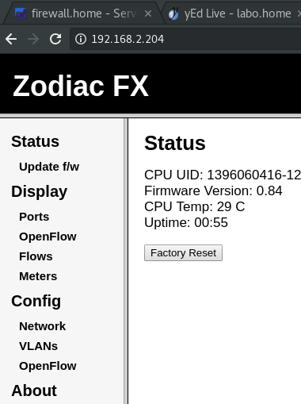

..
    # with overline, for parts
    * with overline, for chapters
    =, for sections
    -, for subsections
    ^, for subsubsections
    “, for paragraphs

Setting up the ZodiacFX
=======================

https://github.com/NorthboundNetworks/ZodiacFX

connecting to the ZodiacFX
--------------------------

#. connect the usb cable from the zodiacfx to your laptop
   
   Verify with dmesg

   .. code::

      sudo dmesg
      
      [3010068.043396] usb 1-4: new full-speed USB device number 10 using xhci_hcd
      [3010068.185334] usb 1-4: New USB device found, idVendor=03eb, idProduct=2404
      [3010068.185345] usb 1-4: New USB device strings: Mfr=1, Product=2, SerialNumber=0
      [3010068.185352] usb 1-4: Product: Zodiac
      [3010068.185357] usb 1-4: Manufacturer: Northbound Networks
      [3010068.210327] cdc_acm 1-4:1.0: ttyACM0: USB ACM device
      [3010068.212786] usbcore: registered new interface driver cdc_acm
      [3010068.212796] cdc_acm: USB Abstract Control Model driver for USB modems and ISDN adapters

   As you can see by connecting the usb cable the interface ttyACM0 was created
   we'll connect to it via minicom
      
#. install and configure minicom

   .. code::

      patrick@stretch:~/.ssh$ sudo apt-get install minicom
      patrick@stretch:~/.ssh$ sudo usermod --append --groups dialout $USER
      patrick@stretch:~/.ssh$ sudo minicom --device /dev/ttyACM0
      Welcome to minicom 2.7
      
      OPTIONS: I18n 
      Compiled on Apr 22 2017, 09:14:19.
      Port /dev/ttyACM0, 13:24:57
      
      Press CTRL-A Z for help on special keys
      
      Zodiac_FX# 
       _____             ___               _______  __
      /__  /  ____  ____/ (_)___ ______   / ____/ |/ /
        / /  / __ \/ __  / / __ `/ ___/  / /_   |   /
       / /__/ /_/ / /_/ / / /_/ / /__   / __/  /   |  
      /____/\____/\__,_/_/\__,_/\___/  /_/    /_/|_| 
                  by Northbound Networks
      
      
      Type 'help' for a list of available commands
      help
      The following commands are currently available:
      
      Base:
       config
       openflow
       debug
       update
       show status
       show version
       show ports
       restart
       help
      
      Config:
       save
       restart
       show config
       show vlans
       set name <name>
       set mac-address <mac address>
       set ip-address <ip address>
       set netmask <netmasks>
       set gateway <gateway ip address>
       set of-controller <openflow controller ip address>
       set of-port <openflow controller tcp port>
       set failstate <secure|safe>
       add vlan <vlan id> <vlan name>
       delete vlan <vlan id>
       set vlan-type <vlan id> <openflow|native>
       add vlan-port <vlan id> <port>
       delete vlan-port <port>
       set of-version <version(0|1|4)>
       set ethertype-filter <enable|disable>
       factory reset
       exit
      
      OpenFlow:
       show status
       show tables
       show flows
       show meters
       enable
       disable
       clear flows
       exit
      
      Debug:
       read <register>
       write <register> <value>
       mem
       trace
       exit
      
      Zodiac_FX# 

   This is the default configuration

   .. code::

      Zodiac_FX(config)# show config
      
      -------------------------------------------------------------------------
      Configuration
       Name: Zodiac_FX
       MAC Address: 70:B3:D5:XX:XX:XX
       IP Address: 10.0.1.99
       Netmask: 255.255.255.0
       Gateway: 10.0.1.1
       OpenFlow Controller: 10.0.1.8
       OpenFlow Port: 6633
       Openflow Status: Enabled
       Failstate: Secure
       Force OpenFlow version: Disabled
       EtherType Filtering: Disabled
      
      -------------------------------------------------------------------------

#. Configure the ip-address subnetmask and gateway 

   .. code::

      Zodiac_FX# show ports
      Zodiac_FX#config
      Zodiac_FX(config)# set ip-address 192.168.2.204
       IP Address set to 192.168.2.204
      # Zodiac_FX(config)# set netmask 255.255.255.0
      Zodiac_FX(config)# set gateway 192.168.2.1
       Gateway set to 192.168.2.1

      Zodiac_FX(config)# show config
      
      -------------------------------------------------------------------------
      Configuration
       Name: Zodiac_FX
       MAC Address: 70:B3:D5:XX:XX:XX
       IP Address: 192.168.2.2
       Netmask: 255.255.255.0
       Gateway: 192.168.2.1
       OpenFlow Controller: 10.0.1.8
       OpenFlow Port: 6633
       Openflow Status: Enabled
       Failstate: Secure
       Force OpenFlow version: Disabled
       EtherType Filtering: Disabled
      
      -------------------------------------------------------------------------

      Zodiac_FX(config)# save
       Writing Configuration to EEPROM (197 bytes)

.. note:: you will not be able to ping the ZodiacFX until you saved and unplugged the usb cable to reboot it       

#. Configure an interface alias ip if you want to connect to the default ip-address the zodiac ships with and you're on a different LAN subnet
example

   .. code::

      sudo ip addr add 10.0.1.8/24 label enp0s31f6:fx dev enp0s31f6
      verify with
      sudo ip addr show label enp0s31f6:fx

   .. warning:: if you exceed 16 characters on your ifname:label you will get a numerical error, this became obvious as we moved away from only using eth0 etc.

you should be able to connect to the web portal of the zodiac now

.. note:: to exit minicom hit enter then ctl-A then q then enter
