.. include:: ../../../_static/global.rst 

..
    # with overline, for parts
    * with overline, for chapters
    =, for sections
    -, for subsections
    ^, for subsubsections
    “, for paragraphs

EIGRP
=====

AD Values table
---------------

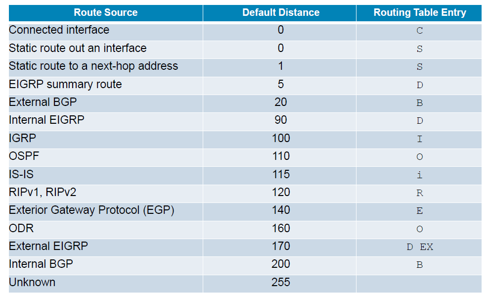

RFC link https://www.rfc-editor.org/rfc/rfc7868.txt

In Cisco IOS Release 15.0(1)M, Cisco introduced a new EIGRP configuration option called named EIGRP. Named EIGRP enables the configuration of EIGRP for both IPv4 and IPv6 under a single configuration mode. This helps eliminate configuration complexity that occurs when configuring EIGRP for both IPv4 and IPv6. Named EIGRP is beyond the scope of this course.

EIGRP was designed as a network layer independent routing protocol. Because of this design, EIGRP cannot use the services of UDP or TCP. Instead, EIGRP uses the ``Reliable Transport Protocol (RTP)`` for the delivery and reception of EIGRP packets

+----------------+
| Neighbor Table |
+================+
| Topology Table |
+----------------+
| Routing Table  |
+----------------+

Features of EIGRP
-----------------

 
 Diffusing Update Algorithm
  As the computational engine that drives EIGRP, the Diffusing Update Algorithm (DUAL) resides at the center of the routing protocol.
  DUAL guarantees loop-free and backup paths throughout the routing domain.
  Using DUAL, EIGRP stores all available backup routes for destinations so that it can quickly adapt to alternate routes when necessary.

 Establishing Neighbor Adjacencies
  EIGRP establishes relationships with directly connected routers that are also enabled for EIGRP.
  Neighbor adjacencies are used to track the status of these neighbors.

 Reliable Transport Protocol
  The Reliable Transport Protocol (RTP) is unique to EIGRP and provides delivery of EIGRP packets to neighbors.
  RTP and the tracking of neighbor adjacencies set the stage for DUAL.

 Partial and Bounded Updates
  EIGRP uses the terms partial and bounded when referring to its updates.
  Unlike RIP, EIGRP does not send periodic updates and route entries do not age out.
  The term partial means that the update only includes information about the route changes, such as a new link or a link becoming unavailable.
  The term bounded refers to the propagation of partial updates that are sent only to those routers that the changes affect. This minimizes the bandwidth that is required to send EIGRP updates.

 Equal and Unequal Cost Load Balancing
  EIGRP supports equal cost load balancing and unequal cost load balancing, which allows administrators to better distribute traffic flow in their networks.

EIGRP Protocol-Dependent Modules PDMs
-------------------------------------

EIGRP asks DUAL to make routing decisions, but the results are stored in the IPv4 routing table.

PDMs are responsible for the specific routing tasks for each network layer protocol, including:

 + Maintaining the neighbor and topology tables of EIGRP routers that belong to that protocol suite
 + Building and translating protocol-specific packets for DUAL
 + Interfacing DUAL to the protocol-specific routing table
 + Computing the metric and passing this information to DUAL
 + Implementing filtering and access lists
 + Performing redistribution functions to and from other routing protocols
 + Redistributing routes that are learned by other routing protocols

Reliable Transport Protocol
---------------------------

- Replaces TCP/UDP as EIGRP is protocol independant
- RTP can send EIGRP packets as unicast or multicast

+----------+-------------+----------------+
|          | ipv4        | ipv6           |
+==========+=============+================+
| mc adres | 224.0.0.10  | FF02::A        |
+----------+-------------+----------------+
| IP field | protocol 88 | next header 88 |
+----------+-------------+----------------+

+ The IPv4 protocol field uses 88 to indicate the data portion of the packet is an EIGRP for IPv4 message.
+ EIGRP for IPv6 messages are encapsulated in IPv6 packets using the next header field of 88. Similar to the protocol field for IPv4, the IPv6 next header field indicates the type of data carried in the IPv6 packet.

an EIGRP update packet is sent reliably over RTP and requires an acknowledgment. An EIGRP Hello packet is also sent over RTP, but unreliably. This means that EIGRP Hello packets do not require an acknowledgment. 

Authentication
--------------

EIGRP like RIPv2, OSPF, IS-IS and BGP can be cfgd to authenticate their routing information.

.. note:: Authentication does not encrypt the EIGRP routing updates

Packet Types
------------

+-----------------+----------------------------------------------------------+----------+-----------+
| type            | used to                                                  | reliable | UC/MC     |
+=================+==========================================================+==========+===========+
| Hello           | NB discovery and maintain NB adjacencies                 | no       | multicast |
+-----------------+----------------------------------------------------------+----------+-----------+
| Update          | Propagates routing info to EIGRP NBs                     | yes      | both      |
+-----------------+----------------------------------------------------------+----------+-----------+
| Acknowledgement | acknowledge receipt of EIGRP message                     | no       | unicast   |
+-----------------+----------------------------------------------------------+----------+-----------+
| Query           | request specific route info from NB router               | yes      | both      |
|                 | - sent to NBs when DUAL places route in Active State     |          |           |
+-----------------+----------------------------------------------------------+----------+-----------+
| Reply           | Sent in response to an EIGRP query                       | yes      | unicast   |
|                 | - Used to give DUAL information about the destination NW |          |           |
+-----------------+----------------------------------------------------------+----------+-----------+

HA(ha) = unreliable
AR(ar) = unicast
QU(quq) = both

Hello packets
^^^^^^^^^^^^^

+--------------+------------------------------+---------------+--------------+
| BW           | Link                         | default hello | default hold |
+==============+==============================+===============+==============+
| 1.544 Mb/s   | NBMA, Multipoint Frame Relay | 60 seconds    | 180 seconds  |
+--------------+------------------------------+---------------+--------------+
| > 1.544 Mb/s | T1, Ethernet                 | 5 seconds     | 15 seconds   |
+--------------+------------------------------+---------------+--------------+

.. note:: NBMA networks using slower interfaces include legacy X.25, Frame Relay, and Asynchronous Transfer Mode (ATM)

- discover neighbors and establish adjacencies with neighbor routers using the Hello packet.
- Hello packets to maintain established adjacencies. An EIGRP router assumes that as long as it receives Hello packets from a neighbor, the neighbor and its routes remain viable.
- Hold timer to determine the maximum time the router should wait to receive the next Hello before declaring that neighbor as unreachable. 

Update packets
^^^^^^^^^^^^^^

UPDATE packets carry the DUAL UPDATE message type and are used to convey information about destinations and the reachability of those destinations.  When a new neighbor is discovered, unicast UPDATE packets are used to transmit a full table to the new neighbor, so the neighbor can build up its topology table.  In normal operation (other than neighbor startup such as a link cost changes), UPDATE packets are multicast.  UPDATE packets are always transmitted reliably.  Each TLV destination will be processed individually through the DUAL FSM.

EIGRP sends Update packets to propagate routing information. Update packets are sent only when necessary. EIGRP updates contain only the routing information needed and are sent only to those routers that require it.

.. note:: Unlike the older distance vector routing protocol RIP, EIGRP does not send periodic updates and route entries do not age out. Instead, EIGRP sends incremental updates only when the state of a destination changes. This may include when a new network becomes available, an existing network becomes unavailable, or a change occurs in the routing metric for an existing network.

EIGRP uses the terms ``partial update and bounded update`` when referring to its updates.
 
 - A partial update means that the update only includes information about route changes.
 
 - A bounded update refers to the sending of partial updates only to the routers that are affected by the changes. Bounded updates help EIGRP minimize the bandwidth that is required to send EIGRP updates.

EIGRP Update packets use reliable delivery, which means ``the sending router requires an acknowledgment``. Update packets are sent as a multicast when required by multiple routers, or as a unicast when required by only a single router. In the figure, the updates are sent as unicasts because the links are point-to-point.

acknowledge packets
^^^^^^^^^^^^^^^^^^^

EIGRP sends Acknowledgment (ACK) packets when reliable delivery is used.

.. note:: An EIGRP acknowledgment is an EIGRP Hello packet without any data.RTP uses reliable delivery for Update, Query, and Reply packets. EIGRP Acknowledgment packets are always sent as an unreliable unicast. Unreliable delivery makes sense; otherwise, there would be an endless loop of acknowledgments.

.. note:: Some documentation refers to the Hello and acknowledgment as a single type of EIGRP packet. 

Query packets
^^^^^^^^^^^^^

DUAL uses Query and Reply packets when searching for networks and other tasks. Queries and replies use reliable delivery. ``Queries can use multicast or unicast, whereas replies are always sent as unicast``. 

A QUERY packet carries the DUAL QUERY message type and is sent by a router to advertise that a route is in ACTIVE state and the originator is requesting alternate path information from its neighbors.  An infinite metric is encoded by setting the delay part of the metric to its maximum value.

If there is a topology change that causes multiple destinations to be marked ACTIVE, EIGRP will build one or more QUERY packets for all destinations present.  The state of each route is recorded individually, so a responding QUERY or REPLY need not contain all the same destinations in a single packet.  Since EIGRP uses a reliable transport mechanism, route QUERY packets are also guaranteed be reliably delivered.

When a QUERY packet is received, each destination will trigger a DUAL event, and the state machine will run individually for each route. Once the entire original QUERY packet is processed, then a REPLY or SIA-REPLY will be sent with the latest information.

Reply packets
^^^^^^^^^^^^^

All neighbors must send a reply, regardless of whether or not they have a route to the downed network. Because replies also use reliable delivery, routers, such as R2, must send an acknowledgment.

Feasibility Condition
---------------------

The Feasibility Condition is used as an integral part of DUAL operation:
 every path selection in DUAL is subject to the Feasibility Condition check.  Based on the result of the Feasibility Condition check after a topology change is detected, the route may either remain PASSIVE (if, after the topology change, the neighbor providing the least cost path meets the Feasibility Condition) or it needs to enter the ACTIVE state (if the topology change resulted in none of the neighbors providing the least cost path to meet the Feasibility Condition).

The Feasibility Condition is a part of DUAL that allows the diffused computation to terminate as early as possible.
Nodes that are not affected by the topology change are not required to perform a DUAL computation and may not be aware a topology change occurred.
This can occur in two cases:

 - First, if informed about a topology change, a router may keep a route in PASSIVE state if it is aware of other paths that are downstream towards the destination (routes meeting the Feasibility Condition).
   A route that meets the Feasibility Condition is determined to be loop free and downstream along the path between the router and the destination.

 - Second, if informed about a topology change for which it does not currently have reachability information, a router is not required to enter into the ACTIVE state, nor is it required to participate in the DUAL process.

In order to facilitate describing the Feasibility Condition, a few definitions are in order.

 +  A successor for a given route is the next hop used to forward data traffic for a destination.  Typically, the successor is chosen based on the least-cost path to reach the destination.

 +  A Feasible Successor is a neighbor that meets the Feasibility Condition.  A Feasible Successor is regarded as a downstream neighbor towards the destination, but it may not be the least-cost path but could still be used for forwarding data packets in the event equal or unequal cost load sharing was active.
    A Feasible Successor can become a successor when the current successor becomes unreachable.

 +  The Feasibility Condition is met when a neighbor's advertised cost, (RD) to a destination is less than the FD for that destination, or in other words, the Feasibility Condition is met when the neighbor is closer to the destination than the router itself has ever been since the destination has entered the PASSIVE state for the last time.

 +  The FD is the lowest distance to the destination since the last time the route went from ACTIVE to PASSIVE state. 
    It should be noted it is not necessarily the current best distance; rather, it is a historical record of the best distance known since the last diffusing computation for the destination has finished.
    Thus, the value of the FD can either be the same as the current best distance, or it can be lower.

A neighbor that advertises a route with a cost that does not meet the Feasibility Condition may be upstream and thus cannot be guaranteed to be the next hop for a loop-free path.  Routes advertised by upstream neighbors are not recorded in the routing table but saved in the topology table.

EIGRP msg Encapsulation
-----------------------

The Data portion of an EIGRP msg is encapsulated in a packet. The data field is called Type Length Value (TLV)
 - EIGRP parameters
 - IP internal routes
 - IP external routes

EIGRP packet header + TLV => encapsulated in IP packet
 - IP Source Address (of sending NIC)
 - IP Destination Address = MC 224.0.0.10 or FF02::A
 - Protocol field 88 for EIGRP or Next Header Field 88

The Data Link Frame
 - MAC Source Address (sending NIC)
 - MAC = MC ``01-00-5E-00-00-0A``

EIGRP Packet Header
-------------------

:: 

   +-+-+-+-+-+-+-+-+-+-+-+-+-+-+-+-+-+-+-+-+-+-+-+-+-+-+-+-+-+-+-+-+
   |0                   1                   2                   3  |
   |0 1 2 3 4 5 6 7 8 9 0 1 2 3 4 5 6 7 8 9 0 1 2 3 4 5 6 7 8 9 0 1|
   +-+-+-+-+-+-+-+-+-+-+-+-+-+-+-+-+-+-+-+-+-+-+-+-+-+-+-+-+-+-+-+-+
   |Header Version | Opcode        |           Checksum            |
   +-+-+-+-+-+-+-+-+-+-+-+-+-+-+-+-+-+-+-+-+-+-+-+-+-+-+-+-+-+-+-+-+
   |                             Flags                             |
   +-+-+-+-+-+-+-+-+-+-+-+-+-+-+-+-+-+-+-+-+-+-+-+-+-+-+-+-+-+-+-+-+
   |                        Sequence Number                        |
   +-+-+-+-+-+-+-+-+-+-+-+-+-+-+-+-+-+-+-+-+-+-+-+-+-+-+-+-+-+-+-+-+
   |                     Acknowledgment Number                     |
   +-+-+-+-+-+-+-+-+-+-+-+-+-+-+-+-+-+-+-+-+-+-+-+-+-+-+-+-+-+-+-+-+
   | Virtual Router ID             |   Autonomous System Number    |
   +-+-+-+-+-+-+-+-+-+-+-+-+-+-+-+-+-+-+-+-+-+-+-+-+-+-+-+-+-+-+-+-+

Header Version: EIGRP Packet Header Format version.  Current Version is 2.  This field is not the same as the TLV Version field.

Opcodes
^^^^^^^

::

   Opcode: Indicates the type of the message. It will be one of the following values:
      EIGRP_OPC_UPDATE              1
      EIGRP_OPC_REQUEST             2
      EIGRP_OPC_QUERY               3
      EIGRP_OPC_REPLY               4
      EIGRP_OPC_HELLO               5
      Reserved                      6      (EIGRP_OPC_IPXSAP)
      Reserved                      7      (EIGRP_OPC_PROBE)
      Reserved                      8      (EIGRP_OPC_ACK)
      Reserved                      9
      EIGRP_OPC_SIAQUERY           10
      EIGRP_OPC_SIAREPLY           11

Checksum
^^^^^^^^
Each packet will include a checksum for the entire contents of the packet. The checksum will be the standard ones' complement of the ones' complement sum.  For purposes of computing the checksum, the value of the checksum field is zero. The packet is discarded if the packet checksum fails.

Flags
^^^^^

Defines special handling of the packet. There are currently four defined flag bits.

::

   # INIT-Flag (0x01): This bit is set in the initial UPDATE sent to a newly discovered neighbor. It instructs the neighbor to advertise its full set of routes.
    
   # CR-Flag (0x02): This bit indicates that receivers should only accept the packet if they are in Conditionally Received mode.
     A router enters Conditionally Received mode when it receives and processes a HELLO packet with a SEQUENCE TLV present.
    
   # RS-Flag (0x04): The Restart flag is set in the HELLO and the UPDATE packets during the restart period. 
     The router looks at the RS-Flag to detect if a neighbor is restarting.  From the restarting routers perspective,
     if a neighboring router detects the RS-Flag set, it will maintain the adjacency, and will set the RS-Flag in its UPDATE packet to indicated it is doing a soft restart.
  
   # EOT-Flag (0x08): The End-of-Table flag marks the end of the startup process with a neighbor.  If the flag is set, it indicates the neighbor has completed sending all UPDATEs.
     At this point, the router will remove any stale routes learned from the neighbor prior to the restart event.
     A stale route is any route that existed before the restart and was not refreshed by the neighbor via and UPDATE.
  
Sequence Number
^^^^^^^^^^^^^^^

Each packet that is transmitted will have a 32-bit sequence number that is unique with respect to a sending router.
 A value of 0 means that an acknowledgment is not required.

Acknowledgment Number
^^^^^^^^^^^^^^^^^^^^^

The 32-bit sequence number that is being acknowledged with respect to the receiver of the packet.  If the value is 0, there is no acknowledgment present.
A non-zero value can only be present in unicast-addressed packets.
.. note:: A HELLO packet with a non-zero ACK field should be decoded as an ACK packet rather than a HELLO packet.

Virtual Router Identifier (VRID)
^^^^^^^^^^^^^^^^^^^^^^^^^^^^^^^^

A 16-bit number that identifies the virtual router with which this packet is associated. Packets received with an unknown, or unsupported, value will be discarded.

::

   Value Range       Usage
     0x0000            Unicast Address Family
     0x0001            Multicast Address Family
     0x0002-0x7FFF     Reserved
     0x8000            Unicast Service Family
     0x8001-0xFFFF     Reserved

Autonomous System Number
^^^^^^^^^^^^^^^^^^^^^^^^

16-bit unsigned number of the sending system. This field is indirectly used as an authentication value.
 That is, a router that receives and accepts a packet from a
 neighbor must have the same AS number or the packet is ignored.
 The range of valid AS numbers is 1 through 65,535.

EIGRP TLV Encoding Format
-------------------------

   The contents of each packet can contain a variable number of fields.
   Each field will be tagged and include a length field.  This allows
   for newer versions of software to add capabilities and coexist with
   old versions of software in the same configuration.  Fields that are
   tagged and not recognized can be skipped over.  Another advantage of
   this encoding scheme is that it allows multiple network-layer
   protocols to carry independent information.  Therefore, if it is
   later decided to implement a single "integrated" protocol, this can
   be done.

::

   The format of a {type, length, value} (TLV) is encoded as follows:

    0                   1                   2                   3
    0 1 2 3 4 5 6 7 8 9 0 1 2 3 4 5 6 7 8 9 0 1 2 3 4 5 6 7 8 9 0 1
   +-+-+-+-+-+-+-+-+-+-+-+-+-+-+-+-+-+-+-+-+-+-+-+-+-+-+-+-+-+-+-+-+
   | Type high     | Type low      |            Length             |
   +-+-+-+-+-+-+-+-+-+-+-+-+-+-+-+-+-+-+-+-+-+-+-+-+-+-+-+-+-+-+-+-+
   |                    Value (variable length)                    |
   +-+-+-+-+-+-+-+-+-+-+-+-+-+-+-+-+-+-+-+-+-+-+-+-+-+-+-+-+-+-+-+-+

The type values are the ones defined below. The length value specifies the length in octets of the type, length, and value fields.
TLVs can appear in a packet in any order, and there are no interdependencies among them.

Malformed TLVs contained in EIGRP messages are handled by silently discarding the containing message.
A TLV is malformed if the TLV Length is invalid or if the TLV extends beyond the end of the containing message.

Type Field Encoding
^^^^^^^^^^^^^^^^^^^

::

   The type field is structured as follows: Type High: 1 octet that
   defines the protocol classification:

            Protocol            ID   VERSION
            General            0x00    1.2
            IPv4               0x01    1.2
            IPv6               0x04    1.2
            SAF                0x05    3.0
            Multiprotocol      0x06    2.0

   Type Low: 1 octet that defines the TLV Opcode; see TLV Definitions in
      Section 3.

Length Field Encoding
^^^^^^^^^^^^^^^^^^^^^

The Length field is a 2-octet unsigned number, which indicates the length of the TLV. The value includes the Type and Length fields.

Value Field Encoding
^^^^^^^^^^^^^^^^^^^^  
The Value field is a multi-octet field containing the payload for the TLV.

EIGRP Generic TLV Definitions
-----------------------------

::
   
                                Ver 1.2   Ver 2.0
   PARAMETER_TYPE                0x0001    0x0001
   AUTHENTICATION_TYPE           0x0002    0x0002
   SEQUENCE_TYPE                 0x0003    0x0003
   SOFTWARE_VERSION_TYPE         0x0004    0x0004
   MULTICAST_SEQUENCE_TYPE       0x0005    0x0005
   PEER_INFORMATION_TYPE         0x0006    0x0006
   PEER_TERMINATION_TYPE         0x0007    0x0007
   PEER_TID_LIST_TYPE             ---      0x0008

0x0001 - PARAMETER_TYPE
^^^^^^^^^^^^^^^^^^^^^^^

This TLV is used in HELLO packets to convey the EIGRP metric coefficient values:
 - noted as ``K-values as well as the Hold Time`` values.
 - This TLV is also used in an initial UPDATE packet when a neighbor is discovered.

::

    0                   1                   2                   3
    0 1 2 3 4 5 6 7 8 9 0 1 2 3 4 5 6 7 8 9 0 1 2 3 4 5 6 7 8 9 0 1
   +-+-+-+-+-+-+-+-+-+-+-+-+-+-+-+-+-+-+-+-+-+-+-+-+-+-+-+-+-+-+-+-+
   |            0x0001             |            0x000C             |
   +-+-+-+-+-+-+-+-+-+-+-+-+-+-+-+-+-+-+-+-+-+-+-+-+-+-+-+-+-+-+-+-+
   |       K1      |       K2      |       K3      |       K4      |
   +-+-+-+-+-+-+-+-+-+-+-+-+-+-+-+-+-+-+-+-+-+-+-+-+-+-+-+-+-+-+-+-+
   |       K5      |       K6      |           Hold Time           |
   +-+-+-+-+-+-+-+-+-+-+-+-+-+-+-+-+-+-+-+-+-+-+-+-+-+-+-+-+-+-+-+-+

K-values: The K-values associated with the EIGRP composite metric equation.
The default values for weights are:

 - K1 - 1
 - K2 - 0
 - K3 - 1
 - K4 - 0
 - K5 - 0
 - K6 - 0

Hold Time: The amount of time in seconds that a receiving router should consider the sending neighbor valid.A valid neighbor is one that is able to forward packets and participates in EIGRP.  A router that considers a neighbor valid will store all routing information advertised by the neighbor.

0x0002 - AUTHENTICATION_TYPE
^^^^^^^^^^^^^^^^^^^^^^^^^^^^

This TLV may be used in any EIGRP packet and conveys the authentication type and data used. Routers receiving a mismatch in authentication shall discard the packet.

::

     0                   1                   2                   3
     0 1 2 3 4 5 6 7 8 9 0 1 2 3 4 5 6 7 8 9 0 1 2 3 4 5 6 7 8 9 0 1
    +-+-+-+-+-+-+-+-+-+-+-+-+-+-+-+-+-+-+-+-+-+-+-+-+-+-+-+-+-+-+-+-+
    |             0x0002            |            Length             |
    +-+-+-+-+-+-+-+-+-+-+-+-+-+-+-+-+-+-+-+-+-+-+-+-+-+-+-+-+-+-+-+-+
    |   Auth Type    | Auth Length  |      Auth Data (Variable)     |
    +-+-+-+-+-+-+-+-+-+-+-+-+-+-+-+-+-+-+-+-+-+-+-+-+-+-+-+-+-+-+-+-+

+   Authentication Type: The type of authentication used.

+   Authentication Length: The length, measured in octets, of the individual authentication.

+   Authentication Data: Variable-length field reflected by "Auth Length", which is dependent on the type of authentication used.
    Multiple authentication types can be present in a single AUTHENTICATION_TYPE TLV.

0x02 - MD5 Authentication Type
^^^^^^^^^^^^^^^^^^^^^^^^^^^^^^

MD5 Authentication will use Auth Type code 0x02, and the Auth Data will be the MD5 Hash value.

0x03 - SHA2 Authentication Type
^^^^^^^^^^^^^^^^^^^^^^^^^^^^^^^

SHA2-256 Authentication will use Type code 0x03, and the Auth Data will be the 256-bit SHA2 [6] Hash value.

0x0003 - SEQUENCE_TYPE  
^^^^^^^^^^^^^^^^^^^^^^

This TLV is used for a sender to tell receivers to not accept packets with the CR-Flag set. This is used to order multicast and unicast addressed packets.

::

    |0                   1                   2                   3
    |0 1 2 3 4 5 6 7 8 9 0 1 2 3 4 5 6 7 8 9 0 1 2 3 4 5 6 7 8 9 0 1
    +-+-+-+-+-+-+-+-+-+-+-+-+-+-+-+-+-+-+-+-+-+-+-+-+-+-+-+-+-+-+-+-+
    |            0x0003             |            Length             |
    +-+-+-+-+-+-+-+-+-+-+-+-+-+-+-+-+-+-+-+-+-+-+-+-+-+-+-+-+-+-+-+-+
    |Address Length |                 Protocol Address              |
    +-+-+-+-+-+-+-+-+-+-+-+-+-+-+-+-+-+-+-+-+-+-+-+-+-+-+-+-+-+-+-+-+

The Address Length and Protocol Address will be repeated one or more times based on the Length field.

 + Address Length:
   Number of octets for the address that follows. For IPv4, the value is 4.  For IPv6, it is 16.  For AppleTalk, the value is 4; for Novell IPX, the value is 10 (both are no longer in use).
 
 + Protocol Address:
   Neighbor address on interface in which the HELLO with SEQUENCE TLV is sent.  Each address listed in the HELLO packet is a neighbor that should not enter Conditionally Received mode.

EIGRP TLV Internal routes
-------------------------

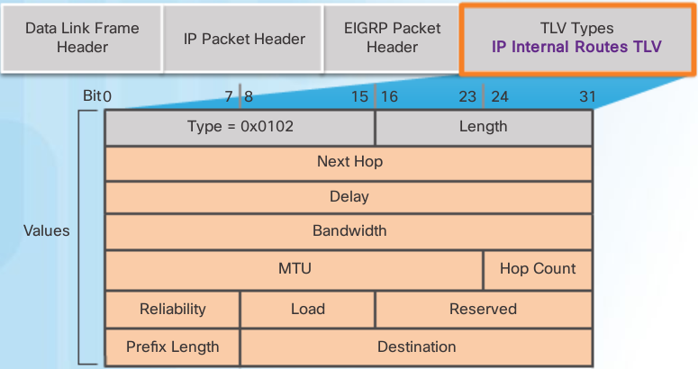

- **Delay**:         Sum of delays in units of 10 microseconds from source to destination; 0xFFFFFFFF indicates unreachable route
- **Bandwidth**:     Lowest configured bandwidth of any interface along the route
- **Prefix Length**: Specifies the number of network bits in the subnet mask
- **Destination**:   The destination network address; this field is variable

The IP internal message is used to advertise EIGRP routes within an autonomous system. Important fields include the metric fields (delay and bandwidth), the subnet mask field (prefix length), and the destination field.

Delay is calculated as the sum of delays from source to destination in units of 10 microseconds. Bandwidth is the lowest configured bandwidth of any interface along the route.

The subnet mask is specified as the prefix length or the number of network bits in the subnet mask. For example, the prefix length for the subnet mask 255.255.255.0 is 24, because 24 is the number of network bits.

The Destination field stores the address of the destination network. Although only 24 bits are shown in this figure, this field varies based on the value of the network portion of the 32-bit network address. For example, the network portion of 10.1.0.0/16 is 10.1; therefore, the Destination field stores the first 16 bits. Because the minimum length of this field is 24 bits, the remainder of the field is padded with zeros. If a network address is longer than 24 bits (192.168.1.32/27, for example), then the Destination field is extended for another 32 bits (for a total of 56 bits) and the unused bits are padded with zeros.

EIGRP TLV External routes
-------------------------

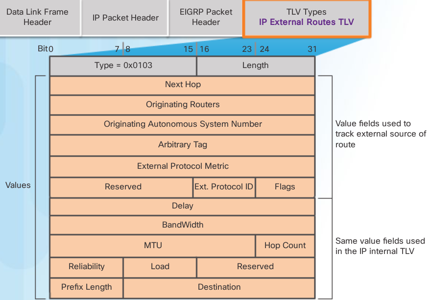

The IP external message is used **when external routes are imported** into the EIGRP routing process. In this chapter, we will import or redistribute a default static route into EIGRP. Notice that the bottom half of the IP External Routes TLV includes all the fields used by the IP Internal TLV.

.. note:: The maximum transmission unit (MTU) is not a metric used by EIGRP. The MTU is included in the routing updates, but it is not used to determine the routing metric.

Autonomous Systems
------------------

The autonomous system number used for EIGRP configuration is only significant to the EIGRP routing domain. It functions as a process ID to help routers keep track of multiple running instances of EIGRP. This is required because it is possible to have more than one instance of EIGRP running on a network. Each instance of EIGRP can be configured to support and exchange routing updates for different networks.

All routers within the EIGRP routing domain must use the same autonomous system number. 

.. note:: EIGRP and OSPF can support multiple instances of the routing protocol. However, this multiple routing protocol implementation is not usually needed or recommended.

The ``router eigrp autonomous-system`` command does not start the EIGRP process itself. The router does not start sending updates. Rather, this command only provides access to configure the EIGRP settings.

To completely remove the EIGRP routing process from a device, use the ``no router eigrp autonomous-system`` global configuration mode command, which stops the EIGRP process and removes all existing EIGRP router configurations.

EIGRP Router ID
---------------

The EIGRP router ID is used to uniquely identify each router in the EIGRP routing domain.

The router ID is used in both EIGRP and OSPF routing protocols. However, the role of the router ID is more significant in OSPF. In EIGRP IPv4 implementations, the use of the router ID is not that apparent. EIGRP for IPv4 uses the 32-bit router ID to identify the originating router for redistribution of external routes. The need for a router ID becomes more evident in the discussion of EIGRP for IPv6. While the router ID is necessary for redistribution, the details of EIGRP redistribution are beyond the scope of this curriculum. For purposes of this curriculum, it is only necessary to understand what the router ID is and how it is determined.

To **determine its router ID**, a Cisco IOS router will use the following three criteria in order:

 1. Use the address configured with the eigrp router-id ipv4-address router configuration mode command.

 2. If the router ID is not configured, choose the highest IPv4 address of any of its loopback interfaces.

 3. If no loopback interfaces are configured, choose the highest active IPv4 address of any of its physical interfaces.

.. note:: If the network administrator does not explicitly configure a router ID using the eigrp router-id command, EIGRP generates its own router ID using either a loopback or physical IPv4 address. A loopback address is a virtual interface and is automatically in the up state when configured. The interface does not need to be enabled for EIGRP, meaning that it does not need to be included in one of the EIGRP network commands. However, the interface must be in the up/up state.

   Using the criteria described above, the figure shows the default EIGRP router IDs that are determined by the routers’ highest active IPv4 address.

.. note:: The eigrp router-id command is used to configure the router ID for EIGRP. Some versions of IOS will accept the command router-id, without first specifying eigrp. The running-config, however, will display eigrp router-id regardless of which command is used.

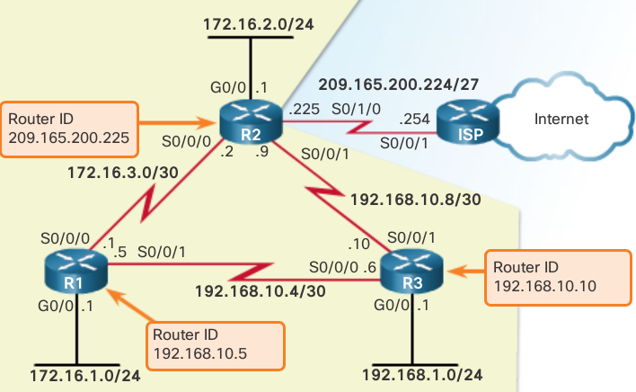

.. code::

   R1(config)# router eigrp 1
   R1(config-router)# eigrp router-id 1.1.1.1
   R1(config-router)#

   R2(config)# router eigrp 1
   R2(config-router)# eigrp router-id 2.2.2.2
   R2(config-router)#

   R1# show ip protocols
   *** IP Routing is NSF aware ***
   
   Routing Protocol is "eigrp 1"
     Outgoing update filter list for all interfaces is not 
     set
     Incoming update filter list for all interfaces is not 
     set
     Default networks flagged in outgoing updates
     Default networks accepted from incoming updates
     EIGRP-IPv4 Protocol for AS(1)
       Metric weight K1=1, K2=0, K3=1, K4=0, K5=0
       NSF-aware route hold timer is 240
       Router-ID: 1.1.1.1
       Topology : 0 (base) 
         Active Timer: 3 min
         Distance: internal 90 external 170
         Maximum path: 4
         Maximum hopcount 100
         Maximum metric variance 1
   
     Automatic Summarization: disabled
     Maximum path: 4
     Routing for Networks:
     Routing Information Sources:
       Gateway         Distance      Last Update
     Distance: internal 90 external 170
   
   R1#

.. warning:: The ipv4-address router ID can be configured with any IPv4 address except 0.0.0.0 and 255.255.255.255

If a router ID is not explicitly configured, then the router would use its **highest IPv4 address configured on a loopback interface**. The advantage of using a loopback interface is that unlike physical interfaces, **loopbacks cannot fail**. There are no actual cables or adjacent devices on which the loopback interface depends for being in the up state. Therefore, using a loopback address for the router ID can provide a more consistent router ID than using an interface address.

If the eigrp router-id command is not used and loopback interfaces are configured, EIGRP chooses the highest IPv4 address of any of its loopback interfaces.

.. code::

   R1(config)# router eigrp 1
   enable eigrp for interfaces on subnets 172.16.1.0/24 and 172.16.3.0/30
   ----------------------------------------------------------------------
   R1(config-router)# network 172.16.0.0 

   enable eigrp for interfaces on subnet 192.168.10.4/30 
   -----------------------------------------------------
   R1(config-router)# network 192.168.10.0 
   R1(config-router)# 

   R2(config)# router eigrp 1
   R2(config-router)# network 172.16.0.0
   R2(config-router)#
   \*Feb 28 17:51:42.543: %DUAL-5-NBRCHANGE: EIGRP-IPv4 1:
   Neighbor 172.16.3.1 (Serial0/0/0) is up: new adjacency
   R2(config-router)#

   using a wildcard mask e.g. / 30 = 255.255.255.255 - 255.255.255.252
   ---------------------
   R2(config)# router eigrp 1
   R2(config-router)# network 192.168.10.8 0.0.0.3 
   R2(config-router)#
   or (not recommended just use subnetmask)   
   ---
   R2(config-router)# network 192.168.10.8 255.255.255.252
   R2(config-router)# end
   R2# show running-config | section eigrp 1
   router eigrp 1
    network 172.16.0.0
    network 192.168.10.8 0.0.0.3
    eigrp router-id 2.2.2.2
   R2#
   

.. note:: DUAL automatically generates the notification message because the ``R(config-router)# eigrp log-neighbor-changes`` command is enabled by default. Specifically, the command helps verify neighbor adjacencies during configuration of EIGRP and displays any changes in EIGRP neighbor adjacencies, such as when an EIGRP adjacency has been added or removed.

Passive Interface
-----------------

As soon as a new IF is enabled within the EIGRP NW, EIGRP attempts to form a NB adjacency with any NB routers to send and receive updates

It may be necesary, or advantageous, to **include a DC NW in the routing update but not allow any NB adjacencies off of that IF to form**. The passive-interface command can be used to prevent the NB adjacencies

There are 2 primary reasons to enable the ``passive-interface`` command:

 1. To suppress unnecessary update traffic. E.g. when an IF is a LAN IF with no other routers connected
 2. To increase security controls, such as preventing unknown rogue routing devices from receiving EIGRP updates

.. note:: To configure all interfaces as passive, use the ``passive-interface default`` command. To disable an interface as passive, use the no passive-interface interface-type interface-number command.

An example of using the passive interface to increase security controls is when a network must connect to a third-party organization, for which the local administrator has no control, such as when connecting to an ISP network. In this case, the local network administrator would need to advertise the interface link through their own network, but would not want the third-party organization to receive or send routing updates to the local routing device, as this is a security risk. 

Verify with show ip protocols

.. code::

   R1(config)# router eigrp 1
   R1(config-router)# passive-interface gigabitethernet 0/0
   R3(config)# router eigrp 1
   R3(config-router)# passive-interface gigabitethernet 0/0

   R3# show ip protocols
   *** IP Routing is NSF aware ***
   
   Routing Protocol is "eigrp 1"
   <output omitted>
   Routing for Networks:
       192.168.1.0
       192.168.10.4/30
       192.168.10.8/30
    Passive Interface(s):
      GigabitEthernet0/0
    Routing Information Sources:
       Gateway         Distance      Last Update
       192.168.10.5          90      01:37:57
       192.168.10.9          90      01:37:57
     Distance: internal 90 external 170
   R3#

show ip eigrp neighbors command
-------------------------------

.. image:: ../../../_static/img/6_eigrp_show_ip_nbs.png

The column headers in the show ip eigrp neighbors command output identify the following:

 + H Lists the neighbors in the order that they were learned.
 
 + Address  IPv4 address of the neighbor.
 
 + Interface - Local interface on which this Hello packet was received.
 
 + Hold - Current hold time. When a Hello packet is received, this value is reset to the maximum hold time for that interface, and then counts down to zero. If zero is reached, the neighbor is considered down.
 
 + Uptime - Amount of time since this neighbor was added to the neighbor table.
 
 + Smooth Round Trip Timer (SRTT) and Retransmission Timeout (RTO) - Used by RTP to manage reliable EIGRP packets.
 
 + Queue Count - Should always be zero. If more than zero, then EIGRP packets wait to be sent.
 
 + Sequence Number - Used to track updates, queries, and reply packets.

.. note:: If the ping is successful and EIGRP still does not see the router as a neighbor, examine the following configurations:
          Are both routers configured with the same EIGRP autonomous system number?
          Is the directly connected network included in the EIGRP network statements?

Default Administrative Distances
--------------------------------

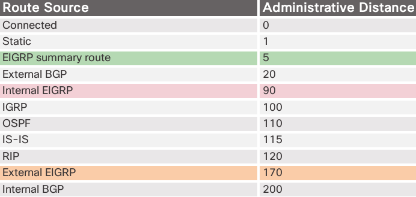

EIGRP has a default AD of 90 for internal routes and 170 for routes imported from an external source, such as default routes. When compared to other IGPs, EIGRP is the most preferred by the Cisco IOS, because it has the lowest administrative distance. EIGRP has a third AD value of 5, for summary routes.

Exchanging Routing Updates
---------------------------

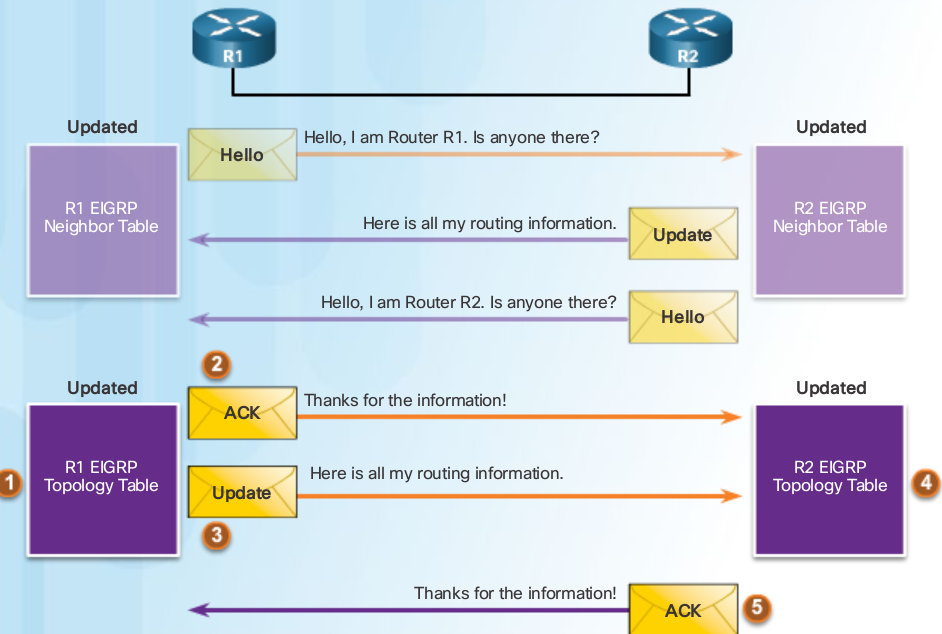

Updating the Routing Table IPv4
-------------------------------

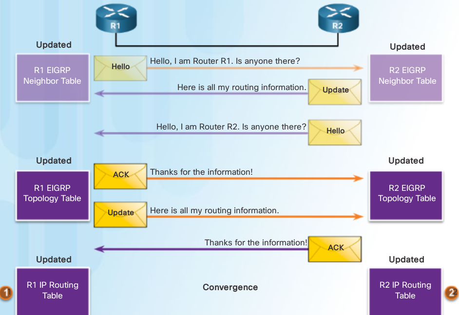

Interface Delay Values
----------------------

Time for a packet to traverse a route

When used to determine the EIGRP metric, delay is the cumulative (sum) of all interface delays along the path (microseconds)

            +---------------------+-------+
            | Media               | Delay |
            +=====================+=======+
            | Ethernet            | 1000  |
            +---------------------+-------+
            | Fast Ethernet       | 100   |
            +---------------------+-------+
            | Gigabit Ethernet    | 10    |
            +---------------------+-------+
            | 16M Token Ring      | 630   |
            +---------------------+-------+
            | FDDI                | 100   |
            +---------------------+-------+
            | T1 (Serial Default) | 20000 |
            +---------------------+-------+
            | DS0 (64 kb/s)       | 20000 |
            +---------------------+-------+
            | 1024 kb/s           | 20000 |
            +---------------------+-------+
            | 56 kb/s             | 20000 |
            +---------------------+-------+

EIGRP Calculate Metric
----------------------

.. warning:: sum of router its outgoing interface eg outgoing if R2 (serial) and R3 (lan gig), don't include R3 incoming IF

#. Determine the link with the slowest bandwidth. Use that value to calculate bandwidth (10,000,000/bandwidth).

#. Determine the delay value for each outgoing interface on the way to the destination. Add the delay values and divide by 10 (sum of delay/10).

#. This composite metric produces a 24-bit value; however, EIGRP uses a 32-bit value. Multiplying the 24-bit value with 256 extends the composite metric into 32 bits. Therefore, add the computed values for bandwidth and delay, and multiply the sum by 256 to obtain the EIGRP metric.

Default Composite Formula:
metric = **[K1*bandwidth + K3*delay] * 256**

by default dus 
**(Bandwidth + Delay) * 256 = Metric**

``Metric = (( 10 000 000 / bandwidth) + (sum of delay / 10)) * 256``

Complete Composite Formula:
metric = **[K1*bandwidth +  (K2*bandwidth) / (256 - load) + K3*delay] * [K5 / (reliability + K4)]**

(Not used if "K" values are 0)

.. note:: This is a conditional formula. If K5 = 0, the last term is replaced by 1 and the formula becomes: Metric = [K1*bandwidth + (K2*bandwidth) / (256-load) + K3*delay] * 256

Default Values:

 K1 (bandwidth) = 1
 K2 (load) = 0
 K3 (delay) = 1
 K4 (reliability) = 0
 K5 (reliability) = 0

Change K values:

.. code::

   Router(config-router)# metric weights tos k1 k2 k3 k4 k5

By default, EIGRP uses the following values in its composite metric to calculate the preferred path to a network:

   + Bandwidth
     The slowest bandwidth among all of the outgoing interfaces, along the path from source to destination.

   + Delay
     The cumulative (sum) of all interface delay along the path (in tens of microseconds).

The following values can be used, but are not recommended, because they typically result in frequent recalculation of the topology table:

   + Reliability
     Represents the worst reliability between the source and destination, which is based on keepalives.

   + Load
     Represents the worst load on a link between the source and destination, which is computed based on the packet rate and the configured bandwidth of the interface.

.. note:: Although the MTU is included in the routing table updates, it is not a routing metric used by EIGRP.

The Composite Metric

Formula consists of values K1 to K5, known as EIGRP metric weights. K1 and K3 represent bandwidth and delay, respectively. K2 represents load, and K4 and K5 represent reliability. By default, K1 and K3 are set to 1, and K2, K4, and K5 are set to 0. The result is that only the bandwidth and delay values are used in the computation of the default composite metric. EIGRP for IPv4 and EIGRP for IPv6 use the same formula for the composite metric.

.. warning:: The metric calculation method (k values) and the EIGRP autonomous system number must match between EIGRP neighbors. If they do not match, the routers do not form an adjacency.

.. code::

   R1# show ip protocols
   *** IP Routing is NSF aware ***
   
   Routing Protocol is "eigrp 1"
     Outgoing update filter list for all interfaces is not set
     Incoming update filter list for all interfaces is not set
     Default networks flagged in outgoing updates
     Default networks accepted from incoming updates
     EIGRP-IPv4 Protocol for AS(1)
       Metric weight k1=1, k2=0, k3=1, k4=0, k5=0
       NSF-aware route hold timer is 240
       Router-ID: 1.1.1.1
       ...

   R1# show interfaces serial 0/0/0
   shows BW, DLY, Reliability, txload, rxload

+ BW - Bandwidth of the interface (in kilobits per second).

+ DLY - Delay of the interface (in microseconds).

+ Reliability - Reliability of the interface as a fraction of 255 (255/255 is 100% reliability), calculated as an exponential average over five minutes. By default, EIGRP does not include its value in computing its metric.

+ Txload, Rxload - Transmit and receive load on the interface as a fraction of 255 (255/255 is completely saturated), calculated as an exponential average over five minutes. By default, EIGRP does not include its value in computing its metric.

Bandwidth configuration
-----------------------

Because both EIGRP and OSPF use bandwidth in default metric calculations, a correct value for bandwidth is very important to the accuracy of routing information.

Use the following interface configuration mode command to modify the bandwidth metric:

Router(config-if)# bandwidth kilobits-bandwidth-value

Use the no bandwidth command to restore the default value.

.. code::

   modify bandwidth
   ----------------
   
   R1(config)# interface s0/0/0
   R1(config-if)# bandwidth 2000
   R1(config-if)# interface s0/0/1
   R1(config-if)# bandwidth 64

DUAL Concepts
-------------

Dual provides:

 - Loop-free paths
 - Loop-free backup paths that can be used immediately
 - Fast convergence
 - Minimum BW usage with bounded updates

 + Successor
    Is a neighboring router and is the **Least-Cost** route to destination NW 
	IP is shown in routing table after the word **via**
 + Feasible Distance (FD)
    Lowest calculated Metric to reach Destination NW
 + Feasible Successor (FS) aka Backup paths
    Is a NB that has loop-free backup path with same NW as successor and satisfies the FC
 + Reported Distance (RD) or Advertised Distance (AD)
    The metric that a router reports to a NB about its own cost to that NW
 + Feasible Condition or Feasibility Condition (FC)
    When a NB's RD to a NW < than the local router's FD to same destination NW

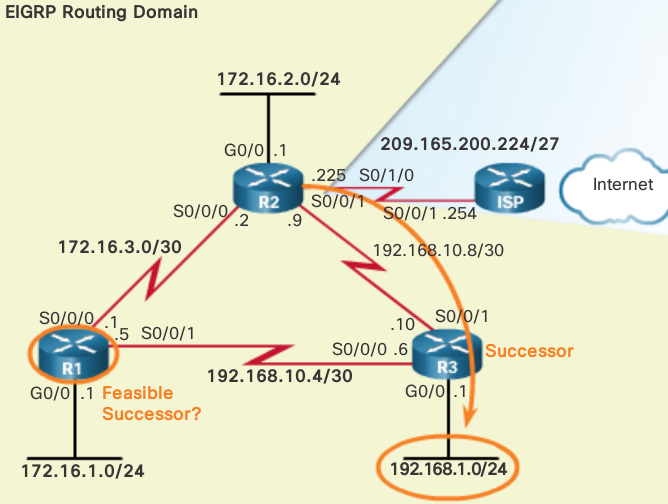

+ R2's successor for the 192.168.1.0/24 network is R3, providing the best path or lowest metric to the destination NW

+ R1 provides an alternative path, but is it an FS?

+ Before R1 can be an FS for R2, R1 must meet the FC

+ The FC is met when a NB reported distance(metric R reports to NB) to a NW is less than the local router's feasible distance(lowest calc. metric) to that same destination NW   
 
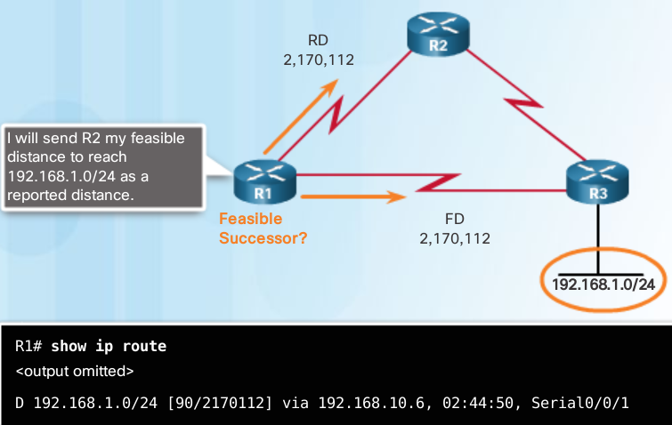

R1’s feasible distance to 192.168.1.0/24 is 2,170,112.

 + R1 reports to R2 that its FD to 192.168.1.0/24 is 2,170,112

 + From R2’s perspective, 2,170,112 is R1’s RD.

R2 uses this information to determine if R1 meets the FC and, therefore, can be an FS. 

+ R2’s feasible distance to 192.168.1.0 is 3,012,096
+ R1’s reported distance to 192.168.1.0 is 2,170,112
+ R1 meets the feasibility condition

.. code::

   R2# show ip route
   
   D    192.168.1.0/24 [90/3012096] via 192.168.10.10, 00:12:32, Serial0/0/1
                              |             |
       Feasible Distance <-----             ------> Successor (R3)

.. code::

   R1# show ip route 

   D    192.168.1.0/24 [90/2170112] via 192.168.10.6, 02:44:50, Serial0/0/1
                              |
       Feasible Distance <-----
       Sent to R2 as R1's Reported Distance

+ because the RD of R1 (2,170,112) is less than R2’s own FD (3,012,096), R1 meets the FC.
+ R1 is now an FS for R2 to the 192.168.1.0/24 network.

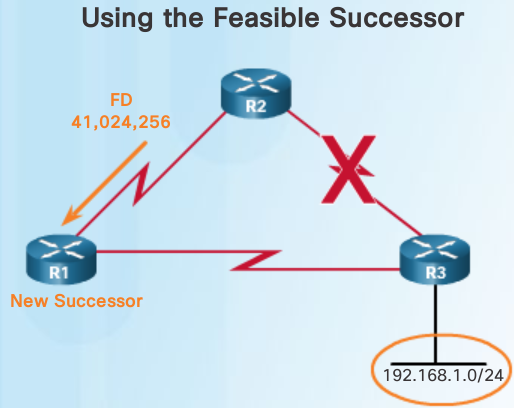

+ If there is a failure in R2’s path to 192.168.1.0/24 via R3 (successor), then R2 immediately installs the path via R1 (FS) in its routing table.
+ R1 becomes the new successor for R2’s path to this network

.. code::

   R2# show ip route 

   D     192.168.1.0/24 [90/41024256] via 172.16.3.1, 00:00:13, Serial0/0/0
                              |  |
       Feasible Distance <-----  ------> Successor (R1)

Topology Table
--------------

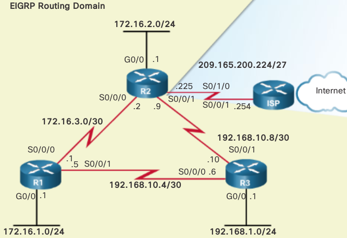

+ The EIGRP topology table contains all of the routes that are known to each EIGRP NB.
+ Lists all successors and FSs that DUAL has calculated to destination NWs
+ Only the successor is installed into the IP routing table

.. code::

   R2# show ip eigrp topology
   EIGRP-IPv4 Topology Table for AS(1)/ID(2.2.2.2)
   Codes: P - Passive, A - Active, U - Update, Q - Query, R - Reply,
          r - reply Status, s - sia Status 
   
   P 172.16.2.0/24, 1 successors, FD is 2816
           via Connected, GigabitEthernet0/0
   P 192.168.10.4/30, 1 successors, FD is 3523840
           via 192.168.10.10 (3523840/2169856), Serial0/0/1
           via 172.16.3.1 (41024000/2169856), Serial0/0/0
   P 192.168.1.0/24, 1 successors, FD is 3012096
           via 192.168.10.10 (3012096/2816), Serial0/0/1
           via 172.16.3.1 (41024256/2170112), Serial0/0/0
   P 172.16.3.0/30, 1 successors, FD is 40512000
           via Connected, Serial0/0/0
   P 172.16.1.0/24, 1 successors, FD is 3524096
           via 192.168.10.10 (3524096/2170112), Serial0/0/1
           via 172.16.3.1 (40512256/2816), Serial0/0/0
   P 192.168.10.8/30, 1 successors, FD is 3011840
           via Connected, Serial0/0/1
   
   R2#

.. image:: ../../../_static/img/6_eigrp_topotable_entry.png

+ P - Route in the passive state
   When DUAL is not performing its diffusing computations to determine a path for a network, the route is in a stable mode, known as the passive state. If DUAL recalculates or searches for a new path, the route is in an active state and displays an A. All routes in the topology table should be in the passive state for a stable routing domain.

+ 192.168.1.0/24
   Destination network that is also found in the routing table.

+ 1 successors
   Displays the number of successors for this network. If there are multiple equal cost paths to this network, there are multiple successors.

+ FD is 3012096
   FD, the EIGRP metric to reach the destination network. This is the metric displayed in the IP routing table.

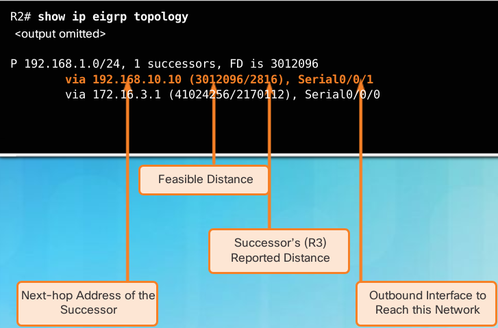

+ via 192.168.10.10
   Next-hop address of the successor, R3. This address is shown in the routing table.

+ 3012096
   FD to 192.168.1.0/24. It is the metric shown in the IP routing table.

+ 2816
   RD of the successor and is R3’s cost to reach this network.

+ Serial 0/0/1
   Outbound interface used to reach this network, also shown in the routing table.

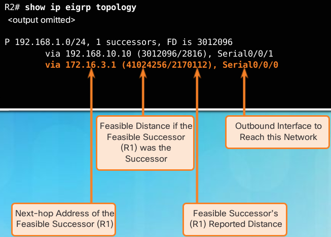

the second subentry shows the FS, R1 (if there is not a second entry, then there are no FSs):

+  via 172.16.3.1
    Next-hop address of the FS, R1.
+ 41024256
   R2’s new FD to 192.168.1.0/24, if R1 became the new successor and would be the new metric displayed in the IP routing table.

+ 2170112 
   RD of the FS, or R1’s metric to reach this network. RD must be less than the current FD of 3,012,096 to meet the FC.

+ Serial 0/0/0
   This is the outbound interface used to reach FS, if this router becomes the successor.

No feasible Successor
^^^^^^^^^^^^^^^^^^^^^

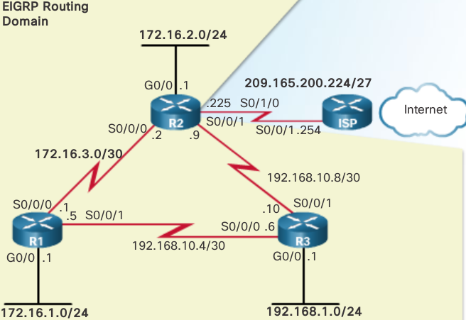

.. code::

   R1# show ip route
   
    D    192.168.1.0/24 [90/2170112] via 192.168.10.6, 01:23:13, Serial0/0/1
                                 |             |
          Feasible Distance <-----             ------> Next-hop router (R3) is the Successor

.. code::

   R1# show ip eigrp topology
   
    P 192.168.1.0/24, 1 successors, FD is 2170112 via 192.168.10.6 (2170112/2816), Serial0/0/1
                                                  |
                                                  -----> Successor

The IP routing table only includes the best path, the successor. To see if there are any FSs, we must examine the EIGRP topology table. The topology table in Figure 3 only shows the successor 192.168.10.6, which is R3. There are no FSs. By looking at the actual physical topology or network diagram, it is obvious that there is a backup route to 192.168.1.0/24 through R2. R2 is not an FS because it does not meet the FC. Although, looking at the topology, it is obvious that R2 is a backup route, EIGRP does not have a map of the network topology. EIGRP is a distance vector routing protocol and only knows about remote network information through its neighbors.

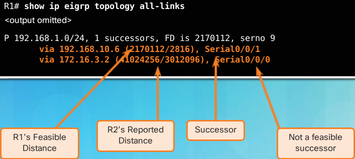

show ip eigrp topology all-links command shows all possible paths to a network, including successors, FSs, and even those routes that are not FSs. R1’s FD to 192.168.1.0/24 is 2,170,112 via the successor R3. For R2 to be considered a FS, it must meet the FC. R2’s RD to R1 to reach 192.168.1.0/24 must be less the R1’s current FD. Per the figure, R2’s RD is 3,012,096, which is higher than R1’s current FD of 2,170,112.

Even though R2 looks like a viable backup path to 192.168.1.0/24, R1 has no idea that the path is not a potential loop back through itself. EIGRP is a distance vector routing protocol, without the ability to see a complete, loop-free topological map of the network. DUAL’s method of guaranteeing that a neighbor has a loop-free path is that the neighbor’s metric must satisfy the FC. By ensuring that the RD of the neighbor is less than its own FD, the router can assume that this neighboring router is not part of its own advertised route; thus, always avoiding the potential for a loop.

R2 can be used as a successor if R3 fails; however, there is a longer delay before adding it to the routing table. Before R2 can be used as a successor, DUAL must do further processing.

DUAL Finite State Machine
-------------------------

.. image:: ../../../_static/img/6_eigrp_dual_fsm.png

debug eigrp fsm
^^^^^^^^^^^^^^^

.. image:: ../../../_static/img/6_eigrp_debug_eigrp_fsm.png

.. code::

   R2# show ip eigrp topology
   
   P 192.168.1.0/24, 1 successors, FD is 3012096
   Successor (R3)--> 	via 192.168.10.10 (3012096/2816), Serial0/0/1 
                    	via 172.16.3.1 (41024256/2170112), Serial0/0/0
                                         |
                                         ----> FS (R1)
   

.. code::

   R2# debug eigrp fsm
   EIGRP Finite State Machine debugging is on
   R2# conf t
   Enter configuration commands, one per line.  End with CNTL/Z.
   R2(config)# interface s 0/0/1
   R2(config-if)# shutdown
   
   EIGRP-IPv4(1):Find FS for dest 192.168.1.0/24. FD is 3012096 ,RD is 3012096 
    on tid 0
   DUAL: AS(1) Removing dest 172.16.1.0/24, nexthop 192.168.10.10
   DUAL: AS(1) RT installed 172.16.1.0/24 via 172.16.3.1
   
   R2(config-if)# end
   R2# undebug all

.. code::

   R2# show ip route
   
   D 192.168.1.0/24 [90/41024256] via 172.16.3.1, 00:15:51, Serial0/0/0
                                      |
                                      ----> New Successor (R1)

.. code::

   R2# show ip eigrp topology
   
   P 192.168.1.0/24, 1 successors, FD is 41024256 via 172.16.3.1 (41024256/2170112), Serial0/0/0
                                                                   |
                                                                   ---> Successor (R1)  No new feasible successor

If the link between R2 and R3 is made active again, then R3 returns as the successor and R1 once again becomes the FS

Comparing EIGRP for IPv4 and IPv6
---------------------------------

+----------------------------------+-----------------------------------------------------------------------+-------------------------------------------------------------------------------+
|                                  | EIGRP for IPv4                                                        | EIGRP for IPv6                                                                |
+==================================+=======================================================================+===============================================================================+
| Advertised Routes                | IPv4 networks                                                         | IPv6 prefixes                                                                 |
+----------------------------------+-----------------------------------------------------------------------+-------------------------------------------------------------------------------+
| Distance Vector                  | Yes                                                                   | Yes                                                                           |
+----------------------------------+-----------------------------------------------------------------------+-------------------------------------------------------------------------------+
| Convergence Technology           | DUAL                                                                  | DUAL                                                                          |
+----------------------------------+-----------------------------------------------------------------------+-------------------------------------------------------------------------------+
| Metric                           | Bandwidth and delay by default, reliability and load are optional     | Bandwidth and delay by default, reliability and load are optional             |
+----------------------------------+-----------------------------------------------------------------------+-------------------------------------------------------------------------------+
| Transport Protocol               | RTP                                                                   | RTP                                                                           |
+----------------------------------+-----------------------------------------------------------------------+-------------------------------------------------------------------------------+
| Update Messages                  | Incremental, partial, and bounded updates                             | Incremental, partial, and bounded updates                                     |
+----------------------------------+-----------------------------------------------------------------------+-------------------------------------------------------------------------------+
| Neighbor Discovery               | Hello packets                                                         | Hello packets                                                                 |
+----------------------------------+-----------------------------------------------------------------------+-------------------------------------------------------------------------------+
| Source and Destination Addresses | IPv4 source address and 224.0.0.10 IPv4 multicast destination address | IPv6 link-local source address and FF02::A IPv6 multicast destination address |
+----------------------------------+-----------------------------------------------------------------------+-------------------------------------------------------------------------------+
| Authentication                   | MD5, SHA256                                                           | MD5, SHA256                                                                   |
+----------------------------------+-----------------------------------------------------------------------+-------------------------------------------------------------------------------+
| Router ID                        | 32-bit router ID                                                      | 32-bit router ID                                                              |
+----------------------------------+-----------------------------------------------------------------------+-------------------------------------------------------------------------------+

+  Advertised routes 
    EIGRP for IPv4 advertises IPv4 networks; whereas, EIGRP for IPv6 advertises IPv6 prefixes.

+  Distance vector 
    Both EIGRP or IPv4 and IPv6 are advanced distance vector routing protocols. Both protocols use the same administrative distances.

+  Convergence technology 
    EIGRP for IPv4 and IPv6 both use the DUAL algorithm. Both protocols use the same DUAL techniques and processes, including successor, FS, FD, and RD.

+  Metric 
    Both EIGRP for IPv4 and IPv6 use bandwidth, delay, reliability, and load for their composite metric. Both routing protocols use the same composite metric and use only bandwidth and delay, by default.  

+  Transport protocol 
    The Reliable Transport Protocol (RTP) is responsible for guaranteed delivery of EIGRP packets to all neighbors for both protocols, EIGRP for IPv4 and IPv6.

+  Update messages 
    Both EIGRP for IPv4 and IPv6 send incremental updates when the state of a destination changes. The terms, partial and bounded, are used when referring to updates for both protocols.  

+  Neighbor discovery mechanism 
    EIGRP for IPv4 and EIGRP for IPv6 use a simple Hello mechanism to learn about neighboring routers and form adjacencies.

+  Source and destination addresses 
    EIGRP for IPv4 sends messages to the multicast address 224.0.0.10. These messages use the source IPv4 address of the outbound interface. EIGRP for IPv6 sends its messages to the multicast address FF02::A. EIGRP for IPv6 messages are sourced using the IPv6 link-local address of the exit interface.

+  Authentication 
    EIGRP for IPv4 and EIGRP for IPv6 use Message Digest 5 (MD5) authentication. Named EIGRP also supports the stronger SHA256 algorithm.

+  Router ID 
    Both EIGRP for IPv4 and EIGRP for IPv6 use a 32-bit number for the EIGRP router ID. The 32-bit router ID is represented in dotted-decimal notation and is commonly referred to as an IPv4 address. If the EIGRP for IPv6 router has not been configured with an IPv4 address, the eigrp router-id command must be used to configure a 32-bit router ID. The process for determining the router ID is the same for both EIGRP for IPv4 and IPv6.

EIGRP IPv6 Link-Local addresses
-------------------------------

EIGRP for IPv6 messages are sent using:

  Source IPv6 address
   This is the IPv6 link-local address of the exit interface.

  Destination IPv6 address 
   When the packet needs to be sent to a multicast address, it is sent to the IPv6 multicast address FF02::A, the all-EIGRP-routers with link-local scope. If the packet can be sent as a unicast address, it is sent to the link-local address of the neighboring router.

.. note:: IPv6 link-local addresses are in the FE80::/10 range. The /10 indicates that the first 10 bits are 1111 1110 10xx xxxx, which results in the first hextet having a range of 1111 1110 1000 0000 (FE80) to 1111 1110 1011 1111 (FEBF). 

EIGRP IPv6 configuration
------------------------

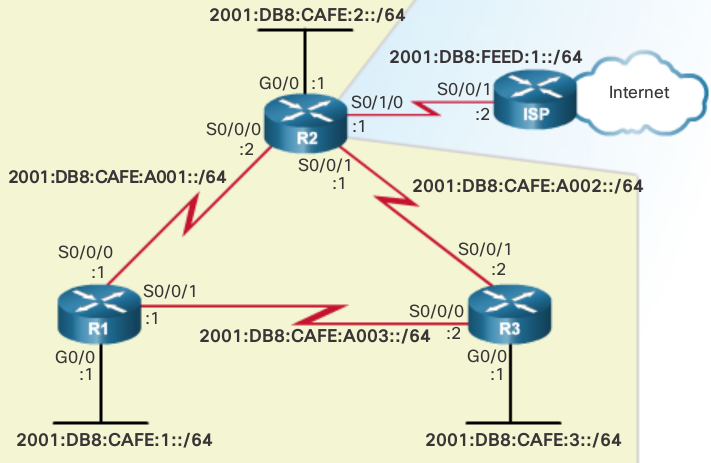

Only the IPv6 global unicast addresses have been configured on each router.

below are the starting interface configurations on each router. Notice the interface bandwidth values from the previous EIGRP for IPv4 configuration. Because EIGRP for IPv4 and IPv6 use the same metrics, modifying the bandwidth parameters influences both routing protocols. 

.. code::
   
   R1# show running-config
     
   !
   interface GigabitEthernet0/0
    ipv6 address 2001:DB8:CAFE:1::1/64
   !
   interface Serial0/0/0
    ipv6 address 2001:DB8:CAFE:A001::1/64
    clock rate 64000
   !
   interface Serial0/0/1
    ipv6 address 2001:DB8:CAFE:A003::1/64
   
   
   R2# show running-config
    
   !
   interface GigabitEthernet0/0
    ipv6 address 2001:DB8:CAFE:2::1/64
   !
   interface Serial0/0/0
    ipv6 address 2001:DB8:CAFE:A001::2/64
   !
   interface Serial0/0/1
    ipv6 address 2001:DB8:CAFE:A002::1/64
    clock rate 64000
   !
   interface Serial0/1/0
    ipv6 address 2001:DB8:FEED:1::1/64
   
   
   R3# show running-config
     
   !
   interface GigabitEthernet0/0
    ipv6 address 2001:DB8:CAFE:3::1/64
   !
   interface Serial0/0/0
    ipv6 address 2001:DB8:CAFE:A003::2/64
    clock rate 64000
   !         
   interface Serial0/0/1
    ipv6 address 2001:DB8:CAFE:A002::2/64

Configuring IPv6 Link-Locals
----------------------------

Link-local addresses are automatically created when an IPv6 global unicast address is assigned to the interface. Global unicast addresses are not required on an interface; however, IPv6 link-local addresses are.

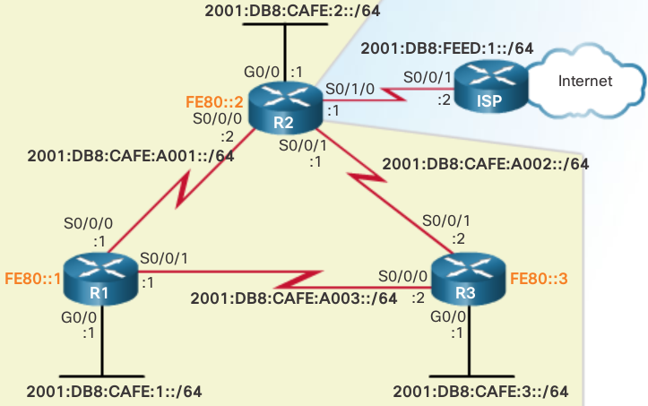

Unless configured manually, Cisco routers create the link-local address using **FE80::/10** prefix and the EUI-64 process. EUI-64 involves using the 48-bit Ethernet MAC address, inserting FFFE in the middle and flipping the seventh bit. **For serial interfaces, Cisco uses the MAC address of an Ethernet interface**. A router with several serial interfaces can assign the same link-local address to each IPv6 interface, because link-local addresses only need to be local on the link.

.. code::

   Router(config-if)# ipv6 address link-local-address link-local

.. note:: A link-local address has a prefix within the range FE80 to FEBF.

.. code::

   R1(config)# interface s 0/0/0
   R1(config-if)# ipv6 address fe80::1 ?
     link-local  Use link-local address
   
   R1(config-if)# ipv6 address fe80::1 link-local
   R1(config-if)# exit
   R1(config)# interface s 0/0/1
   R1(config-if)# ipv6 address fe80::1 link-local
   R1(config-if)# exit
   R1(config)# interface g 0/0
   R1(config-if)# ipv6 address fe80::1 link-local
   R1(config-if)#
   
   
   R2(config)# interface s 0/0/0
   R2(config-if)# ipv6 address fe80::2 link-local
   R2(config-if)# exit
   R2(config)# interface s 0/0/1
   R2(config-if)# ipv6 address fe80::2 link-local
   R2(config-if)# exit
   R2(config)# interface s 0/1/0
   R2(config-if)# ipv6 address fe80::2 link-local
   R2(config-if)# exit
   R2(config)# interface g 0/0
   R2(config-if)# ipv6 address fe80::2 link-local
   R2(config-if)#

Same IPv6 link-local address is configured on all interfaces

EIGRP IPv6 Routing Process
--------------------------

R1(config)# ipv6 router eigrp 2 
% IPv6 routing not enabled
R1(config)# ipv6 unicast-routing  
R1(config)# ipv6 router eigrp 2 
R1(config-rtr)#

R1(config)# ipv6 router eigrp 2
R1(config-rtr)# eigrp router-id 1.0.0.0
R1(config-rtr)#

R1(config)# ipv6 router eigrp 2 
% IPv6 routing not enabled
R1(config)# ipv6 unicast-routing  
R1(config)# ipv6 router eigrp 2 
R1(config-rtr)#

R2(config)# ipv6 unicast-routing 
R2(config)# ipv6 router eigrp 2  
R2(config-rtr)# eigrp router-id 2.0.0.0
R2(config-rtr)# no shutdown
R2(config-rtr)#

EIGRP for IPv6 uses a 32 bit value for the router ID. To obtain that value, EIGRP for IPv6 uses the same process as EIGRP for IPv4. The eigrp router-id command takes precedence over any loopback or physical interface IPv4 addresses. If an EIGRP for IPv6 router does not have any active interfaces with an IPv4 address, then the eigrp router-id command is required.

The router ID should be a unique 32-bit number in the EIGRP for IP routing domain; otherwise, routing inconsistencies can occur.

Note: The eigrp router-id command is used to configure the router ID for EIGRP. Some versions of IOS will accept the command router-id, without first specifying eigrp. The running-config, however, will display eigrp router-id regardless of which command is used.

**By default, the EIGRP for IPv6 process is in a shutdown state**. The no shutdown command is required to activate the EIGRP for IPv6 process, as shown in Figure 3. This command is not required for EIGRP for IPv4. Although, EIGRP for IPv6 is enabled, neighbor adjacencies and routing updates cannot be sent and received until EIGRP is activated on the appropriate interfaces.

Both the no shutdown command and a router ID are required for the router to form neighbor adjacencies.

Enabling EIGRP for IPv6 IF
--------------------------

.. code::

   R1(config)# interface g0/0
   R1(config-if)# ipv6 eigrp 2
   R1(config-if)# exit
   R1(config)# interface s 0/0/0
   R1(config-if)# ipv6 eigrp 2
   R1(config-if)# exit
   R1(config)# interface s 0/0/1
   R1(config-if)# ipv6 eigrp 2   
   R1(config-if)#
   

   R2(config)# interface g 0/0
   R2(config-if)# ipv6 eigrp 2
   R2(config-if)# exit
   R2(config)# interface s 0/0/0
   R2(config-if)# ipv6 eigrp 2 
   R2(config-if)# exit
   %DUAL-5-NBRCHANGE: EIGRP-IPv6 2: Neighbor FE80::1 
    (Serial0/0/0) is up: new adjacency
   R2(config)# interface s 0/0/1
   R2(config-if)# ipv6 eigrp 2    
   R2(config-if)#

Configure and Verify IPv6
^^^^^^^^^^^^^^^^^^^^^^^^^

.. code::

   R1(config)# ipv6 router eigrp 2
   R1(config-rtr)# passive-interface gigabitethernet 0/0
   R1(config-rtr)# end
   
   R1# show ipv6 protocols
   
   IPv6 Routing Protocol is "eigrp 2"
   EIGRP-IPv6 Protocol for AS(2)
    
   
     Interfaces:
       Serial0/0/0
       Serial0/0/1
       GigabitEthernet0/0 (passive)
    Redistribution:
       None
   R1#
   

IPv6 NB Table
-------------

.. image:: ../../../_static/img/6_eigrp_ipv6_nb_table.png

The column headers in the show ipv6 eigrp neighbors command output identify the following:
 
 + H
    Lists the neighbors in the order they were learned.
 
 + Address
    IPv6 link-local address of the neighbor.
 
 + Interface
    Local interface on which this Hello packet was received.
 
 + Hold
    Current hold time. When a Hello packet is received, this value is reset to the maximum hold time for that interface and then counts down to zero. If zero is reached, the neighbor is considered down.
 
 + Uptime
    Amount of time since this neighbor was added to the neighbor table.
 
 + SRTT and RTO
    Used by RTP to manage reliable EIGRP packets.
 
 + Queue Count
    Should always be zero. If it is more than zero, then EIGRP packets are waiting to be sent.
 
 + Sequence Number
    Used to track updates, queries, and reply packets.
 

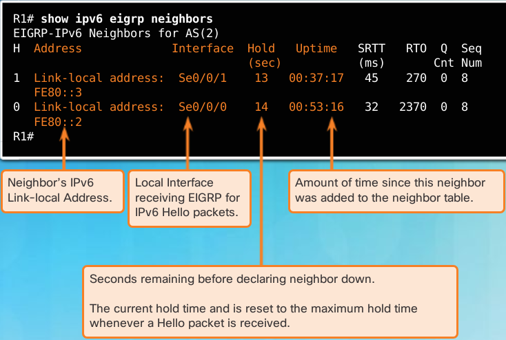

The show ipv6 eigrp neighbors command is useful for verifying and troubleshooting EIGRP for IPv6. If an expected neighbor is not listed, ensure that both ends of the link are up/up using the show ipv6 interface brief command. The same requirements exist for establishing neighbor adjacencies with EIGRP for IPv6 as it does for IPv4. If both sides of the link have active interfaces, check to see:

 + Are both routers configured with the same EIGRP autonomous system number?

 + Is the interface enabled for EIGRP for IPv6 with the correct autonomous system number?

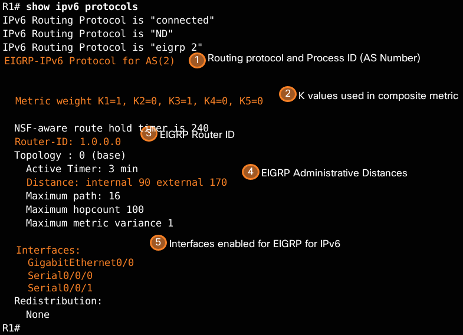

1. EIGRP for IPv6 is an active dynamic routing protocol on R1 configured with the autonomous system number 2.

2. These are the k values used to calculate the EIGRP composite metric. K1 and K3 are 1, by default, and K2, K4, and K5 are 0, by default.

3. The EIGRP for IPv6 router ID of R1 is 1.0.0.0.

4. Same as EIGRP for IPv4, EIGRP for IPv6 administrative distances have internal AD of 90 and external of 170 (default values).

5. The interfaces enabled for EIGRP for IPv6.

The output from the show ipv6 protocols command is useful in debugging routing operations. The Interfaces section shows which interfaces EIGRP for IPv6 have been enabled. This is useful in verifying that EIGRP is enabled on all of the appropriate interfaces with the correct autonomous system number.

EIGRP IPv6 Routing Table
------------------------

.. code::

   R1# show ipv6 route
   
   C   2001:DB8:CAFE:1::/64 [0/0]
        via GigabitEthernet0/0, directly connected
   L   2001:DB8:CAFE:1::1/128 [0/0]
        via GigabitEthernet0/0, receive
   D   2001:DB8:CAFE:2::/64 [90/3524096]
        via FE80::3, Serial0/0/1
   D   2001:DB8:CAFE:3::/64 [90/2170112]
        via FE80::3, Serial0/0/1
   C   2001:DB8:CAFE:A001::/64 [0/0]
        via Serial0/0/0, directly connected
   L   2001:DB8:CAFE:A001::1/128 [0/0]
        via Serial0/0/0, receive
   D   2001:DB8:CAFE:A002::/64 [90/3523840]
        via FE80::3, Serial0/0/1
   C   2001:DB8:CAFE:A003::/64 [0/0]
        via Serial0/0/1, directly connected
   L   2001:DB8:CAFE:A003::1/128 [0/0]
        via Serial0/0/1, receive
   L   FF00::/8 [0/0]
        via Null0, receive
   R1#

R1 has installed three EIGRP routes to remote IPv6 networks in its IPv6 routing table:

 + 2001:DB8:CAFE:2::/64 via R3 (FE80::3) using its Serial 0/0/1 interface

 + 2001:DB8:CAFE:3::/64 via R3 (FE80::3) using its Serial 0/0/1 interface

 + 2001:DB8:CAFE:A002::/64 via R3 (FE80::3) using its Serial 0/0/1 interface

All three routes are using router R3 as the next-hop router (successor). Notice that the routing table uses the link-local address as the next-hop address. Because each router has had all its interfaces configured with a unique and distinguishable link-local address, it is easy to recognize that the next-hop router via FE80::3 is router R3.

display the IPv6 routing table for R2.

.. code::

   R2# show ipv6 route
   
   D   2001:DB8:CAFE:1::/64 [90/3524096]
        via FE80::3, Serial0/0/1
   C   2001:DB8:CAFE:2::/64 [0/0]
        via GigabitEthernet0/0, directly connected
   L   2001:DB8:CAFE:2::1/128 [0/0]
        via GigabitEthernet0/0, receive
   D   2001:DB8:CAFE:3::/64 [90/3012096]
        via FE80::3, Serial0/0/1
   C   2001:DB8:CAFE:A001::/64 [0/0]
        via Serial0/0/0, directly connected
   L   2001:DB8:CAFE:A001::2/128 [0/0]
        via Serial0/0/0, receive
   C   2001:DB8:CAFE:A002::/64 [0/0]
        via Serial0/0/1, directly connected
   L   2001:DB8:CAFE:A002::1/128 [0/0]
        via Serial0/0/1, receive
   D   2001:DB8:CAFE:A003::/64 [90/3523840]
        via FE80::3, Serial0/0/1
   C   2001:DB8:FEED:1::/64 [0/0]
        via Loopback6, directly connected
   L   2001:DB8:FEED:1::1/128 [0/0]
        via Loopback6, receive
   L   FF00::/8 [0/0]
        via Null0, receive
   R2# 

display the routing table for R3. Notice that R3 has two equal cost paths to the 2001:DB8:CAFE:A001::/64. One path is via R1 at FE80::1 and the other path is via R2 at FE80::2.

.. code::

   R3# show ipv6 route
   
   D   2001:DB8:CAFE:1::/64 [90/2170112]
        via FE80::1, Serial0/0/0
   D   2001:DB8:CAFE:2::/64 [90/3012096]
        via FE80::2, Serial0/0/1
   C   2001:DB8:CAFE:3::/64 [0/0]
        via GigabitEthernet0/0, directly connected
   L   2001:DB8:CAFE:3::1/128 [0/0]
        via GigabitEthernet0/0, receive
   D   2001:DB8:CAFE:A001::/64 [90/41024000]
        via FE80::1, Serial0/0/0
        via FE80::2, Serial0/0/1
   C   2001:DB8:CAFE:A002::/64 [0/0]
        via Serial0/0/1, directly connected
   L   2001:DB8:CAFE:A002::2/128 [0/0]
        via Serial0/0/1, receive
   C   2001:DB8:CAFE:A003::/64 [0/0]
        via Serial0/0/0, directly connected
   L   2001:DB8:CAFE:A003::2/128 [0/0]
        via Serial0/0/0, receive
   L   FF00::/8 [0/0]
        via Null0, receive
   R3#

EIGRP for IPv6 lab demo
-----------------------

Configuration EIGRP IPv6
^^^^^^^^^^^^^^^^^^^^^^^^

1. Enable IPv6 routing on the routers.

   .. code::

      R1(config)# ipv6 unicast-routing 

2. Assign a router ID to each router. 

   a. To begin the EIGRP for IPv6 routing configuration process, issue the ipv6 router eigrp 1 command, where 1 is the AS number.

      .. code::

         R1(config)# ipv6 router eigrp 1

   b. EIGRP for IPv6 requires a 32-bit address for the router ID. Use the eigrp r outer-i d command to configure the router ID in the router configuration mode.
      
      .. code::

         R1(config)# ipv6 router eigrp 1
         R1(config-rtr)# eigrp router-id 1.1.1.1
         R2(config)# ipv6 router eigrp 1 
         R2(config-rtr)# eigrp router-id 2.2.2.2
         R3(config)# ipv6 router eigrp 1 
         R3(config-rtr)# eigrp router-id 3.3.3.3

3. Enable EIGRP for IPv6 routing on each router

   The IPv6 routing process is shut down by default. Issue the no shutdown command to enable EIGRP for IPv6 routing on all routers. 

   .. code::

      R1(config)# ipv6 router eigrp 1
      R1(config-rtr)# no shutdown
      R2(config)# ipv6 router eigrp 1
      R2(config-rtr)# no shutdown
      R3(config)# ipv6 router eigrp 1
      R3(config-rtr)# no shutdown

4. Configure EIGRP for IPv6 using AS 1 on the Serial and Gigabit Ethernet interfaces on the routers. 

   a. Issue the ipv6 eigrp 1 command on the interfaces that participate in the EIGRP routing process. The AS number is 1 as assigned in Step 2. The configuration for R1 is displayed below as an example.

      .. code::

         R1(config)# interface g0/0
         R1(config-if)# ipv6 eigrp 1
         R1(config-if)# interface s0/0/0
         R1(config-if)# ipv6 eigrp 1
         R1(config-if)# interface s0/0/1
         R1(config-if)# ipv6 eigrp 1

   b. Assign EIGRP participating interfaces on R2 and R3. You will see neighbor adjacency messages as interfaces are added to the EIGRP routing process. The messages on R1 are displayed below as an example.

      .. code::

         R1(config-if)#
         *Apr 12 00:25:49.183: %DUAL-5-NBRCHANGE: EIGRP-IPv6 1: Neighbor FE80::2 (Serial0/0/0) is up: new adjacency 
         *Apr 12 00:26:15.583: %DUAL-5-NBRCHANGE: EIGRP-IPv6 1: Neighbor FE80::3 (Serial0/0/1) is up: new adjacency 
         What address is used to indicate the neighbor in the adjacency messages? 

Verify EIGRP IPv6 Routing
^^^^^^^^^^^^^^^^^^^^^^^^^

1. Examine the neighbor adjacencies. 

   On R1, issue the show ipv6 eigrp neighbors command to verify that the adjacency has been established with its neighboring routers. The link-local addresses of the neighboring routers are displayed in the adjacency table. 

   .. code::

      R1# show ipv6 eigrp neighbors
      EIGRP-IPv6 Neighbors for AS(1) 
      H   Address				 Interface 		Hold   Uptime   SRTT  RTO  Q  Seq 
      						    			(sec)		    (ms)      Cnt Num 
      1   Link-local address:  Se0/0/1          13   00:02:42   1   100  0  7 
          FE80::3
      0   Link-local address:  Se0/0/0 	      13   00:03:09   12  100  0  9 
          FE80::2

2. Examine the IPv6 EIGRP routing table. 

   Use the show ipv6 route eigrp command to display IPv6 specific EIGRP routes on all the routers. 

   .. code::

      R1# show ipv6 route eigrp
      IPv6 Routing Table - default - 10 entries
      Codes: C - Connected, L - Local, S - Static, U - Per-user Static route 
      	   B - BGP, R - RIP, I1 - ISIS L1, I2 - ISIS L2 
      	   IA - ISIS interarea, IS - ISIS summary, D - EIGRP, EX - EIGRP external 
      	   ND - ND Default, NDp - ND Prefix, DCE - Destination, NDr - Redirect 
      	   O - OSPF Intra, OI - OSPF Inter, OE1 -  OSPF ext 1, OE2 - OSPF ext 2 
      	   ON1 - OSPF NSSA ext 1, ON2 - OSPF NSSA ext 2 
      D   2001:DB8:ACAD:B::/64 [90/2172416] 
      via FE80::2, Serial0/0/0 
      D   2001:DB8:ACAD:C::/64 [90/2172416] 
      via FE80::3, Serial0/0/1 
      D   2001:DB8:ACAD:23::/64 [90/2681856] 
      via FE80::2, Serial0/0/0 
      via FE80::3, Serial0/0/1 

3. Examine the EIGRP topology. 

   .. code::

      R1# show ipv6 eigrp topology
      EIGRP-IPv6 Topology Table for AS(1)/ID(1.1.1.1) 
      Codes: P - Passive, A - Active, U - Update, Q - Query, R - Reply,
      	   r - reply Status, s - sia Status 
      
      P 2001:DB8:ACAD:A::/64, 1 successors, FD is 28160 
      		via Connected, GigabitEthernet0/0 
      P 2001:DB8:ACAD:C::/64, 1 successors, FD is 2172416 
      		via FE80::3 (2172416/28160), Serial0/0/1 
      P 2001:DB8:ACAD:12::/64, 1 successors, FD is 2169856 
      		via Connected, Serial0/0/0 
      P 2001:DB8:ACAD:B::/64, 1 successors, FD is 2172416 
      		via FE80::2 (2172416/28160), Serial0/0/0 
      P 2001:DB8:ACAD:23::/64, 2 successors, FD is 2681856 
      		via FE80::2 (2681856/2169856), Serial0/0/0 
      		via FE80::3 (2681856/2169856), Serial0/0/1 
      P 2001:DB8:ACAD:13::/64, 1 successors, FD is 2169856 
      		via Connected, Serial0/0/1 

4. Verify the parameters and current state of the active IPv6 routing protocol processes. 

   Issue the ``show ipv6 protocols`` command to verify the configured parameter. From the output, EIGRP is the configured IPv6 routing protocol with 1.1.1.1 as the router ID for R1. This routing protocol is associated with autonomous system 1 with three active interfaces: G0/0, S0/0/0, and S0/0/1. 

   .. code::

      R1# show ipv6 protocols
      IPv6 Routing Protocol is "connected" 
      IPv6 Routing Protocol is "ND" 
      IPv6 Routing Protocol is "eigrp 1" 
      EIGRP-IPv6 Protocol for AS(1) 
        Metric weight K1=1, K2=0, K3=1, K4=0, K5=0 
        NSF-aware route hold timer is 240 
        Router-ID: 1.1.1.1 
        Topology : 0 (base) 
          Active Timer: 3 min 
          Distance: internal 90 external 170 
          Maximum path: 16
          Maximum hopcount 100 
          Maximum metric variance 1 
      
        Interfaces:
          GigabitEthernet0/0 
          Serial0/0/0
          Serial0/0/1
        Redistribution:
          None 
      

Configure n Verify Passive IFs
^^^^^^^^^^^^^^^^^^^^^^^^^^^^^^

A passive interface does not allow outgoing and incoming routing updates over the configured interface. The ``passive-interface interface`` command causes the router to stop sending and receiving Hello packets over an interface. 

1. Configure interface G0/0 as passive on R1 and R2.

   .. code::

      R1(config)# ipv6 router eigrp 1
      R1(config-rtr)# passive-interface g0/0 
      R2(config)# ipv6 router eigrp 1
      R2(config-rtr)# passive-interface g0/0 

2. Verify the passive interface configuration

   Issue the ``show ipv6 protocols`` command on R1 and verify that G0/0 has been configured as passive.

    .. code::

       R1# show ipv6 protocols
       IPv6 Routing Protocol is "connected" 
       IPv6 Routing Protocol is "ND" 
       IPv6 Routing Protocol is "eigrp 1" 
       EIGRP-IPv6 Protocol for AS(1) 
         Metric weight K1=1, K2=0, K3=1, K4=0, K5=0 
         NSF-aware route hold timer is 240 
         Router-ID: 1.1.1.1
         Topology : 0 (base) 
           Active Timer: 3 min 
           Distance: internal 90 external 170 
           Maximum path: 16
           Maximum hopcount 100 
           Maximum metric variance 1 
       
         Interfaces:
           Serial0/0/0
           Serial0/0/1
           GigabitEthernet0/0 (passive) 
         Redistribution:
           None

3. Configure the G0/0 passive IF on R3

If a few interfaces are configured as passive, use the ``passive-interface default`` command to configure all the interfaces on the router as passive. Use the ``no passive-interface interface`` command to allow EIGRP Hello messages in and out of the router interface. 
   
   a. Configure all interfaces as passive on R3.

      .. code::

         R3(config)# ipv6 router eigrp 1
         R3(config-rtr)# passive-interface default
         R3(config-rtr)#
         * Apr 13 00:07:03.267: %DUAL-5-NBRCHANGE: EIGRP-IPv6 1: Neighbor FE80::1 (Serial0/0/0) is down: interface passive 
         * Apr 13 00:07:03.267: %DUAL-5-NBRCHANGE: EIGRP-IPv6 1: Neighbor FE80::2 (Serial0/0/1) is down: interface passive 

   b. After you have issued the ``passive-interface default`` command, R3 no longer participates in the routing process. What command can you use to verify it?

      show ipv6 route eigrp or show ipv6 route

      .. code::

         R3# show ipv6 route eigrp
         IPv6 Routing Table - default - 7 entries
         Codes: C - Connected, L - Local, S - Static, U - Per-user Static route
                B - BGP, R - RIP, I1 - ISIS L1, I2 - ISIS L2
                IA - ISIS interarea, IS - ISIS summary, D - EIGRP, EX - EIGRP external
                ND - ND Default, NDp - ND Prefix, DCE - Destination, NDr - Redirect
                O - OSPF Intra, OI - OSPF Inter, OE1 - OSPF ext 1, OE2 - OSPF ext 2
                ON1 - OSPF NSSA ext 1, ON2 - OSPF NSSA ext 2

   c. What command can you use to display the passive interfaces on R3?

   d. Configure the serial interfaces to participate in the routing process.

      .. code::

         R3(config)# ipv6 router eigrp 1
         R3(config-rtr)# no passive-interface s0/0/0
         R3(config-rtr)# no passive-interface s0/0/1
         R3(config-rtr)#
          Apr 13 00:21:23.807: %DUAL-5-NBRCHANGE: EIGRP-IPv6 1: Neighbor FE80::1 (Serial0/0/0) is up: new adjacency
          Apr 13 00:21:25.567: %DUAL-5-NBRCHANGE: EIGRP-IPv6 1: Neighbor FE80::2 (Serial0/0/1) is up: new adjacency

   e. The neighbor relationships have been established again with R1 and R2. Verify that only G0/0 has been configured as passive. What command do you use to verify the passive interface?

Reflection
^^^^^^^^^^

1. Where would you configure passive interfaces?  Why?

2. What are some advantages with using EIGRP as the routing protocol in your network?

Summary Route Null0 IF
----------------------

A problem associated with automatic route summarization is that a summary address also advertises networks which are not available on the advertising router. For instance, R1 is advertising the summary address of 172.16.0.0/16 but it is really only connected to the 172.16.1.0/24, 172.16.2.0/24, and 172.16.3.0/30 subnets. Therefore, R1 may receive incoming packets to destinations that do not exist. This could be a problem if R1 had a default gateway configured, as it would in turn forward a request to a destination that does not exist.

EIGRP avoids this problem by adding a network route for the classful network route to the routing table. This network entry routes packets to a Null interface. The Null0 interface, commonly known as "the bit bucket", is a virtual IOS interface that is a route to nowhere. Packets that match a route with a Null0 exit interface are discarded.

Automatic summarization disabled
^^^^^^^^^^^^^^^^^^^^^^^^^^^^^^^^

.. code::

   R3# show ip route eigrp 
   
    172.16.0.0/16 is variably subnetted, 3 subnets, 2 masks 
   D 172.16.1.0/24 [90/2170112] via 192.168.10.5, 
                   02:21:10, Serial0/0/0 
   D 172.16.2.0/24 [90/3012096] via 192.168.10.9, 
                   02:21:10, Serial0/0/1 
   D 172.16.3.0/30 [90/41024000] via 192.168.10.9, 
                   02:21:10, Serial0/0/1 
                   [90/41024000] via 192.168.10.5, 
                   02:21:10, Serial0/0/0 
   R3#

Automatic summarization enabled
^^^^^^^^^^^^^^^^^^^^^^^^^^^^^^^

.. note:: it is recommended to disable the default of auto summary immediately

image below is an example of R2 thinking it needs to do equal cost LB due to clasfull boundary summarization of 10.0.0.0/8 NWs on R1 and R3 who then advertize the summarized route to R2

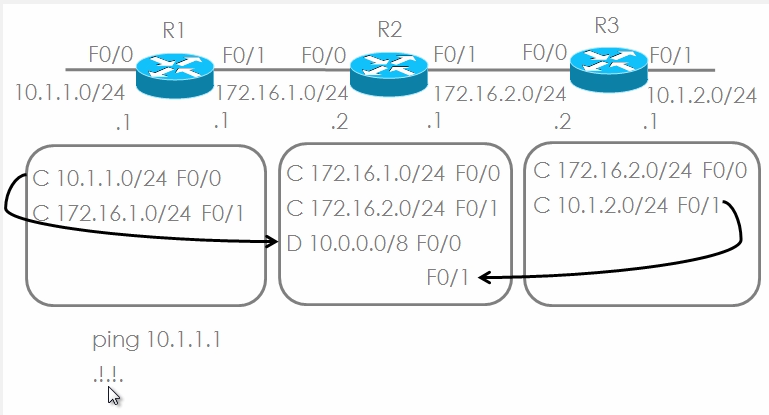

so to fix this you need to type router eigrp #as followed by ``Rx(router-config) no auto-summary``

.. note:: null0 in the routing table shows auto summary is enabled

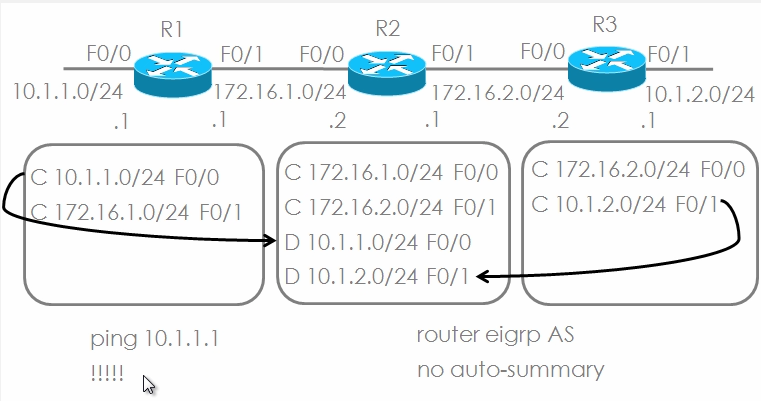

.. code::

   R1# show ip route 
    
     172.16.0.0/16 is variably subnetted, 6 subnets, 4 masks 
   D  172.16.0.0/16 is a summary, 00:03:06, Null0 
   C  172.16.1.0/24 is directly connected, GigabitEthernet0/0 
   L  172.16.1.1/32 is directly connected, GigabitEthernet0/0 
   D  172.16.2.0/24 [90/40512256] via 172.16.3.2, 00:02:52, Serial0/0/0 
   C  172.16.3.0/30 is directly connected, Serial0/0/0 
   L  172.16.3.1/32 is directly connected, Serial0/0/0 
   D  192.168.1.0/24 [90/2170112] via 192.168.10.6, 00:02:51, Serial0/0/1 
      192.168.10.0/24 is variably subnetted, 4 subnets, 3 masks 
   D  192.168.10.0/24 is a summary, 00:02:52, Null0 
   C  192.168.10.4/30 is directly connected, Serial0/0/1 
   D  192.168.10.8/30 [90/3523840] via 192.168.10.6, 00:02:59, Serial0/0/1 
   R1# 

summary routes for 172.16.0.0/16 and 192.168.10.0/24 to Null0. If R1 receives a packet destined to a network that is advertised by the classful mask but does not exist, it will discard the packet and send a notification message back to the source.

EIGRP for IPv4 automatically includes a Null0 summary route whenever the following conditions exist:
 + Automatic summarization is enabled.

 + There is at least one subnet that was learned via EIGRP.

 + There are two or more network EIGRP router configuration mode commands.

.. code::

   R1# show ip route 
    
     172.16.0.0/16 is variably subnetted, 6 subnets, 4 masks 
   D  172.16.0.0/16 is a summary, 00:03:06, Null0 
   C  172.16.1.0/24 is directly connected, GigabitEthernet0/0 
   L  172.16.1.1/32 is directly connected, GigabitEthernet0/0 
   D  172.16.2.0/24 [90/40512256] via 172.16.3.2, 00:02:52, Serial0/0/0 
   C  172.16.3.0/30 is directly connected, Serial0/0/0 
   L  172.16.3.1/32 is directly connected, Serial0/0/0 
   D  192.168.1.0/24 [90/2170112] via 192.168.10.6, 00:02:51, Serial0/0/1 
      192.168.10.0/24 is variably subnetted, 4 subnets, 3 masks 
   D  192.168.10.0/24 is a summary, 00:02:52, Null0 
   C  192.168.10.4/30 is directly connected, Serial0/0/1 
   D  192.168.10.8/30 [90/3523840] via 192.168.10.6, 00:02:59, Serial0/0/1 
   R1# 

Summarization Routing Loops
---------------------------

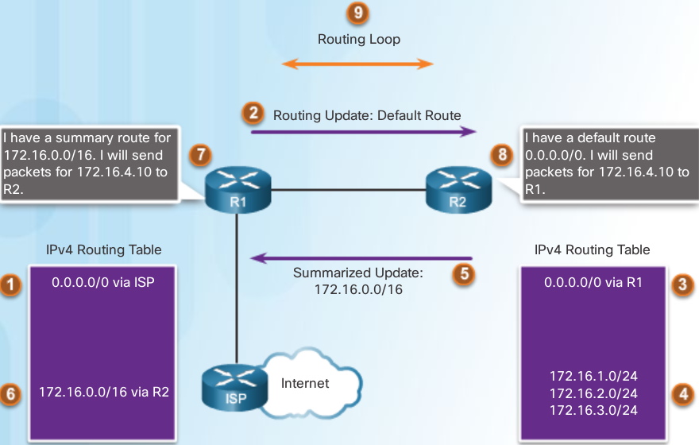

1. R1 has a default route, 0.0.0.0/0 via the ISP router.

2. R1 sends a routing update to R2 containing the default route.

3. R2 installs the default route from R1 in its IPv4 routing table.

4. R2’s routing table contains the 172.16.1.0/24, 172.16.2.0/24, and 172.16.3.0/24 subnets in its routing table.

5. R2 sends a summarized update to R1 for the 172.16.0.0/16 network.

6. R1 installs the summarized route for 172.16.0.0/16 via R2.

7. R1 receives a packet for 172.16.4.10. Because R1 has a route for 172.16.0.0/16 via R2, it forwards the packet to R2.

8. R2 receives the packet with the destination address 172.16.4.10 from R1. The packet does not match any specific route so using the default route in its routing table R2 forwards the packet back to R1.

9. The packet for 172.16.4.10 loops between R1 and R2 until the TTL expires and the packet is dropped.

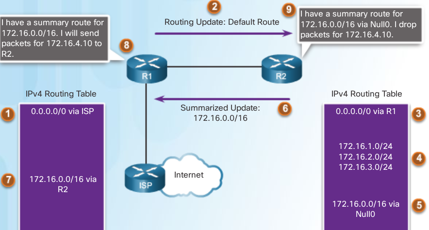

Even if R2 has a default route of 0.0.0.0/0 in its routing table, the Null0 route is a longer match.

.. note:: The Null0 summary route is removed when autosummarization is disabled using the no auto-summary router configuration mode command.

propagating a default route
---------------------------

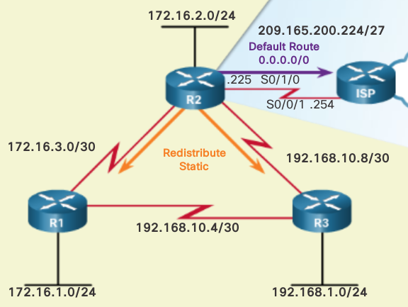

.. code::

   R2(config)# ip route 0.0.0.0 0.0.0.0 serial 0/1/0
   R2(config)# router eigrp 1
   R2(config-router)# redistribute static

   verify with
   R2# show ip protocols
   Redistributing: static

default routes ipv6
-------------------

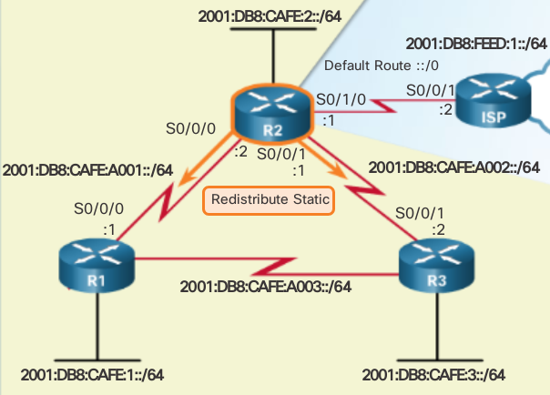

.. code::

   R2(config)# ipv6 route ::/0 serial 0/1/0
   R2(config)# ipv6 router eigrp 2
   R2(config-rtr)# redistribute static

.. code::

   R1# show ipv6 route
   IPv6 Routing Table - default - 12 entries
   Codes:  C - Connected, L - Local, S - Static,
   	U - Per-user Static route
   	B - BGP, R - RIP, I1 - ISIS L1, I2 - ISIS L2
   	IA - ISIS interarea, IS - ISIS summary, D - EIGRP, EX - EIGRP external
   	ND - ND Default, NDp - ND Prefix, DCE - Destination, NDr - Redirect
   	O - OSPF Intra, OI - OSPF Inter, OE1 - OSPF ext 1, OE2 - OSPF ext 2
   	ON1 - OSPF NSSA ext 1, ON2 - OSPF NSSA ext 2
   EX ::/0 [170/3523840]
   	via FE80::3, Serial0/0/1

tuning bandwidth
----------------

Router(config-if)# ``ip bandwidth-percent eigrp as-number percent``
Router(config-if)# ``ipv6 bandwidth-percent eigrp as-number percent``

.. code::

   R2(config)# interface serial 0/0/0        
   R2(config-if)# ipv6 bandwidth-percent eigrp 2 40
   R2(config-if)# 

tuning hello n hold timers
--------------------------

default 1.544 Mbps = 60s hello 180s hold
default greater    =  5s hello  15s hold

.. code::

   R1(config)# interface s0/0/0
   R1(config-if)# ip hello-interval eigrp 1 50
   R1(config-if)# ip hold-time eigrp 1 150
   
   R1(config)# inter serial 0/0/0
   R1(config-if)# ipv6 hello-interval eigrp 2 50
   R1(config-if)# ipv6 hold-time eigrp 2 150

use the ``show ip eigrp interfaces detail`` command to view the hello interval and hold timer for EIGRP.

R2# show ip eigrp interfaces detail

load balancing
--------------

Cisco IOS, by default, allows load balancing using up to ``four equal-cost paths``; however, this can be modified. Using the maximum-paths router configuration mode command, ``up to 32 equal-cost routes can be kept in the routing table``

Unequal-Cost Load Balancing
^^^^^^^^^^^^^^^^^^^^^^^^^^^

.. image:: ../../../_static/img/6_eigrp_variance_example.png

.. note::  variance condition is met. However the link between R5 and R3 has an AD of 25 and that AD is bigger than the FS of 20 so this route cannot take part in the unequal cost load balancing!

EIGRP for IPv4 and IPv6 can also balance traffic across multiple routes that have different metrics. This type of balancing is called unequal-cost load balancing.
Setting a value using the ``variance`` command in router configuration mode enables EIGRP to install multiple loop-free routes with unequal cost in a local routing table.

A route learned through EIGRP must meet two criteria to be installed in the local routing table:
 The route must be loop-free, being either a feasible successor or having a reported distance that is less than the total distance.
 The metric of the route must be lower than the metric of the best route (the successor) multiplied by the variance configured on the router.

.. note:: if the variance is set to 1, only routes with the same metric as the successor are installed in the local routing table. If the variance is set to 2, any EIGRP-learned route with a metric less than 2 times the successor metric will be installed in the local routing table.

.. note:: To control how traffic is distributed among routes when there are multiple routes for the same destination network that have different costs, use the ``traffic-share balanced`` command. Traffic is then distributed proportionately to the ratio of the costs. 

.. code::

   R3(config-router)# maximum-paths 4

   to see what maximum path is
   R3# show ip protocols

.. note:: maximum-paths 1 = LB is disabled

.. note:: you will see 1 route with 2 via statements when load balancing in the routing table

#. create a keychain
   - group of possible keys
#. Assign a key ID to each key (both sides need same combo)
#. Configure a key string
#. Optionally specify the duration the key is valid
#. Enable MD5 authentication on the interface
#. Specify what keychain the interface will use

.. code::

   R1(config)# key chain R1keychain
   R1(config-keychain) key 1
   both passphrase and key id will be hashed!
   R1(config-keychain-key)# key-string password
   R1(config-keychain-key)# interface S1/0
   R1(config-if)# ip authentication mode eigrp 100 md5
   R1(config-if)# ip authentication key-chain eigrp 100 R1keychain
   repeat on R2 with same key 1 and passphrase password
   
   R1# show key chain
   key-chain R1keychain:
       key 1 -- text "password"
           accept lifetime (always valid) - (always valid) [valid now] 
           send lifetime (always valid) - (always valid) [valid now] 
   

exercise example for ipv4 No1
-----------------------------

.. image:: ../../../_static/img/6_eigrp_exercise_example_ipv4_1.png

+--------+--------------+---------------+-----------------+-----------------+
| Device | Interface    | IP Address    | Subnet Mask     | Default Gateway |
+========+==============+===============+=================+=================+
| R1     | G0/0         | 192.168.1.1   | 255.255.255.0   | N/A             |
+--------+--------------+---------------+-----------------+-----------------+
|        | S0/0/0 (DCE) | 192.168.12.1  | 255.255.255.252 | N/A             |
+--------+--------------+---------------+-----------------+-----------------+
|        | S0/0/1       | 192.168.13.1  | 255.255.255.252 | N/A             |
+--------+--------------+---------------+-----------------+-----------------+
|        | Lo1          | 192.168.11.1  | 255.255.255.252 | N/A             |
+--------+--------------+---------------+-----------------+-----------------+
|        | Lo5          | 192.168.11.5  | 255.255.255.252 | N/A             |
+--------+--------------+---------------+-----------------+-----------------+
|        | Lo9          | 192.168.11.9  | 255.255.255.252 | N/A             |
+--------+--------------+---------------+-----------------+-----------------+
|        | Lo13         | 192.168.11.13 | 255.255.255.252 | N/A             |
+--------+--------------+---------------+-----------------+-----------------+
| R2     | G0/0         | 192.168.2.1   | 255.255.255.0   | N/A             |
+--------+--------------+---------------+-----------------+-----------------+
|        | S0/0/0       | 192.168.12.2  | 255.255.255.252 | N/A             |
+--------+--------------+---------------+-----------------+-----------------+
|        | S0/0/1 (DCE) | 192.168.23.1  | 255.255.255.252 | N/A             |
+--------+--------------+---------------+-----------------+-----------------+
|        | Lo1          | 192.168.22.1  | 255.255.255.252 | N/A             |
+--------+--------------+---------------+-----------------+-----------------+
| R3     | G0/0         | 192.168.3.1   | 255.255.255.0   | N/A             |
+--------+--------------+---------------+-----------------+-----------------+
|        | S0/0/0 (DCE) | 192.168.13.2  | 255.255.255.252 | N/A             |
+--------+--------------+---------------+-----------------+-----------------+
|        | S0/0/1       | 192.168.23.2  | 255.255.255.252 | N/A             |
+--------+--------------+---------------+-----------------+-----------------+
|        | Lo1          | 192.168.33.1  | 255.255.255.252 | N/A             |
+--------+--------------+---------------+-----------------+-----------------+
|        | Lo5          | 192.168.33.5  | 255.255.255.252 | N/A             |
+--------+--------------+---------------+-----------------+-----------------+
|        | Lo9          | 192.168.33.9  | 255.255.255.252 | N/A             |
+--------+--------------+---------------+-----------------+-----------------+
|        | Lo13         | 192.168.33.13 | 255.255.255.252 | N/A             |
+--------+--------------+---------------+-----------------+-----------------+
| PC-A   | NIC          | 192.168.1.3   | 255.255.255.0   | 192.168.1.1     |
+--------+--------------+---------------+-----------------+-----------------+
| PC-B   | NIC          | 192.168.2.3   | 255.255.255.0   | 192.168.2.1     |
+--------+--------------+---------------+-----------------+-----------------+
| PC-C   | NIC          | 192.168.3.3   | 255.255.255.0   | 192.168.3.1     |
+--------+--------------+---------------+-----------------+-----------------+

Objectives
 1. Build the Network and Configure Basic Device Settings
 2. Configure EIGRP and Verify Connectivity
 3. Configure EIGRP for Automatic Summarization
 4. Configure and Propagate a Default Static Route
 5. Fine-Tune EIGRP
    + Configure bandwidth utilization for EIGRP 
    + Configure the hello interval and hold timer for EIGRP

.. note:: The bandwidth command only affect s the EIGRP metric calculation, not the actual bandwi dth of the serial link

.. code::

   Router R1
   
   R1(config)# router eigrp 1
   R1(config-router)# network 192.168.1.0
   R1(config-router)# network 192.168.12.0 0.0.0.3
   R1(config-router)# network 192.168.13.0 0.0.0.3 
   R1(config-router)# network 192.168.11.0 0.0.0.3 
   R1(config-router)# network 192.168.11.4 0.0.0.3 
   R1(config-router)# network 192.168.11.8 0.0.0.3 
   R1(config-router)# network 192.168.11.12 0.0.0.3 
   R1(config-router)# passive-interface g0/0
   R1(config-router)# auto-summary
   R1(config)# int s0/0/0
   R1(config-if)# bandwidth 1024 
   R1(config-if)# ip bandwidth-percent eigrp 1 75 
   R1(config-if)# ip hello-interval eigrp 1 60
   R1(config-if)# ip hold- time eigrp 1 180
   R1(config-if)# int s0/0/1
   R1(config-if)# bandwidth 64 
   R1(config-if)# ip bandwidth-percent eigrp 1 40 
   R1(config-if)# ip hello-interval eigrp 1 60
   R1(config-if)# ip hold-time eigrp 1 180

.. code:: 

   Router R2
   
   R2(config)# router eigrp 1
   R2(config-router)# network 192.168.2.0
   R2(config-router)# network 192.168.12.0 0.0.0.3
   R2(config-router)# network 192.168.23.0 0.0.0.3
   R2(config-router)# passive-interface g0/0 
   R2(config-router)# redistribute static
   R2(config)# int s0/0/0
   R2(config-if)# bandwidth 1024 
   R2(config-if)# ip bandwidth-percent eigrp 1 75 
   R2(config-if)# ip hello-interval eigrp 1 60
   R2(config-if)# ip hold-time eigrp 1 180
   R2(config-if)# int s0/0/1
   R2(config-if)# ip hello-interval eigrp 1 60
   R2(config-if)# ip hold-time eigrp 1 180

.. code::

   Router R3
   
   R3(config)# router eigrp 1
   R3(config-router)# network 192.168.3.0
   R3(config-router)# network 192.168.13.0 0.0.0.3
   R3(config-router)# network 192.168.23.0 0.0.0.3 
   R3(config-router)# network 192.168.33.0 0.0.0.3 
   R3(config-router)# network 192.168.33.4 0.0.0.3 
   R3(config-router)# network 192.168.33.8 0.0.0.3 
   R3(config-router)# network 192.168.33.12 0.0.0.3
   R3(config-router)# passive-interface g0/0 
   R3(config-router)# auto-summary
   R3(config)# int s0/0/0
   R3(config-if)# bandwidth 64 
   R3(config-if)# ip bandwidth-percent eigrp 1 40 
   R3(config-if)# ip hello-interval eigrp 1 60
   R3(config-if)# ip hold-time eigrp 1 180 
   R3(config-if)# int s0/0/1
   R3(config-if)# ip hello-interval eigrp 1 60
   R3(config-if)# ip hold-time eigrp 1 180 

Commands
--------

show ip eigrp topology

 - passive state = nw's are functioning and maintaining active adjacency with eg R1
 - active state = actively looking for a replacement route to that network

Disable automatic summarizationThe topology contains discontiguous networks. Therefore, disable automatic summarization on each router.

.. note:: A Discontiguous Network topology is where you have some network (perhaps network 172.16.0.0) that is divided in two parts (perhaps 172.16.0.0 through 172.16.100.0 and 172.16.101.0 through 172.16.200.0) and to go from one part to the other part you must go through some other different network (perhaps 192.168.1.0).

.. code::

   R1(config-router)# no auto-summary

.. note:: Prior to IOS 15 auto-summary had to be manually disabled. 

.. code::

   R(config)# router eigrp autonomous-system
   R(config)# no router eigrp autonomous-system
   R# show ip eigrp neighbors
   R# show ip eigrp topology
   R# show ip protocols
   R2# show running-config | section eigrp 1
   R1(config-router)# passive-interface gigabitethernet 0/0
   R# debug eigrp fsm (finite state machine)
   R(config-router)# eigrp log-neighbor-changes
   Router(config-router)# metric weights tos k1 k2 k3 k4 k5
   
   R# show ipv6 eigrp neighbors
   R# show ip eigrp topology 10.1.1.0 255.255.255.0 
   R# show ip route 10.1.1.0

   R# show ip eigrp traffic

   use the show ip eigrp interfaces detail command to view the hello interval and hold timer for EIGRP.

   R2# show ip eigrp interfaces detail

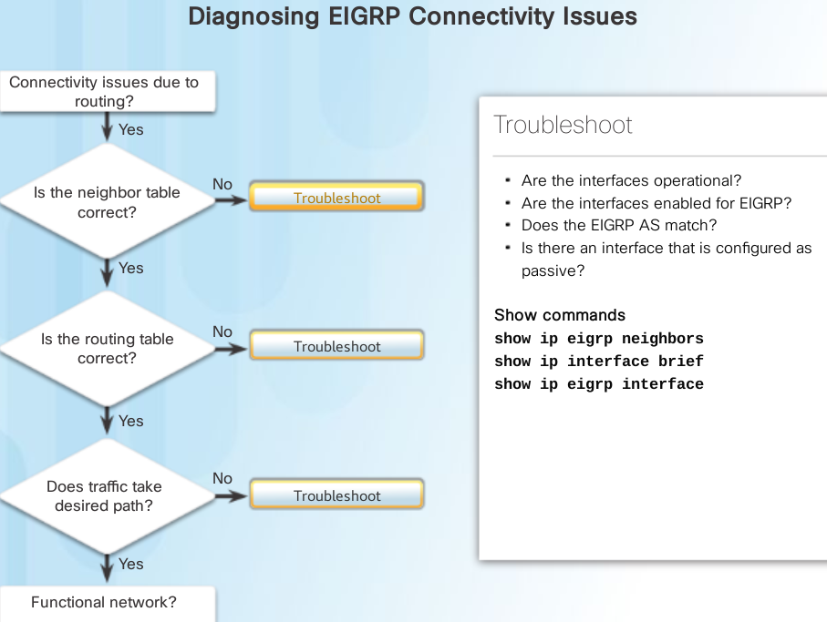

Some issues that may cause a connectivity problem for EIGRP include:
 Proper networks are not being advertised on remote routers.
 An incorrectly-configured passive interface, or an ACL, is blocking advertisements of remote networks.
 Automatic summarization is causing inconsistent routing in a discontiguous network.

default router config example
-----------------------------

.. code::

   conf t
   service password-encryption
   hostname R1 
   enable secret class
   no ip domain lookup
   ipv6 unicast-routing
   interface GigabitEthernet0/0
    ip address 192.168.1.1 255.255.255.0
    duplex auto
    speed auto
    ipv6 address FE80::1 link-local
    ipv6 address 2001:DB8:ACAD:A::1/64
    ipv6 eigrp 1
    no shutdown
   interface Serial0/0/0
    bandwidth 128
    ip address 192.168.21.1 255.255.255.252
    ipv6 address FE80::1 link-local
    ipv6 address 2001:DB8:ACAD:12::1/64
    ipv6 eigrp 1
    clock rate 128000
    no shutdown
   interface Serial0/0/1
    ip address 192.168.13.1 255.255.255.252
    ipv6 address FE80::1 link-local
    ipv6 address 2001:DB8:ACAD:31::1/64
    ipv6 eigrp 1
    no shutdown
   router eigrp 1
    network 192.168.1.0
    network 192.168.12.0 0.0.0.3
    network 192.168.13.0 0.0.0.3
    passive-interface GigabitEthernet0/0
    eigrp router-id 1.1.1.1
   ipv6 router eigrp 1
    passive-interface GigabitEthernet0/0  
    no shutdown
   banner motd @
    Unauthorized Access is Prohibited! @
   line con 0
    password cisco
    login
    logging synchronous
   line vty 0 4
    password cisco
    login
    transport input all
   end

Quiz
----

#. Which multicast address does an EIGRP-enabled router use to send query packets? 

   + 224.0.0.10   V
   + 224.0.0.9
   + 224.0.0.12
   + 224.0.0.5

#. Which protocol number is used to indicate that an EIGRP packet is encapsulated in an IP packet? 

   + 6
   + 17
   + 88  V 
   + 89 

#. Match the types of EIGRP routes to the correct default administrative distances. (Not all options are used.)
   {110,90,5,170}

   + summary  5
   + internal 90 
   + external 170

#. What operational feature is different for EIGRP for IPv6 compared to EIGRP for IPv4?

   + DUAL algorithm calculations
   + the type of value used for the Router ID 
   + neighbor discovery mechanisms
   + the source and destination addresses used within the EIGRP messages V

#. A network admin is verifying the EIGRP configuration. What conclusion can be drawn?
   
   .. image:: ../../../_static/img/6_eigrp_quiz1.png

   + Subnetted networks are included in route updates   V 
   + Metric weight values have been changed from their default values
   + There are 90 internal networks and 170 external networks in the routing table
   + Up to 4 paths to the same destination with different costs can be included in the routing table

   .. note:: The entry "Automatic network summarization is not in effect" indicates that the command no auto-summary is entered, which means subnetted networks (from a major network) are included in route updates. The metric values keep the default values. The numbers 90 and 170 indicate the administrative distances. The routing table can contain up to 4 equal cost paths to a destination network because the maximum metric variance parameter is 1.

#. Which bandwidth value is used when calculating the EIGRP metric of a route? 

   + the fastest bandwidth of all interfaces on the router
   + the slowest bandwidth of all interfaces on the router
   + the fastest bandwidth of all outgoing interfaces between the source and destination
   + the slowest bandwidth of all outgoing interfaces between the source and destination  V

#. Which two protocols are allowed to be routed by EIGRP as a consequence of the PDM feature? (Choose two.) 

   + IPv4 V
   + TCP
   + IPv6 V
   + UDP 
   + RTP

#. Which destination address is used by EIGRP for IPv6 messages? 

   + the all-EIGRP-routers multicast address         V
   + the IPv6 global unicast address of the neighbor
   + the 32-bit router ID of the neighbor
   + the unique local IPv6 address of the neighbor

#. Which address will EIGRP for IPv6 use as the router ID?  

   + the highest link-local address that is configured on any enabled interface
   + the highest interface MAC address
   + the highest IPv4 address that is configured on any enabled interface V
   + the highest IPv6 address that is configured on any enabled interface

   .. note:: EIGRP for IPv6 uses the same router ID as EIGRP for IPv4 uses. The 32-bit number can be configured with the router-id command or automatically assigned from the highest IPv4 address on an enabled interface.

#. In the command router eigrp 100, what does the value 100 represent? 

   + the autonomous system number  V
   + the router ID
   + the administrative distance
   + the metric

#. Which two values are included by default in the calculation of an EIGRP metric? (Choose two.) 

   + load
   + delay       V
   + reliability 
   + bandwidth   V
   + hop count

#. What does the value 2816 represent in the output display? 

   .. image:: ../../../_static/img/6_eigrp_quiz2.png

   + feasible distance
   + shortest distance
   + reported distance  V 
   + administrative distance 

   .. note:: The value 2816 in (2170112/2816) is the "reported distance," the metric of the neighbor router (192.168.1.6) to reach the destination network. The value 2170112 is the feasible metric cost to reach the destination network.

#. What address and wild card mask can be used to enable EIGRP for only the subnet 192.168.100.192 255.255.255.192? 

   + 192.168.100.192 0.0.0.7
   + 192.168.100.192 0.0.0.15
   + 192.168.100.192 0.0.0.63   V
   + 192.168.100.192 0.0.0.127

#. What two conditions will result in an EIGRP route going into the active state? (Choose two.) 

   + One neighbor has not met the feasibility condition
   + The router is not sending queries
   + The successor is down    V
   + There is no feasible successor V
   + The network has been recalculated

#. Match the EIGRP packet type to the function. (Not all options are used.)  
   
   a. used to confirm the reliable delivery of a packet
   b. used to form an EIGRP neighbor relationship
   c. used to search for an alternate path
   d. used to distribute routing information
   e. used in response to an EIGRP-enabled router searching for a network
   
   + hello -> b
   + update -> d
   + acknowledgment -> a
   + reply -> e

   .. note:: EIGRP update packets are used to propagate routing information to other routers. EIGRP hello packets are used to form and maintain neighbor relationships between EIGRP-enabled routers. EIGRP acknowledgment packets are used when reliable delivery is used and a confirmation needs to be returned. EIGRP reply packets are used in response to a query packet, which searches for a route to a specific destination network.
