.. include:: ../../../_static/global.rst 

..
    # with overline, for parts
    * with overline, for chapters
    =, for sections
    -, for subsections
    ^, for subsubsections
    “, for paragraphs

OSPF
====

AD = 110

Link
 router interface
State
 description of an interface and it's relationship to NB routers

``224.0.0.5 or unicast MAC 01:00:5E:00:00:05``
``224.0.0.6 for link-local multicasts MAC 01:00:5E:00:00:06(do not hop across routers)``
- resides directly on top of IP
- does not use TCP(pid 5) Or UDP(pid 17)
- Protocol ID 89
- also resides at L3

OSPF Area
   number 100 or 1.1.1.1 dotted decimal

by default sync every 30mins with state of the links

+------------------+------------------------+----------------------------------------------+
| Adjacency  Table | IP OSPF Neighbor Table | Neighboring Routers                          |
|                  |                        | - show ip ospf neighbor                      |
+------------------+------------------------+----------------------------------------------+
| Topology Table   | IP OSPF Topology Table | All routers n attached links in area/network |
| LSDB             |                        | - show ip ospf database                      |
+------------------+------------------------+----------------------------------------------+
| Forwarding Table | IP Routing Table       | Best Routes                                  |
|                  |                        | - show ip route                              |
+------------------+------------------------+----------------------------------------------+

AD Values table
---------------

.. image:: ../../../_static/img/Administrative-Distance.png

RFC link https://www.rfc-editor.org/refs/ref2328.txt 

SPF
---

The SPF algorithm creates an SPF tree by placing each router at the root of the tree and calculating the shortest path to each node. The SPF tree is then used to calculate the best routes. OSPF places the best routes into the forwarding database, which is used to make the routing table.

Packet types 
------------
                

DL Frame Header - IP packet header - OSPF packet header - OSPF packet type-specific database

+-----------+---------------------------+
| type code | name                      |
+===========+===========================+
| 0x01      | hello                     |
| 0x02      | Database Description (DD) |
| 0x03      | Link State Request        |
| 0x04      | Link State Update         |
| 0x05      | Link State Acknowledgment |
+-----------+---------------------------+

Type 1:  Hello packet
 - Used to establish and maintain adjacency with other OSPF routers.
 
 .. image:: ../../../_static/img/8_ospf_hello.png

 - Elect the Designated Router (DR) and Backup Designated Router (BDR) on multiaccess networks like Ethernet and Frame Relay. Point-to-point links do not require DR or BDR
 
 - Type - Identifies the type of packet. A one (1) indicates a Hello packet. A value 2 identifies a DBD packet, 3 an LSR packet, 4 an LSU packet, and 5 an LSAck packet.

 - Router ID - A 32-bit value expressed in dotted decimal notation (like an IPv4 address) used to uniquely identify the originating router.

 - Area ID – Number of the area from which the packet originated.

 - Network Mask - Subnet mask associated with the sending interface.

 - Hello Interval - Specifies the frequency, in seconds, at which a router sends Hello packets. The default Hello interval on multiaccess networks is 10 seconds. This timer must be the same on neighboring routers; otherwise, an adjacency is not established.

 - Router Priority - Used in a DR/BDR election. The default priority for all OSPF routers is 1, but can be manually altered from 0 to 255. The higher the value, the more likely the router becomes the DR on the link.

 - Dead Interval - Is the time in seconds that a router waits to hear from a neighbor before declaring the neighboring router out of service. By default, the router Dead Interval is four times the Hello interval. This timer must be the same on neighboring routers; otherwise, an adjacency is not established.

 - Designated Router (DR) - Router ID of the DR.

 - Backup Designated Router (BDR) - Router ID of the BDR.

 - List of Neighbors - List that identifies the router IDs of all adjacent routers.

Type 2: Database Description (DBD) packet
 - Contains an abbreviated list of the sending router’s LSDB and is used by receiving routers to check against the local LSDB. The LSDB must be identical on all link-state routers within an area to construct an accurate SPF tree.
 

Type 3:
 Link-State Request (LSR) packet - Receiving routers can then request more information about any entry in the DBD by sending an LSR.
 

Type 4:
 Link-State Update (LSU) packet - Used to reply to LSRs and to announce new information. LSUs contain seven different types of LSAs.
 
 .. image:: ../../../_static/img/8_ospf_LSU.png

Type 5:
 Link-State Acknowledgment (LSAck) packet - When an LSU is received, the router sends an LSAck to confirm receipt of the LSU. The LSAck data field is empty.
 

Hello
 - Dynamically dicover neighbors
 - form neighbors and maintain
 - default intervals
    - 10 seconds on broadcast segments (Ethernet)
    - 30 seconds on non-broadcast segments (Serial, NBMA)
 - dead timer
   - 4 X hello interval by default (not rcvd within that time NB relationship is torn down)

Database Description (DD/DBD)
 - used to exchange brief versions of each LSA

Link State Request (LSR)
 - request for full LSA information

Link State Update (LSU)
 - contains LSA's
 - typically in response to LSR

Link State Acknowledgement (LSAck)
 - confirm receipt of an LSU message

.. note:: ospf can have a recommended max 50 areas

.. note:: Area 0 is known as the backbone area

LSA types
---------

+--------------+-----------------------------------------------------------+
| LSA Type     | Description                                               |
+==============+===========================================================+
| 1            | Router LSA                                                |
+--------------+-----------------------------------------------------------+
| 2            | Network LSA                                               |
+--------------+-----------------------------------------------------------+
| 3 and 4      | Summary LSAs                                              |
+--------------+-----------------------------------------------------------+
| 5            | AS External LSA                                           |
+--------------+-----------------------------------------------------------+
| 6            | Multicast OSPF LSA                                        |
+--------------+-----------------------------------------------------------+
| 7            | Defined for NSSAs                                         |
+--------------+-----------------------------------------------------------+
| 8            | External Attributes LSA for Border Gateway Protocol (BGP) |
+--------------+-----------------------------------------------------------+
| 9, 10, or 11 | Opaque LSAs                                               |
+--------------+-----------------------------------------------------------+

.. image:: ../../../_static/img/8_lsa_type1.png

.. note:: all routers advertise their directly connected OSPF-enabled links in a type 1 LSA and forward their network information to OSPF neighbors. The LSA contains a list of the directly connected interfaces, link types, neighbors, and link states. 

+ Type 1 LSAs include a list of directly connected network prefixes and link types.
+ All routers generate type 1 LSAs.
+ Type 1 LSAs are flooded within the area and do not propagate beyond an ABR.
+ A type 1 LSA link-state ID is identified by the router ID of the originating router.

.. image:: ../../../_static/img/8_lsa_type2.png

.. note:: A type 2 LSA only exists for multiaccess and non-broadcast multiaccess (NBMA) networks where there is a DR elected and at least two routers on the multiaccess segment. The type 2 LSA contains the router ID and IP address of the DR, along with the router ID of all other routers on the multiaccess segment. A type 2 LSA is created for every multiaccess network in the area.

+ Type 2 LSAs identify the routers and the network addresses of the multiaccess links.
+ Only a DR generates a type 2 LSA.
+ Type 2 LSAs are flooded within the multiaccess network and do not go beyond an ABR.
+ A type 2 LSA link-state ID is identified by the DR router ID.

.. image:: ../../../_static/img/8_lsa_type3.png

.. note:: Type 3 LSAs are used by ABRs to advertise networks from other areas. ABRs collect type 1 LSAs in the LSDB. After an OSPF area has converged, the ABR creates a type 3 LSA for each of its learned OSPF networks. Therefore, an ABR with many OSPF routes must create type 3 LSAs for each network. 

+ A type 3 LSA describes a network address learned by type 1 LSAs.
+ A type 3 LSA is required for every subnet.
+ ABRs flood type 3 LSAs to other areas and are regenerated by other ABRs.
+ A type 3 LSA link-state ID is identified by the network address.
+ By default, routes are not summarized.

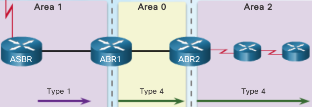

.. note:: Type 4 and type 5 LSAs are used collectively to identify an ASBR and advertise external networks into an OSPF routing domain. A type 4 summary LSA is generated by an ABR only when an ASBR exists within an area. A type 4 LSA identifies the ASBR and provides a route to it. All traffic destined to an external network requires routing table knowledge of the ASBR that originated the external routes.

+ Type 4 LSAs are used to advertise an ASBR to other areas and provide a route to the ASBR.
+ ABRs generate type 4 LSAs.
+ A type 4 LSA is generated by the originating ABR and regenerated by other ABRs.
+ A type 4 LSA link-state ID is identified by the router ID of the ASBR. 

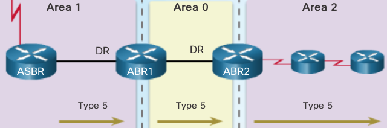

.. note:: Type 5 external LSAs describe routes to networks outside the OSPF routing domain. Type 5 LSAs are originated by the ASBR and are flooded to the entire routing domain. Type 5 LSAs are also referred to as external LSA entries.

+ Type 5 LSAs are used to advertise external (i.e., non-OSPF) network addresses.
+ An ASBR generates a type 5 LSA.
+ Type 5 LSAs are flooded throughout the area and regenerated by other ABRs.
+ A type 5 LSA link-state ID is the external network address.
+ By default, routes are not summarized.

OSPF Routing Table Entries
--------------------------

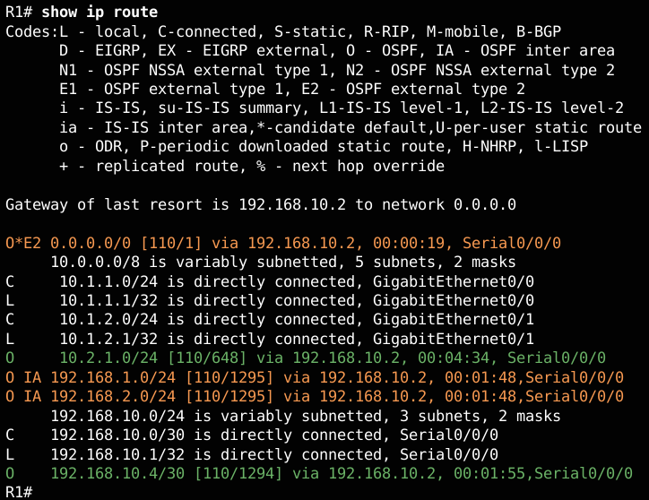

+ O
  Router (type 1) and network (type 2) LSAs describe the details within an area. The routing table reflects this link-state information with a designation of O, meaning that the route is intra-area.

+ O IA 
  When an ABR receives a router LSA (type 1) in one area; it sends a summary LSA (type 3) into the adjacent area. Summary LSAs appear in the routing table as IA (interarea routes). Summary LSAs received in one area are also forwarded to other areas.

+ O E1 or O E2
  External LSAs appear in the routing table marked as external type 1 (E1) or external type 2 (E2) routes. Type 2 (E2) is the default. The difference between type 1 (E1) and type 2 (E2) are beyond the scope of this course.

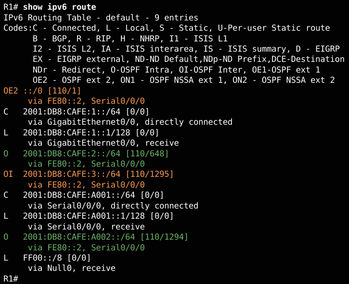

above displays an IPv6 routing table with OSPF intra-area, interarea, and external routing table entries.

OSPF Route Calculation
----------------------

+ Calculate intra-area OSPF routes.
+ Calculate best path to interarea OSPF routes.
+ Calculate best path route to external non-OSPF networks.

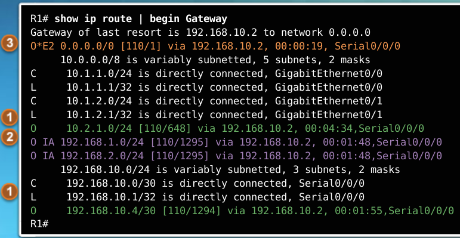

1. All routers calculate the best path(s) to destinations within their area (intra-area) and add these entries to the routing table. These are the type 1 and type 2 LSAs, which are noted in the routing table with a routing designator of O. (1)

2. All routers calculate the best path(s) to the other areas within the internetwork. These best paths are the interarea route entries, or type 3 LSAs, and are noted with a routing designator of O IA. (2)

3. All routers (except those that are in a form of stub area) calculate the best path(s) to the external autonomous system (type 5) destinations. These are noted with either an O E1 or an O E2 route designator, depending on the configuration. (3)

When converged, a router can communicate with any network within or outside the OSPF routing domain.

ABR's
-----

Area Border Router's

.. note:: ABR's allow for summarization of routes

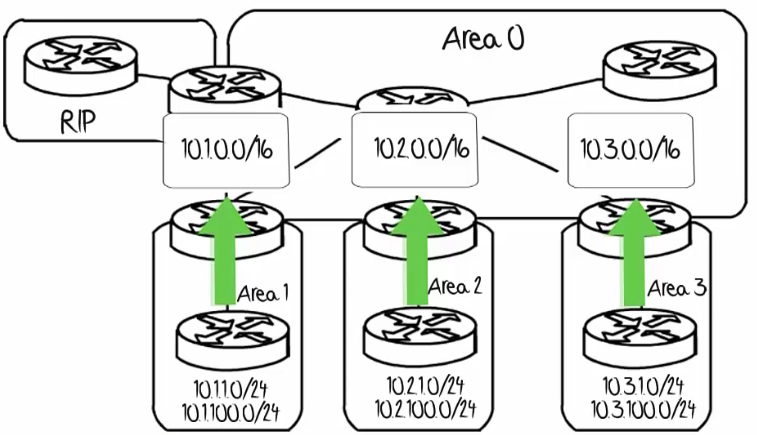

Multiarea OSPF implementation
-----------------------------

Steps 1 and 2 are part of the planning process. 

1. Gather the network requirements and parameters - Gather the network requirements and parameters - This includes determining the number of host and network devices, the IP addressing scheme (if already implemented), the size of the routing domain, the size of the routing tables, the risk of topology changes, whether existing routers can support OSPF, and other network characteristics.

2. Define the OSPF parameters
   Based on information gathered during Step 1, the network administrator must determine if single-area or multiarea OSPF is the preferred implementation. If multiarea OSPF is selected, there are several considerations the network administrator must take into account while determining the OSPF parameters, to include:

    + IP addressing plan
       This governs how OSPF can be deployed and how well the OSPF deployment might scale. A detailed IP addressing plan, along with the IP subnetting information, must be created. A good IP addressing plan should enable the usage of OSPF multiarea design and summarization. This plan more easily scales the network, as well as optimizes OSPF behavior and the propagation of LSA.

    + OSPF areas
       Dividing an OSPF network into areas decreases the LSDB size and limits the propagation of link-state updates when the topology changes. The routers that are to be ABRs and ASBRs must be identified, as are those ABRs or ASBRs that are to perform any summarization or redistribution.

    + Network topology
       This consists of links that connect the network equipment and belong to different OSPF areas in a multiarea OSPF design. Network topology is important to determine primary and backup links. Primary and backup links are defined by the changing OSPF cost on interfaces. A detailed network topology plan should also be used to determine the different OSPF areas, ABR, and ASBR as well as summarization and redistribution points, if multiarea OSPF is used.

3. Configure the multiarea OSPF implementation based on the parameters.

4. Verify the multiarea OSPF implementation based on the parameters.

ASBR's
------

Autonomous System Border Router

A router that connects a routing process with another routing process

e.g.
The router connected to the RIP process here

Backbone Routers
----------------

Routers that have interfaces within Area 0

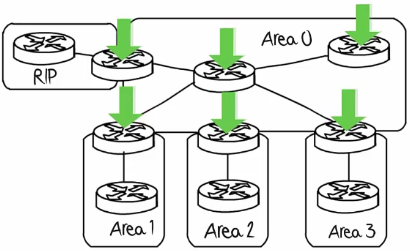

They are used to be allow traffic to be sent from one area to another

Internal Routers
----------------

Routers within an area not bordering another area

OSPF Operational States
-----------------------

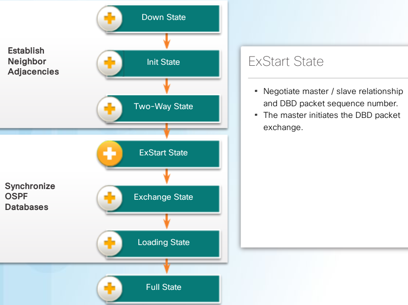

+ Down State
   - No Hello packets received = Down.
   - Router sends Hello packets.
   - Transition to Init state.

+ Init State
   - Hello packets are received from the neighbor.
   - They contain the sending router’s Router ID.
   - Transition to Two-Way state.

+ 2way State
   - When a router receives a Hello packet with its Router ID listed in the list of neighbors, the router transitions from the Init state to the Two-Way state.
   - On Ethernet links, elect a DR, and a BDR.
   - Transition to ExStart state.
   
+ ExStart State
   - Negotiate master / slave relationship and DBD packet sequence number.
   - The master (one with highest router ID) initiates the DBD packet exchange.

+ Exchange State
   - Routers exchange DBD (Database Descriptor) packets.
   - If additional router information is required then transition to Loading; otherwise, transition to the Full state.
   
   .. image:: ../../../_static/img/8_ospf_DBD_exchange.png

   - A DBD packet includes information about the LSA entry header that appears in the router’s LSDB. The entries can be about a link or about a network. Each LSA entry header includes information about the link-state type, the address of the advertising router, the link’s cost, and the sequence number. The router uses the sequence number to determine the newness of the received link-state information.

+ Loading State
   - LSRs and LSUs are used to gain additional route information.
   - Routes are processed using the SPF algorithm.
   - Transition to the Full state.

+ Full State
    - Routers have converged

.. warning:: The normal state for an OSPF router is usually FULL. If a router is stuck in another state, it is an indication that there are problems in forming adjacencies. The only exception to this is the 2-WAY state, which is normal in a multiaccess broadcast network. In multiaccess networks, DROTHERs only form FULL adjacencies with the DR and BDR. However, DROTHERs will still form a 2-WAY neighbor adjacency with any DROTHERs that join the network. 

DR adn BDR
----------

.. note:: OSPF elects a DR to be the collection and distribution point for LSAs sent and received. A BDR is also elected in case the DR fails. All other routers become DROTHERs. A DROTHER is a router that is neither the DR nor the BDR.

.. note:: the DR is only used for spreading LSA's. The router will still use the best next-hop router indicated in the routing table for the forwarding of all other packets

.. warning:: A designated router is chosen for every nw segment

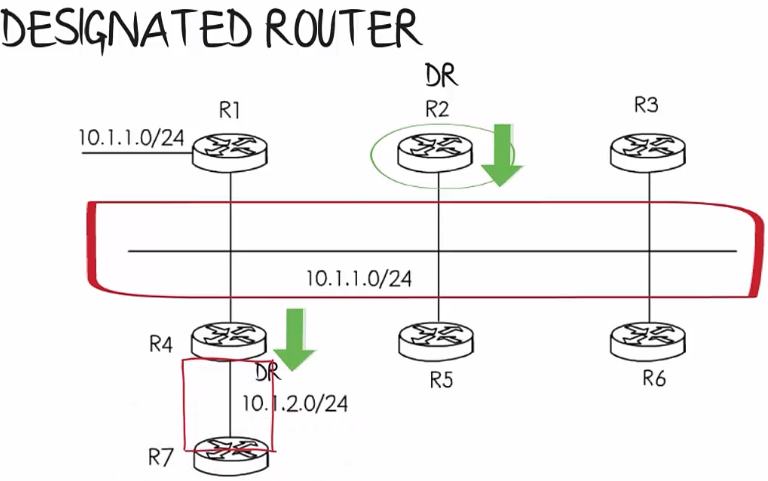

DR is elected based on highest priority
 - range 0 to 255
 - default is 1
 - 0 = cannot become a DR/BDR

DR is elected based on highest Router ID

.. warning:: A router that was DR and went down and comes back up after another DR and BDR have been established, does not become a DR again! (Not preemtive) The router just become a DRother router.

OSPF configuration
------------------

.. image:: ../../../_static/img/8_ospf_config_router.png

.. code::

   R2(config)# router ospf 10
   R2(config-router)# ?
   Router configuration commands:
   
     address-family         Enter Address Family command mode 
     area                   OSPF area parameters 
     auto-cost              Calculate OSPF interface cost according to bandwidth 
     bfd                    BFD configuration commands 
     capability             Enable specific OSPF feature 
     compatible             OSPF compatibility list 
     default                Set a command to its defaults 
     default-information    Control distribution of default information 
     default-metric         Set metric of redistributed routes 
     discard-route          Enable or disable discard-route installation 
     distance               Define an administrative distance 
     distribute-list        Filter networks in routing updates 
     domain-id              OSPF domain-id 
     domain-tag             OSPF domain-tag 
     event-log              OSPF Event Logging 
     exit                   Exit from routing protocol configuration mode 
     help                   Description of the interactive help system 
     ignore                 Do not complain about specific event 
     interface-id           Source of the interface ID 
     ispf                   Enable incremental SPF computation 
     limit                  Limit a specific OSPF feature 
     local-rib-criteria     Enable or disable usage of local RIB as route criteria 
     log-adjacency-changes  Log changes in adjacency state 
     max-lsa                maximum number of LSAs OSPF process will receive 
     max-metric             Set maximum metric 
     maximum-paths          Forward packets over multiple paths 
     neighbor               Specify a neighbor router 
     network                Enable routing on an IP network 
     no                     Negate a command or set its defaults 
     nsf                    Non-stop forwarding 
     passive-interface      Suppress routing updates on an interface 
     prefix-suppression     OSPF prefix suppression 
     priority               OSPF topology priority 
     queue-depth            OSPF Hello/Router process queue depth 
     redistribute           Redistribute information from another routing protocol 
     router-id              router-id for this OSPF process 
     shutdown               Shutdown the OSPF protocol under the current instance 
     snmp                   Modify snmp parameters 
     summary-address        Configure IP address summaries 
     timers                 Adjust routing timers 
     traffic-share          How to compute traffic share over alternate paths 
     ttl-security           TTL security check 
    
   R2(config-router)#

Router ID order of precedence
-----------------------------

Router ID configured?    →	Use that
| ↓
IPv4 loopback configured →  Use that
| ↓
Use highest active IPv4 address 

.. note:: the routing device configured with the highest priority is elected the DR. Assuming there is no priority configured, or there is a tie, then the router with the highest router ID is elected the DR. The routing device with the second highest router ID is elected the BDR.

.. note:: The router ID looks like an IPv4 address, but it is not routable and, therefore, is not included in the routing table, unless the OSPF routing process chooses an interface (physical or loopback) that is appropriately defined by a network command.

.. warning:: If the router uses the highest IPv4 address for the router ID, the interface does not need to be OSPF-enabled. This means that the interface address does not need to be included in one of the OSPFnetwork commands for the router to use that IPv4 address as the router ID. The only requirement is that the interface is active and in the up state.

.. warning:: Router ID's are local to the router! can be different across routers!

.. code:: 

  R1(config)# router ospf 1 
  R3(config)# router ospf 3
  will work
  
Modify Router ID
----------------

``R1# clear ip ospf process``

.. code::

   R1(config)# router ospf 10
   R1(config-router)# router-id 1.1.1.1
   % OSPF: Reload or use "clear ip ospf process" command, for this to take effect

   R1# clear ip ospf process
   Reset ALL OSPF processes? [no]: y
   R1#
   Mar 25 19:46:22.423: %OSPF-5-ADJCHG: Process 10, Nbr 
   3.3.3.3 on Serial0/0/1 from FULL to DOWN, Neighbor Down:
    Interface down or detached
   Mar 25 19:46:22.423: %OSPF-5-ADJCHG: Process 10, Nbr 
   2.2.2.2 on Serial0/0/0 from FULL to DOWN, Neighbor Down:
    Interface down or detached
   Mar 25 19:46:22.475: %OSPF-5-ADJCHG: Process 10, Nbr 
   3.3.3.3 on Serial0/0/1 from LOADING to FULL, Loading Done
   Mar 25 19:46:22.475: %OSPF-5-ADJCHG: Process 10, Nbr 
   2.2.2.2 on Serial0/0/0 from LOADING to FULL, Loading Done
   R1#
   R1# show ip protocols | section Router ID
     Router ID 1.1.1.1
   R1#

.. code::

   R1# show ip protocols | section Router ID
     Router ID 1.1.1.1
   R1#

.. note:: The router-id command is the preferred method. However, some older versions of the IOS do not recognize the router-id command; therefore, the best way to set the router ID on those routers is by using a loopback interface 

.. code::

   R1(config)# router ospf 10
   R1(config-router)# network 172.16.1.0 0.0.0.255 area 0
   R1(config-router)# network 172.16.3.0 0.0.0.3 area 0
   R1(config-router)# network 192.168.10.4 0.0.0.3 area 0
   R1(config-router)#

.. note:: The advantage of specifying the interface is that the wildcard mask calculation is not necessary. OSPFv2 uses the interface address and subnet mask to determine the network to advertise.
		
   
.. note:: Entering network 172.16.3.1 0.0.0.0 area 0 on R1 tells the router to enable interface Serial0/0/0 for the routing process. As a result, the OSPFv2 process will advertise the network that is on this interface (172.16.3.0/30)

OSPF Cost Values
----------------

.. image:: ../../../_static/img/8_ospf_metriccost.png

cost = reference BW / interface BW

default reference BW = 10⁸ bps

.. note:: Notice that FastEthernet, Gigabit Ethernet, and 10 GigE interfaces share the same cost, because the OSPF cost value must be an integer. Consequently, because the default reference bandwidth is set to 100 Mb/s, all links that are faster than Fast Ethernet also have a cost of 1

adjust cost for Gb Ethernet links
^^^^^^^^^^^^^^^^^^^^^^^^^^^^^^^^^

.. code::

   to change reference bandwidth
   -----------------------------
   R1(config-router)# auto-cost reference-bandwidth 1000
   R1# show interfaces serial 0/0/1 | include BW
       MTU 1500 bytes, BW 1544 Kbit/sec, DLY 20000 usec,

   to change cost on an interface
   ------------------------------
   R1(config-router)# ip ospf cost x

   to view metric commands
   -----------------------
   R1# show ip ospf interface G0/1
   R1# show ip route | include 172.16.2.0
   R1# show ip route 172.16.2.0

When NBs dont form adjencies
----------------------------

+ The interfaces are not on the same network.
+ OSPF network types do not match.
+ OSPF Hello or Dead Timers do not match.
+ Interface to neighbor is incorrectly configured as passive.
+ There is a missing or incorrect OSPF network command.
+ Authentication is misconfigured.
+ Each interface must be properly addressed and in the "up and up" condition.

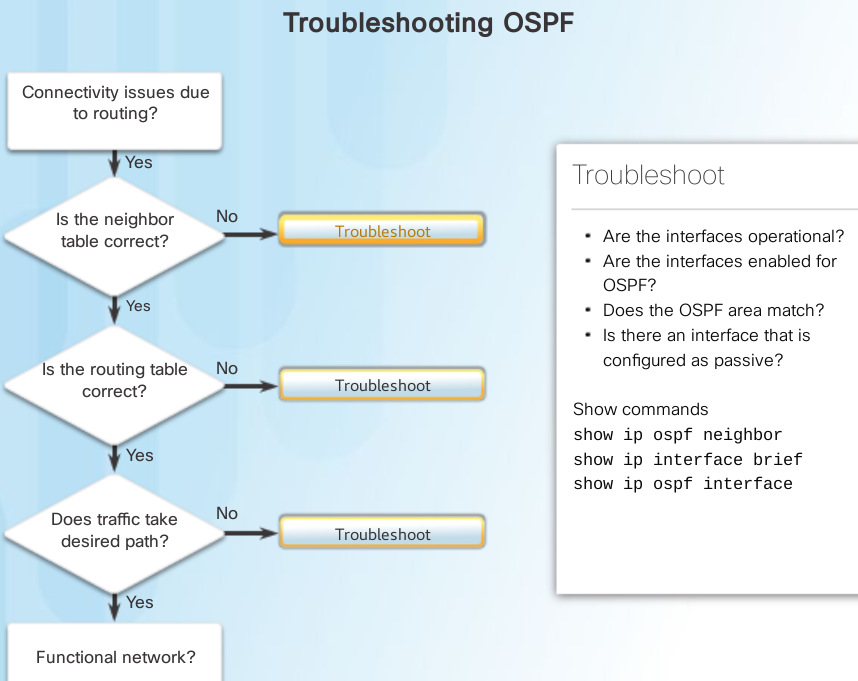

1. Is the NB table correct?
   + on picture
2. Is Routing Table correct?
   + Are the networks being advertised?
   + Is there an ACL blocking advertisements?
   + Is there another routing protocol with a lower AD?
   + Are all areas connected to Area 0?
   
   use show ip protocols and show ip route ospf

3. Does traffic take desired path?
   + Verify the OSPF cost on an interface
   + Verify the OSPF reference bandwidth
   
   use show ip route ospf and show ip ospf interface

.. note:: Another problem that may arise is when two neighboring routers have mismatched MTU sizes on their connecting interfaces. The MTU size is the largest network layer packet that the router will forward out each interface. Routers default to an MTU size of 1500 bytes. However, this value can be changed for IPv4 packets using the ip mtu size interface configuration command or the ipv6 mtu size interface command for IPv6 packets. If two connecting routers had mismatched MTU values, they would still attempt to form an adjacency but they would not exchange their LSDBs and the neighbor relationship would fail. 

OSPF example topology
---------------------

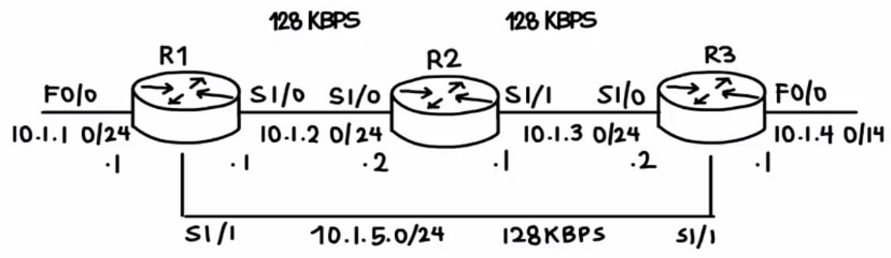

OSPF TroubleShooting
--------------------

1. configure new router 

   .. code::

      view NB ID Pri state DR/BDR
      ---------------------------
      R1# show ip ospf neighbors
      best practice use loopback instead of IF
      R1# show ip ospf interface
      you'll see router id remained the same
      check network commands:
      -----------------------
      R1# show run | section ospf
      so add the network statement for the Lo address
      R1(config-router)# network 1.1.1.1 0.0.0.0 area 0

      configure router id!
      --------------------
      R1(config-router)# router-id 1.1.1.1
      R1# clear ip ospf process
      Reset ALL OSPF processes? [no]: y

      verify
      ------
      R1# show ip ospf interface

Configuring a multi area network
--------------------------------

.. note:: virtual links allow you to pool or extend the backbone area ACROSS another area. Eg. Area 0 extended to another area such as area 1 to alow an ABR to have an IF in the backbone area and meet the criteria

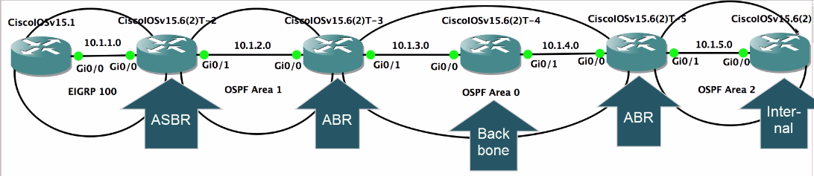

Router 1 EIGRP Gi0/0 10.1.1.1

.. code::

   R1(config)# int g0/0
   R1(config-if)# no shut
   R1(config-if)# ip address 10.1.1.1 255.255.255.0
   R1(config-if)# interface loop 0
   R1(config-if)# ip address 1.1.1.1 255.255.255.255
   R1(config)# router eigrp 100
   R1(config-router)# network 0.0.0.0 
   R1(config-router)# no auto-summary 
   R1(config-router)# do show ip eigrp interfaces

Router 2 ASBR EIGRP & OSPF Gi0/0 10.1.1.2
                           Gi0/1 10.1.2.1

.. code::

   R1(config)# int g0/0
   R1(config-if)# no shut
   R1(config-if)# ip address 10.1.1.2 255.255.255.0
   R1(config-if)# interface g0/1 
   R1(config-if)# ip address 10.1.2.1 255.255.255.0
   R1(config-if)# interface loop 0
   R1(config-if)# ip address 2.2.2.2 255.255.255.255
   R1(config)# router eigrp 100
   R1(config-router)# network 0.0.0.0 
   R1(config-router)# no auto-summary 
   R1(config-router)# do show ip eigrp interfaces

Commands
--------

ospf show commands 
^^^^^^^^^^^^^^^^^^

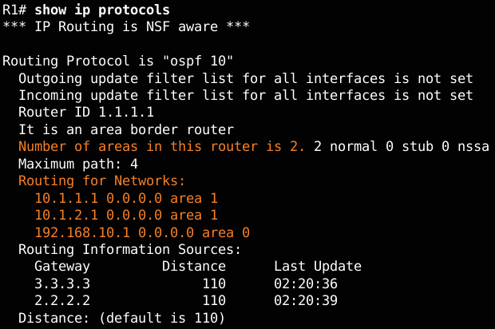

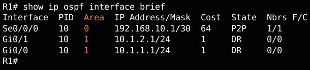

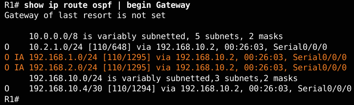

.. image:: ../../../_static/img/8_ospf_show_ip_ospf_database.png

.. note:: Notice R1 has entries for area 0 and area 1, because ABRs must maintain a separate LSDB for each area to which they belong. In the output, Router Link States in area 0 identifies three routers. The Summary Net Link States section identifies networks learned from other areas and which neighbor advertised the network.

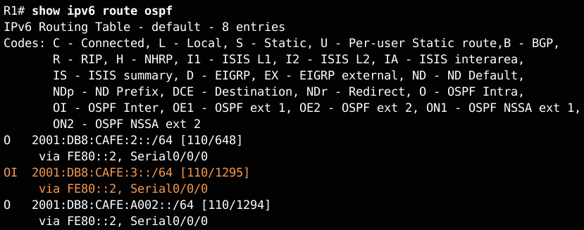

.. note:: how the IPv6 routing table displays OI entries in the routing table to identify networks learned from other areas. Specifically, O represents OSPF routes, and I represents interarea, which means that the route originated from another area. Recall that R1 is in area 0, and the 2001:DB8:CAFE:3::/64 subnet is connected to R3 in area 2. The [110/1295] entry in the routing table represents the administrative distance that is assigned to OSPF (110) and the total cost of the routes (cost of 1295).

.. note:: Below displays the content of the LSDB of R1. The command offers similar information to its OSPFv2 counterpart. However, the OSPFv3 LSDB contains additional LSA types not available in OSPFv2.

.. code::

   R1# show ipv6 ospf database 
   
           OSPFv3 Router with ID (1.1.1.1) (Process ID 10)
   
                    Router Link States (Area 0)
   
   ADV Router   Age    Seq#       Fragment ID  Link count Bits
    1.1.1.1     1617   0x80000002 0            1          B
    2.2.2.2     1484   0x80000002 0            2          None
    3.3.3.3     14     0x80000001 0            1          B
   
                Inter Area Prefix Link States (Area 0)
   
   ADV Router   Age     Seq#        Prefix
    1.1.1.1     1833    0x80000001  2001:DB8:CAFE:1::/64
    3.3.3.3     1476    0x80000001  2001:DB8:CAFE:3::/64
   
                Link (Type-8) Link States (Area 0)
   
   ADV Router   Age     Seq#        Link ID    Interface
    1.1.1.1     1843    0x80000001  6          Se0/0/0
    2.2.2.2     1619    0x80000001  6          Se0/0/0
   
                Intra Area Prefix Link States (Area 0)
             
   ADV Router  Age   Seq#       Link ID  Ref-lstype  Ref-LSID
    1.1.1.1    1843  0x80000001 0        0x2001      0
    2.2.2.2    1614  0x80000002 0        0x2001      0
    3.3.3.3    1486  0x80000001          0x2001      0
   
                 Router Link States (Area 1)
   
   ADV Router  Age   Seq#       Fragment ID Link count Bits
    1.1.1.1    1843  0x80000001 0           0          B
   
               Inter Area Prefix Link States (Area 1)
   
   ADV Router   Age      Seq#         Prefix
    1.1.1.1     1833     0x80000001  2001:DB8:CAFE:A001::/64
    1.1.1.1     1613     0x80000001  2001:DB8:CAFE:A002::64
    1.1.1.1     1613     0x80000001  2001:DB8:CAFE:2::/64
    1.1.1.1     1474     0x80000001  2001:DB8:CAFE:3::/64
   
                Link (Type-8) Link States (Area 1)
   
   ADV Router   Age      Seq#        Link ID    Interface
    1.1.1.1     1844     0x80000001   3          Gi0/0
             
                Intra Area Prefix Link States (Area 1)
   
   ADV Route  Age   Seq#       Link ID Ref-lstype Ref-LSID
    1.1.1.1   1844  0x80000001 0       0x2001     0
   R1# 

distribute default static route
^^^^^^^^^^^^^^^^^^^^^^^^^^^^^^^

.. code::

   R2(config)# ip route 0.0.0.0 0.0.0.0 209.165.200.226 
   R2(config)#
   R2(config)# router ospf 10 
   R2(config-router)# default-information originate 
   R2(config-router)# end 
   R2#

   on R3 this will appear as an O*E2 entry
   ---------------------------------------
   Gateway of last resort is 192.168.10.9 to network 0.0.0.0 
   O*E2 0.0.0.0/0 [110/1] via 192.168.10.9, 00:18:22, Serial0/0/1 

.. note:: External routes are either external type 1 or external type 2. The difference between the two is in the way the cost (metric) of the route is being calculated. The cost of a type 2 route is always the external cost, regardless of the interior cost to reach that route. A type 1 cost is the addition of the external cost and the internal cost used to reach that route. A type 1 route is always preferred over a type 2 route for the same destination

distribute default static route in OSPFV3
^^^^^^^^^^^^^^^^^^^^^^^^^^^^^^^^^^^^^^^^^

.. code::

   R2(config)# ipv6 route ::/0 2001:DB8:FEED:1::2
   R2(config)# 
   R2(config)# ipv6 router ospf 10
   R2(config-rtr)# default-information originate 
   R2(config-rtr)# end

   verify
   ------
   R2# show ipv6 route static
   R2# show ipv6 route static
   IPv6 Routing Table - default - 12 entries
   Codes:C -Connected, L - Local, S - Static, U - Per-user Static route
         B -BGP, R - RIP, H - NHRP, I1 - ISIS L1
         I2 -ISIS L2, IA - ISIS interarea, IS-ISIS summary,D-EIGRP
         EX -EIGRP external, ND-ND Default,NDp-ND Prefix,DCE-Destination
         NDr -Redirect, O - OSPF Intra,OI-OSPF Inter,OE1-OSPF ext 1
         OE2 -OSPF ext 2, ON1 - OSPF NSSA ext 1, ON2 - OSPF NSSA ext 2
   S   ::/0 [1/0]
        via 2001:DB8:FEED:1::2, Loopback0
   R2# 

verify hello n dead intervals
^^^^^^^^^^^^^^^^^^^^^^^^^^^^^

.. code::

   R1# show ip ospf interface serial 0/0/0
   ... Timer intervals configure, Hello 10, Dead 40

   R1# show ip ospf interface | include Timer
     Timer intervals configured, Hello 10, Dead 40, Wait 40,Retransmit 5
     Timer intervals configured, Hello 10, Dead 40, Wait 40,Retransmit 5
     Timer intervals configured, Hello 10, Dead 40, Wait 40,Retransmit 5
   R1# 

   R1# show ip ospf neighbor 
   
   Neighbor ID  Pri  State   Dead Time  Address      Interface
   3.3.3.3      0    FULL/-  00:00:35   192.168.10.6 Serial0/0/1
   2.2.2.2      0    FULL/-  00:00:33   172.16.3.2   Serial0/0/0
   R1# 

modify hello n dead intervals
^^^^^^^^^^^^^^^^^^^^^^^^^^^^^

.. code::

   R1(config)# interface serial 0/0/0
   R1(config-if)# ip ospf hello-interval 5
   R1(config-if)# ip ospf dead-interval 20
   R1(config-if)# end
   R1# 
   R1#
   Apr  7 17:28:21.529: %OSPF-5-ADJCHG: Process 10, Nbr 
   2.2.2.2 on Serial0/0/0 from FULL to DOWN, Neighbor Down: Dead timer expired
   R1#

.. note:: Use the no ip ospf hello-interval and no ip ospf dead-interval commands to reset the intervals to their default

.. image:: ../../../_static/img/8_ospf_show_database.png

.. code::

   R1# show ip ospf database router 1.1.1.1
   will show details on all the links involved
   loopback = stub network

.. image:: ../../../_static/img/8_ospf_show_database_router.png

.. note:: all routers in the same area will have the same link state database

.. code::

   R1# debug ip ospf events

QnA
---

.. note:: first criteria, highest priority ID wins! id 0 = doesn't take part in DR/BDR election

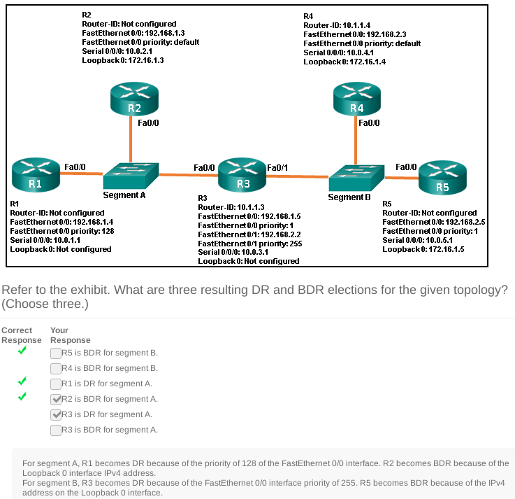

.. warning:: Unlike OSPFv2, OSPFV3 does not use the network command to advertise directly attached networks. OSPFv3 is enabled directly on the interface. These networks will be included in advertisements once the command ipv6 ospf process_id area area_id is entered on the interface. The OSPF process_id must match with the ipv6 router ospf command.

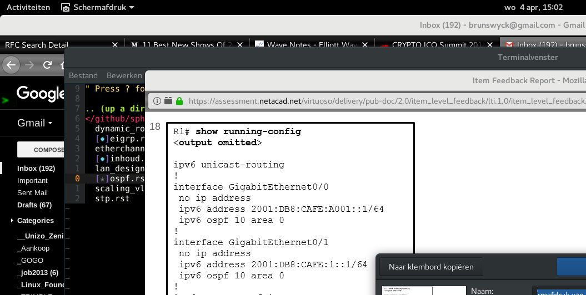

