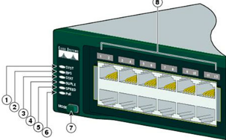

.. include:: ../../../_static/global.rst

Switch Configuration
====================

Configure BOOT Environment variable
-----------------------------------

.. code::

   S1(config)# boot system flash:/c2960-lanbasek9-mz.150-2.SE/c2960-lanbasek9-mz.150-2.SE.bin
                command     storage   path to location in fs     IOS filename

   S1# show boot

Switch boot sequence
--------------------
#. loads POST from ROM. Checks CPU subsystem. Tests CPU, DRAM & portion of flash device
#. loads BOOT LOADER software from ROM, runs immediately after POST
#. BOOT LOADER performs low-level CPU initialization. Initializes CPU registers that control where physical memory is mapped, quantity of memory and its speed
#. BOOT LOADER initializes flash file system on the system board
#. BOOT LOADER locates & loads a default IOS image into memory 

BOOT environment variable. If this variable is not set, the switch attempts to load and execute the first executable file it can by performing a recursive, depth-first search throughout the flash file system

Recover from System Crash
--------------------------

#. connect by console cable, configure terminal emulation software
#. unplug power cord
#. reconnect power and hold down MODE button while system LED is flashing green
#. Continue pressing MODE button while LED turns briefly amber and then solid green. Now release the button
#. boot loader **switch:** prompt appears

switch: dir flash:

Catalyst 2960 switch LEDs
^^^^^^^^^^^^^^^^^^^^^^^^^

#. System LED: system has power and is functioning properly. If Amber = power but not working properly
#. RPS LED: blinking = connected but providing power to another device. Amber = standby mode Blinking Amber = providing power due to main PSU failed
#. Port Status LED (default mode): alternating green-amber = link fault. Amber/blinking Amber = no forwarding/port blocked to prevent loop
#. Port Duplex mode LED: green = full duplex
#. Port Speed LED: off = 10Mb/s green=100Mb/s blinking green=1000Mb/s
#. PoE Mode LED: Amber = 1or+ denied power BlinkingAmber = off due to fault| PoE fault Green= PoE on Alterating Green-Amber = no power to not exceed switch power capacity
#. Mode button
#. port LEDs

.. note:: By default, the switch is configured to have the management of the switch controlled through VLAN 1. All ports are assigned to VLAN 1 by default. For security purposes, it is considered a best practice to use a VLAN other than VLAN 1 for the management VLAN.

Configure Sw management ipv4
----------------------------

.. code::

   S1# configure terminal
   S1(config)# interface vlan 99
   S1(config-if)# ip address 172.17.99.11 255.255.255.0
   S1(config-if)# no shutdown
   S1(config-if)# end
   S1# copy running-config startup-config

.. warning:: Notice that the VLAN 99 interface is in the down state even though you entered the no shutdown command. The interface is currently down because no switch ports are assigned to VLAN 99.

Assign all user ports to vlan
^^^^^^^^^^^^^^^^^^^^^^^^^^^^^

.. code::

   S1(config)# 
   interface range f0/1 – 24,g0/1 - 2
   S1(config-if-range)# switchport access vlan 99
   S1(config-if-range)#exit
   S1(config)# 
   %LINEPROTO-5-UPDOWN: Line protocol on Interface Vlan1, changed state to down 
   %LINEPROTO-5-UPDOWN: Line protocol on Interface Vlan99, changed state to up 
   
   S1# configure terminal
   S1(config)# ip default-gateway 172.17.99.1
   S1(config)# end
   S1# copy run start
   
   
configure & apply vlan 99
^^^^^^^^^^^^^^^^^^^^^^^^^

.. code::

   S1(config)# vlan 99 
   S1(config-vlan)# name vlan_name
   S1(config-vlan)# exit
   S1(config)# interface interface_id
   S1(config-if)# switchport access vlan 99

troubleshooting
^^^^^^^^^^^^^^^

.. code::

   S1# show interface vlan99
   S1# show ip interface vlan99
   S1# show vlan brief
   S1# show mac address-table
   S1# show mac address-table dynamic

basic template for less hassle
^^^^^^^^^^^^^^^^^^^^^^^^^^^^^^
from global conf mode past:

.. code::

   no ip domain-lookup 
   hostname S1 
   service password-encryption 
   enable secret class 
   banner motd # 
   Unauthorized access is strictly prohibited. # 
   Line con 0 
   password cisco 
   login 
   logging synchronous
   line vty 0 15
   password cisco
   login
   exit

Setup a static MAC address
--------------------------

.. code::

   S1# clear mac address-table dynamic
   S1# show mac address-table
   S1(config)# mac address-table static 0050.56BE.6C89 vlan 99 interface fastethernet 0/6
   S1# show mac address-table
   S1(config)# no mac address-table static 0050.56BE.6C89 vlan 99 interface fastethernet 0/6

Duplex communication
--------------------

When a switch port is operating in full-duplex mode, there is no collision domain associated with the port.

Gigabit Ethernet and 10Gb NICs require full-duplex connections to operate. In full-duplex mode, the collision detection circuit on the NIC is disabled. Frames that are sent by the two connected devices cannot collide because the devices use two separate circuits in the network cable. Full-duplex connections require a switch that supports full-duplex configuration, or a direct connection using an Ethernet cable between two devices. 

Standard, shared hub-based Ethernet configuration efficiency is typically rated at 50 to 60 percent of the stated bandwidth. Full-duplex offers 100 percent efficiency in both directions (transmitting and receiving). This results in a 200 percent potential use of the stated bandwidth.

Speed/auto-MDIX
---------------

.. code::

   S1# configure terminal
   S1(config)# interface fastethernet 0/1
   S1(config-if)# duplex auto
   S1(config-if)# speed auto
   S1(config-if)# mdix auto
   S1(config-if)# end
   S1# copy run start

   show controllers ethernet-controller fa 0/1 phy | include Auto-MDIX

check with show interfaces interface id

Verify interface status
-----------------------

.. image:: ../../../_static/img/interface_errors.png

.. image:: ../../../_static/img/interface_error_types.png

“Input errors” is the sum of all errors in datagrams that were received on the interface being examined. This includes runts, giants, CRC, no buffer, frame, overrun, and ignored counts.

“Output errors” is the sum of all errors that prevented the final transmission of datagrams out the interface that is being examined.

SSH Switch Setup
----------------

.. code::

   S1# config t
   S1(config)# hostname myswitch
   S1(config)# ip domain-name thegeekstuff.com
   S1(config)# crypto key generate rsa
   
   S1# line vty 0 4
   S1(config-line)# transport input ssh
   S1(config-line)# login local
   S1(config-line)# password 7
   S1(config-line)# exit
   S1# line console 0
   S1(config-line)# logging synchronous
   S1(config-line)# login local
   S1(config-line)# exit
   
   S1(config)# ip ssh version 2
   S1(config)# username god secret h3ll0n34rth
   S1# enable secret class
   S1# service password-encryption
   S1# show ip ssh

Disable unused ports
--------------------

.. code:: 

   S1# show run
   S1(config)# interface range fastethernet0/1 - 4, fastethernet0/10 - 15
   
Port Security
-------------

Secure MAC Address Types
^^^^^^^^^^^^^^^^^^^^^^^^

There are a number of ways to configure port security. The type of secure address is based on the configuration and includes:

 * Static secure MAC addresses - MAC addresses that are manually configured on a port by using the switchport port-security mac-address mac-address interface configuration mode command. MAC addresses configured in this way are stored in the address table and are added to the running configuration on the switch.
 * Dynamic secure MAC addresses - MAC addresses that are dynamically learned and stored only in the address table. MAC addresses configured in this way are removed when the switch restarts.
 * Sticky secure MAC addresses - MAC addresses that can be dynamically learned or manually configured, then stored in the address table and added to the running configuration.

Sticky Secure MAC addresses
^^^^^^^^^^^^^^^^^^^^^^^^^^^

To configure an interface to convert dynamically learned MAC addresses to sticky secure MAC addresses and add them to the running configuration, you must enable sticky learning.

Sticky learning is enabled on an interface by using the ``switchport port-security mac-address sticky interface configuration mode command``.
When this command is entered, the switch converts all dynamically learned MAC addresses, including those that were dynamically learned before sticky learning was enabled, into sticky secure MAC addresses. All sticky secure MAC addresses are added to the address table and to the running configuration.

Sticky secure MAC addresses can also be manually defined. When sticky secure MAC addresses are configured by using the ``switchport port-security mac-address sticky mac-address`` interface configuration mode command, all specified addresses are added to the address table and the running configuration.
If the sticky secure MAC addresses are saved to the startup configuration file, then when the switch restarts or the interface shuts down, the interface does not need to relearn the addresses. If the sticky secure addresses are not saved, they will be lost.

If sticky learning is disabled by using the ``no switchport port-security mac-address sticky`` interface configuration mode command, the sticky secure MAC addresses remain part of the address table, but are removed from the running configuration.

Characteristics of sticky secure MAC addresses.

.. image:: ../../../_static/img/sticky_secure.png

.. Note:: The port security feature will not work until port security is enabled on the interface using the switchport port-security command. 

Security Violation Modes
^^^^^^^^^^^^^^^^^^^^^^^^

Security Violation Modes include: **Protect Restrict Shutdown**

+--------------+----------------+-----------+----------+------------+-------------+
|Violation Mode|Forwards Traffic| Syslog msg| Error msg|up violation|Shutdown port|
+--------------+----------------+-----------+----------+------------+-------------+
| Protect      |  NO            | NO        | NO       | NO         | NO          |
+--------------+----------------+-----------+----------+------------+-------------+
| Restrict     |  NO            | YES       | NO       | YES        | NO          |
+--------------+----------------+-----------+----------+------------+-------------+
| Shutdown     |  NO            | NO        | NO       | YES        | YES         |
+--------------+----------------+-----------+----------+------------+-------------+

Security violations occur in these situations:

* A pc with MAC address not in address table attempts to access the interface when the table is full
* An address is being used on two secure interfaces in the same VLAN

Protect:
 When # of secure MACs reaches limit allowed on port, packets with unknown source addresses are dropped until enough secure MACs are removed  or the # of maximum allowable addresses is increased. There is no notification

Restrict:
 same as protect but there is a notification that a security violation has occurred.Syslog msg + violation count up

Shutdown (default):
 a violation causes IF to become error-disabled and turns off port LED. violation count up + shutdown port

.. note:: All 3 no longer forward traffic and don't display an error message. Restrict is only one with syslog msg, up violation = restrict & shutdown

.. code::
   
   static mac address
   switchport port-security mac-address mac-address
   dynamic adds only to table n removed at shutdown
   switchport port-security mac-address dynamic
   switchport port-security mac-address {sticky
   switchport port-security violation {protect | restrict | shutdown}

Configuring port security on IF
^^^^^^^^^^^^^^^^^^^^^^^^^^^^^^^

.. code::

   S1(config)# interface fastethernet 0/18
   S1(config-if)# switchport mode access
   S1(config-if)# switchport switchport port-security 
   S1(config-if)# switchport switchport port-security maximum 10
   S1(config-if)# switchport switchport port-security mac-address sticky 

   S1# show port-security interface fastethernet 0/18
   S1# show run | begin FastEthernet 0/18
   S1# show port-security address

This example shows how to enable port security on Fast Ethernet port 12 and how to set the maximum number of secure addresses to 5. The violation mode is the default, and no secure MAC addresses are configured.

.. code::

   Switch# configure terminal
   Enter configuration commands, one per line.  End with CNTL/Z.
   Switch(config)# interface fastethernet 3/12
   Switch(config-if)# switchport mode access
   Switch(config-if)# switchport port-security
   Switch(config-if)# switchport port-security maximum 5
   Switch(config-if)# switchport port-security mac-address sticky
   Switch(config-if)# end
   Switch# show port-security interface fastethernet 3/12
   Port Security              :Enabled
   Port Status                :Secure-up
   Violation Mode             :Shutdown
   Aging Time                 :0
   Aging Type                 :Absolute
   SecureStatic Address Aging :Enabled
   Maximum MAC Addresses      :5
   Total MAC Addresses        :0
   Configured MAC Addresses   :0
   Sticky MAC Addresses       :11
   Last Source Address        :0000.0000.0401
   Security Violation Count   :0

• To return the interface **to the default condition** as not a secure port, use the ``no switchport port-security`` interface configuration command.

• To return the interface **to the default number of secure MAC addresses**, use the ``no switchport port-security maximum value``.

• To **delete a MAC** address from the address table, use the ``no switchport port-security mac-address mac_address`` command.

• To return the **violation mode to the default condition (shutdown mode)**, use the ``no switchport port-security violation {restrict | shutdown}`` command.

• To **disable sticky learning** on an interface, use the ``no switchport port-security mac-address sticky`` command. The interface converts the sticky secure MAC addresses to dynamic secure addresses.

• To **delete a sticky secure MAC addresses** from the address table, use the ``no switchport port-security sticky mac-address mac_address`` command. To **delete all the sticky addresses on an interface or a VLAN**, use the ``no switchport port-security sticky interface interface-id`` command.

• To **clear dynamically learned** port security MAC in the CAM table, use the ``clear port-security dynamic`` command. The address keyword enables you to clear a secure MAC addresses. The interface keyword enables you to clear all secure addresses on an interface. 

This example shows how to configure a secure MAC address on Fast Ethernet port 5/1 and verify the configuration:

.. code::

   Switch# configure terminal
   Enter configuration commands, one per line.  End with CNTL/Z.
   Switch(config)# interface fastethernet 5/1
   Switch(config-if)# switchport mode access
   Switch(config-if)# switchport port-security
   Switch(config-if)# switchport port-security maximum 10
   Switch(config-if)# switchport port-security mac-address 0000.0000.0003 (Static secure MAC)
   Switch(config-if)# switchport port-security mac-address sticky
   Switch(config-if)#  
   switchport port-security mac-address sticky 0000.0000.0001 (Sticky static MAC)
   Switch(config-if)# switchport port-security mac-address sticky 0000.0000.0002
   Switch(config-if)# end
   Switch#show port address
   Secure Mac Address Table
   ------------------------------------------------------------------------
   Vlan  Mac Address       Type                   Ports   Remaining Age
   
                                                                 (mins)
   ----  -----------       ----                    -----   -------------
   1    0000.0000.0001    SecureSticky             Fa5/1        -
   1    0000.0000.0002    SecureSticky             Fa5/1        -
   1    0000.0000.0003    SecureConfigured         Fa5/1        -
   
   
   ------------------------------------------------------------------------
   Total Addresses in System (excluding one mac per port)     : 2
   Max Addresses limit in System (excluding one mac per port) : 10

Port security aging
^^^^^^^^^^^^^^^^^^^

To set the aging time & aging type for all secure addresses on a port

Use this to remove n add PCs on a secure port without deleting other secure MACs

To configure port security aging

.. code::

   Switch(config)# interface interface_id 
   Switch(config-if)# switchport port-security [ aging {static | time aging_time | type {absolute | inactivity} ]

   Switch(config)# interface fastethernet 5/1 
   Switch(config-if)# switchport port-security aging time 120

The **static** keyword enables aging for statically configured secure addresses on this port.

The **time aging_time** keyword specifies the aging time for this port. Valid range for aging_time is from 0 to 1440 minutes. If the time is equal to 0, aging is disabled for this port.

The **type** keyword sets the aging type as **absolute or inactive**. For absolute aging, all the secure addresses on this port ago out exactly after the time (minutes) specified and are removed from the secure address list. For inactive aging, the secure addresses on this port ago out only if there is no data traffic from the secure source address for the specified time period.

Verify

.. code::

   Switch# show port security [interface interface_id] [address]
  
   To disable port security aging for all secure addresses on a port:
   Switch# no switchport port-security aging time

.. code::

   This example displays output from the show port-security command when you do not enter an interface:
   
   Switch# show port-security
   
   Secure Port  MaxSecureAddr  CurrentAddr  SecurityViolation  Security Action
                   (Count)       (Count)          (Count)
   ---------------------------------------------------------------------------
         Fa3/1              2            2                  0         Restrict
         Fa3/2              2            2                  0         Restrict
         Fa3/3              2            2                  0         Shutdown
         Fa3/4              2            2                  0         Shutdown
         Fa3/5              2            2                  0         Shutdown
         Fa3/6              2            2                  0         Shutdown
         Fa3/7              2            2                  0         Shutdown
         Fa3/8              2            2                  0         Shutdown
        Fa3/10              1            0                  0         Shutdown
        Fa3/11              1            0                  0         Shutdown
        Fa3/12              1            0                  0         Restrict
        Fa3/13              1            0                  0         Shutdown
        Fa3/14              1            0                  0         Shutdown
        Fa3/15              1            0                  0         Shutdown
        Fa3/16              1            0                  0         Shutdown
   ---------------------------------------------------------------------------
   Total Addresses in System (excluding one mac per port)     :8
   Max Addresses limit in System (excluding one mac per port) :1024
   Global SNMP trap control for port-security                 :20 (traps per second)
   
   
This example displays output from the show port-security command for a specified interface:
   
.. code::

   Switch# show port-security interface fastethernet 5/1
   Port Security              : Enabled
   Port Status                : Secure-up
   Violation Mode             : Shutdown
   Aging Time                 : 0 mins
   Aging Type                 : Absolute
   SecureStatic Address Aging : Disabled
   Maximum MAC Addresses      : 1
   Total MAC Addresses        : 1
   Configured MAC Addresses   : 0
   Sticky MAC Addresses       : 1
   Last Source Address        : 0000.0001.001a
   Security Violation Count   : 0
   
   
This example displays output from the show port-security address command:
   
.. code::

   Switch#sh port-security address
   
             Secure Mac Address Table
   -------------------------------------------------------------------
   Vlan    Mac Address       Type                Ports   Remaining Age
                                                            (mins)
   ----    -----------       ----                -----   -------------
      1    0000.0001.0000    SecureConfigured    Fa3/1       15 (I)
      1    0000.0001.0001    SecureConfigured    Fa3/1       14 (I)
      1    0000.0001.0100    SecureConfigured    Fa3/2        -
      1    0000.0001.0101    SecureConfigured    Fa3/2        -
      1    0000.0001.0200    SecureConfigured    Fa3/3        -
      1    0000.0001.0201    SecureConfigured    Fa3/3        -
      1    0000.0001.0300    SecureConfigured    Fa3/4        -
      1    0000.0001.0301    SecureConfigured    Fa3/4        -
      1    0000.0001.1000    SecureDynamic    Fa3/5        -
      1    0000.0001.1001    SecureDynamic    Fa3/5        -
      1    0000.0001.1100    SecureDynamic    Fa3/6        -
      1    0000.0001.1101    SecureDynamic    Fa3/6        -
      1    0000.0001.1200    SecureSticky    Fa3/7        -
      1    0000.0001.1201    SecureSticky    Fa3/7        -
      1    0000.0001.1300    SecureSticky    Fa3/8        -
      1    0000.0001.1301    SecureSticky    Fa3/8        -
   -------------------------------------------------------------------
   Total Addresses in System (excluding one mac per port)     :8
   Max Addresses limit in System (excluding one mac per port) :1024

Check if ports in Error disabled state

``S1# show interface fa0/18 status``
``S1# show port-security interface fastethernet 0/18``

example exercise
^^^^^^^^^^^^^^^^
Requirements

· Configure S1 with the following initial settings:
  - Hostname
  - Banner that includes the word warning 
  - Console port login and password cisco
  - Encrypted enable password of class
  - Encrypt plain text passwords
  - Management interface addressing
· Configure SSH to secure remote access with the following settings:
  - Domain name of cisco.com
  - RSA key-pair parameters to support SSH version 2
  - Set SSH version 2
  - User admin with secret password ccna
  - VTY lines only accept SSH connections and use local login for authentication
· Configure the port security feature to restrict network access:
  - Disable all unused ports.
  - Set the interface mode to access.
  - Enable port security to allow only two hosts per port.
  - Record the MAC address in the running configuration.
  - Ensure that port violations disable ports.

.. code::

   S1#show port-security interface ?
     Ethernet         IEEE 802.3
     FastEthernet     FastEthernet IEEE 802.3
     GigabitEthernet  GigabitEthernet IEEE 802.3z
   	
   S1#show port-security interface FastEthernet 0/1
   Port Security              : Enabled
   Port Status                : Secure-up
   Violation Mode             : Shutdown
   Aging Time                 : 0 mins
   Aging Type                 : Absolute
   SecureStatic Address Aging : Disabled
   Maximum MAC Addresses      : 2
   Total MAC Addresses        : 0
   Configured MAC Addresses   : 0
   Sticky MAC Addresses       : 0
   Last Source Address:Vlan   : 0000.0000.0000:0
   Security Violation Count   : 0
   
   S1#show port-security ?
     address    Show secure address
     interface  Show secure interface
     <cr>
   S1#show port-security address
   			Secure Mac Address Table
   -------------------------------------------------------------------------------
   Vlan	Mac Address	Type			Ports		Remaining Age
   								(mins)
   ----	-----------	----			-----		-------------
   ------------------------------------------------------------------------------
   Total Addresses in System (excluding one mac per port)     : 0
   Max Addresses limit in System (excluding one mac per port) : 1024
   S1#show ip ?
     access-lists  List access lists
     arp           IP ARP table
     dhcp          Show items in the DHCP database
     interface     IP interface status and configuration
     ssh           Information on SSH
   	
   S1#show interface FastEthernet0/1
   FastEthernet0/1 is up, line protocol is up (connected)
     Hardware is Lance, address is 00d0.bc57.1001 (bia 00d0.bc57.1001)
    BW 100000 Kbit, DLY 1000 usec,
        reliability 255/255, txload 1/255, rxload 1/255
     Encapsulation ARPA, loopback not set
     Keepalive set (10 sec)
     Full-duplex, 100Mb/s
     input flow-control is off, output flow-control is off
     ARP type: ARPA, ARP Timeout 04:00:00
     Last input 00:00:08, output 00:00:05, output hang never
     Last clearing of "show interface" counters never
     Input queue: 0/75/0/0 (size/max/drops/flushes); Total output drops: 0
     Queueing strategy: fifo
     Output queue :0/40 (size/max)
     5 minute input rate 0 bits/sec, 0 packets/sec
     5 minute output rate 0 bits/sec, 0 packets/sec
        956 packets input, 193351 bytes, 0 no buffer
        Received 956 broadcasts, 0 runts, 0 giants, 0 throttles
        0 input errors, 0 CRC, 0 frame, 0 overrun, 0 ignored, 0 abort
        0 watchdog, 0 multicast, 0 pause input
        0 input packets with dribble condition detected
        2357 packets output, 263570 bytes, 0 underruns
        0 output errors, 0 collisions, 10 interface resets
        0 babbles, 0 late collision, 0 deferred
        0 lost carrier, 0 no carrier
        0 output buffer failures, 0 output buffers swapped out
   
   S1#show port-security interface FastEthernet 0/1
   Port Security              : Enabled
   Port Status                : Secure-up
   Violation Mode             : Shutdown
   Aging Time                 : 0 mins
   Aging Type                 : Absolute
   SecureStatic Address Aging : Disabled
   Maximum MAC Addresses      : 2
   Total MAC Addresses        : 0
   Configured MAC Addresses   : 0
   Sticky MAC Addresses       : 0
   Last Source Address:Vlan   : 0000.0000.0000:0
   Security Violation Count   : 0
   
   S1#show port-security interface FastEthernet 0/2
   Port Security              : Enabled
   Port Status                : Secure-up
   Violation Mode             : Shutdown
   Aging Time                 : 0 mins
   Aging Type                 : Absolute
   SecureStatic Address Aging : Disabled
   Maximum MAC Addresses      : 2
   Total MAC Addresses        : 0
   Configured MAC Addresses   : 0
   Sticky MAC Addresses       : 0
   Last Source Address:Vlan   : 0000.0000.0000:0
   Security Violation Count   : 0

   S1#show port-security 
   Secure Port MaxSecureAddr CurrentAddr SecurityViolation Security Action
                  (Count)       (Count)        (Count)
   --------------------------------------------------------------------
           Fa0/1        2          0                 0         Shutdown
           Fa0/2        2          0                 0         Shutdown
   ----------------------------------------------------------------------

There are 10 best practices that represent the best insurance for a network:

#. Develop a written security policy for the organization.
#. Shut down unused services and ports.
#. Use strong passwords and change them often.
#. Control physical access to devices.
#. Avoid using standard insecure HTTP websites, especially for login screens. Instead use the more secure HTTPS.
#. Perform backups and test the backed up files on a regular basis.
#. Educate employees about social engineering attacks, and develop policies to validate identities over the phone, via email, and in person.
#. Encrypt sensitive data and protect it with a strong password.
#. Implement security hardware and software, such as firewalls.
#. Keep IOS software up-to-date by installing security patches weekly or daily, if possible.

QnA Chapter 5
-------------

3 causes of interface up - line protocol down
* encapsulation mismatch
* other end = error-disabled
* hardware

Type of Ethernet frame that is smaller than 64bytes:
 runt

Indication of a media or cable error:
 CRC error

A condition that occurs if a collision happens after 512bit have been transmitted: late collision

a cisco switch feature that limits # of MAC addresses allowed through a port:
 port security

a method of port security configuration whereby learned MAC addresses are deleted if the switch is restarted:
 dynamic

a method of port security that can be dynamically learned & once learned saved to the configuration saved in NVRAM:
 sticky

default security violation for port security:
 shutdown

Which command displays information about the auto-MDIX setting for a specific interface?:
 show controllers

steps needed to configure a switch for SSH:
 + Create a local user.
 + Generate RSA keys.
 + Configure a domain name.
 + Use the login local command.
 + Use the transport input ssh command.
 + Order does not matter within this group.

What is a possible cause of runt Ethernet frames when a switch is being used:
 malfunctioning NIC (not a late collision)

.. note:: A runt frame is a frame that is smaller than 64 bytes, the minimum allowed Ethernet frame. This type of frame is usually due to a malfunctioning NIC or excessive collisions. Duplex misconfiguration can cause connectivity issues. Excessive cable length can generate CRC errors and/or late collisions.

switch and gateways:
 If the switch was unable to find and load the IOS, the prompt would be switch:. A Layer 2 switch does not provide the default gateway for connected hosts. The default gateway is provided by a Layer 3 device. The switch cannot be managed remotely until a management VLAN and a default gateway have been configured.

what configuration must be in place for the auto-MDIX feature to function on a switch interface?:
 The speed and duplex of the interface must be configured for auto detect.

What would be the most common reason that a network technician would see the following Cisco switch prompt after the switch boots?:
 The switch operating system cannot be found.

.. note:: The prompt of "switch:" is seen when the switch cannot find an operating system and is in the boot loader environment where only a few basic commands can be used to repair the switch to an operational state. When an administrator has used Telnet or SSH to gain access to a switch prompt, the prompt usually asks for a username and password or is in user EXEC mode (switch>, for example).

.. note:: Escalating CRC errors usually means that the data is being modified during transmission from the host to the switch. This is often caused by high levels of electromagnetic interference on the link.

.. warning:: Port security cannot be enabled globally. All active switch ports should be manually secured using the switchport port-security command, which allows the administrator to control the number of valid MAC addresses allowed to access the port. This command does not specify what action will be taken if a violation occurs, nor does it change the process of populating the MAC address table.

Where are dynamically learned MAC addresses stored when sticky learning is enabled with the switchport port-security mac-address sticky command?:
 RAM

Match the link state to the interface and protocol status:
 * disable -> administratively down
 * Layer 1 problem -> down/down
 * Layer 2 problem -> up/down
 * operational -> up/up

If one end of an Ethernet connection is configured for full duplex and the other end of the connection is configured for half duplex, where would late collisions be observed?:
 on the half-duplex end of the connection
