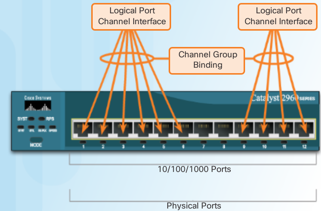
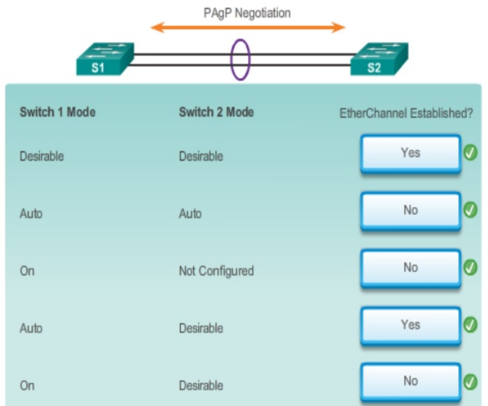
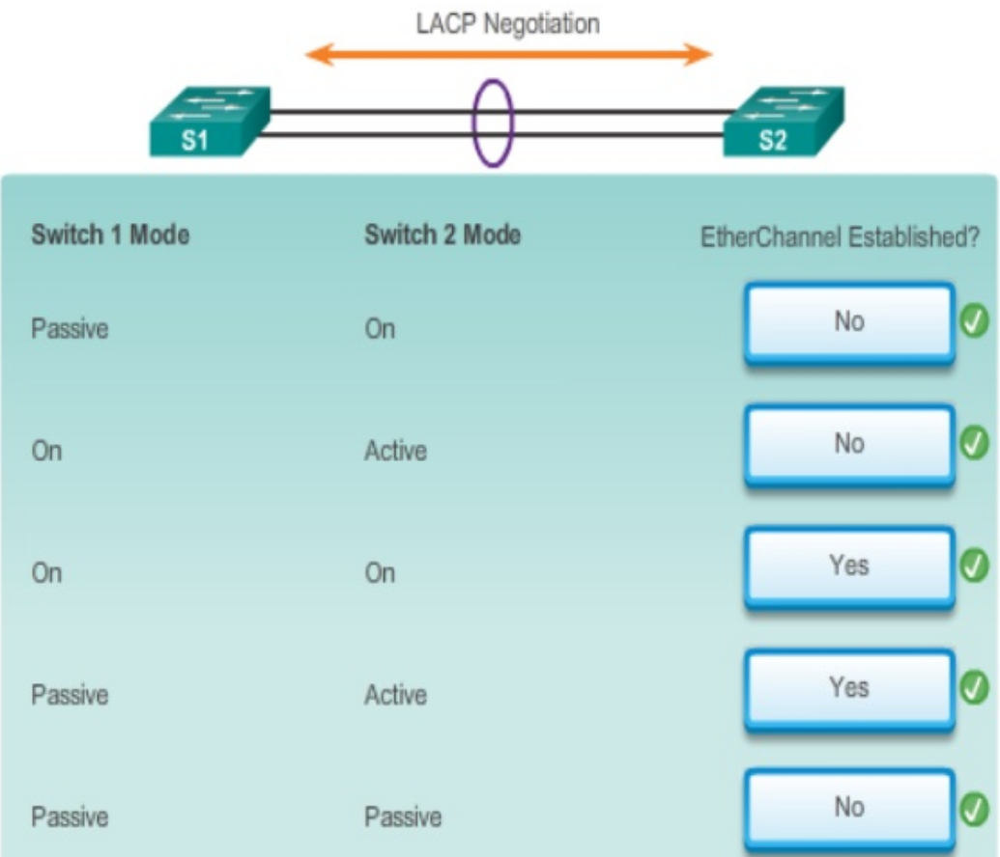
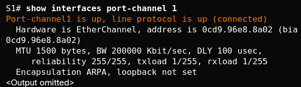
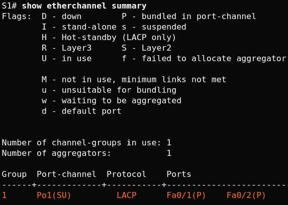
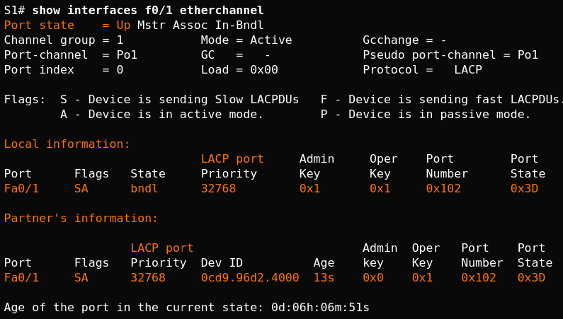
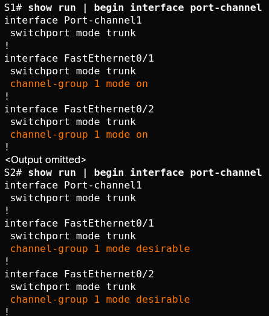
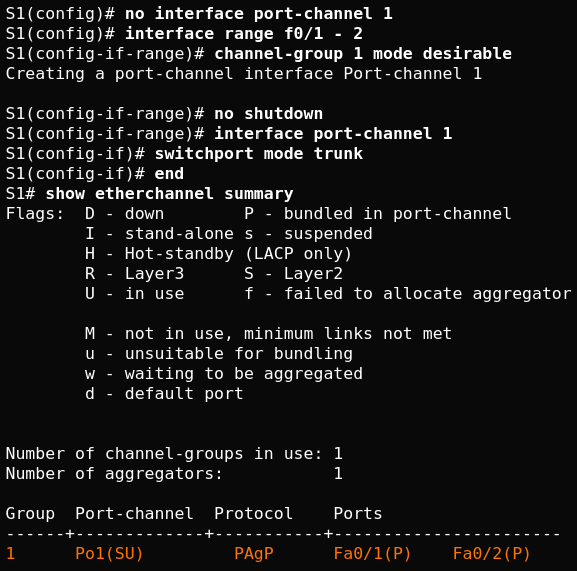

..
    # with overline, for parts
    * with overline, for chapters
    =, for sections
    -, for subsections
    ^, for subsubsections
    “, for paragraphs

Etherchannel - Hot Standby Routing Protocol
===========================================

Restrictions
------------

.. note:: Interface types cannot be mixed; for example, Fast Ethernet and Gigabit Ethernet cannot be mixed within a single EtherChannel

.. note:: The EtherChannel provides full-duplex bandwidth up to 800 Mb/s (Fast EtherChannel) or 8 Gb/s (Gigabit EtherChannel) between one switch and another switch or host. Currently each EtherChannel can consist of up to eight compatibly-configured Ethernet ports atm.

.. note:: IOS switch can currently support six EtherChannels (so 6 x 8 ports max)

- The individual EtherChannel group member port configuration must be consistent on both devices. If the physical ports of one side are configured as trunks, the physical ports of the other side must also be configured as trunks within the same native VLAN. Additionally, all ports in each EtherChannel link must be configured as Layer 2 ports.

- Each EtherChannel has a logical port channel interface, illustrated in the figure. A configuration applied to the port channel interface affects all physical interfaces that are assigned to that interface.

.. note:: Layer 3 EtherChannels can be configured on Cisco Catalyst multilayer switches, such as the Catalyst 3560

Port Aggregation Protocol PAgP
------------------------------

PAgP modes:

 - On: Channel member without negotiation (no protocol).
 - Desirable: Actively asking if the other side can or will participate.
 - Auto: Passively waiting for the other side.
   
The EtherChannel is then added to the spanning tree as a single port.

When enabled, PAgP also manages the EtherChannel. PAgP packets are sent every 30 seconds. PAgP checks for configuration consistency and manages link additions and failures between two switches. It ensures that when an EtherChannel is created, all ports have the same type of configuration.

.. note:: In EtherChannel, it is mandatory that all ports have the same speed, duplex setting, and VLAN information. Any port modification after the creation of the channel also changes all other channel ports.
    
 +-------------------+----------------+-----------------------+----------------------------------+
 | S1                | S2             | Channel Establishment | comments                         |
 +===================+================+=======================+==================================+
 | On                | On             | Yes                   | channel but no PAgP              |
 +-------------------+----------------+-----------------------+----------------------------------+
 | Auto/Desirable    | Desirable      | Yes                   | desirable initiates negotiations |
 +-------------------+----------------+-----------------------+----------------------------------+
 | On/Auto/Desirable | Not Configured | No                    | responds to rcvd packets         |
 +-------------------+----------------+-----------------------+----------------------------------+
 | On                | Desirable      | No                    | on doesn't negotiate             |
 +-------------------+----------------+-----------------------+----------------------------------+
 | Auto/On           | Auto           | No                    | both passive, don't initiate     |
 +-------------------+----------------+-----------------------+----------------------------------+

LACP (802.3ad now 802.1AX)
--------------------------

LACP modes:

 - On: Channel member without negotiation (no protocol).
 - Active: Actively asking if the other side can or will participate.
 - Passive: Passively waiting for the other side.
    
 +-------------------+----------------+-----------------------+
 | S1                | S2             | Channel Establishment |
 +===================+================+=======================+
 | On                | On             | Yes                   |
 +-------------------+----------------+-----------------------+
 | Active/Passive    | Active         | Yes                   |
 +-------------------+----------------+-----------------------+
 | On/Active/Passive | Not Configured | No                    |
 +-------------------+----------------+-----------------------+
 | On                | Active         | No                    |
 +-------------------+----------------+-----------------------+
 | Passive/On        | Passive        | No                    |
 +-------------------+----------------+-----------------------+

.. note:: LACP allows for eight active links, and also eight standby links. A standby link will become active should one of the current active links fail.

Configuration Guidelines
------------------------

The following guidelines and restrictions are useful for configuring EtherChannel:

 - EtherChannel support 
   All Ethernet interfaces on all modules must support EtherChannel with no requirement that interfaces be physically contiguous, or on the same module.
 - Speed and duplex 
   Configure all interfaces in an EtherChannel to operate at the same speed and in the same duplex mode.
 - VLAN match 
   All interfaces in the EtherChannel bundle must be assigned to the same VLAN, or be configured as a trunk (also shown in the figure).
 - Range of VLANs 
   An EtherChannel supports the same allowed range of VLANs on all the interfaces in a trunking EtherChannel. If the allowed range of VLANs is not the same, the interfaces do not form an EtherChannel, even when set to auto or desirable mode.
 
.. note:: Any configuration that is applied to the port channel interface also affects individual interfaces. However, configurations that are applied to the individual interfaces do not affect the port channel interface. Therefore, making configuration changes to an interface that is part of an EtherChannel link may cause interface compatibility issues.

.. note:: The port channel can be configured in access mode, trunk mode (most common), or on a routed port.

Configuring Etherchannel LACP
-----------------------------

#. Specify the interfaces, good practice is to shut em down

   .. code::
      
      S1(config)# interface range FastEthernet0/1 - 2
      S1(config-if-range)# channel-group 1 mode active
      S1(config-if-range)# interface port-channel 1
      S1(config-if-range)# no shutdown
      S1(config-if)# switchport mode trunk
      S1(config-if)# switchport trunk allowed vlan 1,2,20

#. Create the port channel interface with the channel-group identifier mode active command in interface range

   .. code::

      S2(config)# interface range f0/23 - 24
      S2(config-if-range)# channel-group 3 mode ?
       active     Enable LACP unconditionally
       auto       Enable PAgP only if a PAgP
       device is detected
       desirable  Enable PAgP unconditionally
       on         Enable Etherchannel only
       passive    Enable LACP only if a LACP device is detected
      S2(config-if-range)# channel-group 3 mode active

#. Enter port channel interface configuration mode to configure the ports

   .. code::

      S2(config-if-range)# interface port-channel 1
      S2(config-if)# switchport mode trunk
      S2(config-if)# switchport trunk native vlan 99

      S3(config)# interface port-channel 1
      S3(config-if)# switchport mode trunk
      S3(config-if)# switchport trunk native vlan 99

#. Verify configuration
   
   .. code::
   
      S1# show run interface f0/3
      S1# show interfaces f0/3 switchport
      
      Verify that the ports have been aggregated.
      -------------------------------------------
      S1# show etherchannel summary
      S3# show etherchannel summary
      Flags:  D - down        P - bundled in port-channel
              I - stand-alone s - suspended
              H - Hot-standby (LACP only)
              R - Layer3      S - Layer2
              U - in use      f - failed to allocate aggregator
              M - not in use, minimum links not met
          u - unsuitable for bundling
          w - waiting to be aggregated
          d - default port

       Number of channel-groups in use: 1
       Number of aggregators:           1

       Group  Port-channel  Protocol    Ports
       ------+-------------+-----------+-----------------------------------------------
       1      Po1(SU)         PAgP      Fa0/3(P)    Fa0/4(P)
      
      Verify that the ports are configured as trunk ports
      ---------------------------------------------------
      show interfaces trunk
      show spanning-tree

Verifying Commands
------------------

show interfaces port-channel x

show etherchannel summary

show etherchannel port-channel

.. code::

   S1# show etherchannel port-channel 
   
   Channel-group listing: 
   ----------------------
   
   Group: 1 
   ----------
   Port-channels in the group: 
   ---------------------------
   
   Port-channel: Po1    (Primary Aggregator)
   
   ------------
   
   Age of the Port-channel   = 0d:06h:23m:49s
   Logical slot/port   = 2/1          Number of ports = 2
   HotStandBy port = null 
   Port state          = Port-channel Ag-Inuse 
   Protocol            =   LACP
   Port security       = Disabled
   
   Ports in the Port-channel: 
   
   Index   Load   Port     EC state        No of bits
   ------+------+------+------------------+-----------
     0     55     Fa0/1    Active             4
     1     45     Fa0/2    Active             4
   
   Time since last port bundled:    0d:05h:52m:59s    Fa0/2
   Time since last port Un-bundled: 0d:05h:53m:05s    Fa0/2

show interfaces f0/1 etherchannel

commands summary
^^^^^^^^^^^^^^^^

.. code::

   show interfaces port-channel
   show etherchannel summary
   show etherchannel port-channel
   show interfaces etherchannel
   show run | begin interface port-channel

troubleshooting
---------------

Assign all ports in the EtherChannel to the same VLAN, or configure them as trunks. Ports with different native VLANs cannot form an EtherChannel.

    When configuring a trunk on an EtherChannel, verify the trunking mode on the EtherChannel. It is not recommended that you configure trunking mode on individual ports that make up the EtherChannel. But if it is done, verify that the trunking configuration is the same on all interfaces.

    An EtherChannel supports the same allowed range of VLANs on all the ports. If the allowed range of VLANs is not the same, the ports do not form an EtherChannel even when PAgP is set to the auto or desirable mode.

    The dynamic negotiation options for PAgP and LACP must be compatibly configured on both ends of the EtherChannel.

Note: It is easy to confuse PAgP or LACP with DTP, because they both are protocols used to automate behavior on trunk links. PAgP and LACP are used for link aggregation (EtherChannel). DTP is used for automating the creation of trunk links. When an EtherChannel trunk is configured, typically EtherChannel (PAgP or LACP) is configured first and then DTP.

interfaces F0/1 and F0/2 on switches S1 and S2 are connected with an EtherChannel. The output indicates that the EtherChannel is down.

.. code::

   S1# show etherchannel summary
   Flags:  D - down        P - bundled in port-channel 
           I - stand-alone s - suspended 
           H - Hot-standby (LACP only)
           R - Layer3      S - Layer2 
           U - in use      f - failed to allocate aggregator 
   		
           M - not in use, minimum links not met 
           u - unsuitable for bundling
           w - waiting to be aggregated 
           d - default port
   		
   		
   Number of channel-groups in use: 1
   Number of aggregators:           1 

   Group  Port-channel  Protocol    Ports
   ------+-------------+-----------+------------------------- 
   1      Po1(SD)          -        Fa0/1(D)    Fa0/2(D)      
   

above, more detailed output indicates that there are incompatible PAgP modes configured on S1 and S2.

As you can see, the PAgP mode on the EtherChannel is changed to desirable and the EtherChannel becomes active.

.. warning:: EtherChannel and spanning tree must interoperate. For this reason, the order in which EtherChannel-related commands are entered is important, which is why above you see interface Port-Channel 1 removed and then re-added with the channel-group command, as opposed to directly changed. If one tries to change the configuration directly, spanning tree errors cause the associated ports to go into blocking or errdisabled state.

First Hop Redundancy Protocols
------------------------------

.. image:: ../../../_static/img/4_la_hsrp_steps_router_failover.png

#. The standby router stops seeing Hello messages from the forwarding router
#. The standby router assumes the role of the forwarding router
#. Because the new forwarding router assumes both the IPv4 and MAC addresses of the virtual router, the host devices see no disruption in service

Default Gateway Limitations
---------------------------

.. note: For the purposes of the discussion on router redundancy, there is no functional difference between a multilayer switch and a router at the distribution layer. In practice, it is common for a multilayer switch to act as the default gateway for each VLAN in a switched network. This discussion focuses on the functionality of routing, regardless of the physical device used.

- Hot Standby Router Protocol (HSRP) 
   A Cisco-proprietary FHRP designed to allow for transparent failover of a first-hop IPv4 device. HSRP provides high network availability by providing first-hop routing redundancy for IPv4 hosts on networks configured with an IPv4 default gateway address. HSRP is used in a group of routers for selecting an active device and a standby device. In a group of device interfaces, the active device is the device that is used for routing packets; the standby device is the device that takes over when the active device fails, or when pre-set conditions are met. The function of the HSRP standby router is to monitor the operational status of the HSRP group and to quickly assume packet-forwarding responsibility if the active router fails.

- HSRP for IPv6
   Cisco-proprietary FHRP providing the same functionality of HSRP, but in an IPv6 environment.
   An HSRP IPv6 group has a virtual MAC address derived from the HSRP group number and a virtual IPv6 link-local address derived from the HSRP virtual MAC address. Periodic router advertisements (RAs) are sent for the HSRP virtual IPv6 link-local address when the HSRP group is active. When the group becomes inactive these RAs stop after a final RA is sent. 

- Virtual Router Redundancy Protocol version 2 (VRRPv2)
   A non-proprietary election protocol that dynamically assigns responsibility for one or more virtual routers to the VRRP routers on an IPv4 LAN. This allows several routers on a multiaccess link to use the same virtual IPv4 address. A VRRP router is configured to run the VRRP protocol in conjunction with one or more other routers attached to a LAN. In a VRRP configuration, one router is elected as the virtual router master, with the other routers acting as backups, in case the virtual router master fails.
 
- VRRPv3
   Provides the capability to support IPv4 and IPv6 addresses. VRRPv3 works in multi-vendor environments and is more scalable than VRRPv2

- Gateway Load Balancing Protocol (GLBP)
   Cisco-proprietary FHRP that protects data traffic from a failed router or circuit, like HSRP and VRRP, while also allowing load balancing (also called load sharing) between a group of redundant routers.

- GLBP for IPv6
   Cisco-proprietary FHRP providing the same functionality of GLBP, but in an IPv6 environment. GLBP for IPv6 provides automatic router backup for IPv6 hosts configured with a single default gateway on a LAN. Multiple first-hop routers on the LAN combine to offer a single virtual first-hop IPv6 router while sharing the IPv6 packet forwarding load.

- ICMP Router Discovery Protocol (IRDP)
   Specified in RFC 1256, is a legacy FHRP solution. IRDP allows IPv4 hosts to locate routers that provide IPv4 connectivity to other (nonlocal) IP networks.

VIRTUAL ROUTER
--------------

One way to prevent a single point of failure at the default gateway, is to implement a virtual router. To implement this type of router redundancy, multiple routers are configured to work together to present the illusion of a single router to the hosts on the LAN

HOT STANDBY Router Protocol (HSRP)
----------------------------------

group of routers - active and standby
virtual ip and macs are shared between them
verify HSRP: show standby

VRRP = standard protocol

Gateway Load Balancing Protocol (GLBP)
--------------------------------------

Cisco-proprietary FHRP that protects data traffic from a failed router or circuit, like HSRP and VRRP, while also allowing load balancing (also called load sharing) between a group of redundant routers.

GLBP for IPv6 - Cisco-proprietary FHRP providing the same functionality of GLBP, but in an IPv6 environment. GLBP for IPv6 provides automatic router backup for IPv6 hosts configured with a single default gateway on a LAN. Multiple first-hop routers on the LAN combine to offer a single virtual first-hop IPv6 router while sharing the IPv6 packet forwarding load.

ICMP Router Discovery Protocol (IRDP) - Specified in RFC 1256, is a legacy FHRP solution. IRDP allows IPv4 hosts to locate routers that provide IPv4 connectivity to other (nonlocal) IP networks.

HSRPv1			HSRPv2
groups 0 to 255		0 to 4095
MC 224.0.0.2		224.0.0.102 or FF02::66 to send hello packets
0000.0C07.AC00-ACFF	0000.0C9F.F000-FFFF IPv4 and 0005.73A0.0000-0FFF for IPv6
(last 2  #s = group)	(last 3 = group)
support for MD5

HSRP Preemption
---------------

By default, after a router becomes the active router, it will remain the active router even if another router comes online with a higher HSRP priority.

To force a new HSRP election process, preemption must be enabled using the standby preempt interface command. Preemption is the ability of an HSRP router to trigger the re-election process. With preemption enabled, a router that comes online with a higher HSRP priority will assume the role of the active router.

Preemption only allows a router to become the active router if it has a higher priority. A router enabled for preemption, with equal priority but a higher IPv4 address will not preempt an active router. Refer to the topology in the figure.

After power is restored, R1 comes back online. Because R1 has a higher priority and preemption is enabled, it will force a new election process. R1 will re-assume the role of the active router and R2 will fall back to the role of the standby router.

Note: With preemption disabled, the router that boots up first will become the active router if there are no other routers online during the election process.

HSRP States
-----------
	
Initial
This state is entered through a configuration change or when an interface first becomes available.
		
Learn
The router has not determined the virtual IP address and has not yet seen a hello message from the active router. In this state, the router waits to hear from the active router.
		
Listen
The router knows the virtual IP address, but the router is neither the active router nor the standby router. It listens for hello messages from those routers.
		
Speak
The router sends periodic hello messages and actively participates in the election of the active and/or standby router.
		
Standby
The router is a candidate to become the next active router and sends periodic hello messages.
		
Active
The router currently forwards packets that are sent to the group virtual MAC address. The router sends periodic hello messages.

The active and standby HSRP routers send hello packets to the HSRP group multicast address every 3 seconds, by default. The standby router will become active if it does not receive a hello message from the active router after 10 seconds. You can lower these timer settings to speed up the failover or preemption. However, to avoid increased CPU usage and unnecessary standby state changes, do not set the hello timer below 1 second or the hold timer below 4 seconds.

HSRP Configuration
------------------

.. code::

   R1(config)# interface g0/1
   R1(config-if)# ip address 172.16.10.2 255.255.255.0
   R1(config-if)# standby version 2
   R1(config-if)# standby 1 ip 172.16.10.1
   R1(config-if)# standby 1 priority 150
   R1(config-if)# standby 1 preempt
   R1(config-if)# no shutdown
   !!!!!!!!!!!!!!!!!!!!!!!!!!!!!!!!!!!!!!!!!!!!!!!!!!!!!!!!!!!
   R2(config)# interface g0/1 
   R2(config-if)# ip address 172.16.10.3 255.255.255.0
   R2(config-if)# standby version 2
   R2(config-if)# standby 1 ip 172.16.10.1 
   R2(config-if)# no shutdown
   
   R2 has been configured for HSRP group 10 with default priority, IP address 172.16.10.3, and virtual IP address 172.16.10.1. R1 is configured with the following:
   
   R1(config)# interface GigabitEthernet0/1
   R1(config)# ip address 172.16.10.2 255.255.255.0
   R1(config)# no shutdown
   
   You are currently in interface configuration mode for GigabitEthernet 0/1. 
   Configure R1 as the HSRP active router using a priority of 150.
   Return to privileged EXEC mode and display the brief standby status.
   R1(config-if)# standby 10 ip 172.16.10.1
   R1(config-if)# standby 10 priority 150
   %HSRP-6-STATECHANGE: GigabitEthernet0/1 Grp 10 state Speak -> Standby
   %HSRP-6-STATECHANGE: GigabitEthernet0/1 Grp 10 state Standby -> Active
   R1(config)# end
   R1# show standby brief
                        P indicates configured to preempt.
                        |
   Interface   Grp  Pri P State   Active          Standby         Virtual IP
   Gi0/1       10   150   Active  local           172.16.10.3     172.16.10.1
   You successfully configured and verified HSRP.
   
   R2# show standby
   GigabitEthernet0/1 - Group 1 (version 2)
     State is Standby
       5 state changes, last state change 01:03:59
     Virtual IP address is 172.16.10.1
     Active virtual MAC address is 0000.0c9f.f001
       Local virtual MAC address is 0000.0c9f.f001 (v2 default)
     Hello time 3 sec, hold time 10 sec
       Next hello sent in 0.944 secs
     Preemption disabled
     Active router is 172.16.10.2, priority 150 (expires in 8.160 sec)
       MAC address is fc99.4775.c3e1
     Standby router is local
     Priority 100 (default 100)
     Group name is "hsrp-Gi0/1-1" (default)
   R2#
   
   Configure HSRP on R1
   R1(config)# 
   interface g0/1
   R1(config-if)# standby version 2
   R1(config-if)# standby 1 ip 192.168.1.254
   R1(config-if)# standby 1 priority 150
   R1(config-if)# standby 1 preempt
   
   Configure HSRP on R3
   R3(config)# interface g0/1
   R3(config-if)# standby version 2
   R3(config-if)# standby 1 ip 192.168.1.254
   
   Verify HSRP by issuing the show standby command on R1 and R3
   
   R1# show standby
   GigabitEthernet0/1 - Group 1 (version 2)
   State is Active
    4 state changes, last state change 00:00:30
   Virtual IP address is 192.168.1.254
   Active virtual MAC address is 0000.0c9f.f001
    Local virtual MAC address is 0000.0c9f.f001 (v2 default)
   Hello time 3 sec, hold time 10 sec
    Next hello sent in 1.696 secs
   Preemption enabled
   Active router is local
   Standby router is 192.168.1.3, priority 100 (expires in 11.120 sec)
   Priority 150 (configured 150)
   Group name is "hsrp-Gi0/1-1" (default)
   
   R3# show standby
   GigabitEthernet0/1 - Group 1 (version 2)
   State is Standby
    4 state changes, last state change 00:02:29
   Virtual IP address is 192.168.1.254
   Active virtual MAC address is 0000.0c9f.f001
    Local virtual MAC address is 0000.0c9f.f001 (v2 default)
   Hello time 3 sec, hold time 10 sec
    Next hello sent in 0.720 secs
   Preemption disabled
   Active router is 192.168.1.1, priority 150 (expires in 10.128 sec)
    MAC address is d48c.b5ce.a0c1
   Standby router is local
   Priority 100 (default 100)
   Group name is "hsrp-Gi0/1-1" (default)

Troubleshooting HSRP Failure
----------------------------

- Failing to successfully elect the active router that controls the virtual IP for the group.

- Failure of the standby router to successfully keep track of the active router.

- Failing to determine when control of the virtual IP for the group should be handed over to another router.

- Failure of end devices to successfully configure the virtual IP address as the default gateway.

    
Common HSRP Configuration Issues
--------------------------------

- The HSRP routers are not connected to the same network segment. Although this could be a physical layer issue, it could also be a VLAN subinterface configuration issue.

- The HSRP routers are not configured with IPv4 addresses from the same subnet. HSRP hello packets are local. They are not routed beyond the network segment. Therefore, a standby router would not know when the active router fails.

- The HSRP routers are not configured with the same virtual IPv4 address. The virtual IPv4 address is the default gateway for end devices.

- The HSRP routers are not configured with the same HSRP group number. This will cause each router to assume the active role.

- End devices are not configured with the correct default gateway address. Although not directly related to HSRP, configuring the DHCP server with one of the HSRP router’s real IP addresses would mean that end devices would only have connectivity to remote networks when that HSRP router is active.

- Because R1 is configured with the standby 1 preempt command, it initiates a coup and assumes the role of active route

.. code::

   R1# 
    Dec  2 18:01:30.183: HSRP: Gi0/1 Nbr 172.16.10.2 Adv in, active 0  passive 1
    Dec  2 18:01:30.183: HSRP: Gi0/1 Nbr 172.16.10.2 created
    Dec  2 18:01:30.183: HSRP: Gi0/1 Nbr 172.16.10.2 is passive
    Dec  2 18:01:32.443: HSRP: Gi0/1 Nbr 172.16.10.2 Adv in, active 1  passive 1
    Dec  2 18:01:32.443: HSRP: Gi0/1 Nbr 172.16.10.2 is no longer passive
    Dec  2 18:01:32.443: HSRP: Gi0/1 Nbr 172.16.10.2 destroyed
    Dec  2 18:01:32.443: HSRP: Gi0/1 Grp 1 Coup   in  172.16.10.2 Listen   pri 150 vIP 172.16.10.1
    Dec  2 18:01:32.443: HSRP: Gi0/1 Grp 1 Active: j/Coup rcvd from higher  pri router (150/172.16.10.2)
    Dec  2 18:01:32.443: HSRP: Gi0/1 Grp 1 Active router is 172.16.10.2,  was local
    Dec  2 18:01:32.443: HSRP: Gi0/1 Nbr 172.16.10.2 created
    Dec  2 18:01:32.443: HSRP: Gi0/1 Nbr 172.16.10.2 active for group 1
    Dec  2 18:01:32.443: HSRP: Gi0/1 Grp 1 Active -> Speak
    Dec  2 18:01:32.443: %HSRP-5-STATECHANGE: GigabitEthernet0/1 Grp 1  state Active -> Speak
    Dec  2 18:01:32.443: HSRP: Gi0/1 Grp 1 Redundancy "hsrp-Gi0/1-1"   state Active -> Speak
    Dec  2 18:01:32.443: HSRP: Gi0/1 Grp 1 Removed 172.16.10.1 from ARP
    Dec  2 18:01:32.443: HSRP: Gi0/1 IP Redundancy "hsrp-Gi0/1-1" update,  Active -> Speak
    Dec  2 18:01:43.771: HSRP: Gi0/1 Grp 1 Speak: d/Standby timer expired  (unknown)
    Dec  2 18:01:43.771: HSRP: Gi0/1 Grp 1 Standby router is local
    Dec  2 18:01:43.771: HSRP: Gi0/1 Grp 1 Speak -> Standby
   
   
   Issue the debug command to view the HSRP hello packets.
   
   R2# debug standby packets
    Dec  2 15:20:12.347: HSRP: Gi0/1 Grp 1 Hello  in  172.16.10.2 Active  pri 150 vIP 172.16.10.1
    Dec  2 15:20:12.643: HSRP: Gi0/1 Grp 1 Hello  out 172.16.10.3 Standby pri 100 vIP 172.16.10.1
   
    !!!!!!R1 is powered off!!!!!
   
   The preceeding message was received on R2. Issue the debug command to view the HSRP events as R2 assumes the role of active HSRP router for the 172.16.10.0/24 network.
   
   R2# debug standby terse
   HSRP:
     HSRP Errors debugging is on
     HSRP Events debugging is on
       (protocol, neighbor, redundancy, track, arp, interface)
     HSRP Packets debugging is on
       (Coup, Resign)
   R2#
    Dec  2 16:11:31.855: HSRP: Gi0/1 Grp 1 Standby: c/Active timer expired (172.16.10.2)
    Dec  2 16:11:31.855: HSRP: Gi0/1 Grp 1 Active router is local, was 172.16.10.2
    Dec  2 16:11:31.855: HSRP: Gi0/1 Nbr 172.16.10.2 no longer active for group 1 (Standby)
    Dec  2 16:11:31.855: HSRP: Gi0/1 Nbr 172.16.10.2 Was active or standby - start passive holddown
    Dec  2 16:11:31.855: HSRP: Gi0/1 Grp 1 Standby router is unknown, was local
    Dec  2 16:11:31.855: HSRP: Gi0/1 Grp 1 Standby -> Active

 
EtherChannel must have the same speed, duplex setting, and VLAN information on all interfaces on the devices at both ends. Settings configured in the port channel interface configuration mode will also be applied to the individual interfaces in that EtherChannel. Settings configured on individual interfaces will not be applied to the EtherChannel or to the other interfaces in the EtherChannel.

