.. include:: ../../../_static/global.rst

DHCP
====

The DHCPv4 server dynamically assigns, or leases, an IPv4 address from a pool of addresses for a limited period of time chosen by the server, or until the client no longer needs the address.

Clients lease the information from the server for an administratively defined period. Administrators configure DHCPv4 servers to set the leases to time out at different intervals. The lease is typically anywhere from 24 hours to a week or more. When the lease expires, the client must ask for another address, although the client is typically reassigned the same address.

Lease Origination

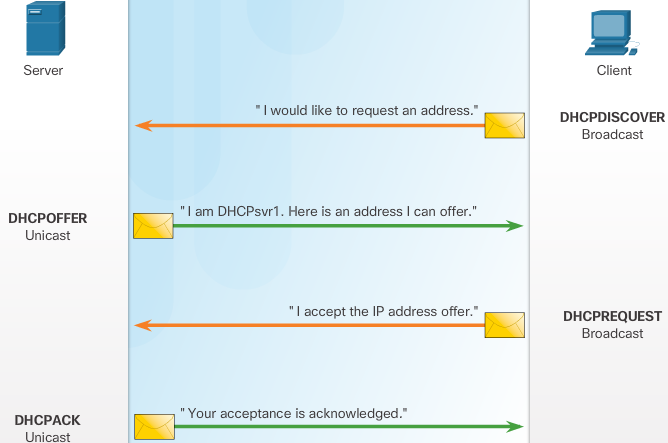

When the client boots (or otherwise wants to join a network), it begins a four step process to obtain a lease. As shown in Figure 2, a client starts the process with a broadcast DHCPDISCOVER message with its own MAC address to discover available DHCPv4 servers.

DHCP Discover (DHCPDISCOVER)

The DHCPDISCOVER message finds DHCPv4 servers on the network. Because the client has no valid IPv4 information at bootup, it uses Layer 2 and Layer 3 broadcast addresses to communicate with the server.

DHCP Offer (DHCPOFFER)

When the DHCPv4 server receives a DHCPDISCOVER message, it reserves an available IPv4 address to lease to the client. The server also creates an ARP entry consisting of the MAC address of the requesting client and the leased IPv4 address of the client. As shown in Figure 3, the DHCPv4 server sends the binding DHCPOFFER message to the requesting client. The DHCPOFFER message is sent as a unicast, using the Layer 2 MAC address of the server as the source address and the Layer 2 MAC address of the client as the destination.

DHCP Request (DHCPREQUEST)

When the client receives the DHCPOFFER from the server, it sends back a DHCPREQUEST message as shown in Figure 4. This message is used for both lease origination and lease renewal. When used for lease origination, the DHCPREQUEST serves as a binding acceptance notice to the selected server for the parameters it has offered and an implicit decline to any other servers that may have provided the client a binding offer.

Many enterprise networks use multiple DHCPv4 servers. The DHCPREQUEST message is sent in the form of a broadcast to inform this DHCPv4 server and any other DHCPv4 servers about the accepted offer.

DHCP Acknowledgment (DHCPACK)

On receiving the DHCPREQUEST message, the server verifies the lease information with an ICMP ping to that address to ensure it is not being used already, creates a new ARP entry for the client lease, and replies with a unicast DHCPACK message as shown in Figure 5. The DHCPACK message is a duplicate of the DHCPOFFER, except for a change in the message type field. When the client receives the DHCPACK message, it logs the configuration information and performs an ARP lookup for the assigned address. If there is no reply to the ARP, the client knows that the IPv4 address is valid and starts using it as its own.

.. image:: ../../../_static/img/Ch8_dhcp4_lease_renewal.png

Lease Renewal

DHCP Request (DHCPREQUEST)

As shown in Figure 6, before the lease expires, the client sends a DHCPREQUEST message directly to the DHCPv4 server that originally offered the IPv4 address. If a DHCPACK is not received within a specified amount of time, the client broadcasts another DHCPREQUEST so that one of the other DHCPv4 servers can extend the lease.

DHCP Acknowledgment (DHCPACK)

On receiving the DHCPREQUEST message, the server verifies the lease information by returning a DHCPACK, as shown in Figure.

DHCPv4 Message Format
---------------------

.. image:: ../../../_static/img/Ch8_dhcp4_message_format.png

+ Operation (OP) Code - Specifies the general type of message. A value of 1 indicates a request message; a value of 2 is a reply message.
+ Hardware Type - Identifies the type of hardware used in the network. For example, 1 is Ethernet, 15 is Frame Relay, and 20 is a serial line. These are the same codes used in ARP messages.
+ Hardware Address Length - Specifies the length of the address.
+ Hops - Controls the forwarding of messages. Set to 0 by a client before transmitting a request.
+ Transaction Identifier - Used by the client to match the request with replies received from DHCPv4 servers.
+ Seconds - Identifies the number of seconds elapsed since a client began attempting to acquire or renew a lease. Used by DHCPv4 servers to prioritize replies when multiple client requests are outstanding.
+ Flags - Used by a client that does not know its IPv4 address when it sends a request. Only one of the 16 bits is used, which is the broadcast flag. A value of 1 in this field tells the DHCPv4 server or relay agent receiving the request that the reply should be sent as a broadcast.
+ Client IP Address - Used by a client during lease renewal when the address of the client is valid and usable, not during the process of acquiring an address. The client puts its own IPv4 address in this field if and only if it has a valid IPv4 address while in the bound state; otherwise, it sets the field to 0.
+ Your IP Address - Used by the server to assign an IPv4 address to the client.
+ Server IP Address - Used by the server to identify the address of the server that the client should use for the next step in the bootstrap process, which may or may not be the server sending this reply. The sending server always includes its own IPv4 address in a special field called the Server Identifier DHCPv4 option.
+ Gateway IP Address - Routes DHCPv4 messages when DHCPv4 relay agents are involved. The gateway address facilitates communications of DHCPv4 requests and replies between the client and a server that are on different subnets or networks.
+ Client Hardware Address - Specifies the physical layer of the client.
+ Server Name - Used by the server sending a DHCPOFFER or DHCPACK message. The server may optionally put its name in this field. This can be a simple text nickname or a DNS domain name, such as dhcpserver.netacad.net.
+ Boot Filename - Optionally used by a client to request a particular type of boot file in a DHCPDISCOVER message. Used by a server in a DHCPOFFER to fully specify a boot file directory and filename.
+ DHCP Options - Holds DHCP options, including several parameters required for basic DHCP operation. This field is variable in length. Both client and server may use this field.

DHCPv4 Discover Message
-----------------------

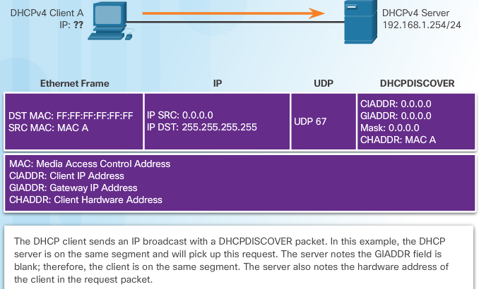

As shown in Figure 1, the client IPv4 address (CIADDR), default gateway address (GIADDR), and subnet mask are all marked to indicate that the address 0.0.0.0 is used.

Note: Unknown information is sent as 0.0.0.0.

When the DHCPv4 server receives the DHCPDISCOVER message, it responds with a DHCPOFFER message. This message contains initial configuration information for the client, including the IPv4 address that the server offers, the subnet mask, the lease duration, and the IPv4 address of the DHCPv4 server making the offer.

The DHCPOFFER message can be configured to include other information, such as the lease renewal time and DNS address.

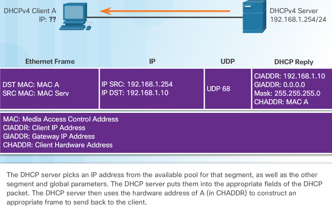

As shown now, the DHCP server responds to the DHCPDISCOVER by assigning values to the CIADDR and subnet mask. The frame is constructed using the client hardware address (CHADDR) and sent to the requesting client.

The client and server send acknowledgment messages, and the process is complete.

DHCPv4 basic server configuration
---------------------------------

.. code::
   
   step 1 excluding addresses
   --------------------------
   R1(config)#ip dhcp excluded-address 192.168.10.1 192.168.10.9
   R1(config)#ip dhcp excluded-address 192.168.10.254
   
   step 2 configuring a pool
   -------------------------
   R1(config)#ip dhcp pool LAN-POOL-1
   R1(dhcp-config)#

   step 3 configuring specific tasks
   ---------------------------------
   R1(dhcp-config)# network network-number [mask | /prefix-length]
   R1(dhcp-config)# network 192.168.10.0 255.255.255.0

   R1(dhcp-config)# default-router address address2...address8
   R1(dhcp-config)# default-router 192.168.10.1

   R1(dhcp-config)# dns-server address address2...address8
   R1(dhcp-config)# dns-server 192.168.11.5

   R1(dhcp-config)# domain-name example.com
   
   R1(dhcp-config)# lease {days [hours] [minutes] | infinite}
   R1(dhcp-config)# 

   optional
   --------
   R1(dhcp-config)# netbios-name-server 192.168.x.x addr2..addr8

disable DHCPv4 with the ``no service dhcp`` global config mode command

Verifying DHCPv4
----------------

``show running-config | section dhcp``

.. code::

   Router> show ip dhcp server statistics
   --------------------------------------
   Memory usage          40392
   Address pools         3
   Database agents       1
   Automatic bindings    190
   Manual bindings       1
   Expired bindings      3
   Malformed messages    0
   
   Message               Received
   BOOTREQUEST           12
   DHCPDISCOVER          200
   DHCPREQUEST           178
   DHCPDECLINE           0
   DHCPRELEASE           0
   DHCPINFORM            0
   
   Message               Sent
   BOOTREPLY             12
   DHCPOFFER             190
   DHCPACK               172
   DHCPNAK               6
   Release

   Router#show ip dhcp binding
   ---------------------------
   Bindings from all pools not associated with VRF:
   IP address   Client-ID/    Lease expiration     Type
                Hardware address/
                User name
   10.0.2.1 0100.1e68.ffd3.5f Oct 12 2016 10:08 PM Automatic

   Router#show ip dhcp pool
   ------------------------
   Pool dmz :
   Utilization mark (high/low) : 100 / 0
   Subnet size (first/next) : 0 / 0
   Total addresses : 254
   Leased addresses : 1
   Pending event : none
   1 subnet is currently in the pool :
   Current index IP address range Leased addresses
   10.0.2.2 10.0.2.1 - 10.0.2.254 1

   
show dhcp lease information on debian

.. code::

   patrick@debian:~[brunswyck:docu.git master|!?]$ cat /var/lib/dhcp/dhclient.leases
   lease {
     interface "eno2";
     fixed-address 192.168.111.116;
     option subnet-mask 255.255.255.0;
     option routers 192.168.110.1;
     option dhcp-lease-time 7200;
     option dhcp-message-type 5;
     option domain-name-servers 208.67.222.222,208.67.220.220,8.8.8.8;
     option dhcp-server-identifier 192.168.111.1;
     option domain-name "home";
     renew 3 2017/09/13 08:33:03;
     rebind 3 2017/09/13 09:23:03;
     expire 3 2017/09/13 09:38:03;
   }

Configure DHCPv4 relay
----------------------

.. code::

   R1(config)# interface g0/0
   R1(config-if)# ip helper-address 192.168.11.6
   confirm with
   R1# show ip interface g0/0
   ...Helper address is 192.168.11.6...

DHCPv4 Exercises
----------------

8.1.2.3 lab - configuring basic dhcpv4
^^^^^^^^^^^^^^^^^^^^^^^^^^^^^^^^^^^^^^

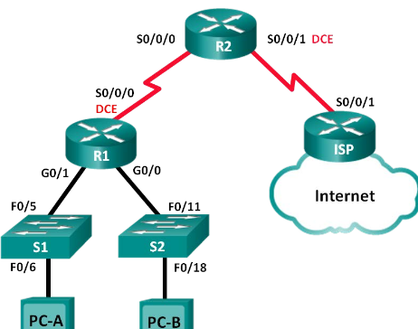

Required Resources
+ 3 Routers (Cisco 1941 with Cisco IOS Release 15.2(4)M3 universal image or comparable)
+ 2 Switches (Cisco 2960 with Cisco IOS Release 15.0(2) lanbasek9 image or comparable)

R1 = relay agent

R2 = DHCPv4 server

you will configure a DHCP address pool for each of the R1 LANs. Use the pool name R1G0for the G0/0 LAN and R1G1for the G0/1 LAN.

You will also configure the addresses to be excluded from the address pools. Best practice dictates that excluded addresses be configured first, to guarantee that they are not accidentally leased to other devices.

Exclude the first 9 addresses in each R1 LAN starting with .1. All other addresses should be available in the DHCP address pool. Make sure that each DHCP address pool includes a default gateway, the domain ccna-lab.com, a DNS server (209.165.200.225), and a lease time of 2 days.

On the lines below, write the commands necessary for configuring DHCP services on router R2, including the DHCP-excluded addresses and the DHCP address pools.

 +--------+--------------+-----------------+-----------------+-----------------+
 | Device | Interface    | IP Address      | Subnet Mask     | Default Gateway |
 +========+==============+=================+=================+=================+
 | R1     | G0/0         | 192.168.0.1     | 255.255.255.0   | N/A             |
 +--------+--------------+-----------------+-----------------+-----------------+
 |        | G0/1         | 192.168.1.1     | 255.255.255.0   | N/A             |
 +--------+--------------+-----------------+-----------------+-----------------+
 |        | S0/0/0 (DCE) | 192.168.2.253   | 255.255.255.252 | N/A             |
 +--------+--------------+-----------------+-----------------+-----------------+
 | R2     | S0/0/0       | 192.168.2.254   | 255.255.255.252 | N/A             |
 +--------+--------------+-----------------+-----------------+-----------------+
 |        | S0/0/1 (DCE) | 209.165.200.226 | 255.255.255.224 | N/A             |
 +--------+--------------+-----------------+-----------------+-----------------+
 | ISP    | S0/0/1       | 209.165.200.225 | 255.255.255.224 | N/A             |
 +--------+--------------+-----------------+-----------------+-----------------+
 | PC-A   | NIC          | DHCP            | DHCP            | DHCP            |
 +--------+--------------+-----------------+-----------------+-----------------+
 | PC-B   | NIC          | DHCP            | DHCP            | DHCP            |
 +--------+--------------+-----------------+-----------------+-----------------+

.. code::
   
   basic config
   ------------
   no ip domain-lookup 
   service password-encryption 
   enable secret class 
   banner motd # 
   Unauthorized access is strictly prohibited. # 
   line con 0 
   password cisco 
   login 
   logging synchronous 
   line vty 0 4 
   password cisco 
   login
 
.. code::

   Configure RIPv2 for R1
   ----------------------
   R1(config)# router rip
   R1(config-router)# version 2
   R1(config-router)# network 192.168.0.0
   R1(config-router)# network 192.168.1.0
   R1(config-router)# network 192.168.2.252
   R1(config-router)# no auto-summary
   
   Configure RIPv2 and a default route to the ISP on R2
   ----------------------------------------------------
   R2(config)# router rip
   R2(config-router)# version 2
   R2(config-router)# network 192.168.2.252
   R2(config-router)# default-information originate
   R2(config-router)# exit 
   R2(config)# ip route 0.0.0.0 0.0.0.0 209.165.200.225

   Configure  a summary static route on ISP to reach the networks on the R1 and R2 routers
   ---------------------------------------------------------------------------------------
   ISP(config)# ip route 192.168.0.0 255.255.252.0 209.165.200.226    

   Router R1 as a DHCP relay agent
   -------------------------------
   R1(config)# interface g0/0
   R1(config-if)# ip helper-address 192.168.2.254 
   R1(config-if)# exit 
   R1(config-if)# interface g0/1
   R1(config-if)# ip helper-address 192.168.2.254
   
   Router R2
   ---------
   R2(config)# ip dhcp excluded-address 192.168.0.1 192.168.0.9
   R2(config)# ip dhcp excluded-address 192.168.1.1 192.168.1.9
   R2(config)# ip dhcp pool R1G1
   R2(dhcp-config)# network 192.168.1.0 255.255.255.0
   R2(dhcp-config)# default-router 192.168.1.1
   R2(dhcp-config)# dns-server 209.165.200.225
   R2(dhcp-config)# domain-name ccna-lab.com
   R2(dhcp-config)# lease 2
   R2(dhcp-config)# exit 
   R2(config)# ip dhcp pool R1G0
   R2(dhcp-config)# network 192.168.0.0 255.255.255.0
   R2(dhcp-config)# default-router 192.168.0.1
   R2(dhcp-config)# dns-server 209.165.200.225
   R2(dhcp-config)# domain-name ccna-lab.com
   R2(dhcp-config)# lease 2

verify with ``show ip dhcp binding`` & ``show ip dhcp server statistics`` & ``show run | section dhcp``

8.1.2.5 lab - basic dhcpv4 on a switch
^^^^^^^^^^^^^^^^^^^^^^^^^^^^^^^^^^^^^^

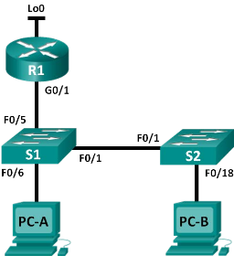

Required Resources
+ Router (Cisco 1941 with Cisco IOS Release 15.2(4)M3 universal image or comparable)
+ 2 Switches (Cisco 2960 with Cisco IOS Release 15.0(2) lanbasek9 image or comparable)

+--------+-----------+-----------------+-----------------+
| Device | Interface | IP Address      | Subnet Mask     |
+========+===========+=================+=================+
| R1     | G0/1      | 192.168.1.10    | 255.255.255.0   |
+--------+-----------+-----------------+-----------------+
|        | Lo0       | 209.165.200.225 | 255.255.255.224 |
+--------+-----------+-----------------+-----------------+
| S1     | VLAN 1    | 192.168.1.1     | 255.255.255.0   |
+--------+-----------+-----------------+-----------------+
|        | VLAN 2    | 192.168.2.1     | 255.255.255.0   |
+--------+-----------+-----------------+-----------------+

display SDM preference on S1

.. code::

   S1#show sdm prefer
   The current template is "default" template. 
   The selected template optimizes the resources in 
   the switch to support this level of features for 
   0 routed interfaces and 255 VLANs.  
     number of unicast mac addresses:                  8K 
     number of IPv4 IGMP groups:                       0.25K 
     number of IPv4/MAC qos aces:                      0.125k 
     number of IPv4/MAC security aces:                 0.375k

change SDM preference to lanbase-routing

.. code::

   S1(config)# sdm prefer lanbase-routing
   Changes to the running SDM preferences have been stored, but cannot take effect  
   until the next reload. 
   Use 'show sdm prefer' to see what SDM preference is currently active.

   S1# reload
   S1# show sdm prefer

.. note:: The new template will be used after reboot even if the running configuration has not been saved. To save the running configuration, answer yes after reload command.

Configure DHCP for VLAN 1
~~~~~~~~~~~~~~~~~~~~~~~~~

a. Exclude the first 10 valid host addresses from network 192.168.1.0/24
b. Create a DHCP pool named DHCP1
c. Assign the network 192.168.1.0/24 for available addresses
d. Assign the default gateway as 192.168.1.1
e. Assign the DNS server as 192.168.1.9
f. Assign a lease time of 3 day
g. Save the running configuration to the startup configuration file

Configure DHCPv4 for Multiple VLANs
~~~~~~~~~~~~~~~~~~~~~~~~~~~~~~~~~~~

assign PC-A to a port accessing VLAN 2, configure DHCPv4 for VLAN 2, renew the IP configuration of PC-A to validate DHCPv4, and verify connectivity within the VLAN.

Assign a port to VLAN 2. Place port F0/6 into VLAN 2

a. Exclude the first 10 valid host addresses from network 192.168.2.0
b. Create a DHCP pool named DHCP2
c. Assign the network 192.168.2.0/24 for available addresses
d. Assign the default gateway as 192.168.2.1
e. Assign the DNS server as 192.168.2.9
f. Assign a lease time of 3 days
g. Save the running configuration to the startup configuration file

Enable IP routing on S1 ``S1(config)# ip routing``
Verify inter-VLAN connectivity

Assign static routes
~~~~~~~~~~~~~~~~~~~~

a. On S1, create a default static route to R1
b. On R1, create a static route to VLAN 2
c. View the routing table information for S1.How is the default static route represented?
d. View the routing table information for R1.How is the default static route represented?
e. From PC-A, is it possible to ping R1? From PC-A, is it possible to ping Lo0? 

Configure DHCPv4

.. code::

   S1(config)# ip dhcp excluded-address 192.168.1.1 192.168.1.10
   S1(config)# ip dhcp pool DHCP1
   S1(dhcp-config)# network 192.168.1.0 255.255.255.0 
   S1(dhcp-config)# default-router 192.168.1.1
   S1(dhcp-config)# dns-server 192.168.1.9
   S1(dhcp-config)# lease 3 

Configure DHCPv4 for Multiple VLANs

.. code::

   S1(config)# interface f0/6
   S1(config-if)# switchport access vlan 2
   S1(config)# ip dhcp excluded-address 192.168.2.1 192.168.2.10
   S1(config)# ip dhcp pool DHCP2
   S1(dhcp-config)# network 192.168.2.0 255.255.255.0
   S1(dhcp-config)# default-router 192.168.2.1
   S1(dhcp-config)# dns-server 192.168.2.9
   S1(dhcp-config)# lease 3

Enable IP Routing

.. code::

   S1(config)# ip routing
   S1(config)# ip route 0.0.0.0 0.0.0.0 192.168.1.10
   R1(config)# ip route 192.168.2.0 255.255.255.0 g0/1

8.1.3.3 lab - configuring dhcp ios pt
^^^^^^^^^^^^^^^^^^^^^^^^^^^^^^^^^^^^^

.. image:: ../../../_static/img/Ch8_lab_8.1.3.3_cfg_dhcpv4_ios.png

+------------+-----------+----------------+-----------------+-----------------+
| Device     | Interface | IPv4 Address   | Subnet Mask     | Default Gateway |
+============+===========+================+=================+=================+
| R1         | G0/0      | 192.168.10.1   | 255.255.255.0   | N/A             |
+------------+-----------+----------------+-----------------+-----------------+
|            | S0/0/0    | 10.1.1.1       | 255.255.255.252 | N/A             |
+------------+-----------+----------------+-----------------+-----------------+
| R2         | G0/0      | 192.168.20.1   | 255.255.255.0   | N/A             |
+------------+-----------+----------------+-----------------+-----------------+
|            | G0/1      | DHCP Assigned  | DHCP Assigned   | N/A             |
+------------+-----------+----------------+-----------------+-----------------+
|            | S0/0/0    | 10.1.1.2       | 255.255.255.252 | N/A             |
+------------+-----------+----------------+-----------------+-----------------+
|            | S0/0/1    | 10.2.2.2       | 255.255.255.252 | N/A             |
+------------+-----------+----------------+-----------------+-----------------+
| R3         | G0/0      | 192.168.30.1   | 255.255.255.0   | N/A             |
+------------+-----------+----------------+-----------------+-----------------+
|            | S0/0/1    | 10.2.2.1       | 255.255.255.0   | N/A             |
+------------+-----------+----------------+-----------------+-----------------+
| PC1        | NIC       | DHCP Assigned  | DHCP Assigned   | DHCP Assigned   |
+------------+-----------+----------------+-----------------+-----------------+
| PC2        | NIC       | DHCP Assigned  | DHCP Assigned   | DHCP Assigned   |
+------------+-----------+----------------+-----------------+-----------------+
| DNS Server | NIC       | 192.168.20.254 | 255.255.255.0   | 192.168.20.1    |
+------------+-----------+----------------+-----------------+-----------------+

+ Configure R2 to exclude first 10 addresses from R1 and R3 LANs. All others should be available in the DHCP address pool

  .. code::

     R2>enable
     R2#conf t
     R2(config)#ip dhcp ?
      excluded-address  Prevent DHCP from assigning certain addresses
      pool              Configure DHCP address pools
      relay             DHCP relay agent parameters
     R2(config)#ip dhcp excluded-address 192.168.10.1 192.168.10.10
     R2(config)#ip dhcp excluded-address 192.168.30.1 192.168.30.10
     R2(config)#ip dhcp pool R1-LAN
     R2(dhcp-config)#network 192.168.10.0 255.255.255.0
     R2(dhcp-config)#?
      default-router  Default routers
      dns-server      Set name server
      exit            Exit from DHCP pool configuration mode
      network         Network number and mask
      no              Negate a command or set its defaults
      option          Raw DHCP options
     R2(dhcp-config)#default-router 192.168.10.1
     R2(dhcp-config)#dns-server 192.168.20.254
     R2(config)#ip dhcp pool R3-LAN
     R2(dhcp-config)#network 192.168.30.0 255.255.255.0
     R2(dhcp-config)#defautl
     R2(dhcp-config)#default-router 192.168.30.1
     R2(dhcp-config)#dns-server 192.168.20.254

+ Set PC1 and PC2 to receive IP addressing information from DHCP.
+ Configure R1 and R3 as a DHCP relay agent.
  Okay so lets check if R2 can reach these LANs first:

  .. code::
     
     check interfaces
     ----------------
     R2#show ip int brief
     Interface              IP-Address      OK? Method Status                Protocol 
     GigabitEthernet0/0     192.168.20.1    YES manual up                    up 
     GigabitEthernet0/1     unassigned      YES unset  administratively down down 
     Serial0/0/0            10.1.1.2        YES manual up                    up 
     Serial0/0/1            10.2.2.2        YES manual up                    up 
     Serial0/1/0            unassigned      YES unset  down                  down 
     Serial0/1/1            unassigned      YES unset  down                  down 
     Vlan1                  unassigned      YES unset  administratively down down

     G0/1 is down, lets give it a dhcp address from ISP
     --------------------------------------------------
     R2#conf t
     R2(config)#interface gigabitEthernet 0/1
     R2(config-if)#ip address dhcp
     R2(config-if)#no shutdown
     R2(config-if)#
     %LINK-5-CHANGED: Interface GigabitEthernet0/1, changed state to up
     %LINEPROTO-5-UPDOWN: Line protocol on Interface GigabitEthernet0/1, changed state to up
     R2#
     %DHCP-6-ADDRESS_ASSIGN: Interface GigabitEthernet0/1 assigned DHCP address 209.165.200.231, mask 255.255.255.224, hostname R2
     %DUAL-5-NBRCHANGE: IP-EIGRP 1: Neighbor 209.165.200.225 (GigabitEthernet0/1) is up: new adjacency
     
     Now lets check R1 and R2 routes to LAN are known to R2
     ------------------------------------------------------
     R2#show ip route
     Codes: L - local, C - connected, S - static, R - RIP, M - mobile, B - BGP
            D - EIGRP, EX - EIGRP external, O - OSPF, IA - OSPF inter area
            N1 - OSPF NSSA external type 1, N2 - OSPF NSSA external type 2
            E1 - OSPF external type 1, E2 - OSPF external type 2, E - EGP
            i - IS-IS, L1 - IS-IS level-1, L2 - IS-IS level-2, ia - IS-IS inter area
            * - candidate default, U - per-user static route, o - ODR
            P - periodic downloaded static route
     
     Gateway of last resort is not set
     
          10.0.0.0/8 is variably subnetted, 4 subnets, 2 masks
     C       10.1.1.0/30 is directly connected, Serial0/0/0
     L       10.1.1.2/32 is directly connected, Serial0/0/0
     C       10.2.2.0/30 is directly connected, Serial0/0/1
     L       10.2.2.2/32 is directly connected, Serial0/0/1
     D    192.168.10.0/24 [90/2170112] via 10.1.1.1, 00:59:31, Serial0/0/0
          192.168.20.0/24 is variably subnetted, 2 subnets, 2 masks
     C       192.168.20.0/24 is directly connected, GigabitEthernet0/0
     L       192.168.20.1/32 is directly connected, GigabitEthernet0/0
     D    192.168.30.0/24 [90/2170112] via 10.2.2.1, 00:59:32, Serial0/0/1
          209.165.200.0/24 is variably subnetted, 2 subnets, 2 masks
     C       209.165.200.224/27 is directly connected, GigabitEthernet0/1
     L       209.165.200.231/32 is directly connected, GigabitEthernet0/1
          209.165.202.0/27 is subnetted, 1 subnets
     D       209.165.202.128/27 [90/3072] via 209.165.200.225, 00:01:10, GigabitEthernet0/1

     Looking good, configure R1 and R3 as dhcpv4 relay agents
     --------------------------------------------------------
     R1(config)#interface gigabitEthernet 0/0
     R1(config-if)#ip helper-address 10.1.1.2
     
     R3(config)#do show ip int brief | include 192.168.30
     GigabitEthernet0/0     192.168.30.1    YES manual up                    up 
     R3(config)#interface GigabitEthernet0/0
     R3(config-if)#ip helper-address 10.2.2.2

+ Verify DHCP

  .. code::

     R2#show ip dhcp binding
     ----------------------- 
     IP address       Client-ID/              Lease expiration        Type
                      Hardware address
     192.168.10.11    0002.4AA5.1470           --                     Automatic
     192.168.30.11    0004.9A97.2535           --                     Automatic
     R2#
 
     R2#show ip dhcp pool
     --------------------
     Pool R1-LAN :
      Utilization mark (high/low)    : 100 / 0
      Subnet size (first/next)       : 0 / 0 
      Total addresses                : 254
      Leased addresses               : 1
      Excluded addresses             : 2
      Pending event                  : none
     
      1 subnet is currently in the pool
      Current index        IP address range                    Leased/Excluded/Total
      192.168.10.1         192.168.10.1     - 192.168.10.254    1    / 2     / 254
     
     Pool R3-LAN :
      Utilization mark (high/low)    : 100 / 0
      Subnet size (first/next)       : 0 / 0 
      Total addresses                : 254
      Leased addresses               : 1
      Excluded addresses             : 2
      Pending event                  : none
     
      1 subnet is currently in the pool
      Current index        IP address range                    Leased/Excluded/Total
      192.168.30.1         192.168.30.1     - 192.168.30.254    1    / 2     / 254
     
Configuring a Router as DHCP Client
-----------------------------------

To configure an Ethernet interface as a DHCP client, use the ``ip address dhcp`` interface configuration mode command.

.. code::

   SOHO(config)# interface g0/1
   SOHO(config-if)# ip address dhcp
   SOHO(config-if)# no shutdown
   SOHO(config-if)#
    %DHCP-6-ADDRESS_ASSIGN: Interface GigabitEthernet0/1 assigned DHCP address 209.165.201.12, mask 255.255.255.224, hostname SOHO
   SOHO(config-if)# end
   SOHO# show ip interface g0/1
   GigabitEthernet0/1 is up, line protocol is up
     Internet address is 209.165.201.12/27
     Broadcast address is 255.255.255.255
     Address determined by DHCP

Troubleshooting DHCP
--------------------

DHCP Service
^^^^^^^^^^^^

.. image:: ../../../_static/img/dhcp-client-server-cisco-routers.png

Let’s verify by checking if the interfaces are up and running:

.. code::

   DHCPClient#show ip interface brief 
   Interface                  IP-Address      OK? Method Status                Protocol
   FastEthernet0/0            unassigned      YES DHCP   up                   up  

First I’ll verify if the interface on the DHCP client is up/up and that it has been configured for DHCP, this is indeed the case. Let’s check the DHCP server:

.. code::

   DHCPServer#show ip interface brief 
   Interface                  IP-Address      OK? Method Status                Protocol
   FastEthernet0/0            192.168.12.2    YES manual up                   up

I also want to make sure the interface on the DHCP server is up/up and that it has an IP address. This looks fine to me. Let’s start by looking at the DHCP client:

.. code::

   DHCPClient#debug dhcp detail
   DHCP client activity debugging is on (detailed)

I want to be absolutely sure that the client is not the issue I can enable debug dhcp detail to see if the DHCP client is sending DHCP discover messages. Here’s what we see:

.. code::

   DHCPClient# Hostname: DHCPClient
   DHCP: new entry. add to queue, interface FastEthernet0/0
   'DHCP: SDiscover attempt # 1 for entry:'
   Temp IP addr: 0.0.0.0  for peer on Interface: FastEthernet0/0
   Temp  sub net mask: 0.0.0.0
   DHCP Lease server: 0.0.0.0, state: 1 Selecting
   DHCP transaction id: 289
   Lease: 0 secs,  Renewal: 0 secs,  Rebind: 0 secs
   Next timer fires after: 00:00:04
   Retry count: 1   Client-ID: cisco-cc00.1ab0.0000-Fa0/0
   Client-ID hex dump: 636973636F2D636330302E316162302E
                       303030302D4661302F30

You’ll see some debug output like above. This proves that my DHCP client is sending DHCP Discover messages; the client doesn’t seem to be the problem here. Let’s check the DHCP server:

.. code::

   DHCPServer#show ip dhcp pool 
   
   Pool MYPOOL :
    Utilization mark (high/low)    : 100 / 0
    Subnet size (first/next)       : 0 / 0 
    Total addresses                : 254
    Leased addresses               : 0
    Pending event                  : none
    1 subnet is currently in the pool :
    Current index        IP address range                    Leased addresses
    192.168.12.1         192.168.12.1     - 192.168.12.254    0

We’ll use the show ip dhcp pool command to check if there is a DHCP pool. You can see that we do have a DHCP pool called “MYPOOL” and it’s configured for the 192.168.12.0 /24 subnet. This is looking fine to me. Let’s find out if the DHCP server is doing anything:

.. code::

   DHCPServer#show ip dhcp server statistics 
   Memory usage         8754
   Address pools        1
   Database agents      0
   Automatic bindings   0
   Manual bindings      0
   Expired bindings     0
   Malformed messages   0
   Secure arp entries   0
   
   Message              Received
   BOOTREQUEST          0
   DHCPDISCOVER         0
   DHCPREQUEST          0
   DHCPDECLINE          0
   DHCPRELEASE          0
   DHCPINFORM           0
   
   Message              Sent
   BOOTREPLY            0
   DHCPOFFER            0
   DHCPACK              0
   DHCPNAK              0

We can use show ip dhcp server statistics to see if the DHCP server is doing anything. You can see that it’s not doing anything…what could this mean? Take a look below:

.. code::

   DHCPServer#show ip sockets 
   Proto    Remote      Port      Local       Port  In Out Stat TTY OutputIF

This is a command you probably don’t see every day. Show ip sockets shows us on which ports the router is listening. As you can see it’s not listening on any ports…if I don’t see port 67 here (DHCP) it means that the DHCP service has been disabled. Let’s enable it:

``DHCPServer(config)#service dhcp``

Let’s enable the service. Take a look at the sockets again:

.. code::

   DHCPServer#show ip sockets 
   Proto    Remote      Port      Local       Port  In Out Stat TTY OutputIF
    17 0.0.0.0             0 192.168.12.2       67   0   0 2211   0

That’s better! Now we see the router is listening on port 67, this means the DHCP service is active. After a few seconds, the client will receive an IP address:

.. code::

   DHCPClient# %DHCP-6-ADDRESS_ASSIGN: Interface FastEthernet0/0 assigned DHCP address 192.168.12.1, mask 255.255.255.0, hostname DHCPClient
   
As soon as the DHCP service is running you can see the client receives an IP address through DHCP…problem solved!

**Lesson learned: If everything is OK, make sure the DHCP service is running.**

DHCPv4 Troubleshooting Tasks
----------------------------

#. Resolve address conflicts
    The ``show ip dhcp conflict`` command displays all address conflicts recorded by the DHCPv4 server, as shown in Figure 2. The server uses the ping command to detect clients. The client uses Address Resolution Protocol (ARP) to detect conflicts. If an address conflict is detected, the address is removed from the pool and not assigned until an administrator resolves the conflict.

    This output displays IP addresses that have conflicts with the DHCP server. It shows the detection method and detection time for conflicting IP addresses that the DHCP server has offered.

#. Verify physical connectivity
    use the ``show interfaces interface`` command to confirm that the router interface acting as the default gateway for the client is operational. If the state of the interface is anything other than up, the port does not pass traffic, including DHCP client requests.

#. Test with a static IPv4 address
    If the workstation is unable to reach network resources with a statically configured IPv4 address, the root cause of the problem is not DHCPv4. At this point, network connectivity troubleshooting is required.

#. Verify switch port configuration
    If the DHCPv4 client is unable to obtain an IPv4 address from the DHCPv4 server on startup, attempt to obtain an IPv4 address from the DHCPv4 server by manually forcing the client to send a DHCPv4 request. In linux that is ``dhclient -4``
    
    .. note:: if there is a switch between the client and the DHCPv4 server, and the client is unable to obtain the DHCP configuration, switch port configuration issues may be the cause. These causes may include issues from trunking and channeling, STP, and RSTP. PortFast and edge port configurations resolve the most common DHCPv4 client issues that occur with an initial installation of a Cisco switch.

#. Test from the same subnet or VLAN
    It is important to distinguish whether DHCPv4 is functioning correctly when the client is on the same subnet or VLAN as the DHCPv4 server. If DHCPv4 is working correctly when the client is on the same subnet or VLAN, the problem may be the DHCP relay agent. If the problem persists even with testing DHCPv4 on the same subnet or VLAN as the DHCPv4 server, the problem may actually be with the DHCPv4 server.

Verify Router DHCPv4 Configuration

.. code::

   R1# show running-config | section interface GigabitEthernet0/0
   interface GigabitEthernet0/0
    ip address 192.168.10.1 255.255.255.0
    ip helper-address 192.168.11.6
    duplex auto
    speed auto
   R1#
   R1# show running-config | include no service dhcp

Debug DHCPv4 using router debug commands

.. code::

   R1(config)# access-list 100 permit udp any any eq 67
   R1(config)# access-list 100 permit udp any any eq 68
   R1(config)# end
   R1# debug ip packet 100
   IP packet debugging is on for access list 100
   *IP: s=0.0.0.0 (GigabitEthernet0/1), d=255.255.255.255, len 333, rcvd 2
   *IP: s=0.0.0.0 (GigabitEthernet0/1), d=255.255.255.255, len 333, stop process pak for forus packet 
   *IP: s=192.168.11.1 (local), d=255.255.255.255 (GigabitEthernet0/1), len 328, sending broad/multicast
   ...
   R1# debug ip dhcp server events
   DHCPD: returned 192.168.10.11 to address pool LAN-POOL-1
   DHCPD: assigned IP address 192.168.10.12 to client 0100.0103.85e9.87.
   DHCPD: checking for expired leases.
   DHCPD: the lease for address 192.168.10.10 has expired.
   DHCPD: returned 192.168.10.10 to address pool LAN-POOL-1

The extended ACL is used with the ``debug ip packet`` command to display only DHCPv4 messages.

The output in the figure shows that the router is receiving DHCP requests from the client. The source IP address is 0.0.0.0 because the client does not yet have an IP address. The destination is 255.255.255.255 because the DHCP discovery message from the client is sent as a broadcast. This output only shows a summary of the packet and not the DHCPv4 message itself. Nevertheless, the router did receive a broadcast packet with the source and destination IP and UDP ports that are correct for DHCPv4. The complete debug output shows all the packets in the DHCPv4 communications between the DHCPv4 server and client.

Another useful command for troubleshooting DHCPv4 operation is the ``debug ip dhcp server events`` command. This command reports server events, like address assignments and database updates.

The DHCP assignment conflict indicates there may be an issue with the excluded-address statement on the DHCP server configuration on R2.  

.. code::

   *Mar  5 06:32:16.939: DHCPD: Sending notification of DISCOVER:
   *Mar  5 06:32:16.939: DHCPD: htype 1 chaddr 0050.56be.768c
   *Mar  5 06:32:16.939: DHCPD: circuit id 00000000
   *Mar  5 06:32:16.939: DHCPD: Seeing if there is an internally specified pool class:
   *Mar  5 06:32:16.939: DHCPD: htype 1 chaddr 0050.56be.768c
   *Mar  5 06:32:16.939: DHCPD: circuit id 00000000
   *Mar  5 06:32:16.943: DHCPD: Allocated binding 2944C764
   *Mar  5 06:32:16.943: DHCPD: Adding binding to radix tree (192.168.1.1)
   *Mar  5 06:32:16.943: DHCPD: Adding binding to hash tree
   *Mar  5 06:32:16.943: DHCPD: assigned IP address 192.168.1.1 to client 0100.5056.be76.8c.
   *Mar  5 06:32:16.951: %DHCPD-4-PING_CONFLICT: DHCP address conflict: server pinged 192.168.1.1.
   *Mar  5 06:32:16.951: DHCPD: returned 192.168.1.1 to address pool R1G1.
   *Mar  5 06:32:16.951: DHCPD: Sending notification of DISCOVER:
   *Mar  5 06:32:16.951: DHCPD: htype 1 chaddr 0050.56be.768c
   *Mar  5 06:32:16.951: DHCPD: circuit id 00000000
   *Mar  5 06:32:16.951: DHCPD: Seeing if there is an internally specified pool class:
   *Mar  5 06:32:16.951: DHCPD: htype 1 chaddr 0050.56be.768c
   *Mar  5 06:32:16.951: DHCPD: circuit id 00000000
   *Mar  5 06:32:16.951: DHCPD: Allocated binding 31DC93C8
   *Mar  5 06:32:16.951: DHCPD: Adding binding to radix tree (192.168.1.2)
   *Mar  5 06:32:16.951: DHCPD: Adding binding to hash tree
   *Mar  5 06:32:16.951: DHCPD: assigned IP address 192.168.1.2 to client 0100.5056.be76.8c.
   *Mar  5 06:32:18.383: %DHCPD-4-PING_CONFLICT: DHCP address conflict:server pinged 192.168.1.2.
   *Mar  5 06:32:18.383: DHCPD: returned 192.168.1.2 to address pool R1G1.
   *Mar  5 06:32:18.383: DHCPD: Sending notification of DISCOVER:
   *Mar  5 06:32:18.383: DHCPD: htype 1 chaddr 0050.56be.6c89
   *Mar  5 06:32:18.383: DHCPD: circuit id 00000000
   *Mar  5 06:32:18.383: DHCPD: Seeing if there is an internally specified pool class:
   *Mar  5 06:32:18.383: DHCPD: htype 1 chaddr 0050.56be.6c89
   *Mar  5 06:32:18.383: DHCPD: circuit id 00000000
   *Mar  5 06:32:18.383: DHCPD: Allocated binding 2A40E074
   *Mar  5 06:32:18.383: DHCPD: Adding binding to radix tree (192.168.1.3)
   *Mar  5 06:32:18.383: DHCPD: Adding binding to hash tree
   *Mar  5 06:32:18.383: DHCPD: assigned IP address 192.168.1.3 to client 0100.5056.be76.8c
   .
   <output omitted>

.. code::
   
   R2#
   show run | section dhcp
   ip dhcp excluded-address 192.168.11.1 192.168.11.9
   ip dhcp excluded-address 192.168.0.1 192.168.0.9
   ip dhcp pool R1G1
    network 192.168.1.0 255.255.255.0
    default-router 192.168.1.1
   ip dhcp pool R1G0
    network 192.168.0.0 255.255.255.128
    default-router 192.168.1.1

SLAAC
-----
**Stateless** Address AutoConfiguration

A Stateless service
 no server that maintains network address information. Unlike DHCP there is no SLAAC server that knows what IPv6 addresses are being used and which ones are available

SLAAC is a method in which a device can obtain an IPv6 global unicast address without the services of a DHCPv6 server. **At the core of SLAAC is ICMPv6**. ICMPv6 is similar to ICMPv4 but includes additional functionality and is a much more robust protocol. **SLAAC uses ICMPv6 Router Solicitation and Router Advertisement messages** to provide addressing and other configuration information that would normally be provided by a DHCP server:

+ Router Solicitation (RS) message
   When a client is configured to obtain its addressing information automatically using SLAAC, the client sends an RS message to the router. The RS message is sent to the IPv6 all-routers multicast address **FF02::2**

+ Router Advertisement (RA) message
   RA messages are sent by routers to provide addressing information to clients configured to obtain their IPv6 addresses automatically. The RA message includes the prefix and prefix length of the local segment. A client uses this information to create its own IPv6 global unicast address. A router sends an RA message periodically, or in response to an RS message. By default, Cisco routers send RA messages every 200 seconds.
  
.. note:: RA messages are always sent to the IPv6 all-nodes multicast address FF02::1

SLAAC operation
^^^^^^^^^^^^^^^

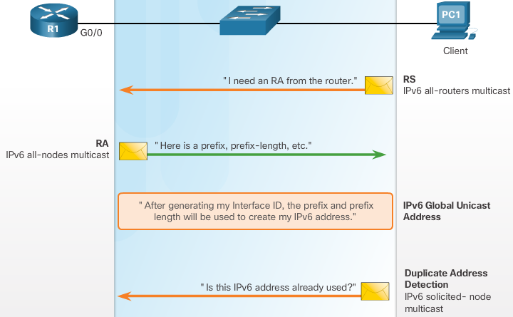

#. Client sends Router Sollicitation message
    Since booting, PC1 has not received an RA message, so it sends an RS message to the all-routers multicast address to inform the local IPv6 router that it needs an RA.

   .. note:: a router must have IPv6 routing enabled before it can send RA messages ``Router(config)# ipv6 unicast-routing``

#. R1 receives the RS message and responds with an RA message
    Included in the RA message are the prefix and prefix length of the network. The RA message is sent to the IPv6 all-nodes multicast address **FF02::1**, with the **link-local address of the router as the IPv6 source address**.

#. PC1 receives the RA message containing the prefix and prefix length for the local network
    PC1 will use this information to create its own IPv6 global unicast address. PC1 now has a 64-bit network prefix, but needs a 64-bit Interface ID (IID) to create a global unicast address.
    There are 2 ways PC1 can create its own unique IID

    #. EUI-64
        Using the EUI-64 process, PC1 will create an IID using its 48-bit MAC address.
    #. Randomly generated
        The 64-bit IID can be a random number generated by the client operating system. 

    PC1 can create a 128-bit IPv6 global unicast address by combining the 64-bit prefix with the 64-bit IID. PC1 will use the link-local address of the router as its IPv6 default gateway address.

#. Because SLAAC is stateless, PC1 must verify that this newly created IPv6 address is unique
    PC1 sends an **ICMPv6 Neighbor Solicitation message with a specially constructed multicast address**, called a solicited-node multicast address, which duplicates the last 24 bits of PC1’s IPv6 address. If no other devices respond with a Neighbor Advertisement message, then the address is virtually guaranteed to be unique and can be used by PC1. **If a Neighbor Advertisement is received** by PC1 **then the address is not unique** and the operating system has to determine a new Interface ID to use.

.. note:: This process is part of ICMPv6 Neighbor Discovery and is known as Duplicate Address Detection (DAD).

The decision of whether a client is configured to obtain its IPv6 address information automatically using SLAAC, DHCPv6, or a combination of both depends on the **settings within the RA message**

The two flags are the Managed Address Configuration flag (M flag) and the Other Configuration flag (O flag)
 Using different combinations of the M and O flags, RA messages have one of three addressing options for the IPv6 device:

 + SLAAC (Router Advertisement only) (Default)
 + Stateless DHCPv6 (Router Advertisement and DHCPv6)
 + Stateful DHCPv6 (DHCPv6 only)

.. note:: Regardless of the option used, it is recommended by RFC 4861 that all IPv6 devices perform Duplicate Address Detection (DAD) on any unicast address, including addresses configured using SLAAC or DHCPv6. DAD is implemented using ICMPv6, which is specified by RFC 4443.

.. note:: Although the RA message specifies the process the client should use in obtaining an IPv6 address dynamically, the client operating system may choose to ignore the RA message and use the services of a DHCPv6 server exclusively.

SLAAC Option
^^^^^^^^^^^^
SLAAC Option (Router Advertisement only)
 SLAAC is the default option on Cisco routers. Both the M flag and the O flag are set to 0 in the RA

This option instructs the client to use the information in the RA message exclusively. This includes **prefix, prefix-length, DNS server, MTU, and default gateway information**. There is no further information available from a DHCPv6 server. The IPv6 global unicast address is created by combining the prefix from RA and an Interface ID using either EUI-64 or a randomly generated value.

RA messages are configured on an individual interface of a router
 To **re-enable an interface for SLAAC** that might have been set to another option, the M and O flags need to be reset to their initial values of 0. This is done using the following interface configuration mode commands:

 .. code::

    Router(config-if)# no ipv6 nd managed-config-flag
    Router(config-if)# no ipv6 nd other-config-flag

ipv6 **N** eighbor **D** iscovery **M** anaged/**O** ther **-CONFIG-FLAG**

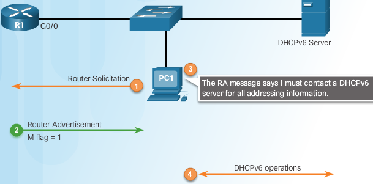

DHCPv6 Operations
-----------------

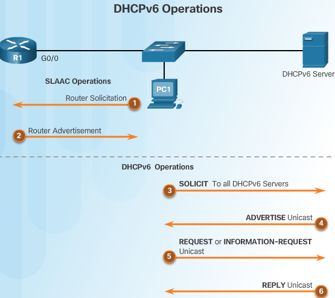

When stateless DHCPv6 or stateful DHCPv6 is indicated by the RA, DHCPv6 operation is invoked. DHCPv6 messages are sent over UDP. DHCPv6 messages from the **server to the client use UDP destination port 546**. **The client sends DHCPv6 messages to the server using UDP destination port 547**.

#. Router Solicitation
#. Router Advertisement
#. the client sends a DHCPv6 **SOLICIT** message to the **reserved IPv6 multicast all-DHCPv6-servers address FF02::1:2**. This multicast address has **link-local scope**, which means routers do not forward the messages to other networks.
#. One or more DHCPv6 servers respond with a **DHCPv6 ADVERTISE unicast message** as shown in Figure 3. The ADVERTISE message informs the DHCPv6 client that the server is available for DHCPv6 service.
#. the client responds with a DHCPv6 **REQUEST or INFORMATION-REQUEST** unicast message to the server, **depending on whether it is using stateful or stateless DHCPv6**.

   + Stateless DHCPv6 client
      The client sends a DHCPv6 INFORMATION-REQUEST message to the DHCPv6 server requesting only configuration parameters, such as DNS server address. The **client generated its own IPv6 address using the prefix from the RA message and a self-generated Interface ID**.
   + Stateful DHCPv6 client
      The client sends a DHCPv6 REQUEST message to the server to obtain an IPv6 address and all other configuration parameters from the server

#. server sends a DHCPv6 **REPLY** unicast message to the client containing the information requested in the REQUEST or INFORMATION-REQUEST message as shown in 5.

mnemonic: RSRA SolARR (vd SARR)

DHCPv6 Stateless Config
-----------------------

#. Enable IPv6 Routing

   .. code::

      R(config)# ipv6 unicast-routing

#. Configure a DHCPv6 Pool

   .. code::

      R(config)# ipv6 dhcp pool STUDENT-POOL
      R(config-dhcpv6)# 

#. Configure Pool Parameters

   .. code::

      R(config-dhcpv6)# dns-server dns-server-address
      R(config-dhcpv6)# domain-name domain-name

   .. note:: During the SLAAC process, the client received the information it needed to create an IPv6 global unicast address. The client also received the default gateway information using the source IPv6 address from the RA message, which is the link-local address of the router. However, the stateless DHCPv6 server can be configured to provide other information that might not have been included in the RA message such as DNS server address and the domain name.

#. Configure DHCPv6 Interface

   .. code::

      R(config)# interface Gi0/0
      R(config-if)# ipv6 dhcp server STUDENT-POOL
      R(config-if)# ipv6 nd other-config-flag

   ``ipv6 dhcp server STUDENT-POOL`` binds the DHCPv6 pool to the interface. The router responds to stateless DHCPv6 requests on this interface with the information contained in the pool. The O flag needs to be changed from 0 to 1 using the interface command ``ipv6 nd other-config-flag``. RA messages sent on this interface indicate that additional information is available from a stateless DHCPv6 server.

Example, R3 is configured as a client to help verify the stateless DHCPv6 operations.

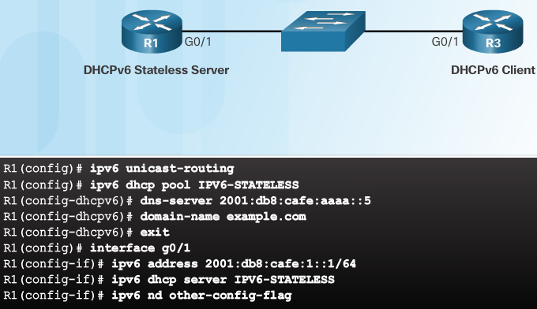

DHCPv6 Stateless Client
-----------------------

.. code::

   R3(config)# interface g0/1
   R3(config-if)# ipv6 enable
   R3(config-if)# ipv6 address autoconfig

The client router needs an IPv6 link-local address on the interface to send and receive IPv6 messages, such as RS messages and DHCPv6 messages. The link-local address of a router is created automatically when IPv6 is enabled on the interface. This can happen when a global unicast address is configured on the interface or by using the ipv6 enable command. ``After the router receives a link-local address, it can participate in IPv6 neighbor discovery``.

.. note:: the ipv6 enable command is used because the router does not yet have a global unicast address.

The ``ipv6 address autoconfig`` command enables automatic configuration of IPv6 addressing using SLAAC. By assumption, the server router is configured for stateless DHCPv6 so it sends an RA message to inform the client router to use stateless DHCPv6 to obtain DNS information.

Verify Stateless dhcpv6
-----------------------

server
 ``R1# show ipv6 dhcp pool``

client
 + ``R3# show ipv6 interface Gi0/1``
 + ``debug ipv6 dhcp detail``
   The debug output displays all the DHCPv6 messages sent between the client and the server including the DNS server and domain name options that were configured on the server.

.. note:: Notice that the client, router R3, is sending the DHCPv6 messages from its link-local address to the All_DHCPv6_Relay_Agents_and_Servers address FF02::1:2

DHCPv6 Stateful Config
----------------------

#. Enable IPv6 Routing

   .. code::

      R(config)# ipv6 unicast-routing

   .. note:: This command is not necessary for the router to be a stateful DHCPv6 server, but it is required for the router to source ICMPv6 RA messages

#. Configure a DHCPv6 Pool

   .. code::
      
      R(config)# ipv6 dhcp pool IPV6-STATEFUL
      R(config-dhcpv6)# 

#. Configure Pool Parameters

   .. code::

      R(config-dhcpv6)# address prefix prefix/length [lifetime {valid-lifetime preferred-lifetime | infinite}]
      R(config-dhcpv6)# address prefix 2001:db8:cafe:1::/64 lifetime infinite 
      R(config-dhcpv6)# dns-server 2001:db8:cafe:aaaa::5
      R(config-dhcpv6)# domain-name example.com
      R(config-dhcpv6)# exit 

   .. note:: During the SLAAC process, the client received the information it needed to create an IPv6 global unicast address. The client also received the default gateway information using the source IPv6 address from the RA message, which is the link-local address of the router. However, the stateless DHCPv6 server can be configured to provide other information that might not have been included in the RA message such as DNS server address and the domain name.

#. Configure DHCPv6 Interface

   .. code::

      R(config)# interface Gi0/0
      R(config-if)# ipv6 dhcp server IPV6-STATEFUL
      R(config-if)# ipv6 nd MANAGED-config-flag

   ``The M flag needs to be changed from 0 to 1 using the interface command ipv6 nd managed-config-flag. This informs the device not to use SLAAC but to obtain IPv6 addressing and all configuration parameters from a stateful DHCPv6 server``

DHCPv6 Stateful Client
----------------------

.. code::

   R3(config)# interface g0/1
   R3(config-if)# ipv6 enable
   R3(config-if)# ipv6 address dhcp

The ``ipv6 enable`` interface configuration mode command allows the client router to receive an IPv6 link-local address on the interface to send RS messages and participate in DHCPv6

Verify Stateful dhcpv6
----------------------

server
 ``R1# show ipv6 dhcp pool``
 ``R1# show ipv6 dhcp binding``
 displays the automatic binding between the link-local address of the client and the address assigned by the server. FE80::32F7:DFF:FE25:2DE1 is the link-local address of the client. In this example, this is the G0/1 interface of R3. This address is bound to the IPv6 global unicast address, 2001:DB8:CAFE:1:5844:47B2:2603:C171, which was assigned by R1, the DHCPv6 server. This information is maintained by a stateful DHCPv6 server and NOT by a stateless DHCPv6 server.

client
 + ``R3# show ipv6 interface Gi0/1``
 + ``debug ipv6 dhcp detail``
   The debug output displays all the DHCPv6 messages sent between the client and the server including the DNS server and domain name options that were configured on the server.

Configure DHCPv6 relay
----------------------

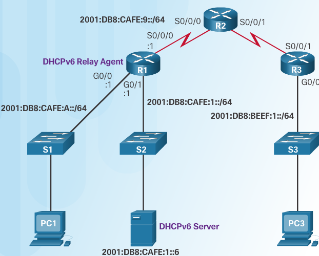

DHCPv6 messages from clients are sent to the IPv6 multicast address **FF02::1:2. All_DHCPv6_Relay_Agents_and_Servers address**. This address has link-local scope which means routers do not forward these messages. The router must be configured as a DHCPv6 relay agent to enable the DHCPv6 client and server to communicate.

.. code::

   R1(config)# interface g0/0
   R1(config-if)# ipv6 dhcp relay destination 2001:db8:cafe:1::6
   R1(config-if)# end
   R1# show ipv6 interface g0/0
   GigabitEthernet0/0 is in relay mode
     Relay destinations:
       2001:DB8:CAFE:1::6
   R1#

.. note:: DHCPv6 relay agent is configured using the ``ipv6 dhcp relay destination`` command. This command is configured on the interface facing the DHCPv6 client using the address of the DHCPv6 server as the destination.

The ``show ipv6 dhcp interface`` command verifies the G0/0 interface is in relay mode with 2001:DB8:CAFE:1::6 configured as the DHCPv6 server.

The dynamic assignment of IPv6 global unicast addresses can be configured in three ways:
 • Stateless Address Autoconfiguration (SLAAC) only
 • Stateless Dynamic Host Configuration Protocol for IPv6 (DHCPv6) 
 • Stateful DHCPv6

With SLAAC (pronounced slack), a DHCPv6 server is not needed for hosts to acquire IPv6 addresses. It can be used to receive additional information that the host needs, such as the domain name and the domain name server (DNS) address. When SLAAC is used to assign the IPv6 host addresses and DHCPv6 is used to assign other network parameters, it is called Stateless DHCPv6.
With Stateful DHCPv6, the DHCP server assigns all information, including the host IPv6 address.
Determination of how hosts obtain their dynamic IPv6 addressing information is dependent on flag settings contained within the router advertisement (RA) messages.

DHCPv6 labs
-----------

.. note:: The default bias template (used by the Switch Database Manager (SDM)) does not provide IPv6 address capabilities. Verify that SDM is using either the dual-ipv4-and-ipv6 template or the lanbase-routing template. The new template will be used after reboot even if the config is not saved

.. code::

   S1# show sdm prefer

   assign the dual-ipv4-and-ipv6 template as the default sdm template:

   S1# config t
   S1(config)# sdm prefer dual-ipv4-and-ipv6 default
   S1(config)# end
   S1# reload

.. note:: wireshark filter to see only ipv6 RA messages ``ipv6.dst==ff02::1``

Use the show ipv6 interface g0/1 command to verify that G0/1 is part of the All-router multicast group (FF02::2). RA messages are not sent out G0/1 without that group assignment.

.. code:: 

   R1# show ipv6 interface g0/1
   GigabitEthernet0/1 is up, line protocol is up 
     IPv6 is enabled, link-local address is FE80::1 
     No Virtual link-local address(es): 
     Global unicast address(es): 
       2001:DB8:ACAD:A::1, subnet is 2001:DB8:ACAD:A::/64  
     Joined group address(es): 
       FF02::1 
       FF02::2 
       FF02::1:FF00:1 
     MTU is 1500 bytes 
     ICMP error messages limited to one every 100 milliseconds 
     ICMP redirects are enabled 
     ICMP unreachables are sent 
     ND DAD is enabled, number of DAD attempts: 1 
     ND reachable time is 30000 milliseconds (using 30000) 
     ND advertised reachable time is 0 (unspecified) 
     ND advertised retransmit interval is 0 (unspecified) 
     ND router advertisements are sent every 200 seconds 
     ND router advertisements live for 1800 seconds 
     ND advertised default router preference is Medium 
     Hosts use stateless autoconfig for addresses. 

Use the ipv6 address autoconfig command on VLAN 1 to obtain an IPv6 address through SLAAC 

.. code::

   S1(config)# interface vlan 1
   S1(config-if)# ipv6 address autoconfig 
   S1(config-if)# end

Use the ``show ipv6 interface`` command to verify that SLAAC provided a unicast address to VLAN1 on S1.

.. code::

   S1# show ipv6 interface 
   Vlan1 is up, line protocol is up 
     IPv6 is enabled, link-local address is FE80::ED9:96FF:FEE8:8A40 
     No Virtual link-local address(es): 
     Stateless address autoconfig enabled 
     Global unicast address(es): 
       2001:DB8:ACAD:A:ED9:96FF:FEE8:8A40, subnet is 2001:DB8:ACAD:A::/64 [EUI/CAL/PRE] 
         valid lifetime 2591988 preferred lifetime 604788 
     Joined group address(es): 
       FF02::1 
       FF02::1:FFE8:8A40 
     MTU is 1500 bytes 
     ICMP error messages limited to one every 100 milliseconds 
     ICMP redirects are enabled 
     ICMP unreachables are sent 
     Output features: Check hwidb 
     ND DAD is enabled, number of DAD attempts: 1 
     ND reachable time is 30000 milliseconds (using 30000) 
     ND NS retransmit interval is 1000 milliseconds 
     Default router is FE80::1 on Vlan1 

Configure an IPv6 stateless DHCP server on R1.

a. Create an IPv6 DHCP pool.
    ``R1(config)# ipv6 dhcp pool IPV6POOL-A``
b. Assign a domain name to the pool.
    ``R1(config-dhcpv6)# domain-name ccna-statelessDHCPv6.com``
c. Assign a DNS server address.  
    ``R1(config-dhcpv6)# dns-server 2001:db8:acad:a::abcd``
    ``R1(config-dhcpv6)# exit``
d. Assign the DHCPv6 pool to the interface.
    ``R1(config)# interface g0/1``
    ``R1(config-if)# ipv6 dhcp server IPV6POOL-A``
e. Set the DHCPv6 network discovery (ND) other-config-flag. 
    ``R1(config-if)# ipv6 nd other-config-flag``
    ``R1(config-if)# end``

Configure an IPv6 stateful DHCP server on R1.

a. Add the network prefix to the pool
    ``R1(config)# ipv6 dhcp pool IPV6POOL-A``
    ``R1(config-dhcpv6)# address prefix 2001:db8:acad:a::/64``
b. Change domain name to ccna-statefulDHCPv6.com
    ``R1(config-dhcpv6)# no domain-name ccna-statelessDHCPv6.com``
    ``R1(config-dhcpv6)# domain-name ccna-statefulDHCPv6.com``
    ``R1(config-dhcpv6)# end``
c. Verify DHCPv6 pool settings

   .. code::

      R1# show ipv6 dhcp pool
      DHCPv6 pool: IPV6POOL-A 
        Address allocation prefix: 2001:DB8:ACAD:A::/64 valid 172800 preferred 86400 (0 in use, 0 conflicts) 
        DNS server: 2001:DB8:ACAD:A::ABCD 
        Domain name: ccna-StatefulDHCPv6.com 
        Active clients: 0 

d. Enter debug mode to verify the stateful DHCPv6 address assignment
    ``R1# debug ipv6 dhcp detail``
    ``  IPv6 DHCP debugging is on (detailed)``
   
Set the flag on G0/1 for stateful DHCPv6

.. note:: Shutting down the G0/1 interface before making changes ensures that an RA message is sent when the interface is activated.
   
.. code::

   R1(config)# interface g0/1 
   R1(config-if)# shutdown
   R1(config-if)# ipv6 nd managed-config-flag
   R1(config-if)# no shutdown 
   R1(config-if)# end

Enable interface F0/6 on S1
 Now that R1 is configured for stateful dhcpv6 you can reconnect PC-A to the nw by activating f0/6 on s1

 .. code::

    S1(config)# interface f0/6 
    S1(config-if)# no shutdown
    S1(config-if)# end 

verify

.. code::

   R1# show ipv6 dhcp pool
   DHCPv6 pool: IPV6POOL-A 
     Address allocation prefix: 2001:DB8:ACAD:A::/64 valid 172800 preferred 86400 (1 in use, 0 conflicts) 
     DNS server: 2001:DB8:ACAD:A::ABCD 
     Domain name: ccna-StatefulDHCPv6.com 
     Active clients: 1 
   
   
   R1# show ipv6 dhcp binding
   Client: FE80::D428:7DE2:997C:B05A 
     DUID: 0001000117F6723D000C298D5444 
     Username : unassigned 
     IA NA: IA ID 0x0E000C29, T1 43200, T2 69120 
       Address: 2001:DB8:ACAD:A:B55C:8519:8915:57CE 
               preferred lifetime 86400, valid lifetime 172800 
               expires at Mar 07 2013 04:09 PM (171595 seconds) 
   R1# u all
   All possible debugging has been turned off 

Stateful DHCPv6 uses more memory resources. Stateful DHCPv6 requires the router to store dynamic state information about the DHCPv6 clients. Stateless DHCPv6 clients do not use the DHCP server to obtain address information, so this information does not need to be stored.

Which type of dynamic IPv6 address assignment is recommended by Cisco, Stateless DHCPv6 or Stateful DHCPv6?
Cisco recommends Stateless DHCPv6 when implementing and deploying IPv6 networks without a Cisco Network Registar (CNR)

DHCPv6 Troubleshooting Tasks
----------------------------

#. Resolve address conflicts
    The ``show ipv6 dhcp conflict`` command displays all address conflicts recorded by the stateful DHCPv6 server. If an address conflict is detected, the client typically removes the address and generates a new address using either SLAAC or stateful DHCPv6.

#. Verify allocation method
    the ``show ipv6 interface g0/0`` command can be used to verify the method of address allocation indicated in the RA message as indicated by the settings of the M and O flags. This information is displayed in the last lines of the output. If a client is not receiving its IPv6 address information from a stateful DHCPv6 server, it could be due to incorrect M and O flags in the RA message.

#. Test with a static IPv6 address
    In the case of IPv6, if the workstation is unable to reach network resources with a statically configured IPv6 address, the root cause of the problem is not SLAAC or DHCPv6. At this point, network connectivity troubleshooting is required.

#. Verify switch port configuration
    If the DHCPv6 client is unable to obtain information from a DHCPv6 server, verify that the switch port is enabled and is operating correctly.
    In linux do a manual ``sudo dhclient -6``

    .. note:: If there is a switch between the client and the DHCPv6 server, and the client is unable to obtain the DHCP configuration, switch port configuration issues may be the cause. These causes may include issues related to trunking, channeling, or spanning tree. **PortFast and edge port** configurations resolve the most common DHCPv6 client issues that occur with an initial installation of a Cisco switch.
    
#. Test DHCPv6 Operation on the same subnet or VLAN
    If the stateless or stateful DHCPv6 server is functioning correctly, but is on a different IPv6 network or VLAN than the client, the problem may be with the DHCPv6 relay agent. The **client facing interface** on the router must be configured with the ``ipv6 dhcp relay destination`` command.

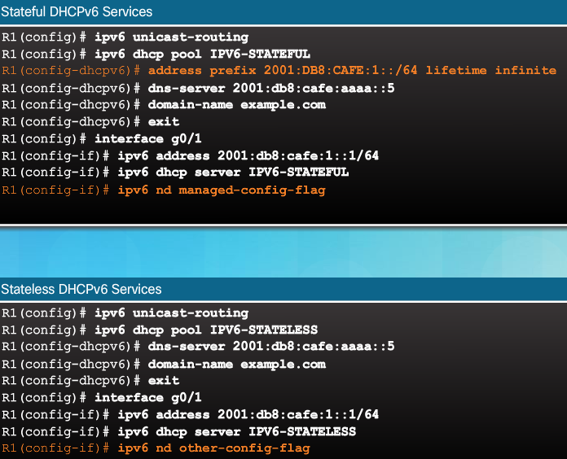

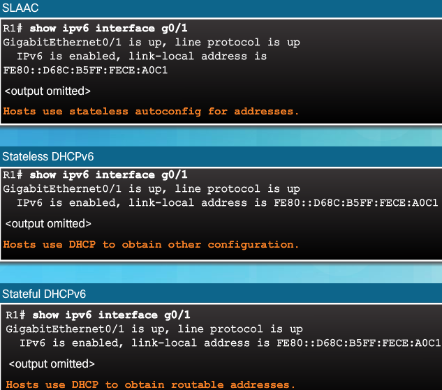

``R1# debug ipv6 dhcp detail``

Ch8 Lab Troubleshooting DHCPv6
------------------------------

+--------+-----------+------------------------------+---------------+-------------------+
| Device | Interface | IPv6 Address                 | Prefix Length | Default Gateway   |
+========+===========+==============================+===============+===================+
| R1     | G0/1      | 2001:DB8:ACAD:A::1           | 64            | N/A               |
+--------+-----------+------------------------------+---------------+-------------------+
| S1     | VLAN 1    | Assigned by SLAAC            | 64            | Assigned by SLAAC |
+--------+-----------+------------------------------+---------------+-------------------+
| PC-A   | NIC       | Assigned by SLAAC and DHCPv6 | 64            | Assigned by SLAAC |
+--------+-----------+------------------------------+---------------+-------------------+

Part 1 Build NW and configure basic settings
^^^^^^^^^^^^^^^^^^^^^^^^^^^^^^^^^^^^^^^^^^^^

cable as show in topology, intitialize and reload the router n switch
.. code::

   R1# show sdm prefer

Follow this configuration to assign the dual-ipv4-and-ipv6 template as the default SDM template:

.. code::

   S1# config t
   S1(config)# sdm prefer dual-ipv4-and-ipv6 default
   S1(config)# end
   S1# reload

Required Resources
 * 1 Router (Cisco 1941 with Cisco IOS Release 15.2(4)M3 universal image or comparable)
 * 1 Switch (Cisco 2960 with Cisco IOS Release 15.0(2) lanbasek9 image or comparable)
 * PC (Linux, don't bother with Windows)
 * Console cables to configure the Cisco IOS devices via the console ports
 * Ethernet cables as shown in the topology

a. Disable DNS lookup.
b. Configure device names as shown in the topology.
c. Encrypt plain text passwords.
d. Create a MOTD banner warning users that unauthorized access is prohibited.
e. Assign class as the encrypted privileged EXEC mode password.
f. Assign cisco as the console and vty passwords and enable login.
g. Configure logging synchronous to prevent console messages from interrupting command entry.

Load the IPv6 configuration to R1

.. code::

   ip domain name ccna-lab.com
   ipv6 dhcp pool IPV6POOL-A
    dns-server 2001:DB8:ACAD:CAFE::A
    domain-name ccna-lab.com
   interface g0/0
    no ip address
    shutdown
    duplex auto
    speed auto
   interface g0/1
    no ip address
    duplex auto
    speed auto
    ipv6 address FE80::1 link-local
    ipv6 address 2001:DB8:ACAD:A::11/64
   end

Load the IPv6 configuration to S1.

.. code::

   interface range f0/1-24
    shutdown
   interface range g0/1-2
    shutdown
   interface Vlan1
    shutdown
   end

Save the running configurations on R1 and S1
Verify that IPv6 is enabled on PC-A
Verify that IPv6 has been enabled in the Local Area Connection Properties window on PC-A

Part 2 Troubleshoot IPv6 connectivity
^^^^^^^^^^^^^^^^^^^^^^^^^^^^^^^^^^^^^

you will test and verify Layer 3 IPv6 connectivity on the network

Continue troubleshooting the network until Layer 3 connectivity has been established on all devices. Do not continue to Part 3
until you have succe ssfully completed Part 2

Troubleshoot IPv6 interfaces on R1
 a. According to the topology, which interface must be active on R1 for network connectivity to be established?  Record any commands used to identify which interfaces are active.
 b. If necessary, take the steps required to bring up the interface. Record the commands used to correct the configuration errors and verify that the interface is active.
 c. Identify the IPv6 addresses configured on R1. Record the address es found and the commands used to view the IPv6 addresses.
 d. Determine if a configuration error has been made. If any errors are identified, record all the commands used to correct the configuration.
 e. On R1, what multicast group is needed for SLAAC to function?
 f. What command is used to verify that R1 is a member of that group?
 g. If R1 is not a member of the multicast group that is needed for SLAAC to function correctly, make the necessary changes to the configuration so that it joins the group. Record any commands necessary to correct the configurations errors.
 h. Re-issue the command to verify that interface G0/1 has joined the all-routers multicast group (FF02::2).

.. note:: If you are unable to join the all-routers multicast group, you may need to save your current configuration and reload the router.

Troubleshoot S1
 a. Are the interfaces needed for network connectivity active on S1?  Record any commands that are used to activate necessary interfaces on S1
 b. What command could you use to determine if an IPv6 unicast address has been assigned to S1?
 c. Does S1 have an IPv6 unicast address configured? If so, what is it?
 d. If S1 is not receiving a SLAAC address, make the necessary configuration changes to allow it to receive one. Record the commands used.
 e. Re-issue the command that verifies that the interface now receives a SLAAC address.
 f. Can S1 ping the IPv6 unicast address assigned to the G0/1 interface assigned to R1?

Troubleshoot PC-A
 a. Issue the command used on PC-A to verify the IPv6 address assigned. Record the command
 b. What is the IPv6 unicast address SLAAC is providing to PC-A?
 c. Can PC-A ping th e default gateway address that was assigned by SLAAC?
 d. Can PC-A ping the management interface on S1?
 
 .. note:: Continue troubleshooting until you can ping R1 and S1 from PC-A

Part 3 Troubleshoot Stateless DHCPv6
^^^^^^^^^^^^^^^^^^^^^^^^^^^^^^^^^^^^

You will test and verify that Stateless DHCPv6 is working correctly on the network. You will need to use the correct IPv6 CLI commands on the router to determine if Stateless DHCPv6 is working. You may want to use **debug** to help determine if the DHCP server is being solicited.

Determine if Stateless DHCPv6 is functioning correctly.
 a. What is the name of the IPv6 DHCP pool? How did you determine this?
 b. What network information is listed in the DHCPv6 pool?
 c. Was the DHCPv6 information assigned to PC-A?  How did you determine this?

Troubleshoot R1
 a. What commands can be used to determine if R1 is configured for Stateless DHCPv6?
 b. Is the G0/1 interface on R1 in Stateless DHCPv6 mode?
 c. What command can be used to have R1 join the all-DHCPv6 server group?
 d. Verify that the all-DHCPv6 server group is configured for interface G0/1.
 e. Will PC-A receive the DHCP information now? Explain?
 f. What is missing from the configuration of G0/1 that causes hosts to use the DCHP server to retrieve other network information?
 g. Reset the IPv6 settings on PC-A
    1) Open the Local Area Connection Properties window, deselect the Internet Protocol Version 6 (TCP/IPv6) check box, and then click OK to accept the change.
    2) Open the Local Area Connection Properties window again, click the Internet Protocol Version 6 (TCP/IPv6) check box, and then click OK to accept the change.
 h. Issue the command to verify changes have been made on PC-A.
    Continue troubleshooting until PC-A receives the additional DHCP information from R1

Reflection
 1. What command is needed in the DHCPv6 pool for Stateful DHCPv6 that is not needed for Stateless DHCPv6? Why?
 2. What command is needed on the interface to change the network to use Stateful DHCPv6 instead of Stateless DHCPv6?

Ch8 8.3.1.2 Skills Integration Challenge DHCPv4
-----------------------------------------------

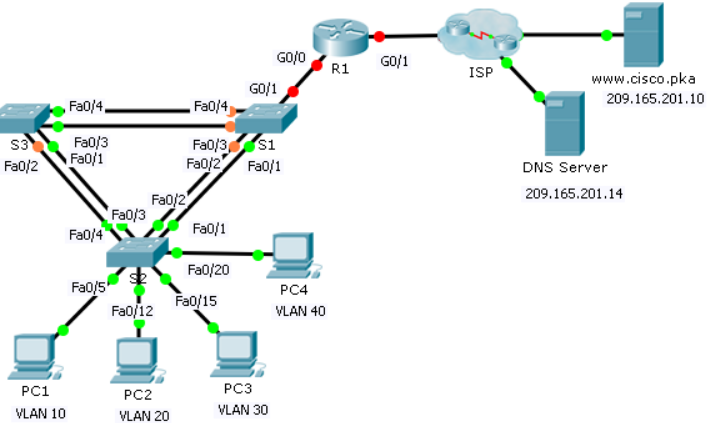

Addressing Table
^^^^^^^^^^^^^^^^
+--------+-----------+---------------+-----------------+-----------------+
| Device | Interface | IP Address    | Subnet Mask     | Default Gateway |
+========+===========+===============+=================+=================+
|        | G0/0.10   | 172.31.10.1   | 255.255.255.224 | N/A             |
+--------+-----------+---------------+-----------------+-----------------+
|        | G0/0.20   | 172.31.20.1   | 255.255.255.240 | N/A             |
+--------+-----------+---------------+-----------------+-----------------+
| R1     | G0/0.30   | 172.31.30.1   | 255.255.255.128 | N/A             |
+--------+-----------+---------------+-----------------+-----------------+
|        | G0/0.40   | 172.31.40.1   | 255.255.255.192 | N/A             |
+--------+-----------+---------------+-----------------+-----------------+
|        | G0/1      | DHCP Assigned | DHCP Assigned   | N/A             |
+--------+-----------+---------------+-----------------+-----------------+
| PC1    | NIC       | DHCP Assigned | DHCP Assigned   | DHCP Assigned   |
+--------+-----------+---------------+-----------------+-----------------+
| PC2    | NIC       | DHCP Assigned | DHCP Assigned   | DHCP Assigned   |
+--------+-----------+---------------+-----------------+-----------------+
| PC3    | NIC       | DHCP Assigned | DHCP Assigned   | DHCP Assigned   |
+--------+-----------+---------------+-----------------+-----------------+
| PC4    | NIC       | DHCP Assigned | DHCP Assigned   | DHCP Assigned   |
+--------+-----------+---------------+-----------------+-----------------+

VLAN Port Assignments and DHCP Information
^^^^^^^^^^^^^^^^^^^^^^^^^^^^^^^^^^^^^^^^^^
+-----------------+----------------------+----------------+----------------+
| Ports           | VLAN Number - Name   | DHCP Pool Name | Network        |
+=================+======================+================+================+
| Fa0/5 – 0/9     | VLAN 10 - Sales      | VLAN_10        | 172.31.10.0/27 |
+-----------------+----------------------+----------------+----------------+
| Fa0/10 – Fa0/14 | VLAN 20 - Production | VLAN_20        | 172.31.20.0/28 |
+-----------------+----------------------+----------------+----------------+
| Fa0/15 – Fa0/19 | VLAN 30 - Marketing  | VLAN_30        | 172.31.30.0/25 |
+-----------------+----------------------+----------------+----------------+
| Fa0/20 – Fa0/24 | VLAN 40 - HR         | VLAN_40        | 172.31.40.0/26 |
+-----------------+----------------------+----------------+----------------+

Configure VLANs, trunks, DHCP Server, DHCP relay agents, and configure a router as a DHCP client

• Create VLANs on S2 and assign VLANs to appropriate ports. Names are case-sensitive
• Configure S2 ports for trunking.
• Configure all non-trunk ports on S2 as access ports.
• Configure R1 to route between VLANs. Subinterface names should match the VLAN number.
• Configure R1 to act as a DHCP server for the VLANs attached to S2.

  - Create a DHCP pool for each VLAN. Names are case-sensitive.
  - Assign the appropriate addresses to each pool. 
  - Configure DHCP to provide the default gateway address
  - Configure the DNS server 209.165.201.14 for each pool. 
  - Prevent the first 10 addresses from each pool from being distributed to end devices.

• Verify that each PC has an address assigned from the correct DHCP pool.
  Note: DHCP address assignments may take some time. Click Fast Forward Time to speed up the process.
• Configure R1 as a DHCP client so that it receives an IP address from the ISP network.
• Verify all devices can now ping each other and www.cisco.pka

Solution

R1

.. code::

   R1>en
   R1#conf t
   R1(config)#interface G0/0
   R1(config-if)#no shutdown
   R1(config-if)#
   %LINK-5-CHANGED: Interface GigabitEthernet0/0, changed state to up
   %LINEPROTO-5-UPDOWN: Line protocol on Interface GigabitEthernet0/0, changed state to up

   R1(config-if)#interface G0/0.10
   R1(config-subif)#
   %LINK-5-CHANGED: Interface GigabitEthernet0/0.10, changed state to up
   %LINEPROTO-5-UPDOWN: Line protocol on Interface GigabitEthernet0/0.10, changed state to up
   R1(config-subif)#encapsulation dot1Q 10
   R1(config-subif)#ip address 172.31.10.1 255.255.255.224

   R1(config-subif)#interface G0/0.20
   R1(config-subif)#
   %LINK-5-CHANGED: Interface GigabitEthernet0/0.20, changed state to up
   %LINEPROTO-5-UPDOWN: Line protocol on Interface GigabitEthernet0/0.20, changed state to up
   encapsulation dot1Q 20
   R1(config-subif)#encapsulation dot1Q 20
   R1(config-subif)#ip address 172.31.20.1 255.255.255.240

   R1(config-subif)#interface G0/0.30
   R1(config-subif)#
   %LINK-5-CHANGED: Interface GigabitEthernet0/0.30, changed state to up
   %LINEPROTO-5-UPDOWN: Line protocol on Interface GigabitEthernet0/0.30, changed state to up
   encapsulation dot1Q 30
   R1(config-subif)#ip address 172.31.30.1 255.255.255.128

   R1(config-subif)#interface G0/0.40
   R1(config-subif)#
   %LINK-5-CHANGED: Interface GigabitEthernet0/0.40, changed state to up
   %LINEPROTO-5-UPDOWN: Line protocol on Interface GigabitEthernet0/0.40, changed state to up
   encapsulation dot1Q 40
   R1(config-subif)#ip address 172.31.40.1 255.255.255.192
   R1(config-subif)#exit
   R1(config)#

Configure R1 G0/1 as DHCP client

.. code::

   R1(config)#interface G0/1
   R1(config-if)#ip address dhcp
   R1(config-if)#no shutdown 
   %LINK-5-CHANGED: Interface GigabitEthernet0/1, changed state to up
   %LINEPROTO-5-UPDOWN: Line protocol on Interface GigabitEthernet0/1, changed state to up
   %DHCP-6-ADDRESS_ASSIGN: Interface GigabitEthernet0/1 assigned DHCP address 209.165.200.227, mask 255.255.255.224, hostname R1

Configure R1 as DHCPv4 server for each vlan

.. code::

   R1(config)#ip dhcp excluded-address 172.31.10.1 172.31.10.10
   R1(config)#ip dhcp pool VLAN_10
   R1(dhcp-config)#network 172.31.10.0 255.255.255.224
   R1(dhcp-config)#dns-server 209.165.201.14
   R1(dhcp-config)#default-router 172.31.10.1
   R1(dhcp-config)#option ?
     <0-254>  DHCP option code
   R1(dhcp-config)#exit
   R1(config)#ip dhcp excluded-address 172.31.20.1 172.31.20.10
   R1(config)#ip dhcp pool VLAN_20
   R1(dhcp-config)#network 172.31.20.0 255.255.255.240
   R1(dhcp-config)#default-router 172.31.20.1
   R1(dhcp-config)#dns-server 209.165.201.14
   R1(dhcp-config)#exit
   R1(config)#ip dhcp excluded-address 172.31.30.1 172.31.30.10
   R1(config)#ip dhcp pool VLAN_30
   R1(dhcp-config)#default-router 172.31.30.1
   R1(dhcp-config)#dns-server 209.165.201.14
   R1(dhcp-config)#network 172.31.30.0 255.255.255.128
   R1(dhcp-config)#exit
   R1(config)#ip dhcp excluded-address 172.31.40.1 172.31.40.10
   R1(config)#ip dhcp pool VLAN_40
   R1(dhcp-config)#network 172.31.40.0 255.255.255.192
   R1(dhcp-config)#default-router 172.31.40.1
   R1(dhcp-config)#dns-server 209.165.201.14
   R1(dhcp-config)#exit
   R1(config)#

Create VLANs on S2 and assign VLANs to respective ports

.. code::

   S2(config)#interface range fastEthernet 0/1 - 4
   S2(config-if-range)#switchport mode trunk 
   %LINEPROTO-5-UPDOWN: Line protocol on Interface FastEthernet0/3, changed state to down
   %LINEPROTO-5-UPDOWN: Line protocol on Interface FastEthernet0/3, changed state to up
   %LINEPROTO-5-UPDOWN: Line protocol on Interface FastEthernet0/4, changed state to down
   %LINEPROTO-5-UPDOWN: Line protocol on Interface FastEthernet0/4, changed state to up
   S2(config-if-range)#switchport trunk allowed vlan 10,20,30,40
   S2(config)#interface range fastEthernet 0/5 - 24
   S2(config-if-range)#switchport mode access 
   S2(config-if-range)#switchport ?
     access         Set access mode characteristics of the interface
     mode           Set trunking mode of the interface
     native         Set trunking native characteristics when interface is in
                    trunking mode
     nonegotiate    Device will not engage in negotiation protocol on this
                    interface
     port-security  Security related command
     priority       Set appliance 802.1p priority
     trunk          Set trunking characteristics of the interface
     voice          Voice appliance attributes
   S2(config-if-range)#interface range fastEthernet 0/5 - 9
   S2(config-if-range)#switchport access vlan 10
   S2(config-if-range)#interface range fastEthernet 0/10 - 14
   S2(config-if-range)#switchport access vlan 20
   S2(config-if-range)#interface range fastEthernet 0/15 - 19
   S2(config-if-range)#switchport access vlan 30
   S2(config-if-range)#interface range fastEthernet 0/20 - 24
   S2(config-if-range)#switchport access vlan 40
   S2(config-if-range)#

running config R1

.. code::

   R1>en
   R1#show run
   Building configuration...
   
   Current configuration : 1786 bytes
   !
   version 15.1
   no service timestamps log datetime msec
   no service timestamps debug datetime msec
   no service password-encryption
   !
   hostname R1
   !
   !
   !
   !
   ip dhcp excluded-address 172.31.10.1 172.31.10.10
   ip dhcp excluded-address 172.31.20.1 172.31.20.10
   ip dhcp excluded-address 172.31.30.1 172.31.30.10
   ip dhcp excluded-address 172.31.40.1 172.31.40.10
   !
   ip dhcp pool VLAN_10
    network 172.31.10.0 255.255.255.224
    default-router 172.31.10.1
    dns-server 209.165.201.14
   ip dhcp pool VLAN_20
    network 172.31.20.0 255.255.255.240
    default-router 172.31.20.1
    dns-server 209.165.201.14
   ip dhcp pool VLAN_30
    network 172.31.30.0 255.255.255.128
    default-router 172.31.30.1
    dns-server 209.165.201.14
   ip dhcp pool VLAN_40
    network 172.31.40.0 255.255.255.192
    default-router 172.31.40.1
    dns-server 209.165.201.14
   !
   !
   !
   ip cef
   no ipv6 cef
   !
   !
   !
   !
   license udi pid CISCO2911/K9 sn FTX1524A6QI
   !
   !
   !
   !
   !
   !
   !
   !
   !
   !
   !
   spanning-tree mode pvst
   !
   !
   !
   !
   !
   !
   interface GigabitEthernet0/0
    no ip address
    duplex auto
    speed auto
   !
   interface GigabitEthernet0/0.10
    encapsulation dot1Q 10
    ip address 172.31.10.1 255.255.255.224
   !
   interface GigabitEthernet0/0.20
    encapsulation dot1Q 20
    ip address 172.31.20.1 255.255.255.240
   !
   interface GigabitEthernet0/0.30
    encapsulation dot1Q 30
    ip address 172.31.30.1 255.255.255.128
   !
   interface GigabitEthernet0/0.40
    encapsulation dot1Q 40
    ip address 172.31.40.1 255.255.255.192
   !
   interface GigabitEthernet0/1
    description Connection to ISP
    ip address dhcp
    duplex auto
    speed auto
   !
   interface GigabitEthernet0/2
    no ip address
    duplex auto
    speed auto
    shutdown
   !
   interface Vlan1
    no ip address
    shutdown
   !
   ip classless
   ip route 0.0.0.0 0.0.0.0 GigabitEthernet0/1 
   !
   ip flow-export version 9
   !
   !
   !
   !
   !
   !
   !
   line con 0
   !
   line aux 0
   !
   line vty 0 4
    login
   !
   !
   !
   end

switch2

.. code::

   S2#show vlan brief
   
   VLAN Name                             Status    Ports
   ---- -------------------------------- --------- -------------------------------
   1    default                          active    Gig0/1, Gig0/2
   10   Sales                            active    Fa0/5, Fa0/6, Fa0/7, Fa0/8
                                                   Fa0/9
   20   Production                       active    Fa0/10, Fa0/11, Fa0/12, Fa0/13
                                                   Fa0/14
   30   Marketing                        active    Fa0/15, Fa0/16, Fa0/17, Fa0/18
                                                   Fa0/19
   40   HR                               active    Fa0/20, Fa0/21, Fa0/22, Fa0/23
                                                   Fa0/24
   1002 fddi-default                     active    
   1003 token-ring-default               active    
   1004 fddinet-default                  active    
   1005 trnet-default                    active    

.. code::

   S2#show running-config 
   Building configuration...
   
   Current configuration : 2356 bytes
   !
   version 12.2
   no service timestamps log datetime msec
   no service timestamps debug datetime msec
   no service password-encryption
   !
   hostname S2
   !
   !
   !
   !
   !
   spanning-tree mode pvst
   spanning-tree extend system-id
   !
   interface FastEthernet0/1
    switchport trunk allowed vlan 10,20,30,40
    switchport mode trunk
   !
   interface FastEthernet0/2
    switchport trunk allowed vlan 10,20,30,40
    switchport mode trunk
   !
   interface FastEthernet0/3
    switchport trunk allowed vlan 10,20,30,40
    switchport mode trunk
   !
   interface FastEthernet0/4
    switchport trunk allowed vlan 10,20,30,40
    switchport mode trunk
   !
   interface FastEthernet0/5
    switchport access vlan 10
    switchport mode access
   !
   interface FastEthernet0/6
    switchport access vlan 10
    switchport mode access
   !
   interface FastEthernet0/7
    switchport access vlan 10
    switchport mode access
   !
   interface FastEthernet0/8
    switchport access vlan 10
    switchport mode access
   !
   interface FastEthernet0/9
    switchport access vlan 10
    switchport mode access
   !
   interface FastEthernet0/10
    switchport access vlan 20
    switchport mode access
   !
   interface FastEthernet0/11
    switchport access vlan 20
    switchport mode access
   !
   interface FastEthernet0/12
    switchport access vlan 20
    switchport mode access
   !
   interface FastEthernet0/13
    switchport access vlan 20
    switchport mode access
   !
   interface FastEthernet0/14
    switchport access vlan 20
    switchport mode access
   !
   interface FastEthernet0/15
    switchport access vlan 30
    switchport mode access
   !
   interface FastEthernet0/16
    switchport access vlan 30
    switchport mode access
   !
   interface FastEthernet0/17
    switchport access vlan 30
    switchport mode access
   !
   interface FastEthernet0/18
    switchport access vlan 30
    switchport mode access
   !
   interface FastEthernet0/19
    switchport access vlan 30
    switchport mode access
   !
   interface FastEthernet0/20
    switchport access vlan 40
    switchport mode access
   !
   interface FastEthernet0/21
    switchport access vlan 40
    switchport mode access
   !
   interface FastEthernet0/22
    switchport access vlan 40
    switchport mode access
   !
   interface FastEthernet0/23
    switchport access vlan 40
    switchport mode access
   !
   interface FastEthernet0/24
    switchport access vlan 40
    switchport mode access
   !
   interface GigabitEthernet0/1
   !
   interface GigabitEthernet0/2
   !
   interface Vlan1
    no ip address
    shutdown
   !
   !
   !
   !
   line con 0
   !
   line vty 0 4
    login
   line vty 5 15
    login
   !

Router1 DHCP show commands

.. code::

   R1#show ip dhcp ?
     binding   DHCP address bindings
     conflict  DHCP address conflicts
     pool      DHCP pools information
     relay     Miscellaneous DHCP relay information
   R1#show ip dhcp binding 
   IP address       Client-ID/              Lease expiration        Type
                    Hardware address
   172.31.10.11     0000.0C92.D758           --                     Automatic
   172.31.20.11     0060.706D.2129           --                     Automatic
   172.31.30.11     0030.F21A.5348           --                     Automatic
   172.31.40.11     0002.1730.4277           --                     Automatic
   R1#show ip dhcp conflict 
   IP address        Detection method   Detection time          VRF
   R1#show ip dhcp pool
   
   Pool VLAN_10 :
    Utilization mark (high/low)    : 100 / 0
    Subnet size (first/next)       : 0 / 0 
    Total addresses                : 30
    Leased addresses               : 1
    Excluded addresses             : 4
    Pending event                  : none
   
    1 subnet is currently in the pool
    Current index        IP address range                    Leased/Excluded/Total
    172.31.10.1          172.31.10.1      - 172.31.10.30      1    / 4     / 30
   
   Pool VLAN_20 :
    Utilization mark (high/low)    : 100 / 0
    Subnet size (first/next)       : 0 / 0 
    Total addresses                : 14
    Leased addresses               : 1
    Excluded addresses             : 4
    Pending event                  : none
   
    1 subnet is currently in the pool
    Current index        IP address range                    Leased/Excluded/Total
    172.31.20.1          172.31.20.1      - 172.31.20.14      1    / 4     / 14
   
   Pool VLAN_30 :
    Utilization mark (high/low)    : 100 / 0
    Subnet size (first/next)       : 0 / 0 
    Total addresses                : 126
    Leased addresses               : 1
    Excluded addresses             : 4
    Pending event                  : none
   
    1 subnet is currently in the pool
    Current index        IP address range                    Leased/Excluded/Total
    172.31.30.1          172.31.30.1      - 172.31.30.126     1    / 4     / 126
   
   Pool VLAN_40 :
    Utilization mark (high/low)    : 100 / 0
    Subnet size (first/next)       : 0 / 0 
    Total addresses                : 62
    Leased addresses               : 1
    Excluded addresses             : 4
    Pending event                  : none
   
    1 subnet is currently in the pool
    Current index        IP address range                    Leased/Excluded/Total
    172.31.40.1          172.31.40.1      - 172.31.40.62      1    / 4     / 62
   R1#show ip dhcp relay ?
     information  DHCP relay information option
   R1#show ip dhcp relay information trusted-sources 
   List of trusted sources of relay agent information option:
   
   R1#show dhcp lease
   Temp IP addr: 209.165.200.227 for peer on Interface: GigabitEthernet0/1
   Temp sub net mask: 255.255.255.224
      DHCP Lease server: 209.165.200.225 , state: Bound
      DHCP Transaction id: 0E98472C
      Lease: 86400 secs,  Renewal: 43200 secs,  Rebind: 75600 secs
   Temp default-gateway addr: 0.0.0.0
      Next timer fires after: 09:44:51
      Retry count: 0  Client-ID:cisco-0002.1638.B602-Gig0/1
      Client-ID hex dump: 636973636F2D303030322E313633382E
                          23630322D476967302F31
      Hostname: R1
   
   R1#show ip interface GigabitEthernet 0/1
   GigabitEthernet0/1 is up, line protocol is up (connected)
     Internet address is 209.165.200.227/27
     Broadcast address is 255.255.255.255
     Address determined by DHCP
     MTU is 1500 bytes
     Helper address is not set
     Directed broadcast forwarding is disabled
     Outgoing access list is not set
     Inbound  access list is not set

DHCPv6 conclusion
-----------------

There are two methods available for the dynamic configuration of IPv6 global unicast addresses.

+ Stateless Address Autoconfiguration (SLAAC)

+ Dynamic Host Configuration Protocol for IPv6 (Stateful DHCPv6)

With stateless autoconfiguration, the client uses information provided by the IPv6 RA message to automatically select and configure a unique IPv6 address. The stateless DHCPv6 option informs the client to use the information in the RA message for addressing, but additional configuration parameters are available from a DHCPv6 server.

Stateful DHCPv6 is similar to DHCPv4. In this case, the RA message informs the client not to use the information in the RA message. All addressing information and DNS configuration information is obtained from a stateful DHCPv6 server. The DHCPv6 server maintains IPv6 state information similar to a DHCPv4 server allocating addresses for IPv4.

Ch8 QnA
-------

SLAAC
 stateless address autoconfiguation. A method of automatic IPv6 address configuration on a client
Stateless DHCPv6
 method of automatic IPv6 address configuration on a client with additional information provided by aDHCPv6 server
Stateful DHCPv6
 a method of obtaining an IPv6 address and other configuration values from a DHCPv6 server
EUI-64
 extended unique identifier. a process to configure the client ID based on the interface MAC address
DAD
 Duplicate Address Detection. a process by a SLAAC client to verify that no duplication exists for its self-configured IPv6 address
FF02::1:2
 Which destination IP address is used when an IPv6 host sends a DHCPv6 SOLICIT message to locate a DHCPv6 server?
 .. note:: DHCPv6 hosts will send a DHCP SOLICIT message to the all DHCP routers multicast address of FF02::1:2
client rcvs RA msg with M flag 0 and O flag 1
 The client should automatically configure an IPv6 address without contacting a DHCPv6 server.
Why is DHCPREQUEST sent as broadcast?
 The client may have received offers from multiple servers, and the broadcast serves to implicitly decline those other offers
ipv6 address dhcp
 set the router as a stateful DHCPv6 client
255.255.255.255
 the destination IP address when an IPv4 host sends a DHCPDISCOVER message
 .. note:: Because a DHCP client does not have a valid IPv4 address, it must use a broadcast IP address of 255.255.255.255 as the destination address to communicate with the DHCP server. The DHCPDISCOVER message sent by the client is the first message sent in order to make initial contact with a DHCP server.

An administrator has configured a DHCPv4 relay router and issued these commands

.. code::

   Router(config)# interface g0/0
   Router(config-if)# ip address 10.0.1.1 255.255.255.0
   Router(config-if)# no shutdown
   Router(config-if)# exit
   Router(config)# ip dhcp pool RELAY
   Router(dhcp-config)# end

The clients are not receiving IP parameters from the DHCPv4 server. What is a possible cause? 
The ``ip helper-address server-ip`` command is missing

DHCPREQUEST
 What message does an IPv4 host use to reply when it receives a DHCPOFFER message from a DHCP server?
 .. note:: When the client receives the DHCPOFFER from the server, it sends back a DHCPREQUEST broadcast message. On receiving the DHCPREQUEST message, the server replies with a unicast DHCPACK message.

SLAAC
 In which alternative to DHCPv6 does a router dynamically provide IPv6 configuration information to hosts?
 .. note:: Stateless Address Autoconfiguration (SLAAC) can be used as an alternative to DHCPv6. In this approach, a router provides global routing prefix, prefix length, default gateway, and DNS server information to a host. The host is not provided with a global unicast address by SLAAC. Instead, SLAAC suggests that the host create its own global unicast address based on the supplied global routing prefix. ARP is not used in IPv6. ICMPv6 messages are used by SLAAC to provide addressing and other configuration information. EUI-64 is a process in which a host will create an Interface ID from its 48-bit MAC address.

DAD 
 What process is used in ICMPv6 for a host to verify that an IPv6 address is unique before configuring it on an interface?
 .. note:: Before an IPv6 host can enable and use an assigned IPv6 address, the host must verify that the address is unique on the network. To verify that no other hosts are using the IPv6 address, the host performs the duplicate address detection (DAD) process by sending a **Neighbor Solicitation (NS) message** to the IPv6 address.

.. note:: clients in stateless DHCPv6 operation will configure their interface IDs either by EUI-64 or a random number  

Router# show ip dhcp binding
 Which command will allow a network administrator to check the IP address that is assigned to a particular MAC address? 

After booting, a client receives an ICMPv6 RA message with the M flag set to 0 and the O flag set to 1. What does this indicate?
 :strike:`The client should automatically configure an IPv6 address without contacting a DHCPv6 server`
 The client should automatically configure an IPv6 address and then contact a DHCPv6 server for more information

When a client is requesting an initial address lease from a DHCP server, why is the DHCPREQUEST message sent as a broadcast?
 The client may have received offers from multiple servers, and the broadcast serves to implicitly decline those other offers
 .. note:: During the initial DHCP exchange between a client and server, the client broadcasts a DHCPDISCOVER message looking for DHCP servers. Multiple servers may be configured to respond to this request with DHCPOFFER messages. The client will choose the lease from one of the servers by sending a DHCPREQUEST message. It sends this message as a broadcast so that the other DHCP servers that sent offers will know that their offers were declined and the corresponding address can go back into the pool

An administrator is troubleshooting a DHCPv4 issue on a router. By issuing the debug ip dhcp ........ command, the administrator can watch, in real time, the IP address assignments that are performed by the router. 
 ``debug ip dhcp server events``

Ch8 practice exam
------------------

#. Which DHCPv4 message will a client send to accept an IPv4 address that is offered by a DHCP server? 

   + unicast DHCPACK
   + broadcast DHCPACK
   + unicast DHCPREQUEST
   + broadcast DHCPREQUEST
   + Answer -> :transparent:`broadcast DHCPREQUEST`

#. A company uses DHCP servers to dynamically assign IPv4 addresses to employee workstations. The address lease duration is set as 5 days. An employee returns to the office after an absence of one week. When the employee boots the workstation, it sends a message to obtain an IP address. Which Layer 2 and Layer 3 destination addresses will the message contain?

   + FF-FF-FF-FF-FF-FF and 255.255.255.255
   + both MAC and IPv4 addresses of the DHCP server
   + MAC address of the DHCP server and 255.255.255.255
   + FF-FF-FF-FF-FF-FF and IPv4 address of the DHCP server
   + Answer -> :transparent:`FF-FF-FF-FF-FF-FF and 255.255.255.255`

#. Which is a DHCPv4 address allocation method that assigns IPv4 addresses for a limited lease period?

   + manual allocation 
   + pre-allocation
   + automatic allocation
   + dynamic allocation
   + Answer -> :transparent:`dynamic allocation`

#. Which address does a DHCPv4 server target when sending a DHCPOFFER message to a client that makes an address request?

   + client IP address
   + client hardware address 
   + gateway IP address
   + broadcast MAC address
   + Answer -> :transparent:`client hardware address`

#. As a DHCPv4 client lease is about to expire, what is the message that the client sends the DHCP server?

   + DHCPDISCOVER
   + DHCPOFFER
   + DHCPREQUEST
   + DHCPACK
   + Answer -> :transparent:`DHCPREQUEST`

#. What is an advantage of configuring a Cisco router as a relay agent?

   + It will allow DHCPDISCOVER messages to pass without alteration
   + It can forward both broadcast and multicast messages on behalf of clients
   + It can provide relay services for multiple UDP services 
   + It reduces the response time from a DHCP server.
   + Answer -> :transparent:`It can provide relay services for multiple UDP services`

#. An administrator issues the commands

   .. code::

      Router(config)# interface g0/1
      Router(config-if)# ip address dhcp
   
   What is the administrator trying to achieve?

   + configuring the router to act as a DHCPv4 server
   + configuring the router to obtain IP parameters from a DHCPv4 server
   + configuring the router to act as a relay agent
   + configuring the router to resolve IP address conflicts
   + Answer -> :transparent:`configuring the router to obtain IP parameters from a DHCPv4 server`

#. Under which two circumstances would a router usually be configured as a DHCPv4 client? (Choose two.)

   + The router is intended to be used as a SOHO gateway
   + The administrator needs the router to act as a relay agent
   + The router is meant to provide IP addresses to the hosts
   + This is an ISP requirement
   + The router has a fixed IP address
   + Answer -> :transparent:`The router is intended to be used as a SOHO gateway && This is an ISP requirement`

#. A company uses the SLAAC method to configure IPv6 addresses for the employee workstations. Which address will a client use as its default gateway?

   + the all-routers multicast address
   + the link-local address of the router interface that is attached to the network
   + the unique local address of the router interface that is attached to the network
   + the global unicast address of the router interface that is attached to the network
   + Answer -> :transparent:`the link-local address of the router interface that is attached to the network`

#. A network administrator configures a router to send RA messages with M flag as 0 and O flag as 1. Which statement describes the effect of this configuration when a PC tries to configure its IPv6 address?

   + It should contact a DHCPv6 server for all the information that it needs
   + It should use the information that is contained in the RA message exclusively
   + It should use the information that is contained in the RA message and contact a DHCPv6 server for additional information
   + It should contact a DHCPv6 server for the prefix, the prefix-length information, and an interface ID that is both random and unique
   + Answer -> :transparent:`It should use the information that is contained in the RA message and contact a DHCPv6 server for additional information`

#. A company implements the stateless DHCPv6 method for configuring IPv6 addresses on employee workstations. After a workstation receives messages from multiple DHCPv6 servers to indicate their availability for DHCPv6 service, which message does it send to a server for configuration information?

   + DHCPv6 SOLICIT
   + DHCPv6 REQUEST
   + DHCPv6 ADVERTISE
   + DHCPv6 INFORMATION-REQUEST
   + Answer -> :transparent:`DHCPv6 INFORMATION-REQUEST`

#. An administrator wants to configure hosts to automatically assign IPv6 addresses to themselves by the use of Router Advertisement messages, but also to obtain the DNS server address from a DHCPv6 server. Which address assignment method should be configured?

   + SLAAC
   + stateless DHCPv6
   + stateful DHCPv6
   + RA and EUI-64
   + Answer -> :transparent:`stateless DHCPv6`

#. How does an IPv6 client ensure that it has a unique address after it configures its IPv6 address using the SLAAC allocation method?

   + It sends an ARP message with the IPv6 address as the destination IPv6 address
   + It checks with the IPv6 address database that is hosted by the SLAAC server
   + It contacts the DHCPv6 server via a special formed ICMPv6 message
   + It sends an ICMPv6 Neighbor Solicitation message with the IPv6 address as the target IPv6 address
   + Answer -> :transparent:`It sends an ICMPv6 Neighbor Solicitation message with the IPv6 address as the target IPv6 address`

#. What is used in the EUI-64 process to create an IPv6 interface ID on an IPv6 enabled interface?

   + the MAC address of the IPv6 enabled interface
   + a randomly generated 64-bit hexadecimal address
   + an IPv6 address that is provided by a DHCPv6 server
   + an IPv4 address that is configured on the interface
   + Answer -> :transparent:`the MAC address of the IPv6 enabled interface`

#. What two methods can be used to generate an interface ID by an IPv6 host that is using SLAAC? (Choose two.)

   + EUI-64
   + random generation
   + stateful DHCPv6
   + DAD
   + ARP
   + Answer -> :transparent:`EUI-64 && random generation`

#. Refer to the exhibit. Based on the output that is shown, what kind of IPv6 addressing is being configured?

   .. code::

      R1# show running-config
      <output omitted>
      !
      ipv6 dhcp pool IPV6
       dns-server 2001:DB8:1234:5678::100
       domain-name netacad.com
      !
      interface FastEthernet0/0
       <output omitted>
      !
       ipv6 nd other-config-flag
       ipv6 dhcp server IPV6
      !
      <output omitted>

   + SLAAC
   + stateful DHCPv6
   + stateless DHCPv6
   + static link-local
   + Answer -> :transparent:`stateless DHCPv6`

#. Refer to the exhibit. What should be done to allow PC-A to receive an IPv6 address from the DHCPv6 server?

   .. image:: ../../../_static/img/Ch8_exam_practice_1.png

   + Add the ipv6 dhcp relay command to interface Fa0/0
   + Configure the ipv6 nd managed-config-flag command on interface Fa0/1
   + Change the ipv6 nd managed-config-flag command to ipv6 nd other-config-flag
   + Add the IPv6 address 2001:DB8:1234:5678::10/64 to the interface configuration of the DHCPv6 server
   + Answer -> :transparent:`Add the ipv6 dhcp relay command to interface Fa0/0`

#. Refer to the exhibit. A network administrator is implementing stateful DHCPv6 operation for the company. However, the clients are not using the prefix and prefix-length information that is configured in the DHCP pool. The administrator issues a show ipv6 interface command. What could be the cause of the problem?
  
   .. code::

      R1# show ipv6 interface gigabitBthernet 0/0
      GigabitEthernet0/0 is up, line protocol is up
        IPv6 is enabled, link-local address is FE80::523D:E5FF:FEAA:COAO
        No Virtual link-local address(es):
        Global unicast address(es):
        2001:DB8:ACAD:1::1, subnet is 2001:DB8:ACAD:1::/64 
      
      <output omitted> 
      ICMP error messages limited to one every 100 milliseconds
      ICMP redirects are enabled
      ICMP unreachables are sent ND DAD is enabled, number of DAD attempts:1
      ND reachable time is 30000 milliseconds (using 30000)
      ND advertised reachable time is 0 (unspecified)
      ND advertised retransmit interval is 0 (unspecified)
      ND router advertisements are sent every 200 seconds
      ND router advertisements live for 1800 seconds
      ND advertised default router preference is Medium
      Hosts use stateless autoconfig for addresses.
      Hosts use DHCP to obtain other configuration.
      R1# 
   
   + No virtual link-local address is configured
   + The Duplicate Address Detection feature is disabled
   + The router is configured for SLAAC DHCPv6 operation
   + The router is configured for stateless DHCPv6 operation
   + Answer -> :transparent:`The router is configured for stateless DHCPv6 operation`
   + more info on answer -> :transparent:`The router is configured for stateless DHCPv6 operation, which is shown by the last two lines of the show command output. Hosts will configure their IPv6 addresses by using the prefix information that is provided by RA messages. They will also obtain additional configuration information from a DHCPv6 server. The “No virtual link-local address” option and the “Duplicate Address Detection” option are irrelevant to DHCP configuration. Option “SLAAC configuration” is incorrect because by definition SLAAC will use only the information that is provided by RA messages to configure IPv6 settings.`

#. Refer to the exhibit. A network administrator is implementing the stateless DHCPv6 operation for the company. Clients are configuring IPv6 addresses as expected. However, the clients are not getting the DNS server address and the domain name information configured in the DHCP pool. What could be the cause of the problem? 

   .. code::

      R1# configure terminal
      Enter configuration commands, one per line. End with CNTL/Z.
      R1(config)# ipv6 unicast-routing
      R1(config)# ipv6 dhcp pool ACAD_NET
      R1(config-dhcp)# dns-server 2001:db8:acad:a1::10
      R1(config-dhcp)# domain-name netacad.net
      R1(config-dhcp)# exit
      R1(config)# interface gigabitEthernet 0/0
      R1(config-if)# ipv6 address 2001:db8:acad:1::1/64
      R1(config-if)# ipv6 dhcp server ACAD_NET
      R1(config-if)# end
      R1#
      R1# show ipv6 dhcp pool
      DHCPv6 pool: ACAD_NET
      DNS server: 2001:DE8:ACAD:A1::10
      Domain name: netacad.net
      Active clients: 0
      R1# 

   + The GigabitEthernet interface is not activated 
   + The router is configured for SLAAC operation
   + The DNS server address is not on the same network as the clients are on
   + The clients cannot communicate with the DHCPv6 server, evidenced by the number of active clients being 0
   + Answer -> :transparent:`The router is configured for SLAAC operation`

#. Fill in the blank. Do not abbreviate.
   Type a command to exclude the first fifteen useable IP addresses from a DHCPv4 address pool of the network 10.0.15.0/24

   + Router(config)# ip dhcp :transparent:`excluded-address 10.0.15.1 10.0.15.15`

#. Order the steps of configuring a router as a DHCPv4 Server. (Not all options are used.)
   
   + Step 1 
   + Step 2 
   + Step 3 
   + Configure a DHCP pool. 
   + Exclude IP addresses. 
   + Configure the routing protocol. 
   + Define the default gateway router. 
   + Configure a secret password. 
   + Answer -> :transparent:`Step1=Exclude IP addresses - Step2=Configure a DHCP pool - Step3=Define the default gateway router`

#. Match the descriptions to the corresponding DHCPv6 server type. (Not all options are used)

   + enabled in RA messages with the ipv6 nd other-config-flag command
   + clients communicate with the DHCPv6 server by the use of RA messages
   + the M flag is set to 1 in RA messages
   + uses the address command to create a pool of addresses for clients 
   + clients send only DHCPv6 INFORMATION-REQUEST messages to the server 
   + enabled on the client with the ipv6 address dhcp command 
   + enabled on the client with the ipv6 address autoconfig command 
   
   + Stateless DHCPv6

     - :transparent:`enabled in RA messages with the ipv6 nd other-config-flag command`
     - :transparent:`clients send only DHCPv6 INFORMATION-REQUEST messages to the server`
     - :transparent:`enabled on the client with the ipv6 address autoconfig command`
       
   + Stateful DHCPv6 

     - :transparent:`the M flag is set to 1 in RA messages`
     - :transparent:`uses the address command to create a pool of addresses for clients`
     - :transparent:`enabled on the client with the ipv6 address dhcp command`

#. Refer to the exhibit. What should be done to allow PC-A to receive an IPv6 address from the DHCPv6 server?

   .. image:: ../../../_static/img/Ch10_practice_exam_q1.png

   .. code::

      RTR1# show running-config
      hostname RTR1
      !
      <output omitted>
      interface FastEthernet0/0
       ip address dhcp
       duplex auto
       speed auto
       ipv6 address 2001:DB8:1234:5678::1/64
       ipv6 nd managed-config-flag
      !
      interface FastEthernet0/1
       no ip address
       duplex auto
       speed auto
       ipv6 address 2001:DB8:1234:ABCD::1/64
      !
      <output omitted>

   + Add the IPv6 address 2001:DB8:1234:5678::10/64 to the interface configuration of the DHCPv6 server
   + Configure the ipv6 nd managed-config-flag command on interface Fa0/1
   + Change the ipv6 nd managed-config-flag command to ipv6 nd other-config-flag
   + Add the ipv6 dhcp relay command to interface Fa0/0
   + Answer -> :transparent:`Add the ipv6 dhcp relay command to interface Fa0/0`

#. What is the reason why the DHCPREQUEST message is sent as a broadcast during the DHCPv4 process?

   + for routers to fill their routing tables with this new information
   + to notify other hosts not to request the same IP address
   + to notify other DHCP servers on the subnet that the IP address was leased*
   + for hosts on other subnets to receive the information
   + answer -> :transparent:`to notify other DHCP servers on the subnet that the IP address was leased`

#. A company uses DHCP servers to dynamically assign IPv4 addresses to employee workstations. The address lease duration is set as 5 days. An employee returns to the office after an absence of one week. When the employee boots the workstation, it sends a message to obtain an IP address. Which Layer 2 and Layer 3 destination addresses will the message contain?

   + FF-FF-FF-FF-FF-FF and 255.255.255.255*
   + MAC address of the DHCP server and 255.255.255.255
   + FF-FF-FF-FF-FF-FF and IPv4 address of the DHCP server
   + both MAC and IPv4 addresses of the DHCP server
   + answer -> :transparent:`to notify other DHCP servers on the subnet that the IP address was leased`

#. Fill in the blank. Do not abbreviate.
Type a command to exclude the first fifteen useable IP addresses from a DHCPv4 address pool of the network 10.0.15.0/24.

   + Router(config)# ip dhcp :transparent:`excluded-address 10.0.15.1 10.0.15.15`

#. Match the descriptions to the corresponding DHCPV6 servertype. (Not all options are used)

   + :transparent:`0` enabled in RA messages with the ``ipv6 nd other-config-flag`` command
   + :transparent:`x` clients communicate with the DHCPV6 server by the use of RA messages
   + :transparent:`1` the M flag is set to 1 in RA messages
   + :transparent:`1` uses the ``address`` command to create a pool of addresses for clients
   + :transparent:`0` clients send only DHCPV6 INFORMATlON-REQUEST messages to the server
   + :transparent:`1` enabled on the client with the ``ipv6 address dhcp`` command
   + :transparent:`0` enabled on the client with the ``ipv6 address autoconfig`` command

   + Stateless DHCPV6 = 0   
   + Stateful DHCPV6 = 1
   + Neither = x

#. Refer to the exhibit. A network administrator is implementing stateful DHCPv6 operation for the company. However, the clients are not using the prefix and prefix-length information that is configured in the DHCP pool. The administrator issues a show ipv6 interface command. What could be the cause of the problem?

   .. code::

      R1# show ipv6 interface gigabitEthernet 0/0
      GigabitEthernet0/0 is up, line protocol is up
        IPv6 is enabled, link-local address is FE80::523D:E5FF:FEAA:C0A0
        No Virtual link-local address(es):
        Global unicast address(es):  2001:DB8:ACAD:1::1, subnet is 2001:DB8:ACAD:1::/64
      
      <output omitted>
      
        ICMP error messages limited to one every 100 milliseconds
        ICMP redirects are enabled
        ICMP unreachables are sent
        ND DAD is enabled, number of DAD attempts: 1
        ND reachable time is 30000 milliseconds (using 30000)
        ND advertised reachable time is 0 (unspecified)
        ND advertised retransmit interval is 0 (unspecified)
        ND router advertisements are sent every 200 seconds
        ND router advertisements live for 1800 seconds
        ND advertised default router preference is Medium
        Hosts use stateless autoconfig for addresses.
        Hosts use DHCP to obtain other configuration.
      R1#

   + The router is configured for stateless DHCPv6 operation
   + No virtual link-local address is configured
   + The router is configured for SLAAC DHCPv6 operation
   + The Duplicate Address Detection feature is disabled
   + Answer -> :transparent:`The router is configured for stateless DHCPv6 operation`

#. A network engineer is troubleshooting hosts on a LAN that are not being assigned an IPv4 address from a DHCP server after a new Ethernet switch has been installed on the LAN. The configuration of the DHCP server has been confirmed as correct and the clients have network connectivity to other networks if a static IP address is configured on each one. What step should the engineer take next to solve the issue?

   + Issue the ipconfig/release command on each client
   + Issue the show ip dhcp binding command on the switch
   + Issue the show interface command on the router to confirm that the LAN gateway is operational
   + Confirm that ports on the Layer 2 LAN switch are configured as edge ports
   + Answer -> :transparent:`Confirm that ports on the Layer 2 LAN switch are configured as edge ports`

#. A network administrator configures a router to send RA messages with M flag as 0 and O flag as 1. Which statement describes the effect of this configuration when a PC tries to configure its IPv6 address?

   + It should use the information that is contained in the RA message exclusively
   + It should contact a DHCPv6 server for the prefix, the prefix-length information, and an interface ID that is both random and unique
   + It should use the information that is contained in the RA message and contact a DHCPv6 server for additional information
   + It should contact a DHCPv6 server for all the information that it needs
   + Answer -> :transparent:`It should use the information that is contained in the RA message and contact a DHCPv6 server for additional information`

#. Which protocol supports Stateless Address Autoconfiguration (SLAAC) for dynamic assignment of IPv6 addresses to a host?

   + UDP
   + ICMPv6
   + ARPv6
   + DHCPv6
   + Answer -> :transparent:`ICMPv6`

#. A company uses the SLAAC method to configure IPv6 addresses for the employee workstations. Which address will a client use as its default gateway?

   + the unique local address of the router interface that is attached to the network
   + the global unicast address of the router interface that is attached to the network
   + the link-local address of the router interface that is attached to the network
   + the all-routers multicast address
   + Answer -> :transparent:`the link-local address of the router interface that is attached to the network`

#. Which set of commands will configure a router as a DHCP server that will assign IPv4 addresses to the 192.168.100.0/23 LAN while reserving the first 10 and the last addresses for static assignment?

   .. code::

      -- 1 -- 
      dhcp pool LAN-POOL-100
      ip dhcp excluded-address 192.168.100.1 192.168.100.9
      ip dhcp excluded-address 192.168.100.254
      network 192.168.100.0 255.255.254.0
      default-router 192.168.101.1
      
      -- 2 -- 
      ip dhcp excluded-address 192.168.100.1 192.168.100.9
      ip dhcp excluded-address 192.168.101.254
      ip dhcp pool LAN-POOL-100
      ip network 192.168.100.0 255.255.254.0
      ip default-gateway 192.168.100.1
      
      -- 3 -- 
      ip dhcp excluded-address 192.168.100.1 192.168.100.10
      ip dhcp excluded-address 192.168.101.254
      ip dhcp pool LAN-POOL-100
      network 192.168.100.0 255.255.254.0
      default-router 192.168.100.1 ************************
      
      -- 4 -- 
      ip dhcp excluded-address 192.168.100.1 192.168.100.10
      ip dhcp excluded-address 192.168.100.254
      ip dhcp pool LAN-POOL-100
      network 192.168.100.0 255.255.255.0
      ip default-gateway 192.168.100.1

   + The answer is: :transparent:`-- 3 --`
