####
CCNA
####

***********************
Networking Fundamentals
***********************
chapter on fundamentals
=======================
title
-----
subtitle
^^^^^^^^

**********************************
Routing and Switching Fundamentals
**********************************
Chapter 1 Routing Concepts
==========================

basic concepts
--------------
 RAM
  Running IOS
  Running config file
  IP routing tables, ARP tables, CDP info
  Packet buffer

 ROM
  Bootup instructions (System Bootstrap)
  Basic diagnostic software (POST)
  Limited IOS in case router cannot load full featured IOS(ROMMON)

 NVRAM
  Startup config file

 FLASH
  IOS
 
 view their size via::

    show version    
 
 bootup process lookup for ios

  * flash memory
  * TFTP server
  * ROM

 to change this order, change configuration register

 

Router's 3 packet-forwarding mechanisms
---------------------------------------

  Process Switching
   An older packet forwarding mechanism still available for Cisco routers. When a packet arrives on an interface, it is forwarded to the control plane where the CPU matches the destination address with an entry in its routing table, and then determines the exit interface and forwards the packet. It is important to understand that the router does this for every packet, even if the destination is the same for a stream of packets. This process-switching mechanism is very slow and rarely implemented in modern networks.
    
  Fast switching
   This is a common packet forwarding mechanism which uses a fast-switching cache to store next-hop information. When a packet arrives on an interface, it is forwarded to the control plane where the CPU searches for a match in the fast-switching cache. If it is not there, it is process-switched and forwarded to the exit interface. The flow information for the packet is also stored in the fast-switching cache. If another packet going to the same destination arrives on an interface, the next-hop information in the cache is re-used without CPU intervention.

  Cisco Express Forwarding (CEF)
   CEF is the most recent and preferred Cisco IOS packet-forwarding mechanism. Like fast switching, CEF builds a Forwarding Information Base (FIB), and an adjacency table. However, the table entries are not packet-triggered like fast switching but change-triggered such as when something changes in the network topology. Therefore, when a network has converged, the FIB and adjacency tables contain all the information a router would have to consider when forwarding a packet. The FIB contains pre-computed reverse lookups, next hop information for routes including the interface and Layer 2 information. Cisco Express Forwarding is the fastest forwarding mechanism and the preferred choice on Cisco routers.

Loopback interfaces
-------------------
 
 Multiple loopback interfaces can be enabled on a router. The IPv4 address for each loopback interface must be unique and unused by any other interface.

configure loopback interface
----------------------------
  
.. code::

   Router(config)# interface loopback 0
   Router(config-if)# ip address 10.0.0.1 255.255.255.0
   Router(config-if)# exit

Filtering parameters
--------------------

Used after the pipe are:

section
 Shows entire section that starts with the filtering expression

 .. code-block:: console
 
    R1# show running-config | section line vty

include
 Includes all output lines that match the filtering expression
 
 .. code-block:: console
 
    R1# show ip interface brief | include up

exclude
 Excludes all output lines that match the filtering expression
 
 .. code-block:: console
 
    R1# show ip interface brief | exclude unassigned

begin
 hows all the output lines from a certain point, starting with the line that matches the filtering expression
 
 .. code-block:: console
    
    R1# show ip route | begin Gateway
    R1# show running-config | begin line

 
History commands
----------------
set/show history
 .. code::
    
    R1# terminal history size 200
    R1# show history

Show command examples
---------------------

show interfaces
 .. code::
 
    TA(config)#do show interfaces
    GigabitEthernet0/0 is up, line protocol is up (connected)
    OB Hardware is CN Gigabit Ethernet, address is 0004.9ae8.b901 (bia 0004.9ae8.b901)
    Description: Link RTA G0/0 to SW1 G0/1
    Internet address is 10.10.10.1/24
    MTU 1500 bytes, BW 1000000 Kbit, DLY 10 usec,
       reliability 255/255, txload 1/255, rxload 1/255
    Encapsulation ARPA, loopback not set
    Keepalive set (10 sec)
    Full-duplex, 100Mb/s, media type is RJ45
    output flow-control is unsupported, input flow-control is unsupported
    ARP type: ARPA, ARP Timeout 04:00:00, 
    Last input 00:00:08, output 00:00:05, output hang never
    Last clearing of "show interface" counters never
    Input queue: 0/75/0 (size/max/drops); Total output drops: 0
    Queueing strategy: fifo
    Output queue :0/40 (size/max)
    5 minute input rate 0 bits/sec, 0 packets/sec
    5 minute output rate 0 bits/sec, 0 packets/sec
       0 packets input, 0 bytes, 0 no buffer
       Received 0 broadcasts, 0 runts, 0 giants, 0 throttles
       0 input errors, 0 CRC, 0 frame, 0 overrun, 0 ignored, 0 abort
       0 watchdog, 1017 multicast, 0 pause input
       0 input packets with dribble condition detected
       0 packets output, 0 bytes, 0 underruns
       0 output errors, 0 collisions, 2 interface resets
       0 unknown protocol drops
       0 babbles, 0 late collision, 0 deferred
       0 lost carrier, 0 no carrier
       0 output buffer failures, 0 output buffers swapped out

show ip interface
 .. code::

	SW1#show ip interface
	Vlan1 is up, line protocol is up
	  Internet address is 10.10.10.2/24
	  Broadcast address is 255.255.255.255 
	  Address determined by setup command 
	  MTU is 1500 bytes 
	  Helper address is not set
	  Directed broadcast forwarding is disabled 
	  Outgoing access list is not set 
	  Inbound  access list is not set 
	  Proxy ARP is enabled 
	  Local Proxy ARP is disabled 
	  Security level is default 
	  Split horizon is enabled 
	  ICMP redirects are always sent 
	  ICMP unreachables are always sent 
	  ICMP mask replies are never sent 
	  IP fast switching is disabled 
	  IP fast switching on the same interface is disabled 
	  IP Null turbo vector 
	  IP multicast fast switching is disabled 
	  IP multicast distributed fast switching is disabled 
	  IP route-cache flags are None 
	  Router Discovery is disabled 
	  IP output packet accounting is disabled 
	  IP access violation accounting is disabled 
	  TCP/IP header compression is disabled 
	  RTP/IP header compression is disabled 
	  Probe proxy name replies are disabled 
	  Policy routing is disabled 
	  Network address translation is disable 
	  WCCP Redirect outbound is disabled 
	  WCCP Redirect inbound is disabled 
	  WCCP Redirect exclude is disabled 
	  BGP Policy Mapping is disabled    

show ip int brief
 .. code::

    RTA(config)#do show ip int brief
     Interface              IP-Address      OK? Method Status                Protocol 
     GigabitEthernet0/0     10.10.10.1      YES manual up                    up 
     GigabitEthernet0/1     10.10.20.1      YES manual up                    up 
     Vlan1                  unassigned      YES unset  administratively down down 

show ip interface
 .. code::

    RTA(config)#do show ip interface
     GigabitEthernet0/0 is up, line protocol is up (connected)
       Internet address is 10.10.10.1/24
       Broadcast address is 255.255.255.255
       Address determined by setup command
       MTU is 1500 bytes
       Helper address is not set
       Directed broadcast forwarding is disabled
       Outgoing access list is not set
       Inbound  access list is not set
       Proxy ARP is enabled
       Security level is default
       Split horizon is enabled
       ICMP redirects are always sent
       ICMP unreachables are always sent
       ICMP mask replies are never sent
       IP fast switching is disabled
       IP fast switching on the same interface is disabled
       IP Flow switching is disabled
       IP Fast switching turbo vector
       IP multicast fast switching is disabled
       IP multicast distributed fast switching is disabled
       Router Discovery is disabled
       IP output packet accounting is disabled
       IP access violation accounting is disabled
       TCP/IP header compression is disabled
       RTP/IP header compression is disabled
       Probe proxy name replies are disabled
       Policy routing is disabled
       Network address translation is disabled
       BGP Policy Mapping is disabled
       Input features: MCI Check
       WCCP Redirect outbound is disabled
       WCCP Redirect inbound is disabled
       WCCP Redirect exclude is disabled
     GigabitEthernet0/1 is up, line protocol is up (connected)
       Internet address is 10.10.20.1/24
       Broadcast address is 255.255.255.255
       Address determined by setup command
       MTU is 1500 bytes
       Helper address is not set
       Directed broadcast forwarding is disabled
       Outgoing access list is not set
       Inbound  access list is not set
       Proxy ARP is enabled
       Security level is default
       Split horizon is enabled
       ICMP redirects are always sent
       ICMP unreachables are always sent
       ICMP mask replies are never sent
       IP fast switching is disabled
       IP fast switching on the same interface is disabled
       IP Flow switching is disabled
       IP Fast switching turbo vector
       IP multicast fast switching is disabled
       IP multicast distributed fast switching is disabled
       Router Discovery is disabled
       IP output packet accounting is disabled
       IP access violation accounting is disabled
       TCP/IP header compression is disabled
       RTP/IP header compression is disabled
       Probe proxy name replies are disabled
       Policy routing is disabled
       Network address translation is disabled
       BGP Policy Mapping is disabled
       Input features: MCI Check
       WCCP Redirect outbound is disabled
       WCCP Redirect inbound is disabled
       WCCP Redirect exclude is disabled
     Vlan1 is administratively down, line protocol is down
       Internet protocol processing disabled

show ip route
 .. code:: 
    
    RTA(config)#do show ip route
    Codes: L - local, C - connected, S - static, R - RIP, M - mobile, B - BGP
           D - EIGRP, EX - EIGRP external, O - OSPF, IA - OSPF inter area
           N1 - OSPF NSSA external type 1, N2 - OSPF NSSA external type 2
           E1 - OSPF external type 1, E2 - OSPF external type 2, E - EGP
           i - IS-IS, L1 - IS-IS level-1, L2 - IS-IS level-2, ia - IS-IS inter area
           * - candidate default, U - per-user static route, o - ODR
           P - periodic downloaded static route
    -- 
    Gateway of last resort is not set
    --
         10.0.0.0/8 is variably subnetted, 4 subnets, 2 masks
    C       10.10.10.0/24 is directly connected, GigabitEthernet0/0
    L       10.10.10.1/32 is directly connected, GigabitEthernet0/0
    C       10.10.20.0/24 is directly connected, GigabitEthernet0/1
    L       10.10.20.1/32 is directly connected, GigabitEthernet0/1

show ip route connected
 .. code::

    RTA(config)#do show ip route connected
     C   10.10.10.0/24  is directly connected, GigabitEthernet0/0
     C   10.10.20.0/24  is directly connected, GigabitEthernet0/1

ARP - Neighbor Advertisement/Sollicitation
------------------------------------------
A similar process is used for IPv6 packets. Instead of the ARP process, IPv6 address resolution uses ICMPv6 Neighbor Solicitation and Neighbor Advertisement messages. IPv6-to-MAC address mapping are kept in a table similar to the ARP cache, called the neighbor cache.

MAC addresses on Serial Interfaces
----------------------------------
When the interface is a point-to-point (P2P) serial connection, the router encapsulates the IPv4 packet into the proper data link frame format used by the exit interface (HDLC, PPP, etc.). Because there are no MAC addresses on serial interfaces, R2 sets the data link destination address to an equivalent of a broadcast.
The router does not need to know any info about the destination L2 address, so the router just sends the frame out the corresponding serial interface. No source address is required on a P2P serial connection

HDLC frames can be transmitted over synchronous or asynchronous serial communication links. Those links have no mechanism to mark the beginning or end of a frame, so the beginning and end of each frame has to be identified. This is done by using a frame delimiter, or flag, which is a unique sequence of bits that is guaranteed not to be seen inside a frame.
This sequence is '01111110', or, in hexadecimal notation, 0x7E. Each frame begins and ends with a frame delimiter. A frame delimiter at the end of a frame may also mark the start of the next frame.
A sequence of 7 or more consecutive 1-bits within a frame will cause the frame to be aborted.

+-------++------+-------+--------+-----------------+---+-------+
|Flag 7E|Address|Control|Protocol|        Data     |FCS|Flag 7E|
+-------+-------+-------+--------+-----------------+---+-------+
|8 bits |8 bits | 8 bits| 16 bits|~ length 0 or x*8|16b| 8 bits|
+-------+-------+-------+--------+-----------------+---+-------+

The Address field is used to specify the type of packet contained in the cHDLC frame; 0x0F for Unicast and 0x8F for Broadcast packets.
The Control field is always set to zero (0x00).
The Protocol Code field is used to specify the protocol type encapsulated within the cHDLC frame (e.g. 0x0800 for Internet Protocol).

Packet Forwarding Decision Process
----------------------------------

Directly Connected Interface?
Yes -> Check ARP cache (ARP request if necessary) and forward to host on local subnet
Remote Network? Yes -> Encapsulate the frame and forward out of the exit interface to the next hop
else Gateway of last resort or drop

Routing BEST PATH selection
---------------------------

RIP
 Routing Information Protocol - Hop count

OSPF
 Open Shortest Path First     - Cisco’s cost based on CUMULATIVE bandwidth from source to destination

EIGRP
 Enhanced Interior Gateway Routing Protocol - Bandwidth, delay, load, reliability (bladder)

.. note::
     two or more paths with identical metrics = LOAD BALANCING

.. note::
     Equal cost load balancing can be cfd to use both dynamic routing protocols and static routes ONLY EIGRP support UNEQUAL COST LOAD BALANCING

ADMINISTRATIVE DISTANCE
-----------------------
For example, if both RIP and EIGRP are configured on a router, both routing protocols may learn of the same destination network.
However, each routing protocol may decide on a different path to reach the destination based on that routing protocol’s metrics.
RIP chooses a path based on hop count, whereas EIGRP chooses a path based on its composite metric. How does the router know which route to use?

Cisco IOS uses what is known as the administrative distance (AD) to determine the route to install into the IP routing table.
The AD represents the "trustworthiness" of the route; the lower the AD,
the more trustworthy the route source. For example, a static route has an AD of 1,
whereas an EIGRP-discovered route has an AD of 90.
Given two separate routes to the same destination, the router chooses the route with the lowest AD.
When a router has the choice of a static route and an EIGRP route, the static route takes precedence.

 Default Distance Value Table

 This table lists the administrative distance default values of the protocols that Cisco supports:

 ========================================= ========================
 Routing Protocol                           Administrative distance
 ========================================= ========================
 Directly connected interface                          0
 Static route out an interface                         1
 Static route to next-hop address                      1
 DMNR - Dynamic Mobile Network Routing                 3
 EIGRP summary route                                   5
 External BGP                                          20
 Internal EIGRP                                        90
 IGRP                                                  100
 OSPF                                                  110
 IS-IS                                                 115
 Routing Information Protocol (RIP)                    120
 Exterior Gateway Protocol (EGP)                       140
 On Demand Routing (ODR)                               160
 External EIGRP                                        170
 Internal BGP                                          200
 Next Hop Resolution Protocol (NHRP)                   250
 Floating Static Route (ex. DHCP-learned)              254
 Unknown (Others)                                      255
 ========================================= ========================

 .. note::
     If the administrative distance is 255, the router does not believe the source of that route and does not install the route in the routing table.
     Since IOS 12.2, the administrative distance of a static route with an exit interface is 1.
     Only the interface itself has an administrative distance of 0, since a route cannot have a distance of less than 1.
     Directly connected routes have an administrative distance of 0.

Changing Administrative Distance
--------------------------------
When you use *route redistribution*, occasionally you need to modify the administrative distance of a protocol so that it takes precedence.
For example, if you want the router to select RIP-learned routes (default value 120) rather than IGRP-learned routes (default value 100)
to the same destination, you must increase the administrative distance for IGRP to 120+,
or decrease the administrative distance of RIP to a value less than 100.

You can modify the administrative distance of a protocol through the distance command in the routing process subconfiguration mode.
This command specifies that the administrative distance is assigned to the routes learned from a particular routing protocol.
You need to use this procedure generally when you migrate the network from one routing protocol to another,
and the latter has a higher administrative distance. However, a change in the administrative distance *can lead to routing loops and black holes*.

.. warning::
    use caution if you change the administrative distance.

.. code::

    R1(config)#router eigrp 10
    R1(config-router)#distance eigrp xx yy

    where xx representes the new value of internal administrative distance and yy representes the new value of the external administrative distance.

example of changing AD for rip
------------------------------

Here is an example that shows two routers, R1 and R2, connected through Ethernet. The loopback interfaces of the routers are also advertised with RIP and IGRP on both the routers.
You can observe that the IGRP routes are preferred over the RIP routes in the routing table because the administrative distance is 100.

.. code::
	
    R1#show ip route
     
    Gateway of last resort is not set
     
    172.16.0.0/24 is subnetted, 1 subnets
    C 172.16.1.0 is directly connected, Ethernet0
    I 10.0.0.0/8 [100/1600] via 172.16.1.200, 00:00:01, Ethernet0
    C 192.168.1.0/24 is directly connected, Loopback0
     
    R2#show ip route
     
    Gateway of last resort is not set
     
    172.16.0.0/24 is subnetted, 1 subnets
    C 172.16.1.0 is directly connected, Ethernet0
    C 10.0.0.0/8 is directly connected, Loopback0
    I 192.168.1.0/24 [100/1600] via 172.16.1.100, 00:00:33,

In order to enable the router to prefer RIP routes to IGRP, configure the distance command on R1 like this:

.. code::
 
 R1(config)#router rip
 R1(config-router)#distance 90

Now look at the routing table. The routing table shows that the router prefers the RIP routes. The router learns RIP routes with an administrative distance of 90, although the default is 120.

.. note::
    The new administrative distance value is relevant only to the routing process of a single router (in this case R1). R2 still has IGRP routes in the routing table.

.. code::

    R1#show ip route
     
    Gateway of last resort is not set
     
    172.16.0.0/24 is subnetted, 1 subnets
    C 172.16.1.0 is directly connected, Ethernet0
    R 10.0.0.0/8 [90/1] via 172.16.1.200, 00:00:16, Ethernet0
    C 192.168.1.0/24 is directly connected, Loopback0
     
    R2#show ip route
     
    Gateway of last resort is not set
     
    172.16.0.0/24 is subnetted, 1 subnets
    C 172.16.1.0 is directly connected, Ethernet0
    C 10.0.0.0/8 is directly connected, Loopback0
    I 192.168.1.0/24 [100/1600] via 172.16.1.100, 00:00:33,

.. note::
    There are no general guidelines to assign administrative distances because each network has varied requirements. You must determine a reasonable matrix of administrative distances for the network as a whole. Similarly, a directly connected route with an AD of 0 takes precedence over a static route with an AD of 1.

Other applications of A.D.
--------------------------

One common reason to change the administrative distance of a route is when you use *Static Routes to backup an existing IGP route*.
This is normally used to bring up a backup link when the primary fails.

For example, assume that you use the routing table from R1. However, in this case,
there is also an ISDN line that you can use as a backup if the primary connection fails. Here is an example of a Floating Static for this route:

.. code::

    ip route 10.0.0.0 255.0.0.0 Dialer 1 250   
    !--- Note: The Administrative Distance is set to 250.

If the Ethernet interfaces fail, or if you manually bring down the Ethernet interfaces, the floating static route is installed into the routing table. All traffic destined for the 10.0.0.0/8 network is then routed out of the Dialer 1 interface and over the backup link.
The routing table appears similar to this after the failure:

.. code::

    R1#show ip route
    Gateway of last resort is not set
    172.16.0.0/24 is subnetted, 1 subnets
    C 172.16.1.0 is directly connected, Ethernet0
    S 10.0.0.0/8 is directly connected, Dialer1
    C 192.168.1.0/24 is directly connected, Loopback0

Directly Connected n Remote Network Routes
------------------------------------------

    Directly connected routes
	 These routes come from the active router interfaces. Routers add a directly connected route when an interface is configured with an IP address and is activated.

    Remote routes
	 These are remote networks connected to other routers. Routes to these networks can either be statically configured or dynamically learned through dynamic routing protocols.

The sources of the routing table entries are identified by a *code*. The code identifies how the route was learned. For instance, common codes include:

   * L - Identifies the address assigned to a router’s interface. This allows the router to efficiently determine when it receives a packet for the interface instead of being forwarded.

   * C - Identifies a directly connected network.

   * S - Identifies a static route created to reach a specific network.

   * D - Identifies a dynamically learned network from another router using EIGRP.

   * O - Identifies a dynamically learned network from another router using the OSPF routing protocol.

D 10.1.1.0/24 [90/2170112] via 209.165.200.226, 00:00:05, Serial0/0/0

   * Route source - Identifies how the route was learned.

   * Destination network - Identifies the address of the remote network.

   * Administrative distance - Identifies the trustworthiness of the route source. Lower values indicate preferred route source.

   * Metric - Identifies the value assigned to reach the remote network. Lower values indicate preferred routes.

   * Next-hop - Identifies the IPv4 address of the next router to forward the packet to.

   * Route timestamp - Identifies how much time has passed since the route was learned.

   * Outgoing interface - Identifies the exit interface to use to forward a packet toward the final destination.

The IP routing process
----------------------

IP routing example using two hosts and one router

User on Host_A pinged Host_B’s IP address. Routing doesn’t get any simpler than this, but it still involves a lot of steps, so let’s work through them now:

#. Internet Control Message Protocol (ICMP) creates an echo request payload, which is simply the alphabet in the data field.
#. ICMP hands that payload to Internet Protocol (IP), which then creates a packet. At a minimum, this packet contains an IP source address, an IP destination address, and a Protocol field with 01h. Don’t forget that Cisco likes to use 0x in front of hex characters, so this could also look like 0x01. This tells the receiving host to whom it should hand the payload when the destination is reached—in this example, ICMP.
#. Once the packet is created, IP determines whether the destination IP address is on the local network or a remote one.
#. Since IP has determined that this is a remote request, the packet must be sent to the default gateway so it can be routed to the remote network. The Registry in Windows is parsed to find the configured default gateway.
#. The default gateway of Host_A is configured to 172.16.10.1. For this packet to be sent to the default gateway, the hardware address of the router’s interface Ethernet 0, which is configured with the IP address of 172.16.10.1, must be known. Why? So the packet can be handed down to the Data Link layer, framed, and sent to the router’s interface that’s connected to the 172.16.10.0 network. Because hosts communicate only via hardware addresses on the local LAN, it’s important to recognize that for Host_A to communicate to Host_B, it has to send packets to the Media Access Control (MAC) address of the default gateway on the local network. MAC addresses are always local on the LAN and never go through and past a router.
#. Next, the Address Resolution Protocol (ARP) cache of the host is checked to see if the IP address of the default gateway has already been resolved to a hardware address. If it has, the packet is then free to be handed to the Data Link layer for framing. Remember that the hardware destination address is also handed down with that packet.
#. If the hardware address isn’t already in the ARP cache of the host, an ARP broadcast will be sent out onto the local network to search for the 172.16.10.1 hardware address. The router then responds to the request and provides the hardware address of Ethernet 0, and the host caches this address.
#. Once the packet and destination hardware address are handed to the Data Link layer, the LAN driver is used to provide media access via the type of LAN being used, which is Ethernet in this case. A frame is then generated, encapsulating the packet with control information. Within that frame are the hardware destination and source addresses plus, in this case, an Ether-Type field, which identifies the specific Network layer protocol that handed the packet to the Data Link layer. In this instance, it’s IP. At the end of the frame is something called a Frame Check Sequence (FCS) field that houses the result of the cyclic redundancy check (CRC). The frame would look something like what I’ve detailed in Figure 9.3. It contains Host A’s hardware (MAC) address and the destination hardware address of the default gateway. It does not include the remote host’s MAC address—remember that!
#. Once the frame is completed, it’s handed down to the Physical layer to be put on the physical medium (in this example, twisted-pair wire) one bit at a time.
#. Every device in the collision domain receives these bits and builds the frame. They each run a CRC and check the answer in the FCS field. If the answers don’t match, the frame is discarded::

	* If the CRC matches, then the hardware destination address is checked to see if it matches (which, in this example, is the router’s interface Ethernet 0).
	* If it’s a match, then the Ether-Type field is checked to find the protocol used at the Network layer.

#. The packet is pulled from the frame, and what is left of the frame is discarded. The packet is handed to the protocol listed in the Ether-Type field—it’s given to IP.
#. IP receives the packet and checks the IP destination address. Since the packet’s destination address doesn’t match any of the addresses configured on the receiving router itself, the router will look up the destination IP network address in its routing table.
#. The routing table must have an entry for the network 172.16.20.0 or the packet will be discarded immediately and an ICMP message will be sent back to the originating device with a destination network unreachable message.
#. If the router does find an entry for the destination network in its table, the packet is switched to the exit interface—in this example, interface Ethernet 1. The following output displays the Lab_A router’s routing table. The C means “directly connected.” No routing protocols are needed in this network since all networks (all two of them) are directly connected
   
   .. code::

       Lab_A>sh ip route
 	   C       172.16.10.0 is directly connected,    Ethernet0
 	   L       172.16.10.1/32 is directly connected, Ethernet0
 	   C       172.16.20.0 is directly connected,    Ethernet1
 	   L       172.16.20.1/32 is directly connected, Ethernet1

#. The router packet-switches the packet to the Ethernet 1 buffer.
#. The Ethernet 1 buffer needs to know the hardware address of the destination host and first checks the ARP cache. If the hardware address of Host_B has already been resolved and is in the router’s ARP cache, then the packet and the hardware address will be handed down to the Data Link layer to be framed.let’s take a look at the ARP cache on the Lab_A router by using the show ip arp command

   .. code:: 

       Lab_A#sh ip arp
       Protocol  Address     Age(min) Hardware Addr  Type   Interface
       Internet  172.16.20.1   -     00d0.58ad.05f4  ARPA   Ethernet1
       Internet  172.16.20.2   3     0030.9492.a5dd  ARPA   Ethernet1
       Internet  172.16.10.1   -     00d0.58ad.06aa  ARPA   Ethernet0
       Internet  172.16.10.2  12     0030.9492.a4ac  ARPA   Ethernet0

   * Now if the hardware address hasn’t already been resolved, the router will send an ARP request out E1 looking for the 172.16.20.2 hardware address. Host_B responds with its hardware address, and the packet and destination hardware addresses are then both sent to the Data Link layer for framing.

#. The Data Link layer creates a frame with the destination and source hardware addresses, Ether-Type field, and FCS field at the end. The frame is then handed to the Physical layer to be sent out on the physical medium one bit at a time.
#. Host_B receives the frame and immediately runs a CRC. If the result matches the information in the FCS field, the hardware destination address will then be checked next. If the host finds a match, the Ether-Type field is then checked to determine the protocol that the packet should be handed to at the Network layer—IP in this example.
#. At the Network layer, IP receives the packet and runs a CRC on the IP header. If that passes, IP then checks the destination address. Since a match has finally been made, the Protocol field is checked to find out to whom the payload should be given.
#. The payload is handed to ICMP, which understands that this is an echo request. ICMP responds to this by immediately discarding the packet and generating a new payload as an echo reply.
#. A packet is then created including the source and destination addresses, Protocol field, and payload. The destination device is now Host_A.
#. IP then checks to see whether the destination IP address is a device on the local LAN or on a remote network. Since the destination device is on a remote network, the packet needs to be sent to the default gateway.
#. The default gateway IP address is found in the Registry of the Windows device, and the ARP cache is checked to see if the hardware address has already been resolved from an IP address.
#. Once the hardware address of the default gateway is found, the packet and destination hardware addresses are handed down to the Data Link layer for framing.
#. The Data Link layer frames the packet of information and includes the following in the header

	* The destination and source hardware addresses
	* The Ether-Type field with 0x0800 (IP) in it
	* The FCS field with the CRC result in tow

#. The frame is now handed down to the Physical layer to be sent out over the network medium one bit at a time.
#. The router’s Ethernet 1 interface receives the bits and builds a frame. The CRC is run, and the FCS field is checked to make sure the answers match.
#. Once the CRC is found to be okay, the hardware destination address is checked. Since the router’s interface is a match, the packet is pulled from the frame and the Ether-Type field is checked to determine which protocol the packet should be delivered to at the Network layer.
#. The protocol is determined to be IP, so it gets the packet. IP runs a CRC check on the IP header first and then checks the destination IP address
	
   .. warning:: IP does not run a complete CRC as the Data Link layer does—it only checks the header for errors.

#. Since the IP destination address doesn’t match any of the router’s interfaces, the routing table is checked to see whether it has a route to 172.16.10.0. If it doesn’t have a route over to the destination network, the packet will be discarded immediately. I want to take a minute to point out that this is exactly where the source of confusion begins for a lot of administrators because when a ping fails, most people think the packet never reached the destination host. But as we see here, that’s not always the case. All it takes for this to happen is for even just one of the remote routers to lack a route back to the originating host’s network and— poof!—the packet is dropped on the return trip, not on its way to the host!

   .. note:: Just a quick note to mention that when (and if) the packet is lost on the way back to the originating host, you will typically see a request timed-out message because it is an unknown error. If the error occurs because of a known issue, such as if a route is not in the routing table on the way to the destination device, you will see a destination unreachable message. This should help you determine if the problem occurred on the way to the destination or on the way back.

#. In this case, the router happens to know how to get to network 172.16.10.0—the exit interface is Ethernet 0—so the packet is switched to interface Ethernet 0.
#. The router then checks the ARP cache to determine whether the hardware address for 172.16.10.2 has already been resolved.
#. Since the hardware address to 172.16.10.2 is already cached from the originating trip to Host_B, the hardware address and packet are then handed to the Data Link layer.
#. The Data Link layer builds a frame with the destination hardware address and source hardware address and then puts IP in the Ether-Type field. A CRC is run on the frame and the result is placed in the FCS field.
#. The frame is then handed to the Physical layer to be sent out onto the local network one bit at a time.
#. The destination host receives the frame, runs a CRC, checks the destination hardware address, then looks into the Ether-Type field to find out to whom to hand the packet.
#. IP is the designated receiver, and after the packet is handed to IP at the Network layer, it checks the Protocol field for further direction. IP finds instructions to give the payload to ICMP, and ICMP determines the packet to be an ICMP echo reply.
#. ICMP acknowledges that it has received the reply by sending an exclamation point (!) to the user interface. ICMP then attempts to send four more echo requests to the destination host.

The key point here is that if you had a much larger network, the process would be the same. It’s just that the larger the internetwork, the more hops the packet goes through before it finds the destination host.

.. note:: It’s super-important to remember that when Host_A sends a packet to Host_B, the destination hardware address used is the default gateway’s Ethernet interface. Why? Because frames can’t be placed on remote networks—only local networks. So packets destined for remote networks must go through the default gateway.

To see which packet switching method your router interface is using, use the command show ip interface.

Chapter 2 Static Routes
=======================

ipv4 syntax
-----------
.. code::

    Router(config)# ip route network mask { next-hop-ip | exit-intf }

A static route is identified in the routing table with the code ‘S’.

To configure an IPv4 default static route, use the following command:

.. code::

    Router(config)# ip route 0.0.0.0 0.0.0.0 { exit-intf | next-hop-ip } 

combination of exit interface and next hop
------------------------------------------
.. code::

    R2(config)# ip route 192.168.2.0 255.255.255.0 s0/0/1 192.168.1.1

When to Use Static Routes
-------------------------

Static routing has three primary uses:

   # Providing ease of routing table maintenance in smaller networks that are not expected to grow significantly.
   # Routing to and from stub networks. A STUB NETWORK is a network accessed by a single route, and the router has ONLY ONE NEIGHBOR.
   # Using a single default route to represent a path to any network that does not have a more specific match with another route in the routing table.

   benefits:

   * Are not advertised over the network, resulting in better security
   * Use less bandwidth than dynamic routing protocols
   * Use known paths to send data

.. note:: Default routes are used to send traffic to any destination beyond the next upstream router.

Use static routes to...
 * Connect to a specific network
 * Connect a stub router
 * Summarize routing table entries
 * Create a backup route

Default static route
---------------------

.. code::

	ip route 0.0.0.0 0.0.0.0 nexthopip | exitif

.. note:: Default static routes are used when no other routes in the routing table match the packet destination IP address. In other words, when a more specific match does not exist. A common use is when connecting a company's edge router to the ISP network. When a router has only one other router to which it is connected. In this situation, the router is known as a stub router.

Summary static route
--------------------

Representing multiple networks

172.20.0.0/16
172.21.0.0/16
172.22.0.0/16
172.23.0.0/16
as 172.20.0.0/14

.. code::

	ip route 172.20.0.0 255.252.0.0 nexthopip | exitif

Floating static route
---------------------

Another type of static route is a floating static route.
Floating static routes are static routes that are **used to provide a backup path to a primary static or dynamic route, in the event of a link failure.**

.. note:: The floating static route is only used when the primary route is not available.

To accomplish this, the floating static route is configured with a **higher administrative distance than the primary route**.
The administrative distance represents the trustworthiness of a route.
If multiple paths to the destination exist, the router will choose the path with the lowest administrative distance. 

The next hop can be identified by an IP address, exit interface, or both. How the destination is specified creates one of the three following route types:

    Next-hop route
	 Only the next-hop IP address is specified

    Directly connected static route
	 Only the router exit interface is specified

    Fully specified static route
	 The next-hop IP address and exit interface are specified
	 
.. code::

	ip route 172.16.1.0 255.255.255.0 G0/1 172.16.2.2

Fully Specified Static Route
----------------------------
In a fully specified static route, **both the exit interface and the next-hop IP** address are specified.
This is another type of static route that is *used in older IOSs, prior to CEF.*

.. note:: This form of static route is used when the exit interface is a multi-access interface and it is necessary to explicitly identify the next hop.

The next hop must be directly connected to the specified exit interface.

example
^^^^^^^

.. code-block:: html

                               PC2
                                |
                                |_
               172.16.1.0/24   |__|
                                 |              
                                 |  
                             G0/0|.1    
                                _|__
                               (_R2_)
                       S0/0/0 /.2 .2\ S0/0/1
                             /       \ DCE
               172.16.2.0/24/         \/\
                           /             \  192.168.1.0/24
                        .1/               \.1      
            __           /__S0/0/0  S0/0/1_\        __
  PC1------|__|---------(_R1_) DCE      (_R3_)-----|__|----PC3
                   G0/0  .1           .1 G0/0
        
         172.16.3.0/24                  192.168.2.0/24

Suppose that the network link between R1 and R2 is an Ethernet link and that the GigabitEthernet 0/1 interface of R1 is connected to that network,
as shown in Figure 1. CEF is not enabled.
To eliminate the recursive lookup,(map a next hop ip to what interface that is = if CEF not enabled)
a directly connected static route can be implemented using the following command:

.. code::

    R1(config)# ip route 192.168.2.0 255.255.255.0 GigabitEthernet 0/1

However, this may cause unexpected or inconsistent results. The difference between an Ethernet multi-access network and a point-to-point serial network is that a point-to-point serial network has only one other device on that network, the router at the other end of the link. With Ethernet networks, there may be many different devices sharing the same multi-access network, including hosts and even multiple routers. By only designating the Ethernet exit interface in the static route, the router will not have sufficient information to determine which device is the next-hop device.

R1 knows that the packet needs to be encapsulated in an Ethernet frame and sent out the GigabitEthernet 0/1 interface. However, R1 does not know the next-hop IPv4 address; therefore, it cannot determine the destination MAC address for the Ethernet frame.

Depending upon the topology and the configurations on other routers, this static route may or may not work. It is recommended that when the exit interface is an Ethernet network, that a fully specified static route is used, including both the exit interface and the next-hop address.

.. code::

    R3(config)# ip route 172.16.1.0 255.255.255.0 s0/0/1 192.168.1.2

As shown in Figure 2, when forwarding packets to R2, the exit interface is GigabitEthernet 0/1 and the next-hop IPv4 address is 172.16.2.2.

.. note:: With the use of CEF, a fully specified static route is no longer necessary. A static route using a next-hop address should be used.

.. code::

    R1(config)# ip route 0.0.0.0 0.0.0.0 172.16.2.2

    R1#show ip route static
    
    
    R1(config)#do show ip route static
         172.31.0.0/16 is variably subnetted, 7 subnets, 5 masks
    S       172.31.0.0/24 [1/0] via 172.31.1.193
    S       172.31.1.128/26 [1/0] via 172.31.1.193
    S       172.31.1.196/30 [1/0] via 172.31.1.193
    
    R2(config)#ip route 172.31.1.0 255.255.255.128 S0/0/0
    %Default route without gateway, if not a point-to-point interface, may impact performance
    
    R2#show ip route ?
      WORD       Network to display information about or hostname
      bgp        Border Gateway Protocol (BGP)
      connected  Connected
      eigrp      Enhanced Interior Routing Protocol (EIGRP)
      ospf       Open Shortest Path First (OSPF)
      rip        Routing Information Protocol (RIP)
      static     Static routes
      summary    Summary of all routes
      |          Output Modifiers
      <cr>
    
    R2#show ip route connected
     C   172.31.0.0/24  is directly connected, GigabitEthernet0/0
     C   172.31.1.192/30  is directly connected, Serial0/0/0
     C   172.31.1.196/30  is directly connected, Serial0/0/1
    
    
    R3(config)#ip route 0.0.0.0 0.0.0.0 Serial 0/0/1
    %Default route without gateway, if not a point-to-point interface, may impact performance
    R3(config)#
    
ipv6 static routing
-------------------

.. code::

    R1(config)# ipv6 unicast-routing
    R1(config)# show ipv6 route

    R1#ping ipv6 2001.DB8:ACAD:4::2
    R1(config)# ipv6 route 2001.DB8:ACAD:2::/64 2001.DB8:ACAD:4::2
    
    R1(config)# show ipv6 route

As with IPv4, before any packet is forwarded by the router, the routing table process must resolve the route to determine the exit interface to use to forward the packet. The route resolvability process will vary depending upon the type of forwarding mechanism being used by the router. CEF (Cisco Express Forwarding) is the default behavior on most platforms running IOS 12.0 or later.

When a packet is destined for the 2001:DB8:ACAD:3::/64 network, R1:
 
  1. Looks for a match in the routing table and finds that it has to forward the packets to the next-hop IPv6 address 2001:DB8:ACAD:4::2. Every route that references only a next-hop IPv6 address and does not reference an exit interface must have the next-hop IPv6 address resolved using another route in the routing table with an exit interface.

  2. R1 must now determine how to reach 2001:DB8:ACAD:4::2; therefore, it searches a second time looking for a match. In this case, the IPv6 address matches the route for the directly connected network 2001:DB8:ACAD:4::/64 with the exit interface Serial 0/0/0. This lookup tells the routing table process that this packet is forwarded out of that interface.

.. warning::
  Therefore, it actually takes two routing table lookup processes to forward any packet to the 2001:DB8:ACAD:3::/64 network. When the router has to perform multiple lookups in the routing table before forwarding a packet, it is performing a process known as a recursive lookup.

.. note::
   A recursive static IPv6 route is valid (that is, it is a candidate for insertion in the routing table) only when the specified next hop resolves, either directly or indirectly, to a valid exit interface.

ipv6 default static route
-------------------------

.. code-block:: html                                                                                                                                      
                                                                                                                                                        
                             PC2                                                                                                                        
                              |                                                                                                                         
                              |_                                                                                                                        
      2001:db8:acad:2::/64   |__|                                                                                                                       
                               |                                                                                                                        
                               |                                                                                                                        
                           G0/0|:1                                                                                                                      
                              _|__                                                                                                                      
                             (_R2_)                                                                                                                     
                     S0/0/0 /2 :2\ S0/0/1                                                                                                              
                           /       \ DCE                                                                                                                
                          /         \/\                                                                                                                
    2001:db8:acad:4::/64 /             \  2001:db8:acad:5::/64                                                                              
                      :1/               \:1                                                                                                             
          __           /__S0/0/0  S0/0/1_\        __                                                                                                    
 PC1-----|__|---------(_R1_) DCE      (_R3_)-----|__|----PC3                                                                                            
                 G0/0  :1           :1 G0/0                                                                                                             
                                                                                                                                                        
    2001:db8:acad:1::/64             2001:db8:acad:3::/64                                                                              

.. code::

    R1(config)# ipv6 route ::/0 s0/0/0

.. note:: The ‘S’ signifies that the route source is a static route. Unlike the IPv4 static route, there is no asterisk (*) or Gateway of Last Resort explicitly identified. 

.. code::

    ipv6 route ipv6-prefix/prefix-length {ipv6-address|interface-type interface-number}
    -
    R2(config)# ipv6 route 2001:0DB8:ACAD:1::/64 2001:0DB8:ACAD:3::1
    R2(config)# ipv6 route 2001:0DB8:ACAD:2::/64 s0/0/0

Router is only connected to R2 = stub router = default static route

.. code::
   
    R1(config)#ipv6 route ::/0 2001:DB8:ACAD:4::2

verify a default static route
-----------------------------

.. code::

    R1# show ipv6 route static
    
    R1# ping 2001:DB8:ACAD:4::2 source 2001:DB8:ACAD:1::2

Troubleshooting a missing route
-------------------------------

 #. ping
 #. traceroute
 #. show ip route
 #. show ip interface brief
 #. show cdp neighbors detail

Solve a connectivity problem
----------------------------

 #. ping 192.168.2.1 source g0/0
 #. traceroute 192.168.2.1
 #. show ip route | begin Gateway
 #. show running-config | section ip route

.. note:: In a recursive static route, only the next-hop IPv6 address is specified. As a consequence, the router must perform a recursive route table lookup to find an exit interface associated with the network of the IPv6 address.

.. note:: To test a floating static route, take down the main route/link in order to see whether the backup link appears in the routing table.

.. note:: When a static route is to be configured via the next-hop IP address, the IP address of the interface of the next router in the path to the destination is used.

.. note:: An example of a floating static route used in conjunction with the EIGRP routing protocol would be as follows.

   .. code::  

      R1(config)# ip route 192.168.10.0 255.255.255.0 95

   Notice the extra number at the end of the static route. This route only appears in the routing table if the EIGRP-learned route with an administrative distance of 90 went down. That floating static route cannot appear in the routing table when a route with a better administrative distance exists. 

Chapter 3 Dynamic Routing 
=========================

Router metrics are metrics used by a router to make routing decisions. A metric is typically one of many fields in a routing table.

Metrics are used to determine whether one route should be chosen over another. The routing table stores possible routes, while link-state or topological databases may store all other information as well. For example, Routing Information Protocol uses hopcount (number of hops) to determine the best possible route. The route will go in the direction of the gateway with the lowest metric. The direction with the lowest metric can be a default gateway.

Router metrics can contain any number of values that help the router determine the best route among multiple routes to a destination. A router metric typically based on information like **path length, bandwidth, load, hop count, path cost, delay, maximum transmission unit (MTU), reliability and communications cost**.

Dynamic Routing Protocols Components
------------------------------------

Routing protocols are used to facilitate the exchange of routing information between routers. A routing protocol is a set of processes, algorithms, and messages that are used to exchange routing information and populate the routing table with the routing protocol's choice of best paths. The purpose of dynamic routing protocols includes:

   * Discovery of remote networks

   * Maintaining up-to-date routing information

   * Choosing the best path to destination networks

   * Ability to find a new best path if the current path is no longer available

The main components of dynamic routing protocols include:

   * Data structures - Routing protocols typically use tables or databases for its operations. This information is kept in RAM.

   * Routing protocol messages - Routing protocols use various types of messages to discover neighboring routers, exchange routing information, and other tasks to learn and maintain accurate information about the network.

   * Algorithm - An algorithm is a finite list of steps used to accomplish a task. Routing protocols use algorithms for facilitating routing information and for best path determination.

Routing protocols allow routers to dynamically share information about remote networks and automatically offer this information to their own routing tables. 

Routing protocols determine the best path, or route, to each network. That route is then offered to the routing table. The route will be installed in the routing table is there is not another routing source with a lower administrative distance. For example, a static route with an administrative distance of 1 will have precedence over the same network learned by a dynamic routing protocol. A primary benefit of dynamic routing protocols is that routers exchange routing information when there is a topology change. This exchange allows routers to automatically learn about new networks and also to find alternate paths when there is a link failure to a current network. 

Static Routing Uses
-------------------

Static routing has several primary uses, including:

   * Providing ease of routing table maintenance in smaller networks that are not expected to grow significantly.
   * Routing to and from a stub network, which is a network with only one default route out and no knowledge of any remote networks.
   * Accessing a single default route (which is used to represent a path to any network that does not have a more specific match with another route in the routing table).

Pros static
^^^^^^^^^^^
    * Predictability: route to destination is always the same. 

    * Network bandwidth overhead / no extra cpu,ram resources needed: Static routing has zero overhead, whereas all dynamic routing protocols have some degree of overhead. For example, on a network with 200 segments, the router will send updates from each interface every 30 seconds, and those updates are about 3KB of data. Over the course of a day, this traffic adds up.

    * Easy to configure: This issue is relative, depending on the size of your network. Although small networks are easy to configure, as a network grows, applying changes to all the routers can become a big task.

    * Very secure, No advertisements are sent.

Cons static
^^^^^^^^^^^
   * Lack of scalability: For the 200 segment network mentioned previously, which possibly contains 200 routers, you could be dealing with thousands of routing table entries. Manually calculating all those routes and keeping them up-to-date would be a Herculean task and very prone to error. Even if you implement a good network-addressing design that allows for route summarization, you are still left with an overwhelming number of routes to manage.

   * Large network implementation: When working with a network of 200 routers, the task of updating one route can become a complex task, especially if you update the routes in the wrong order. In that case, you could lose access to a large section of the network until someone visits that router with a rollover cable or connects from another area of the network.

   * No redundancy: Dynamic routing protocols can update routing tables in the event of device or interface failure, so if there are multiple possible paths, these protocols will continue to allow data flow. Static routes do not allow for this automatic failover or redundant paths, so if you have a failure, you must manually adjust routes to move data through an alternative path.

Dynamic routing is the best choice for large networks like the one shown.

Dynamic Routing Uses
--------------------

Pros Dynamic
^^^^^^^^^^^^

 * Suitable in all topologies where multiple routers are required
 * Generally independent of the network size
 * Automatically addapts topology to reroute traffic if possible

Cons Dynamic
^^^^^^^^^^^^

 * Can be more complex to implement
 * Less secure. Additional config settings are required to secure.
 * Route depends on the current topology.
 * Requires additional CPU, RAM, and link bandwidth.

RIPv2
-----
enable/disable
--------------

.. code::

	R1# conf t
	R1(config)# router rip
    R1(config-router)# version 2

verify rip routing
^^^^^^^^^^^^^^^^^^

.. code::

	R1# show ip protocols
	R1# show ip protocols | section Default
	R1# show ip route | begin Gateway

disable auto summarization
--------------------------

.. code::

	R1(config)# router rip
	R1(config-router)# no auto-summary
	R1(config-router)# end
    R1# show ip protocols | section Automatic 

.. warning:: auto-summary = classful, no auto-summary = you can see /25 routes = classless, don't confuse with summarization. If you want a summary address you can apply the following on the **outgoing interface you want de summary address advertised**
   
   .. code::
      
      ip summary-address rip 192.168.0.0 255.255.252.0

configure passive interfaces
----------------------------

By default, RIP updates are forwarded out all RIP-enabled interfaces. However, RIP updates really only need to be sent out interfaces that are connected to other RIPenabled routers.

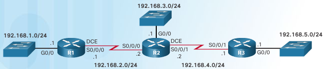

For instance, refer to the topology above. RIP sends updates out of its G0/0 interface even though no RIP device exists on that LAN. R1 has no way of knowing this and, as a result, sends an update every 30 seconds. Sending out unneeded updates on a LAN impacts the network in three ways:

 * Wasted Bandwidth - Bandwidth is used to transport unnecessary updates. Because RIP updates are either broadcasted or multicasted, switches also forward the updates out all ports.
 * Wasted Resources - All devices on the LAN must process the update up to the transport layers, at which point the devices will discard the update.
 * Security Risk - Advertising updates on a broadcast network is a security risk. RIP updates can be intercepted with packet sniffing software. Routing updates can be modified and sent back to the router, corrupting the routing table with false metrics that misdirect traffic.

Use the **passive-interface** router configuration command to prevent the transmission of routing updates through a router interface, *but still allow that network to be advertised to other routers*. The command stops routing updates out the specified interface. However, the network that the specified interface belongs to is still advertised in routing updates that are sent out other interfaces.

.. code:: 

   Configure passive interface on G0/0 and return to privileged EXEC mode.
   R2(config)# router rip
   R2(config-router)# passive-interface g0/0
   R2(config-router)# end
   R2#
   *Mar 10 16:33:32.391: %SYS-5-CONFIG_I: Configured from console by console
   Verify the RIP protocol settings on R2.
   R2# show ip protocols
   
   *** IP Routing is NSF aware *** 
    
   Routing Protocol is "rip" 
     Outgoing update filter list for all interfaces is not set 
     Incoming update filter list for all interfaces is not set 
     Sending updates every 30 seconds, next due in 17 seconds 
     Invalid after 180 seconds, hold down 180, flushed after 240 
     Redistributing: rip 
     Default version control: send version 2, receive version 2 
       Interface             Send  Recv  Triggered RIP  Key-chain 
       Serial0/0/0           2     2
       Serial0/0/1           2     2
     Automatic network summarization is not in effect 
     Maximum path: 4 
     Routing for Networks: 
       192.168.2.0 
       192.168.3.0 
       192.168.4.0 
     Passive Interface(s): 
       GigabitEthernet0/0 
     Routing Information Sources: 
       Gateway         Distance      Last Update 
       192.168.2.1          120      00:00:24 
       Gateway         Distance      Last Update 
       192.168.4.1          120      00:00:23 
     Distance: (default is 120)
   R2#
   
   You are now logged into R3. Configure passive interface to be the default setting. Remove the passive interface setting from S0/0/1 and return to privileged EXEC mode.
   R3(config)# router rip
   R3(config-router)# passive-interface default
   R3(config-router)# no passive-interface s0/0/1
   R3(config-router)# end
   R3#
   *Mar 10 16:34:28.899: %SYS-5-CONFIG_I: Configured from console by console
   Verify the RIP protocol settings on R3.
   R3# show ip protocols
   *** IP Routing is NSF aware *** 
    
   Routing Protocol is "rip" 
     Outgoing update filter list for all interfaces is not set 
     Incoming update filter list for all interfaces is not set 
     Sending updates every 30 seconds, next due in 15 seconds 
     Invalid after 180 seconds, hold down 180, flushed after 240 
     Redistributing: rip 
     Default version control: send version 2, receive version 2 
       Interface             Send  Recv  Triggered RIP  Key-chain 
       Serial0/0/1           2     2
     Automatic network summarization is not in effect 
     Maximum path: 4 
     Routing for Networks: 
       192.168.4.0 
       192.168.5.0 
     Passive Interface(s): 
       Embedded-Service-Engine0/0 
       GigabitEthernet0/0 
       GigabitEthernet0/1 
       GigabitEthernet0/3 
       Serial0/0/0 
       RG-AR-IF-INPUT1 
     Routing Information Sources: 
       Gateway         Distance      Last Update 
       192.168.4.2          120      00:00:23 
     Distance: (default is 120) 
   R3#

There is no need for R1, R2, and R3 to forward RIP updates out of their LAN interfaces. The configuration in Figure 2 identifies the R1 G0/0 interface as passive. *The show ip protocols command is then used to verify that the Gigabit Ethernet interface was passive.*
.. note:: Notice that the G0/0 interface is no longer listed as sending or receiving version 2 updates, but instead is now listed under the Passive Interface(s) section. Also notice that the network 192.168.1.0 is still listed under Routing for Networks, which means that this network is still included as a route entry in RIP updates that are sent to R2.

.. note:: All routing protocols support the passive-interface command.

configure the LAN interface as a passive interface on R2 and R3.

.. code::

	R2(config)# router rip
	R2(config-router)# passive-interface g0/0
	R2(config-router)# end
   	
	Verify the RIP protocol settings on R2
	R2# show ip protocols

	R3(config)# router rip
	R3(config-router)# passive-interface default
	R3(config-router)# no passive-interface s0/0/1
	R3(config-router)# end

	Verify the RIP protocol settings on R3
	R3# show ip protocols

As an alternative, all interfaces can be made passive using the passive-interface default command. Interfaces that should not be passive can be re-enabled using the no passive-interface command.

propagate a default route
-------------------------

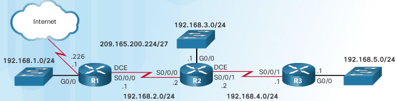

To propagate a default route in RIP, the edge router must be configured with:

   * A default static route using the ip route 0.0.0.0 0.0.0.0 command.

    * The **default-information originate** router configuration command. This instructs R1 to originate default information, by propagating the static default route in RIP updates.

.. code::

	R1(config)# ip route 0.0.0.0 0.0.0.0 s0/0/1 209.165.200.226
	R1(config)# router rip
	R1(config-router)# default-information originate
	R1(config-router)# end 

Example above configures a fully-specified default static route to the service provider and then the route is propagated by RIP. Notice that R1 now has a Gateway of Last Resort and default route installed in its routing table.

exercise example
----------------

 .. code::

   a router that is connected to an isp
   ------------------------------------ 
   hostname R1
   !
   ip cef
   no ipv6 cef
   !
   interface GigabitEthernet0/0
    ip address 192.168.1.1 255.255.255.0
    duplex auto
    speed auto
   !
   interface GigabitEthernet0/1
    no ip address
    duplex auto
    speed auto
    shutdown
   !
   interface GigabitEthernet0/2
    no ip address
    duplex auto
    speed auto
    shutdown
   !
   interface Serial0/0/0
    ip address 192.168.2.1 255.255.255.0
    clock rate 2000000
   !
   interface Serial0/0/0
    ip address 192.168.2.1 255.255.255.0
    clock rate 2000000
   !
   interface Serial0/0/1
    ip address 209.165.200.225 255.255.255.252
   !
   interface Vlan1
    no ip address
    shutdown
   !
   router rip
    version 2
    passive-interface GigabitEthernet0/0
    network 192.168.1.0
    network 192.168.2.0
    default-information originate
   !
   ip classless
   ip route 0.0.0.0 0.0.0.0 Serial0/0/1 

Remote Networks in Routing table
--------------------------------
.. image:: _static/RemoteNetworkEntries.png

* Route Source: ids how route was learned
* Dest Network: ids address of the remote network
* Administrative Distance: ids *trustworthiness* of route source
* Metric: ids value assigned to reach remote NW. Lower is better
* Next hop: ids ipv4 address of next router to forward packet to
* route timestamp: ids from when the route was last heard
* Outgoing interface: ids exit interface to use to forward packet to final destination

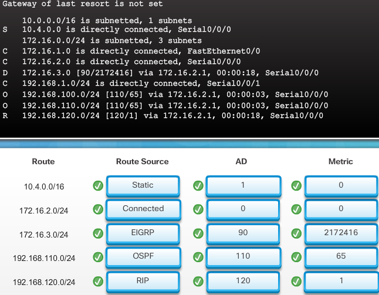

Routing table terms
-------------------
* Ultimate route:
   has next-hop ip and/or exit interface
   
* Level 1 route:
   a route with a subnet mask *equal or less than classful mask* of the network address
    * Network route - *equal* to that of classful mask
    * Supernet route - *less* than classful mask, eg summary address
    * Default route - static route with the address 0.0.0.0/0
      
      .. note:: source of Level 1 route = D.C. network, static, or dynamic routing protocol
      .. note:: level 1 route are also ultimate routes

* Level 1 parent route: Level 1 network route (=mask) that is subnetted:
  
  .. note:: L1 parent route = never an ultimate route e.g. 172.16.0.0/16 #of subnets, #different masks

* Level 2 child routes aka **subnet** route: subnet of a *classful network address*:
  
  .. note:: L1 parent route contains L2 child routes
  .. warning:: no L1 parent = it ain't no L2 child

  +-------------+------------------+
  |172.16.0.0   |   172.16.1.0/24  |
  |             +------------------+
  |             |   172.16.2.0/24  |
  |             +------------------+
  |             |   172.16.3.0/24  |
  |             +------------------+
  |             |   172.16.4.0/28  |
  +-------------+------------------+
  |209.165.200.0|209.165.200.224/30|
  |             +------------------+
  |             |209.165.200.228/30|
  |             +------------------+
  |             |209.165.200.232/30|
  +-------------+------------------+

Route lookup process
--------------------

#. if a level 1 ultimate route (exit|nhop) = forward
#. if lvl 1 parent route (equal to snmask & never and no exit|nhop) then
  
   * check if match with level 2 child (subnet) route (=bigger than nwmask)

#. continue searching lvl 1 supernet routes (=less than nwmask) for match including default route if there is one
#. sorry no match, drop it like it's hot

.. note:: A route referencing only a next-hop IP address and not an exit interface, must be resolved to a route with an exit interface, if Cisco Express Forwarding (CEF) is not being used. Without CEF, a recursive lookup is performed on the next-hop IP address until the route is resolved to an exit interface. CEF is enabled by default.

IPv6 Routing Table Entries
--------------------------

reference topology

.. image:: _static/ipv6_routingtable_entries.png

.. note:: Because IPv6 is classless by design, all routes are effectively **L1 ultimate routes**. There is no L1 parent or L2 child routes

R1,2,3 in full mesh topology. All routers have redundant paths to various networks.
R2 is the edge router to the ISP, however a default static route is not being advertised
EIGRP is cfgd on all of them

Directly connected routes on R1 = show ipv6 route --> C and L

.. image:: _static/routingtable_ipv6.png

.. warning:: RIP configuration on a router should contain network statements for connected networks only. Remote networks are learned from routing updates from other routers.

QnA Chapter 3
-------------

What is a purpose of the network command when configuring RIPv2 as the routing protocol?
  	
V  It identifies the interfaces that belong to a specified network.
  	
X  It specifies the remote network that can now be reached.
  	
   It immediately advertises the specified network to neighbor routers with a classful mask.
  	
   It populates the routing table with the network entry.
  
The network command is used to advertise the directly connected networks of a router. It enables RIP on the interfaces that belong to the specified network.

The command being entered by the engineer will cause RIPv2 to activate on the interface for the 192.168.10.0 network. **If RIPv1 is configured, the router will send only version 1 updates, but will listen for both version 1 and version 2 updates. If RIPv2 is configured, the router will send and listen to only version 2 updates.**

Chapter 4 switched networks
===========================

examination of the flow of traffic in a modern network. It examines some of the current network design models and the way LAN switches build forwarding tables and use the MAC address information to efficiently switch data between hosts. 

elements of a converged network
-------------------------------

* Call control - Telephone call processing, caller ID, call transfer, hold, and conference
* Voice messaging - Voicemail
* Mobility - Receive important calls wherever you are
* Automated attendant - Serve customers faster by routing calls directly to the right department or individual

Hierarchy in the Borderless Switched Network
--------------------------------------------

* Hierarchical - Facilitates understanding the role of each device at every tier, simplifies deployment, operation, and management, and reduces fault domains at every tier
* Modularity - Allows seamless network expansion and integrated service enablement on an on-demand basis
* Resiliency - Satisfies user expectations for keeping the network always on
* Flexibility - Allows intelligent traffic load sharing by using all network resources

The three critical layers within these tiered designs are the **access, distribution, and core layers**.

.. image:: _static/accesslayer.png

Access, Distribution, and Core Layers

Access Layer
------------

The access layer represents the network edge, where traffic enters or exits the campus network. Traditionally, the primary function of an access layer switch is to provide network access to the user. Access layer switches connect to distribution layer switches, which implement network foundation technologies such as routing, quality of service, and security.

To meet network application and end-user demand, the next-generation switching platforms now provide more converged, integrated, and intelligent services to various types of endpoints at the network edge. Building intelligence into access layer switches allows applications to operate on the network more efficiently and securely.

Distribution Layer
------------------

The distribution layer interfaces between the access layer and the core layer to provide many important functions, including:

   * Aggregating large-scale wiring closet networks

   * Aggregating Layer 2 broadcast domains and Layer 3 routing boundaries

   * Providing intelligent switching, routing, and network access policy functions to access the rest of the network

   * Providing high availability through redundant distribution layer switches to the end-user and equal cost paths to the core

   * Providing differentiated services to various classes of service applications at the edge of the network

Core Layer
----------

The core layer is the network backbone. It connects several layers of the campus network. The core layer serves as the aggregator for all of the other campus blocks and ties the campus together with the rest of the network. The primary purpose of the core layer is to provide fault isolation and high-speed backbone connectivity.

Figure 1 shows a three-tier campus network design for organizations where the access, distribution, and core are each separate layers. To build a simplified, scalable, cost-effective, and efficient physical cable layout design, the recommendation is to build an extended-star physical network topology from a centralized building location to all other buildings on the same campus.

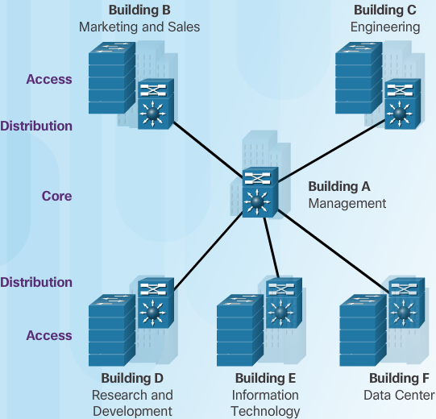

In some cases where extensive physical or network scalability does not exist, maintaining separate distribution and core layers is not required. In smaller campus locations where there are fewer users accessing the network or in campus sites consisting of a single building, separate core and distribution layers may not be needed. In this scenario, the recommendation is the alternate two-tier campus network design, also known as the collapsed core network design.

Figure 2 shows a two-tier campus network design example for an enterprise campus where the distribution and core layers are collapsed into a single layer.
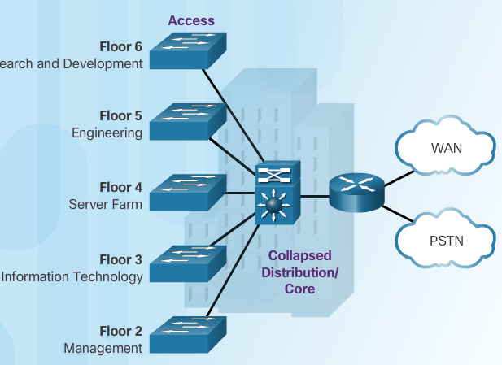

Borderless switched networks

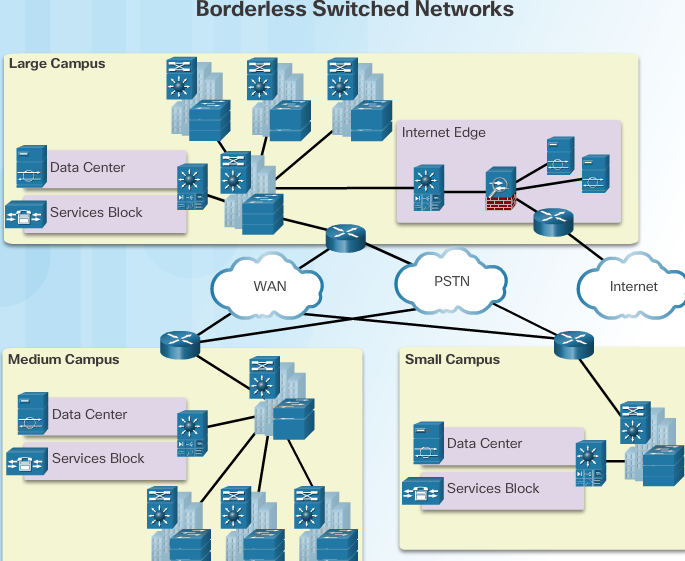

considerations switch
---------------------
Fixed - Modular - Stackable

*  Cost: The cost of a switch will depend on the number and speed of the interfaces, supported features, and expansion capability.
*  Port Density: Network switches must support the appropriate number of devices on the network.
*  Power: It is now common to power access points, IP phones, and even compact switches using Power over Ethernet (PoE). In addition to PoE considerations, some chassis-based switches support redundant power supplies.
*  Reliability: The switch should provide continuous access to the network.
*  Port Speed: The speed of the network connection is of primary concern to end users.
*  Frame Buffers: The ability of the switch to store frames is important in a network where there might be congested ports to servers or other areas of the network.
*  Scalability: The number of users on a network typically grows over time; therefore, the switch should provide the opportunity for growth.

store n forward switching
-------------------------

Store-and-forward switching has two primary characteristics that distinguish it from cut-through: error checking and automatic buffering.

A store-and-forward switch drops frames that do not pass the FCS check; therefore, it does not forward invalid frames. By contrast, a cut-through switch may forward invalid frames because no FCS check is performed.

Cut-Through Switching
---------------------

start forwarding a frame earlier than store-and-forward switching. There are two primary characteristics of cut-through switching: rapid frame forwarding and fragment free.

Rapid Frame Forwarding
^^^^^^^^^^^^^^^^^^^^^^
With today’s MAC controllers and ASICs, a switch using the cut-through method can quickly decide whether it needs to examine a larger portion of a frame’s headers for additional filtering purposes. For example, the switch can analyze past the first 14 bytes (the source MAC address, destination MAC, and the EtherType fields), and examine an additional 40 bytes in order to perform more sophisticated functions relative to IPv4 Layers 3 and 4.

Fragment Free Forwarding
^^^^^^^^^^^^^^^^^^^^^^^^
Fragment free switching is a modified form of cut-through switching in which the switch waits for the collision window (64 bytes) to pass before forwarding the frame. This means each frame will be checked into the data field to make sure no fragmentation has occurred. Fragment free switching provides better error checking than cut-through, with practically no increase in latency. 

Collision domains
-----------------

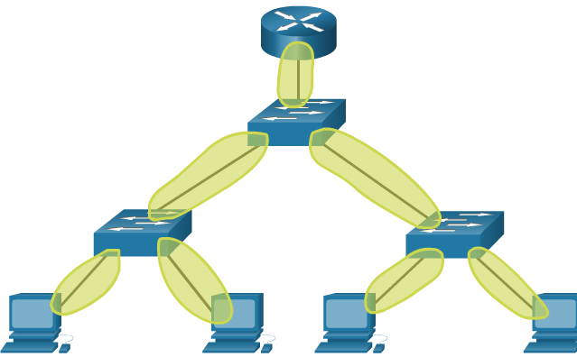

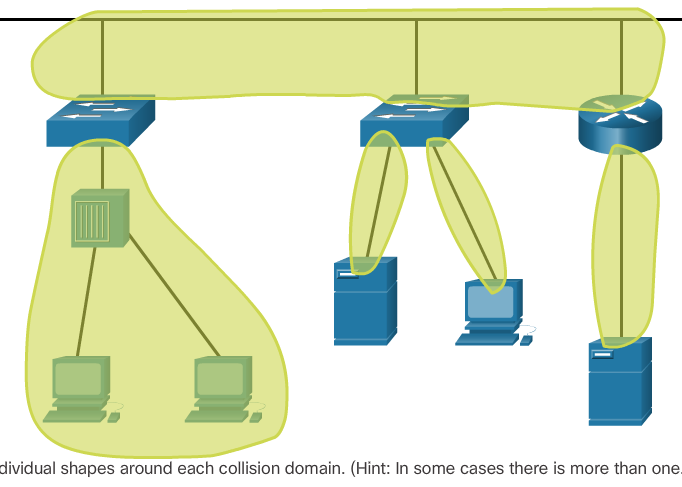

QnA Ch4
-------

Which service is provided by an automated attendant feature on a converged network?
* Call routing

* The automated attendant feature increases the speed of voice services by routing calls directly to individuals or departments. Point-to-point video and video conferencing describe video services on a converged network. An IT management interface is part of a converged network solution that allows IT personnel to facilitate moves, adds, and changes through a centralized application.

Stackable switches provide fault tolerance and bandwidth availability by using special cables between switches and are less costly to implement than modular switches.

.. note:: What is a basic function of the Cisco Borderless Architecture distribution layer? Aggregating Layer 3 routing boundaries

Match the borderless switched network guideline description to the principle.

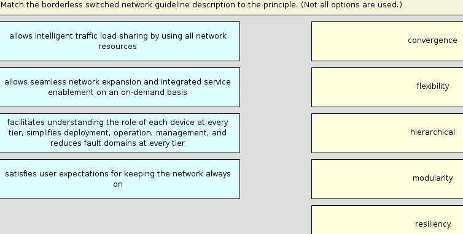

Place the options in the following order:

flexibility:
 allows intelligent traffic load sharing by using all network resources

hierarchical:
 facilitates understanding the role of each device at every tier, simplifies deployment, operation, management, and reduces fault domains at every tier

modularity:
 allows seamless network expansion and integrated service enablement on an on-demand basis

resiliency:
 satisfies user expectations for keeping the network always on

Chapter 5 Switch Configuration
==============================

Configure BOOT Environment variable
-----------------------------------

.. code::

   S1(config)# boot system flash:/c2960-lanbasek9-mz.150-2.SE/c2960-lanbasek9-mz.150-2.SE.bin
                command     storage   path to location in fs     IOS filename

   S1# show boot

Switch boot sequence
--------------------
#. loads POST from ROM. Checks CPU subsystem. Tests CPU, DRAM & portion of flash device
#. loads BOOT LOADER software from ROM, runs immediately after POST
#. BOOT LOADER performs low-level CPU initialization. Initializes CPU registers that control where physical memory is mapped, quantity of memory and its speed
#. BOOT LOADER initializes flash file system on the system board
#. BOOT LOADER locates & loads a default IOS image into memory 

BOOT environment variable. If this variable is not set, the switch attempts to load and execute the first executable file it can by performing a recursive, depth-first search throughout the flash file system

Recover from System Crash
--------------------------

#. connect by console cable, configure terminal emulation software
#. unplug power cord
#. reconnect power and hold down MODE button while system LED is flashing green
#. Continue pressing MODE button while LED turns briefly amber and then solid green. Now release the button
#. boot loader **switch:** prompt appears

switch: dir flash:

Catalyst 2960 switch LEDs
^^^^^^^^^^^^^^^^^^^^^^^^^
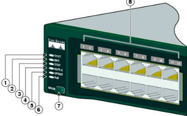

#. System LED: system has power and is functioning properly. If Amber = power but not working properly
#. RPS LED: blinking = connected but providing power to another device. Amber = standby mode Blinking Amber = providing power due to main PSU failed
#. Port Status LED (default mode): alternating green-amber = link fault. Amber/blinking Amber = no forwarding/port blocked to prevent loop
#. Port Duplex mode LED: green = full duplex
#. Port Speed LED: off = 10Mb/s green=100Mb/s blinking green=1000Mb/s
#. PoE Mode LED: Amber = 1or+ denied power BlinkingAmber = off due to fault| PoE fault Green= PoE on Alterating Green-Amber = no power to not exceed switch power capacity
#. Mode button
#. port LEDs

.. note:: By default, the switch is configured to have the management of the switch controlled through VLAN 1. All ports are assigned to VLAN 1 by default. For security purposes, it is considered a best practice to use a VLAN other than VLAN 1 for the management VLAN.

Configure Sw management ipv4
----------------------------

.. code::

   S1# configure terminal
   S1(config)# interface vlan 99
   S1(config-if)# ip address 172.17.99.11 255.255.255.0
   S1(config-if)# no shutdown
   S1(config-if)# end
   S1# copy running-config startup-config

.. warning:: Notice that the VLAN 99 interface is in the down state even though you entered the no shutdown command. The interface is currently down because no switch ports are assigned to VLAN 99.

Assign all user ports to vlan
^^^^^^^^^^^^^^^^^^^^^^^^^^^^^

.. code::

   S1(config)# 
   interface range f0/1 – 24,g0/1 - 2
   S1(config-if-range)# switchport access vlan 99
   S1(config-if-range)#exit
   S1(config)# 
   %LINEPROTO-5-UPDOWN: Line protocol on Interface Vlan1, changed state to down 
   %LINEPROTO-5-UPDOWN: Line protocol on Interface Vlan99, changed state to up 
   
   S1# configure terminal
   S1(config)# ip default-gateway 172.17.99.1
   S1(config)# end
   S1# copy run start
   
   
configure & apply vlan 99
^^^^^^^^^^^^^^^^^^^^^^^^^

.. code::

   S1(config)# vlan 99 
   S1(config-vlan)# name vlan_name
   S1(config-vlan)# exit
   S1(config)# interface interface_id
   S1(config-if)# switchport access vlan 99

troubleshooting
^^^^^^^^^^^^^^^

.. code::

   S1# show interface vlan99
   S1# show ip interface vlan99
   S1# show vlan brief
   S1# show mac address-table
   S1# show mac address-table dynamic

basic template for less hassle
^^^^^^^^^^^^^^^^^^^^^^^^^^^^^^
from global conf mode past:

.. code::

   no ip domain-lookup 
   hostname S1 
   service password-encryption 
   enable secret class 
   banner motd # 
   Unauthorized access is strictly prohibited. # 
   Line con 0 
   password cisco 
   login 
   logging synchronous
   line vty 0 15
   password cisco
   login
   exit

Setup a static MAC address
--------------------------

.. code::

   S1# clear mac address-table dynamic
   S1# show mac address-table
   S1(config)# mac address-table static 0050.56BE.6C89 vlan 99 interface fastethernet 0/6
   S1# show mac address-table
   S1(config)# no mac address-table static 0050.56BE.6C89 vlan 99 interface fastethernet 0/6

Duplex communication
--------------------

When a switch port is operating in full-duplex mode, there is no collision domain associated with the port.

Gigabit Ethernet and 10Gb NICs require full-duplex connections to operate. In full-duplex mode, the collision detection circuit on the NIC is disabled. Frames that are sent by the two connected devices cannot collide because the devices use two separate circuits in the network cable. Full-duplex connections require a switch that supports full-duplex configuration, or a direct connection using an Ethernet cable between two devices. 

Standard, shared hub-based Ethernet configuration efficiency is typically rated at 50 to 60 percent of the stated bandwidth. Full-duplex offers 100 percent efficiency in both directions (transmitting and receiving). This results in a 200 percent potential use of the stated bandwidth.

Speed/auto-MDIX
---------------

.. code::

   S1# configure terminal
   S1(config)# interface fastethernet 0/1
   S1(config-if)# duplex auto
   S1(config-if)# speed auto
   S1(config-if)# mdix auto
   S1(config-if)# end
   S1# copy run start

   show controllers ethernet-controller fa 0/1 phy | include Auto-MDIX

check with show interfaces interface id

Verify interface status
-----------------------

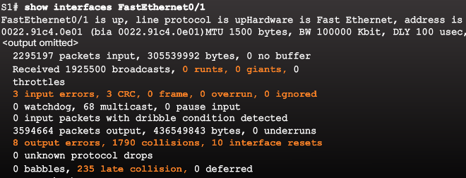

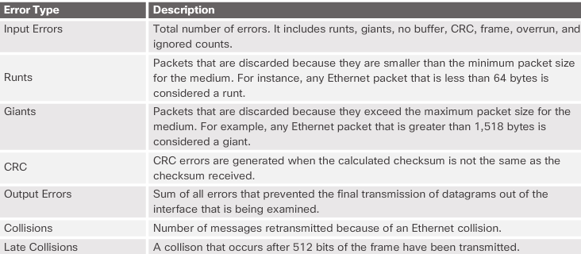

“Input errors” is the sum of all errors in datagrams that were received on the interface being examined. This includes runts, giants, CRC, no buffer, frame, overrun, and ignored counts.

“Output errors” is the sum of all errors that prevented the final transmission of datagrams out the interface that is being examined.

SSH Switch Setup
----------------

.. code::

   S1# config t
   S1(config)# hostname myswitch
   S1(config)# ip domain-name thegeekstuff.com
   S1(config)# crypto key generate rsa
   
   S1# line vty 0 4
   S1(config-line)# transport input ssh
   S1(config-line)# login local
   S1(config-line)# password 7
   S1(config-line)# exit
   S1# line console 0
   S1(config-line)# logging synchronous
   S1(config-line)# login local
   S1(config-line)# exit
   
   S1(config)# ip ssh version 2
   S1(config)# username god secret h3ll0n34rth
   S1# enable secret class
   S1# service password-encryption
   S1# show ip ssh

Disable unused ports
--------------------

.. code:: 

   S1# show run
   S1(config)# interface range fastethernet0/1 - 4, fastethernet0/10 - 15
   
Port Security
-------------

Secure MAC Address Types
^^^^^^^^^^^^^^^^^^^^^^^^

There are a number of ways to configure port security. The type of secure address is based on the configuration and includes:

 * Static secure MAC addresses - MAC addresses that are manually configured on a port by using the switchport port-security mac-address mac-address interface configuration mode command. MAC addresses configured in this way are stored in the address table and are added to the running configuration on the switch.
 * Dynamic secure MAC addresses - MAC addresses that are dynamically learned and stored only in the address table. MAC addresses configured in this way are removed when the switch restarts.
 * Sticky secure MAC addresses - MAC addresses that can be dynamically learned or manually configured, then stored in the address table and added to the running configuration.

Sticky Secure MAC addresses
^^^^^^^^^^^^^^^^^^^^^^^^^^^

To configure an interface to convert dynamically learned MAC addresses to sticky secure MAC addresses and add them to the running configuration, you must enable sticky learning.

Sticky learning is enabled on an interface by using the ``switchport port-security mac-address sticky interface configuration mode command``.
When this command is entered, the switch converts all dynamically learned MAC addresses, including those that were dynamically learned before sticky learning was enabled, into sticky secure MAC addresses. All sticky secure MAC addresses are added to the address table and to the running configuration.

Sticky secure MAC addresses can also be manually defined. When sticky secure MAC addresses are configured by using the ``switchport port-security mac-address sticky mac-address`` interface configuration mode command, all specified addresses are added to the address table and the running configuration.
If the sticky secure MAC addresses are saved to the startup configuration file, then when the switch restarts or the interface shuts down, the interface does not need to relearn the addresses. If the sticky secure addresses are not saved, they will be lost.

If sticky learning is disabled by using the ``no switchport port-security mac-address sticky`` interface configuration mode command, the sticky secure MAC addresses remain part of the address table, but are removed from the running configuration.

Characteristics of sticky secure MAC addresses.

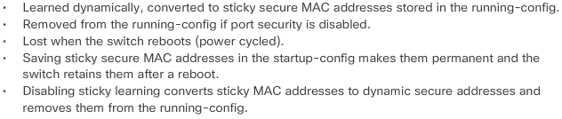

.. Note:: The port security feature will not work until port security is enabled on the interface using the switchport port-security command. 

Security Violation Modes
^^^^^^^^^^^^^^^^^^^^^^^^

Security Violation Modes include: **Protect Restrict Shutdown**

+--------------+----------------+-----------+----------+------------+-------------+
|Violation Mode|Forwards Traffic| Syslog msg| Error msg|up violation|Shutdown port|
+--------------+----------------+-----------+----------+------------+-------------+
| Protect      |  NO            | NO        | NO       | NO         | NO          |
+--------------+----------------+-----------+----------+------------+-------------+
| Restrict     |  NO            | YES       | NO       | YES        | NO          |
+--------------+----------------+-----------+----------+------------+-------------+
| Shutdown     |  NO            | NO        | NO       | YES        | YES         |
+--------------+----------------+-----------+----------+------------+-------------+

Security violations occur in these situations:

* A pc with MAC address not in address table attempts to access the interface when the table is full
* An address is being used on two secure interfaces in the same VLAN

Protect:
 When # of secure MACs reaches limit allowed on port, packets with unknown source addresses are dropped until enough secure MACs are removed  or the # of maximum allowable addresses is increased. There is no notification

Restrict:
 same as protect but there is a notification that a security violation has occurred.Syslog msg + violation count up

Shutdown (default):
 a violation causes IF to become error-disabled and turns off port LED. violation count up + shutdown port

.. note:: All 3 no longer forward traffic and don't display an error message. Restrict is only one with syslog msg, up violation = restrict & shutdown

.. code::
   
   static mac address
   switchport port-security mac-address mac-address
   dynamic adds only to table n removed at shutdown
   switchport port-security mac-address dynamic
   switchport port-security mac-address {sticky
   switchport port-security violation {protect | restrict | shutdown}

Configuring port security on IF
^^^^^^^^^^^^^^^^^^^^^^^^^^^^^^^

.. code::

   S1(config)# interface fastethernet 0/18
   S1(config-if)# switchport mode access
   S1(config-if)# switchport switchport port-security 
   S1(config-if)# switchport switchport port-security maximum 10
   S1(config-if)# switchport switchport port-security mac-address sticky 

   S1# show port-security interface fastethernet 0/18
   S1# show run | begin FastEthernet 0/18
   S1# show port-security address

This example shows how to enable port security on Fast Ethernet port 12 and how to set the maximum number of secure addresses to 5. The violation mode is the default, and no secure MAC addresses are configured.

.. code::

   Switch# configure terminal
   Enter configuration commands, one per line.  End with CNTL/Z.
   Switch(config)# interface fastethernet 3/12
   Switch(config-if)# switchport mode access
   Switch(config-if)# switchport port-security
   Switch(config-if)# switchport port-security maximum 5
   Switch(config-if)# switchport port-security mac-address sticky
   Switch(config-if)# end
   Switch# show port-security interface fastethernet 3/12
   Port Security              :Enabled
   Port Status                :Secure-up
   Violation Mode             :Shutdown
   Aging Time                 :0
   Aging Type                 :Absolute
   SecureStatic Address Aging :Enabled
   Maximum MAC Addresses      :5
   Total MAC Addresses        :0
   Configured MAC Addresses   :0
   Sticky MAC Addresses       :11
   Last Source Address        :0000.0000.0401
   Security Violation Count   :0

• To return the interface **to the default condition** as not a secure port, use the ``no switchport port-security`` interface configuration command.

• To return the interface **to the default number of secure MAC addresses**, use the ``no switchport port-security maximum value``.

• To **delete a MAC** address from the address table, use the ``no switchport port-security mac-address mac_address`` command.

• To return the **violation mode to the default condition (shutdown mode)**, use the ``no switchport port-security violation {restrict | shutdown}`` command.

• To **disable sticky learning** on an interface, use the ``no switchport port-security mac-address sticky`` command. The interface converts the sticky secure MAC addresses to dynamic secure addresses.

• To **delete a sticky secure MAC addresses** from the address table, use the ``no switchport port-security sticky mac-address mac_address`` command. To **delete all the sticky addresses on an interface or a VLAN**, use the ``no switchport port-security sticky interface interface-id`` command.

• To **clear dynamically learned** port security MAC in the CAM table, use the ``clear port-security dynamic`` command. The address keyword enables you to clear a secure MAC addresses. The interface keyword enables you to clear all secure addresses on an interface. 

This example shows how to configure a secure MAC address on Fast Ethernet port 5/1 and verify the configuration:

.. code::

   Switch# configure terminal
   Enter configuration commands, one per line.  End with CNTL/Z.
   Switch(config)# interface fastethernet 5/1
   Switch(config-if)# switchport mode access
   Switch(config-if)# switchport port-security
   Switch(config-if)# switchport port-security maximum 10
   Switch(config-if)# switchport port-security mac-address 0000.0000.0003 (Static secure MAC)
   Switch(config-if)# switchport port-security mac-address sticky
   Switch(config-if)#  
   switchport port-security mac-address sticky 0000.0000.0001 (Sticky static MAC)
   Switch(config-if)# switchport port-security mac-address sticky 0000.0000.0002
   Switch(config-if)# end
   Switch#show port address
   Secure Mac Address Table
   ------------------------------------------------------------------------
   Vlan  Mac Address       Type                   Ports   Remaining Age
   
                                                                 (mins)
   ----  -----------       ----                    -----   -------------
   1    0000.0000.0001    SecureSticky             Fa5/1        -
   1    0000.0000.0002    SecureSticky             Fa5/1        -
   1    0000.0000.0003    SecureConfigured         Fa5/1        -
   
   
   ------------------------------------------------------------------------
   Total Addresses in System (excluding one mac per port)     : 2
   Max Addresses limit in System (excluding one mac per port) : 10

Port security aging
^^^^^^^^^^^^^^^^^^^

To set the aging time & aging type for all secure addresses on a port

Use this to remove n add PCs on a secure port without deleting other secure MACs

To configure port security aging

.. code::

   Switch(config)# interface interface_id 
   Switch(config-if)# switchport port-security [ aging {static | time aging_time | type {absolute | inactivity} ]

   Switch(config)# interface fastethernet 5/1 
   Switch(config-if)# switchport port-security aging time 120

The **static** keyword enables aging for statically configured secure addresses on this port.

The **time aging_time** keyword specifies the aging time for this port. Valid range for aging_time is from 0 to 1440 minutes. If the time is equal to 0, aging is disabled for this port.

The **type** keyword sets the aging type as **absolute or inactive**. For absolute aging, all the secure addresses on this port ago out exactly after the time (minutes) specified and are removed from the secure address list. For inactive aging, the secure addresses on this port ago out only if there is no data traffic from the secure source address for the specified time period.

Verify

.. code::

   Switch# show port security [interface interface_id] [address]
  
   To disable port security aging for all secure addresses on a port:
   Switch# no switchport port-security aging time

.. code::

   This example displays output from the show port-security command when you do not enter an interface:
   
   Switch# show port-security
   
   Secure Port  MaxSecureAddr  CurrentAddr  SecurityViolation  Security Action
                   (Count)       (Count)          (Count)
   ---------------------------------------------------------------------------
         Fa3/1              2            2                  0         Restrict
         Fa3/2              2            2                  0         Restrict
         Fa3/3              2            2                  0         Shutdown
         Fa3/4              2            2                  0         Shutdown
         Fa3/5              2            2                  0         Shutdown
         Fa3/6              2            2                  0         Shutdown
         Fa3/7              2            2                  0         Shutdown
         Fa3/8              2            2                  0         Shutdown
        Fa3/10              1            0                  0         Shutdown
        Fa3/11              1            0                  0         Shutdown
        Fa3/12              1            0                  0         Restrict
        Fa3/13              1            0                  0         Shutdown
        Fa3/14              1            0                  0         Shutdown
        Fa3/15              1            0                  0         Shutdown
        Fa3/16              1            0                  0         Shutdown
   ---------------------------------------------------------------------------
   Total Addresses in System (excluding one mac per port)     :8
   Max Addresses limit in System (excluding one mac per port) :1024
   Global SNMP trap control for port-security                 :20 (traps per second)
   
   
This example displays output from the show port-security command for a specified interface:
   
.. code::

   Switch# show port-security interface fastethernet 5/1
   Port Security              : Enabled
   Port Status                : Secure-up
   Violation Mode             : Shutdown
   Aging Time                 : 0 mins
   Aging Type                 : Absolute
   SecureStatic Address Aging : Disabled
   Maximum MAC Addresses      : 1
   Total MAC Addresses        : 1
   Configured MAC Addresses   : 0
   Sticky MAC Addresses       : 1
   Last Source Address        : 0000.0001.001a
   Security Violation Count   : 0
   
   
This example displays output from the show port-security address command:
   
.. code::

   Switch#sh port-security address
   
             Secure Mac Address Table
   -------------------------------------------------------------------
   Vlan    Mac Address       Type                Ports   Remaining Age
                                                            (mins)
   ----    -----------       ----                -----   -------------
      1    0000.0001.0000    SecureConfigured    Fa3/1       15 (I)
      1    0000.0001.0001    SecureConfigured    Fa3/1       14 (I)
      1    0000.0001.0100    SecureConfigured    Fa3/2        -
      1    0000.0001.0101    SecureConfigured    Fa3/2        -
      1    0000.0001.0200    SecureConfigured    Fa3/3        -
      1    0000.0001.0201    SecureConfigured    Fa3/3        -
      1    0000.0001.0300    SecureConfigured    Fa3/4        -
      1    0000.0001.0301    SecureConfigured    Fa3/4        -
      1    0000.0001.1000    SecureDynamic    Fa3/5        -
      1    0000.0001.1001    SecureDynamic    Fa3/5        -
      1    0000.0001.1100    SecureDynamic    Fa3/6        -
      1    0000.0001.1101    SecureDynamic    Fa3/6        -
      1    0000.0001.1200    SecureSticky    Fa3/7        -
      1    0000.0001.1201    SecureSticky    Fa3/7        -
      1    0000.0001.1300    SecureSticky    Fa3/8        -
      1    0000.0001.1301    SecureSticky    Fa3/8        -
   -------------------------------------------------------------------
   Total Addresses in System (excluding one mac per port)     :8
   Max Addresses limit in System (excluding one mac per port) :1024

Check if ports in Error disabled state

``S1# show interface fa0/18 status``
``S1# show port-security interface fastethernet 0/18``

example exercise
^^^^^^^^^^^^^^^^
Requirements

· Configure S1 with the following initial settings:
  - Hostname
  - Banner that includes the word warning 
  - Console port login and password cisco
  - Encrypted enable password of class
  - Encrypt plain text passwords
  - Management interface addressing
· Configure SSH to secure remote access with the following settings:
  - Domain name of cisco.com
  - RSA key-pair parameters to support SSH version 2
  - Set SSH version 2
  - User admin with secret password ccna
  - VTY lines only accept SSH connections and use local login for authentication
· Configure the port security feature to restrict network access:
  - Disable all unused ports.
  - Set the interface mode to access.
  - Enable port security to allow only two hosts per port.
  - Record the MAC address in the running configuration.
  - Ensure that port violations disable ports.

.. code::

   S1#show port-security interface ?
     Ethernet         IEEE 802.3
     FastEthernet     FastEthernet IEEE 802.3
     GigabitEthernet  GigabitEthernet IEEE 802.3z
   	
   S1#show port-security interface FastEthernet 0/1
   Port Security              : Enabled
   Port Status                : Secure-up
   Violation Mode             : Shutdown
   Aging Time                 : 0 mins
   Aging Type                 : Absolute
   SecureStatic Address Aging : Disabled
   Maximum MAC Addresses      : 2
   Total MAC Addresses        : 0
   Configured MAC Addresses   : 0
   Sticky MAC Addresses       : 0
   Last Source Address:Vlan   : 0000.0000.0000:0
   Security Violation Count   : 0
   
   S1#show port-security ?
     address    Show secure address
     interface  Show secure interface
     <cr>
   S1#show port-security address
   			Secure Mac Address Table
   -------------------------------------------------------------------------------
   Vlan	Mac Address	Type			Ports		Remaining Age
   								(mins)
   ----	-----------	----			-----		-------------
   ------------------------------------------------------------------------------
   Total Addresses in System (excluding one mac per port)     : 0
   Max Addresses limit in System (excluding one mac per port) : 1024
   S1#show ip ?
     access-lists  List access lists
     arp           IP ARP table
     dhcp          Show items in the DHCP database
     interface     IP interface status and configuration
     ssh           Information on SSH
   	
   S1#show interface FastEthernet0/1
   FastEthernet0/1 is up, line protocol is up (connected)
     Hardware is Lance, address is 00d0.bc57.1001 (bia 00d0.bc57.1001)
    BW 100000 Kbit, DLY 1000 usec,
        reliability 255/255, txload 1/255, rxload 1/255
     Encapsulation ARPA, loopback not set
     Keepalive set (10 sec)
     Full-duplex, 100Mb/s
     input flow-control is off, output flow-control is off
     ARP type: ARPA, ARP Timeout 04:00:00
     Last input 00:00:08, output 00:00:05, output hang never
     Last clearing of "show interface" counters never
     Input queue: 0/75/0/0 (size/max/drops/flushes); Total output drops: 0
     Queueing strategy: fifo
     Output queue :0/40 (size/max)
     5 minute input rate 0 bits/sec, 0 packets/sec
     5 minute output rate 0 bits/sec, 0 packets/sec
        956 packets input, 193351 bytes, 0 no buffer
        Received 956 broadcasts, 0 runts, 0 giants, 0 throttles
        0 input errors, 0 CRC, 0 frame, 0 overrun, 0 ignored, 0 abort
        0 watchdog, 0 multicast, 0 pause input
        0 input packets with dribble condition detected
        2357 packets output, 263570 bytes, 0 underruns
        0 output errors, 0 collisions, 10 interface resets
        0 babbles, 0 late collision, 0 deferred
        0 lost carrier, 0 no carrier
        0 output buffer failures, 0 output buffers swapped out
   
   S1#show port-security interface FastEthernet 0/1
   Port Security              : Enabled
   Port Status                : Secure-up
   Violation Mode             : Shutdown
   Aging Time                 : 0 mins
   Aging Type                 : Absolute
   SecureStatic Address Aging : Disabled
   Maximum MAC Addresses      : 2
   Total MAC Addresses        : 0
   Configured MAC Addresses   : 0
   Sticky MAC Addresses       : 0
   Last Source Address:Vlan   : 0000.0000.0000:0
   Security Violation Count   : 0
   
   S1#show port-security interface FastEthernet 0/2
   Port Security              : Enabled
   Port Status                : Secure-up
   Violation Mode             : Shutdown
   Aging Time                 : 0 mins
   Aging Type                 : Absolute
   SecureStatic Address Aging : Disabled
   Maximum MAC Addresses      : 2
   Total MAC Addresses        : 0
   Configured MAC Addresses   : 0
   Sticky MAC Addresses       : 0
   Last Source Address:Vlan   : 0000.0000.0000:0
   Security Violation Count   : 0

   S1#show port-security 
   Secure Port MaxSecureAddr CurrentAddr SecurityViolation Security Action
                  (Count)       (Count)        (Count)
   --------------------------------------------------------------------
           Fa0/1        2          0                 0         Shutdown
           Fa0/2        2          0                 0         Shutdown
   ----------------------------------------------------------------------

There are 10 best practices that represent the best insurance for a network:

#. Develop a written security policy for the organization.
#. Shut down unused services and ports.
#. Use strong passwords and change them often.
#. Control physical access to devices.
#. Avoid using standard insecure HTTP websites, especially for login screens. Instead use the more secure HTTPS.
#. Perform backups and test the backed up files on a regular basis.
#. Educate employees about social engineering attacks, and develop policies to validate identities over the phone, via email, and in person.
#. Encrypt sensitive data and protect it with a strong password.
#. Implement security hardware and software, such as firewalls.
#. Keep IOS software up-to-date by installing security patches weekly or daily, if possible.

QnA Chapter 5
-------------

3 causes of interface up - line protocol down
* encapsulation mismatch
* other end = error-disabled
* hardware

Type of Ethernet frame that is smaller than 64bytes:
 runt

Indication of a media or cable error:
 CRC error

A condition that occurs if a collision happens after 512bit have been transmitted: late collision

a cisco switch feature that limits # of MAC addresses allowed through a port:
 port security

a method of port security configuration whereby learned MAC addresses are deleted if the switch is restarted:
 dynamic

a method of port security that can be dynamically learned & once learned saved to the configuration saved in NVRAM:
 sticky

default security violation for port security:
 shutdown

Which command displays information about the auto-MDIX setting for a specific interface?:
 show controllers

steps needed to configure a switch for SSH:
 + Create a local user.
 + Generate RSA keys.
 + Configure a domain name.
 + Use the login local command.
 + Use the transport input ssh command.
 + Order does not matter within this group.

What is a possible cause of runt Ethernet frames when a switch is being used:
 malfunctioning NIC (not a late collision)

.. note:: A runt frame is a frame that is smaller than 64 bytes, the minimum allowed Ethernet frame. This type of frame is usually due to a malfunctioning NIC or excessive collisions. Duplex misconfiguration can cause connectivity issues. Excessive cable length can generate CRC errors and/or late collisions.

switch and gateways:
 If the switch was unable to find and load the IOS, the prompt would be switch:. A Layer 2 switch does not provide the default gateway for connected hosts. The default gateway is provided by a Layer 3 device. The switch cannot be managed remotely until a management VLAN and a default gateway have been configured.

what configuration must be in place for the auto-MDIX feature to function on a switch interface?:
 The speed and duplex of the interface must be configured for auto detect.

What would be the most common reason that a network technician would see the following Cisco switch prompt after the switch boots?:
 The switch operating system cannot be found.

.. note:: The prompt of "switch:" is seen when the switch cannot find an operating system and is in the boot loader environment where only a few basic commands can be used to repair the switch to an operational state. When an administrator has used Telnet or SSH to gain access to a switch prompt, the prompt usually asks for a username and password or is in user EXEC mode (switch>, for example).

.. note:: Escalating CRC errors usually means that the data is being modified during transmission from the host to the switch. This is often caused by high levels of electromagnetic interference on the link.

.. warning:: Port security cannot be enabled globally. All active switch ports should be manually secured using the switchport port-security command, which allows the administrator to control the number of valid MAC addresses allowed to access the port. This command does not specify what action will be taken if a violation occurs, nor does it change the process of populating the MAC address table.

Where are dynamically learned MAC addresses stored when sticky learning is enabled with the switchport port-security mac-address sticky command?:
 RAM

Match the link state to the interface and protocol status:
 * disable -> administratively down
 * Layer 1 problem -> down/down
 * Layer 2 problem -> up/down
 * operational -> up/up

If one end of an Ethernet connection is configured for full duplex and the other end of the connection is configured for half duplex, where would late collisions be observed?:
 on the half-duplex end of the connection

Chapter 6 VLANS
===============

One of the technologies used to improve network performance is the separation of large broadcast domains into smaller ones.

The role of providing access into a LAN is normally reserved for an access layer switch. A virtual local area network (VLAN) can be created on a Layer 2 switch to reduce the size of broadcast domains, similar to a Layer 3 device. VLANs are commonly incorporated into network design making it easier for a network to support the goals of an organization. While VLANs are primarily used within switched local area networks, modern implementations of VLANs allow them to span MANs and WANs.

Because VLANs segment the network, a Layer 3 process is required to allow traffic to move from one network segment to another.

This Layer 3 routing process can either be implemented using a router or a Layer 3 switch interface. The use of a Layer 3 device provides a method for controlling the flow of traffic between network segments, including network segments created by VLANs.

The first part of this chapter will cover how to configure, manage, and troubleshoot VLANs and VLAN trunks. The second part of this chapter focuses on implementing inter-VLAN routing using a router. Inter-VLAN routing on a Layer 3 switch is covered in a later course.

Packets destined for devices that do not belong to the VLAN must be forwarded through a device that supports routing.

.. note:: A VLAN creates a logical broadcast domain that can span multiple physical LAN segments. VLANs improve network performance by separating large broadcast domains into smaller ones. If a device in one VLAN sends a broadcast Ethernet frame, all devices in the VLAN receive the frame, but devices in other VLANs do not.

.. note:: VLANs enable the implementation of access and security policies according to specific groupings of users. Each switch port can be assigned to only one VLAN (with the exception of a port connected to an IP phone or to another switch).

VLAN Benefits
-------------

* Improved Security:
   Groups that have sensitive data are separated from the rest of the network
* Reduced Cost:
   Reduced need for expensive network upgrades and more efficient use of existing bandwidth and uplinks
* Better Performance:
   Dividing L2 networks into multiple logical workgroups (broadcast domains) reduces unnecessary traffic
* Smaller Broadcast Domains
* IT Efficiency:
   VLANs make it easier to manage the network because users with similar network requirements share the same VLAN. When a new switch is provisioned, all the policies and procedures already configured for the particular VLAN are implemented when the ports are assigned. It is also easy for the IT staff to identify the function of a VLAN by giving it an appropriate name
* Management Efficiency
* Simpler Project and Application Management: VLANs aggregate users and network devices to support business or geographic requirements. Having separate functions makes managing a project or working with a specialized application easier; an example of such an application is an e-learning development platform for faculty.

Each VLAN in a switched network corresponds to an IP network. Therefore, VLAN design must take into consideration the implementation of a hierarchical network-addressing scheme. Hierarchical network addressing means that IP network numbers are applied to network segments or VLANs in an orderly fashion that takes the network as a whole into consideration.

VLAN Types
----------

Data VLAN:
 for user generated traffic aka user VLAN. Used to seperate the network into groups of users or devices

Default VLAN:
 All switch ports become part of it after initial boot. VLAN 1. View with ``show vlan brief``. VLAN 2 cannot be renamed or deleted

Native VLAN:
 Assigned to an 802.1Q trunk port (links between switches) that supports VLAN tagged traffic & untagged traffic. Tagged means there is a **4-byte** tag inserted in original Ethernet frame header. The 802.1Q trunk port places untagged traffic on the native VLAN, that is **VLAN 1 by default**. It is a best practice to configure the native VLAN as an unused VLAN, distinct from VLAN 1 and other VLANs

Management VLAN:
 VLAN configured to access the management capabilities of a switch. VLAN 1 is the management VLAN by default. To create the management VLAN, the switch virtual interface (SVI) of that VLAN is assigned an IP address and a subnet mask, allowing the switch to be managed via HTTP, Telnet, SSH, or SNMP.

Voice VLANs
-----------
VoIP traffic requires:

* Assured bandwidth to ensure voice quality
* Transmission priority over other types of network traffic
* Ability to be routed around congested areas on the network
* Delay of less than 150 ms across the network

To meet these requirements, the entire network has to be designed to support VoIP. 

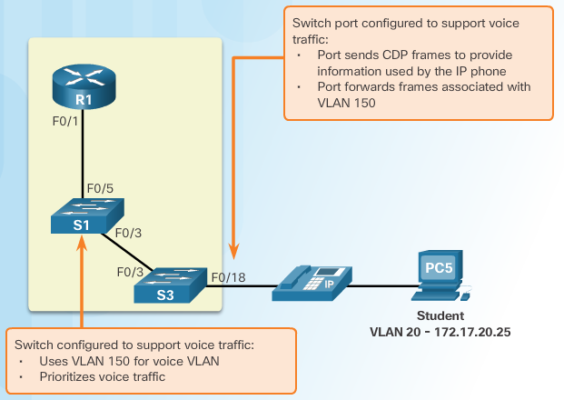

VLAN Trunks
-----------

A trunk is a point-to-point link between 2 network devices dat carries more than one VLAN. It extends VLANS across an entire network. This way no router is needed.

A trunk does not belong to a specific VLAN, it is a conduit for multiple VLANS between switches and routers. A trunk can also be used between a NW device and server or other device that is equiped with an 802.1Q capable NIC

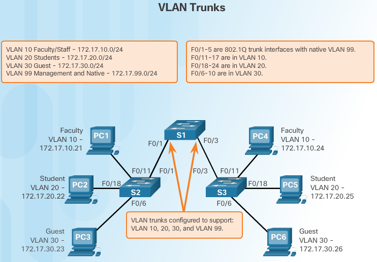

802.1Q Frame
------------

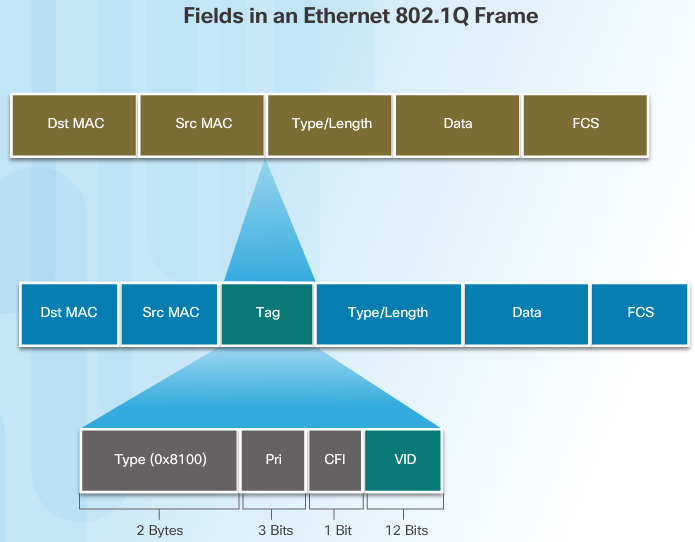

When the switch receives a frame on a port configured in access mode and assigned a VLAN, the switch inserts a VLAN tag in the frame header, recalculates the Frame Check Sequence (FCS), and sends the tagged frame out of a trunk port.

VLAN Tag Field Details
^^^^^^^^^^^^^^^^^^^^^^

The VLAN tag field consists of a Type field, a Priority field, a Canonical Format Identifier field, and VLAN ID field:
 * **Type** - A 2-byte value called the tag protocol ID (TPID) value. For Ethernet, it is set to hexadecimal 0x8100.
 * **User priority** - A 3-bit value that supports level or **service implementation**.
 * **Canonical Format Identifier** (CFI) - A 1-bit identifier that **enables Token Ring frames to be carried across Ethernet links**.
 * **VLAN ID** (VID) - A 12-bit VLAN identification number that supports up to 4096 VLAN IDs.

.. note:: After the switch inserts the Type and tag control information fields, it recalculates the FCS values and inserts the new FCS into the frame.

Native VLANS & 802.1Q Tagging
-----------------------------

Tagged Frames on the Native VLAN
^^^^^^^^^^^^^^^^^^^^^^^^^^^^^^^^
.. warning:: If an 802.1Q trunk port receives a tagged frame with the VLAN ID that is the same as the native VLAN, it drops the frame.

Consequently, when configuring a switch port on a Cisco switch, configure devices so that they do not send tagged frames on the native VLAN. Devices from other vendors that support tagged frames on the native VLAN include IP phones, servers, routers, and non-Cisco switches.

This scenario reflects poor network design for several reasons: it uses a hub, it has a host connected to a trunk link, and it implies that the switches have access ports assigned to the native VLAN. It also illustrates the motivation for the IEEE 802.1Q specification for native VLANs as a means of handling legacy scenarios.

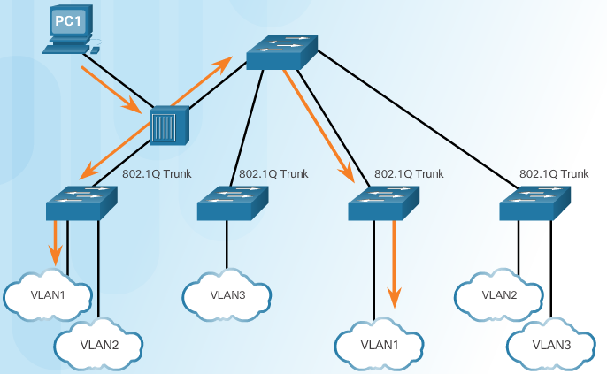

Untagged Frames on the Native VLAN
^^^^^^^^^^^^^^^^^^^^^^^^^^^^^^^^^^

When a Cisco switch trunk port receives untagged frames (which are unusual in a well-designed network), it forwards those frames to the native VLAN. If there are no devices associated with the native VLAN (which is not unusual) and there are no other trunk ports (which is not unusual), then the frame is dropped. The default native VLAN is VLAN 1.
When configuring an 802.1Q trunk port, a default Port VLAN ID (PVID) is assigned the value of the native VLAN ID. All untagged traffic coming in or out of the 802.1Q port is forwarded based on the PVID value.
For example, if VLAN 99 is configured as the native VLAN, the PVID is 99 and all untagged traffic is forwarded to VLAN 99. If the native VLAN has not been reconfigured, the PVID value is set to VLAN 1. 

Voice VLAN Tagging
------------------

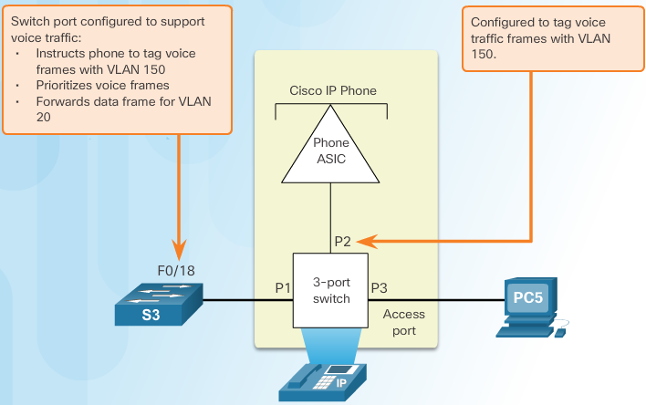

* Port 1 connects to the switch or other VoIP device.
* Port 2 is an internal 10/100 interface that carries the IP phone traffic.
* Port 3 (access port) connects to a PC or other device.

.. note:: An access port that is used to connect a Cisco IP phone can be configured to use two separate VLANs: one VLAN for voice traffic and another VLAN for data traffic from a device attached to the phone. The link between the switch and the IP phone acts as a trunk to carry both voice VLAN traffic and data VLAN traffic.

On the switch, the access is configured to send Cisco Discovery Protocol (CDP) packets that instruct an attached IP phone to send voice traffic to the switch in one of three ways, depending on the type of traffic:

* voice VLAN tagged with a Layer 2 class of service (CoS) priority value
* access VLAN tagged with a Layer 2 CoS priority value
* access VLAN, untagged (no Layer 2 CoS priority value)

802.1Q tagging
--------------

+----------------------------------------------+
| 802.1Q tag format                            |
+===================+========+=======+=========+
| 16 bits           | 3 bits | 1 bit | 12 bits |
+-------------------+--------+-------+---------+
| TPID              |           TCI            |
+                   +--------+-------+---------+
|                   | PCP    | DEI   |  VID    |
+-------------------+--------+-------+---------+
                                  
* Tag protocol identifier (TPID): a 16-bit field set to a value of 0x8100 in order to identify the frame as an IEEE 802.1Q-tagged frame. This field is located at the same position as the EtherType/length field in untagged frames, and is thus used to distinguish the frame from untagged frames.

* Tag control information (TCI)
  * Priority code point (PCP): a 3-bit field which refers to the `IEEE 802.1p <https://en.wikipedia.org/wiki/IEEE_802.1p>`_ `class of service <https://en.wikipedia.org/wiki/Class_of_service>`_ and maps to the frame priority level.

  * PCP values in order of priority are:
    
    * 1 (background)
    * 0 (best effort, default)
    * 2 (excellent effort)
    * 3 (critical application)
    * 4 (video)
    * 5 (voice)
    * 6 (internetwork control)
    * 7 (network control)
   
      These values can be used to prioritize different classes of traffic.

  * Drop eligible indicator (DEI): a 1-bit field. (formerly CFI[b]) May be used separately or in conjunction with PCP to indicate frames eligible to be dropped in the presence of congestion.

  * VLAN identifier (VID): a 12-bit field specifying the VLAN to which the frame belongs. The hexadecimal values of 0x000 and 0xFFF are reserved. All other values may be used as VLAN identifiers, allowing up to 4,094 VLANs. The reserved value 0x000 indicates that the frame does not carry a VLAN ID; in this case, the 802.1Q tag specifies only a priority and is referred to as a priority tag. On bridges, VID 0x001 (the default VLAN ID) is often reserved for a management VLAN; this is vendor-specific. The VID value 0xFFF is reserved for implementation use; it must not be configured or transmitted. 0xFFF can be used to indicate a wildcard match in management operations or filtering database entries.

For frames using `IEEE 802.2 <https://en.wikipedia.org/wiki/IEEE_802.2>`_/`SNAP <https://en.wikipedia.org/wiki/Subnetwork_Access_Protocol>`_ encapsulation with an organizationally unique identifier (OUI) field of 00-00-00 (so that the protocol ID field in the SNAP header is an EtherType), as would be the case on LANs other than Ethernet, the EtherType value in the SNAP header is set to 0x8100 and the aforementioned extra 4 bytes are appended after the SNAP header.[citation needed]

Because inserting the VLAN tag changes the frame, 802.1Q encapsulation forces a recalculation of the original frame check sequence field in the Ethernet trailer.

The IEEE 802.3ac standard increased the maximum Ethernet frame size from 1518 bytes to 1522 bytes to accommodate the four-byte VLAN tag. Some network devices that do not support the larger frame size will process these frames successfully, but may report them as "baby giant" anomalies.

QinQ allows multiple VLAN tags in an Ethernet frame; together these tags constitute a tag stack. When used in the context of an Ethernet frame, a QinQ frame is a frame that has 2 VLAN 802.1Q headers (double-tagged). 
`802.1ad QinQ <https://en.wikipedia.org/wiki/IEEE_802.1ad>`_
The idea is to provide, for example, the possibility for customers to run their own VLANs inside service provider's provided VLAN. This way the service provider can just configure one VLAN for the customer and customer can then treat that VLAN as if it were a trunk.

``show interfaces fa0/18 switchport``

``show vlan brief``

VLAN Ranges
-----------

normal range
^^^^^^^^^^^^
1, 1002 - 1005:
 Default Vlan, reserved for token ring & fiber distributed data interface (FDDI) Vlans
Configuration:
 Stored in VLAN database file called vlan.dat located in flash memory of switch
VTP:
 can only store normal range VLANs

extended range
^^^^^^^^^^^^^^
* big corporations need extended VLAN Ids
* are identified as between **1006 - 4094**
* cfgs **note written to vlan.dat**
* support fewer features than normal range
* saved by default in running config
* **VTP doesn't learn extended range VLANs**

.. warning:: If you need to use extended range VLANs and you switch does not support VTPv3, then you would need to set the mode to transparent for VTP, which technically means that you are still using VTP, but you are not learning any VTP information from other VTP enabled devices.
   With VTPv3 you can use the extended range VLANs by setting the mode to server, client, transparent or off, because VTPv3 does support the extended range VLANs.
   
Configuring VLANS
-----------------

.. code::

   S1# configure terminal
   S1(config)# interface F0/18 
   S1(config-if)# switchport mode access
   S1(config-if)# switchport access vlan 20
   S1(config-if)# end

.. note:: Use the **switchport voice vlan 150** command

Voice traffic must be labeled as trusted as soon as it enters the network. Use the ** mls qos trust[cos | device cisco-phone | dscp | ip-precedence] ** interface configuration command

.. code::

   S3(config)# vlan 20
   S3(config-vlan)# name student
   S3(config-vlan)# vlan 150
   S3(config-vlan)# name VOICE 
   S3(config-vlan)# exit 
   S3(config)# 
   S3(config)# interface fa0/18
   S3(config-if)# switchport mode access 
   S3(config-if)# switchport access vlan 20
   S3(config-if)# 
   S3(config-if)# mls qos trust cos 
   S3(config-if)# switchport voice vlan 150
   S3(config-if)# end
   S3#

configure optional parameters
^^^^^^^^^^^^^^^^^^^^^^^^^^^^^

.. code::

   switch# configure terminal
   switch(config)# vlan 5
   switch(config-vlan)# name accounting
   switch(config-vlan)# state active
   switch(config-vlan)# no shutdown 

adding ports to a VLAN
^^^^^^^^^^^^^^^^^^^^^^

This example shows how to configure an Ethernet interface to join VLAN 5

.. code::

   switch# configure terminal
   switch(config)# interface ethernet 1/13
   switch(config-if)# switchport access vlan 5

Verifying VLAN configuration
^^^^^^^^^^^^^^^^^^^^^^^^^^^^

show all VLANs defined in the range of 1-21

.. code::

   switch# show running-config vlan 1-21
   version 4.0(0)
   vlan 1
   vlan 5 

show the VLANs created on switch and their status

.. code::

   switch# show vlan
    
   VLAN Name Status Ports
   ---- -------------------------------- --------- -------------------------------
   1 default active Eth1/1, Eth1/2, Eth1/3, Eth1/4
   Eth1/5, Eth1/6, Eth1/7, Eth1/8
   Eth1/9, Eth1/10, Eth1/11
   Eth1/12, Eth1/15, Eth1/16
   Eth1/17, Eth1/18, Eth1/19
   Eth1/20, Eth1/21, Eth1/22
   Eth1/23, Eth1/24, Eth1/25
   Eth1/26, Eth1/27, Eth1/28
   Eth1/29, Eth1/30, Eth1/31
   Eth1/32, Eth1/33, Eth1/34
   Eth1/35, Eth1/36, Eth1/37
   Eth1/38, Eth1/39, Eth1/40
   Eth3/1, Eth3/2, Eth3/3, Eth3/4
   veth1/1
   13 VLAN0005 active Eth1/13, Eth1/14 

shows the details of VLAN 13 including its member ports

.. code::

   switch# show vlan id 13
    
   VLAN Name Status Ports
   ---- -------------------------------- --------- -------------------------------
   13 VLAN0005 active Eth1/13, Eth1/14
    
    
   VLAN Type MTU
   ---- ----- -----
   13 enet 576
    
   Remote SPAN VLAN
   ----------------
   Disabled
    
   Primary Secondary Type Ports
   ------ --------- --------------- ------------------------------------------- 

show the VLAN settings summary

.. code::

   switch# show vlan summary
 
   Number of existing VLANs : 2
   Number of existing VTP VLANs : 2
   Number of existing extended VLANs : 0 

remove VLAN Assignment
^^^^^^^^^^^^^^^^^^^^^^

Interface F0/18 was previously assigned to VLAN 20. The no switchport access vlan command is entered for interface F0/18

.. code::

   S1# configure terminal
   S1(config)# interface F0/18
   S1(config-if)# no switchport access vlan
   S1(config-if)# end

.. note:: VLAN 20 is still active even if no ports are assigned to it

``S1# show interfaces F0/18 switchport`` -> verifies that access VLAN for F0/18 has been reset to VLAN 1

.. note:: It is not necessary to first remove a port from a VLAN to change its VLAN membership. When an access port has its VLAN membership reassigned to another existing VLAN, the new VLAN membership simply replaces the previous VLAN membership. In Figure 4, port F0/11 is assigned to VLAN 20.

deleting VLANs
--------------

.. code::

   S1# conf t
   S1(config)# no vlan 20
   S1(config)# end
   S1# show vlan brief

.. warning:: Before deleting a VLAN, reassign all member ports to a different VLAN first. Any ports that are not moved to an active VLAN are unable to communicate with other hosts after the VLAN is deleted and until they are assigned to an active VLAN

Alternatively, the entire vlan.dat file can be deleted using the ``S1# delete flash:vlan.dat`` command or ``delete vlan.dat`` if on other location.

verifying VLAN info
-------------------

**show vlan summary**
**show vlan name student**
**show interfaces vlan 20**
**show interfaces F0/18 switchport**

TRUNK Configuration
-------------------

.. code::

   interface FastEthernet0/1
   switchport mode trunk
   switchport trunk native vlan 99
   switchport trunk allowed vlan 10,20,30,99
   end

Resetting Trunk to Default state 
^^^^^^^^^^^^^^^^^^^^^^^^^^^^^^^^

.. code::

   configure terminal
   interface FastEthernet0/1
   no switchport trunk allowed vlan
   no switchport trunk native vlan
   end
   
   Verify the trunk configuration with
   
   show interfaces f0/1 switchport command.

excercise
^^^^^^^^^

.. code::

   S3#conf t
   S3(config)#do show vlan brief
   
   VLAN Name                             Status    Ports
   ---- -------------------------------- --------- -------------------------------
   1    default                          active    Fa0/1, Fa0/2, Fa0/3, Fa0/4
                                                   Fa0/5, Fa0/7, Fa0/8, Fa0/9
                                                   Fa0/10, Fa0/12, Fa0/13, Fa0/14
                                                   Fa0/15, Fa0/16, Fa0/17, Fa0/19
                                                   Fa0/20, Fa0/21, Fa0/22, Fa0/23
                                                   Fa0/24, Gig0/1, Gig0/2
   10   Faculty/Staff                    active    Fa0/11
   20   Students                         active    Fa0/18
   30   Guest(Default)                   active    Fa0/6
   88   Management                       active    
   99   Native                           active    
   1002 fddi-default                     active    
   1003 token-ring-default               active    
   1004 fddinet-default                  active    
   1005 trnet-default                    active    
   S3(config)#
   S3(config)#interface Gig0/2
   S3(config-if)#switchport mode trunk 
   S3(config-if)#switchport trunk native vlan 99
   S3(config-if)#s%SPANTREE-2-UNBLOCK_CONSIST_PORT: Unblocking GigabitEthernet0/2 on VLAN0099. Port consistency restored.
   
   %SPANTREE-2-UNBLOCK_CONSIST_PORT: Unblocking GigabitEthernet0/2 on VLAN0001. Port consistency restored.
   switc
   S3(config-if)#switchport nat
   S3(config-if)#switchport native vl
   S3(config-if)#switchport native vlan 99
   S3(config-if)#show inter
   S3(config-if)#exit
   S3(config)#exit
   S3#
   show interface trunk
   Port        Mode         Encapsulation  Status        Native vlan
   Gig0/2      on           802.1q         trunking      99
   
   Port        Vlans allowed on trunk
   Gig0/2      1-1005
   
   Port        Vlans allowed and active in management domain
   Gig0/2      1,10,20,30,88,99
   
   Port        Vlans in spanning tree forwarding state and not pruned
   Gig0/2      1,10,20,30,88,99
   
   S3#show vlan brief 
   
   VLAN Name                             Status    Ports
   ---- -------------------------------- --------- -------------------------------
   1    default                          active    Fa0/1, Fa0/2, Fa0/3, Fa0/4
                                                   Fa0/5, Fa0/7, Fa0/8, Fa0/9
                                                   Fa0/10, Fa0/12, Fa0/13, Fa0/14
                                                   Fa0/15, Fa0/16, Fa0/17, Fa0/19
                                                   Fa0/20, Fa0/21, Fa0/22, Fa0/23
                                                   Fa0/24, Gig0/1
   10   Faculty/Staff                    active    Fa0/11
   20   Students                         active    Fa0/18
   30   Guest(Default)                   active    Fa0/6
   88   Management                       active    
   99   Native                           active    
   1002 fddi-default                     active    
   1003 token-ring-default               active    
   1004 fddinet-default                  active    
   1005 trnet-default                    active    
   S3#show interfaces GigabitEthernet 0/1
   GigabitEthernet0/1 is down, line protocol is down (disabled)
     Hardware is Lance, address is 00d0.9766.3301 (bia 00d0.9766.3301)
    BW 1000000 Kbit, DLY 1000 usec,
        reliability 255/255, txload 1/255, rxload 1/255
     Encapsulation ARPA, loopback not set
     Keepalive set (10 sec)
     Full-duplex, 1000Mb/s
     input flow-control is off, output flow-control is off
     ARP type: ARPA, ARP Timeout 04:00:00
     Last input 00:00:08, output 00:00:05, output hang never
     Last clearing of "show interface" counters never
     Input queue: 0/75/0/0 (size/max/drops/flushes); Total output drops: 0
     Queueing strategy: fifo
     Output queue :0/40 (size/max)
     5 minute input rate 0 bits/sec, 0 packets/sec
     5 minute output rate 0 bits/sec, 0 packets/sec
        956 packets input, 193351 bytes, 0 no buffer
        Received 956 broadcasts, 0 runts, 0 giants, 0 throttles
        0 input errors, 0 CRC, 0 frame, 0 overrun, 0 ignored, 0 abort
        0 watchdog, 0 multicast, 0 pause input
        0 input packets with dribble condition detected
        2357 packets output, 263570 bytes, 0 underruns
   
   S3#show interfaces GigabitEthernet 0/1 switchport 
   Name: Gig0/1
   Switchport: Enabled
   Administrative Mode: dynamic auto
   Operational Mode: down
   Administrative Trunking Encapsulation: dot1q
   Operational Trunking Encapsulation: native
   Negotiation of Trunking: On
   Access Mode VLAN: 1 (default)
   Trunking Native Mode VLAN: 1 (default)
   Voice VLAN: none
   Administrative private-vlan host-association: none
   Administrative private-vlan mapping: none
   Administrative private-vlan trunk native VLAN: none
   Administrative private-vlan trunk encapsulation: dot1q
   Administrative private-vlan trunk normal VLANs: none
   Administrative private-vlan trunk private VLANs: none
   Operational private-vlan: none
   Trunking VLANs Enabled: ALL
   Pruning VLANs Enabled: 2-1001
   Capture Mode Disabled
   Capture VLANs Allowed: ALL
   Protected: false
   Appliance trust: none

   on switch 1 running config
   --------------------------
   interface GigabitEthernet0/1
    switchport trunk native vlan 99
    switchport trunk allowed vlan 10,20,30,99
    switchport mode trunk
   !
   interface GigabitEthernet0/2
    switchport trunk native vlan 99
    switchport trunk allowed vlan 10,20,30,99
    switchport mode trunk

Verify commands
^^^^^^^^^^^^^^^

.. code::

   S1#show vlan brief
   
   VLAN Name                             Status    Ports
   ---- -------------------------------- --------- -------------------------------
   1    default                          active    Fa0/1, Fa0/2, Fa0/3, Fa0/4
                                                   Fa0/5, Fa0/6, Fa0/7, Fa0/8
                                                   Fa0/9, Fa0/10, Fa0/11, Fa0/12
                                                   Fa0/13, Fa0/14, Fa0/15, Fa0/16
                                                   Fa0/17, Fa0/18, Fa0/19, Fa0/20
                                                   Fa0/21, Fa0/22, Fa0/23, Fa0/24
   10   Faculty/Staff                    active    
   20   Students                         active    
   30   Guest(Default)                   active    
   88   Management                       active    
   99   Native                           active    
   1002 fddi-default                     active    
   1003 token-ring-default               active    
   1004 fddinet-default                  active    
   1005 trnet-default                    active    
   S1#show vt
   S1#show vtp ?
     counters  VTP statistics
     password  VTP password
     status    VTP domain status
   
   S1#show vtp status

   VTP Version                     : 2
   Configuration Revision          : 12
   Maximum VLANs supported locally : 255
   Number of existing VLANs        : 10
   VTP Operating Mode              : Server
   VTP Domain Name                 : 
   VTP Pruning Mode                : Disabled
   VTP V2 Mode                     : Disabled
   VTP Traps Generation            : Disabled
   MD5 digest                      : 0xD9 0x37 0x14 0xE2 0xAF 0x1D 0x1E 0x38 
   Configuration last modified by 0.0.0.0 at 3-1-93 00:01:36
   Local updater ID is 0.0.0.0 (no valid interface found)
   
   S1#show interfaces trunk

   Port        Mode         Encapsulation  Status        Native vlan
   Gig0/1      on           802.1q         trunking      99
   Gig0/2      on           802.1q         trunking      99
   
   Port        Vlans allowed on trunk
   Gig0/1      10,20,30,99
   Gig0/2      10,20,30,99
   
   Port        Vlans allowed and active in management domain
   Gig0/1      10,20,30,99
   Gig0/2      10,20,30,99
   
   Port        Vlans in spanning tree forwarding state and not pruned
   Gig0/1      10,20,30,99
   Gig0/2      10,20,30,99
   
   S1#show interface Gig0/1 switchport
   Name: Gig0/1
   Switchport: Enabled
   Administrative Mode: trunk
   Operational Mode: trunk
   Administrative Trunking Encapsulation: dot1q
   Operational Trunking Encapsulation: dot1q
   Negotiation of Trunking: On
   Access Mode VLAN: 1 (default)
   Trunking Native Mode VLAN: 99 (Native)
   Voice VLAN: none
   Administrative private-vlan host-association: none
   Administrative private-vlan mapping: none
   Administrative private-vlan trunk native VLAN: none
   Administrative private-vlan trunk encapsulation: dot1q
   Administrative private-vlan trunk normal VLANs: none
   Administrative private-vlan trunk private VLANs: none
   Operational private-vlan: none
   Trunking VLANs Enabled: ALL
   Pruning VLANs Enabled: 2-1001
   Capture Mode Disabled
   Capture VLANs Allowed: ALL
   Protected: false
   Appliance trust: none
   
   S1#show vlan
   
   VLAN Name                             Status    Ports
   ---- -------------------------------- --------- -------------------------------
   1    default                          active    Fa0/1, Fa0/2, Fa0/3, Fa0/4
                                                   Fa0/5, Fa0/6, Fa0/7, Fa0/8
                                                   Fa0/9, Fa0/10, Fa0/11, Fa0/12
                                                   Fa0/13, Fa0/14, Fa0/15, Fa0/16
                                                   Fa0/17, Fa0/18, Fa0/19, Fa0/20
                                                   Fa0/21, Fa0/22, Fa0/23, Fa0/24
   10   Faculty/Staff                    active    
   20   Students                         active    
   30   Guest(Default)                   active    
   88   Management                       active    
   99   Native                           active    
   1002 fddi-default                     act/unsup 
   1003 token-ring-default               act/unsup 
   1004 fddinet-default                  act/unsup 
   1005 trnet-default                    act/unsup 
   
   VLAN Type  SAID       MTU   Parent RingNo BridgeNo Stp  BrdgMode Trans1 Trans2
   ---- ----- ---------- ----- ------ ------ -------- ---- -------- ------ ------
   1    enet  100001     1500  -      -      -        -    -        0      0
   10   enet  100010     1500  -      -      -        -    -        0      0
   20   enet  100020     1500  -      -      -        -    -        0      0
   30   enet  100030     1500  -      -      -        -    -        0      0
   88   enet  100088     1500  -      -      -        -    -        0      0
   99   enet  100099     1500  -      -      -        -    -        0      0
   1002 fddi  101002     1500  -      -      -        -    -        0      0   
   1003 tr    101003     1500  -      -      -        -    -        0      0   
   1004 fdnet 101004     1500  -      -      -        ieee -        0      0   
   1005 trnet 101005     1500  -      -      -        ibm  -        0      0   
   
   VLAN Type  SAID       MTU   Parent RingNo BridgeNo Stp  BrdgMode Trans1 Trans2
   ---- ----- ---------- ----- ------ ------ -------- ---- -------- ------ ------
   
   Remote SPAN VLANs
   ------------------------------------------------------------------------------
   
   Primary Secondary Type              Ports
   ------- --------- ----------------- ------------------------------------------
   S1#

combination exercise
--------------------

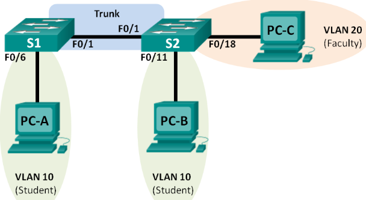

+--------+-----------+--------------+---------------+-----------------+
| Device | Interface | IP Address   | Subnet Mask   | Default Gateway |
+========+===========+==============+===============+=================+
| S1     | VLAN 1    | 192.168.1.11 | 255.255.255.0 | N/A             |
+--------+-----------+--------------+---------------+-----------------+
| S2     | VLAN 1    | 192.168.1.12 | 255.255.255.0 | N/A             |
+--------+-----------+--------------+---------------+-----------------+
| PC-A   | NIC       | 192.168.10.3 | 255.255.255.0 | 192.168.10.1    |
+--------+-----------+--------------+---------------+-----------------+
| PC-B   | NIC       | 192.168.10.4 | 255.255.255.0 | 192.168.10.1    |
+--------+-----------+--------------+---------------+-----------------+
| PC-C   | NIC       | 192.168.20.3 | 255.255.255.0 | 192.168.20.1    |
+--------+-----------+--------------+---------------+-----------------+

basic configuration for switch

.. code::

   no ip domain-lookup 
   service password-encryption 
   enable secret class 
   banner motd # 
   Unauthorized access is strictly prohibited. # 
   line con 0 
   password cisco 
   login 
   logging synchronous 
   line vty 0 15 
   password cisco 
   logging synchronous 
   login 
   exit 

create VLANs on switches

.. code::

   S1(config)# vlan 10
   S1(config-vlan)# name Student
   S1(config-vlan)# vlan 20
   S1(config-vlan)# name Faculty
   S1(config-vlan)# vlan 99
   S1(config-vlan)# name Management
   S1(config-vlan)# end 

Assign VLANs to the interfaces

.. code::

   S1(config)# interface f0/6 
   S1(config-if)# switchport mode access 
   S1(config-if)# switchport access vlan 10 
   
   Move the switch IP address VLAN 99.
   
   S1(config)# interface vlan 1
   S1(config-if)# no ip address
   S1(config-if)# interface vlan 99
   S1(config-if)# ip address 192.168.1.11 255.255.255.0 
   S1(config-if)# end 

Assign a VLAN to multiple interfaces

.. code::

   S1(config)# interface range f0/11-24 
   S1(config-if-range)# switchport mode access
   S1(config-if-range)# switchport access vlan 10 
   S1(config-if-range)# end
   
   Use the no switchport access vlan command to remove the VLAN 10 assignment to F0/24
   
   S1(config)# interface f0/24
   S1(config-if)# no switchport access vlan 
   S1(config-if)# end
   
   Add VLAN 30 to interface F0/24 without issuing the VLAN command.
   
   S1(config)# interface f0/24 
   S1(config-if)# switchport access vlan 30
   % Access VLAN does not exist. Creating vlan 30
   
   Use the no vlan 30 command to remove VLAN 30 from the VLAN database.
   
   S1(config)# no vlan 30
   S1(config)# end
   
   S1(config)# interface Fa0/24
   S1(config-if)# no switchport access vlan

.. note:: Current switch technology no longer requires that the vlan command be issued to add a VLAN to the database. By assigning an unknown VLAN to a port, the VLAN adds to the VLAN database.

.. note:: Before removing a VLAN from the database, it is recommended that you reassign all the ports assigned to that VLAN

Configuring Trunks

use the Dynamic Trunking Protocol (DTP) to allow it to negotiate the trunk mode. After this has been accomplished and verified, you will disable DTP on interface F0/1 and manually configure it as a trunk. 

.. code::

   Set F0/1 on S1 to negotiate trunk mode
   
   S1(config)# interface f0/1
   S1(config-if)# switchport mode dynamic desirable
  
   Mar  1 05:07:28.746: %LINEPROTO-5-UPDOWN: Line protocol on Interface Vlan1, changed 
   state to down 
   Mar  1 05:07:29.744: %LINEPROTO-5-UPDOWN: Line protocol on Interface FastEthernet0/1, 
   changed state to down 
   S1(config-if)# 
   Mar  1 05:07:32.772: %LINEPROTO-5-UPDOWN: Line protocol on Interface FastEthernet0/1, 
   changed state to up 
   S1(config-if)# 
   **Mar  1 05:08:01.789: %LINEPROTO-5-UPDOWN: Line protocol on Interface Vlan99, changed 
   state to up**
   Mar  1 05:08:01.797: %LINEPROTO-5-UPDOWN: Line protocol on Interface Vlan1, changed 
   state to up 
   You should also receive link status messages on S2.
   S2# 
   Mar  1 05:07:29.794: %LINEPROTO-5-UPDOWN: Line protocol on Interface FastEthernet0/1, 
   changed state to down 
   S2# 
   Mar  1 05:07:32.823: %LINEPROTO-5-UPDOWN: Line protocol on Interface FastEthernet0/1, 
   changed state to up 
   S2# 
   Mar  1 05:08:01.839: %LINEPROTO-5-UPDOWN: Line protocol on Interface Vlan99, changed 
   state to up 
   Mar  1 05:08:01.850: %LINEPROTO-5-UPDOWN: Line protocol on Interface Vlan1, changed 
   state to up 
   
   on S1 and S2. Interface F0/1 is no longer assigned to VLAN 1. 
   Trunked interfaces are not listed in the VLAN table
    
   S1# show vlan brief
   VLAN Name                             Status    Ports 
   ---- -------------------------------- --------- ------------------------------- 
   1    default                          active    Fa0/2, Fa0/3, Fa0/4, Fa0/5 

   S1# show interfaces trunk
   Port        Mode             Encapsulation  Status        Native vlan 
   Fa0/1       desirable        802.1q         trunking      1 
   
   Port        Vlans allowed on trunk 
   Fa0/1       1-4094 
   
   Port        Vlans allowed and active in management domain 
   Fa0/1       1,10,20,99
   
   Port        Vlans in spanning tree forwarding state and not pruned 
   Fa0/1       1,10,20,99
   
   S2# show interfaces trunk
   Port        Mode             Encapsulation  Status        Native vlan 
   Fa0/1       auto             802.1q         trunking      1 
   Port        Vlans allowed on trunk 
   Fa0/1       1-4094 
   Port        Vlans allowed and active in management domain 
   Fa0/1       1,10,20,99 
   Port        Vlans in spanning tree forwarding state and not pruned 
   Fa0/1       1,10,20,99 

.. code::

   Change the switchport mode on interface F0/1 to force trunking.Make sure to do this on both switches.
   
   S1(config)# interface f0/1
   S1(config-if)# switchport mode trunk 
   
   Issue the show interfaces trunk command to view the trunk mode. Notice that the mode changed from desirable to on. 
   
   S2# show interfaces trunk 
   Port        Mode             Encapsulation  Status        Native vlan 
   Fa0/1       on               802.1q         trunking      99 
   Port        Vlans allowed on trunk 
   Fa0/1       1-4094 
   Port        Vlans allowed and active in management domain 
   Fa0/1       1,10,20,99 
   Port        Vlans in spanning tree forwarding state and not pruned 
   Fa0/1       1,10,20,99 

.. note:: By default, all VLANs are allowed on a trunk. The switchport trunk command allows you to control what VLANs have access to the trunk

Deleting the vlan

.. code::

   S1# show flash
   S1# delete vlan.dat

Troubleshooting VLANS
---------------------

IP Address issue VLAN
^^^^^^^^^^^^^^^^^^^^^

Each VLAN must correspond to a unique IP subnet. If two devices in the same VLAN have different subnet addresses, they cannot communicate.

Missing VLAN
^^^^^^^^^^^^

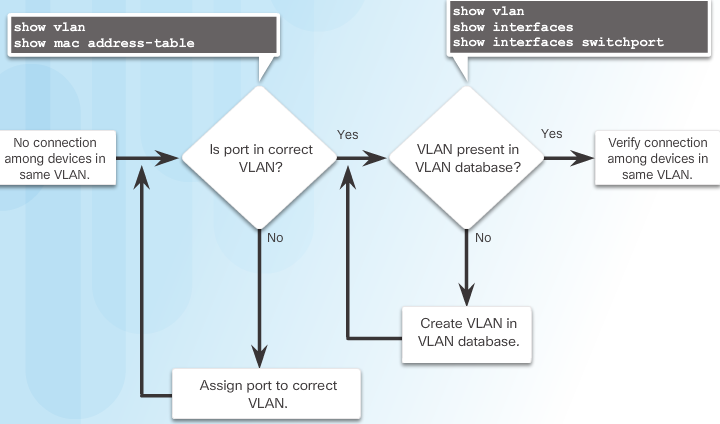

Use the show vlan command to check whether the port belongs to the expected VLAN. If the port is assigned to the wrong VLAN, use the switchport access vlan command to correct the VLAN membership. Use the show mac address-table command to check which addresses were learned on a particular port of the switch, and to which VLAN that port is assigned, as show in Figure 2.

.. code::

   S1#show mac address-table
             Mac Address Table
   -------------------------------------------
   
   Vlan    Mac Address       Type        Ports
   ----    -----------       --------    -----
   
      1    000a.f333.b702    DYNAMIC     Gig0/2
      1    00d0.5828.2501    DYNAMIC     Gig0/1
     10    00d0.5828.2501    DYNAMIC     Gig0/1
     20    00d0.5828.2501    DYNAMIC     Gig0/1
     30    00d0.5828.2501    DYNAMIC     Gig0/1
     56    000a.f333.b702    DYNAMIC     Gig0/2
     56    00d0.5828.2501    DYNAMIC     Gig0/1

If the VLAN to which the port is assigned is deleted, the port becomes inactive. The ports of a deleted VLAN will not be listed in the output of the show vlan command. Use the show interfaces switchport command to verify the inactive VLAN is assigned to the port

* show vlan
* switchport access vlan
* show mac address-table
* show interfaces switchport
* switchport access vlan
* show interface f0/1 switchport
* no switchport access vlan vlan-id

Troubleshooting Trunks
----------------------

most important command ``show interfaces trunk``

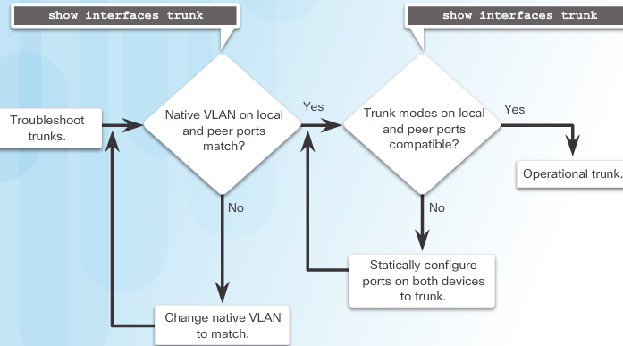

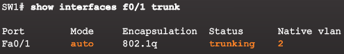

* Native VLAN mismatches - Trunk ports are configured with different native VLANs. This configuration error generates console notifications, and can cause inter-VLAN routing issues, among other problems. This poses a security risk.

* Trunk mode mismatches - One trunk port is configured in a mode that is not compatible for trunking on the corresponding peer port. This configuration error causes the trunk link to stop working. Be sure both sides of the trunk are configured with the switchport mode trunk command. Other trunk configuration commands are beyond the scope of this course.

* Allowed VLANs on trunks - The list of allowed VLANs on a trunk has not been updated with the current VLAN trunking requirements. In this situation, unexpected traffic (or no traffic) is being sent over the trunk.

.. image:: _static/common_problems_trunks.png

.. note:: start troubleshooting by examining the trunks for a **native VLAN mismatch**. If that is not the cause, check for **trunk mode mismatches**, and finally check for the **allowed VLAN list on the trunk**.

Mismatched Port Modes

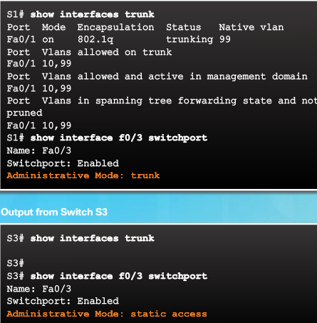

fixed:

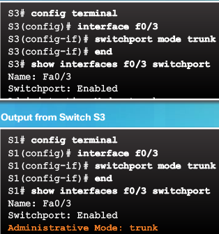

fix incorrect vlan list with

e.g. ``switchport trunk allowed vlan 10,20,99``

.. warning:: make sure trunk port is in trunk mode not in access mode!

.. code::

   S2(config-if)#switchport mode trunk

   S2(config-if)#
   %LINEPROTO-5-UPDOWN: Line protocol on Interface GigabitEthernet0/1, changed state to down
   %LINEPROTO-5-UPDOWN: Line protocol on Interface GigabitEthernet0/1, changed state to up

Troubleshooting Vlans 2
^^^^^^^^^^^^^^^^^^^^^^^

Packet Tracer – Troubleshooting a VLAN Implementation Scenario 2
6.2.3.8
Addressing Table

+--------+-----------+---------------+---------------+-----------------+
| Device | Interface | IPv4 Address  | Subnet Mask   | Default Gateway |
+========+===========+===============+===============+=================+
| S1     | VLAN 56   | 192.168.56.11 | 255.255.255.0 | N/A             |
+--------+-----------+---------------+---------------+-----------------+
| S2     | VLAN 56   | 192.168.56.12 | 255.255.255.0 | N/A             |
+--------+-----------+---------------+---------------+-----------------+
| S3     | VLAN 56   | 192.168.56.13 | 255.255.255.0 | N/A             |
+--------+-----------+---------------+---------------+-----------------+
| PC1    | NIC       | 192.168.10.21 | 255.255.255.0 | 192.168.10.1    |
+--------+-----------+---------------+---------------+-----------------+
| PC2    | NIC       | 192.168.20.22 | 255.255.255.0 | 192.168.20.1    |
+--------+-----------+---------------+---------------+-----------------+
| PC3    | NIC       | 192.168.30.23 | 255.255.255.0 | 192.168.30.1    |
+--------+-----------+---------------+---------------+-----------------+
| PC4    | NIC       | 192.168.10.24 | 255.255.255.0 | 192.168.10.1    |
+--------+-----------+---------------+---------------+-----------------+
| PC5    | NIC       | 192.168.20.25 | 255.255.255.0 | 192.168.20.1    |
+--------+-----------+---------------+---------------+-----------------+
| PC6    | NIC       | 192.168.30.26 | 255.255.255.0 | 192.168.30.1    |
+--------+-----------+---------------+---------------+-----------------+

VLAN and Port Assignments

+---------------+-----------------------------+-----------------+
| Ports         | VLAN Number - Name          | Network         |
+===============+=============================+=================+
| F0/1 – F0/5   | VLAN 56 – Management&Native | 192.168.56.0/24 |
+---------------+-----------------------------+-----------------+
| F0/6 – F0/10  | VLAN 30 – Guest(Default)    | 192.168.30.0/24 |
+---------------+-----------------------------+-----------------+
| F0/11 – F0/17 | VLAN 10 – Faculty/Staff     | 192.168.10.0/24 |
+---------------+-----------------------------+-----------------+
| F0/18 – F0/24 | VLAN 20 – Students          | 192.168.20.0/24 |
+---------------+-----------------------------+-----------------+

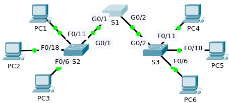

Switch 1

.. code::

   interface GigabitEthernet0/1
    switchport trunk native vlan 56
    switchport trunk allowed vlan 10,20,30,56
    switchport mode trunk
   !
   interface GigabitEthernet0/2
    switchport trunk native vlan 56
    switchport trunk allowed vlan 10,20,30,56
    switchport mode trunk
   !
   interface Vlan1
    no ip address
    shutdown
   !
   interface Vlan56
    mac-address 00d0.bc45.1b01
    ip address 192.168.56.11 255.255.255.0
   
   S1#show vlan brief
   
   VLAN Name                             Status    Ports
   ---- -------------------------------- --------- -------------------------------
   1    default                          active    Fa0/1, Fa0/2, Fa0/3, Fa0/4
                                                   Fa0/5, Fa0/6, Fa0/7, Fa0/8
                                                   Fa0/9, Fa0/10, Fa0/11, Fa0/12
                                                   Fa0/13, Fa0/14, Fa0/15, Fa0/16
                                                   Fa0/17, Fa0/18, Fa0/19, Fa0/20
                                                   Fa0/21, Fa0/22, Fa0/23, Fa0/24
   10   Faculty/Staff                    active    
   20   Students                         active    
   30   Guest(Default)                   active    
   56   Management&Native                active    
   1002 fddi-default                     active    
   1003 token-ring-default               active    
   1004 fddinet-default                  active    
   1005 trnet-default                    active    
   S1#show interfac
   S1#show interfaces trunk
   Port        Mode         Encapsulation  Status        Native vlan
   Gig0/1      on           802.1q         trunking      56
   Gig0/2      on           802.1q         trunking      56
   
   Port        Vlans allowed on trunk
   Gig0/1      10,20,30,56
   Gig0/2      10,20,30,56
   
   Port        Vlans allowed and active in management domain
   Gig0/1      10,20,30,56
   Gig0/2      10,20,30,56
   
   Port        Vlans in spanning tree forwarding state and not pruned
   Gig0/1      10,20,30,56
   Gig0/2      10,20,30,56

Switch 2 & 3

.. code::

   spanning-tree mode pvst
   spanning-tree extend system-id
   !
   interface FastEthernet0/1
    switchport access vlan 56
    switchport mode access
   !
   interface FastEthernet0/2
    switchport access vlan 56
    switchport mode access
   !
   interface FastEthernet0/3
    switchport access vlan 56
    switchport mode access
   !
   interface FastEthernet0/4
    switchport access vlan 56
    switchport mode access
   !
   interface FastEthernet0/5
    switchport access vlan 56
    switchport mode access
   !
   interface FastEthernet0/6
    switchport access vlan 30
    switchport mode access
   !
   interface FastEthernet0/7
    switchport access vlan 30
    switchport mode access
   !
   interface FastEthernet0/8
    switchport access vlan 30
    switchport mode access
   !
   interface FastEthernet0/9
    switchport access vlan 30
    switchport mode access
   !
   interface FastEthernet0/10
    switchport access vlan 30
    switchport mode access
   !
   interface FastEthernet0/11
    switchport access vlan 10
    switchport mode access
   !
   interface FastEthernet0/12
    switchport access vlan 10
    switchport mode access
   !
   interface FastEthernet0/13
    switchport access vlan 10
    switchport mode access
   !
   interface FastEthernet0/14
    switchport access vlan 10
    switchport mode access
   !
   interface FastEthernet0/15
    switchport access vlan 10
    switchport mode access
   !
   interface FastEthernet0/16
    switchport access vlan 10
    switchport mode access
   !
   interface FastEthernet0/17
    switchport access vlan 10
    switchport mode access
   !
   interface FastEthernet0/18
    switchport access vlan 20
    switchport mode access
   !
   interface FastEthernet0/19
    switchport access vlan 20
    switchport mode access
   !
   interface FastEthernet0/20
    switchport access vlan 20
    switchport mode access
   !
   interface FastEthernet0/21
    switchport access vlan 20
    switchport mode access
   !
   interface FastEthernet0/22
    switchport access vlan 20
    switchport mode access
   !
   interface FastEthernet0/23
    switchport access vlan 20
    switchport mode access
   !
   interface FastEthernet0/24
    switchport access vlan 20
    switchport mode access
   !
   interface GigabitEthernet0/1
    switchport trunk native vlan 56
    switchport trunk allowed vlan 10,20,30,56
    switchport mode trunk
   !
   interface GigabitEthernet0/2
    switchport trunk native vlan 56
    switchport trunk allowed vlan 10,20,30,56
    switchport mode trunk
   !
   interface Vlan1
    no ip address
    shutdown
   !
   interface Vlan56
    mac-address 0002.1737.2201
    ip address 192.168.56.12 255.255.255.0
   
   S2#show vlan
   
   VLAN Name                             Status    Ports
   ---- -------------------------------- --------- -------------------------------
   1    default                          active    Gig0/2
   10   Faculty/Staff                    active    Fa0/11, Fa0/12, Fa0/13, Fa0/14
                                                   Fa0/15, Fa0/16, Fa0/17
   20   Students                         active    Fa0/18, Fa0/19, Fa0/20, Fa0/21
                                                   Fa0/22, Fa0/23, Fa0/24
   30   Guest(Default)                   active    Fa0/6, Fa0/7, Fa0/8, Fa0/9
                                                   Fa0/10
   56   Management&Native                active    Fa0/1, Fa0/2, Fa0/3, Fa0/4
                                                   Fa0/5
   1002 fddi-default                     act/unsup 
   1003 token-ring-default               act/unsup 
   1004 fddinet-default                  act/unsup 
   1005 trnet-default                    act/unsup 
   
   VLAN Type  SAID       MTU   Parent RingNo BridgeNo Stp  BrdgMode Trans1 Trans2
   ---- ----- ---------- ----- ------ ------ -------- ---- -------- ------ ------
   1    enet  100001     1500  -      -      -        -    -        0      0
   10   enet  100010     1500  -      -      -        -    -        0      0
   20   enet  100020     1500  -      -      -        -    -        0      0
   30   enet  100030     1500  -      -      -        -    -        0      0
   56   enet  100056     1500  -      -      -        -    -        0      0
   1002 fddi  101002     1500  -      -      -        -    -        0      0   
   1003 tr    101003     1500  -      -      -        -    -        0      0   
   1004 fdnet 101004     1500  -      -      -        ieee -        0      0   
   1005 trnet 101005     1500  -      -      -        ibm  -        0      0   
   
   VLAN Type  SAID       MTU   Parent RingNo BridgeNo Stp  BrdgMode Trans1 Trans2
   ---- ----- ---------- ----- ------ ------ -------- ---- -------- ------ ------
   
   Remote SPAN VLANs
   ------------------------------------------------------------------------------
   
   Primary Secondary Type              Ports
   ------- --------- ----------------- ------------------------------------------

   S2#show interfaces trunk 
   Port        Mode         Encapsulation  Status        Native vlan
   Gig0/1      on           802.1q         trunking      56
   
   Port        Vlans allowed on trunk
   Gig0/1      10,20,30,56
   
   Port        Vlans allowed and active in management domain
   Gig0/1      10,20,30,56
   
   Port        Vlans in spannin

Troubleshooting vlan/trunk bullet points
----------------------------------------

* make sure management vlan has an ip address
  
  .. code::

     S2(config)#interface vlan 56
     S2(config-if)#ip address 192.168.56.12 255.255.255.0
     S2(config-if)#no shutdown 

* check if trunks are configured correctly with

  .. code::

     S2#show interfaces trunk
     ------      ----         ------------   ------        -----------     
     Port        Mode         Encapsulation  Status        Native vlan
     ------      ----         ------------   ------        -----------     
     Gig0/1      on           802.1q         trunking      56
     
     Port        Vlans allowed on trunk
     Gig0/1      10,20,30,56
     
     Port        Vlans allowed and active in management domain
     Gig0/1      10,20,30,56
     
     Port        Vlans in spanning tree forwarding state and not pruned
     Gig0/1      10,20,30,56

* set native vlan on trunk ports ``switchport trunk native vlan 56``
* set to access ports and set their native vlan
  
  .. code:: 

     S2(config-if)#interface range fastEthernet 0/1-24
     S2(config-if-range)#switchport mode access
     S2(config-if-range)#switchport native vlan 56
     S2(config-if-range)#no shutdown

* set port as a trunk ``switchport mode trunk``
* set allowed vlans, including native ``switchport trunk allowed vlan 10,20,30,56``
* configure access layer switch access ports with correct vlan

  .. code::

     S2(config)#interface range fa0/6 - 10
     S2(config-if-range)#switchport access vlan 30
     S2(config-if-range)#interface range fa0/11 - 17
     S2(config-if-range)#switchport access vlan 10
     S2(config-if-range)#interface range fa0/18 - 24
     S2(config-if-range)#switchport access vlan 20

* check if vlans are all assigned to the correct interface and vlan is active with ``show vlan brief | id | name`` command
  
  .. code::

     S2(config-if-range)#do show vlan brief

     VLAN Name                             Status    Ports
     ---- -------------------------------- --------- -------------------------------
     1    default                          active    Gig0/2
     10   Faculty/Staff                    active    Fa0/11, Fa0/12, Fa0/13, Fa0/14
                                                     Fa0/15, Fa0/16, Fa0/17
     20   Students                         active    Fa0/18, Fa0/19, Fa0/20, Fa0/21
                                                     Fa0/22, Fa0/23, Fa0/24
     30   Guest(Default)                   active    Fa0/6, Fa0/7, Fa0/8, Fa0/9
                                                     Fa0/10
     56   Management&Native                active    Fa0/1, Fa0/2, Fa0/3, Fa0/4
                                                     Fa0/5
     # or check per vlan id or vlan name
     # #################################
     S2#show vlan id 56
     ---- -------------------------------- --------- -------------------------------
     VLAN Name                             Status    Ports
     ---- -------------------------------- --------- -------------------------------
     56   Management&Native                active    Fa0/1, Fa0/2, Fa0/3, Fa0/4
                                                     Fa0/5
     
     VLAN Type  SAID       MTU   Parent RingNo BridgeNo Stp  BrdgMode Trans1 Trans2
     ---- ----- ---------- ----- ------ ------ -------- ---- -------- ------ ------
     56   enet  100056     1500  -      -      -        -    -        0      0 

* enable a vlan ``interface vlan 20`` 

.. warning:: You must hardcode ``switchport mode access`` on the ports that are not a trunk. This disables the Dynamic Trunking Protocol, so that's 1 chance less of accidently creating a trunk. doublecheck via ``show interfaces switchport`` you'll see negotiation is off.

.. code::

   S1(config-if-range)#do show interface switchport
   Name: Fa0/1
   Switchport: Enabled
   Administrative Mode: static access
   Operational Mode: down
   Administrative Trunking Encapsulation: dot1q
   Operational Trunking Encapsulation: native
   **Negotiation of Trunking: Off**
   Access Mode VLAN: 56 (VLAN0056)
   Trunking Native Mode VLAN: 1 (default)
   Voice VLAN: none
   Administrative private-vlan host-association: none
   Administrative private-vlan mapping: none
   Administrative private-vlan trunk native VLAN: none
   Administrative private-vlan trunk encapsulation: dot1q
   Administrative private-vlan trunk normal VLANs: none
   Administrative private-vlan trunk private VLANs: none
   Operational private-vlan: none
   Trunking VLANs Enabled: All
   Pruning VLANs Enabled: 2-1001
   Capture Mode Disabled
   Capture VLANs Allowed: ALL
   Protected: false
   Unknown unicast blocked: disabled
   Unknown multicast blocked: disabled
   Appliance trust: none

.. warning:: Watch out for unnamed vlans! Easily overlooked :)

.. code::

   S1(config)#do show vlan
   
   VLAN Name                             Status    Ports
   ---- -------------------------------- --------- -------------------------------
   1    default                          active    
   10   VLAN0010                         active    Fa0/11, Fa0/12, Fa0/13, Fa0/14
                                                   Fa0/15, Fa0/16, Fa0/17
   20   VLAN0020                         active    Fa0/18, Fa0/19, Fa0/20, Fa0/21
                                                   Fa0/22, Fa0/23, Fa0/24
   30   VLAN0030                         active    Fa0/6, Fa0/7, Fa0/8, Fa0/9
                                                   Fa0/10
   56   VLAN0056                         active    Fa0/1, Fa0/2, Fa0/3, Fa0/4
                                                   Fa0/5
   1002 fddi-default                     act/unsup 
   1003 token-ring-default               act/unsup 
   1004 fddinet-default                  act/unsup 
   1005 trnet-default                    act/unsup 
   
   S2(config-if)#do show vlan
   
   VLAN Name                             Status    Ports
   ---- -------------------------------- --------- -------------------------------
   1    default                          active    Gig0/2
   10   Faculty/Staff                    active    Fa0/11, Fa0/12, Fa0/13, Fa0/14
                                                   Fa0/15, Fa0/16, Fa0/17
   20   Students                         active    Fa0/18, Fa0/19, Fa0/20, Fa0/21
                                                   Fa0/22, Fa0/23, Fa0/24
   30   Guest(Default)                   active    Fa0/6, Fa0/7, Fa0/8, Fa0/9
                                                   Fa0/10
   56   Management&Native                active    Fa0/1, Fa0/2, Fa0/3, Fa0/4
                                                   Fa0/5
   
   solution
   #########
   S1(config)#vlan 10
   S1(config-vlan)#name Faculty/Staff
   S1(config-vlan)#vlan 20
   S1(config-vlan)#name Students
   S1(config-vlan)#vlan 30
   S1(config-vlan)#name Guest(Default)
   S1(config-vlan)#vlan 56
   S1(config-vlan)#name Management&Native

VLAN Command Summary Table
--------------------------

+-------------------------------------------+--------------------------------------------------------------------------------------------------------+
| Command                                   | Description                                                                                            |
+===========================================+========================================================================================================+
| vtp mode [server - client - transparent]  | In global configuration mode, this command sets the operational VTP mode for the switch.               |
+-------------------------------------------+--------------------------------------------------------------------------------------------------------+
|                                           | The default is server.                                                                                 |
+-------------------------------------------+--------------------------------------------------------------------------------------------------------+
| vtp domain name                           | In global configuration mode, this command assigns a VTP domain name,                                  |
+-------------------------------------------+--------------------------------------------------------------------------------------------------------+
|                                           | which allows the switch to send VTP advertisements out trunk links.                                    |
+-------------------------------------------+--------------------------------------------------------------------------------------------------------+
|                                           | The default is NULL, which would allow a switch to join the first domain it received an update from.   |
+-------------------------------------------+--------------------------------------------------------------------------------------------------------+
| show vtp status                           | Displays VTP status information including configuration revision number, domain name, and switch mode. |
+-------------------------------------------+--------------------------------------------------------------------------------------------------------+
| switchport mode [trunk-access-dynamic     | In interface configuration mode, this configures the behavior of the interface.                        |
+-------------------------------------------+--------------------------------------------------------------------------------------------------------+
| [desirable-auto-nonegotiate]]             | Trunk mode will force frame tagging. Dynamic mode can become a trunk if  it negotiates                 |
+-------------------------------------------+--------------------------------------------------------------------------------------------------------+
|                                           | with the other side of the link. Access mode is a nontrunk port.                                       |
+-------------------------------------------+--------------------------------------------------------------------------------------------------------+
| switchport trunk encapsulation dot1q      | Used in interface configuration mode to specify a trunking protocol. For some switches,                |
+-------------------------------------------+--------------------------------------------------------------------------------------------------------+
|                                           | before you can set an interface to trunk mode, you must first specify the encapsulation.               |
+-------------------------------------------+--------------------------------------------------------------------------------------------------------+
| show interface [type module/port] trunk   | Displays trunking information about the active or specified trunk links on the switch.                 |
+-------------------------------------------+--------------------------------------------------------------------------------------------------------+
| show interface [type mod/port] switchport | Displays Layer 2 configuration and operational parameters of the switch.                               |
+-------------------------------------------+--------------------------------------------------------------------------------------------------------+
|                                           | This includes VLAN membership and trunking status.                                                     |
+-------------------------------------------+--------------------------------------------------------------------------------------------------------+
| vlan number                               | In global configuration mode, this command defines a VLAN                                              |
+-------------------------------------------+--------------------------------------------------------------------------------------------------------+
|                                           | and puts the switch into VLAN configuration mode. In VLAN configuration mode,                          |
+-------------------------------------------+--------------------------------------------------------------------------------------------------------+
|                                           | commands such as name can be used to further define the VLAN.                                          |
+-------------------------------------------+--------------------------------------------------------------------------------------------------------+
| show vlan [id vlan#]                      | Displays VLAN information. The id option allows you to specify a particular VLAN.                      |
+-------------------------------------------+--------------------------------------------------------------------------------------------------------+
| switchport access vlan [1-4096 / dynamic] | In interface configuration mode, this command assigns an access port to a VLAN                         |
+-------------------------------------------+--------------------------------------------------------------------------------------------------------+
|                                           | or makes it a dynamic port.                                                                            |
+-------------------------------------------+--------------------------------------------------------------------------------------------------------+
| show vlan brief                           | Displays a brief table of the VLANs, including the port membership for each VLAN.                      |
+-------------------------------------------+--------------------------------------------------------------------------------------------------------+
| show spanning-tree [vlan number]          | Displays Spanning Tree information for the switch or a VLAN if the vlan option is used.                |
+-------------------------------------------+--------------------------------------------------------------------------------------------------------+

Inter-VLAN Routing
------------------
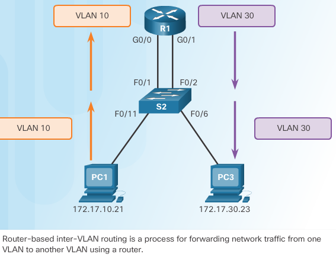

A VLAN is a broadcast domain, so computers on separate VLANs are unable to communicate without the intervention of a routing device. Layer 2 switches have very limited IPv4 and IPv6 functionality and cannot perform the dynamic routing function of routers. While Layer 2 switches are gaining more IP functionality, such as the ability to perform static routing, this is insufficient to handle these large number of VLANs.

Any device that supports Layer 3 routing, such as a router or a multilayer switch, can be used to perform the necessary routing functionality. Regardless of the device used, the process of forwarding network traffic from one VLAN to another VLAN using routing is known as inter-VLAN routing.

There are three options for inter-VLAN routing:
 * Legacy inter-VLAN routing:
    The switch ports connected to the router are placed in access mode and each physical interface is assigned to a different VLAN. Each router interface can then accept traffic from the VLAN associated with the switch interface that it is connected to, and traffic can be routed to the other VLANs connected to the other interfaces.
 * Router-on-a-Stick:
    The router interface is configured to operate as a trunk link and is connected to a switch port that is configured in trunk mode. The router performs inter-VLAN routing by accepting VLAN-tagged traffic on the trunk interface coming from the adjacent switch, and then, internally routing between the VLANs using subinterfaces. The router then forwards the routed traffic, VLAN-tagged for the destination VLAN, out the same physical interface as it used to receive the traffic
 * Layer 3 switching using SVI's

legacy intervlan routing
^^^^^^^^^^^^^^^^^^^^^^^^
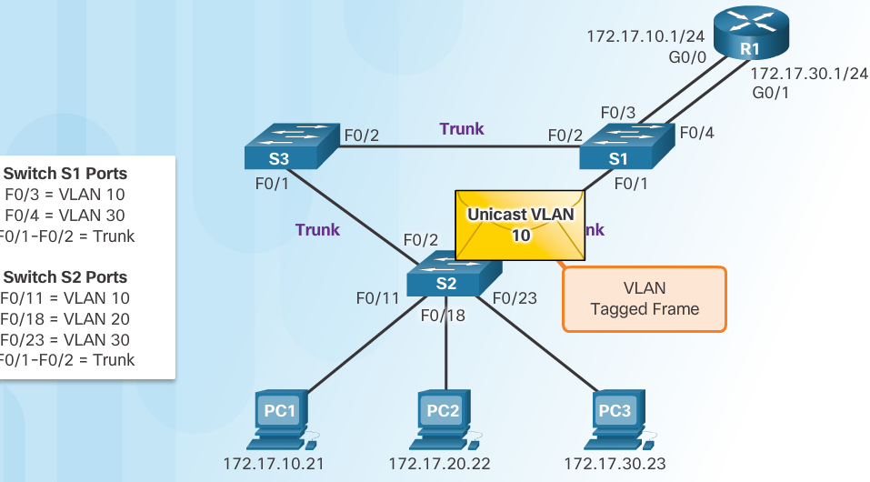

Router R1 has a separate interface configured for each of the VLANs.

.. note:: This method of inter-VLAN routing is not efficient and is generally no longer implemented in switched networks. It is shown in this course for explanation purposes only.

Devices use their default gateway as the Layer 2 destination for all traffic that must leave the local subnet. The default gateway is the route that the device uses when it has no other explicitly defined route to the destination network. The IPv4 address of the router interface on the local subnet acts as the default gateway for the sending device.

When the source device has determined that the packet must travel through the local router interface on the connected VLAN, the source device sends out an ARP request to determine the MAC address of the local router interface. When the router sends its ARP reply back to the source device, the source device can use the MAC address to finish framing the packet before it sends it out on the network as unicast traffic.

Because the Ethernet frame has the destination MAC address of the router interface, the switch knows exactly which switch port to forward the unicast traffic out of to reach the router interface for that VLAN. When the frame arrives at the router, the router removes the source and destination MAC address information to examine the destination IPv4 address of the packet. The router compares the destination address to entries in its routing table to determine where it needs to forward the data to reach its final destination. If the router determines that the destination network is a locally connected network, as is the case with inter-VLAN routing, the router sends an ARP request out the interface that is physically connected to the destination VLAN. The destination device responds back to the router with its MAC address, which the router then uses to frame the packet. The router then sends the unicast traffic to the switch, which forwards it out the port where the destination device is connected.

Lab configuration
~~~~~~~~~~~~~~~~~

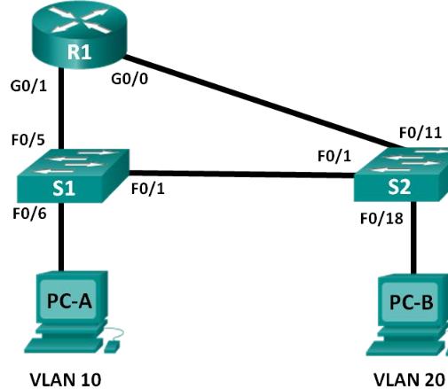

+--------+------------+---------------+---------------+------------------+
| Device | Interface  | IP Address    | Subnet Mask   | Default Gateway, |
+========+============+===============+===============+==================+
| R1     | G0/0       | 192.168.20.1  | 255.255.255.0 | N/A              |
+--------+------------+---------------+---------------+------------------+
| G0/1   | 192.168.10 | .1            | 255.255.255.0 | N/A              |
+--------+------------+---------------+---------------+------------------+
| S1     | VLAN 10    | 192.168.10.11 | 255.255.255.0 | 192.168.10.1     |
+--------+------------+---------------+---------------+------------------+
| S2     | VLAN 10    | 192.168.10.12 | 255.255.255.0 | 192.168.10.1     |
+--------+------------+---------------+---------------+------------------+
| PC-A   | NIC        | 192.168.10.3  | 255.255.255.0 | 192.168.10.1     |
+--------+------------+---------------+---------------+------------------+
| PC-B   | NIC        | 192.168.20.3  | 255.255.255.0 | 192.168.20.1     |
+--------+------------+---------------+---------------+------------------+

* **of the switch**

.. code::

   S1(config)# vlan 10
   S1(config-vlan)# name students
   S1(config-vlan)# vlan 30
   S1(config-vlan)# name lolcats
   
.. note:: Use the vlan vlan_id global configuration mode command to create VLANs. In this example, VLANs 10 and 30 were created on switch S1. 

.. code::

   S1(config)# interface f0/11
   S1(config-if)# switchport access vlan 10
   S1(config-if)# interface f0/4
   S1(config-if)# switchport access vlan 10
   S1(config-if)# interface f0/6
   S1(config-if)# switchport access vlan 30
   S1(config-if)# interface f0/5
   S1(config-if)# switchport access vlan 30
   S1(config-if)# exit
   S1(config)# ip default-gateway 172.17.10.1
   S1(config)# exit
   S1# copy running-config startup-config

* **of the router**

.. code::

   R1(config)# interface g0/0
   R1(config-if)# ip address 172.17.10.1 255.255.255.0
   

router-on-a-stick intervlan routing
^^^^^^^^^^^^^^^^^^^^^^^^^^^^^^^^^^^^
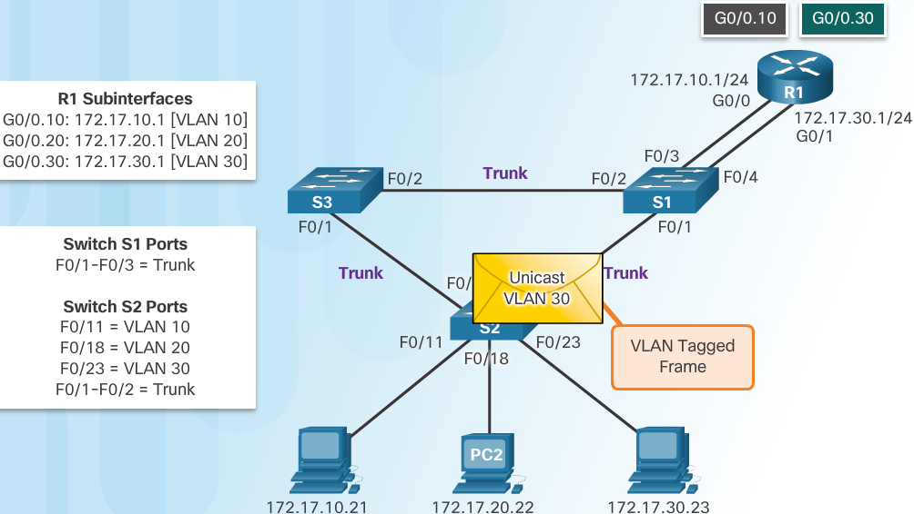

Subinterfaces are configured for different subnets corresponding to their VLAN assignment to facilitate logical routing. After a routing decision is made based on the destination VLAN, the data frames are VLAN-tagged and sent back out the physical interface. 

1. PC1 on VLAN 10 is communicating with PC3 on VLAN 30 through router R1 using a single, physical router interface.

2. PC1 sends its unicast traffic to switch S2.

3. Switch S2 then tags the unicast traffic as originating on VLAN 10 and forwards the unicast traffic out its trunk link to switch S1.

4. Switch S1 forwards the tagged traffic out the other trunk interface on port F0/3 to the interface on router R1.

5. Router R1 accepts the tagged unicast traffic on VLAN 10 and routes it to VLAN 30 using its configured subinterfaces.

6. The unicast traffic is tagged with VLAN 30 as it is sent out the router interface to switch S1.

7. Switch S1 forwards the tagged unicast traffic out the other trunk link to switch S2.

8. Switch S2 removes the VLAN tag of the unicast frame and forwards the frame out to PC3 on port F0/23.

.. Note:: The router-on-a-stick method of inter-VLAN routing does not scale beyond 50 VLANs.

multilayer switch intervlanning
^^^^^^^^^^^^^^^^^^^^^^^^^^^^^^^

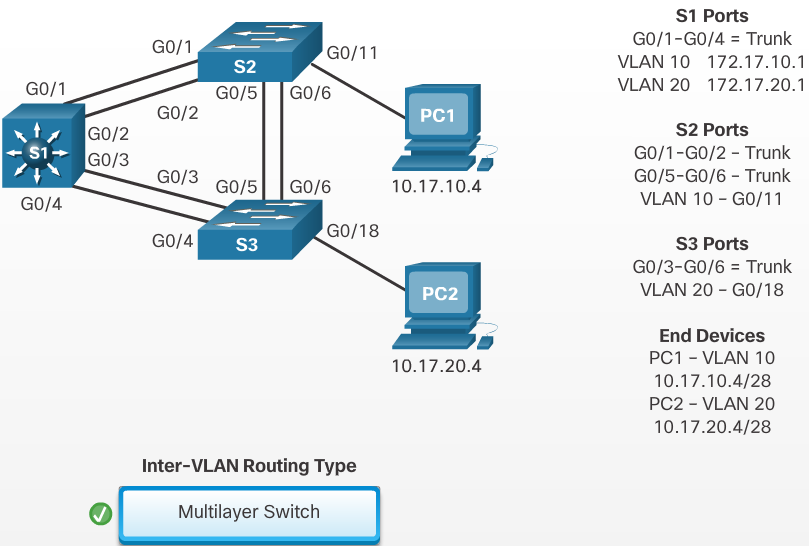

.. note:: outside the scope of course for now..

Inter-VLAN Routing Challenge
----------------------------

Packet Tracer – Inter-VLAN Routing Challenge|Topology|
Addressing Table

+--------+-----------+--------------+-----------------+-----------------+
| Device | Interface | IP Address   | Subnet Mask     | Default Gateway |
+========+===========+==============+=================+=================+
|        | G0/0      | 172.17.25.2  | 255.255.255.252 | N/A             |
+--------+-----------+--------------+-----------------+-----------------+
|        | G0/1.10   | 172.17.10.1  | 255.255.255.0   | N/A             |
+--------+-----------+--------------+-----------------+-----------------+
|        | G0/1.20   | 172.17.20.1  | 255.255.255.0   | N/A             |
+--------+-----------+--------------+-----------------+-----------------+
| R1     | G0/1.30   | 172.17.30.1  | 255.255.255.0   | N/A             |
+--------+-----------+--------------+-----------------+-----------------+
|        | G0/1.88   | 172.17.88.1  | 255.255.255.0   | N/A             |
+--------+-----------+--------------+-----------------+-----------------+
|        | G0/1.99   | 172.17.99.1  | 255.255.255.0   | N/A             |
+--------+-----------+--------------+-----------------+-----------------+
| S1     | VLAN 99   | 172.17.99.10 | 255.255.255.0   | 172.17.99.1     |
+--------+-----------+--------------+-----------------+-----------------+
| PC1    | NIC       | 172.17.10.21 | 255.255.255.0   | 172.17.10.1     |
+--------+-----------+--------------+-----------------+-----------------+
| PC2    | NIC       | 172.17.20.22 | 255.255.255.0   | 172.17.20.1     |
+--------+-----------+--------------+-----------------+-----------------+
| PC3    | NIC       | 172.17.30.23 | 255.255.255.0   | 172.17.30.1     |
+--------+-----------+--------------+-----------------+-----------------+

VLAN and Port Assignments Table

+------+--+----------------+--+-----------+
| VLAN |  | Name           |  | Interface |
+======+==+================+==+===========+
| 10   |  | Faculty/Staff  |  | Fa0/11-17 |
+------+--+----------------+--+-----------+
| 20   |  | Students       |  | Fa0/18-24 |
+------+--+----------------+--+-----------+
| 30   |  | Guest(Default) |  | Fa0/6-10  |
+------+--+----------------+--+-----------+
| 88   |  | Native         |  | G0/1      |
+------+--+----------------+--+-----------+
| 99   |  | Management     |  | VLAN 99   |
+------+--+----------------+--+-----------+

• Assign IP addressing to R1 and S1 based on the Addressing Table.
• Create, name and assign VLANs on S1 based on the VLAN and Port Assignments Table. Ports should be in access mode.
• Configure S1 to trunk, allow only the VLANs in the VLAN and Port Assignments Table.
• Configure the default gateway on S1.
• All ports not assigned to a VLAN should be disabled.
• Configure inter-VLAN routing on R1 based on the Addressing Table.
• Verify connectivity. R1, S1, and all PCs should be able to ping each other and the cisco.pka server.

* configuration for the switch:

  .. code::

     hostname S1
     !
     !
     spanning-tree mode pvst
     spanning-tree extend system-id
     !
     interface FastEthernet0/1
      switchport mode access
     !
     interface FastEthernet0/2
      switchport mode access
     !
     interface FastEthernet0/3
      switchport mode access
     !
     interface FastEthernet0/4
      switchport mode access
     !
     interface FastEthernet0/5
      switchport mode access
     !
     interface FastEthernet0/6
      switchport access vlan 30
      switchport mode access
     !
     interface FastEthernet0/7
      switchport access vlan 30
      switchport mode access
     !
     interface FastEthernet0/8
      switchport access vlan 30
      switchport mode access
     !
     interface FastEthernet0/9
      switchport access vlan 30
      switchport mode access
     !
     interface FastEthernet0/10
      switchport access vlan 30
      switchport mode access
     !
     interface FastEthernet0/11
      switchport access vlan 10
      switchport mode access
     !
     interface FastEthernet0/12
      switchport access vlan 10
      switchport mode access
     !
     interface FastEthernet0/13
      switchport access vlan 10
      switchport mode access
     !
     interface FastEthernet0/14
      switchport access vlan 10
      switchport mode access
     !
     interface FastEthernet0/15
      switchport access vlan 10
      switchport mode access
     !
     interface FastEthernet0/16
      switchport access vlan 10
      switchport mode access
     !
     interface FastEthernet0/17
      switchport access vlan 10
      switchport mode access
     !
     interface FastEthernet0/18
      switchport access vlan 20
      switchport mode access
     !
     interface FastEthernet0/19
      switchport access vlan 20
      switchport mode access
     !
     interface FastEthernet0/20
      switchport access vlan 20
      switchport mode access
     !
     interface FastEthernet0/21
      switchport access vlan 20
      switchport mode access
     !
     interface FastEthernet0/22
      switchport access vlan 20
      switchport mode access
     !
     interface FastEthernet0/23
      switchport access vlan 20
      switchport mode access
     !
     interface FastEthernet0/24
      switchport access vlan 20
      switchport mode access
     !
     interface GigabitEthernet0/1
      switchport trunk native vlan 88
      switchport trunk allowed vlan 10,20,30,88,99
      switchport mode trunk
     !
     interface GigabitEthernet0/2
     !
     interface Vlan1
      no ip address
      shutdown
     !
     interface Vlan99
      mac-address 0030.f236.9801
      ip address 172.17.99.10 255.255.255.0
     !
     ip default-gateway 172.17.99.1

* show vlan & trunks:

  .. code::

     S1#show vlan brief
     
     VLAN Name                             Status    Ports
     ---- -------------------------------- --------- -------------------------------
     1    default                          active    Fa0/1, Fa0/2, Fa0/3, Fa0/4
                                                     Fa0/5, Gig0/2
     10   Faculty/Staff                    active    Fa0/11, Fa0/12, Fa0/13, Fa0/14
                                                     Fa0/15, Fa0/16, Fa0/17
     20   Students                         active    Fa0/18, Fa0/19, Fa0/20, Fa0/21
                                                     Fa0/22, Fa0/23, Fa0/24
     30   Guest(Default)                   active    Fa0/6, Fa0/7, Fa0/8, Fa0/9
                                                     Fa0/10
     88   Native                           active    
     99   Management                       active    
     1002 fddi-default                     active    
     1003 token-ring-default               active    
     1004 fddinet-default                  active    
     1005 trnet-default                    active    
     S1#
     S1#
     S1#
     S1#
     S1#show interfaces trunk
     Port        Mode         Encapsulation  Status        Native vlan
     Gig0/1      on           802.1q         trunking      88
     
     Port        Vlans allowed on trunk
     Gig0/1      10,20,30,88,99
     
     Port        Vlans allowed and active in management domain
     Gig0/1      10,20,30,88,99
     
     Port        Vlans in spanning tree forwarding state and not pruned
     Gig0/1      10,20,30,88,99

* configuration for the router:
  
  .. code::

     hostname R1
     !
     !
     ip cef
     no ipv6 cef
     !
     !
     spanning-tree mode pvst
     !
     interface GigabitEthernet0/0
      ip address 172.17.25.2 255.255.255.252
      duplex auto
      speed auto
     !
     interface GigabitEthernet0/1
      no ip address
      duplex auto
      speed auto
     !
     interface GigabitEthernet0/1.10
      encapsulation dot1Q 10
      ip address 172.17.10.1 255.255.255.0
     !
     interface GigabitEthernet0/1.20
      encapsulation dot1Q 20
      ip address 172.17.20.1 255.255.255.0
     !
     interface GigabitEthernet0/1.30
      encapsulation dot1Q 30
      ip address 172.17.30.1 255.255.255.0
     !
     interface GigabitEthernet0/1.88
      encapsulation dot1Q 88 native
      ip address 172.17.88.1 255.255.255.0
     !
     interface GigabitEthernet0/1.99
      encapsulation dot1Q 99
      ip address 172.17.99.1 255.255.255.0
     !
     interface Vlan1
      no ip address
      shutdown
     !
     ip classless
     ip route 0.0.0.0 0.0.0.0 GigabitEthernet0/0 
     !
     ip flow-export version 9
     !
     

* show ip route:

  .. code::

     R1#show ip route
     Codes: L - local, C - connected, S - static, R - RIP, M - mobile, B - BGP
            D - EIGRP, EX - EIGRP external, O - OSPF, IA - OSPF inter area
            N1 - OSPF NSSA external type 1, N2 - OSPF NSSA external type 2
            E1 - OSPF external type 1, E2 - OSPF external type 2, E - EGP
            i - IS-IS, L1 - IS-IS level-1, L2 - IS-IS level-2, ia - IS-IS inter area
            * - candidate default, U - per-user static route, o - ODR
            P - periodic downloaded static route
     
     Gateway of last resort is 0.0.0.0 to network 0.0.0.0
     
          172.17.0.0/16 is variably subnetted, 12 subnets, 3 masks
     C       172.17.10.0/24 is directly connected, GigabitEthernet0/1.10
     L       172.17.10.1/32 is directly connected, GigabitEthernet0/1.10
     C       172.17.20.0/24 is directly connected, GigabitEthernet0/1.20
     L       172.17.20.1/32 is directly connected, GigabitEthernet0/1.20
     C       172.17.25.0/30 is directly connected, GigabitEthernet0/0
     L       172.17.25.2/32 is directly connected, GigabitEthernet0/0
     C       172.17.30.0/24 is directly connected, GigabitEthernet0/1.30
     L       172.17.30.1/32 is directly connected, GigabitEthernet0/1.30
     C       172.17.88.0/24 is directly connected, GigabitEthernet0/1.88
     L       172.17.88.1/32 is directly connected, GigabitEthernet0/1.88
     C       172.17.99.0/24 is directly connected, GigabitEthernet0/1.99
     L       172.17.99.1/32 is directly connected, GigabitEthernet0/1.99
     S*   0.0.0.0/0 is directly connected, GigabitEthernet0/0

Skills integration challenge
----------------------------

* Addressing Table

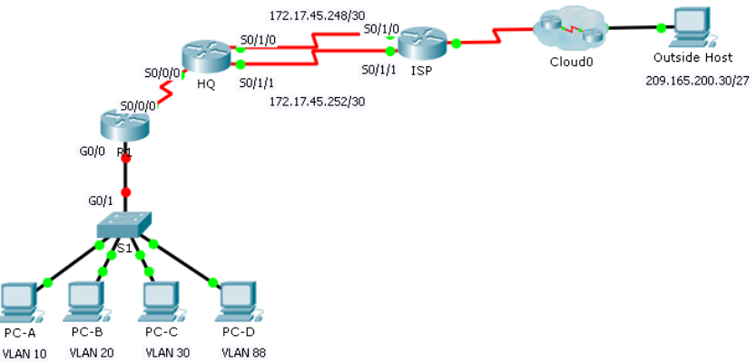

+--------+-----------+--------------+---------------+-----------------+------+
| Device | Interface | IP Address   | Subnet Mask   | Default Gateway | VLAN |
+========+===========+==============+===============+=================+======+
|        | S0/0/0    | 172.31.1.2   | 255.255.255.0 | N/A             | N/A  |
+--------+-----------+--------------+---------------+-----------------+------+
|        | G0/0.10   | 172.31.10.1  | 255.255.255.0 | N/A             | 10   |
+--------+-----------+--------------+---------------+-----------------+------+
|        | G0/0.20   | 172.31.20.1  | 255.255.255.0 | N/A             | 20   |
+--------+-----------+--------------+---------------+-----------------+------+
| R1     | G0/0.30   | 172.31.30.1  | 255.255.255.0 | N/A             | 30   |
+--------+-----------+--------------+---------------+-----------------+------+
|        | G0/0.88   | 172.31.88.1  | 255.255.255.0 | N/A             | 88   |
+--------+-----------+--------------+---------------+-----------------+------+
|        | G0/0.99   | 172.31.99.1  | 255.255.255.0 | N/A             | 99   |
+--------+-----------+--------------+---------------+-----------------+------+
| S1     | VLAN 88   | 172.31.88.33 | 255.255.255.0 | 172.31.88.1     | 88   |
+--------+-----------+--------------+---------------+-----------------+------+
| PC-A   | NIC       | 172.31.10.21 | 255.255.255.0 | 172.31.10.1     | 10   |
+--------+-----------+--------------+---------------+-----------------+------+
| PC-B   | NIC       | 172.31.20.22 | 255.255.255.0 | 172.31.20.1     | 20   |
+--------+-----------+--------------+---------------+-----------------+------+
| PC-C   | NIC       | 172.31.30.23 | 255.255.255.0 | 172.31.30.1     | 30   |
+--------+-----------+--------------+---------------+-----------------+------+
| PC-D   | NIC       | 172.31.88.24 | 255.255.255.0 | 172.31.88.1     | 88   |
+--------+-----------+--------------+---------------+-----------------+------+

* VLAN Table

+------+------------+------------+
| VLAN | Name       | Interfaces |
+======+============+============+
| 10   | Sales      | F0/11-15   |
+------+------------+------------+
| 20   | Production | F0/16-20   |
+------+------------+------------+
| 0    | Marketing  | F0/5-10    |
+------+------------+------------+
| 88   | Management | F0/21-24   |
+------+------------+------------+
| 99   | Native     | G0/1       |
+------+------------+------------+

* Scenario

In this activity, you will demonstrate and reinforce your ability to configure routers for inter-VLAN communication and configure static routes to reach destinations outside of your network. Among the skills you will demonstrate are configuring inter-VLAN routing, static and default routes.

Requirements

· Configure inter-VLAN routing on R1 based on the Addressing Table.
· Configure trunking on S1.
· Configure four directly attached static route on HQ to each VLANs 10, 20, 30 and 88.
· Configure directly attached static routes on HQ to reach Outside Host:

  · Configure the primary path through the Serial 0/1/0 interface.
  · Configure the backup route through the Serial 0/1/1 interface with a 10 AD.

· Configure a directly attached default route on R1.
· Verify connectivity by making sure all the PCs can ping Outside Host.

* router solution:

  .. code::

     R1(config)#interface G0/0.10
     R1(config-subif)#ip address 172.31.10.1 255.255.255.0
     
     % Configuring IP routing on a LAN subinterface is only allowed if that
     subinterface is already configured as part of an IEEE 802.10, IEEE 802.1Q,
     or ISL vLAN.
     
     R1(config-subif)#encapsulation dot1Q 10
     R1(config-subif)#ip address 172.31.10.1 255.255.255.0
     R1(config-subif)#interface G0/0.20
     R1(config-subif)#encapsulation dot1Q 20
     R1(config-subif)#ip address 172.31.20.1 255.255.255.0
     R1(config-subif)#interface G0/0.30
     R1(config-subif)#encapsulation dot1Q 30
     R1(config-subif)#ip address 172.31.30.1 255.255.255.0
     R1(config-subif)#interface G0/0.88
     R1(config-subif)#encapsulation dot1Q 88
     R1(config-subif)#ip address 172.31.88.1 255.255.255.0
     R1(config-subif)#interface G0/0.99
     R1(config-subif)#encapsulation dot1Q 99 native
     R1(config-subif)#ip address 172.31.99.1 255.255.255.0
     R1(config-subif)#do show ip int brief
     Interface              IP-Address      OK? Method Status                Protocol 
     GigabitEthernet0/0     unassigned      YES unset  administratively down down 
     GigabitEthernet0/0.10  172.31.10.1     YES manual administratively down down 
     GigabitEthernet0/0.20  172.31.20.1     YES manual administratively down down 
     GigabitEthernet0/0.30  172.31.30.1     YES manual administratively down down 
     GigabitEthernet0/0.88  172.31.88.1     YES manual administratively down down 
     GigabitEthernet0/0.99  172.31.99.1     YES manual administratively down down 
     GigabitEthernet0/1     unassigned      YES unset  administratively down down 
     Serial0/0/0            172.31.1.2      YES manual up                    up 
     Serial0/0/1            unassigned      YES unset  administratively down down 
     Vlan1                  unassigned      YES unset  administratively down down
     R1(config-subif)#exit
     R1(config)#interface G0/0
     R1(config-if)#no shutdown 
     R1(config-if)#
     %LINK-5-CHANGED: Interface GigabitEthernet0/0, changed state to up
     %LINEPROTO-5-UPDOWN: Line protocol on Interface GigabitEthernet0/0, changed state to up
     
     %LINK-5-CHANGED: Interface GigabitEthernet0/0.10, changed state to up
     %LINEPROTO-5-UPDOWN: Line protocol on Interface GigabitEthernet0/0.10, changed state to up
     
     %LINK-5-CHANGED: Interface GigabitEthernet0/0.20, changed state to up
     %LINEPROTO-5-UPDOWN: Line protocol on Interface GigabitEthernet0/0.20, changed state to up
     
     %LINK-5-CHANGED: Interface GigabitEthernet0/0.30, changed state to up
     %LINEPROTO-5-UPDOWN: Line protocol on Interface GigabitEthernet0/0.30, changed state to up
     
     %LINK-5-CHANGED: Interface GigabitEthernet0/0.88, changed state to up
     %LINEPROTO-5-UPDOWN: Line protocol on Interface GigabitEthernet0/0.88, changed state to up
     
     %LINK-5-CHANGED: Interface GigabitEthernet0/0.99, changed state to up
     %LINEPROTO-5-UPDOWN: Line protocol on Interface GigabitEthernet0/0.99, changed state to up
    
     R1(config-if)#do show ip route
     Codes: L - local, C - connected, S - static, R - RIP, M - mobile, B - BGP
            D - EIGRP, EX - EIGRP external, O - OSPF, IA - OSPF inter area
            N1 - OSPF NSSA external type 1, N2 - OSPF NSSA external type 2
            E1 - OSPF external type 1, E2 - OSPF external type 2, E - EGP
            i - IS-IS, L1 - IS-IS level-1, L2 - IS-IS level-2, ia - IS-IS inter area
            * - candidate default, U - per-user static route, o - ODR
            P - periodic downloaded static route
     
     Gateway of last resort is not set
     
          172.31.0.0/16 is variably subnetted, 12 subnets, 2 masks
     C       172.31.1.0/24 is directly connected, Serial0/0/0
     L       172.31.1.2/32 is directly connected, Serial0/0/0
     C       172.31.10.0/24 is directly connected, GigabitEthernet0/0.10
     L       172.31.10.1/32 is directly connected, GigabitEthernet0/0.10
     C       172.31.20.0/24 is directly connected, GigabitEthernet0/0.20
     L       172.31.20.1/32 is directly connected, GigabitEthernet0/0.20
     C       172.31.30.0/24 is directly connected, GigabitEthernet0/0.30
     L       172.31.30.1/32 is directly connected, GigabitEthernet0/0.30
     C       172.31.88.0/24 is directly connected, GigabitEthernet0/0.88
     L       172.31.88.1/32 is directly connected, GigabitEthernet0/0.88
     C       172.31.99.0/24 is directly connected, GigabitEthernet0/0.99
     L       172.31.99.1/32 is directly connected, GigabitEthernet0/0.99

     add directly attached default route
     -----------------------------------
     R1(config)#ip route 0.0.0.0 0.0.0.0 S0/0/0
     %Default route without gateway, if not a point-to-point interface, may impact performance
     R1(config)#copy run start

* Switch Solution:

  .. code::

     S1>enable
     S1#show vlan brief
     
     VLAN Name                             Status    Ports
     ---- -------------------------------- --------- -------------------------------
     1    default                          active    Fa0/1, Fa0/2, Fa0/3, Fa0/4
                                                     Gig0/1, Gig0/2
     10   Sales                            active    Fa0/11, Fa0/12, Fa0/13, Fa0/14
                                                     Fa0/15
     20   Production                       active    Fa0/16, Fa0/17, Fa0/18, Fa0/19
                                                     Fa0/20
     30   Marketing                        active    Fa0/5, Fa0/6, Fa0/7, Fa0/8
                                                     Fa0/9, Fa0/10
     88   Management                       active    Fa0/21, Fa0/22, Fa0/23, Fa0/24
     99   Native                           active    
     1002 fddi-default                     active    
     1003 token-ring-default               active    
     1004 fddinet-default                  active    
     1005 trnet-default                    active    
     S1#conf t
     S1(config)#interface GigabitEthernet 0/1
     S1(config-if)#switchport mode trunk
     S1(config-if)#
     %LINEPROTO-5-UPDOWN: Line protocol on Interface GigabitEthernet0/1, changed state to down
     %LINEPROTO-5-UPDOWN: Line protocol on Interface GigabitEthernet0/1, changed state to up
     S1(config-if)#switchport trunk native vlan 99
     S1(config-if)#switchport trunk allowed vlan 10,20,30,88,99
     S1(config-if)#no shutdown
     S1(config-if)#exit
     S1(config)#interface vlan 88
     S1(config-if)#ip address 172.31.88.33 255.255.255.0
     S1(config-if)#do show ip int brief
     Interface              IP-Address      OK? Method Status                Protocol 
     FastEthernet0/1        unassigned      YES manual down                  down 
     FastEthernet0/2        unassigned      YES manual down                  down 
     FastEthernet0/3        unassigned      YES manual down                  down 
     FastEthernet0/4        unassigned      YES manual down                  down 
     FastEthernet0/5        unassigned      YES manual down                  down 
     FastEthernet0/6        unassigned      YES manual down                  down 
     FastEthernet0/7        unassigned      YES manual down                  down 
     FastEthernet0/8        unassigned      YES manual up                    up 
     FastEthernet0/9        unassigned      YES manual down                  down 
     FastEthernet0/10       unassigned      YES manual down                  down 
     FastEthernet0/11       unassigned      YES manual up                    up 
     FastEthernet0/12       unassigned      YES manual down                  down 
     FastEthernet0/13       unassigned      YES manual down                  down 
     FastEthernet0/14       unassigned      YES manual down                  down 
     FastEthernet0/15       unassigned      YES manual down                  down 
     FastEthernet0/16       unassigned      YES manual up                    up 
     FastEthernet0/17       unassigned      YES manual down                  down 
     FastEthernet0/18       unassigned      YES manual down                  down 
     FastEthernet0/19       unassigned      YES manual down                  down 
     FastEthernet0/20       unassigned      YES manual down                  down 
     FastEthernet0/21       unassigned      YES manual down                  down 
     FastEthernet0/22       unassigned      YES manual down                  down 
     FastEthernet0/23       unassigned      YES manual down                  down 
     FastEthernet0/24       unassigned      YES manual up                    up 
     GigabitEthernet0/1     unassigned      YES manual up                    up 
     GigabitEthernet0/2     unassigned      YES manual down                  down 
     Vlan1                  unassigned      YES manual administratively down down 
     Vlan88                 172.31.88.33    YES manual up                    up
     S1(config-if)#do show vlan brief
     
     VLAN Name                             Status    Ports
     ---- -------------------------------- --------- -------------------------------
     1    default                          active    Fa0/1, Fa0/2, Fa0/3, Fa0/4
                                                     Gig0/2
     10   Sales                            active    Fa0/11, Fa0/12, Fa0/13, Fa0/14
                                                     Fa0/15
     20   Production                       active    Fa0/16, Fa0/17, Fa0/18, Fa0/19
                                                     Fa0/20
     30   Marketing                        active    Fa0/5, Fa0/6, Fa0/7, Fa0/8
                                                     Fa0/9, Fa0/10
     88   Management                       active    Fa0/21, Fa0/22, Fa0/23, Fa0/24
     99   Native                           active    
     1002 fddi-default                     active    
     1003 token-ring-default               active    
     1004 fddinet-default                  active    
     1005 trnet-default                    active    
     S1(config-if)# exit
     S1(config)#interface Gig0/1
     S1(config-if)#switchport mode trunk
     S1(config-if)#switchport trunk native vlan 99
     S1(config-if)#switchport trunk allowed vlan 10,20,30,88,99
     S1(config-if)#exit
     S1(config)#do show vlan brief
     
     VLAN Name                             Status    Ports
     ---- -------------------------------- --------- -------------------------------
     1    default                          active    Fa0/1, Fa0/2, Fa0/3, Fa0/4
                                                     Gig0/2
     10   Sales                            active    Fa0/11, Fa0/12, Fa0/13, Fa0/14
                                                     Fa0/15
     20   Production                       active    Fa0/16, Fa0/17, Fa0/18, Fa0/19
                                                     Fa0/20
     30   Marketing                        active    Fa0/5, Fa0/6, Fa0/7, Fa0/8
                                                     Fa0/9, Fa0/10
     88   Management                       active    Fa0/21, Fa0/22, Fa0/23, Fa0/24
     99   Native                           active    
     S1(config)#do show interfaces trunk
     Port        Mode         Encapsulation  Status        Native vlan
     Gig0/1      on           802.1q         trunking      99
     
     Port        Vlans allowed on trunk
     Gig0/1      10,20,30,88,99
     
     Port        Vlans allowed and active in management domain
     Gig0/1      10,20,30,88,99
     
     Port        Vlans in spanning tree forwarding state and not pruned
     Gig0/1      10,20,30,88,99

* Router HQ Solution:

   .. code::

      directly attached static routes to each VLAN
      --------------------------------------------
      HQ(config)#ip route 172.31.10.0 255.255.255.0 Serial0/0/0
      %Default route without gateway, if not a point-to-point interface, may impact performance
      HQ(config)#ip route 172.31.20.0 255.255.255.0 Serial0/0/0
      %Default route without gateway, if not a point-to-point interface, may impact performance
      HQ(config)#ip route 172.31.30.0 255.255.255.0 Serial0/0/0
      %Default route without gateway, if not a point-to-point interface, may impact performance
      HQ(config)#ip route 172.31.88.0 255.255.255.0 Serial0/0/0
      %Default route without gateway, if not a point-to-point interface, may impact performance

      primary & backup static route to reach Outside Host
      ---------------------------------------------------
      HQ(config)#ip route 209.165.200.0 255.255.255.224 Serial0/1/0
      %Default route without gateway, if not a point-to-point interface, may impact performance
      HQ(config)#ip route 209.165.200.0 255.255.255.224 Serial0/1/1 10
      HQ(config)#
     

.. note:: To place a switch into its factory default condition with 1 default VLAN, use the commands ``delete flash:vlan.dat`` and ``erase startup-config``.

QnA Chapter 6
-------------

1 to 1005 = normal range vlans
1006 to 4094 = extended range vlans
.. note:: a VLAN containing user generated traffic is a **data vlan**
.. note:: a VLAN that contains all the unused switch ports on a device is a **black hole VLAN**

to prohibit vlan on the trunk interface:``switchport trunk allowed vlan remove 10``

.. warning:: If the VLAN that is associated with a port is deleted, the port becomes inactive and cannot communicate with the network any more. To verify that a port is in an inactive state, use the show interfaces switchport command.

.. note:: in a router-on-a-stick configuration, the router isn't making any decision on what vlan's are allowed to communicatewith eachother, it just forwards it to the subinterface looking at the destination address. Its then the switch that will decide if the vlan is allowed to pass on the trunk.

Chapter 7 ACLs
==============

When configured, ACLs perform the following tasks:

 * Limit network traffic to increase network performance. For example, if corporate policy does not allow video traffic on the network, ACLs that block video traffic could be configured and applied. This would greatly reduce the network load and increase network performance.
 
 * Provide traffic flow control. ACLs can restrict the delivery of routing updates to ensure that the updates are from a known source.
 
 * Provide a basic level of security for network access. ACLs can allow one host to access a part of the network and prevent another host from accessing the same area. For example, access to the Human Resources network can be restricted to authorized users.
 
 * Filter traffic based on traffic type. For example, an ACL can permit email traffic, but block all Telnet traffic.
 
 * Screen hosts to permit or deny access to network services. ACLs can permit or deny a user to access file types, such as FTP or HTTP.

By default, a router does not have ACLs configured; therefore, by default a router does not filter traffic. Traffic that enters the router is routed solely based on information within the routing table. However, when an ACL is applied to an interface, the router performs the additional task of evaluating all network packets as they pass through the interface to determine if the packet can be forwarded.

In addition to either permitting or denying traffic, ACLs can be used for selecting types of traffic to be analyzed, forwarded, or processed in other ways. For example, ACLs can be used to classify traffic to enable priority processing.

**An ACL is a sequential list of permit or deny statements, known as access control entries (ACEs)**. ACEs are also commonly called ACL statements. When network traffic passes through an interface configured with an ACL, the router compares the information within the packet against each ACE, in sequential order, to determine if the packet matches one of the ACEs. This process is called packet filtering.

Packet filtering controls access to a network by analyzing the incoming and outgoing packets and forwarding them or discarding them based on given criteria. Packet filtering can occur at Layer 3 or Layer 4.

.. note:: Standard ACLs only filter at Layer 3. Extended ACLs filter at Layer 3 and Layer 4.

Note: Extended ACLs are beyond the scope of this course.

ACL operation
-------------

The source IPv4 address is the filtering criteria set in each ACE of a standard IPv4 ACL. A router configured with a standard IPv4 ACL **extracts the source IPv4 address from the packet header**. The router *starts at the top of the ACL and compares the address to each ACE sequentially. When a match is made, the router carries out the instruction, either permitting or denying the packet. After a match is made, the remaining ACEs in the ACL, if any* **are not analyzed**.

If the source IPv4 address does not match any ACEs in the ACL, the packet is discarded.The last statement of an ACL is always an implicit deny. This statement is automatically inserted at the end of each ACL even though it is not physically present. The implicit deny blocks all traffic. **Because of this implicit deny, an ACL that does not have at least one permit statement will block all traffic**

ACLs define the set of rules that give added control for packets that enter inbound interfaces, packets that relay through the router, and packets that exit outbound interfaces of the router. ACLs do not act on packets that originate from the router itself.

ACLs can be configured to apply to inbound traffic and outbound traffic as shown in the figure.

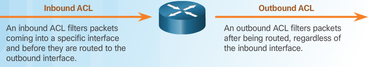

**Inbound ACLs**
Incoming packets are processed before they are routed to the outbound interface. An inbound ACL is efficient because it saves the overhead of routing lookups if the packet is discarded. If the packet is permitted by the ACL, it is then processed for routing. Inbound ACLs are best used to filter packets when the network attached to an inbound interface is the only source of packets that need to be examined.
**Outbound ACLs**
Incoming packets are routed to the outbound interface, and then they are processed through the outbound ACL. Outbound ACLs are best used when the same filter will be applied to packets coming from multiple inbound interfaces before exiting the same outbound interface.

.. code::

   R1# show access- lists
   Standard IP access list 11 
       10 deny 192.168.10.0 0.0.0.255 
       20 permit any

The first line of the ACL prevent s any packets originating in the 192.168.10.0/24 network, which includes Internet Control Message Protocol (ICMP) echoe s (ping requests). The second line of the ACL allows all other ip traffic from any source to transverse the router.

Remove access list 11 from the configuration

.. note:: The ``no access-list`` command deletes all ACLs configured on the router . The ``no access-list #`` command removes only a specific ACL.

.. code:: 

   R1(config)# int se0/0/0
   R1(config-if)# no ip access-group 11 out 

   R1(config)# no access-list 11

ACL Wildcard Masking
--------------------

.. note:: 0 means to match ip address bit - 1 means ignore address bit and zerofy

#. write out ip in binary
#. write WM in binary
#. 0 match the address bit, 1 ignore address bit and put on 0

+---------------+-----------------+-------------------------------------+
|               | Decimal Address | Binary Address                      |
+===============+=================+=====================================+
| IP to process | 192.168.10.0    | 11000000.10101000.00001010.00000000 |
+---------------+-----------------+-------------------------------------+
| Wildcard Mask | 0.0.255.255     | 00000000.00000000.11111111.11111111 |
+---------------+-----------------+-------------------------------------+
| Resulting IP  | 192.168.0.0     | 11000000.10101000.00000000.00000000 |
+---------------+-----------------+-------------------------------------+

.. note:: Unlike IPv4 ACLs, IPv6 ACLs do not use wildcard masks. Instead, the prefix-length is used to indicate how much of an IPv6 source or destination address should be matched

+---------------+----------------+-------------------------------------+
|               | Decimal        | Binary                              |
+===============+================+=====================================+
| IP Address    | 192.168.16.0   | 11000000.10101000.00010000.00000000 |
+---------------+----------------+-------------------------------------+
| Wildcard Mask | 0.0.15.255     | 00000000.00000000.00001111.11111111 |
+---------------+----------------+-------------------------------------+
| Result Range  | 192.168.16.0   | 11000000.10101000.00010000.00000000 |
+---------------+----------------+-------------------------------------+
|               | to             | to                                  |
+---------------+----------------+-------------------------------------+
|               | 192.168.31.255 | 11000000.10101000.00011111.11111111 |
+---------------+----------------+-------------------------------------+

The first two octets and first four bits of the third octet must match exactly.
The last four bits in the third octet and the last octet can be any valid number.
This results in a mask that checks for the range of networks 192.168.16.0 to 192.168.31.0.

+---------------+-------------+-------------------------------------+
|               | Decimal     | Binary                              |
+===============+=============+=====================================+
| IP Address    | 192.168.1.0 | 11000000.10101000.00000001.00000000 |
+---------------+-------------+-------------------------------------+
| Wildcard Mask | 0.0.254.255 | 00000000.00000000.11111110.11111111 |
+---------------+-------------+-------------------------------------+
| Result        | 192.168.1.0 | 11000000.10101000.00000001.00000000 |
+---------------+-------------+-------------------------------------+
|               |             | all odd numbered subnets            |
+---------------+-------------+-------------------------------------+

a wildcard mask that matches the first two octets, and the least significant bit in the third octet.
The last octet and the first seven bits in the third octet can be any valid number.
The result is a mask that would permit or deny all hosts from odd subnets from the 192.168.0.0 major network.

calculate WM for 192.168.3.32/28 Permit nw access for the 14 users in the nw

+-----+-----------------+
|     | 255.255.255.255 |
+=====+=================+
| (-) | 255.255.255.240 |
+-----+-----------------+
|     | 0.0.0.15        |
+-----+-----------------+

match only networks 192.168.10.0 and 192.168.11.0

+-----+-----------------+
|     | 255.255.255.255 |
+=====+=================+
| (-) | 255.255.254.0   |
+-----+-----------------+
|     | 0.0.1.255       |
+-----+-----------------+

You could accomplish the same result with statements like the two shown below:

.. code::

   R1(config)# access-list 10 permit 192.168.10.0
   R1(config)# access-list 10 permit 192.168.11.0
   
   It is far more efficient to configure the wildcard mask in the following way
         -------------------------------------------------

   R1(config)# access-list 10 permit 192.168.10.0 0.0.1.255

Wildcard Mask Abbreviations
---------------------------

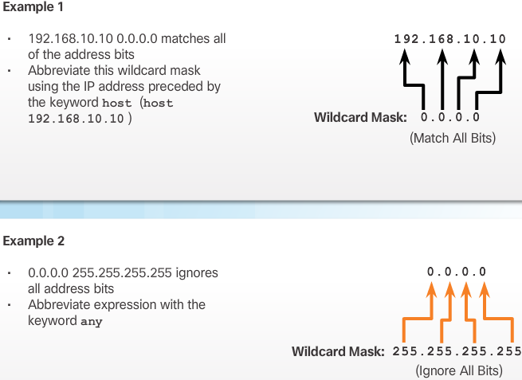

.. code::

   R1(config)# access-list 1 permit 0.0.0.0 255.255.255.255
   !OR
   R1(config)# access-list 1 permit any

   R1(config)# access-list 1 permit 192.168.10.10 0.0.0.0
   R1(config)# access-list 1 permit host 192.168.10.10

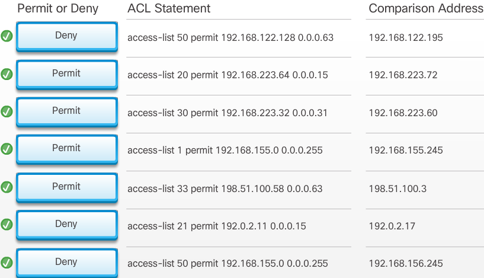

Rules for applying ACLs
-----------------------

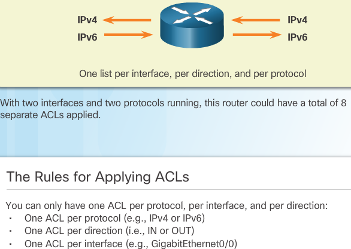

.. note:: If we needed ACLs for both protocols, on both interfaces and in both directions, this would require eight separate ACLs. Each interface would have four ACLs; two ACLs for IPv4 and two ACLs for IPv6. For each protocol, one ACL is for inbound traffic and one for outbound traffic.

* Use ACLs in firewall routers positioned between your internal network and an external network such as the Internet.
 
* Use ACLs on a router positioned between two parts of your network to control traffic entering or exiting a specific part of your internal network.
 
* Configure ACLs on border routers, that is, routers situated at the edges of your networks. This provides a very basic buffer from the outside network, or between a less controlled area of your own network and a more sensitive area of your network.
 
* **Configure ACLs for each network protocol configured on the border router** interfaces.

One ACL per protocol:
 To controll traffic flow on an interface an ACL must be defined for EACH Protocol enabled on the interface

One ACL per direction:
 ACLs control traffic in one direction at a time on an interface. Two seperate ACLs must be created to control inbound & outbound traffic

One ACL per interface:
 ACLs control traffic for an interface, eg. GigabitEthernet 0/0

.. note:: Test your ACLs on a development network before implementing them.

.. note:: Inbound ACLs, packets are processed before routing, Outbound ACLs after routing has performed

ACL Placement
-------------

.. warning:: Locate extended ACLs as close as possible to the source of the traffic to be filtered. This way, undesirable traffic is denied close to the source network without crossing the network infrastructure.

.. warning:: Because standard ACLs do not specify destination addresses, place them as close to the destination as possible. Placing a standard ACL at the source of the traffic will effectively prevent that traffic from reaching any other networks through the interface where the ACL is applied.

**extended ACLs are placed as close as possible to the source and standard ACLs are placed as close as possible to the destination**

* Placement of the ACL and therefore, the type of ACL used may also depend on

The extent of the network administrator’s control:
 Placement of the ACL can depend on whether or not the network administrator has control of both the source and destination networks.

Bandwidth of the networks involved:
 Filtering unwanted traffic at the source prevents transmission of the traffic before it consumes bandwidth on the path to a destination. This is especially important in low bandwidth networks.

Ease of configuration:
 If a network administrator wants to deny traffic coming from several networks, one option is to use a single standard ACL on the router closest to the destination. The disadvantage is that traffic from these networks will use bandwidth unnecessarily. An extended ACL could be used on each router where the traffic originated. This will save bandwidth by filtering the traffic at the source but requires creating extended ACLs on multiple routers.

Standard ACL placement
^^^^^^^^^^^^^^^^^^^^^^

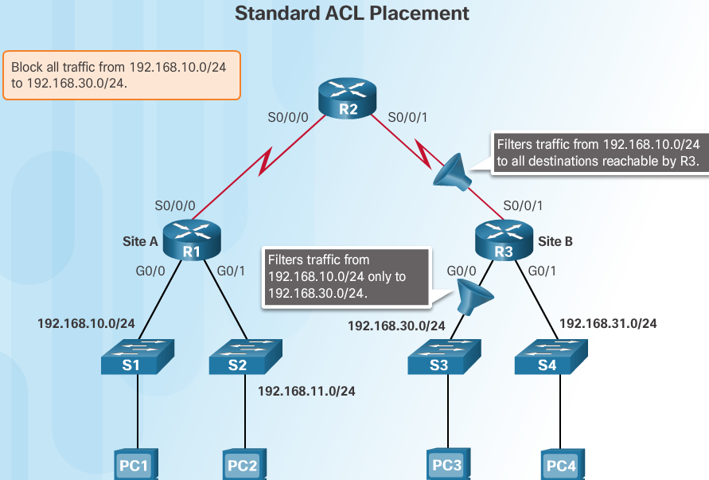

R3 S0/0/1 interface:
 Applying a standard ACL to prevent traffic from 192.168.10.0/24 from entering the S0/0/1 interface will prevent this traffic from reaching 192.168.30.0/24 and all other networks reachable by R3. This includes the 192.168.31.0/24 network. Because the intent of the ACL is to filter traffic destined only for 192.168.30.0/24, a standard ACL should not be applied to this interface.

R3 G0/0 interface:
 Applying the standard ACL to traffic exiting the G0/0 interface will filter packets from 192.168.10.0/24 to 192.168.30.0/24. This will not affect other networks reachable by R3. Packets from 192.168.10.0/24 will still be able to reach 192.168.31.0/24.

Access-list: defines a standard ACL with a number in the range of 1 through 99

Router(config)# **access-list** 10 {**deny | permit | remark**} source [source-wildcard] [**log**]

.. code::

   R1(config)# access-list 10 permit 192.168.10.0 0.0.0.255
   R1(config)# exit
   R1# show access-lists
   Standard IP access list 10
       10 permit 192.168.10.0, wildcard bits 0.0.0.255
   R1# conf t
   R1(config)# no access-list 10
   R1(config)# exit
   R1(config)# show access-lists
   R1# 

   use the ability to use remark
   -----------------------------

   R1(config)# access-list 10 remark Permit hosts from the 192.168.10.0 LAN
   R1(config)# access-list 10 permit 192.168.10.0 0.0.0.255
   R1(config)# exit
   R1# show running-config | include access-list 10
   access-list 10 remark Permit hosts from the 192.168.10.0 LAN
   access-list 10 permit 192.168.10.0 0.0.0.255
   R1#

Applying standard ipv4 ACLs to interface
----------------------------------------

* Router(config-if)# **ip access-group** { access-list-number | access-list-name } { **in | out** }

to remove ACL from interface:
 ``no ip access-group 10`` and then ``no access-list 10``

#. create the entry:
   R1(config)# access-**list** 1 permit 192.168.10.0 0.0.0.255
#. select the interface:
   R1(config)# interface serial 0/0/0
#. activate on interface:
   R1(config-if)# ip access-**group** 1 **out**

.. code::

   R1(config)# no access-list 1
   R1(config)# access-list 1 deny host 192.168.10.10
   R1(config)# access-list 1 permit 192.168.10.0 0.0.0.255
   R1(config)# interface **S0/0/0**
   R1(config-if)# ip access-group 1 **out**

This is not very efficient, better to apply it to the inbound interface so the router doesn't have to examine packets

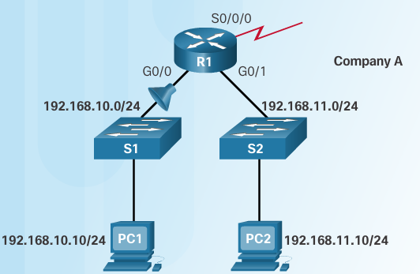

.. code::

   R1(config)# no access-list 1
   R1(config)# access-list 1 deny host 192.168.10.10
   R1(config)# access-list 1 permit any
   R1(config)# interface **g0/0**
   R1(config-if)# ip access-group 1 **in**

Named Standard ACLs
-------------------

#. Router(config)# **ip** access-list [**standard | extended**] name

   .. note::
      name must be unique and cannot begin with number

#. Router(config-std-nacl)# [**permit | deny | remark**] {source [source-wildcard]} [**log**]
#. Router(config-if)# **ip access-group** name [**in | out**]
   
   * Activates the named IP ACL on an interface

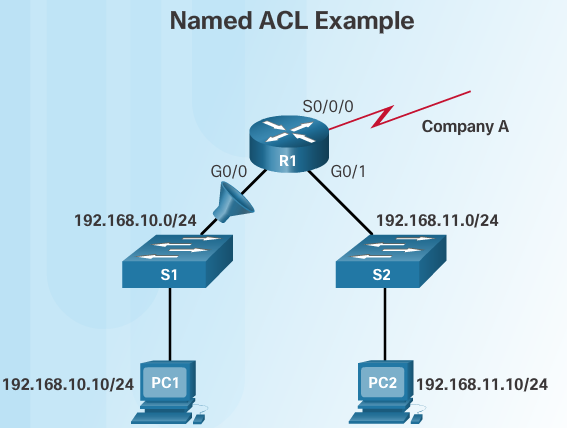

.. code::
   
   R1(config)# ip access-list standard NO_ACCESS
   R1(config-std-nacl)# deny host 192.168.11.10
   R1(config-std-nacl)# permit any 
   R1(config-std-nacl)# exit
   R1(config)# interface g0/0
   R1(config-if)# ip access-group NO_ACCESS out

.. note:: mnemonics -> X to the source, X'ersource :) standard to destination = STD

exercises
---------
PT Configuring Numbered Standard IPv4 ACLs
^^^^^^^^^^^^^^^^^^^^^^^^^^^^^^^^^^^^^^^^^^

Addressing Table

+-----------+-----------+----------------+-----------------+-----------------+
| Device    | Interface | IP Address     | Subnet Mask     | Default Gateway |
+===========+===========+================+=================+=================+
| R1        | G0/0      | 192.168.10.1   | 255.255.255.0   | N/A             |
+-----------+-----------+----------------+-----------------+-----------------+
|           | G0/1      | 192.168.11.1   | 255.255.255.0   | N/A             |
+-----------+-----------+----------------+-----------------+-----------------+
|           | S0/0/0    | 10.1.1.1       | 255.255.255.252 | N/A             |
+-----------+-----------+----------------+-----------------+-----------------+
|           | S0/0/1    | 10.3.3.1       | 255.255.255.252 | N/A             |
+-----------+-----------+----------------+-----------------+-----------------+
| R2        | G0/0      | 192.168.20.1   | 255.255.255.0   | N/A             |
+-----------+-----------+----------------+-----------------+-----------------+
|           | S0/0/0    | 10.1.1.2       | 255.255.255.252 | N/A             |
+-----------+-----------+----------------+-----------------+-----------------+
|           | S0/0/1    | 10.2.2.1       | 255.255.255.252 | N/A             |
+-----------+-----------+----------------+-----------------+-----------------+
| R3        | G0/0      | 192.168.30.1   | 255.255.255.0   | N/A             |
+-----------+-----------+----------------+-----------------+-----------------+
|           | S0/0/0    | 10.3.3.2       | 255.255.255.252 | N/A             |
+-----------+-----------+----------------+-----------------+-----------------+
|           | S0/0/1    | 10.2.2.2       | 255.255.255.252 | N/A             |
+-----------+-----------+----------------+-----------------+-----------------+
| PC1       | NIC       | 192.168.10.10  | 255.255.255.0   | 192.168.10.1    |
+-----------+-----------+----------------+-----------------+-----------------+
| PC2       | NIC       | 192.168.11.10  | 255.255.255.0   | 192.168.11.1    |
+-----------+-----------+----------------+-----------------+-----------------+
| PC3       | NIC       | 192.168.30.10  | 255.255.255.0   | 192.168.30.1    |
+-----------+-----------+----------------+-----------------+-----------------+
| WebServer | NIC       | 192.168.20.254 | 255.255.255.0   | 192.168.20.1    |
+-----------+-----------+----------------+-----------------+-----------------+

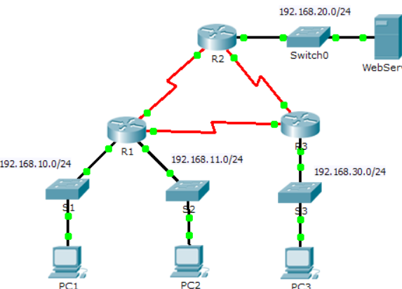

Objectives
* Part 1: Plan an ACL Implementation
* Part 2: Configure, Apply, and verify a STanDard ACL

Scenario
defining filtering criteria, configuring standard ACLs, applying ACLs to router interfaces, and verifying and testing the ACL implementation. The routers are already configured, including IP addresses and Enhanced Interior Gateway Routing Protocol (EIGRP) routing.

#. Verify full connectivity before applying ACLs
#. apply following policies on R2

   a. The 192.168.11.0/24 network is not allowed access to the WebServer on the 192.168.20.0/24 network.
   b. All other access is permitted

   .. code::
   
      R2(config)# access-list 1 deny 192.168.11.0 0.0.0.255
      R2(config)# access-list 1 permit any
      R2(config)# interface G0/0
      R2(config-if)# ip access-group 1 out

#. apply following policies on R3

   a. The 192.168.10.0/24 network is not allowed to communicate with the 192.168.30.0/24 network
   b. All other access is permitted

   .. code::
   
      R3(config)#do show access-list
      R3(config)#access-list 1 deny 192.168.10.0 0.0.0.255
      R3(config)#access-list 1 permit any
      R3(config)#interface g0/0
      R3(config-if)#ip access-group 1 out

#. Use the ``show access-list`` & ``show run`` or ``show ip interface gigabitethernet 0/0`` command to verify ACL placements
#. time to ping around to see what succeeds and fails

   #. A ping from 192.168.10.10 to 192.168.11.10 succeeds.
   #. A ping from 192.168.10.10 to 192.168.20.254 succeeds.
   #. A ping from 192.168.11.10 to 192.168.20.254 fails.
   #. A ping from 192.168.10.10 to 192.168.30.10 fails.
   #. A ping from 192.168.11.10 to 192.168.30.10 succeeds.
   #. A ping from 192.168.30.10 to 192.168.20.254 succeeds.

PT Configuring Named Standard IPv4 ACLs
^^^^^^^^^^^^^^^^^^^^^^^^^^^^^^^^^^^^^^^
+-------------+-----------+-----------------+---------------+-----------------+
| Device      | Interface | IP Address      | Subnet Mask   | Default Gateway |
+=============+===========+=================+===============+=================+
| R1          | F0/0      | 192.168.10.1    | 255.255.255.0 | N/A             |
+-------------+-----------+-----------------+---------------+-----------------+
| R1          | F0/1      | 192.168.20.1    | 255.255.255.0 | N/A             |
+-------------+-----------+-----------------+---------------+-----------------+
| R1          | E0/0/0    | 192.168.100.1   | 255.255.255.0 | N/A             |
+-------------+-----------+-----------------+---------------+-----------------+
| R1          | E0/1/0    | 192.168.200.1   | 255.255.255.0 | N/A             |
+-------------+-----------+-----------------+---------------+-----------------+
| File Server | NIC       | 192.168.200.100 | 255.255.255.0 | 192.168.200.1   |
+-------------+-----------+-----------------+---------------+-----------------+
| WebServer   | NIC       | 192.168.100.100 | 255.255.255.0 | 192.168.100.1   |
+-------------+-----------+-----------------+---------------+-----------------+
| PC0         | NIC       | 192.168.20.3    | 255.255.255.0 | 192.168.20.1    |
+-------------+-----------+-----------------+---------------+-----------------+
| PC1         | NIC       | 192.168.20.4    | 255.255.255.0 | 192.168.20.1    |
+-------------+-----------+-----------------+---------------+-----------------+
| PC2         | NIC       | 192.168.10.3    | 255.255.255.0 | 192.168.10.1    |
+-------------+-----------+-----------------+---------------+-----------------+

solution:

.. code::

   R1#show access-list
   R1#show ip access-lists 
   R1(config)#ip access-list standard File_Server_Restrictions
   R1(config-std-nacl)#permit host 192.168.20.4
   R1(config-std-nacl)#deny any
   R1(config-std-nacl)#?
     <1-2147483647>  Sequence Number
     default         Set a command to its defaults
     deny            Specify packets to reject
     exit            Exit from access-list configuration mode
     no              Negate a command or set its defaults
     permit          Specify packets to forward
     remark          Access list entry comment
   R1(config-std-nacl)#do show access-list
   Standard IP access list File_Server_Restrictions
       10 permit host 192.168.20.4
       20 deny any
   
   R1(config-std-nacl)#do show ip access-list
   Standard IP access list File_Server_Restrictions
       10 permit host 192.168.20.4
       20 deny any

.. note:: @ this point no difference is noticable between show or show ip access-list
.. note:: the answer: There may be more than just IPv4 access-lists on the router. If so, the command show access-lists would show them all, including IPX or other types that may exist. On that same router, the command show ip access-lists would only show the IP access-lists, and not the IPX or other types.

Lab Config/Mod Std IPv4 ACLs
^^^^^^^^^^^^^^^^^^^^^^^^^^^^

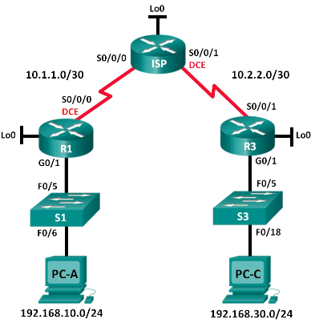

+--------+--------------+-----------------+-----------------+-----------------+
| Device | Interface    | IP Address      | Subnet Mask     | Default Gateway |
+========+==============+=================+=================+=================+
| R1     | G0/1         | 192.168.10.1    | 255.255.255.0   | N/A             |
+--------+--------------+-----------------+-----------------+-----------------+
|        | Lo0          | 192.168.20.1    | 255.255.255.0   | N/A             |
+--------+--------------+-----------------+-----------------+-----------------+
|        | S0/0/0 (DCE) | 10.1.1.1        | 255.255.255.252 | N/A             |
+--------+--------------+-----------------+-----------------+-----------------+
| ISP    | S0/0/0       | 10.1.1.2        | 255.255.255.252 | N/A             |
+--------+--------------+-----------------+-----------------+-----------------+
|        | S0/0/1 (DCE) | 10.2.2.2        | 255.255.255.252 | N/A             |
+--------+--------------+-----------------+-----------------+-----------------+
|        | Lo0          | 209.165.200.225 | 255.255.255.224 | N/A             |
+--------+--------------+-----------------+-----------------+-----------------+
| R3     | G0/1         | 192.168.30.1    | 255.255.255.0   | N/A             |
+--------+--------------+-----------------+-----------------+-----------------+
|        | Lo0          | 192.168.40.1    | 255.255.255.0   | N/A             |
+--------+--------------+-----------------+-----------------+-----------------+
|        | S0/0/1       | 10.2.2.1        | 255.255.255.252 | N/A             |
+--------+--------------+-----------------+-----------------+-----------------+
| S1     | VLAN 1       | 192.168.10.11   | 255.255.255.0   | 192.168.10.1    |
+--------+--------------+-----------------+-----------------+-----------------+
| S3     | VLAN 1       | 192.168.30.11   | 255.255.255.0   | 192.168.30.1    |
+--------+--------------+-----------------+-----------------+-----------------+
| PC-A   | NIC          | 192.168.10.3    | 255.255.255.0   | 192.168.10.1    |
+--------+--------------+-----------------+-----------------+-----------------+
| PC-C   | NIC          | 192.168.30.3    | 255.255.255.0   | 192.168.30.1    |
+--------+--------------+-----------------+-----------------+-----------------+

#. Configure IP addresses on PC-A and PC-C
#. configure basic settings for routers

  - Console into router and enter global config
  - copy following and paste it to the running config
  
    .. code::
    
       no ip domain-lookup 
       hostname R1 
       service password-encryption 
       enable secret class 
       banner motd # 
       Unauthorized access is strictly prohibited. # 
       Line con 0 
       password cisco 
       login 
       logging synchronous 
       line vty 0 4 
       password cisco 
       login 

  - Configure the device name as shown in the topology.
  - Create loopback interfaces on each router as shown in the Addressing Table.
  - Configure interface IP addresses as shown in the Topology and Addressing Table.
  - Assign a clock rate of **128000** to the DCE serial interfaces. 
  - Enable Telnet access.
  - Copy the running configuration to the startup configuration.

#. (optional)Configure basics on the switches

   - Console into switch and enter global config mode
   - Copy the following and paste it into the running config

     .. code::

         no ip domain-lookup 
         service password-encryption 
         enable secret class 
         banner motd # 
         Unauthorized access is strictly prohibited. # 
         Line con 0 
         password cisco 
         login 
         logging synchronous 
         line vty 0 15 
         password cisco 
         login 
         exit 

   - Configure the device name as shown in the topology.
   - Configure the management interface IP address as shown in the Topology and Addressing Table.
   - Configure a default gateway.
   - Enable Telnet access.
   - Copy the running configuration to the startup configuration.

#. Configure RIP routing on R1, ISP and R3

   - Configure RIP version 2 and advertise all networks on R1, ISP, and R3. The OSPF configuration for R1 and ISP is included for reference.

     .. code::

        R1(config)# router rip 
        R1(config-router)# version 2
        R1(config-router)# network 192.168.10.0
        R1(config-router)# network 192.168.20.0
        R1(config-router)# network 10.1.1.0 
        ISP(config)# router rip
        ISP(config-router)# version 2
        ISP(config-router)# network 209.165.200.224 
        ISP(config-router)# network 10.1.1.0 
        ISP(config-router)# network 10.2.2.0 

   - After configuring Rip on R1, ISP, and R3, verify that all routers have complete routing tables, listing all networks. Troubleshoot if this is not the case.

#. Verify connectivity between devices.
   
   .. Note:: It is very important to test whether connectivity is working before you configure and apply access lists! 

   - From PC-A, ping PC-C and the loopback interface on R3. Were your pings successful? 
   - From R1, ping PC-C and the loopback interface on R3. Were your pings successful? 
   - From PC-C, ping PC-A and the loopback interface on R1. Were your pings successful? 
   - From R3, ping PC-A and the loopback interface on R1. Were your pings successful? 

#. Configure numbered standard ACL
   
   - Standard ACLs filter traffic based on the source IP address only. A typical best practice for standard ACLs is to configure and apply it as close to the destination as possible. For the first access list, create a standard numbered ACL that allows traffic from all hosts on the 192.168.10.0/24 network and all hosts on the 192.168.20.0/24 network to access all hosts on the 192.168.30.0/24 network.
   - The security policy also states that a deny any access control entry (ACE), also referred to as an ACL statement, should be present at the end of all ACLs. What wildcard mask would you use to allow all hosts on the 192.168.10.0/24 network to access the 192.168.30.0/24 network?
   - Following Cisco’s recommended best practices, on which router would you place this ACL? On which interface would you place this ACL? In what direction would you apply it?
   - Configure the ACL on R3. Use 1 for the access list number.

     .. code::

        R3(config)# access-list 1 remark Allow R1 LANs Access 
        R3(config)# access-list 1 permit 192.168.10.0 0.0.0.255 
        R3(config)# access-list 1 permit 192.168.20.0 0.0.0.255 
        R3(config)# access-list 1 deny any 
   
   - Apply the ACL to the appropriate interface in the proper direction.

     .. code::

        R3(config)# interface g0/1
        R3(config-if)# ip access-group 1 out

   - Verify a numbered ACL.
     The use of varios show commands can aid you in verifying both the syntax and placement of your ACLs in your router.
     To see access list 1 in its entirety with all ACEs, which command would you use?

#. On R3, issue the ``show access-lists 1`` command.

   .. code::

      R3# show access-list 1
      Standard IP access list 1 
          10 permit 192.168.10.0, wildcard bits 0.0.0.255 
          20 permit 192.168.20.0, wildcard bits 0.0.0.255 
          30 deny   any 

#. On R3, issue the ``show ip interface g0/1`` command.

   .. code::

      R3# show ip interface g0/1 
      GigabitEthernet0/1 is up, line protocol is up
        Internet address is 192.168.30.1/24 
        Broadcast address is 255.255.255.255 
        Address determined by non-volatile memory 
        MTU is 1500 bytes 
        Helper address is not set 
        Directed broadcast forwarding is disabled 
        Multicast reserved groups joined: 224.0.0.10 
        Outgoing access list is 1 
        Inbound access list is not set 
        Output omitted 

#. Test the ACL to see if it allows traffic from the 192.168.10.0/24 network access to the 192.168.30.0/24 network. From the PC-A command prompt, ping the PC-C IP address. Were the pings successful?

#. Test the ACL to see if it allows traffic from the 192.168.20.0/24 network access to the 192.168.30.0/24 network. You must do an extended ping and use the loopback 0 address on R1 as your source. Ping PC-C’s IP address. Were the pings successful?

   .. code::
      
      R1# 
      ping 
      Protocol [ip]: 
      Target IP address: 
      192.168.30.3
      Repeat count [5]: 
      Datagram size [100]: 
      Timeout in seconds [2]: 
      Extended commands [n]: 
      y
      Source address or interface: 
      192.168.20.1
      Type of service [0]: 
      Set DF bit in IP header? [no]: 
      Validate reply data? [no]: 
      Data pattern [0xABCD]: 
      Loose, Strict, Record, Timestamp, Verbose[none]: 
      Sweep range of sizes [n]: 
      Type escape sequence to abort. 
      Sending 5, 100-byte ICMP Echos to 192.168.30.3, timeout is 2 seconds: 
      Packet sent with a source address of 192.168.20.1 
      !!!!! 
      Success rate is 100 percent (5/5), round-trip min/avg/max = 28/29/32 ms 

   - From the R1 prompt, ping PC-C’s IP address again.
     ``R1# ping 192.168.30.3`` Was the ping successful? Why or why not?

#. Configure a named standard ACL. Create a named standard ACL that conforms to the following policy: allow traffic from all hosts on the 192.168.40.0/24 network access to all hosts on the 192.168.10.0/24 network. Also, only allow host PC-C access to the 192.168.10.0/24 network. The name of this access list should be called BRANCH-OFFICE-POLICY.
   Following Cisco’s recommended best practices, on which router would you place this ACL? On which interface would you place this ACL? In what direction would you apply it?
  
   - Create the standard named ACL BRANCH-OFFICE-POLICY on R1.

     .. code::

        R1(config)# ip access-list standard BRANCH-OFFICE-POLICY 
        R1(config-std-nacl)# permit host 192.168.30.3 
        R1(config-std-nacl)# permit 192.168.40.0 0.0.0.255
        R1(config-std-nacl)# end 
        R1#
        Feb 15 15:56:55.707: %SYS-5-CONFIG_I: Configured from console by console 
        
     Looking at the first permit ACE in the access list, what is another way to write this?
   - Apply the ACL to the appropriate interface in the proper direction.

     .. code::
  
        R1# config t 
        R1(config)# interface g0/1 
        R1(config-if)# ip access-group BRANCH-OFFICE-POLICY out

   - Verify a named ACL.

     #. On R1, issue the show access-lists command.
        
        .. code::

           R1# show access-lists 
           Standard IP access list BRANCH-OFFICE-POLICY 
            10 permit 192.168.30.3 
            20 permit 192.168.40.0, wildcard bits 0.0.0.255 

        Is there any difference between this ACL on R1 with the ACL on R3? If so, what is it?

     #. On R1, issue the ``show ip interface g0/1`` command.

        .. code::

           R1# 
           show ip interface g0/1 
           GigabitEthernet0/1 is up, line protocol is up
             Internet address is 192.168.10.1/24 
             Broadcast address is 255.255.255.255 
             Address determined by non-volatile memory 
             MTU is 1500 bytes 
             Helper address is not set 
             Directed broadcast forwarding is disabled 
             Multicast reserved groups joined: 224.0.0.10 
             Outgoing access list is BRANCH-OFFICE-POLICY 
             Inbound access list is not set 
           <Output omitted>
           
     #. Test the ACL. From the command prompt on PC-C, ping PC-A’s IP address. Were the pingssuccessful?
     #. Test the ACL to ensure that only the PC-C host is allowed access to the 192.168.10.0/24 network. You must do an extended ping and use the G0/1 address on R3 as your source. Ping PC-A’s IP address. Were the pings successful?
     #. Test the ACL to see if it allows traffic from the 192.168.40.0/24 network access to the 192.168.10.0/24 network. You must perform an extended ping and use the loopback 0 address on R3 as your source. Ping PC-A’s IP address. Were the pings successful?

#. Management has decided that users from the 209.165.200.224/27 network should be allowed full access to the 192.168.10.0/24 network. Management also wants ACLs on all of their router s to follow consistent rules. A deny any ACE should be placed at the end of all ACLs. You must modify the BRANCH-OFFICE-POLICY ACL. You will add two additional lines to this ACL. There are two ways you could do this:

   - OPTION 1: Issue a no ip access-list standard BRANCH-OFFICE-POLICY command in global configuration mode. This would effectively take the whole ACL out of the router. Depending upon the router IOS, one of the following scenarios would occur:

     all filtering of packets would be cancelled and all packets would be allowed through the router; or, because you did not take off the ip access-group command on the G0/1 interface, filtering is still in place. Regardless, when the ACL is gone, you could retype the whole ACL, or cut and paste it in from a text editor.

   - OPTION 2: You can modify ACLs in place by adding or deleting specific lines within the ACL itself. This can come in handy, especially with ACLs that have many lines of code. The retyping of the whole ACL or cutting and pasting can easily lead to errors. Modifying specific lines within the ACL is easily accomplished. For this lab, use Option 2.
   - From R1 privileged EXEC mode, issue a show access-lists command.

     .. code::

        R1# show access-lists
        Standard IP access list BRANCH-OFFICE-POLICY 
            10 permit 192.168.30.3 (8 matches) 
            20 permit 192.168.40.0, wildcard bits 0.0.0.255 (5 matches) 

   - Add two additional lines at the end of the ACL. From global config mode, modify the ACL, BRANCH-OFFICE-POLICY.

     .. code::

        R1#(config)# ip access-list standard BRANCH-OFFICE-POLICY 
        R1(config-std-nacl)# 30 permit 209.165.200.224 0.0.0.31 
        R1(config-std-nacl)# 40 deny any 
        R1(config-std-nacl)# end 

   - Verify the ACL.
     
     #. On R1, issue the show access-lists command.

        .. code::

           R1# show access-lists
           Standard IP access list BRANCH-OFFICE-POLICY 
               10 permit 192.168.30.3 (8 matches) 
               20 permit 192.168.40.0, wildcard bits 0.0.0.255 (5 matches) 
               30 permit 209.165.200.224, wildcard bits 0.0.0.31 
               40 deny   any
 
        Do you have to apply the BRANCH-OFFICE-POLICY to the G0/1 interface on R1? 

     #. From the ISP command prompt, issue an extended ping. Test the ACL to see if it allows traffic from the 209.165.200.224/27 network access to the 192.168.10.0/24 network. You must do an extended ping and use the loopback 0 address on ISP as your source. Ping PC-A’s IP address. Were the pings successful?

Reflection
1. As you can see, standard ACLs are very powerful and work quite well. Why would you ever have the need for 
using extended ACLs? 
2. Typically, more typing is required when using a named ACL as opposed to a numbered ACL. Why would you 
choose named ACLs over numbered?

Editing Numbered ACLs
---------------------

Method 1 - Use a Text Editor
^^^^^^^^^^^^^^^^^^^^^^^^^^^^
After someone is familiar with creating and editing ACLs, it may be easier to construct the ACL using a text editor such as Microsoft Notepad. This allows you to create or edit the ACL and then paste it into the router interface. For an existing ACL, you can use the show running-config command to display the ACL, copy and paste it into the text editor, make the necessary changes, and paste it back in to the router interface.

Configuration: For example, assume that the host IPv4 address in the figure was incorrectly entered. Instead of the 192.168.10.99 host, it should have been the 192.168.10.10 host. Here are the steps to edit and correct ACL 1:

#. Display the ACL using the show running-config command. The example in the figure uses the include keyword to display only the ACEs.

#. Highlight the ACL, copy it, and then paste it into a Notepad. Edit the list as required. After the ACL is correctly displayed in Notepad, highlight it and copy it.

Step 3. In global configuration mode, remove the access list using the no access-list 1 command. Otherwise, the new statements would be appended to the existing ACL. Then paste the new ACL into the configuration of the router.

Step 4. Using the show running-config command, verify the changes

.. warning:: when using the no access-list command, different IOS software releases act differently. If the ACL that has been deleted is still applied to an interface, some IOS versions act as if **no ACL is protecting your network while others deny all traffic**

.. note:: For this reason it is **good practice to remove the reference to the access list from the interface** before modifying the access list. If there is an error in the new list, disable it and troubleshoot the problem. In that instance, the network has no ACL during the correction process.

Method 2 - Use Sequence Numbers
^^^^^^^^^^^^^^^^^^^^^^^^^^^^^^^

.. code::

   goto acl
   --------
   R1(config) ip access-list standard 1
   
   fix line
   --------
   R1(config-std-nacl)# no 10
   R1(config-std-nacl)# 10 deny host 192.168.10.10
   
   verify
   ------
   R1# show access-lists
   R1# show running-config | include access-list 1

.. note:: Cisco IOS implements an internal logic to standard access lists. The order in which standard ACEs are entered may not be the order in which they are stored, displayed or processed by the router. The show access-lists command displays the ACEs with their sequence numbers.

adding a line to NACL
---------------------

.. code:: 
   
   R1#show access-lists
   R1(config) ip access-list standard NAME_OF_ACCESS_LIST
   R1(config-if-nacl)# 15 deny host 192.168.11.11
   R1(config-if-nacl)# end 
   
verifying standard ACL interfaces
---------------------------------

``R1# show ip interface s0/0/0``

Outgoing access list is 1
Inbound  access list is not set

``R1# show ip interface g0/0``

Outgoing access list is NO_ACCESS
Inbound  access list is not set

``R1# show access-lists``

ACL VS IP ACL
-------------

The ``access-list`` command is used to define a numbered ACL, meaning that the ACL will be identified in the configuration by its number. This number also designates the type of this ACL, i.e. standard IP, extended IP, MAC, etc. See here:

.. code::

   Router(config)#access-list ?
    <1-99>            IP standard access list
    <100-199>         IP extended access list
    <1100-1199>       Extended 48-bit MAC address access list
    <1300-1999>       IP standard access list (expanded range)
    <200-299>         Protocol type-code access list
    <2000-2699>       IP extended access list (expanded range)
    <700-799>         48-bit MAC address access list

Following this help output, if you want to define a standard IP ACL, it has to be identified by a number in the range 1-99 or 1300-1999. Analogously, if you want to define an extended IP ACL, it must be numbered from the range 100-199 or 2000-2699. MAC ACLs would use the range 700-799 for standard ACL and 1100-1199 for extended ACL.

The ip access-list command defines a named IPv4 ACL, either standard or extended. A named IP ACL is totally equivalent to a numbered IP ACL in its behavior - the only difference is in the way it is configured and referenced in the configuration. Also, using the ip access-list command, you can not define different types of ACLs like MAC ACLs. Otherwise, a named and a numbered ACLs behave identically.

For example, these two ACLs would provide identical results:

.. code::

   access-list 1 deny host 192.0.2.4
   access-list 1 deny 192.0.2.128 0.0.0.127
   access-list 1 permit any

.. code::

   ip access-list standard MyACL1
    deny host 192.0.2.4
    deny 192.0.2.128 0.0.0.127
    permit any

Also, these two ACLs would provide identical results:

.. code::

   access-list 100 permit tcp any any eq 80
   access-list 100 permit tcp any any eq 443
   access-list 100 permit udp any host 192.0.2.1 eq 53
   
.. code::

   ip access-list extended MyACL2
     permit tcp any any eq 80
     permit tcp any any eq 443
     permit udp any host 192.0.2.1 eq 53

Apart from the obvious advantage of giving ACLs meaningful names instead of just numbers, the **named ACLs have another advantage: they can actually be edited. Numbered ACLs cannot really be edited - you can only add new entries to their end but if you need to remove or replace an entry, you need to remove the entire ACL** and enter it anew. With named ACLs, it is actually possible to perform in-place editing.

Let's take the last **named ACL** posted. If you perform ``show ip access-lists`` you will get the following output:

.. code::

   Router#show ip access-lists
   Extended IP access list MyACL2
    10 permit tcp any any eq www
    20 permit tcp any any eq 443
    30 permit udp any host 192.0.2.1 eq domain

Note the numbers 10,20,30 at the each line. They allow you to remove that particular line or insert a new line between them. For example, if I wanted to insert a new rule between the first and second entry, it would be done as follows:
ch7_named_acl_ipv4_pt.pn
.. code::

   ip access-list extended MyACL2
    15 permit tcp any any eq 110

Now the ``show ip access-lists`` would say:

.. code::

   Extended IP access list MyACL2
    10 permit tcp any any eq www
    15 permit tcp any any eq pop3
    20 permit tcp any any eq 443
    30 permit udp any host 192.0.2.1 eq domain

I could use any number bch7_named_acl_ipv4_pt.pnetween 11 and 19, inclusive.

Now, if I wanted to remove the line 30 (the one permitting the DNS access), the command would be:

.. code::

   ip access-list extended MyACL2
   no 30

The ``show ip access-lists`` would now produce:

.. code::

   Extended IP access list MyACL2
    10 permit tcp any any eq www
    15 permit tcp any any eq pop3
    20 permit tcp any any eq 443

These numbers are not really stored in the configuration - they are only runtime-remembered. If you restart the router, they will be reset again to 10,20,30,etc. In case you need to resequence the ACL without restarting the router, you can use the command ``ip access-list resequence MyACL2 10 10`` where the **first "10" number specifies the starting number of the ACL entry, and the second "10" represents the increment**. After entering this command in the global configuration mode, the show ip access-lists again shows:

.. code::

   Extended IP access list MyACL2
    10 permit tcp any any eq www
    20 permit tcp any any eq pop3
    30 permit tcp any any eq 443

So to wrap it up, *numbered ACLs and named ACLs defined using the ip access-list command have the same effect*. However, **the named ACLs are more flexible** in the way they are defined, managed and referenced.

Clearing ACL Statistics
-----------------------

``R1# clear access-list counters 1`` or ``clear access-list counters ACL_NAME``

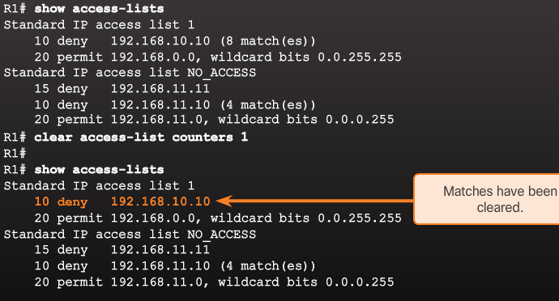

Accesss-class command
---------------------

The ``access-class`` command configured in line configuration mode restricts incoming and outgoing connections between a particular VTY (into a Cisco device) and the addresses in an access list.

The command syntax of the access-class command is:

``Router(config-line)# access-class access-list-number { in [ vrf-also ] | out }``

The parameter in restricts incoming connections between the addresses in the access list and the Cisco device, while the parameter out restricts outgoing connections between a particular Cisco device and the addresses in the access list.

The following should be considered when configuring access lists on VTYs:

    Both named and numbered access lists can be applied to VTYs.
    Identical restrictions should be set on all the VTYs, because a user can attempt to connect to any of them.

.. note:: Access lists apply to packets that travel through a router. They are not designed to block packets that originate within the router. By default, an outbound ACL does not prevent remote access connections initiated from the router.

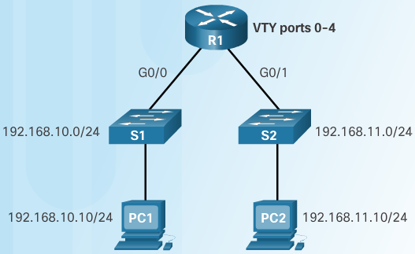

.. code::

   R1(config)# line vty 0 15 
   R1(config-line)# login local
   R1(config-line)# transport input ssh
   R1(config-line)# access-class 21 in
   R1(config-line)# exit
   R1(config)# access-list 21 permit 192.168.10.0 0.0.0.255
   R1(config)# access-list 21 deny any

The implicit Deny Any
---------------------

A single-entry ACL with only one deny entry has the effect of denying all traffic. At least one permit ACE must be configured in an ACL or all traffic is blocked.

For the network in the figure, applying either ACL 1 or ACL 2 to the S0/0/0 interface of R1 in the outbound direction will have the same effect. Network 192.168.10.0 will be permitted to access the networks reachable through S0/0/0, while 192.168.11.0 will not be allowed to access those networks. In ACL 1, if a packet does not match the permit statement, it is discarded.

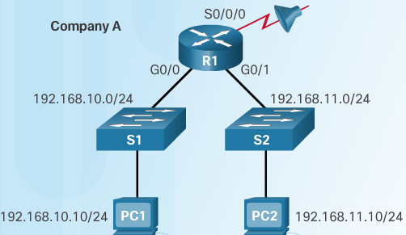

ACL 1

.. code::

   R1(config)# access-list 1 permit 192.168.10.0 0.0.0.255

ACL 2

.. code::

   R1(config)# access-list 2 permit 192.168.10.0 0.0.0.255
   R1(config)# access-list 2 deny any

The order of ACEs in an ACL
---------------------------

.. code::

   R1(config)# access-list 3 deny 192.168.10.0 0.0.0.255
   R1(config)# access-list 3 permit host 192.168.10.10
   % Access rule can't be configured at higher sequence num as it is part of the existing rule at sequence num 10

ACL 3 Host statement conflicts with previous range statement

.. code::

   R1(config)# access-list 4 permit host 192.168.10.10
   R1(config)# access-list 4 deny 192.168.10.0 0.0.0.255

ACL 4
.. note:: Host statement can always be configured before range statements

ACL 5

.. code::

   R1(config)# access-list 5 deny 192.168.10.0 0.0.0.255
   R1(config)# access-list 5 permit host 192.168.11.10

Host statement can be configured if there's no conflict

Sequencing considerations during configuration
----------------------------------------------

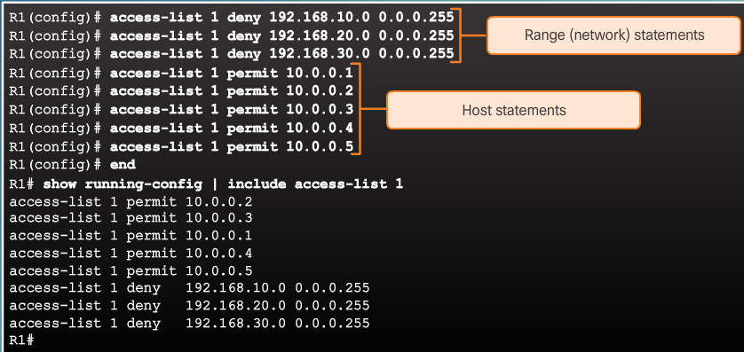

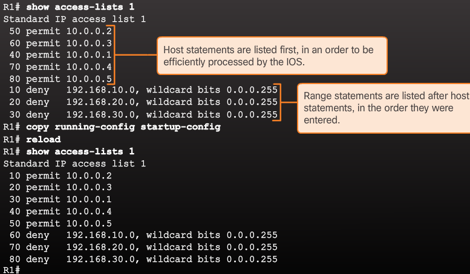

The order in which the standard ACEs are listed is the sequence used by the IOS to process the list. Notice that the statements are grouped into two sections, host statements followed by range statements. The sequence number indicates the order that the statement was entered, not the order the statement will be processed.

**The host statements are listed first but not necessarily in the order that they were entered. The IOS puts host statements in an order using a special hashing function**. The resulting order optimizes the search for a host ACL entry. **The range statements are displayed after the host statements. These statements are listed in the order in which they were entered**.

.. note:: The hashing function is only applied to host statements in an IPv4 standard access list.

Recall that standard and numbered ACLs can be edited using sequence numbers. When inserting a new ACL statement, the sequence number will only affect the location of a range statement in the list. **Host statements will always be put in order using the hashing function.**

ACL and Routing Processes
-------------------------

open in new tab to view properly

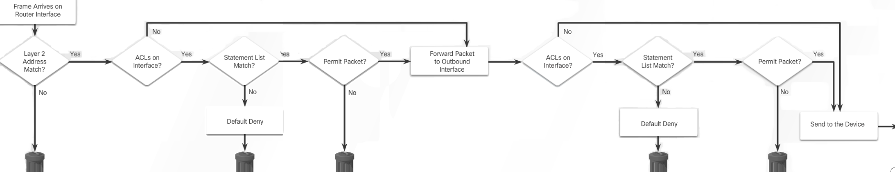

When a packet arrives at a router interface, the router process is the same, whether ACLs are used or not. As a frame enters an interface, the router checks to see whether the destination Layer 2 address matches its interface Layer 2 address, or whether the frame is a broadcast frame.

If the frame address is accepted, the frame information is stripped off and the router checks for an ACL on the inbound interface. If an ACL exists, the packet is tested against the statements in the list.

If the packet matches a statement, the packet is either permitted or denied. If the packet is accepted, it is then checked against routing table entries to determine the destination interface. If a routing table entry exists for the destination, the packet is then switched to the outgoing interface, otherwise the packet is dropped.

Next, the router checks whether the outgoing interface has an ACL. If an ACL exists, the packet is tested against the statements in the list.

If the packet matches a statement, it is either permitted or denied.

If there is no ACL or the packet is permitted, the packet is encapsulated in the new Layer 2 protocol and forwarded out the interface to the next device.

Troubleshooting StD IPv4 ACLs
-----------------------------

- ``show access-list``
- ``R1# show run | section interface``
- ``R1# show run | section line vty``
- ``R1(config)# ip access-list standard PC1-SSH`` followed by ``R1(config-std-nacl)# no 10`` followed by correction ``R1(config-std-nacl)# 10 permit host 192.168.10.10``
- ``R1# clear access-list counters`` to only show new matches

#. check access-list
#. check if access-list is applied to the correct interface

   .. code::

      R1# conf t
      R1(config)# interface g0/1
      R1(config-if)# no ip access-group 20 in
      R1(config-if)# interface g0/0 
      R1(config-if)# ip access-group 20 out

#. check if access-list is applied via access-class on vty's

Exercices
---------
PT Troubleshooting StD IPv4 ACLs
^^^^^^^^^^^^^^^^^^^^^^^^^^^^^^^^

Policy:
 + Hosts from the 192.168.0.0/24 network are unable to access network 10.0.0.0/8.
 + L3 can’t access any devices in network 192.168.0.0/24.
 + L3 can’t access Server1 or Server2. L3 should only access Server3.
 + Hosts from the 172.16.0.0/16 network have full access to Server1, Server2 and Server3.

.. list-table:: 7.3.2.4 Packet Tracer

  
   * - given:
     
       .. code::
      
          interface GigabitEthernet0/0
           ip address 10.0.0.1 255.0.0.0
           ip access-group FROM_10 in
           duplex auto
           speed auto
          !
          interface GigabitEthernet0/1
           ip address 172.16.0.1 255.255.0.0
           ip access-group FROM_172 in
           duplex auto
           speed auto
          !
          interface GigabitEthernet0/2
           ip address 192.168.0.1 255.255.255.0
           duplex auto
           speed auto
          !
          interface Vlan1
           no ip address
           shutdown
          !
          ip classless
          !
          ip flow-export version 9
          !
          !
          ip access-list standard FROM_192
           deny 192.168.0.0 0.0.0.255
           permit any
          ip access-list standard FROM_10
           deny host 10.0.0.22
           permit any
          ip access-list standard FROM_172
           deny host 172.16.0.2
           permit any
          !
     
     - solution:
     
       .. code::
          
          interface GigabitEthernet0/0
           ip address 10.0.0.1 255.0.0.0
           ip access-group FROM_10 in
           ip access-group FROM_192 out
           duplex auto
           speed auto
          !
          interface GigabitEthernet0/1
           ip address 172.16.0.1 255.255.0.0
           ip access-group FROM_172 in
           duplex auto
           speed auto
          !
          interface GigabitEthernet0/2
           ip address 192.168.0.1 255.255.255.0
           duplex auto
           speed auto
          !
          interface Vlan1
           no ip address
           shutdown
          !
          ip classless
          !
          ip flow-export version 9
          !
          !
          ip access-list standard FROM_192
           deny 192.168.0.0 0.0.0.255
           permit any
          ip access-list standard FROM_10
           deny host 10.0.0.2
           permit any
          ip access-list standard FROM_172
          !
  

PT Ch7 Skills Integration Challenge 
^^^^^^^^^^^^^^^^^^^^^^^^^^^^^^^^^^^
+------------------+-----------+----------------+-----------------+-----------------+
| Device           | Interface | IP Address     | Subnet Mask     | Default Gateway |
+==================+===========+================+=================+=================+
|             HQ1  | G0/0      | 172.16.127.254 | 255.255.192.0   | N/A             |
+                  +-----------+----------------+-----------------+-----------------+
|    HQServer HQ2  | G0/1      | 172.16.63.254  | 255.255.192.0   | N/A             |
+                  +-----------+----------------+-----------------+-----------------+
|           Branch | S0/0/0    | 192.168.0.1    | 255.255.255.252 | N/A             |
+                  +-----------+----------------+-----------------+-----------------+
|             ISP  | S0/0/1    | 64.104.34.2    | 255.255.255.252 | 64.104.34.1     |
+------------------+-----------+----------------+-----------------+-----------------+
| BranchServer,B2  | G0/0      | 172.16.159.254 | 255.255.240.0   | N/A             |
+                  +-----------+----------------+-----------------+-----------------+
|              B1  | G0/1      | 172.16.143.254 | 255.255.240.0   | N/A             |
+                  +-----------+----------------+-----------------+-----------------+
|              HQ  | S0/0/0    | 192.168.0.2    | 255.255.255.252 | N/A             |
+------------------+-----------+----------------+-----------------+-----------------+
| HQ1              | NIC       | 172.16.64.1    | 255.255.192.0   | 172.16.127.254  |
+------------------+-----------+----------------+-----------------+-----------------+
| HQ2              | NIC       | 172.16.0.2     | 255.255.192.0   | 172.16.63.254   |
+------------------+-----------+----------------+-----------------+-----------------+
| HQServer.pka     | NIC       | 172.16.0.1     | 255.255.192.0   | 172.16.63.254   |
+------------------+-----------+----------------+-----------------+-----------------+
| B1               | NIC       | 172.16.144.1   | 255.255.240.0   | 172.16.159.254  |
+------------------+-----------+----------------+-----------------+-----------------+
| B2               | NIC       | 172.16.128.2   | 255.255.240.0   | 172.16.143.254  |
+------------------+-----------+----------------+-----------------+-----------------+
| BranchServer.pka | NIC       | 172.16.128.1   | 255.255.240.0   | 172.16.143.254  |
+------------------+-----------+----------------+-----------------+-----------------+

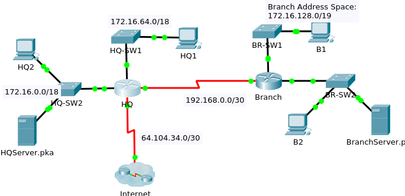

#. Configure HQ & Branch with RIPv2 routing:

   - Advertise all three attached networks. Do not advertise the link to the internet.
   - Configure appropriate interfaces as passive

     .. code::

        HQ(config)#router rip
        HQ(config-router)#version 2
        HQ(config-router)#network 172.16.0.0
        HQ(config-router)#network 192.168.0.0
        HQ(config-router)#passive-interface GigabitEthernet 0/1
        HQ(config-router)#passive-interface GigabitEthernet 0/0
        HQ(config-router)#passive-interface Serial 0/0/1

        
        Branch>enable
        Branch#conf t
        Branch(config)#router rip
        Branch(config-router)#version 2
        Branch(config-router)#passive-interface GigabitEthernet 0/0
        Branch(config-router)#passive-interface GigabitEthernet 0/1
        Branch(config-router)#no auto-summary

.. note:: By default routing protocol like RIP and EIGRP summarize subnets into major classful network at classful boundary. In other word, these protocols perform an auto-summarization each time they crosses a border between two different major networks. To disable this behavior and advertise subnets, 'no auto-summary' command is used. Let's say router has two subnets 172.16.8.0/24 and 172.16.4.0/24 of Class B network and one subnet 10.2.0.0/16 of Class A. When auto-summary is enabled, router will advertise only summarized major classful network 172.16.0.0/16.

#. Set a default route on HQ that directs traffic to S0/0/1 interface. Redistribute the route to Branch.

   .. code::
    
      HQ(config)#ip route 0.0.0.0 0.0.0.0 Serial 0/0/1
      %Default route without gateway, if not a point-to-point interface, may impact performance
      HQ(config)#router rip
      HQ(config-router)#default-information originate

#. design NACL HQServer to prevent any pc's attached to Branch G0/1 from accessing HQServer.pka. All other traffic is permitted. Configure on appropriate router, apply it to the appropriate interface and in the appropriate direction.

   .. code::
     
      HQ(config)#ip access-list standard HQServer
      HQ(config-std-nacl)#deny 172.16.128.0 0.0.15.255
      HQ(config-std-nacl)#permit any
      HQ(config-std-nacl)#exit
      HQ(config)#interface GigabitEthernet 0/1
      HQ(config-if)#ip access-group HQServer out

#. design NACL BranchServer to prevent any pc's attached to HQ G0/0 from accessing the Branch server. All other traffic is permitted. Configure access list on appropriate router,interface,direction.

   .. code::

      HQ(config)#ip access-list standard BranchServer 
      HQ(config-std-nacl)#deny 172.16.64.0 0.0.63.255
      HQ(config-std-nacl)#permit any
      HQ(config-std-nacl)#exit
      HQ(config)#interface GigabitEthernet 0/1
      HQ(config-if)#ip access-group BranchServer
      

.. list-table:: 7.4.2.1 Packet Tracer
  
   * - HQ:
     
       .. code::
      
          interface GigabitEthernet0/0
          ip address 172.16.127.254 255.255.192.0
           duplex auto
           speed auto
          !
          interface GigabitEthernet0/1
           ip address 172.16.63.254 255.255.192.0
           ip access-group HQServer out
           duplex auto
           speed auto
          !
          interface GigabitEthernet0/2
           no ip address
           duplex auto
           speed auto
           shutdown
          !
          interface Serial0/0/0
           ip address 192.168.0.1 255.255.255.252
           clock rate 2000000
          !
          interface Serial0/0/1
           description link_ISP
           ip address 64.104.34.2 255.255.255.252
          !
          interface Vlan1
           no ip address
           shutdown
          !
          router rip
           version 2
           passive-interface GigabitEthernet0/0
           passive-interface GigabitEthernet0/1
           passive-interface Serial0/0/1
           network 172.16.0.0
           network 192.168.0.0
           default-information originate
           no auto-summary
          !
          ip classless
          ip route 0.0.0.0 0.0.0.0 Serial0/0/1 
          !
          ip flow-export version 9
          !
          !
          ip access-list standard BranchServer
           deny 172.16.64.0 0.0.63.255
           permit any
          ip access-list standard HQServer
           deny 172.16.144.0 0.0.15.255
           permit any
          !

     - Branch:
     
       .. code::
      
          interface GigabitEthernet0/0
           ip address 172.16.159.254 255.255.240.0
           duplex auto
           speed auto
          !
          interface GigabitEthernet0/1
           ip address 172.16.143.254 255.255.240.0
           ip access-group BranchServer out
           duplex auto
           speed auto
          !
          interface GigabitEthernet0/2
           no ip address
           duplex auto
           speed auto
           shutdown
          !
          interface Serial0/0/0
           ip address 192.168.0.2 255.255.255.252
          !
          interface Serial0/0/1
           no ip address
           clock rate 2000000
          !
          interface Vlan1
           no ip address
           shutdown
          !
          router rip
           version 2
           passive-interface GigabitEthernet0/0
           passive-interface GigabitEthernet0/1
           no auto-summary
          !
          ip classless
          !
          ip flow-export version 9
          !
          !
          ip access-list standard BranchServer
           deny 172.16.64.0 0.0.63.255
           permit any

using debugging to see update entries: ``router#debug ip rip``

.. code::

   HQ#debug ip ?
     eigrp    IP-EIGRP information
     icmp     ICMP transactions
     nat      NAT events
     ospf     OSPF information
     packet   Packet information
     rip      RIP protocol transactions
     routing  Routing table events
   HQ#debug ipv6 ?
     dhcp     IPv6 DHCP debugging
     inspect  Stateful inspection events
     nd       IPv6 Neighbor Discovery debugging
     ospf     OSPF information
   ---------------
   HQ#debug ip rip
   ---------------
      RIP: sending  v2 update to 224.0.0.9 via Serial0/0/0 (192.168.0.1)
      RIP: build update entries
            0.0.0.0/0 via 0.0.0.0, metric 1, tag 0
            172.16.0.0/18 via 0.0.0.0, metric 1, tag 0
            172.16.64.0/18 via 0.0.0.0, metric 1, tag 0

Ch7 QnA
-------

 ACL:
  a method of controlling packet flow
 ACE:
  one line in an ACL
 Standard ACL:
  IP-based ACLs that can be numbered 1 to 99
 ip access-group:
  a command that is used to apply a standard ACL to an interface
 access-class:
  a command that is used to apply a standard ACL to one or more VTY ports
 goes to next ACE:
  the action taken when the criteria specified in an ACE does not match
 0.0.0.31:
  wildcard mask for a /27 network
 match the address bit value:
  the purpose of a zero in a wildcard mask
 closest to destination:
  the common placement location for a standard ACL
 one:
  the number of IP-based ACLs that can be applied to one router interface in the inbound direction
 easy to modify:
  an advantage of using a named ACL
 host:
  the common keyword that is used when only one IP address is to be matched
 any:
  the keyword that is the same as using an address of 0.0.0.0 255.255.255.255
 permit or deny:
  the actions that can be taken when a router matches an address in an ACE

Which scenario would cause an ACL misconfiguration and deny all traffic?
  Apply an ACL that has all deny ACE statements

Which type of standard ACL is easiest to modify on a production router?
  A named ACL that has not been applied yet

Two common reasons for having a named ACL are
 its function is easier to identify
 the ACL is easier to modify

- ACLs can be used for the following:

  + Limit network traffic in order to provide adequate network performance
  + Restrict the delivery of routing updates
  + Provide a basic level of security
  + Filter traffic based on the type of traffic being sent
  + Filter traffic based on IP addressing

Chapter 8 DHCP
==============

The DHCPv4 server dynamically assigns, or leases, an IPv4 address from a pool of addresses for a limited period of time chosen by the server, or until the client no longer needs the address.

Clients lease the information from the server for an administratively defined period. Administrators configure DHCPv4 servers to set the leases to time out at different intervals. The lease is typically anywhere from 24 hours to a week or more. When the lease expires, the client must ask for another address, although the client is typically reassigned the same address.

Lease Origination

.. image:: _static/Ch8_dhcp4_lease_origination.png

When the client boots (or otherwise wants to join a network), it begins a four step process to obtain a lease. As shown in Figure 2, a client starts the process with a broadcast DHCPDISCOVER message with its own MAC address to discover available DHCPv4 servers.

DHCP Discover (DHCPDISCOVER)

The DHCPDISCOVER message finds DHCPv4 servers on the network. Because the client has no valid IPv4 information at bootup, it uses Layer 2 and Layer 3 broadcast addresses to communicate with the server.

DHCP Offer (DHCPOFFER)

When the DHCPv4 server receives a DHCPDISCOVER message, it reserves an available IPv4 address to lease to the client. The server also creates an ARP entry consisting of the MAC address of the requesting client and the leased IPv4 address of the client. As shown in Figure 3, the DHCPv4 server sends the binding DHCPOFFER message to the requesting client. The DHCPOFFER message is sent as a unicast, using the Layer 2 MAC address of the server as the source address and the Layer 2 MAC address of the client as the destination.

DHCP Request (DHCPREQUEST)

When the client receives the DHCPOFFER from the server, it sends back a DHCPREQUEST message as shown in Figure 4. This message is used for both lease origination and lease renewal. When used for lease origination, the DHCPREQUEST serves as a binding acceptance notice to the selected server for the parameters it has offered and an implicit decline to any other servers that may have provided the client a binding offer.

Many enterprise networks use multiple DHCPv4 servers. The DHCPREQUEST message is sent in the form of a broadcast to inform this DHCPv4 server and any other DHCPv4 servers about the accepted offer.

DHCP Acknowledgment (DHCPACK)

On receiving the DHCPREQUEST message, the server verifies the lease information with an ICMP ping to that address to ensure it is not being used already, creates a new ARP entry for the client lease, and replies with a unicast DHCPACK message as shown in Figure 5. The DHCPACK message is a duplicate of the DHCPOFFER, except for a change in the message type field. When the client receives the DHCPACK message, it logs the configuration information and performs an ARP lookup for the assigned address. If there is no reply to the ARP, the client knows that the IPv4 address is valid and starts using it as its own.

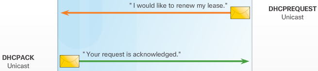

Lease Renewal

DHCP Request (DHCPREQUEST)

As shown in Figure 6, before the lease expires, the client sends a DHCPREQUEST message directly to the DHCPv4 server that originally offered the IPv4 address. If a DHCPACK is not received within a specified amount of time, the client broadcasts another DHCPREQUEST so that one of the other DHCPv4 servers can extend the lease.

DHCP Acknowledgment (DHCPACK)

On receiving the DHCPREQUEST message, the server verifies the lease information by returning a DHCPACK, as shown in Figure.

DHCPv4 Message Format
---------------------

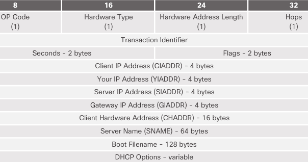

+ Operation (OP) Code - Specifies the general type of message. A value of 1 indicates a request message; a value of 2 is a reply message.
+ Hardware Type - Identifies the type of hardware used in the network. For example, 1 is Ethernet, 15 is Frame Relay, and 20 is a serial line. These are the same codes used in ARP messages.
+ Hardware Address Length - Specifies the length of the address.
+ Hops - Controls the forwarding of messages. Set to 0 by a client before transmitting a request.
+ Transaction Identifier - Used by the client to match the request with replies received from DHCPv4 servers.
+ Seconds - Identifies the number of seconds elapsed since a client began attempting to acquire or renew a lease. Used by DHCPv4 servers to prioritize replies when multiple client requests are outstanding.
+ Flags - Used by a client that does not know its IPv4 address when it sends a request. Only one of the 16 bits is used, which is the broadcast flag. A value of 1 in this field tells the DHCPv4 server or relay agent receiving the request that the reply should be sent as a broadcast.
+ Client IP Address - Used by a client during lease renewal when the address of the client is valid and usable, not during the process of acquiring an address. The client puts its own IPv4 address in this field if and only if it has a valid IPv4 address while in the bound state; otherwise, it sets the field to 0.
+ Your IP Address - Used by the server to assign an IPv4 address to the client.
+ Server IP Address - Used by the server to identify the address of the server that the client should use for the next step in the bootstrap process, which may or may not be the server sending this reply. The sending server always includes its own IPv4 address in a special field called the Server Identifier DHCPv4 option.
+ Gateway IP Address - Routes DHCPv4 messages when DHCPv4 relay agents are involved. The gateway address facilitates communications of DHCPv4 requests and replies between the client and a server that are on different subnets or networks.
+ Client Hardware Address - Specifies the physical layer of the client.
+ Server Name - Used by the server sending a DHCPOFFER or DHCPACK message. The server may optionally put its name in this field. This can be a simple text nickname or a DNS domain name, such as dhcpserver.netacad.net.
+ Boot Filename - Optionally used by a client to request a particular type of boot file in a DHCPDISCOVER message. Used by a server in a DHCPOFFER to fully specify a boot file directory and filename.
+ DHCP Options - Holds DHCP options, including several parameters required for basic DHCP operation. This field is variable in length. Both client and server may use this field.

DHCPv4 Discover Message
-----------------------

.. image:: _static/Ch8_dhcp4_discover_message.png

As shown in Figure 1, the client IPv4 address (CIADDR), default gateway address (GIADDR), and subnet mask are all marked to indicate that the address 0.0.0.0 is used.

Note: Unknown information is sent as 0.0.0.0.

When the DHCPv4 server receives the DHCPDISCOVER message, it responds with a DHCPOFFER message. This message contains initial configuration information for the client, including the IPv4 address that the server offers, the subnet mask, the lease duration, and the IPv4 address of the DHCPv4 server making the offer.

The DHCPOFFER message can be configured to include other information, such as the lease renewal time and DNS address.

.. image:: _static/Ch8_dhcp4_offer_message.png

As shown now, the DHCP server responds to the DHCPDISCOVER by assigning values to the CIADDR and subnet mask. The frame is constructed using the client hardware address (CHADDR) and sent to the requesting client.

The client and server send acknowledgment messages, and the process is complete.

DHCPv4 basic server configuration
---------------------------------

.. code::
   
   step 1 excluding addresses
   --------------------------
   R1(config)#ip dhcp excluded-address 192.168.10.1 192.168.10.9
   R1(config)#ip dhcp excluded-address 192.168.10.254
   
   step 2 configuring a pool
   -------------------------
   R1(config)#ip dhcp pool LAN-POOL-1
   R1(dhcp-config)#

   step 3 configuring specific tasks
   ---------------------------------
   R1(dhcp-config)# network network-number [mask | /prefix-length]
   R1(dhcp-config)# network 192.168.10.0 255.255.255.0

   R1(dhcp-config)# default-router address address2...address8
   R1(dhcp-config)# default-router 192.168.10.1

   R1(dhcp-config)# dns-server address address2...address8
   R1(dhcp-config)# dns-server 192.168.11.5

   R1(dhcp-config)# domain-name example.com
   
   R1(dhcp-config)# lease {days [hours] [minutes] | infinite}
   R1(dhcp-config)# 

   optional
   --------
   R1(dhcp-config)# netbios-name-server 192.168.x.x addr2..addr8

disable DHCPv4 with the ``no service dhcp`` global config mode command

Verifying DHCPv4
----------------

``show running-config | section dhcp``

.. code::

   Router> show ip dhcp server statistics
   --------------------------------------
   Memory usage          40392
   Address pools         3
   Database agents       1
   Automatic bindings    190
   Manual bindings       1
   Expired bindings      3
   Malformed messages    0
   
   Message               Received
   BOOTREQUEST           12
   DHCPDISCOVER          200
   DHCPREQUEST           178
   DHCPDECLINE           0
   DHCPRELEASE           0
   DHCPINFORM            0
   
   Message               Sent
   BOOTREPLY             12
   DHCPOFFER             190
   DHCPACK               172
   DHCPNAK               6
   Release

   Router#show ip dhcp binding
   ---------------------------
   Bindings from all pools not associated with VRF:
   IP address   Client-ID/    Lease expiration     Type
                Hardware address/
                User name
   10.0.2.1 0100.1e68.ffd3.5f Oct 12 2016 10:08 PM Automatic

   Router#show ip dhcp pool
   ------------------------
   Pool dmz :
   Utilization mark (high/low) : 100 / 0
   Subnet size (first/next) : 0 / 0
   Total addresses : 254
   Leased addresses : 1
   Pending event : none
   1 subnet is currently in the pool :
   Current index IP address range Leased addresses
   10.0.2.2 10.0.2.1 - 10.0.2.254 1

   
show dhcp lease information on debian

.. code::

   patrick@debian:~[brunswyck:docu.git master|!?]$ cat /var/lib/dhcp/dhclient.leases
   lease {
     interface "eno2";
     fixed-address 192.168.111.116;
     option subnet-mask 255.255.255.0;
     option routers 192.168.110.1;
     option dhcp-lease-time 7200;
     option dhcp-message-type 5;
     option domain-name-servers 208.67.222.222,208.67.220.220,8.8.8.8;
     option dhcp-server-identifier 192.168.111.1;
     option domain-name "home";
     renew 3 2017/09/13 08:33:03;
     rebind 3 2017/09/13 09:23:03;
     expire 3 2017/09/13 09:38:03;
   }

Configure DHCPv4 relay
----------------------

.. code::

   R1(config)# interface g0/0
   R1(config-if)# ip helper-address 192.168.11.6
   confirm with
   R1# show ip interface g0/0
   ...Helper address is 192.168.11.6...

DHCPv4 Exercises
----------------

8.1.2.3 lab - configuring basic dhcpv4
^^^^^^^^^^^^^^^^^^^^^^^^^^^^^^^^^^^^^^

.. image:: _static/Ch8_lab_8.1.2.3_cfg_dhcpv4.png

Required Resources
+ 3 Routers (Cisco 1941 with Cisco IOS Release 15.2(4)M3 universal image or comparable)
+ 2 Switches (Cisco 2960 with Cisco IOS Release 15.0(2) lanbasek9 image or comparable)

R1 = relay agent

R2 = DHCPv4 server

you will configure a DHCP address pool for each of the R1 LANs. Use the pool name R1G0for the G0/0 LAN and R1G1for the G0/1 LAN.

You will also configure the addresses to be excluded from the address pools. Best practice dictates that excluded addresses be configured first, to guarantee that they are not accidentally leased to other devices.

Exclude the first 9 addresses in each R1 LAN starting with .1. All other addresses should be available in the DHCP address pool. Make sure that each DHCP address pool includes a default gateway, the domain ccna-lab.com, a DNS server (209.165.200.225), and a lease time of 2 days.

On the lines below, write the commands necessary for configuring DHCP services on router R2, including the DHCP-excluded addresses and the DHCP address pools.

 +--------+--------------+-----------------+-----------------+-----------------+
 | Device | Interface    | IP Address      | Subnet Mask     | Default Gateway |
 +========+==============+=================+=================+=================+
 | R1     | G0/0         | 192.168.0.1     | 255.255.255.0   | N/A             |
 +--------+--------------+-----------------+-----------------+-----------------+
 |        | G0/1         | 192.168.1.1     | 255.255.255.0   | N/A             |
 +--------+--------------+-----------------+-----------------+-----------------+
 |        | S0/0/0 (DCE) | 192.168.2.253   | 255.255.255.252 | N/A             |
 +--------+--------------+-----------------+-----------------+-----------------+
 | R2     | S0/0/0       | 192.168.2.254   | 255.255.255.252 | N/A             |
 +--------+--------------+-----------------+-----------------+-----------------+
 |        | S0/0/1 (DCE) | 209.165.200.226 | 255.255.255.224 | N/A             |
 +--------+--------------+-----------------+-----------------+-----------------+
 | ISP    | S0/0/1       | 209.165.200.225 | 255.255.255.224 | N/A             |
 +--------+--------------+-----------------+-----------------+-----------------+
 | PC-A   | NIC          | DHCP            | DHCP            | DHCP            |
 +--------+--------------+-----------------+-----------------+-----------------+
 | PC-B   | NIC          | DHCP            | DHCP            | DHCP            |
 +--------+--------------+-----------------+-----------------+-----------------+

.. code::
   
   basic config
   ------------
   no ip domain-lookup 
   service password-encryption 
   enable secret class 
   banner motd # 
   Unauthorized access is strictly prohibited. # 
   line con 0 
   password cisco 
   login 
   logging synchronous 
   line vty 0 4 
   password cisco 
   login
 
.. code::

   Configure RIPv2 for R1
   ----------------------
   R1(config)# router rip
   R1(config-router)# version 2
   R1(config-router)# network 192.168.0.0
   R1(config-router)# network 192.168.1.0
   R1(config-router)# network 192.168.2.252
   R1(config-router)# no auto-summary
   
   Configure RIPv2 and a default route to the ISP on R2
   ----------------------------------------------------
   R2(config)# router rip
   R2(config-router)# version 2
   R2(config-router)# network 192.168.2.252
   R2(config-router)# default-information originate
   R2(config-router)# exit 
   R2(config)# ip route 0.0.0.0 0.0.0.0 209.165.200.225

   Configure  a summary static route on ISP to reach the networks on the R1 and R2 routers
   ---------------------------------------------------------------------------------------
   ISP(config)# ip route 192.168.0.0 255.255.252.0 209.165.200.226    

   Router R1 as a DHCP relay agent
   -------------------------------
   R1(config)# interface g0/0
   R1(config-if)# ip helper-address 192.168.2.254 
   R1(config-if)# exit 
   R1(config-if)# interface g0/1
   R1(config-if)# ip helper-address 192.168.2.254
   
   Router R2
   ---------
   R2(config)# ip dhcp excluded-address 192.168.0.1 192.168.0.9
   R2(config)# ip dhcp excluded-address 192.168.1.1 192.168.1.9
   R2(config)# ip dhcp pool R1G1
   R2(dhcp-config)# network 192.168.1.0 255.255.255.0
   R2(dhcp-config)# default-router 192.168.1.1
   R2(dhcp-config)# dns-server 209.165.200.225
   R2(dhcp-config)# domain-name ccna-lab.com
   R2(dhcp-config)# lease 2
   R2(dhcp-config)# exit 
   R2(config)# ip dhcp pool R1G0
   R2(dhcp-config)# network 192.168.0.0 255.255.255.0
   R2(dhcp-config)# default-router 192.168.0.1
   R2(dhcp-config)# dns-server 209.165.200.225
   R2(dhcp-config)# domain-name ccna-lab.com
   R2(dhcp-config)# lease 2

verify with ``show ip dhcp binding`` & ``show ip dhcp server statistics`` & ``show run | section dhcp``

8.1.2.5 lab - basic dhcpv4 on a switch
^^^^^^^^^^^^^^^^^^^^^^^^^^^^^^^^^^^^^^

.. image:: _static/Ch8_lab_8.1.2.5_cfg_dhcpv4_on_switch.png

Required Resources
+ Router (Cisco 1941 with Cisco IOS Release 15.2(4)M3 universal image or comparable)
+ 2 Switches (Cisco 2960 with Cisco IOS Release 15.0(2) lanbasek9 image or comparable)

+--------+-----------+-----------------+-----------------+
| Device | Interface | IP Address      | Subnet Mask     |
+========+===========+=================+=================+
| R1     | G0/1      | 192.168.1.10    | 255.255.255.0   |
+--------+-----------+-----------------+-----------------+
|        | Lo0       | 209.165.200.225 | 255.255.255.224 |
+--------+-----------+-----------------+-----------------+
| S1     | VLAN 1    | 192.168.1.1     | 255.255.255.0   |
+--------+-----------+-----------------+-----------------+
|        | VLAN 2    | 192.168.2.1     | 255.255.255.0   |
+--------+-----------+-----------------+-----------------+

display SDM preference on S1

.. code::

   S1#show sdm prefer
   The current template is "default" template. 
   The selected template optimizes the resources in 
   the switch to support this level of features for 
   0 routed interfaces and 255 VLANs.  
     number of unicast mac addresses:                  8K 
     number of IPv4 IGMP groups:                       0.25K 
     number of IPv4/MAC qos aces:                      0.125k 
     number of IPv4/MAC security aces:                 0.375k

change SDM preference to lanbase-routing

.. code::

   S1(config)# sdm prefer lanbase-routing
   Changes to the running SDM preferences have been stored, but cannot take effect  
   until the next reload. 
   Use 'show sdm prefer' to see what SDM preference is currently active.

   S1# reload
   S1# show sdm prefer

.. note:: The new template will be used after reboot even if the running configuration has not been saved. To save the running configuration, answer yes after reload command.

Configure DHCP for VLAN 1
~~~~~~~~~~~~~~~~~~~~~~~~~

a. Exclude the first 10 valid host addresses from network 192.168.1.0/24
b. Create a DHCP pool named DHCP1
c. Assign the network 192.168.1.0/24 for available addresses
d. Assign the default gateway as 192.168.1.1
e. Assign the DNS server as 192.168.1.9
f. Assign a lease time of 3 day
g. Save the running configuration to the startup configuration file

Configure DHCPv4 for Multiple VLANs
~~~~~~~~~~~~~~~~~~~~~~~~~~~~~~~~~~~

assign PC-A to a port accessing VLAN 2, configure DHCPv4 for VLAN 2, renew the IP configuration of PC-A to validate DHCPv4, and verify connectivity within the VLAN.

Assign a port to VLAN 2. Place port F0/6 into VLAN 2

a. Exclude the first 10 valid host addresses from network 192.168.2.0
b. Create a DHCP pool named DHCP2
c. Assign the network 192.168.2.0/24 for available addresses
d. Assign the default gateway as 192.168.2.1
e. Assign the DNS server as 192.168.2.9
f. Assign a lease time of 3 days
g. Save the running configuration to the startup configuration file

Enable IP routing on S1 ``S1(config)# ip routing``
Verify inter-VLAN connectivity

Assign static routes
~~~~~~~~~~~~~~~~~~~~

a. On S1, create a default static route to R1
b. On R1, create a static route to VLAN 2
c. View the routing table information for S1.How is the default static route represented?
d. View the routing table information for R1.How is the default static route represented?
e. From PC-A, is it possible to ping R1? From PC-A, is it possible to ping Lo0? 

Configure DHCPv4

.. code::

   S1(config)# ip dhcp excluded-address 192.168.1.1 192.168.1.10
   S1(config)# ip dhcp pool DHCP1
   S1(dhcp-config)# network 192.168.1.0 255.255.255.0 
   S1(dhcp-config)# default-router 192.168.1.1
   S1(dhcp-config)# dns-server 192.168.1.9
   S1(dhcp-config)# lease 3 

Configure DHCPv4 for Multiple VLANs

.. code::

   S1(config)# interface f0/6
   S1(config-if)# switchport access vlan 2
   S1(config)# ip dhcp excluded-address 192.168.2.1 192.168.2.10
   S1(config)# ip dhcp pool DHCP2
   S1(dhcp-config)# network 192.168.2.0 255.255.255.0
   S1(dhcp-config)# default-router 192.168.2.1
   S1(dhcp-config)# dns-server 192.168.2.9
   S1(dhcp-config)# lease 3

Enable IP Routing

.. code::

   S1(config)# ip routing
   S1(config)# ip route 0.0.0.0 0.0.0.0 192.168.1.10
   R1(config)# ip route 192.168.2.0 255.255.255.0 g0/1

8.1.3.3 lab - configuring dhcp ios pt
^^^^^^^^^^^^^^^^^^^^^^^^^^^^^^^^^^^^^

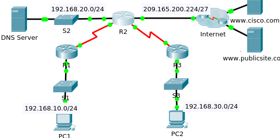

+------------+-----------+----------------+-----------------+-----------------+
| Device     | Interface | IPv4 Address   | Subnet Mask     | Default Gateway |
+============+===========+================+=================+=================+
| R1         | G0/0      | 192.168.10.1   | 255.255.255.0   | N/A             |
+------------+-----------+----------------+-----------------+-----------------+
|            | S0/0/0    | 10.1.1.1       | 255.255.255.252 | N/A             |
+------------+-----------+----------------+-----------------+-----------------+
| R2         | G0/0      | 192.168.20.1   | 255.255.255.0   | N/A             |
+------------+-----------+----------------+-----------------+-----------------+
|            | G0/1      | DHCP Assigned  | DHCP Assigned   | N/A             |
+------------+-----------+----------------+-----------------+-----------------+
|            | S0/0/0    | 10.1.1.2       | 255.255.255.252 | N/A             |
+------------+-----------+----------------+-----------------+-----------------+
|            | S0/0/1    | 10.2.2.2       | 255.255.255.252 | N/A             |
+------------+-----------+----------------+-----------------+-----------------+
| R3         | G0/0      | 192.168.30.1   | 255.255.255.0   | N/A             |
+------------+-----------+----------------+-----------------+-----------------+
|            | S0/0/1    | 10.2.2.1       | 255.255.255.0   | N/A             |
+------------+-----------+----------------+-----------------+-----------------+
| PC1        | NIC       | DHCP Assigned  | DHCP Assigned   | DHCP Assigned   |
+------------+-----------+----------------+-----------------+-----------------+
| PC2        | NIC       | DHCP Assigned  | DHCP Assigned   | DHCP Assigned   |
+------------+-----------+----------------+-----------------+-----------------+
| DNS Server | NIC       | 192.168.20.254 | 255.255.255.0   | 192.168.20.1    |
+------------+-----------+----------------+-----------------+-----------------+

+ Configure R2 to exclude first 10 addresses from R1 and R3 LANs. All others should be available in the DHCP address pool

  .. code::

     R2>enable
     R2#conf t
     R2(config)#ip dhcp ?
      excluded-address  Prevent DHCP from assigning certain addresses
      pool              Configure DHCP address pools
      relay             DHCP relay agent parameters
     R2(config)#ip dhcp excluded-address 192.168.10.1 192.168.10.10
     R2(config)#ip dhcp excluded-address 192.168.30.1 192.168.30.10
     R2(config)#ip dhcp pool R1-LAN
     R2(dhcp-config)#network 192.168.10.0 255.255.255.0
     R2(dhcp-config)#?
      default-router  Default routers
      dns-server      Set name server
      exit            Exit from DHCP pool configuration mode
      network         Network number and mask
      no              Negate a command or set its defaults
      option          Raw DHCP options
     R2(dhcp-config)#default-router 192.168.10.1
     R2(dhcp-config)#dns-server 192.168.20.254
     R2(config)#ip dhcp pool R3-LAN
     R2(dhcp-config)#network 192.168.30.0 255.255.255.0
     R2(dhcp-config)#defautl
     R2(dhcp-config)#default-router 192.168.30.1
     R2(dhcp-config)#dns-server 192.168.20.254

+ Set PC1 and PC2 to receive IP addressing information from DHCP.
+ Configure R1 and R3 as a DHCP relay agent.
  Okay so lets check if R2 can reach these LANs first:

  .. code::
     
     check interfaces
     ----------------
     R2#show ip int brief
     Interface              IP-Address      OK? Method Status                Protocol 
     GigabitEthernet0/0     192.168.20.1    YES manual up                    up 
     GigabitEthernet0/1     unassigned      YES unset  administratively down down 
     Serial0/0/0            10.1.1.2        YES manual up                    up 
     Serial0/0/1            10.2.2.2        YES manual up                    up 
     Serial0/1/0            unassigned      YES unset  down                  down 
     Serial0/1/1            unassigned      YES unset  down                  down 
     Vlan1                  unassigned      YES unset  administratively down down

     G0/1 is down, lets give it a dhcp address from ISP
     --------------------------------------------------
     R2#conf t
     R2(config)#interface gigabitEthernet 0/1
     R2(config-if)#ip address dhcp
     R2(config-if)#no shutdown
     R2(config-if)#
     %LINK-5-CHANGED: Interface GigabitEthernet0/1, changed state to up
     %LINEPROTO-5-UPDOWN: Line protocol on Interface GigabitEthernet0/1, changed state to up
     R2#
     %DHCP-6-ADDRESS_ASSIGN: Interface GigabitEthernet0/1 assigned DHCP address 209.165.200.231, mask 255.255.255.224, hostname R2
     %DUAL-5-NBRCHANGE: IP-EIGRP 1: Neighbor 209.165.200.225 (GigabitEthernet0/1) is up: new adjacency
     
     Now lets check R1 and R2 routes to LAN are known to R2
     ------------------------------------------------------
     R2#show ip route
     Codes: L - local, C - connected, S - static, R - RIP, M - mobile, B - BGP
            D - EIGRP, EX - EIGRP external, O - OSPF, IA - OSPF inter area
            N1 - OSPF NSSA external type 1, N2 - OSPF NSSA external type 2
            E1 - OSPF external type 1, E2 - OSPF external type 2, E - EGP
            i - IS-IS, L1 - IS-IS level-1, L2 - IS-IS level-2, ia - IS-IS inter area
            * - candidate default, U - per-user static route, o - ODR
            P - periodic downloaded static route
     
     Gateway of last resort is not set
     
          10.0.0.0/8 is variably subnetted, 4 subnets, 2 masks
     C       10.1.1.0/30 is directly connected, Serial0/0/0
     L       10.1.1.2/32 is directly connected, Serial0/0/0
     C       10.2.2.0/30 is directly connected, Serial0/0/1
     L       10.2.2.2/32 is directly connected, Serial0/0/1
     D    192.168.10.0/24 [90/2170112] via 10.1.1.1, 00:59:31, Serial0/0/0
          192.168.20.0/24 is variably subnetted, 2 subnets, 2 masks
     C       192.168.20.0/24 is directly connected, GigabitEthernet0/0
     L       192.168.20.1/32 is directly connected, GigabitEthernet0/0
     D    192.168.30.0/24 [90/2170112] via 10.2.2.1, 00:59:32, Serial0/0/1
          209.165.200.0/24 is variably subnetted, 2 subnets, 2 masks
     C       209.165.200.224/27 is directly connected, GigabitEthernet0/1
     L       209.165.200.231/32 is directly connected, GigabitEthernet0/1
          209.165.202.0/27 is subnetted, 1 subnets
     D       209.165.202.128/27 [90/3072] via 209.165.200.225, 00:01:10, GigabitEthernet0/1

     Looking good, configure R1 and R3 as dhcpv4 relay agents
     --------------------------------------------------------
     R1(config)#interface gigabitEthernet 0/0
     R1(config-if)#ip helper-address 10.1.1.2
     
     R3(config)#do show ip int brief | include 192.168.30
     GigabitEthernet0/0     192.168.30.1    YES manual up                    up 
     R3(config)#interface GigabitEthernet0/0
     R3(config-if)#ip helper-address 10.2.2.2

+ Verify DHCP

  .. code::

     R2#show ip dhcp binding
     ----------------------- 
     IP address       Client-ID/              Lease expiration        Type
                      Hardware address
     192.168.10.11    0002.4AA5.1470           --                     Automatic
     192.168.30.11    0004.9A97.2535           --                     Automatic
     R2#
 
     R2#show ip dhcp pool
     --------------------
     Pool R1-LAN :
      Utilization mark (high/low)    : 100 / 0
      Subnet size (first/next)       : 0 / 0 
      Total addresses                : 254
      Leased addresses               : 1
      Excluded addresses             : 2
      Pending event                  : none
     
      1 subnet is currently in the pool
      Current index        IP address range                    Leased/Excluded/Total
      192.168.10.1         192.168.10.1     - 192.168.10.254    1    / 2     / 254
     
     Pool R3-LAN :
      Utilization mark (high/low)    : 100 / 0
      Subnet size (first/next)       : 0 / 0 
      Total addresses                : 254
      Leased addresses               : 1
      Excluded addresses             : 2
      Pending event                  : none
     
      1 subnet is currently in the pool
      Current index        IP address range                    Leased/Excluded/Total
      192.168.30.1         192.168.30.1     - 192.168.30.254    1    / 2     / 254
     
Configuring a Router as DHCP Client
-----------------------------------

To configure an Ethernet interface as a DHCP client, use the ``ip address dhcp`` interface configuration mode command.

.. code::

   SOHO(config)# interface g0/1
   SOHO(config-if)# ip address dhcp
   SOHO(config-if)# no shutdown
   SOHO(config-if)#
    %DHCP-6-ADDRESS_ASSIGN: Interface GigabitEthernet0/1 assigned DHCP address 209.165.201.12, mask 255.255.255.224, hostname SOHO
   SOHO(config-if)# end
   SOHO# show ip interface g0/1
   GigabitEthernet0/1 is up, line protocol is up
     Internet address is 209.165.201.12/27
     Broadcast address is 255.255.255.255
     Address determined by DHCP

Troubleshooting DHCP
--------------------

DHCP Service
^^^^^^^^^^^^

Let’s verify by checking if the interfaces are up and running:

.. code::

   DHCPClient#show ip interface brief 
   Interface                  IP-Address      OK? Method Status                Protocol
   FastEthernet0/0            unassigned      YES DHCP   up                   up  

First I’ll verify if the interface on the DHCP client is up/up and that it has been configured for DHCP, this is indeed the case. Let’s check the DHCP server:

.. code::

   DHCPServer#show ip interface brief 
   Interface                  IP-Address      OK? Method Status                Protocol
   FastEthernet0/0            192.168.12.2    YES manual up                   up

I also want to make sure the interface on the DHCP server is up/up and that it has an IP address. This looks fine to me. Let’s start by looking at the DHCP client:

.. code::

   DHCPClient#debug dhcp detail
   DHCP client activity debugging is on (detailed)

I want to be absolutely sure that the client is not the issue I can enable debug dhcp detail to see if the DHCP client is sending DHCP discover messages. Here’s what we see:

.. code::

   DHCPClient# Hostname: DHCPClient
   DHCP: new entry. add to queue, interface FastEthernet0/0
   'DHCP: SDiscover attempt # 1 for entry:'
   Temp IP addr: 0.0.0.0  for peer on Interface: FastEthernet0/0
   Temp  sub net mask: 0.0.0.0
   DHCP Lease server: 0.0.0.0, state: 1 Selecting
   DHCP transaction id: 289
   Lease: 0 secs,  Renewal: 0 secs,  Rebind: 0 secs
   Next timer fires after: 00:00:04
   Retry count: 1   Client-ID: cisco-cc00.1ab0.0000-Fa0/0
   Client-ID hex dump: 636973636F2D636330302E316162302E
                       303030302D4661302F30

You’ll see some debug output like above. This proves that my DHCP client is sending DHCP Discover messages; the client doesn’t seem to be the problem here. Let’s check the DHCP server:

.. code::

   DHCPServer#show ip dhcp pool 
   
   Pool MYPOOL :
    Utilization mark (high/low)    : 100 / 0
    Subnet size (first/next)       : 0 / 0 
    Total addresses                : 254
    Leased addresses               : 0
    Pending event                  : none
    1 subnet is currently in the pool :
    Current index        IP address range                    Leased addresses
    192.168.12.1         192.168.12.1     - 192.168.12.254    0

We’ll use the show ip dhcp pool command to check if there is a DHCP pool. You can see that we do have a DHCP pool called “MYPOOL” and it’s configured for the 192.168.12.0 /24 subnet. This is looking fine to me. Let’s find out if the DHCP server is doing anything:

.. code::

   DHCPServer#show ip dhcp server statistics 
   Memory usage         8754
   Address pools        1
   Database agents      0
   Automatic bindings   0
   Manual bindings      0
   Expired bindings     0
   Malformed messages   0
   Secure arp entries   0
   
   Message              Received
   BOOTREQUEST          0
   DHCPDISCOVER         0
   DHCPREQUEST          0
   DHCPDECLINE          0
   DHCPRELEASE          0
   DHCPINFORM           0
   
   Message              Sent
   BOOTREPLY            0
   DHCPOFFER            0
   DHCPACK              0
   DHCPNAK              0

We can use show ip dhcp server statistics to see if the DHCP server is doing anything. You can see that it’s not doing anything…what could this mean? Take a look below:

.. code::

   DHCPServer#show ip sockets 
   Proto    Remote      Port      Local       Port  In Out Stat TTY OutputIF

This is a command you probably don’t see every day. Show ip sockets shows us on which ports the router is listening. As you can see it’s not listening on any ports…if I don’t see port 67 here (DHCP) it means that the DHCP service has been disabled. Let’s enable it:

``DHCPServer(config)#service dhcp``

Let’s enable the service. Take a look at the sockets again:

.. code::

   DHCPServer#show ip sockets 
   Proto    Remote      Port      Local       Port  In Out Stat TTY OutputIF
    17 0.0.0.0             0 192.168.12.2       67   0   0 2211   0

That’s better! Now we see the router is listening on port 67, this means the DHCP service is active. After a few seconds, the client will receive an IP address:

.. code::

   DHCPClient# %DHCP-6-ADDRESS_ASSIGN: Interface FastEthernet0/0 assigned DHCP address 192.168.12.1, mask 255.255.255.0, hostname DHCPClient
   
As soon as the DHCP service is running you can see the client receives an IP address through DHCP…problem solved!

**Lesson learned: If everything is OK, make sure the DHCP service is running.**

