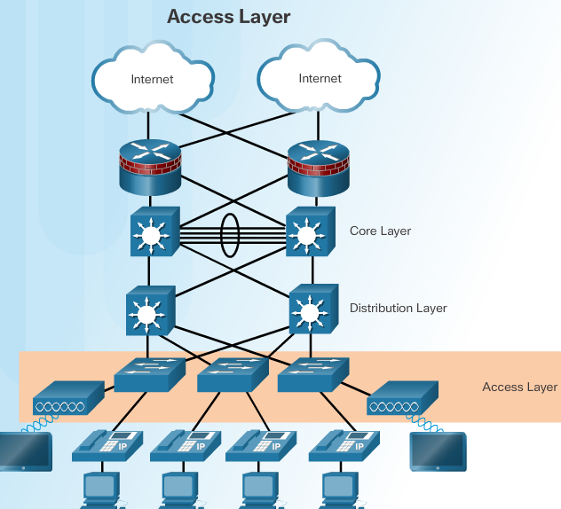
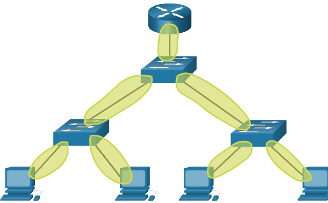
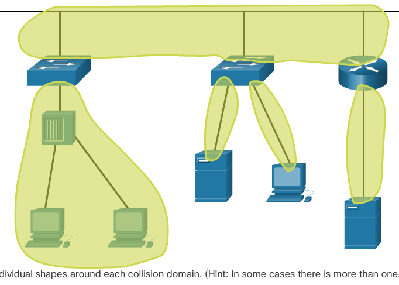

.. include:: ../../../_static/global.rst

switched networks
=================

examination of the flow of traffic in a modern network. It examines some of the current network design models and the way LAN switches build forwarding tables and use the MAC address information to efficiently switch data between hosts. 

elements of a converged network
-------------------------------

* Call control - Telephone call processing, caller ID, call transfer, hold, and conference
* Voice messaging - Voicemail
* Mobility - Receive important calls wherever you are
* Automated attendant - Serve customers faster by routing calls directly to the right department or individual

Hierarchy in the Borderless Switched Network
--------------------------------------------

* Hierarchical - Facilitates understanding the role of each device at every tier, simplifies deployment, operation, and management, and reduces fault domains at every tier
* Modularity - Allows seamless network expansion and integrated service enablement on an on-demand basis
* Resiliency - Satisfies user expectations for keeping the network always on
* Flexibility - Allows intelligent traffic load sharing by using all network resources

The three critical layers within these tiered designs are the **access, distribution, and core layers**.

Access, Distribution, and Core Layers

Access Layer
------------

The access layer represents the network edge, where traffic enters or exits the campus network. Traditionally, the primary function of an access layer switch is to provide network access to the user. Access layer switches connect to distribution layer switches, which implement network foundation technologies such as routing, quality of service, and security.

To meet network application and end-user demand, the next-generation switching platforms now provide more converged, integrated, and intelligent services to various types of endpoints at the network edge. Building intelligence into access layer switches allows applications to operate on the network more efficiently and securely.

Distribution Layer
------------------

The distribution layer interfaces between the access layer and the core layer to provide many important functions, including:

   * Aggregating large-scale wiring closet networks

   * Aggregating Layer 2 broadcast domains and Layer 3 routing boundaries

   * Providing intelligent switching, routing, and network access policy functions to access the rest of the network

   * Providing high availability through redundant distribution layer switches to the end-user and equal cost paths to the core

   * Providing differentiated services to various classes of service applications at the edge of the network

Core Layer
----------

The core layer is the network backbone. It connects several layers of the campus network. The core layer serves as the aggregator for all of the other campus blocks and ties the campus together with the rest of the network. The primary purpose of the core layer is to provide fault isolation and high-speed backbone connectivity.

Figure 1 shows a three-tier campus network design for organizations where the access, distribution, and core are each separate layers. To build a simplified, scalable, cost-effective, and efficient physical cable layout design, the recommendation is to build an extended-star physical network topology from a centralized building location to all other buildings on the same campus.

.. image:: ../../../_static/img/corelayer1.png

In some cases where extensive physical or network scalability does not exist, maintaining separate distribution and core layers is not required. In smaller campus locations where there are fewer users accessing the network or in campus sites consisting of a single building, separate core and distribution layers may not be needed. In this scenario, the recommendation is the alternate two-tier campus network design, also known as the collapsed core network design.

Figure 2 shows a two-tier campus network design example for an enterprise campus where the distribution and core layers are collapsed into a single layer.
.. image:: ../../../_static/img/corelayercollapsed.png

Borderless switched networks

.. image:: ../../../_static/img/borderlessswitchednetworks.png

considerations switch
---------------------
Fixed - Modular - Stackable

*  Cost: The cost of a switch will depend on the number and speed of the interfaces, supported features, and expansion capability.
*  Port Density: Network switches must support the appropriate number of devices on the network.
*  Power: It is now common to power access points, IP phones, and even compact switches using Power over Ethernet (PoE). In addition to PoE considerations, some chassis-based switches support redundant power supplies.
*  Reliability: The switch should provide continuous access to the network.
*  Port Speed: The speed of the network connection is of primary concern to end users.
*  Frame Buffers: The ability of the switch to store frames is important in a network where there might be congested ports to servers or other areas of the network.
*  Scalability: The number of users on a network typically grows over time; therefore, the switch should provide the opportunity for growth.

store n forward switching
-------------------------

Store-and-forward switching has two primary characteristics that distinguish it from cut-through: error checking and automatic buffering.

A store-and-forward switch drops frames that do not pass the FCS check; therefore, it does not forward invalid frames. By contrast, a cut-through switch may forward invalid frames because no FCS check is performed.

Cut-Through Switching
---------------------

start forwarding a frame earlier than store-and-forward switching. There are two primary characteristics of cut-through switching: rapid frame forwarding and fragment free.

Rapid Frame Forwarding
^^^^^^^^^^^^^^^^^^^^^^
With today’s MAC controllers and ASICs, a switch using the cut-through method can quickly decide whether it needs to examine a larger portion of a frame’s headers for additional filtering purposes. For example, the switch can analyze past the first 14 bytes (the source MAC address, destination MAC, and the EtherType fields), and examine an additional 40 bytes in order to perform more sophisticated functions relative to IPv4 Layers 3 and 4.

Fragment Free Forwarding
^^^^^^^^^^^^^^^^^^^^^^^^
Fragment free switching is a modified form of cut-through switching in which the switch waits for the collision window (64 bytes) to pass before forwarding the frame. This means each frame will be checked into the data field to make sure no fragmentation has occurred. Fragment free switching provides better error checking than cut-through, with practically no increase in latency. 

Collision domains
-----------------

QnA Ch4
-------

Which service is provided by an automated attendant feature on a converged network?
* Call routing

* The automated attendant feature increases the speed of voice services by routing calls directly to individuals or departments. Point-to-point video and video conferencing describe video services on a converged network. An IT management interface is part of a converged network solution that allows IT personnel to facilitate moves, adds, and changes through a centralized application.

Stackable switches provide fault tolerance and bandwidth availability by using special cables between switches and are less costly to implement than modular switches.

.. note:: What is a basic function of the Cisco Borderless Architecture distribution layer? Aggregating Layer 3 routing boundaries

Match the borderless switched network guideline description to the principle.

.. image:: ../../../_static/img/borderlessswitchednetworks_matchup.png

Place the options in the following order:

flexibility:
 allows intelligent traffic load sharing by using all network resources

hierarchical:
 facilitates understanding the role of each device at every tier, simplifies deployment, operation, management, and reduces fault domains at every tier

modularity:
 allows seamless network expansion and integrated service enablement on an on-demand basis

resiliency:
 satisfies user expectations for keeping the network always on

