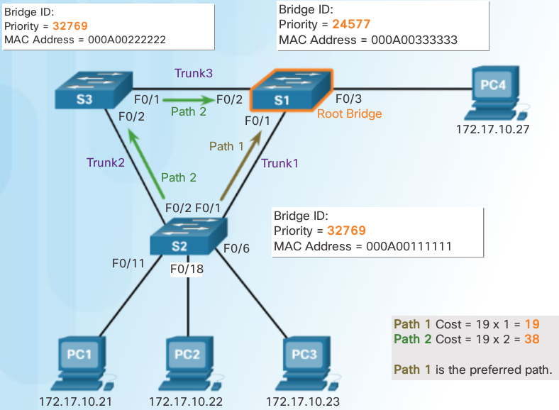
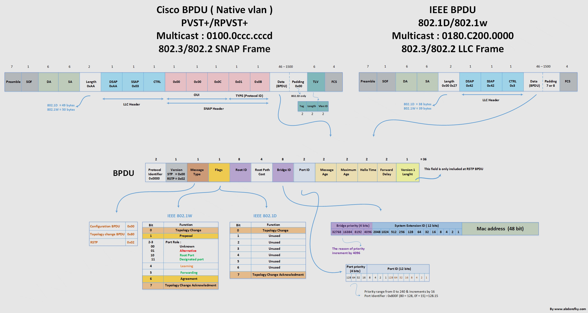
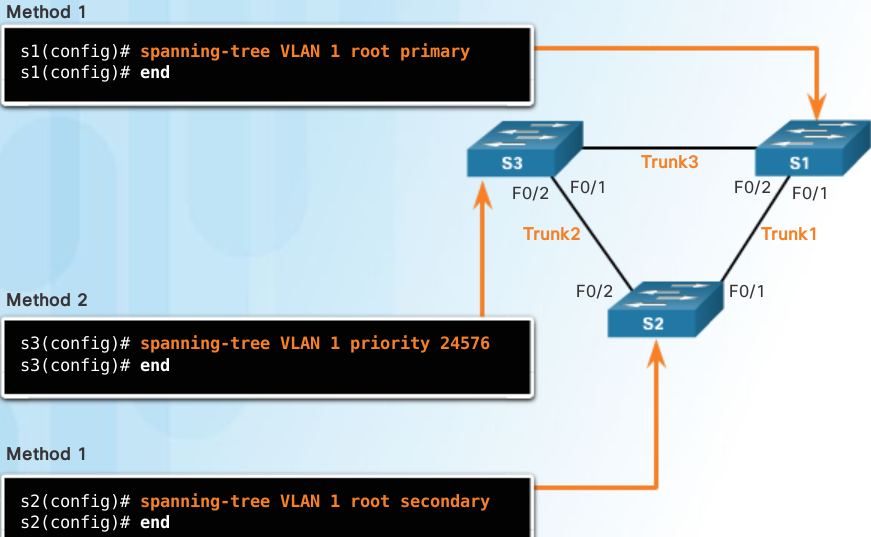

..
    # with overline, for parts
    * with overline, for chapters
    =, for sections
    -, for subsections
    ^, for subsubsections
    “, for paragraphs

Best Paths to Root Bridge
=========================

example

the internal root path cost from S2 to the root bridge S1 over path 1 is 19 (based on the IEEE-specified individual port cost) while the internal root path cost over path 2 is 38. Because path 1 has a lower overall path cost to the root bridge, it is the preferred path. STP configures the redundant path to be blocked, which prevents a loop from occurring.

To verify the port and internal root path cost to the root bridge, enter the show spanning-tree command

.. code:: 

   S2(config)# interface f0/1
   S2(config-if)# spanning-tree cost 25
   S2(config-if# end
   S2#
   
   S2# show spanning-tree
   			
   VLAN001 							
      Spanning tree enabled protocol ieee 
      Root ID    Priority  24577 
   	      Address      000A.0033.3333 
   	      Cost         19 
   	      Port         1 
   	      Hello Time   2 sec Max Age 20 sec Forward Delay 15 sec 
   		  
      Bridge ID  Priority      32769  (priority 32768 sys-id-ext 1)      
                 Address 000A.0011.1111 
   	      Hello time 2 sec Max Age 20 sec Forward Delay 15 sec 
   	      Aging Time 300 
   		  
   Interface    Role   Sts  Cost    Prio.Nbr  Type 
   -----------  -----  ---- -----   --------- ----------------- 
   F0/1 	     Root   FWD   19  	  128.1     Edge P2p 
   F0/2         Desg   FWD   19  	  128.2     Edge P2p

Port Role Decisions
-------------------

.. note:: Designated ports are configured for all LAN segments. When two switches are connected to the same LAN segment, and root ports have already been defined, the two switches have to decide which port to configure as a designated port and which port remains the alternate port.

1. lowest path cost to root bridge
2. lowest BID when port cost are equal

.. image:: ../../../_static/img/3_stp_port_role_decisions.png

Determine designated n alternate ports
--------------------------------------

.. image:: ../../../_static/img/3_stp_designated_and_alternate.png

PROTOCOLS
=========

802.1D-1998
 The legacy standard for bridging and STP.

CST
 Assumes one spanning-tree instance for the entire bridged network, regardless of the number of VLANs.

PVST+
 This is a Cisco enhancement of STP that provides a separate 802.1D spanning tree instance for each VLAN configured in the network. The separate instance supports PortFast, UplinkFast, BackboneFast, BPDU guard, BPDU filter, root guard, and loop guard.

802.1D-2004
 This is an updated version of the STP standard, incorporating IEEE 802.1w

Rapid Spanning Tree Protocol (RSTP) or IEEE 802.1w 
 This is an evolution of STP that provides faster convergence than STP

Rapid PVST+ 
 This is a Cisco enhancement of RSTP that uses PVST+. Rapid PVST+ provides a separate instance of 802.1w per VLAN. Each separate instance supports PortFast, BPDU guard, BPDU filter, root guard, and loop guard

Multiple Spanning Tree Protocol (MSTP) 
 This is an IEEE standard inspired by the earlier Cisco proprietary Multiple Instance STP (MISTP) implementation. MSTP maps multiple VLANs into the same spanning tree instance. The Cisco implementation of MSTP is MST, which provides up to 16 instances of RSTP and combines many VLANs with the same physical and logical topology into a common RSTP instance. Each instance supports PortFast, BPDU guard, BPDU filter, root guard, and loop guard

+-------------+---------------+------------------+-------------+------------------+-----------------------------------------------------------+
| Protocol    | Standard      | Resources Needed | Convergence | Tree Calculation | comments                                                  |
+=============+===============+==================+=============+==================+===========================================================+
| STP         | 802.1D        | Low              | Slow        | All VLANs        |                                                           |
+-------------+---------------+------------------+-------------+------------------+-----------------------------------------------------------+
| PVST+       | Cisco         | High             | Slow        | Per VLAN         | load balancing now, blocking port = Alt port              |
+-------------+---------------+------------------+-------------+------------------+-----------------------------------------------------------+
| RSTP        | 802.1W        | Medium           | Fast        | All VLANs        | faster convergence than STP                               |
+-------------+---------------+------------------+-------------+------------------+-----------------------------------------------------------+
| Rapid PVST+ | Cisco         | Very high        | Fast        | Per VLAN         | Portfast,BPDU guard/filter,root & loop guard per instance |
+-------------+---------------+------------------+-------------+------------------+-----------------------------------------------------------+
| MSTP        | 802.1S, Cisco | Medium or high   | Fast        | Per Instance     |                                                           |
+-------------+---------------+------------------+-------------+------------------+-----------------------------------------------------------+

(cisco = per vlan en higher resources ieee = all vlans until MSTP)
Cisco switches running IOS 15.0 or later, run PVST+ by default. This version incorporates many of the specifications of IEEE 802.1D-2004, such as alternate ports in place of the former non-designated ports. However, the switches must be explicitly configured for rapid spanning tree mode in order to run the rapid spanning tree protocol

PVST+
-----

.. note:: no load sharing, one uplink must block for all VLANS, CPU. The extended system ID ensures each switch has a unique BID for each VLAN.

For example, the VLAN 2 default BID would be 32770 (priority 32768, plus the extended system ID of 2). If no priority has been configured, every switch has the same default priority and the election of the root bridge for each VLAN is based on the MAC address

To manipulate the root-bridge election, assign a lower priority to the switch that should be selected as the root bridge for the desired VLAN(s)

RSTP
----

.. image:: ../../../_static/img/3_stp_rstp_overview.png

.. image:: ../../../_static/img/3_stp_rstp_overview.png

RSTP Version 2 BPDU
^^^^^^^^^^^^^^^^^^^

+--------------------------+-------------+
| Field                    | Byte Length |
+==========================+=============+
| Protocol ID=0x0000       | 2           |
+--------------------------+-------------+
| Protocol Version ID=0x02 | 1           |
+--------------------------+-------------+
| BPDU Type=0X02           | 1           |
+--------------------------+-------------+
| Flags                    | 1           |
+--------------------------+-------------+
| Root ID                  | 8           |
+--------------------------+-------------+
| Root Path Cost           | 4           |
+--------------------------+-------------+
| Bridge ID                | 8           |
+--------------------------+-------------+
| Port ID                  | 2           |
+--------------------------+-------------+
| Message Age              | 2           |
+--------------------------+-------------+
| Max Age                  | 2           |
+--------------------------+-------------+
| Hello Time               | 2           |
+--------------------------+-------------+
| Forward Delay            | 2           |
+--------------------------+-------------+

FLAG field
^^^^^^^^^^

+--------------------------------+-----+
| Field Bit                      | Bit |
+================================+=====+
| Topology Change                | 0   |
+--------------------------------+-----+
| Proposal                       | 1   |
+--------------------------------+-----+
|                                |     |
+--------------------------------+-----+
| Port Roles                     | 2-3 |
+--------------------------------+-----+
| Unknown Port                   | 00  |
+--------------------------------+-----+
| Alternate or Backup Port       | 01  |
+--------------------------------+-----+
| Root Port                      | 10  |
+--------------------------------+-----+
| Designated Port                | 11  |
+--------------------------------+-----+
|                                |     |
+--------------------------------+-----+
|                                |     |
| Learning                       | 4   |
+--------------------------------+-----+
| Forwarding                     | 5   |
+--------------------------------+-----+
| Agreement                      | 6   |
+--------------------------------+-----+
| Topology Change Acknowledgment | 7   |
+--------------------------------+-----+
	

- Bits 0 and 7 are used for topology change and acknowledgment. They are in the original 802.1D.
- Bits 1 and 6 are used for the Proposal Agreement process (used for rapid convergence).
- Bits 2 to 5 encode the role and state of the port.
- Bits 4 and 5 are used to encode the port role using a 2-bit code.

RSTP keeps the same BPDU format as the original IEEE 802.1D, except that the version field is set to 2 to indicate RSTP and the flags field uses all 8 bits.  

.. note:: RSTP is able to actively confirm that a port can safely transition to the forwarding state without having to rely on a timer configuration.

R.PVST+
-------

Rapid PVST+ commands control the configuration of VLAN spanning tree instances. A spanning tree instance is created when an interface is assigned to a VLAN and is removed when the last interface is moved to another VLAN. As well, you can configure STP switch and port parameters before a spanning tree instance is created. These parameters are applied when a spanning tree instance is created. 

An RSTP edge port is a switch port that is never intended to be connected to another switch. It immediately transitions to the forwarding state when enabled.

The RSTP edge port concept corresponds to the PVST+ PortFast feature. An edge port is directly connected to an end station and assumes that no switch device is connected to it. RSTP edge ports should immediately transition to the forwarding state, thereby skipping the time-consuming original 802.1D listening and learning port states.

The Cisco RSTP implementation (Rapid PVST+) maintains the PortFast keyword, using the spanning-tree portfast command for edge port configuration. This makes the transition from STP to RSTP seamless.

Port States
-----------

+---------------------------------------------------------+----------+-----------+----------+------------+----------+
| Operation Allowed                                       | Blocking | Listening | Learning | Forwarding | Disabled |
+=========================================================+==========+===========+==========+============+==========+
| Can receive and process BPDUs                           | YES      | YES       | YES      | YES        | NO       |
+---------------------------------------------------------+----------+-----------+----------+------------+----------+
| Can forward data frames received on interface           | NO       | NO        | NO       | YES        | NO       |
+---------------------------------------------------------+----------+-----------+----------+------------+----------+
| Can forward data frames switched from another interface | NO       | NO        | NO       | YES        | NO       |
+---------------------------------------------------------+----------+-----------+----------+------------+----------+
| Can learn MAC addresses                                 | NO       | NO        | YES      | YES        | NO       |
+---------------------------------------------------------+----------+-----------+----------+------------+----------+
	
	

BPDU headers
============

source http://www.abdorefky.com/wp-content/uploads/2016/11/bpdu.png

Link Types
----------

Point-to-Point:
 port operating in full-duplex mode typically connects a switch to a switch and is a candidate for a rapid transition to a forwarding state

Shared:
 port operating in half-duplex mode connects a switch to a hub that attaches multiple devices

Link type is automatically determined, but can be overridden with an explicit port configuration using
`spanning-tree link-type { point-to-point | shared }`

Edge port connections and point-to-point connections are candidates for rapid transition to a forwarding state. However, before the link-type parameter is considered, RSTP must determine the port role.

- Root ports do not use the link-type parameter. Root ports are able to make a rapid transition to the forwarding state as soon as the port is in sync (receives a BPDU from the root bridge).

- Alternate and backup ports do not use the link-type parameter in most cases.

- Designated ports make the most use of the link-type parameter. A rapid transition to the forwarding state for the designated port occurs only if the link-type parameter is set to point-to-point.

RSTP bridge port roles:

  Root
   A forwarding port that is the best port from non-root bridge to root bridge
  Designated
   A forwarding port for every LAN segment
  Alternate
   An alternate path to the root bridge. This path is different from using the root port
  Backup
   A backup/redundant path to a segment where another bridge port already connects
  Disabled
   Not strictly part of STP, a network administrator can manually disable a port

RSTP switch port states:

  Discarding
   No user data is sent over the port
  Learning
   The port is not forwarding frames yet, but is populating its MAC-address-table
  Forwarding
   The port is fully operational

.. note:: BPDU frame has a destination MAC address of 01:80:C2:00:00:00, which is a multicast address for the spanning tree group

Configure the priority for VLAN 1 on S3 to 24576 and return to privileged EXEC mode.

.. code::

   S3(config)# spanning-tree vlan 1 priority 24576
   S3(config)# end
   Configure S2 to be the secondary root for VLAN 1 and return to privileged EXEC mode.
   S2(config)# spanning-tree vlan 1 root secondary
   S2(config)# end
   Configure S1 to be the primary root for VLAN 1 and return to privileged EXEC mode.
   S1(config)# spanning-tree vlan 1 root primary
   S1(config)# end
   Display the current spanning tree status on S1.
   S1# show spanning-tree
   
   VLAN0001 
     Spanning tree enabled protocol ieee 
     Root ID    Priority    20481 
                Address     000A.0033.0033 
                This bridge is the root 
                Hello Time   2 sec  Max Age 20 sec  Forward Delay 15 sec 
    
     Bridge ID  Priority    20481  (priority 20480 sys-id-ext 1) 
                Address     000A.0033.0033 
                Hello Time   2 sec  Max Age 20 sec  Forward Delay 15 sec 
                Aging Time  15  sec 
    
   Interface           Role Sts Cost      Prio.Nbr Type 
   ------------------- ---- --- --------- -------- --------------- 
   Fa0/1               Desg FWD 4          128.1    P2p 
   Fa0/2               Desg FWD 4          128.2    P2p 
   S1#

Bridge Protocol Data Unit fields
--------------------------------

::

 1. Protocol ID:       2 bytes (0x0000 IEEE 802.1D)
 2. Version ID:        1 byte (0x00 Config & TCN / 0x02 RST / 0x03 MST / 0x04 SPT  BPDU) 
 3. BPDU Type:         1 byte (0x00 STP Config BPDU, 0x80 TCN BPDU, 0x02 RST/MST Config BPDU)
 4. Flags:             1 byte
   bits  : usage
       1 : 0 or 1 for Topology Change
       2 : 0 (unused) or 1 for Proposal in RST/MST/SPT BPDU
     3-4 : 00 (unused) or
           01 for Port Role Alternate/Backup in RST/MST/SPT BPDU
           10 for Port Role Root in RST/MST/SPT BPDU
           11 for Port Role Designated in RST/MST/SPT BPDU
       5 : 0 (unused) or 1 for Learning in RST/MST/SPT BPDU
       6 : 0 (unused) or 1 for Forwarding in RST/MST/SPT BPDU
       7 : 0 (unused) or 1 for Agreement in RST/MST/SPT BPDU
       8 : 0 or 1 for Topology Change Acknowledgement
 5. Root ID:           8 bytes (CIST Root ID in MST/SPT BPDU)
   bits  : usage
     1-4 : Root Bridge Priority
    5-16 : Root Bridge System ID Extension
   17-64 : Root Bridge MAC Address
 6. Root Path Cost:    4 bytes (CIST External Path Cost in MST/SPT BPDU)
 7. Bridge ID:         8 bytes (CIST Regional Root ID in MST/SPT BPDU)
   bits  : usage
     1-4 : Bridge Priority 
    5-16 : Bridge System ID Extension
   17-64 : Bridge MAC Address
  8. Port ID:          2 bytes
  9. Message Age:      2 bytes in 1/256 secs
 10. Max Age:          2 bytes in 1/256 secs
 11. Hello Time:       2 bytes in 1/256 secs
 12. Forward Delay:    2 bytes in 1/256 secs
 13. Version 1 Length: 1 byte (0x00 no ver 1 protocol info present. RST, MST, SPT BPDU only)
 14. Version 3 Length: 2 bytes (MST, SPT BPDU only)

Default Switch Configuration
============================

+---------------------------------------------------------------------+--------------------------------------------+
| Feature                                                             | Default Setting                            |
+=====================================================================+============================================+
| Enable state                                                        | Enabled on VLAN 1                          |
+---------------------------------------------------------------------+--------------------------------------------+
| Spanning-tree mode                                                  | PVST+ (Rapid PVST+ and MSTP are disabled.) |
+---------------------------------------------------------------------+--------------------------------------------+
| Switch priority                                                     | 32768                                      |
+---------------------------------------------------------------------+--------------------------------------------+
| Spanning-tree port priority (configurable on a per-interface basis) | 128                                        |
+---------------------------------------------------------------------+--------------------------------------------+
| Spanning-tree port cost                                             | 1000 Mb/s: 4                               |
|                                                                     | 100 Mb/s: 19                               |
| (configurable on a per-interface basis)                             | 10 Mb/s: 100                               |
+---------------------------------------------------------------------+--------------------------------------------+
| Spanning-tree VLAN port priority (configurable on a per-VLAN basis) | 128                                        |
+---------------------------------------------------------------------+--------------------------------------------+
| Spanning-tree VLAN port cost                                        | 1000 Mb/s: 4                               |
|                                                                     | 100 Mb/s: 19                               |
| (configurable on a per-VLAN basis)                                  | 10 Mb/s: 100                               |
+---------------------------------------------------------------------+--------------------------------------------+
| Spanning-tree timers                                                | Hello time: 2 seconds                      |
|                                                                     | Forward-delay time: 15 seconds             |
|                                                                     | Maximum-aging time: 20 seconds             |
|                                                                     | Transmit hold count: 6 BPDUs               |
+---------------------------------------------------------------------+--------------------------------------------+
	
	
Configuring Bridge ID
=====================

.. image:: ../../../_static/img/3_stp_configuring_bid2.png
	

Portfast n BPDU guard
======================

PortFast is a Cisco feature for PVST+ environments. When a switch port is configured with PortFast that port transitions from blocking to forwarding state immediately, bypassing the usual 802.1D STP transition states (the listening and learning states). You can use PortFast on access ports to allow these devices to connect to the network immediately, rather than waiting for IEEE 802.1D STP to converge on each VLAN.
Without PortFast, a PC can send a DHCP request before the port is in forwarding state, denying the host from getting a usable IP address and other information. Because PortFast immediately changes the state to forwarding, the PC always gets a usable IP address

BPDU guard puts the port in an errdisabled (error-disabled) state on receipt of a BPDU. This will effectively shut down the port. The BPDU guard feature provides a secure response to invalid configurations because you must manually put the interface back into service.

.. code::

   Configure FastEthernet 0/11 for portfast on S2
   ----------
   S2(config)# interface FastEthernet 0/11
   S2(config-if)# spanning-tree portfast
   %Warning: portfast should only be enabled on ports connected to a single host. Connecting hubs, concentrators, switches, bridges, etc... to this interface when portfast is enabled, can cause temporary bridging loops. 
   Use with CAUTION 
   Portfast has been configured on FastEthernet0/11 but will only have effect when the interface is in a non-trunking mode.  

   S2(config-if)# spanning-tree bpduguard enable
   S2# show running-config interface f0/11
   Building configuration...  
    
   Current configuration : 90 bytes 
   !  
   interface FastEthernet0/11 
    spanning-tree portfast 
    spanning-tree bpduguard enable 
   end

   Configure portfast to be the default for all interfaces on S1.

   S1(config)# spanning-tree portfast default
   %Warning: this command enables portfast by default on all interfaces. You should now disable portfast explicitly on switched ports leading to hubs, switches and bridges as they may create temporary bridging loops.

   S1(config)# spanning-tree portfast bpduguard default

   S1# show running-config | begin spanning-tree

   spanning-tree mode pvst 
   spanning-tree portfast default 
   spanning-tree portfast bpduguard default 
   spanning-tree extend system-id 
   spanning-tree vlan 1 priority 0 
   spanning-tree vlan 10 priority 24576 
   spanning-tree vlan 20 priority 28672 
   

PVST+ Load Balancing
====================

.. code::

    Configure the following on S3

    VLAN 20 as primary root
    VLAN 10 as secondary root

    S3(config)# spanning-tree vlan 20 root primary
    S3(config)# spanning-tree vlan 10 root secondary

    Configure the following on S1

    VLAN 10 as primary root
    VLAN 20 as secondary root
    Set VLAN 1 to priority 0
 
    S1(config)# spanning-tree vlan 10 root primary
    S1(config)# spanning-tree vlan 20 root secondary
    S1(config)# spanning-tree vlan 1 priority 0
    S1(config)# end

    Display the spanning-tree status for VLAN 1.

    S1# show spanning-tree vlan 1
    
    VLAN0001 
      Spanning tree enabled protocol ieee 
      Root ID    Priority    1 
                 Address     0019.aa9e.b000 
                 This bridge is the root 
                 Hello Time   2 sec  Max Age 20 sec  Forward Delay 15 sec 
     
      Bridge ID  Priority    1      (priority 0 sys-id-ext 1) 
                 Address     0019.aa9e.b000 
                 Hello Time   2 sec  Max Age 20 sec  Forward Delay 15 sec 
                 Aging Time  300 sec 
     
    Interface           Role Sts Cost      Prio.Nbr Type 
    ------------------- ---- --- --------- -------- --------------------------- 
    Fa0/2               Desg FWD 19        128.2    P2p 
    Fa0/4               Desg FWD 19        128.4    P2p

    Display the current configuration filtering the output to begin at spanning-tree.

    S1# show running-config | begin spanning-tree
    spanning-tree mode pvst 
    spanning-tree extend system-id 
    spanning-tree vlan 1 priority 0 
    spanning-tree vlan 10 priority 24576 
    spanning-tree vlan 20 priority 28672 

Spanning Tree Mode
==================

When specifying an interface to configure, valid interfaces include physical ports, VLANs, and port channels. The VLAN ID range is 1 to 4094 when the enhanced software image (EI) is installed and 1 to 1005 when the standard software image (SI) is installed. The port-channel range is 1 to 6.

Configure Rapid PVST+
----------------------

.. code::

   S1# configure terminal 
   S1(config)# spanning-tree mode rapid-pvst 
   S1(config)# interface f0/2 
   S1(config-if)# spanning-tree link-type point-to-point 
   S1(config-if)# end
   S1# clear spanning-tree detected-protocols 

.. note:: Generally, it is unnecessary to configure the point-to-point link-type parameter for Rapid PVST+, because it is unusual to have a shared link-type. In most cases, the only difference between configuring PVST+ and Rapid PVST+ is the spanning-tree mode rapid-pvst command.

.. code::

   S1# show run
   !
   spanning-tree mode rapid-pvst
   spanning-tree extend system-id
   spanning-tree vlan 1 priority 24576
   spanning-tree vlan 10 priority 4096
   spanning-tree vlan 20 priority 28672
   !
   !
   S1#

ANALYZE STP
===========

+----------------------------+---------------------------------------------------------------------------------------+
| command                    | goal                                                                                  |
+============================+=======================================================================================+
| show cdp neighbors         | -> discover L2 topology                                                               |
+----------------------------+---------------------------------------------------------------------------------------+
|                            | prepare expected L2 path                                                              |
+----------------------------+---------------------------------------------------------------------------------------+
| show spanning-tree vlan    | -> verify root bridge switch                                                          |
+----------------------------+---------------------------------------------------------------------------------------+
| show spanning-tree vlan    | -> on all switches to find out what ports are in blocking or forwarding state         |
+----------------------------+---------------------------------------------------------------------------------------+
| show spanning-tree vlan id | -> get STP info on particular VLAN port role/status BID n Root ID(BID of root bridge) |
+----------------------------+---------------------------------------------------------------------------------------+

STP troubleshooting
===================

Remember that an Ethernet frame header does not include a TTL field, which means that any frame that enters a bridging loop continues to be forwarded by the switches indefinitely. The only exceptions are frames that have their destination address recorded in the MAC address table of the switches. These frames are simply forwarded to the port that is associated with the MAC address and do not enter a loop. However, any frame that is flooded by a switch enters the loop (Figure 2). This may include broadcasts, multicasts, and unicasts with a globally unknown destination MAC address.

In many cases, the earliest indication of this broadcast storm in progress is that routers or Layer 3 switches are reporting control plane failures and that they are running at a high CPU load.

The switches experience frequent MAC address table changes. If a loop exists, a switch may see a frame with a certain source MAC address coming in on one port and then see the another frame with the same source MAC address coming in on a different port a fraction of a second later. This will cause the switch to update the MAC address table twice for the same MAC address.

Switch stacks
=============

A switch stack can consist of up to nine Catalyst 3750 switches connected through their StackWise ports. One of the switches controls the operation of the stack and is called the stack master. The stack master and the other switches in the stack are stack members. Layer 2 and Layer 3 protocols present the entire switch stack as a single entity to the network.

.. code::

   Switch# show running-config | begin interface
   interface GigabitEthernet1/0/1
   !
   interface GigabitEthernet1/0/2
   !
   interface GigabitEthernet1/0/3
   !
   output omitted
   !
   interface GigabitEthernet1/0/52
   !
   interface GigabitEthernet2/0/1
   !
   interface GigabitEthernet2/0/2
   !
   ...
   !
   interface GigabitEthernet2/0/52
   !
   interface GigabitEthernet3/0/1
   !
   interface GigabitEthernet3/0/2
   !
   &lt;output omitted&gt;
   !
   interface GigabitEthernet3/0/52
   !
   interface GigabitEthernet4/0/1
   !
   interface GigabitEthernet4/0/2
   !
   ...
   !
   interface GigabitEthernet4/0/52
   !
   Switch#

Switch stacks help to maintain or reduce the impact of diameter on STP reconvergence. In a switch stack, all switches use the same bridge ID for a given spanning-tree instance.

diameter
--------
The ability to add more switches to a single STP instance without increasing the STP diameter. The diameter is the maximum number of switches that data must cross to connect any two switches. 

.. note:: The IEEE recommends a maximum diameter of seven switches for the default STP timers. For example, in Figure 1 the diameter from S1-4 to S3-4 is nine switches. This design violates the IEEE recommendation.

- Hello Timer (2 seconds)
   The interval between BPDU updates.

- Max Age Timer (20 seconds) 
   The maximum length of time a switch saves BPDU information.

- Forward Delay Timer (15 seconds) 
   The time spent in the listening and learning states.

http://www.cisco.com/c/en/us/support/docs/lan-switching/spanning-tree-protocol/19120-122.html

Use show commands to locate Layer 2 switch information

a. show version
b. show cdp neighbors detail
c. show spanning-tree

PVST+ is the default configuration of IEEE 802.1D on Cisco switches. It runs one instance of STP for each VLAN. A newer, faster-converging spanning tree protocol, RSTP, can be implemented on Cisco switches on a per-VLAN basis in the form of Rapid PVST+. Multiple Spanning Tree (MST) is the Cisco implementation of Multiple Spanning Tree Protocol (MSTP), where one instance of spanning tree runs for a defined group of VLANs. Features such as PortFast and BPDU guard ensure that hosts in the switched environment are provided immediate access to the network without interfering with spanning tree operation.
